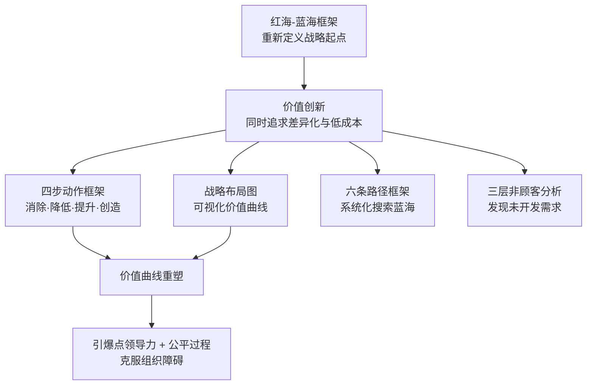
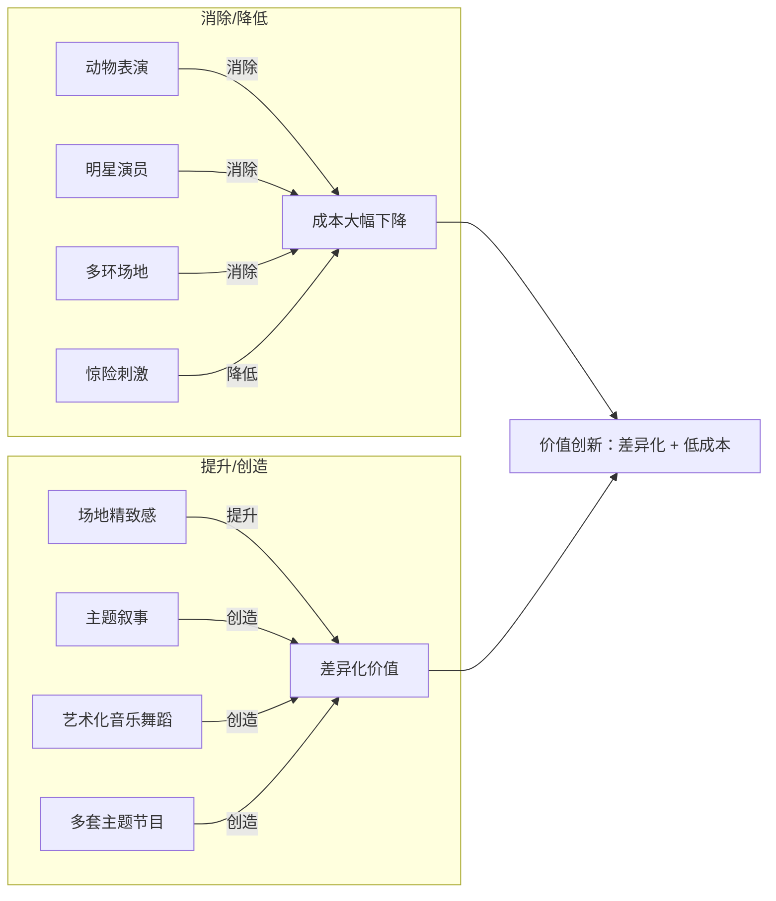

# 《蓝海战略》深度读书笔记

> [!abstract] 全书速览
> 这本书提出了一个核心命题：==最好的竞争方式不是击败对手，而是让竞争变得无关紧要==。作者将商业世界分为"红海"（竞争激烈的现有市场）和"蓝海"（没有竞争的新市场空间），并提出"价值创新"作为开辟蓝海的核心逻辑——通过同时追求差异化和低成本，打破传统战略中"二选一"的假设。全书提供了从概念框架到分析工具到执行方法的完整体系：战略布局图诊断竞争格局，四步动作框架（消除-降低-提升-创造）重塑价值曲线，六条路径框架系统化搜索蓝海机会，三层非顾客分析揭示未被开发的需求，引爆点领导力和公平过程解决执行层面的组织障碍。

## 这本书要解决什么问题

金和莫博涅写这本书的背景是全球化加速、产品同质化加剧、越来越多行业陷入利润侵蚀的价格战。传统战略思维的核心假设是"竞争不可避免"——波特的[[《竞争战略》]]用五力模型分析行业结构、用三种通用战略指导竞争定位，整个框架的逻辑是：==行业结构是给定的，你的任务是在这个结构中找到最好的位置==。

> [!tip] 核心问题
> ==为什么企业必须接受行业结构为既定事实？为什么不能改变行业结构本身，创造一个全新的、没有竞争的市场空间？==

作者发现，企业史上那些真正创造巨额财富的飞跃，很少来自在现有市场中击败对手——而几乎总是来自开辟新的市场空间。福特T型车创造了大众汽车市场，CNN创造了24小时新闻，太阳马戏团创造了新的娱乐品类，苹果iPod/iTunes重新定义了音乐消费——这些跨行业的案例有一个共同特征：它们不是在已知市场中更好地竞争，而是创造了此前不存在的需求。

在战略学谱系中，蓝海战略是对波特竞争战略范式的正面回应。波特解决的是"如何在给定的棋盘上赢棋"，蓝海战略提出的问题是"为什么不换一张棋盘"。两者是不同层面的问题——波特对日常商业决策仍然是必需的，但蓝海战略打开了波特没有覆盖的维度。

## 核心模型地图

三个核心模型层层递进：

- **红海-蓝海框架**：提供思考方向——创造而非竞争。蓝海不等于技术发明，很多蓝海是通过重新定义现有行业边界从红海中"长出来"的
- **价值创新**：提供核心逻辑——通过消除和降低释放成本空间，通过提升和创造投入新价值，==差异化和低成本不再矛盾==
- **工具集**：提供实操路径——战略布局图、四步动作框架、六条路径、非顾客分析、引爆点领导力

> [!note] 模型结构
> 如果你只看到"不要竞争"的口号而忽略了价值创新的逻辑和工具集的方法，你就会把蓝海战略误解为一个空洞的愿景，而实际上它提供的是一套相当完整的战略制定体系。

## 逐层深入

### 红海与蓝海：战略的两个世界

| | 红海 | 蓝海 |
|---|-----|-----|
| 市场空间 | 已知的现存行业 | 尚不存在的新市场 |
| 竞争规则 | 已经确立并被接受 | 尚待定义 |
| 需求 | 被争夺的有限份额 | 被创造出来的新需求 |
| 竞争 | 企业血战争夺市场份额 | 竞争变得无关紧要 |
| 价值-成本 | 差异化或低成本二选一 | 同时追求差异化和低成本 |

> [!warning] 常见误读
> 蓝海不等于技术创新。太阳马戏团、黄尾葡萄酒、西南航空——没有一个是依靠技术突破创造的。它们是通过重新组合已知元素、改变行业边界定义来创造新市场的。蓝海战略也不是说竞争不重要——它说的是除了在现有市场中竞争，还有另一条路。==问题不是"红海还是蓝海"，而是"在你的战略组合中，蓝海思维是否得到了足够的重视"==。

### 价值创新：打破差异化与低成本的权衡

传统战略认为差异化和低成本不可兼得——波特明确警告"夹在中间"的危险。这个权衡基于一个隐含前提：==行业的竞争维度是固定的==。如果维度固定，在同一维度上做得更好确实意味着更高成本。但如果你改变维度本身呢？

价值创新的实现依赖于四步动作框架：

1. **消除（Eliminate）**：行业视为理所当然但顾客不真正看重的因素。太阳马戏团消除了动物表演和明星演员——维护成本极高且争议不断。消除的关键在于挑战行业的"理所当然"——很多因素的存在是历史惯性的产物，顾客并不真正看重它们，但整个行业都在惯性地提供
2. **降低（Reduce）**：行业过度设计、超出顾客需求的因素。黄尾葡萄酒降低了年份标注、酿造工艺描述等复杂性——对目标顾客来说这些不是价值而是障碍。行业内的"军备竞赛"经常导致某些因素被过度投入，但边际价值越来越低
3. **提升（Raise）**：行业标准偏低、未能满足顾客潜在需求的因素。这些因素往往是行业集体忽视的盲区——所有企业都在同一个低水平上竞争，以至于没有人意识到大幅提升它们可以创造显著的差异化价值
4. **创造（Create）**：行业从未提供但顾客实际需要的全新因素。太阳马戏团创造了主题叙事和艺术化音乐舞蹈——传统马戏从未想过要讲故事。创造意味着跳出行业的传统定义，发现全新的价值维度

> [!tip] 四步框架的闭环逻辑
> ==消除和降低释放成本空间，提升和创造利用这些空间投入新价值。==两个方向同步操作，差异化和低成本就不再矛盾。这不是在现有维度上做得"更好"，而是改变维度本身。

> [!warning] 价值创新 vs 技术创新
> 价值创新不等于技术创新。很多技术创新只是让产品在已有维度上变得更好（更快的芯片、更高的分辨率），没有改变竞争维度本身。反过来，很多价值创新不涉及任何新技术——黄尾的酿造工艺没有创新，太阳马戏团的表演技术也不是新的。==价值创新的障碍往往不是技术能力，而是认知惯性。==

### 战略布局图：行业竞争的可视化诊断

横轴列出行业关键竞争因素，纵轴表示各因素上的投入/表现水平。主要竞争者的得分连成"价值曲线"。

> [!example] 红海的视觉特征
> 当所有竞争者的价值曲线形状高度相似——在相同维度上竞争，只是程度略有差异——这就是红海。蓝海的目标是画出一条==形状==完全不同的曲线——不是在现有维度上高出一截，而是出现完全不同的高峰和低谷。
>
> 西南航空的价值曲线：消除餐食、休息室、座位选择，大幅降低票价，同时在航班频率、准点率和友好服务上大幅提升。它的真正竞争对手不是其他航空公司，而是自驾和长途巴士——它创造了"可以飞的公共汽车"市场。

### 六条路径框架：系统化搜索蓝海

每条路径对应一种重新定义行业边界的系统方法：

**路径一：跨越替代性行业。** 大多数企业只关注同行业对手，但顾客做购买决策时考虑的替代选项往往跨越多个行业。想外出放松的人会在餐厅和电影院之间选择——不同行业满足同一需求。NetJets在商业航空和私人飞机之间发现了蓝海——商务旅客需要私人飞机的灵活性但不愿承担完整的购买和维护成本，于是NetJets创造了"分时所有权"模式。这条路径的核心问题：==你的顾客在你的产品和什么替代品之间做取舍？他们为什么犹豫？==

**路径二：跨越战略群组。** 同一行业内通常存在按价格和性能分层的不同战略群组。大多数企业只在自己所属群组内竞争，但顾客经常在不同群组之间流动——有人从高端"降级"想省钱，有人从低端"升级"想更好的体验。理解这种流动的原因可能揭示蓝海机会。雷克萨斯发现了奔驰车主想要的豪华感和丰田车主看重的可靠性之间的蓝海——提供接近奔驰的豪华体验，但拥有丰田级别的可靠性和售后成本。

**路径三：跨越买方链。** 购买决策涉及三类角色：购买者（决定付钱的人）、使用者（实际使用的人）、影响者（影响决策但不参与使用的人）。大多数行业习惯性地只关注其中一类。诺和诺德把注意力从医生（处方决策者）转向糖尿病患者（使用者），发现患者最大的痛点不是药效而是注射的不便和尴尬，于是创造了便携式胰岛素笔——改变了整个行业的竞争维度。

**路径四：跨越互补产品和服务。** 产品很少被孤立使用。看看顾客在使用你产品之前、之中和之后需要什么，那里可能隐藏着巨大的未被满足的需求。公交车制造商Nabi发现公交系统最大的成本不是购买车辆而是维护——传统钢制车身容易锈蚀和凹陷。Nabi用轻质玻璃纤维材料替代钢材，大幅降低维护成本和燃油消耗，同时提升了乘客体验。==关键是把视野从"你的产品"扩展到"顾客使用你产品的整个场景"。==

**路径五：跨越功能与情感导向。** 有些行业传统上靠功能竞争，有些靠情感竞争。逆向操作往往能打开新空间。斯沃琪进入功能导向的低端手表市场，注入强烈的情感元素（时尚设计、季节性新款、色彩丰富），把手表从"计时工具"变成"时尚配饰"。The Body Shop则在情感主导的化妆品行业反向操作，强调功能性成分（天然配方）和去除情感溢价（简约包装、不请明星代言），创造了新的市场空间。

**路径六：跨越时间。** 什么趋势正在对行业产生不可逆转的影响？大多数企业是被动适应趋势，蓝海思维是主动预判趋势的逻辑终点并提前到达那里。苹果在唱片公司还在抵抗盗版时就创造了iTunes——不是等待行业被迫转型，而是主动定义了转型后的市场形态。关键是区分==趋势==（不可逆的变化）和==时尚==（暂时的波动）。

> [!note] 六条路径的共同逻辑
> 都在打破行业默认的边界假设。行业边界不是自然法则，而是参与者的习惯和共识。系统质疑这些假设——替代品的边界、群组的边界、买方角色的边界、产品场景的边界、功能/情感的边界、时间的边界——蓝海机会就可能浮现。
>
> 实用建议：不要试图同时走六条路径。先快速扫描判断哪一两条在你的行业中最有潜力，然后集中精力深入探索。多条路径的交叉点往往是最有价值的蓝海空间——西南航空同时跨越了替代行业、战略群组和功能/情感导向。

### 三层非顾客：增长的最大杠杆

传统战略聚焦如何更好地服务现有顾客——细分市场、精准定位、定制化产品。蓝海战略挑战了这个方向，认为最大增长机会往往不在现有顾客中，而在"非顾客"中：

> [!example] 三层非顾客
> - **第一层——"准非顾客"**：站在市场边缘，偶尔购买但随时可能离开的最小化用户。他们是"不得不用"的人，了解他们的不满和替代倾向，可以揭示改进方向
> - **第二层——"拒绝型非顾客"**：有需求但有意识地选择了其他解决方案。他们不是不知道你的产品，而是知道后拒绝了。==为什么？这个"为什么"往往指向行业的结构性盲区。==黄尾葡萄酒瞄准的正是这一层——觉得葡萄酒太复杂、太装腔作势而选择喝啤酒和鸡尾酒的美国消费者
> - **第三层——"未探索的非顾客"**：从未被行业视为潜在顾客，甚至不在行业的雷达上。Wii瞄准的是从不玩游戏的爷爷奶奶和上班族——在索尼和微软的世界观中，这些人根本不是"游戏玩家"
>
> ==最大的蓝海机会往往来自第二层和第三层。==当整个行业都在争夺15%的现有市场时，真正的增长机会可能在那85%的非顾客中。

> [!tip] 反直觉的战略选择
> 不要过度聚焦于现有顾客的细分需求。传统营销强调市场细分——把顾客分成越来越小的群组，为每个群组提供定制化产品。但蓝海战略认为过度细分会让你的目光越来越窄。==不要问"不同顾客之间有什么差异"（导致更多细分），而要问"不同非顾客群之间有什么共同点"（导向更大的市场创造）。==找到非顾客之间的共同痛点，用一个简洁的价值主张一次性覆盖他们——这比为现有顾客做精细化运营能创造大得多的价值。

### 执行：引爆点领导力与公平过程

四个关键组织障碍及其对策：

1. **认知障碍**：员工看不到变革必要性→让关键人员亲身体验最差的现实（纽约警察局长布拉顿让高级警官乘地铁通勤，亲身感受治安恐惧）
2. **资源障碍**：预算有限→识别"杠杆点"（少投入大产出）并削减"冷点"（大投入低产出），==重新配置而非增加资源==
3. **动机障碍**：员工抵制变革→聚焦"关键影响者"——那些拥有不成比例影响力的人。你不需要推动所有人，只需要找到连接者和说服者
4. **政治障碍**：既得利益者阻挠→在变革初期就进行利益相关者分析，建立支持联盟，孤立最顽固的反对者

> [!tip] 公平过程三要素
> - **参与**（Engagement）：让受影响者参与决策过程
> - **解释**（Explanation）：向所有人说明决策理由
> - **明确期望**（Clarity of Expectation）：清楚界定新规则和标准
>
> ==即使结果对自己不利，如果过程被感知为公平的，人们也更愿意配合。==反过来，即使结果有利但过程不公平（暗箱操作、假咨询），信任和合作也会被破坏。

## 核心案例

### 太阳马戏团

结果：创造了介于马戏和戏剧之间的新品类。竞争对手从其他马戏团变为百老汇和歌剧。顾客从带孩子的家长变为愿意为高质量成人娱乐付高价的都市消费者。==票价是传统马戏的数倍，但成本结构反而更低。==

### 黄尾葡萄酒

美国酒类消费者中只有==不到15%==喝葡萄酒，其余85%喝啤酒和鸡尾酒。黄尾发现：非顾客不喝葡萄酒的障碍不是价格，而是==复杂性==。

- **消除**：酿酒术语、年份标注的重要性、复杂的品类分级
- **降低**：口味复杂性和单宁强度、葡萄园声望的权重
- **提升**：适中价格定位（不心疼也不掉价）
- **创造**：易饮性（柔和水果风味）、易选性（只有两个品种）、包装趣味性（袋鼠标签、亲切品牌形象）

> [!note] 跨行业竞争
> 黄尾的竞争对手不是其他葡萄酒，而是啤酒和鸡尾酒。上市两年内成为美国最畅销的进口葡萄酒品牌。

### 任天堂Wii

索尼和微软在硬件性能上军备竞赛，争夺约3000万"核心玩家"市场。

- **消除**：对最新硬件技术的追求（处理器性能约PS3的十分之一）
- **降低**：图形渲染能力、游戏复杂度
- **提升**：价格友好度（==249美元==，比对手便宜近一半）
- **创造**：体感控制（零学习门槛）、全家参与的游戏体验

Wii重新定义了"谁是玩家"——把数亿从不玩游戏的人变成新顾客。索尼和微软无法跟进，因为走低性能路线会失去核心玩家基本盘。

## 理论对话

### 与波特[[《竞争战略》]]

波特的核心框架建立在两个前提上：行业结构是给定的（至少中短期内），企业任务是在给定结构中选择定位（成本领先、差异化或聚焦）。波特明确警告"价值-成本权衡"——差异化意味着更高成本，低成本意味着更少差异化，试图两者兼得会"夹在中间"。

蓝海战略正面挑战了这两个前提。第一，行业结构不是给定的，它可以被重新定义——行业边界是参与者的习惯和共识，不是自然法则。第二，差异化和低成本的权衡不是绝对的——如果你改变竞争维度本身而非在现有维度上做得更好，两者可以同时实现。

> [!note] 互补而非替代
> 波特分析"在给定结构下如何竞争"——这对日常决策仍是必需的。蓝海战略探讨"如何改变结构本身"——这是更高层面的思考，但不是每个企业在每个时刻都能做到的。大多数企业大多数时候需要在红海中有效竞争（波特），同时保持对蓝海机会的敏感性（金和莫博涅）。==一个成熟的战略思考者会把两者视为互补而非替代：波特帮你理解当前的竞争格局，蓝海战略帮你看到超越当前格局的可能性。==

### 与克里斯坦森[[《创新者的窘境》]]

两者有显著重叠但侧重点不同。共同点：都关注新市场创造，都关注非顾客（克里斯坦森称之为"低端用户"和"新市场用户"），都认为最大的机会不在与现有竞争者正面交锋。

差异：颠覆式创新更关注技术路径和市场动态——一个低端的"够用就好"的产品如何逐步改进并最终颠覆高端在位者。蓝海战略更关注价值重构——如何通过四步动作框架主动设计新市场。颠覆式创新描述的是一个自下而上的市场动态过程，蓝海战略提供的是一个主动设计的战略方法。颠覆式创新隐含了"攻击者vs在位者"的博弈框架，蓝海战略则试图超越竞争框架本身——它关心的不是如何颠覆谁，而是如何创造没有竞争的新空间。

克里斯坦森还解释了蓝海战略没有充分讨论的一个关键问题：==为什么大企业很难做到蓝海战略？==答案是现有顾客和价值网络锁定了在位者的战略方向，使他们无法拥抱颠覆性的价值重构。

### 与蒂尔[[《从0到1》]]

共享"创造而非竞争"的核心理念——蒂尔的名言"竞争是失败者才做的事"与蓝海战略的"让竞争变得无关紧要"遥相呼应。但蒂尔更激进——不仅主张避免竞争，还主张通过创新建立垄断。蒂尔认为"垄断利润是创新的最大激励"，这为蓝海可持续性问题提供了不同思考角度：==也许蓝海的真正目标不只是创造新市场，而是在新市场中建立难以撼动的垄断地位。==

### 与德鲁克创新理论

德鲁克强调创新必须以顾客为中心（而非技术为中心），需要"有组织地放弃"过时的产品和做法。蓝海战略与德鲁克高度一致——价值创新的起点是顾客价值而非技术能力，四步动作框架中的"消除"和"降低"正是"有组织地放弃"的操作化。但蓝海战略走得更远：它不仅说"要放弃"，还说"放弃什么可以为创造什么腾出空间"——这个"释放-再投入"的闭环逻辑，是蓝海战略对创新理论的独特贡献。

## 预测与现实

蓝海战略的核心预测——通过价值创新开辟新市场空间的企业能获得超额回报——在出版后的近二十年中得到了相当多的验证。苹果的iPhone（2007年）通过触控界面重新定义了手机，创造了智能手机市场。Airbnb（2008年）在酒店和出租公寓之间发现了蓝海，创造了"共享住宿"品类。Uber（2009年）在出租车和私人司机之间开辟了新空间。Netflix从DVD邮寄到流媒体的转型（2007年开始）重新定义了影视消费。这些案例都可以用蓝海战略的框架来分析——它们都通过重新定义行业边界和价值维度，创造了全新的市场空间。

但也有需要打折扣的地方。蓝海变红的速度被严重低估了。Wii开辟的休闲游戏市场在几年内就被智能手机游戏侵蚀。黄尾的成功引来了大量模仿者，其独特性迅速被稀释。太阳马戏团本身在2017年也遭遇了严重的财务困难。==这说明创造蓝海是一件事，维持蓝海是另一件事，而后者可能更难。==

## 这本书的保质期

**依然强大：** 价值创新的核心逻辑——通过重新定义竞争维度同时追求差异化和低成本——经受住了时间考验。四步动作框架和战略布局图作为分析工具至今仍然实用。"不要把行业边界视为不可改变的约束"这个思维转换，对任何时代的战略思考者都有价值。

> [!warning] 需要修正的地方
> - ==蓝海变红的速度被低估==——Wii的市场被智能手机游戏侵蚀，黄尾引来大量模仿者，太阳马戏团本身在2017年也遭遇财务困难。也许更现实的思路是建立持续发现和创造新蓝海的组织能力，而非期望一片蓝海永远蓝色
> - 幸存者偏差严重——150个案例全是成功者，失败率未知。对于每一个成功的太阳马戏团，可能有十个甚至百个尝试了"价值重构"但失败了的企业
> - 行业适用性有限——大宗商品（钢铁、石油）、严格监管行业（金融、医药的某些领域）、技术密集型行业（半导体制造）重新定义价值维度的空间可能很小
> - 对竞争的贬低可能过度——现实中企业必须同时经营红海（维持现金流和基本盘）和探索蓝海（寻找增长引擎）。完全忽视竞争可能导致现有业务衰落，而现有业务恰恰是探索蓝海的资源基础
> - "蓝海如何防御"的讨论相对薄弱——书中提到品牌壁垒、认知壁垒和经济壁垒，但这些壁垒在快速变化的商业环境中持久性值得怀疑
> - 执行的难度被低估——组织惯性、既有利益结构、文化阻力的顽固程度，往往需要在实践中才能真正体会到

## 行动工具箱

**战略布局图诊断。** 列出行业关键竞争因素，画出主要竞争者和你自己的价值曲线。如果所有曲线形状高度相似——这就是红海的信号。问自己：你的曲线和竞争者有质的差异还是只有量的差异？

**四步动作分析。** 对你的产品或服务逐一检查：哪些因素可以消除（它们真的是顾客需要的吗？），哪些可以降低（行业是否过度设计了？），哪些应该提升（顾客有什么被忽视的痛点？），哪些可以创造（有什么全新的价值维度可以被引入？）。

**非顾客探测。** 你的行业有多少非顾客？他们为什么不买？障碍是什么？这些障碍中有哪些可以被消除？消除后市场会变大多少？

**六条路径搜索。** 系统化检查：替代行业的边界在哪里？买方链中谁被忽视了？功能和情感的导向可以反转吗？什么趋势正在不可逆转地改变行业？

**执行准备。** 识别四重障碍在你的组织中的表现形式：谁是认知的盲区？资源的杠杆点和冷点分别在哪里？关键影响者是谁？最顽固的反对者和最可靠的支持者分别是谁？

## 延伸阅读

- [[《竞争战略》]]：波特的经典之作，蓝海战略最直接的对话对象。如果蓝海战略告诉你"可以跳出竞争"，波特告诉你"在不得不竞争时如何赢"
- [[《创新者的窘境》]]：从另一个角度解释市场创造——颠覆式创新如何从低端和边缘重新定义行业。补充了"为什么蓝海对大企业特别难"的问题
- [[《从0到1》]]：与蓝海战略共享"创造而非竞争"理念，但更聚焦于技术驱动的垄断式创新
- [[《定位》]]：两者都认为"开辟新品类"比"在已有品类中竞争"更有效，但定位聚焦认知层面，蓝海战略聚焦战略层面
- [[《好战略，坏战略》]]：提供战略思维更底层的逻辑，补充蓝海战略在"如何判断一个蓝海机会是否真实"上的不足
