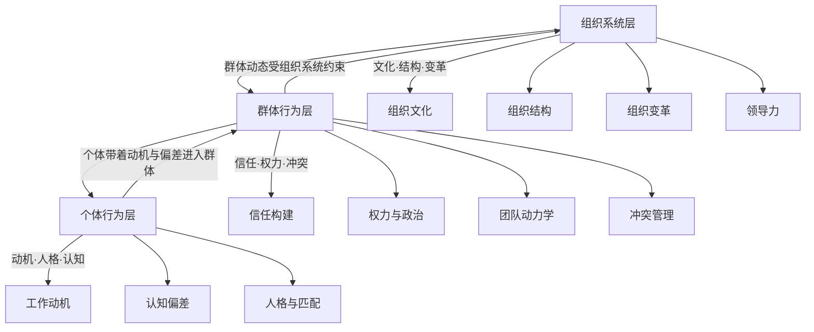
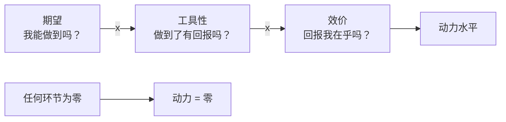
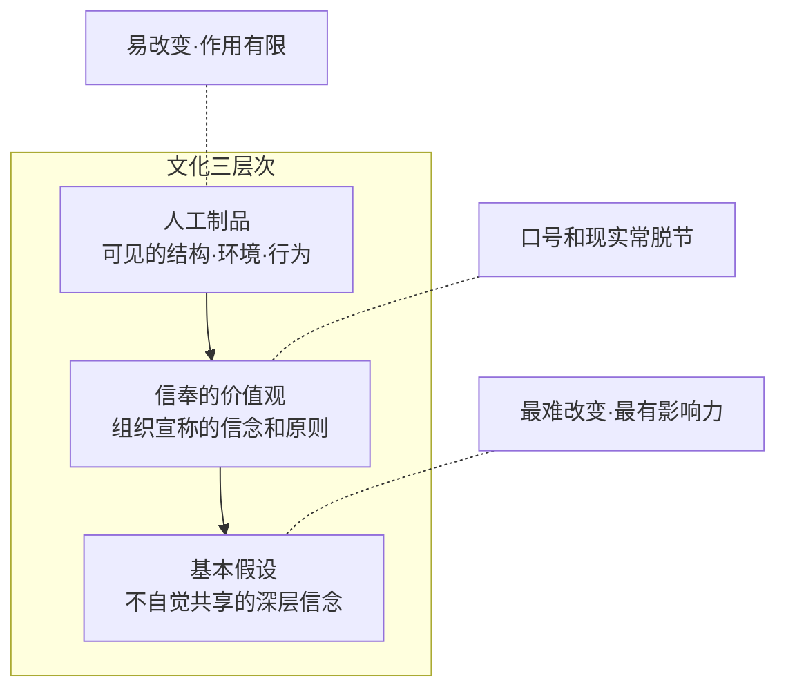

# 《认识组织行为》深度读书笔记

> [!abstract] 全书速览
> 这本书的核心使命是帮助管理者回答一个看似简单却极难回答的问题——为什么人在组织中会这样行事？忻榕和琼·皮尔斯（Jone L. Pearce）将组织行为学数十年的实证研究转化为管理者可以日常使用的诊断框架。全书围绕个体、群体和组织三个层次展开，从动机与认知偏差讲起，到信任、权力与团队动力学，再到组织文化和变革管理，层层推进。它的底层理念是"循证管理"——管理决策应建立在最佳可得证据的基础上，而非依赖直觉或流行趋势。理解了人的行为规律，管理动作才能从碰运气变成有据可循。

## 核心命题

这本书要回答的根本问题是：**管理者如何通过理解人的行为规律来提升管理效能？**

这个问题之所以重要，是因为绝大多数管理困境的本质都不是技术问题，而是人的问题。你推行了一套精心设计的绩效考核制度，员工却在想办法钻空子；你组建了一支精英团队，成员却各怀心思、难以协作；你宣布了组织变革方案，中层干部却在暗中抵制。这些场景在每一家公司里反复上演，根源都在于管理者对"人在组织中为什么这样做"缺乏基于证据的理解。

忻榕和皮尔斯的核心主张可以概括为三层：

第一层，==管理的本质是理解人==。技术、流程、制度都是工具，而工具的效力取决于使用它们的人。如果你不理解人的动机、认知和社会行为模式，再好的管理工具也会失效。

第二层，人的行为有规律可循。组织行为学不是心灵鸡汤，而是建立在大量实证研究基础上的行为科学。人为什么抵触变革、为什么在群体中偷懒、为什么感到不公平时消极怠工——这些都有经过验证的解释模型。

第三层，理解规律是为了更好地行动。这本书不满足于学术分析，它的终极目标是让你成为一个更高效的管理者。每一个理论框架背后都指向一个实践问题：知道了这个，你该怎么做？

> [!tip] 核心洞察
> 这本书挑战了商业世界的一个普遍假设——好的管理等于好的流程和制度设计。忻榕和皮尔斯告诉你，制度的背后是人，理解人才是管理的起点。而这种理解应该建立在证据而非直觉的基础上——这就是==循证管理==的核心信条。

## 框架全景

全书的架构遵循组织行为学的经典逻辑：从微观到宏观，从个体到系统。

最底层是**个体行为**。这是整个大厦的地基。作者首先处理个体差异问题——人格特质、价值观、态度如何影响工作表现。接着深入到动机的核心：人究竟为什么工作？薪酬、成就感、归属感、自主权，这些力量如何交织作用？然后是认知与决策——人如何感知信息、如何形成判断、又如何在判断中系统性地犯错？

中间层是**群体行为**。当两个以上的人开始协作，全新的动态涌现出来。信任如何建立和破坏？权力的真正来源是什么？团队为什么有时候比个人更聪明，有时候却比个人更愚蠢？冲突是该避免还是该引导？这一层的核心议题是人际互动中涌现出的规律。

最上层是**组织系统**。组织文化如何形成并塑造行为？组织结构的设计如何影响信息流动和决策效率？当外部环境剧变时，组织变革为什么如此困难？领导力在这整个系统中扮演什么角色？

这三个层次不是割裂的，而是==相互嵌套==的。个体带着自己的动机和认知偏差进入群体，群体动态又受到组织系统的约束和塑造，而组织系统归根结底是由一个个具体的人创建和维系的。理解这种嵌套关系，是理解组织行为学全貌的关键。

## 核心观点深度解读

### 一、循证管理：方法论基底

本书最独特的贡献不是某个具体理论，而是它的方法论立场——==循证管理==（Evidence-Based Management）。

循证管理的灵感来自循证医学。就像医生不应该凭"师傅是这么教的"来开处方，管理者也不应该凭直觉或流行观点来做关于激励、选人、团队和变革的决策。循证管理的核心流程是：提出问题、收集证据、评估证据质量、基于证据做决策、跟踪验证效果。

> [!note] 关键方法论概念
> - **元分析（Meta-Analysis）**：综合多项独立研究结果的统计方法，比任何单项研究都更可靠。书中引用的核心数据（薪酬与绩效的相关系数、责任心对工作表现的预测力等）多来自元分析
> - **效应量（Effect Size）**：衡量某因素影响大小的指标，帮你判断一个统计上"显著"的发现在实践中是否真正重要

循证管理不等于照搬研究结论。研究提供的是"一般规律"和概率趋势，管理者需要判断这些规律是否适用于自己的具体情境。但它要求你在做决策之前先问一个关键问题："我的证据在哪里？"

### 二、动机不是一个开关，而是一个精密的系统

这可能是全书最核心的章节。忻榕和皮尔斯对动机问题的处理，避开了管理实践中最常见的陷阱——把"激励员工"简化为"发奖金"。

书中系统梳理了多个动机理论，但核心信息是：==人的工作动机是多元的、动态的、因人而异的==。

**期望理论**给出了动机的一个精确公式：**动力 = 期望（我能做到吗？） x 工具性（做到了会有回报吗？） x 效价（这个回报我在乎吗？）**。这三个环节中任何一个为零，动力就是零。一个员工觉得自己无论怎么努力都达不到目标（期望为零），他不会有动力；他觉得达到目标了公司也不会兑现承诺（工具性为零），他也不会有动力；他觉得公司给的奖励自己并不在乎（效价为零），同样不会有动力。

元分析数据显示，==薪酬与工作绩效的相关系数约为0.3==，绩效工资的效果显著高于固定工资。金钱确实是有效的激励因素，但它不是万能的。

赫茨伯格的双因素理论揭示了一个反直觉的事实：让人不满意的因素和让人满意的因素，不是同一组东西。薪酬、办公环境、公司政策属于"保健因素"——做得不好会让人不满，但做得再好也只是消除不满，并不能真正激发动力。真正的激励因素是成就感、认可、工作本身的挑战性、成长机会和责任。

> [!tip] 关键洞察
> 加薪能止痛但不能治病。想让人真正投入工作，你得在工作本身上下功夫。

公平理论引入了"比较"的维度。人不是在真空中评估自己的收入和待遇，而是在和参照对象的比较中感知公平。一个年薪50万的员工，如果发现做同样工作的同事拿60万，他的满意度可能比年薪30万但在团队中最高的人还低。更关键的是，当人感到不公平时，他不会老老实实地跟你谈判，而是会自发地"恢复公平"——减少努力、降低质量、增加请假，甚至离职。

目标设置理论补充了另一个维度：==具体且有挑战性的目标比"尽力而为"更能提升绩效==。但前提是员工必须接受这个目标——强加的、不合理的目标不但不能激励，反而制造焦虑和反感。

> [!warning] 边界条件
> 没有单一的万能激励法。你需要理解每个人的动机结构，然后设计个性化的激励组合。这对管理者的要求是很高的——它需要你真正了解你的团队成员。

### 三、人格与匹配：选对人比改变人更高效

大五人格模型把人格分为五个维度：开放性（Openness）、责任心（Conscientiousness）、外向性（Extraversion）、宜人性（Agreeableness）、神经质（Neuroticism）。

> [!example] 关键元分析发现
> - ==责任心是唯一对所有岗位都有正面预测作用的特质==（r约0.22-0.31）
> - 外向性对销售岗位预测力强，对技术岗位预测力弱
> - 一个安静内向的程序员不一定比外向的程序员表现差

书中提出的"三重匹配"模型把选人视角大幅拓展：

| 匹配类型 | 定义 | 预测结果 |
|----------|------|----------|
| 人-岗匹配 | 能力与岗位要求的契合 | 工作绩效 |
| 人-组织匹配 | 价值观与组织文化的契合 | 组织承诺、留任意愿 |
| 人-团队匹配 | 个人风格与团队氛围的契合 | 协作效率 |

> [!warning] 匹配陷阱
> 一个能力很强但价值观与组织相悖的人，可能比能力一般但高度匹配的人造成更大的问题——他可能短期绩效很好，但长期会腐蚀团队文化，或在关键时刻做出与组织利益相悖的选择。

### 四、认知偏差：管理者必须面对的系统性错误

这一部分是全书中最具实操价值的章节之一。忻榕和皮尔斯系统展示了人在组织中的认知偏差如何悄无声息地扭曲管理决策。

首先是知觉的选择性。人不是被动地接收信息，而是主动地"筛选"和"建构"信息。你的经验、期望、情绪状态、甚至你的立场，都会影响你看到什么、忽略什么。同一场会议，销售经理和财务经理听到的重点可能完全不同——不是因为谁不认真，而是他们的"知觉滤镜"不一样。

==归因偏差==是最具破坏力的系统性错误：

- **基本归因错误**：把别人的失败归因于个人能力（"他就是不够努力"），把自己的失败归因于外部环境（"市场太差了"）
- **自我服务偏差**：项目成功了归功于自己，失败了归咎于别人
- **晕轮效应**：因某人某方面出色，就高估他在所有方面的能力
- **确认偏差**：倾向于寻找支持自己已有判断的证据
- **首因效应**：最先获得的信息对判断影响最大

> [!note] 量化证据
> ==面试官在最初4分钟就形成对候选人的印象，后续信息几乎无法改变。==非结构化面试的预测效度只有0.2左右，结构化面试可以提升到0.5以上。经验丰富的面试官往往更自信，但研究显示他们的判断准确率并不比新手高多少——自信不等于准确。

> [!tip] 管理实践启示
> 这些认知偏差的意义不是"知道就好"，而是需要你建立系统性的纠偏机制——用结构化流程约束大脑的"随意发挥"，用数据而非印象做判断，主动寻求不同意见，在重要决策前"暂停"一下问自己"我是不是在犯归因错误"。

### 五、信任：组织的隐性基础设施

信任是组织高效运作的基石。它降低交易成本，促进知识共享，增强员工承诺。==高信任组织的员工流失率比低信任组织低50%以上。==但信任是脆弱的，建立需要时间，破坏只需一瞬间。

信任的三个可操作维度：

1. **能力信任**：展示专业能力，证明你"能做到"
2. **正直信任**：言行一致、信守承诺，证明你"说到做到"
3. **善意信任**：对他人利益真诚关心，证明你"为他人着想"

三个维度在不同情境中权重不同。在技术团队中，能力信任可能是首要的；在需要高度协作的团队中，善意信任更关键；在管理变革中，正直信任至关重要。

> [!tip] 核心洞察
> 管理者应该==先证明自己值得被信任，而非要求员工先信任自己==。信任不是一种态度，而是一种行为的积累结果。

### 六、权力与组织政治：房间里的大象

很多管理教科书回避权力和政治这个话题。忻榕和皮尔斯的处理方式更诚实——权力和政治是组织生活的基本事实，回避它不如理解它。

权力的五种来源：

**位置权力（租来的）**：
- 法定权力：来自职位
- 奖赏权力：能给予奖励
- 强制权力：能施加惩罚

**个人权力（自己的）**：
- 专家权力：来自专业能力
- 参照权力：来自人格魅力和他人认同

> [!tip] 核心洞察
> 在现代知识型组织中，==位置权力的效力正在下降==。你能命令一个程序员上班，但你不能命令他有创造力。研究显示，使用"理性说服"的影响策略成功率最高（约80%）——在大多数情况下，讲道理比压权力更有效。

组织政治也被坦率讨论。政治行为不一定是坏事——当正式渠道不够用时，它有时是推动事情前进的必要手段。但当政治行为变成损人利己，它就会严重腐蚀组织信任。

### 七、团队动力学：1+1为什么不一定等于2

这是全书从个体跨入群体层面的关键转折。团队绩效为什么不等于成员能力的简单加总？

==社会懈怠==（Social Loafing）是第一个被拆解的现象。当个人在群体中工作、且个人贡献难以识别时，人会不自觉地降低努力程度。拔河实验证明：三个人一起拔河，每个人的出力只有单独拔河时的80%左右。在组织中，大型团队、职责模糊、个人贡献不可见的项目，都是社会懈怠的高发区。

对策不是道德说教，而是结构设计：缩小团队规模（最佳5-9人，超过10人效率显著下降）、明确个人责任、让每个人的贡献可见可衡量。

==群体思维==（Groupthink）是另一个致命陷阱。当团队高度凝聚、成员背景相似、且有强势领导者时，团队会追求一致性而压制异见，直到做出灾难性决策。历史上的猪湾事件和哥伦比亚号航天飞机失事都被归因于群体思维。

忻榕和皮尔斯强调，高效团队不是没有冲突的团队，而是能够区分"任务冲突"和"关系冲突"的团队。任务冲突——对工作本身的不同意见——在适度范围内是有益的。关系冲突——人际间的摩擦和敌意——则几乎总是有害的。管理者的工作不是消除所有冲突，而是鼓励建设性的任务辩论，同时遏制破坏性的关系冲突。

> [!example] 团队发展阶段（塔克曼模型）
> 新团队通常经历四个阶段：
> 1. **形成期**：相互了解、客客气气
> 2. **震荡期**：分歧和冲突出现
> 3. **规范期**：建立共同的工作方式和规则
> 4. **执行期**：真正高效运转
>
> 很多管理者在震荡期就慌了——"团队怎么开始内斗了？"其实这是正常发展过程。冲突未解决会卡在震荡期；新成员加入可能使团队回到震荡期。

对抗群体思维和信息瀑布的结构化工具：

- 让每个人在讨论前==独立写下==自己的分析（避免先发言者锚定后续意见）
- 轮流指定**"唱反调"角色**，系统性测试方案的稳健性
- 在决策执行前做**"事前验尸"**——假设一年后这个决策彻底失败了，推演最可能的失败原因

### 八、领导力：不是英雄主义，而是情境适应

全书对领导力的处理避开了"领导力鸡汤"的套路，保持了学术扎实性和实践导向的平衡。

领导力研究的演变脉络：特质理论（领导者天生的）→ 行为理论（关怀 vs 结构两个维度）→ 权变理论（没有普适的最佳风格）→ 变革型领导力。

**权变理论**指出，==没有放之四海而皆准的领导风格==。路径-目标理论给出了实用框架：领导者的工作是帮助下属看清达成目标的路径，并清除路上的障碍。根据下属能力和任务特征，应在指令型、支持型、参与型和成就导向型之间灵活切换。

**变革型领导力**的四个要素：
- **理想化影响**：以身作则，成为榜样
- **鼓舞性激励**：描绘愿景，激发热情
- **智力激发**：挑战假设，鼓励创新思维
- **个性化关怀**：因材施教，支持成长

元分析显示，==变革型领导与员工绩效的相关系数约为0.44==，属于强相关。

> [!warning] 边界条件
> 变革型领导力不是万能的——在高度规范化的行业（如航空安全、核电运营），过度"变革"可能带来风险；在团队已经高度自驱的情境下，变革型领导的强势愿景可能反而压制了下属的自主性。领导力始终是情境性的。领导力的本质不是英雄主义，而是服务——服务于团队目标和成员发展。

### 九、组织文化：看不见的操作系统

忻榕和皮尔斯对组织文化的讨论是全书中最具战略视野的部分。

文化被定义为组织成员共享的基本假设、价值观和行为规范。它像一个隐性的操作系统——你不一定能清晰地描述它，但它无时无刻不在影响着组织中每个人的行为方式。

沙因（Edgar Schein）的文化三层次模型：

- **人工制品**（最表层）——可见的组织结构、办公环境、着装规范、会议方式
- **信奉的价值观**（中间层）——组织公开宣称的信念和原则
- **基本假设**（最深层）——组织成员不自觉共享的、被视为理所当然的信念

> [!warning] 文化陷阱
> 很多组织的文化问题出在中间层和最深层之间的不一致。一家公司可能宣称"我们鼓励创新"（信奉的价值观），但基本假设却是"犯错是不可接受的"。员工会快速学会：老板嘴上说鼓励创新，但你最好别真的去冒险。
>
> 判断标准：想知道公司真正的文化，不要看墙上贴的标语，而要看三件事——==谁被提拔了？谁被奖励了？什么行为被容忍了？==

文化的形成受创始人和早期领导者影响最大。但文化一旦形成，就会产生强大的惯性。改变组织文化通常需要5到10年，而且需要从最深层的基本假设入手，光改标语和制度是没用的。

### 十、组织变革：为什么所有人都知道该变，却没人真的变

这是全书最贴近管理实战的章节。

==变革失败的最大原因不是方案不好，而是低估了人的抗拒。==抗拒不是因为员工"不理性"，而是因为变革打破了熟悉的确定性——即使现状很糟，至少是可预测的；而变革带来的新状态充满未知。更重要的是，变革往往意味着对既有权力格局和利益分配的重新洗牌。

勒温（Kurt Lewin）的变革三阶段模型——==解冻、变革、再冻结==——提供了基本框架：

- **解冻**：让人意识到"不变更危险"，制造不适感，让现状问题变得明显且紧迫
- **变革**：提供清晰方向和资源支持。最易出错的是"宣布变革但没有资源支持"——员工会判断出"公司嘴上说说而已"
- **再冻结**：通过制度、流程和激励机制把新方式固化为新习惯。没有制度化，团队会在压力下回退到旧习惯

变革阻力的来源：
- **个人层面**：习惯、安全感、经济因素、对未知的恐惧
- **组织层面**：结构惯性、权力格局、资源配置、已有的成功模式

> [!tip] 核心洞察
> 成功的变革需要同时做好两件事：==创造紧迫感（让人觉得不变不行），以及建立安全感（让人觉得变了之后不会更糟）==。只有紧迫感没有安全感，人会恐慌而非行动；只有安全感没有紧迫感，人会安于现状。
>
> 变革沟通不是"一次性宣讲"，而是"持续对话"。不同阶段解决不同的心理问题：初期解决"为什么要变"，中期解决"具体怎么变"，后期解决"变了之后我怎么办"。

## 保质期

这本书融合了组织行为学数十年的经典研究成果，其中相当一部分观点具有跨时代的生命力。

**持久有效的部分**：期望理论的动机诊断框架、认知偏差对管理决策的系统性影响、结构化面试的优势、社会懈怠和群体思维的基本规律、任务冲突与关系冲突的区分、信任三维度模型、权力来源分析框架、组织文化的三层次模型、变革阻力的分析——这些都是经过大量实证检验的基本规律，不会因为商业环境的变化而过时。

**需要更新的部分**：远程办公、平台化组织、零工经济等新型组织形态改变了部分动态。社会懈怠在远程分布式团队中的表现形式可能不同于实体办公室；权力来源在网络化组织中的权重也在变化——信息权力在数字时代更重要，法定权力的影响力进一步下降。

> [!warning] 需要谨慎对待
> 书中引用的一些经典心理学实验在近年来面临复制危机挑战。虽然核心结论大多仍然成立，但效应量可能不如最初报告的那么大。另外，书中的研究以西方（尤其是美国）组织为主要样本，在不同文化背景下（如东亚高权力距离文化、集体主义文化），某些结论的适用性需要打折扣。忻榕的中国背景在一定程度上弥补了这个不足，但全书的理论基础仍以西方研究为主。

## 行动工具箱

**工具一：期望理论动机诊断**。下次发现下属"没有动力"时，用三个问题逐一排查：他是否相信自己能做到？他是否相信做到了会有回报？这个回报是否是他真正想要的？

**工具二：归因纠偏暂停**。在做绩效评估时，强制暂停30秒，问自己："如果换一个同样能力的人在同样条件下，他会做得更好吗？"如果答案是"不一定"，问题可能不在个人，而在环境和制度。

**工具三：结构化面试设计**。为每个岗位预设5-8个行为性问题，准备统一评分标准，多位面试官独立评分后汇总。预测效度从0.2提升到0.5以上。

**工具四：团队健康检查**。每季度问团队三个问题：（1）你们能自由表达不同意见吗？（2）你们清楚个人贡献如何被衡量？（3）你们对团队目标的理解是否一致？检测群体思维、社会懈怠和协调效率。

**工具五：权力地图绘制**。面对跨部门项目，先画一张"权力地图"——谁有决策权？谁掌握关键专业知识？谁是大家信任的人？谁控制关键信息？先搞清楚这些，再设计推进策略。

**工具六：变革就绪度评估**。启动变革前，评估两个维度：紧迫感（"不变不行"？）和安全感（"变了不会更糟"？）。只有两个维度同时到位，变革才能真正启动。

## 延伸阅读

如果你对认知偏差的底层心理学机制感兴趣，[[《思考，快与慢》]]对人的认知偏差有更深入和系统的剖析，能帮你更好地理解本书中认知偏差部分的底层逻辑。

如果你更关注领导力和组织变革的实操，[[《领导变革》]]是极佳的补充。科特的"变革八步法"可以看作本书变革理论在实操层面的细化和延伸。

如果你想深入理解组织文化的深层结构，[[《组织文化与领导力》]]是这个领域的开山之作。

如果你对动机和内在驱动力感兴趣，[[《驱动力》]]把自主性、胜任感和关联感讲得更透彻，案例更丰富。

如果你需要学科的全面系统框架，[[《组织行为学》]]（斯蒂芬·罗宾斯）是经久不衰的标准教材。
