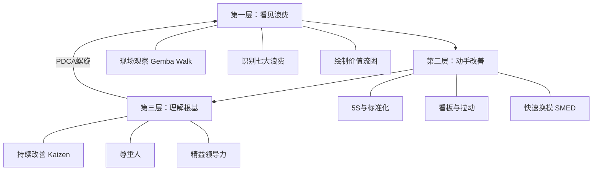
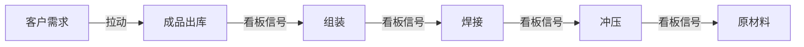
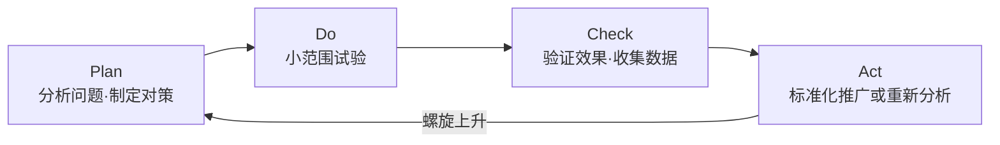
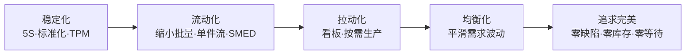

# 《金矿》深度读书笔记

> [!abstract] 全书速览
> 弗雷迪·伯乐和迈克·伯乐的《金矿》用商业小说的形式，讲述了一家濒临倒闭的汽车零部件工厂如何通过精益生产实现逆转的故事。书名"金矿"有双重含义：工厂里隐藏的浪费是等待挖掘的金矿，每一个暴露出来的问题本身也是一座金矿。==精益的两大支柱——"持续改善"和"尊重人"——不是生产技术，而是组织哲学。==工具可以照抄，但如果领导者不愿走到现场、不愿倾听一线、不愿把问题当机会，任何工具最终都会沦为摆设。

## 核心命题

精益生产在全球制造业推行了几十年，但大多数企业的精益导入以失败告终。失败的原因不是工具不好使，而是实施者把精益理解成了一套"降本增效的技术包"——照搬看板、5S、价值流图，但没有触及精益真正的内核。

> [!tip] 本书要解决的问题
> ==精益不是一套工具，而是一种看待工作的方式==——它要求你用"价值"而非"忙碌"来衡量一切行为，用"系统"而非"个人"来分析一切问题，用"尊重"而非"控制"来激发一切改善。

弗雷迪·伯乐亲历了丰田生产方式（TPS）从日本向欧洲传播的过程，在雷诺汽车任高管期间目睹了无数企业"学精益"只学皮毛的失败。迈克·伯乐作为管理学博士，将父亲的实践经验转化为可传播的叙事。两人选择商业小说的形式，基于一个判断：精益的核心难点不在"不知道方法"，而在"不愿改变习惯"。教科书能传递知识，但只有让读者代入角色、经历困境、感受冲突，才可能触动改变的意愿。

## 框架全景

> [!note] 三层学习架构
> 全书的叙事线索是一个转型故事，暗含严谨的学习架构。读者跟随主人公菲尔经历三个阶段，每个阶段对应精益思想的一个层次。三个层次不是递进后就不回头的——在实际操作中，你会不断在"看见问题""动手改善""反思根基"之间循环往复。

**第一层：看见浪费——建立新的认知框架。** 菲尔继承了父亲的汽车零部件工厂，面临客户投诉激增、库存积压、现金流告急等多重危机。父亲的老友鲍勃——一位精益专家——不看报表，直接走进车间，用尖锐的提问揭示了菲尔视而不见的浪费。这个阶段的核心认知：你以为的"正常"运营中，可能有99%以上的活动不为客户创造价值。

**第二层：动手改善——在实践中掌握工具。** 从5S整理到标准化作业、看板系统、拉动生产，鲍勃带领团队一步步导入精益工具。每个工具都不复杂，真正的挑战在于它要求每个人改变日常习惯。鲍勃不厌其烦地重复：改善不是一次性的项目，而是永无止境的日常。

**第三层：理解根基——从工具上升到哲学。** 当运营指标改善后，鲍勃将对话推向更深层：==持续改善（Kaizen）和尊重人（Respect for People）是丰田生产方式的两大支柱==。如果你只学工具不学这两个根基，精益推行不会超过两年。

## 核心观点深度解读

### 一、"去现场看"——管理者最被忽视的基本功

鲍勃到工厂做的第一件事，不是开会、不是看报表，而是走进车间站着看。他把这叫做"现场"（Gemba）——实际工作发生的地方。他带菲尔在车间里走了整整一个上午，一边走一边提问：

- 这堆物料在这里放了多久？
- 工人为什么要走到那边去拿工具？
- 这批半成品为什么在等待？
- 这些成品为什么不出库？

> [!warning] 看到什么取决于你用什么框架去看
> 没有精益的"透镜"，你走进一家忙碌的工厂，看到的是"大家都在努力工作"。戴上精益的"透镜"再走一遍，你看到的可能是"90%的活动不创造任何客户价值"。==差别不在客观事实，而在认知框架。==

"去现场看"不只是信息获取方式，更是一种管理姿态。它传递的信号是：我重视你做的工作，我愿意花时间理解你的实际困难，决策应该基于事实而非假设。

现场观察的关键原则：==带着问题去，不带着答案去。== 如果员工感觉你来现场是为了"抓毛病"，他们会本能地掩盖问题；如果他们感觉你来是为了"一起想办法"，他们会主动暴露问题。

### 二、七大浪费：给"效率直觉"重新编程

大野耐一在几十年实践中归纳的七种基本浪费形式：

| 浪费类型 | 工厂中的表现 | 根源 | 隐蔽性 |
|----------|--------------|------|--------|
| 过度生产 | 生产过多形成库存 | 预测不准、批量思维 | 最高——掩盖其他所有问题 |
| 等待 | 人等机器、机器等物料 | 流程不畅、计划失调 | 中等——常被"做别的事"掩盖 |
| 运输 | 物料搬来搬去 | 布局不合理 | 高——看起来像"在干活" |
| 过度加工 | 做了客户不需要的精度 | 标准不清 | 高——执行者以为是"做得更好" |
| 库存 | 原材料、在制品积压 | 推式生产 | 最高——创造虚假安全感 |
| 动作 | 不必要的走动、弯腰、寻找 | 工位设计差 | 高——看起来像"忙碌" |
| 缺陷 | 返工、报废 | 质量控制后置 | 中等——但信任损失难以量化 |

> [!warning] 过度生产是"万恶之源"
> ==过度生产创造的库存像一层厚厚的"安全垫"，把所有上游问题全部掩盖了。==设备故障频繁、换模时间过长、供应商不可靠、质量不稳定——有了库存缓冲，这些问题就不会导致停线或交付延迟，于是没人有紧迫感去解决它们。问题在暗处积累，直到有一天库存也兜不住了。

鲍勃用河流比喻：库存就像河里的水位——水位越高，河底的石头（问题）就越看不见。精益要做的就是主动降低水位，让石头一个个露出来，然后一个个搬走。

七种浪费不是孤立存在的，它们相互滋生：过度生产 → 库存增加 → 更多运输 → 搬运中损坏 → 缺陷 → 返工等待 → 管理者加大批量 → 过度生产。打破循环的入口是从减少过度生产开始。

### 三、价值流图：看见全局才能理解局部

鲍勃让团队绘制了产品从原材料到成品出厂的完整路径——"价值流图"（Value Stream Map）。

> [!example] 令人震惊的发现
> - 总前置期（Lead Time）：15天
> - 实际加工时间（Processing Time）：约30分钟
> - ==增值比例：不到0.2%==
>
> 产品在15天的旅程中，99.8%的时间在等待、在排队、在搬运、在被检验——而不是在被加工。

这个发现揭示了一个深层问题：==传统的效率优化方向是错的。== 传统方式优化的是每个工序的加工速度，但如果一个零件在冲压后要在半成品仓库里等两天才能到焊接工位，把冲压速度提高50%只是更快地把零件堆到了等待区。真正需要优化的不是局部速度，而是全局的流动性。

价值流图迫使每个人从客户视角看问题，而不是从部门视角。冲压车间看自己的效率指标可能很漂亮，但从价值流的角度看，高效生产出来的零件如果没有被下游立即使用，就只是在制造库存，不是在创造价值。

理想状态是**单件流（One-Piece Flow）**：每次只加工一件，加工完立即传递给下一个工序。虽然100%实现几乎不可能，但它是改善的方向标。

### 四、拉动与看板：让需求信号驱动系统

传统工厂采用"推式"（Push）生产：根据预测做计划，把产品"推"向下游。预测不准是常态，误差沿供应链逐级放大（"牛鞭效应"）。

精益的替代方案是"拉式"（Pull）：由下游的实际需求"拉动"上游生产。

> [!tip] 看板的运作原理
> 1. 后工序从存放区拿走一箱零件开始使用
> 2. 箱上的看板卡被取下，送回前工序
> 3. 前工序看到看板卡，才生产一箱该零件来补充
> 4. ==没有看板卡到来，前工序不生产==

看板的核心规则只有一条：**没有看板，不生产。** 看板的数量决定了系统中库存的上限。要减少库存，就减少看板数量——但前提是你必须先解决因此暴露出来的问题，否则就会断供。

> [!note] 看板的双重功能
> 看板不仅是控制库存的工具，更是暴露问题的机制。每减少一张看板，就等于降低一点"水位"，让一块"石头"露出来。你被迫去面对它——这个过程就是持续改善的动力源泉。

鲍勃直接挑战了"大批量带来规模经济"的信念：大批量降低了单位加工成本，但增加了库存成本、仓储成本、过期报废成本、搬运成本、质量隐患成本——全加起来，大批量往往比小批量更贵。==精益不追求每个工序的局部最优，而是追求整个价值流的全局最优。==

> [!warning] 导入初期的混乱不是倒退
> 拉动系统导入初期会暴露大量以前被库存掩盖的问题——设备停机、换模时间长、供应商不准时。管理层最大的诱惑是"放弃拉动，恢复库存缓冲"。鲍勃的回应是：混乱不是拉动造成的，混乱本来就在那里，只是以前被库存遮住了。==如果你因为问题暴露就后退，等于你在选择继续无视问题。==

### 五、5S与标准化：可视化管理的基础设施

5S是精益最基础也最容易被误解的工具。很多企业把5S当成"搞卫生运动"。鲍勃说，如果你的5S只是为了让车间看起来整洁，那你根本没有理解5S的目的。

| 步骤 | 日语 | 含义 | 深层目的 |
|------|------|------|----------|
| 整理 | Seiri | 区分要与不要 | 减少视觉噪音，让异常可见 |
| 整顿 | Seiton | 定位定量 | 缺失一目了然，减少寻找浪费 |
| 清扫 | Seiso | 打扫即检查 | 发现设备早期故障信号 |
| 清洁 | Seiketsu | 标准化 | 维持成果，定义"正常状态" |
| 素养 | Shitsuke | 习惯化 | 让标准成为不需要意志力的日常 |

==5S的真正目的是建立可视化管理——让正常状态和异常状态之间的差异一目了然。==

标准化作业是5S的延伸。鲍勃对标准的理解和大多数人不同：

> [!tip] 标准不是控制工具，是改善基线
> ==标准代表当前已知的最佳方法，任何人如果发现了更好的方法，标准就应该被更新。== 标准的目的不是禁止变化，而是让变化变得有意义——你必须先知道"当前最佳"是什么，才能判断新方法是否真的更好。

鲍勃特别强调：标准必须由执行者参与制定。管理层在办公室里写出来的标准往往脱离现实，不仅不会被遵守，还会引发抵触。让员工参与制定标准，产出更实用的标准，更重要的是让员工觉得"这是我们自己的标准"。

### 六、问题是金矿——精益文化的核心

传统管理对问题的态度：问题 = 麻烦 = 有人犯了错 = 追责。结果所有人本能地隐藏问题。

精益文化对问题的态度：问题 = 机会 = 系统可以改善的地方 = 值得深入研究。

> [!note] 好工厂的定义
> ==好工厂不是"没有问题"的工厂，而是"善于发现和解决问题"的工厂。==没有问题才可怕——要么是管理系统失灵了（看不见问题），要么是组织文化有毒（没人敢暴露问题）。

**"五个为什么"（5 Whys）** 是丰田解决问题的标志性方法：

> [!example] 五个为什么示例
> - 问题：机器停了。
> - 为什么？保险丝烧了。——对策：换保险丝（治标）
> - 为什么保险丝烧了？轴承过热。——对策：换轴承（治标）
> - 为什么轴承过热？润滑不足。——对策：加润滑油（治标）
> - 为什么润滑不足？润滑泵失灵。——对策：修润滑泵（接近治本）
> - 为什么润滑泵失灵？没有定期维护。——对策：==建立预防性维护制度（治本）==

每多问一个"为什么"，对策就从"治标"向"治本"推进一步。大多数组织的问题解决停留在第一或第二层，陷入无尽的救火循环。

使用要点：
- "五"不是精确数字，追到可以采取系统性行动的层面即可
- 每一层回答必须基于事实而非猜测——要在现场验证
- 警惕把矛头指向个人——追问系统缺陷而非归咎个人

**PDCA循环** 是改善的基本框架：

PDCA不是做一轮就结束的，而是螺旋上升——今天的标准是明天改善的起点。这就是"持续改善"（Kaizen）的含义。

### 七、精益领导力——从发号施令到提问引导

| 维度 | 传统领导 | 精益领导 |
|------|----------|----------|
| 工作地点 | 坐在办公室 | 走到现场 |
| 沟通方式 | 下达指令 | 提出问题 |
| 管理方式 | 监督执行 | 教练辅导 |
| 关注焦点 | 关注结果 | 关注过程与能力 |
| 归因方式 | 责怪员工 | 反思系统 |
| 角色定位 | 监工 | 教练 |

> [!tip] 精益领导力的核心转变
> 两种模式的区别不在于"谁更辛苦"，而在于"谁在思考"。传统模式下，只有管理者在思考，员工在执行。精益模式下，所有人都在思考。==一个人的大脑再聪明，也比不过一千个大脑同时工作。==

鲍勃从不直接给菲尔答案。他会问：你去现场看过了吗？你跟一线工人谈过了吗？你认为根本原因是什么？这种反复的提问看似低效，但目标不是解决一个具体问题，而是培养菲尔解决任何问题的能力。

这种转变为什么难？因为它要求领导者放弃"我最聪明"的安全感。传统管理者的权威建立在"我比你知道得多"之上。精益领导者的权威建立在"我能问出好问题、我在乎你的成长"之上——需要一种不依赖于"我有答案"的自信。

### 八、"尊重人"——精益最容易被忽视的一半

=="尊重人"不是一种情感态度，而是一套具体的管理行为：==

- **相信每个人都有改善的能力**——不只是工程师和管理者，每一个一线操作工都有能力发现问题并提出解决方案
- **提供成长的条件**——培训员工如何识别浪费、分析根因、设计实验；丰田的一线主管花大量时间做在岗培训（OJT）
- **倾听一线的声音**——当工人说"这个流程有问题"时，正确的反应是"带我去看看"，而不是"你先按规定做"
- **问题出在系统，不出在人**——不追问"谁的错"，而是追问"什么系统缺陷让这个错误成为可能"

> [!warning] 工具没有灵魂，使用者有
> 大量企业"学精益"只学工具不学文化，结果精益变成了管理层强化控制和压榨效率的手段。看板变成"逼工人干更多活"的工具，5S变成"领导检查时搞卫生"的表演，标准化变成"不允许任何灵活性"的枷锁。==任何管理方法如果脱离了"尊重人"的根基，都会退化为压迫工具。==

### 九、精益导入路线图与常见陷阱

每一步都以前一步为前提。如果设备不可靠（没有稳定化），看板系统一上线就会频繁断供；如果批量太大（没有流动化），看板无法灵活响应需求变化。

> [!warning] 四个常见导入陷阱
> 1. **工具先行、文化缺位**：引进了看板和5S，但领导者还是坐在办公室，员工还是不敢暴露问题
> 2. **急于求成**：稳定化还没做好就急着导入看板，系统不稳定，管理层失去信心
> 3. **搞运动式推进**：把精益当成有开始有结束的"项目"。精益不是项目，是日常
> 4. **忽视中层管理者**：高层有愿景，一线有热情，但中层感到权力被稀释，成为最大阻力来源

## 这本书的保质期

**跨时代有效的部分：**

- =="用价值而非忙碌来衡量工作"== 的思维框架永不过时，无论你在工厂、办公室、医院还是软件公司
- "问题是改善机会"的文化态度在任何组织形态中都适用
- "尊重一线执行者的智慧"在知识工作时代可能比制造业时代更加重要
- "五个为什么"和PDCA作为问题解决的通用方法论，适用于几乎所有情境

**需要更新的部分：**

- 书中案例和工具全部以制造业为背景，对服务业、知识工作、软件开发的适用性讨论不足。"库存"在知识工作中可能是未处理的需求积压；"缺陷"可能是客户投诉或系统Bug
- 小说形式使精益导入过程被过度简化，现实中的组织惯性、政治博弈、文化冲突远比书中复杂
- 精益源于日本丰田的特定文化土壤——终身雇用、集体主义。在不同文化背景下需要显著调适
- 未讨论数字化和自动化对精益的影响。在工业4.0和AI时代，"现场"的含义在扩展

## 行动工具箱

> [!tip] 如果你是制造业管理者
> - 每天至少花1小时在生产现场走动观察（Gemba Walk），不带预设结论，只带好奇心
> - 选一条产品线画价值流图，计算增值比例
> - 从一个试点区域开始导入看板，先积累经验再逐步推广
> - 建立每日10分钟现场站立会议，让问题快速浮出水面

> [!tip] 如果你是服务业或知识工作管理者
> - 把核心业务流程从客户需求到交付画出来，标记增值与非增值步骤
> - 检查团队是否存在"隐性库存"——积压的需求、未处理的邮件、排队等待审批的文件
> - 建立"问题=改善机会"的文化：下一次有人报告问题，第一反应是"带我去看看发生了什么"

> [!tip] 如果你想提升个人效率
> - 对日常工作做一次"价值流审计"：多少时间在产出成果，多少时间在等待和返工？
> - 选一个反复困扰你的问题，用"五个为什么"追到根因，写下来

## 延伸阅读

- [[《精益思想》]]（沃麦克、琼斯）：系统阐述精益五大原则——定义价值、识别价值流、让价值流动、由客户拉动、追求完美。如果《金矿》是入门故事，这本书就是原理框架
- [[《丰田生产方式》]]（大野耐一）：TPS创始人的原著，朴素得像工厂日记，但每一句话背后都是几十年实践的提炼
- [[《丰田套路》]]（迈克·罗瑟）：深入丰田的思维方式和人才培养机制，尤其是"改善套路"和"教练套路"
- [[《目标》]]（高德拉特）：经典商业小说，讲约束理论（TOC）。精益关注消除浪费，TOC关注识别瓶颈，两者视角互补
- [[《现场改善》]]（今井正明）：Kaizen方法论的系统阐述，强调"小改善优于大变革"的哲学
- [[《金矿II》]][[《金矿III》]]（伯乐父子）：本书续作，分别深化精益领导力和精益思维在更广泛管理场景中的应用
