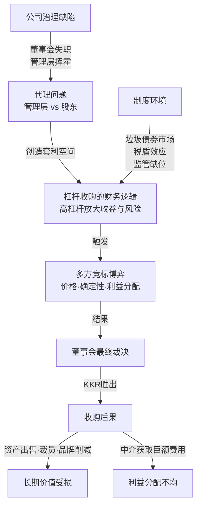

# 《门口的野蛮人》深度读书笔记

> [!abstract] 全书速览
> 这是一部关于1988年RJR纳贝斯克公司250亿美元杠杆收购大战的全景式纪实作品。布赖恩·伯勒和约翰·希利亚尔用两年采访、上百位当事人的证言和近乎小说化的叙事张力，还原了华尔街历史上规模最大、最富戏剧性的收购战。这不仅是一个商业案例，更是80年代美国资本市场贪婪文化的照妖镜——管理层从守护者变成掠夺者，投资银行从中立顾问变成交易推手，董事会从受托人沦为橡皮图章，而真正创造价值的员工和消费者在这场250亿美元的盛宴中几乎没有发言权。

## 核心命题

这本书表面上讲的是一场收购战，但它真正追问的是一个更根本的问题：==当公司的控制权可以被明码标价时，企业到底属于谁？==

1988年之前，大多数人认为大型上市公司太大了，不可能被杠杆收购拿下。但RJR纳贝斯克案打破了想象边界——这家年销售额超过170亿美元、拥有温斯顿、骆驼、奥利奥等顶级品牌的巨型企业，在短短几周内成为华尔街各路势力竞相争夺的猎物。最终成交价250亿美元，在当时创下了并购史纪录。

> [!tip] 核心洞察
> 这本书揭示了一个在当时令人不安的事实：==公司不再是"经营"出来的，而是可以被"交易"的。==企业的存在意义不仅是制造产品和服务客户，它同时也是一种资产——可以被拆解、重组、买卖。管理层从公司的守护者变成了潜在的掠夺者，投资银行从融资服务者变成了交易的推动者，而真正创造价值的员工和消费者在这场游戏中几乎没有发言权。

## 框架全景



三个分析框架互相嵌套：

- **代理问题**解释了为什么收购会发生——管理层的低效和自利创造了股价与真实价值之间的落差
- **杠杆收购的财务逻辑**解释了收购如何运作——高杠杆放大收益也放大风险，稳定现金流是偿债的基础
- **博弈框架**解释了收购如何展开——多方竞争中价格、结构和确定性同时决定胜负

> [!note] 三线并行的叙事结构
> 全书围绕三条线索交织推进：**第一条线**是RJR纳贝斯克的公司史——从雷诺烟草与纳贝斯克合并，到约翰逊如何爬上CEO位置，解释公司为何成为收购标靶。**第二条线**是华尔街杠杆收购生态的形成——KKR的崛起、垃圾债券市场、机构投资者的参与。**第三条线**是收购战本身——从MBO提出到多轮竞标到最终裁决。三者共同回答：==一场收购需要一家有"问题"的公司、一群逐利的金融玩家、以及一个允许这种游戏存在的制度环境。三者缺一不可。==

## 核心观点深度解读

### 一、管理层收购的道德陷阱：CEO从守门人变成攻城者

罗斯·约翰逊是这本书的灵魂人物。他从加拿大普通推销员起步，凭借过人的社交魅力和政治手腕爬上全球最大消费品公司CEO的位置。但他发起MBO的那一刻，身份发生了根本转变——从为股东看守公司的代理人，变成了想用公司的钱买下公司的交易方。

> [!example] 案例：约翰逊治下的奢靡文化
> 在约翰逊治下，RJR纳贝斯克的高管享受着令人咋舌的待遇：公司拥有十架飞机组成的"空军"，高管随时可调用飞机接送家人；公司总部从纽约搬到亚特兰大——不是因为商业优势，而是因为约翰逊喜欢那里的高尔夫球场；公司赞助的体育活动和社交活动花费数百万美元，与核心业务毫无关系。这种挥霍直接压低了股价，创造了收购者梦寐以求的"价值缺口"。

MBO中的利益冲突是致命的。作为CEO，约翰逊对公司的真实价值拥有外人无法获得的内部信息——哪些品牌被低估、哪些资产可以剥离变现、未来现金流有多稳定。他给管理团队开出了数十亿美元的股权激励方案——收购成功后所有参与者都有强烈动机把收购价格压到最低，而他们受托保护的恰恰是希望卖出最高价的股东。

> [!warning] 至今未解的治理难题
> 约翰逊的案例揭示了一个普遍性问题：==在所有权与经营权分离的现代企业中，管理层天然拥有信息优势。==当缺乏有效的制约机制时，他们完全可以利用这种优势——不一定是MBO这种极端方式，也可以通过更隐蔽的途径：过高的薪酬方案、短期导向的战略决策、损害长期价值的资本配置。

### 二、杠杆收购的魔法与代价

杠杆收购的基本逻辑：==用别人的钱买下一家公司，再用这家公司的钱还债。==收购者投入少量自有资金（通常10-20%），其余靠借债完成。如果一切顺利，几年后债务还清，收购者以极小的代价拥有了一家完整的公司。

> [!tip] LBO成立的三个条件
> 1. 标的公司现金流必须稳定且可预测——香烟和饼干是完美选择（人们在任何经济环境下都会抽烟和吃饼干）
> 2. 债务融资必须可获得且成本合理——垃圾债券市场和银行贷款提供了条件
> 3. 收购后必须能释放被低估的价值——通过出售非核心资产、削减浪费、改善运营来实现

支持者的论证有其逻辑：许多上市公司存在"自由现金流问题"——管理层有太多钱可花，于是花在低效项目和豪华福利上。LBO通过用债务替代股权，把自由现金流锁定为强制性的利息偿付，迫使管理层削减一切不必要开支。

但RJR案展示了硬币的另一面。收购完成后公司背负超过200亿美元债务，不得不出售优质业务、大幅削减品牌投资、裁减员工。==那些在收购中赚到钱的人早已套现离场，留下的是一个被掏空的企业壳。==公司的长期竞争力、员工的饭碗、品牌积累的无形资产——这些不会出现在交易模型的电子表格上，但它们是真实的代价。

> [!warning] 价值创造还是价值转移
> 杠杆收购本身是中性的金融工具。但当收购者的利润主要来自财务工程（税盾、费用和高杠杆）而非运营改善时，它就不再是价值创造，而是价值转移——从债权人、员工和长期股东口袋里，转移到收购者和中介的口袋里。

### 三、华尔街杠杆收购生态的形成

80年代LBO的兴起是多股力量汇聚的结果：

```mermaid
graph LR
    A[垃圾债券市场<br/>米尔肯/德崇证券] -->|大规模举债成为可能| E[LBO规模<br/>指数级增长]
    B[机构投资者入场<br/>养老基金·保险公司] -->|提供股本弹药| E
    C[税法偏袒<br/>债务利息可抵税] -->|高杠杆策略<br/>获得人为优势| E
    D[学术合法化<br/>詹森的代理理论] -->|LBO被定义为<br/>"效率提升工具"| E
    E -->|回报远超市场| B
```

KKR是这个生态系统的核心玩家。亨利·克拉维斯和乔治·罗伯茨的模式是：从机构投资者那里募集资金作为股本，加上数倍债务融资，收购现金流稳定但被市场低估的公司。收购后进入董事会，推动成本削减和资产剥离，几年后通过上市或出售退出。

> [!example] KKR的三项核心能力
> 1. **估值能力**：判断哪些公司被市场低估
> 2. **融资能力**：在短时间内筹集数百亿美元
> 3. **交易执行能力**：在复杂多方谈判中占据优势
>
> 但RJR案暴露了KKR模式的根本软肋：当交易规模大到一定程度，传统的"与管理层合作"策略就失效了——因为这次管理层本身是竞争对手。

### 四、投资银行的角色异化：利益冲突的制度化

RJR案中投资银行暴露的不是个别银行家的贪婪，而是一个行业的结构性利益冲突。

> [!warning] 希尔森·莱曼的三重角色冲突
> 作为约翰逊MBO的核心合作方，希尔森·莱曼同时扮演三个角色：
> - **财务顾问**——为管理层设计交易方案，收取顾问费
> - **融资提供方**——用自有资金参与收购融资，承担信用风险并赚取利息
> - **股权投资者**——交易成功后获得公司股份，分享增值收益
>
> ==当交易成功意味着数亿美元的收入，而交易失败意味着血本无归时，你会给出怎样的"客观"建议？==

费用结构进一步扭曲了激励。一笔250亿美元的交易，投行可以收取数亿美元的顾问费、承销费和融资安排费。绝大多数费用只在交易完成时才支付——整个投行群体的经济利益都指向同一个方向：促成交易。至于这笔交易是否真正有利于股东，不会影响投行的账单。

书中记录了一个令人印象深刻的细节：竞标最白热化阶段，各方律师和银行家的账单每天高达数百万美元。这些成本最终由被收购公司承担。==无论谁赢得竞标，中介们都是确定的赢家——它们是唯一一个在所有结果下都能获利的群体。==

### 五、董事会的失守与迟来的觉醒

RJR纳贝斯克的董事会在约翰逊的CEO任期内实质上是一个社交俱乐部——多数董事是约翰逊的朋友或由他挑选的人，享受着丰厚待遇，几乎从不质疑管理层决策。

> [!tip] 治理失效是渐进的
> 约翰逊的奢华开支不是一天形成的——先是合理的出差需求，然后是"业务需要"的高尔夫球场会员，再然后是"提升公司形象"的体育赞助，最后变成十架飞机的私人空军。每一步都有"合理"解释，每一步都在测试董事会的容忍边界。==当温水煮青蛙式的权力侵蚀完成后，董事会已经丧失了判断"什么是正常的"的基准线。==

MBO的宣布打破了平衡。董事们突然面临明确的法律责任——作为股东的受托人，如果他们因私人关系就接受低于最优的报价，将面临股东集体诉讼和个人赔偿责任。

正是法律威慑——而非道德自觉——驱动了董事会后来的行为。他们聘请独立顾问，设立特别委员会，最终选择了报价更高、条件更确定的KKR方案。

> [!warning] 双重讽刺
> 第一，董事会的"正确"决定是被法律风险逼出来的，不是出于对股东利益的真诚关切。第二，如果董事会一直尽职履责——遏制约翰逊的挥霍、确保股价反映真实价值——这场收购战很可能根本不会发生。==公司治理不是危机时刻的应急措施，而是日常运营中的纪律体系。等到野蛮人已经兵临城下，再想亡羊补牢，代价已经付过了。==

### 六、竞标博弈：确定性比价格更值钱

收购战的终局揭示了一个超越收购本身的商业洞见。

约翰逊团队最终报价每股106美元，KKR为109美元——差距不到3%。但董事会选择了KKR，不仅因为价格略高，更因为KKR方案的确定性明显更强。约翰逊方案附加了大量条件——复杂的管理层激励结构、多层嵌套的融资安排、各种触发条款——每一个条件都是一个潜在的失败点。KKR方案更简洁、更直接：明确的现金对价、已落实的融资承诺、清晰的交割时间表。

> [!note] 关键教训
> ==在高度不确定的环境中，确定性本身就是价值。==一份简单明确的方案，往往比一份看起来更优但充满不确定性的方案更有吸引力。约翰逊输掉这场竞标，不是因为他出的价格不够高，而是因为他的方案让人不够放心。

## 这本书的保质期

**已经过时的部分：**

- 80年代垃圾债券市场的狂热已经消退，米尔肯因证券欺诈入狱，德崇证券倒闭
- LBO的规模和频率在90年代初经历大幅下降，高杠杆公司在经济衰退中大批破产
- 公司治理改革（萨班斯-奥克斯利法案、多德-弗兰克法案）增强了董事会独立性和披露义务
- 今天的私募股权巨头（黑石、KKR、凯雷）已进化为多元化资产管理机构，杠杆率更低、持有期更长

**依然适用的部分：**

- 杠杆收购作为金融工具从未消失，只是换了名字（"私募股权"）和做法
- 管理层与股东之间的利益冲突仍是公司治理核心问题——股票期权激励CEO追求短期股价、"金色降落伞"让失败的CEO仍获天量报酬
- 投行的利益冲突问题在2008年金融危机中以更大规模重演
- 高杠杆的脆弱性在每次经济下行中反复被证明

> [!warning] 需要更新的认知
> 如果你读这本书是为了理解当今的私募股权行业，需要注意：今天的PE巨头已经远不止做杠杆收购，它们的业务涵盖房地产、信贷、基础设施等多个领域。监管环境也发生了重大变化，很多书中描述的"灰色地带"操作在今天可能已经违法。但==人性层面的洞察——贪婪、利益冲突、激励扭曲——不受时代限制。==

## 行动工具箱

**对企业管理者：**

> [!tip] 治理健康度自检
> 1. **董事会独立性**：你的董事会是在真正监督你，还是在盖橡皮图章？如果你能说服董事会批准任何提案，那可能不是好事
> 2. **开支合理性**：当公司开支中出现越来越多"无法简单解释"的项目时，问问自己——我们是在创造价值还是在消耗价值？
> 3. **信任资本**：约翰逊败落的根本原因不是商业能力不足，而是彻底失去了信任。==公司治理不是法律合规的形式要求，而是赢得信任的基础设施==

**对投资者：**

| 治理风险信号 | 具体表现 | RJR案中的对应 |
|---------|---------|---------|
| 激励错位 | CEO薪酬与短期股价挂钩而非长期经营指标 | 约翰逊的MBO方案中管理层获得数十亿股权激励 |
| 董事会失独 | 多数董事与CEO有私人关系、来自CEO社交圈 | 董事们享受公司飞机和高尔夫会员，从不质疑管理层 |
| 隐性浪费 | 大量看不清目的的"战略性"开支 | 十架飞机的"空军"、数百万体育赞助 |
| 信息不透明 | 信息披露含糊或选择性过高 | 约翰逊利用内部信息压低MBO出价 |

**对面临并购决策的人：**

- ==确定性比纸面价格更重要==——不要被方案的"最优预期"迷惑，方案能否兑现才是关键
- 警惕所有利益冲突——当你的顾问同时是交易的参与者时，他的建议值多少钱？
- 理解杠杆的双刃剑——任何依赖高杠杆的结构都要追问：如果现金流中断三个月，这个结构还能撑住吗？

## 延伸阅读

- [[《说谎者的扑克牌》]] - 迈克尔·刘易斯：同一时代华尔街的另一幅画像，从债券交易员的视角揭示80年代投行文化的荒诞与贪婪
- [[《大空头》]] - 迈克尔·刘易斯：二十年后的金融危机表明，华尔街的激励扭曲和系统性风险从未被真正解决——只是换了面目重演
- [[《大败局》]] - 吴晓波：中国版的企业崩溃案例集，管理层失控、治理缺位导致崩塌的底层逻辑跨越国界
- [[《基业长青》]] - 吉姆·柯林斯：从反面提供参照——长寿企业的共同特征是自律的管理文化和制度化的权力约束，恰恰是RJR纳贝斯克所缺失的一切
