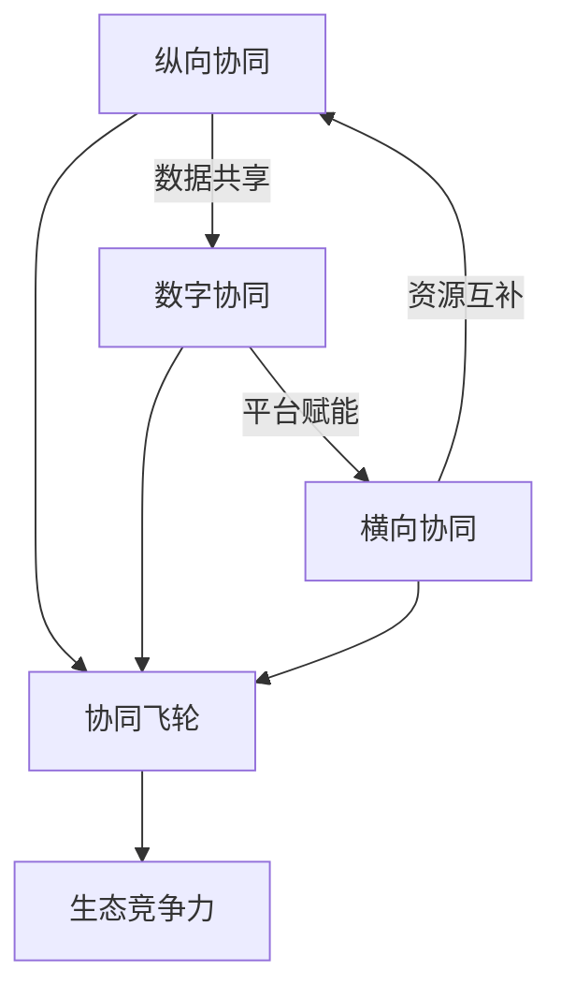

# 《高效协同》深度读书笔记

> [!abstract]
> 供应链的竞争已经从单个企业的效率之争，升维为生态系统的协同之争。赵先德教授和研究团队从中欧国际工商学院的视角出发，结合京东、海尔、SHEIN等标杆企业的实战案例，构建了一套==纵向协同-横向协同-数字协同==的三维分析框架。这本书要告诉你的不是怎么把供应链成本压到最低，而是怎么通过协同——与供应商深度绑定、与竞争对手选择性合作、用数字平台连接整个生态——把供应链从一个"花钱的部门"变成企业竞争优势的核心引擎。在全球供应链频繁中断、消费者需求碎片化、技术迭代加速的今天，这本书提供的不只是理论框架，更是一套可操作的实战路线图。

## 核心命题

这本书回答的根本问题是：**在充满不确定性的商业环境中，企业如何通过供应链协同实现系统性的商业模式创新？**

> [!note]
> 过去二三十年，供应链管理的主流思路是"效率优先"——压缩库存、缩短周期、降低成本。丰田的精益生产、戴尔的直销模式，都是效率导向供应链的经典标杆。衡量供应链经理能力的核心指标就是成本：你能不能把供应链费用率压到行业最低？

但世界变了。贸易摩擦让全球供应链变得脆弱，一场疫情就能让半导体断供几个月；消费者从"有什么买什么"变成"我要什么你得有什么"，需求碎片化让大批量生产模式越来越力不从心；AI、物联网等技术的涌现，又创造了全新的协作可能性。全球供应链中断事件的年均增长率达到6.4%，企业供应链成本占总成本的15%到25%——供应链脆弱性已经成为企业面临的最大系统性风险之一。

赵先德的核心主张有三层。第一，光靠自己优化效率已经到了天花板，你必须和外部伙伴深度协同才能应对复杂性。一家企业再强，它的资源和能力都是有限的，而市场的不确定性是无限的。第二，==协同不是简单的"搞好关系"，而是需要系统设计的战略行为==——和谁协同、在什么环节协同、用什么机制协同，都有讲究。很多企业嘴上说"战略合作"，实际上还是逢低买入的采购思维，这不是真正的协同。第三，数字技术不仅是协同的工具，更是协同的催化剂和放大器。过去你和供应商协同，信息传递靠传真和电话，延迟和失真是常态；现在通过数据中台实时共享库存和需求数据，协同的深度和速度完全不在一个量级。

> [!tip]
> 这个主张挑战了两个商业常识：一是"供应链就是成本中心"——赵先德认为供应链可以成为价值创造的核心引擎，京东把供应链能力开放给第三方商家赚取服务费就是活生生的例子。二是"竞争对手就是敌人"——在很多场景下，和竞争对手合作比对抗更聪明，这不是天真的理想主义，而是经过严格经济学论证的理性选择。

## 框架全景

全书的核心框架是一个==三维协同模型==，它构成了理解全书所有内容的骨架。

**纵向协同**是第一个维度，指企业沿着供应链上下游——与供应商和客户——建立深度协作关系。往上游看，是把供应商从"比价采购的对象"升级为"共同创新的伙伴"；往下游看，是把客户从"产品的接收者"转变为"价值的共创者"。纵向协同的关键词是"深度"——不是泛泛的合作，而是信息共享、风险共担、利益共享的深度绑定。赵先德整合了三大理论来解释纵向协同的本质：交易成本理论解释"为什么要协同"（反复在市场上找新伙伴的搜寻、谈判、监督成本太高），资源基础观解释"协同什么"（各方带来自己没有但对方有的差异化资源和能力），网络理论解释"如何协同"（通过关系治理而不仅仅是合同治理来管理合作）。

**横向协同**是第二个维度，指企业与同行业竞争对手之间的选择性合作。核心逻辑是在**价值创造**环节合作（联合采购原材料、共建物流网络、共同制定行业标准），在**价值分配**环节竞争（争夺终端客户）。竞合的收益来源于"做大蛋糕"而非"分蛋糕"——当你和竞争对手在成本端合作时，整个行业的效率提升了，市场总量扩大了，每家企业能分到的也更多了。

**数字协同**是第三个维度，也是将前两个维度粘合在一起的基础设施。数字平台通过数据流动打通信息壁垒，通过算法优化提升匹配效率，通过开放接口实现能力共享。赵先德特别强调了"中台"架构的价值：数据中台汇聚和处理所有信息流，业务中台封装可复用的业务能力，技术中台提供底层基础设施。中台让协同从"一对一"的点状连接升级为"多对多"的网状连接。

> [!tip]
> 三个维度不是各自独立的，它们之间存在相互强化的飞轮效应：纵向协同产生的数据喂养数字平台，数字平台的能力赋能横向协同，横向协同带来的资源互补又反过来深化纵向关系。==三维协同企业的资产回报率（ROA）比单维协同企业高出23%==——协同不是一道选择题，而是一道组合题，三个维度都做到位才能释放最大价值。

## 核心观点深度解读

### 一、从"链条"到"网络"：供应链的范式转换

赵先德在全书开篇做了一个关键判断：==传统的供应链管理范式已经触及天花板==。

传统范式把供应链想象成一条"链"——原材料从供应商流向制造商，再流向分销商，最终到达消费者。管理的核心任务是让这条链跑得更快、成本更低。牛鞭效应、安全库存、经济批量——这些经典工具都是为效率目标服务的。这套思路在供应链管理教科书里统治了几十年，培养了一代又一代"效率至上"的供应链经理人。

但"链条思维"有一个致命缺陷：它是线性的。一个节点出问题，整条链就断了。2020年疫情期间，全球汽车行业因为东南亚芯片工厂停工而大面积减产，就是这个问题的极端体现。当时很多车企只有一个芯片供应来源，一旦断裂，整条生产线就得停下来——不是因为缺钢材或轮胎，而是因为缺一块几美元的芯片。这暴露了效率至上思维的根本缺陷：为了追求极致的成本效率，企业把供应来源压缩到最少，把库存压到最低，在突发事件面前完全没有缓冲余地。

赵先德提出的替代方案是"网络思维"。不是一条链，而是一张网——每个节点都有多个连接，某条路径断了，信息和物资可以通过其他路径流动。这张网的韧性可以粗略表达为：==韧性 = 冗余能力 x 响应速度 x 协同深度==。冗余提供了缓冲空间（不是只有一个供应商，而是有备选），响应速度决定了恢复效率（出了问题多快能启动替代方案），协同深度决定了各节点能否在危机中相互支撑（你的合作伙伴愿不愿意在你最困难的时候调配资源帮你）。

这个转换还意味着供应链管理者的角色从"效率工程师"变成了"关系架构师"——你不只是在优化流程和压缩成本，更是在构建和维护一个复杂的合作网络。你需要的不只是运筹学和仓储管理的专业知识，还需要谈判能力、关系管理能力，甚至战略思维能力。

### 二、供应商关系金字塔：从比价采购到战略绑定

在纵向协同的上游端，赵先德提出了一个供应商关系金字塔模型，这是全书最具实操价值的框架之一。

金字塔的底层是**合格供应商**——满足基本的质量、交期和价格要求就行。对这一层，传统的比价采购策略完全适用，没必要投入过多的关系维护成本。你需要的是建立清晰的准入标准和考核体系，通过竞争机制保持价格竞争力。

中间层是**优选供应商**——在合格的基础上，具备某些差异化能力，比如更快的响应速度、更强的技术能力或更灵活的定制能力。对这一层，企业应该给予一定的优先权和稳定性承诺，换取对方更好的服务。比如在同等条件下优先下单，在市场波动时不轻易砍掉他们的订单。这种适度的承诺能让优选供应商愿意为你投入更多的响应资源。

> [!example]
> 顶层的**战略供应商**是真正的"铁哥们"关系。数量通常只占供应商总数的5%左右，但贡献往往超过半数的创新价值。丰田的战略供应商只占总数的5%，却贡献了==60%的创新提案==。这意味着丰田大部分的产品创新不是来自自己的研发部门，而是来自少数几个深度合作的供应商。对战略供应商需要共享长期规划、共同投资研发、分享利润和风险。

书中引入了几个关键实践工具。VMI（供应商管理库存）让供应商根据你的实际消耗自动补货——你不再需要每周发采购订单，供应商自己看你的库存水平，低于安全线就自动送货。JIT II更激进——让供应商代表常驻在你的工厂里，直接参与生产计划和采购决策。供应商早期介入（ESI）则是在产品设计阶段就把供应商拉进来，苹果和台积电的芯片协作就是ESI的典范——设计和制造工艺从最早期就联合规划，确保设计出来的芯片最适合量产。

> [!warning]
> 很多企业把"采购金额最大的供应商"等同于"战略供应商"，这是错的。战略性体现在能力的互补性和长期共同成长潜力，不是采购量的大小。判断一个供应商是否值得升级为战略伙伴，你应该问三个问题：它的能力和你的需求是否高度互补？它有没有和你共同成长的意愿？它在自己的领域是否处于领先位置？

### 三、客户关系重构：从B2C到C2M

纵向协同的下游端同样经历着深刻变革。赵先德描述了客户关系的三次进化。

第一阶段是经典的B2C——"我做你买"。企业先做出产品，然后想办法卖给消费者。问题在于你永远在猜消费者想要什么，猜对了爆款，猜错了库存积压。传统服装行业就是典型：提前6个月预测流行趋势、大批量生产、铺货到门店，卖不掉的打折处理。消费者是被动的接收者，企业承担了全部的预测风险。

第二阶段是C2B——"你说我做"。通过数据洞察和需求感知，企业开始根据消费者的需求来定制产品。小米早期在MIUI论坛上让用户投票决定功能优先级就是这个逻辑——消费者不再被动等待，而是主动表达需求，企业根据这些需求组织生产。

第三阶段是C2M（消费者直连制造）——"一起做"。消费者不仅表达需求，还直接参与产品的设计和创造。SHEIN的"测款-追单"模式是典型：每天上新几千款，每款只生产极少量，通过消费者实际购买行为来"投票"——卖得好立即追加产量，没人买快速下架。消费者用真金白银参与了"产品筛选"环节，企业的供应链需要极快的响应速度来配合——从下单到出货可能只有7天。

> [!tip]
> ==参与共创的客户复购率提升47%，客单价提升35%==。当你参与了一个产品的诞生过程，你对它的情感投入完全不同。就像自己组装的宜家家具，哪怕有点歪歪扭扭，你也会比买现成的更珍惜。这种参与感本身就构成了强大的用户粘性，比价格优惠更持久、更难被竞争对手复制。

赵先德强调，这种客户协同不只是营销手段，更是供应链层面的深刻变革。当需求信号从"事后统计"变成"实时感知"，整个供应链都要跟着变——从"推式供应链"变成"拉式供应链"。你需要能快速换线、小批量试产、根据实时销售数据弹性调整产能的柔性制造系统。一条只能大批量生产的产线，是无法支撑C2M模式的。

### 四、竞合策略：和竞争对手做朋友

横向协同是全书最有思想冲击力的部分。赵先德系统阐述了"竞合"（Coopetition）的理论和实践，这个概念对很多在"竞争就是你死我活"环境中长大的管理者来说，需要一次认知上的刷新。

核心判断很简洁：竞争对手之间可以合作，而且在很多场景下应该合作。关键在于区分两种环节——在**价值创造**环节合作，在**价值分配**环节竞争。

举个直观的例子：两家水果店是竞争关系。但如果它们一起去批发市场进货，就能拿到更低的批发价——这是价值创造环节的合作。回到各自店铺后，各凭本事吸引顾客——这是价值分配环节的竞争。总的"蛋糕"变大了，两家都受益。

> [!example]
> 航空联盟是大规模竞合的经典案例。星空联盟、寰宇一家的成员在航线网络、贵宾室、常旅客计划上深度合作，但在票价和服务体验上仍然激烈竞争。联盟成员的单位运营成本比非联盟航空低==18%==。汽车行业也有类似实践：丰田和马自达共享平台开发成本，宝马和奔驰合作开发自动驾驶技术——在研发这个"价值创造"环节合作，在品牌和销售这个"价值分配"环节竞争。

赵先德提出了一个"竞合矩阵"来帮助企业做决策——根据"合作潜力"和"竞争强度"两个维度，将与竞争对手的关系分为四种类型。高合作潜力+低竞争强度的属于"快速收益区"，应该优先推进；高合作潜力+高竞争强度的属于"战略投资区"，值得重点攻克但需精心设计合作机制；低合作潜力+高竞争强度的不值得在合作上花时间；低合作潜力+低竞争强度的可以机会主义地参与。

> [!warning]
> 竞合也有真实的风险。信息共享可能被对手利用——你把成本结构暴露给了合作伙伴，万一对方日后利用这些信息来针对你呢？能力开放可能培养出更强的竞争者。关系过度紧密可能丧失战略灵活性——当合作深入到基础设施层面，想要脱身的成本变得非常高。竞合不是万能药，需要清晰界定信息共享的范围、建立知识产权保护条款、保留退出机制。

### 五、数字平台：协同的基础设施与放大器

数字协同是全书三维框架中的"技术底座"。赵先德的核心观点是：==数字平台不只是提升效率的工具，更是重新定义协同边界和可能性的催化剂==。

平台的价值可以用一个公式概括：**平台价值 = 用户规模 x 交互频次 x 数据密度**。用户越多，网络效应越强；交互越频繁，数据越丰富；数据越密集，匹配和优化精度越高。三者相互强化，形成平台增长的飞轮。

> [!example]
> 京东最初自建物流是为了服务自营业务，但当物流网络足够大、效率足够高之后，它把这套能力开放给第三方商家——接入京东物流开放平台的商家，履约成本平均下降==25%==。京东的供应链能力从"成本中心"变成了"利润中心"。这是一个深刻的商业逻辑转换：你花巨资建设的能力，服务完自己之后还有剩余产能，把剩余产能卖给别人，不仅回收了投资成本，还创造了新的收入来源。

赵先德详细讨论了平台的技术架构。数据中台汇聚和处理所有信息，业务中台封装通用的业务能力（订单管理、库存管理、物流调度），技术中台提供底层技术支撑（云计算、安全、通信）。中台的价值在于"一次建设，多次复用"：各种前台业务场景都可以快速调用中台能力，而不需要每次从零开始搭建。

在智能供应链部分，赵先德描绘了一个令人兴奋的图景：AI驱动的供应链将像自动驾驶汽车一样运作——物联网传感器实时感知变化，算法自动预测需求并生成最优采购计划和配送路线，人类只处理系统无法应对的异常情况。京东的智能补货系统已经实现了==95%以上==的预测准确率，而人工预测通常只有60%到70%。

> [!warning]
> 智能化不是一步到位的。正确的路径是"数据在线化→流程标准化→决策规则化→系统自动化"，循序渐进。数据基础没打好就急着上AI，结果就是"垃圾进、垃圾出"——不准确、不完整的数据，输出的预测自然也不靠谱。

### 六、京东与海尔：两种协同范式

全书用了相当篇幅对京东和海尔进行深度案例分析，代表了两种截然不同但同样成功的协同范式。

**京东的范式是"一体化供应链"**。核心策略是自建——自己建仓库、自己养快递员、自己做数据系统。2007年刘强东决定自建物流时，几乎所有投资人都反对——"你一个电商公司为什么要干物流的活？"但京东用结果证明了价值：211时效覆盖了90%以上的订单，库存周转天数控制在30天左右，是行业平均水平的两到三倍。这种"重"换来了体验的"快"和成本的"省"。更关键的是，当这套能力成熟后，京东把它开放出去，变成了"供应链即服务"（SCaaS）——中小商家接入京东物流平台，履约成本降低25%，京东的物流设施利用率也提高了。供应链从成本中心变成了利润中心。

**海尔的范式是"平台型生态"**。核心策略恰好相反——把一家8万人的大型制造企业拆成4000多个"小微企业"，每个小微直面用户、自负盈亏，总部变成赋能平台。就像把一艘航空母舰改造成一个快艇舰队——每艘快艇灵活机动，舰队整体又有规模优势。海尔"人单合一"模式的精髓在于：员工直达用户——小微团队直接和用户交互；价值直达创造者——收入和用户满意度直接挂钩。平台在背后"赋能而不干预"。这种模式从海尔内部孵化出了多个独角兽企业。

> [!tip]
> 两个案例揭示了一个重要启示：没有唯一正确的协同模式。京东选择"自建-整合-开放"，海尔选择"拆分-赋能-生态化"，两者都走通了。共同点是：都从"自己做所有事"走向"让生态伙伴一起做"，都把供应链能力视为战略资产而非运营负担。=="从孤岛到生态"是所有企业供应链演进的大方向==。

## 这本书的保质期

这本书出版于数字化转型的热潮期，有些观点经受住了时间检验，有些则需要打折扣。

**跨时代的洞察**。三维协同框架的底层逻辑——纵向做深、横向做广、数字打通——是不受时代限制的。无论技术如何变化，供应链管理的核心始终是"如何让不同主体更好地协作"。竞合策略的有效性也已被反复验证：从航空联盟到汽车行业的平台共享，再到芯片行业的制造代工模式，竞合已成为主流战略选择。供应商关系金字塔模型同样持久——无论什么行业，"区分对待不同层级的供应商"都是资源配置的基本常识。

**需要更新的部分**。书中对区块链在供应链中应用的乐观预期需要调低——到目前为止，区块链在供应链领域的大规模商业化应用仍然有限。AI的发展则远超书中描述——大语言模型和生成式AI正在创造全新的供应链应用场景（自动化的供应商谈判、用自然语言查询库存和生成采购计划、基于AI的风险预警系统），这些在书出版时还不存在。

> [!warning]
> 书中的案例以中国互联网平台企业为主（京东、海尔、SHEIN），对传统制造业和中小企业的适用性讨论不够充分。一家年营收几千万的中型制造企业，面对的协同挑战和京东完全不同。此外，书中对"协同总是好的"这个假设缺乏足够的质疑——过度协同的风险是真实存在的：信息过度透明可能暴露你的底牌，关系过度紧密可能让你在需要切换供应商时进退两难，能力过度开放可能无意中培养了更强的竞争对手。

对大多数中小企业来说，与其追求"三维协同"的宏大愿景，不如先把纵向协同做扎实——选好战略供应商、建立真正的信息共享机制、和核心客户形成稳定的需求反馈闭环。

## 行动工具箱

**工具一：供应链协同成熟度自评**。用四级模型评估你的企业处在哪个阶段——Level 1内部信息打通、Level 2与核心伙伴数据共享和联合计划、Level 3与竞争对手选择性合作、Level 4平台化生态运营和能力对外输出。大多数企业处于Level 1到Level 2之间。当务之急是先把内部整合做扎实——如果采购部和销售部的数据都还没打通，谈和外部伙伴的协同就是空中楼阁。

**工具二：供应商关系金字塔梳理**。列出前20大供应商，按合格-优选-战略三层分类。选择标准不是采购金额，而是能力互补性和共同成长潜力。对战略供应商安排每季度一次联合规划会议。一个简单的起步动作：邀请你最重要的那个供应商负责人来公司坐一天，让他了解你的产品路线图，你也了解他的产能计划和技术储备。

**工具三：竞合机会扫描**。画一张矩阵图，纵轴是"合作潜力"（成本节约空间、市场做大可能性），横轴是"竞争强度"（是否在核心市场正面交锋）。右上角（高合作潜力+低竞争强度）是优先推进的竞合机会。比如你和一个竞争对手产品线有重叠，但服务的地域市场不同——那在物流配送上合作就是双赢的。

**工具四：数字化协同路线图**。按"数据在线化→流程标准化→决策规则化→系统自动化"的顺序推进。如果你连基础数据都没有在线化（还在用Excel管库存、微信群对接订单），不要急着上AI。第一步选一个最痛的业务场景（通常是库存管理或订单跟踪），把纸质和Excel里的数据搬到系统里去。

**工具五：协同效果度量仪表盘**。选择3到5个关键指标：库存周转天数变化、订单交付准时率变化、供应商创新提案数量、客户复购率变化。每月回顾一次，用数据驱动持续改进。没有度量就没有管理——如果你说不清协同到底带来了什么具体好处，下一轮预算审批时就很难为协同项目争取到资源。

周一回到办公室，你可以做的第一件事是：和供应链团队坐下来，用成熟度模型做一次坦诚的自评。不需要追求完美的评分，重要的是让团队对"我们在哪里"和"我们要去哪里"形成共识。有了共识，才能聚焦资源做最重要的事。

## 延伸阅读

[[《竞争战略》]]（迈克尔·波特）提供了一个互补的视角。赵先德强调协同与合作，波特强调竞争与壁垒。把两者放在一起读，你会对"什么时候该合作、什么时候该竞争"有更立体的判断。波特的"五力模型"可以帮你分析供应商和客户的议价能力，这恰恰是决定协同策略的关键变量——当供应商议价能力很强时，协同可能是缓解压力的有效手段；当你自己议价能力很强时，则需要警惕过度协同反而削弱了自己的谈判地位。

[[《平台革命》]]（杰弗里·帕克等）是数字协同维度的最佳补充读物。赵先德的书对平台的讨论偏向供应链视角，而这本书从更宏观的平台经济学角度，系统阐述了网络效应的运作机制、平台治理的核心挑战、多边市场的定价策略等核心概念。如果你正在考虑将供应链能力平台化输出，这本书几乎是必读的。
