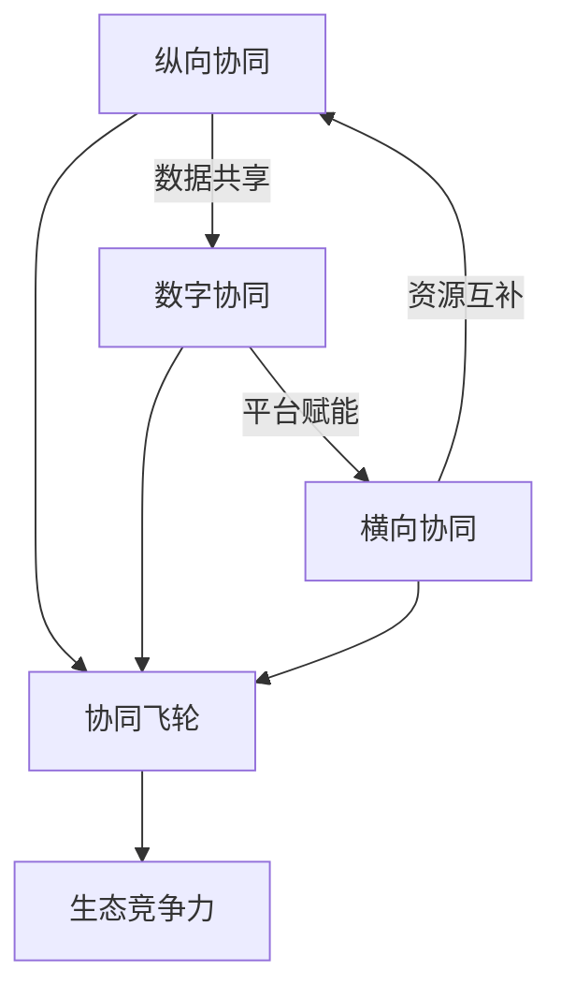

# 《高效协同》深度读书笔记

> [!abstract] 全书速览
> 这本书的核心论点是，供应链的竞争已经从单个企业的效率之争，升维为生态系统的协同之争。赵先德教授和他的研究团队从中欧国际工商学院的视角出发，结合京东、海尔、ZARA等标杆企业的实战案例，构建了一套"纵向协同-横向协同-数字协同"的三维分析框架。这本书要告诉你的不是怎么把供应链成本压到最低，而是怎么通过协同——与供应商深度绑定、与竞争对手选择性合作、用数字平台连接整个生态——把供应链从一个"花钱的部门"变成企业竞争优势的核心引擎。在全球供应链频繁中断、消费者需求碎片化、技术迭代加速的今天，这本书提供的不只是理论框架，更是一套可操作的实战指南。

## 核心命题

这本书回答的根本问题是：**在充满不确定性的商业环境中，企业如何通过供应链协同实现系统性的商业模式创新？**

这个问题的提出有明确的时代背景。过去二三十年，供应链管理的主流思路是"效率优先"——想方设法压缩库存、缩短周期、降低成本。这套打法在稳定的市场环境中确实有效，丰田的精益生产、戴尔的直销模式，都是效率导向供应链的经典案例。

但世界变了。贸易摩擦让全球供应链变得脆弱，一场疫情就能让半导体断供几个月；消费者从"有什么买什么"变成"我要什么你得有什么"，需求碎片化让传统的大批量生产模式越来越力不从心；AI、物联网、区块链等技术的涌现，又创造了全新的协作可能性。

赵先德的核心主张包含三层意思。第一，光靠自己优化效率已经到了天花板，你必须和外部伙伴深度协同才能应对复杂性。第二，协同不是简单的"搞好关系"，而是需要系统设计的战略行为——和谁协同、在什么环节协同、用什么机制协同，都有讲究。第三，==数字技术不仅是协同的工具，更是协同的催化剂和放大器==，它从根本上改变了协同的可能性边界。

> [!tip] 核心洞察
> 这个主张挑战了商业世界的两个常识：一是"供应链就是成本中心"的认知——赵先德认为供应链可以、也应该成为价值创造的核心引擎；二是"竞争对手就是敌人"的思维定式——在很多场景下，和竞争对手合作比对抗更聪明。

## 框架全景

全书的核心框架是一个"三维协同模型"，它构成了理解全书所有内容的骨架。

**纵向协同**是第一个维度，指的是企业沿着供应链上下游——与供应商和客户——建立深度协作关系。往上游看，是把供应商从"比价采购的对象"升级为"共同创新的伙伴"；往下游看，是把客户从"产品的接收者"转变为"价值的共创者"。纵向协同的关键词是"深度"——不是泛泛的合作，而是信息共享、风险共担、利益共享的深度绑定。

**横向协同**是第二个维度，指的是企业与同行业竞争对手之间的选择性合作。这听起来有点反直觉，但在很多场景下确实成立：在降低成本的环节（比如联合采购原材料、共建物流网络）合作，在争夺客户的环节竞争。这就是所谓的"竞合"策略——合作不是放弃竞争，而是在更大的格局上重新划定竞争与合作的边界。

**数字协同**是第三个维度，也是将前两个维度粘合在一起的基础设施。数字平台通过数据流动打通信息壁垒，通过算法优化提升匹配效率，通过开放接口实现能力共享。没有数字化的支撑，纵向和横向的协同都会受限于信息不对称和协调成本。

这三个维度不是各自独立的，它们之间存在相互强化的飞轮效应：纵向协同产生的数据喂养数字平台，数字平台的能力赋能横向协同，横向协同带来的资源互补又反过来深化纵向关系。理解了这个飞轮，你就抓住了全书的逻辑主线。

全书的展开路径也很清晰：先诊断问题（供应链面临什么新挑战），再建立理论框架（协同的本质是什么），然后分维度深入（纵向怎么做、横向怎么做、数字化怎么做），最后用京东、海尔等案例验证框架的有效性，并提炼可复制的方法论。

## 核心观点深度解读

### 一、从"链条"到"网络"：供应链管理的范式转换

赵先德在全书开篇就做了一个关键判断：==传统的供应链管理范式已经触及天花板==。

传统范式把供应链想象成一条"链"——原材料从供应商流向制造商，再流向分销商，最终到达消费者。管理的核心任务是让这条链跑得更快、成本更低。牛鞭效应、安全库存、经济批量——经典供应链管理的核心工具，都是为这个目标服务的。

但"链条思维"有一个致命缺陷：它是线性的。一个节点出问题，整条链就断了。2020年疫情期间，全球汽车行业因为马来西亚一家芯片工厂停工而大面积减产，就是这个问题的极端体现。

赵先德提出的替代方案是"网络思维"。不是一条链，而是一张网——每个节点都有多个连接，某条路径断了，信息和物资可以通过其他路径流动。这张网的韧性公式可以粗略表达为：==韧性 = 冗余能力 x 响应速度 x 协同深度==。冗余提供了缓冲空间，响应速度决定了恢复效率，而协同深度决定了网络各节点能否在危机中相互支撑。

这个范式转换的意义不仅是技术性的。它意味着供应链管理者的角色从"效率工程师"变成了"关系架构师"——你不只是在优化流程，更是在构建和维护一个复杂的合作网络。

### 二、供应商关系金字塔：从比价采购到战略绑定

在纵向协同的上游端，赵先德提出了一个供应商关系金字塔模型，这是全书最具实操价值的框架之一。

金字塔的底层是**合格供应商**——满足基本的质量、交期和价格要求就行。对这一层，传统的比价采购策略完全适用，没必要投入过多的关系维护成本。

中间层是**优选供应商**——在合格的基础上，具备某些差异化能力，比如更快的响应速度、更强的技术能力或更灵活的定制能力。对这一层，企业应该给予一定的优先权和稳定性承诺，换取对方更好的服务。

顶层是**战略供应商**——这是真正的"铁哥们"关系。数量通常只占供应商总数的5%左右，但贡献往往超过半数的创新价值。

> [!example] 案例
> 丰田的战略供应商只占总数的5%，却贡献了60%的创新提案。对战略供应商的管理方式完全不同于普通供应商——你需要共享长期规划、共同投资研发、分享利润和风险。

书中还引入了几个关键实践工具。VMI（供应商管理库存）让供应商根据你的实际消耗自动补货，省去了反复下单的协调成本。JIT II更激进——让供应商的代表常驻在你的工厂里，直接参与生产计划和采购决策。供应商早期介入（ESI）则是在产品还在设计阶段就把供应商拉进来，让他们的工艺知识从一开始就融入产品设计。

> [!warning] 常见误区
> 很多企业把"采购金额最大的供应商"等同于"战略供应商"。这是错的。战略性体现在能力的互补性和长期的共同成长潜力，不是采购量的大小。一个年采购额不大但掌握关键技术的小型供应商，可能比你的最大供应商更值得战略投入。

### 三、客户关系重构：从B2C到C2M

纵向协同的下游端同样经历着深刻变革。赵先德描述了客户关系的三次进化。

第一阶段是经典的B2C——"我做你买"。企业先做出产品，然后想办法卖给消费者。这个模式的问题是，你永远在猜消费者想要什么，猜对了爆款，猜错了库存积压。

第二阶段是C2B——"你说我做"。通过数据洞察和需求感知，企业开始根据消费者的需求来定制产品。小米早期的"参与感"营销就是这个逻辑：让用户参与产品定义，然后按需生产。

第三阶段是C2M（消费者直连制造）——"一起做"。消费者不仅表达需求，还直接参与产品的设计和创造过程。海底捞的DIY锅底、SHEIN的"测款-追单"模式都是这个逻辑的体现。

书中给出的数据很有说服力：==参与共创的客户复购率提升47%，客单价提升35%==。背后的道理并不复杂——当你参与了一个产品的诞生过程，你对它的情感投入完全不同，这种参与感本身就构成了强大的用户粘性。

赵先德强调，这种客户协同不只是营销手段，更是供应链层面的深刻变革。当需求信号从"事后统计"变成"实时感知"，整个供应链的运作逻辑都要跟着变——从"按计划生产"变成"按需响应"，从"推式供应链"变成"拉式供应链"。这对企业的柔性制造能力、快速响应能力和数据处理能力都提出了全新的要求。

### 四、竞合策略：和竞争对手做朋友

横向协同是全书最有思想冲击力的部分。赵先德系统阐述了"竞合"（Coopetition）的理论和实践。

核心判断很简洁：竞争对手之间可以合作，而且在很多场景下应该合作。关键在于区分两种不同的环节——在**价值创造**环节合作，在**价值分配**环节竞争。

举个直观的例子：两家水果店是竞争关系。但如果它们一起去批发市场进货，就能拿到更低的批发价，双方的成本都降低了——这是价值创造环节的合作。回到各自的店铺后，各凭本事吸引顾客——这是价值分配环节的竞争。整个过程中，总的"蛋糕"变大了，两家都受益。

> [!note] 补充说明
> 航空联盟是大规模竞合的经典案例。星空联盟、寰宇一家的成员航空公司在航线网络、机场贵宾室、常旅客计划上深度合作，但在票价和服务体验上仍然激烈竞争。书中数据显示，联盟成员的单位运营成本比非联盟航空低18%。

赵先德提出了一个"竞合矩阵"来帮助企业做决策——根据"合作潜力"和"竞争强度"两个维度，将与竞争对手的关系分为四种类型，对应不同的策略选择。这个工具的实用性很强：它帮你快速判断，面对某个竞争对手，你应该选择合作、竞争、还是两者兼顾。

但赵先德也诚实地指出了竞合的风险。信息共享可能被对手利用，能力开放可能培养出更强的竞争者，关系过度紧密可能丧失战略灵活性。竞合不是万能药，它需要精心设计的机制来管理合作与竞争之间的张力。

### 五、数字平台：协同的基础设施与放大器

数字协同是全书三维框架中的"技术底座"。赵先德的核心观点是：==数字平台不只是提升效率的工具，更是重新定义协同边界和可能性的催化剂==。

平台的价值可以用一个简洁的公式概括：**平台价值 = 用户规模 x 交互频次 x 数据密度**。用户越多，网络效应越强；交互越频繁，数据越丰富；数据越密集，匹配和优化的精度越高。三者相互强化，形成平台增长的飞轮。

> [!example] 案例
> 京东最初自建物流是为了服务自营业务，但当物流网络足够大、效率足够高之后，它把这套能力开放给第三方商家——接入京东物流开放平台的商家，履约成本平均下降25%。这意味着京东的供应链能力从"成本中心"变成了"利润中心"，甚至成为一种全新的商业模式。

赵先德还详细讨论了平台的技术架构，特别是"中台"概念——数据中台汇聚和处理所有信息，业务中台封装通用的业务能力，技术中台提供底层的技术支撑。中台的价值在于"一次建设，多次复用"：前台的各种业务场景可以快速调用中台能力，而不需要每次都从零开始搭建。

在智能供应链部分，赵先德描绘了一个令人兴奋的图景：AI驱动的供应链将像自动驾驶汽车一样运作——传感器实时感知市场变化，算法自动预测需求、生成采购计划、调度库存，人类只需要处理系统无法应对的异常情况。京东的智能补货系统已经实现了95%以上的预测准确率，而人工预测通常只有60-70%。

> [!warning] 务实建议
> 智能化不是一步到位的事情。正确的路径是"数据在线化→流程标准化→决策规则化→系统自动化"，循序渐进。很多企业在数据基础还没打好的时候就急着上AI，结果就是"垃圾进、垃圾出"。

### 六、京东与海尔：两种协同范式

全书用了相当篇幅对京东和海尔进行深度案例分析，这两个案例代表了两种截然不同但同样成功的协同范式。

**京东的范式是"一体化供应链"**。它的核心策略是自建——自己建仓库、自己养快递员、自己做数据系统。在很多人看来，这种"重资产+重运营"的模式不够聪明，但京东用结果证明了这条路的价值：211时效（上午11点前下单当日送达）覆盖了90%以上的订单，库存周转天数控制在30天左右。这种"重"换来了体验的"快"和成本的"省"——因为仓库是自己的，可以把货提前放到离消费者最近的地方；因为快递员是自己的，服务标准可控。更关键的是，当这套能力成熟到一定程度后，京东把它开放出去，变成了"供应链即服务"（SCaaS）——供应链从成本中心变成了利润中心。

**海尔的范式是"平台型生态"**。它的核心策略是拆分——把一家大型制造企业拆成4000多个"小微企业"，每个小微直接面对用户、自负盈亏，海尔总部变成提供资金、品牌、供应链支持的"平台"。赵先德用了一个很形象的比喻：这就像把一艘航空母舰改造成一个快艇舰队——每艘快艇灵活机动，舰队整体又有规模优势。海尔"人单合一"模式的精髓在于：让每个员工都直接感受到用户需求的脉搏，同时用平台提供的资源和能力来放大个体的创造力。

> [!tip] 核心洞察
> 没有唯一正确的协同模式。京东选择了"自建-整合-开放"的路径，海尔选择了"拆分-赋能-生态化"的路径，两者都实现了高效协同，但方式完全不同。两个案例的共同点在于：都从"自己做所有事"走向了"让生态伙伴一起做"，都经历了从封闭到开放的转变，都把供应链能力视为战略资产而非运营负担。这或许是全书最深层的洞察——无论具体路径如何，"从孤岛到生态"是所有企业供应链演进的大方向。

## 保质期

这本书出版于数字化转型的热潮期，有些观点经受住了时间的检验，有些则需要打折扣。

**跨时代的洞察**。三维协同框架的底层逻辑——纵向做深、横向做广、数字打通——是不受时代限制的。无论技术如何变化，供应链管理的核心始终是"如何让不同主体更好地协作"。竞合策略的有效性也已被反复验证：从航空联盟到汽车行业的平台共享，竞合已经成为主流的战略选择。

**需要更新的部分**。书中对区块链在供应链中应用的乐观预期可能需要调低——到目前为止，区块链在供应链领域的大规模商业化应用仍然有限，落地速度远不如预期。AI的发展则远超书中的描述——大语言模型和生成式AI正在创造全新的供应链应用场景（比如自动化的供应商谈判、智能合约、需求预测的自然语言交互），这些在书出版时还不存在。

> [!warning] 时代局限
> 书中的案例以中国互联网平台企业为主（京东、海尔、SHEIN），对传统制造业和中小企业的适用性讨论不够充分。此外，书中对协同失败的案例分析明显不足，缺乏"什么情况下不应该协同"的负面清单。在实践中，过度协同的风险是真实存在的：信息过度透明可能被合作伙伴利用，关系过度紧密可能让你在需要切换供应商时陷入被动。

赵先德的核心框架仍然是理解供应链协同的优秀起点，但你需要根据自己企业的规模、行业和数字化程度来灵活调整应用方式。

## 行动工具箱

从书中提炼出以下可直接应用的工具和行动建议：

**工具一：供应链协同成熟度自评**。用四级模型评估你的企业处在哪个阶段——Level 1（内部信息孤岛已打通）、Level 2（与核心供应商/客户建立了深度协同）、Level 3（与竞争对手有选择性合作）、Level 4（已形成平台化生态运营）。大多数企业处于Level 1到Level 2之间，先把内部整合做扎实，再往外扩展。

**工具二：供应商关系金字塔梳理**。列出你的前20大供应商，按合格-优选-战略三个层次分类。重点问自己：谁是应该升级为战略供应商的？选择标准不是采购金额，而是能力互补性和共同成长潜力。对战略供应商，安排每季度一次的联合规划会议，共享至少未来6个月的业务预期。

**工具三：竞合机会扫描**。画一张矩阵图，纵轴是"合作潜力"（成本节约空间、市场做大可能性），横轴是"竞争强度"（是否在核心市场正面交锋）。右上角（高合作潜力、低竞争强度）的区域是优先推进的竞合机会。

**工具四：数字化协同路线图**。按"数据在线化→流程标准化→决策规则化→系统自动化"的顺序推进。如果你连基础数据都没有在线化（比如还在用Excel管库存），不要急着上AI——先把地基打好。

**工具五：协同效果度量仪表盘**。选择3-5个关键指标来衡量协同效果，比如：库存周转天数的变化、订单交付准时率的变化、供应商创新提案的数量、客户复购率的变化。每月回顾一次，用数据驱动持续改进。

周一回到办公室，你可以做的第一件事是：和供应链团队坐下来，用成熟度模型做一次坦诚的自评。不需要追求完美的评分，重要的是让团队对"我们在哪里"和"我们要去哪里"形成共识。

## 延伸阅读

如果你想在供应链管理领域进一步深入，有两本书值得对照阅读。

[[《竞争战略》]]（迈克尔·波特）提供了一个互补的视角。赵先德强调协同与合作，波特则强调竞争与壁垒。把两者放在一起读，你会对"什么时候该合作、什么时候该竞争"有更立体的判断。波特的"五力模型"可以帮你分析供应商和客户的议价能力，这恰恰是决定协同策略的关键变量。

[[《平台革命》]]（杰弗里·帕克等）是数字协同维度的最佳补充读物。赵先德的书对平台的讨论偏向供应链视角，而这本书从更宏观的平台经济学角度，系统阐述了网络效应、平台治理、多边市场等核心概念。如果你正在考虑将自己的供应链能力平台化输出，这本书几乎是必读的。
