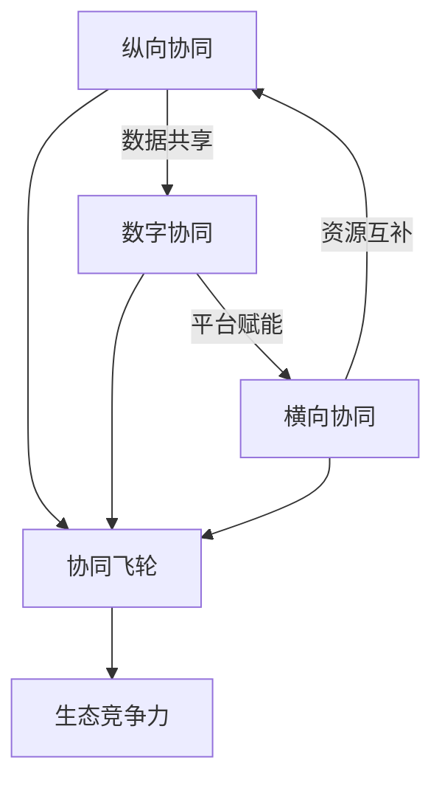

# 《高效协同》深度读书笔记

> [!abstract] 全书速览
> 这本书的核心论点是，供应链的竞争已经从单个企业的效率之争，升维为生态系统的协同之争。赵先德教授和他的研究团队从中欧国际工商学院的视角出发，结合京东、海尔、ZARA等标杆企业的实战案例，构建了一套"纵向协同-横向协同-数字协同"的三维分析框架。这本书要告诉你的不是怎么把供应链成本压到最低，而是怎么通过协同——与供应商深度绑定、与竞争对手选择性合作、用数字平台连接整个生态——把供应链从一个"花钱的部门"变成企业竞争优势的核心引擎。在全球供应链频繁中断、消费者需求碎片化、技术迭代加速的今天，这本书提供的不只是理论框架，更是一套可操作的实战指南。

## 核心命题

这本书回答的根本问题是：**在充满不确定性的商业环境中，企业如何通过供应链协同实现系统性的商业模式创新？**

这个问题的提出有明确的时代背景。过去二三十年，供应链管理的主流思路是"效率优先"——想方设法压缩库存、缩短周期、降低成本。这套打法在稳定的市场环境中确实有效，丰田的精益生产、戴尔的直销模式，都是效率导向供应链的经典案例。在那个时代，衡量供应链经理能力的核心指标就是成本：你能不能把供应链费用率压到行业最低？能不能把库存周转天数缩到同行的一半？

但世界变了。贸易摩擦让全球供应链变得脆弱，一场疫情就能让半导体断供几个月；消费者从"有什么买什么"变成"我要什么你得有什么"，需求碎片化让传统的大批量生产模式越来越力不从心；AI、物联网、区块链等技术的涌现，又创造了全新的协作可能性。全球供应链中断事件的年均增长率达到6.4%，企业供应链成本占总成本的15%到25%——供应链脆弱性已经成为企业面临的最大系统性风险之一。

赵先德的核心主张包含三层意思。第一，光靠自己优化效率已经到了天花板，你必须和外部伙伴深度协同才能应对复杂性。一家企业再强，它的资源和能力都是有限的，而市场的不确定性是无限的。第二，协同不是简单的"搞好关系"，而是需要系统设计的战略行为——和谁协同、在什么环节协同、用什么机制协同，都有讲究。很多企业嘴上说"战略合作"，实际上还是逢低买入的采购思维，这不是真正的协同。第三，==数字技术不仅是协同的工具，更是协同的催化剂和放大器==，它从根本上改变了协同的可能性边界。过去你和供应商协同，信息传递靠传真和电话，延迟和失真是常态；现在通过数据中台实时共享库存和需求数据，协同的深度和速度完全不在一个量级。

> [!tip] 核心洞察
> 这个主张挑战了商业世界的两个常识：一是"供应链就是成本中心"的认知——赵先德认为供应链可以、也应该成为价值创造的核心引擎。京东把供应链能力开放给第三方商家赚取服务费，就是供应链从"花钱"变"赚钱"的活生生例子。二是"竞争对手就是敌人"的思维定式——在很多场景下，和竞争对手合作比对抗更聪明。这不是天真的理想主义，而是经过严格经济学论证的理性选择。

## 框架全景

全书的核心框架是一个"三维协同模型"，它构成了理解全书所有内容的骨架。

**纵向协同**是第一个维度，指的是企业沿着供应链上下游——与供应商和客户——建立深度协作关系。往上游看，是把供应商从"比价采购的对象"升级为"共同创新的伙伴"；往下游看，是把客户从"产品的接收者"转变为"价值的共创者"。纵向协同的关键词是"深度"——不是泛泛的合作，而是信息共享、风险共担、利益共享的深度绑定。赵先德整合了三大理论来解释纵向协同的本质：交易成本理论解释"为什么要协同"（因为反复在市场上找新伙伴的搜寻成本、谈判成本、监督成本太高了），资源基础观解释"协同什么"（各方带来自己没有但对方有的差异化资源和能力），网络理论解释"如何协同"（通过关系治理而不仅仅是合同治理来管理合作）。

**横向协同**是第二个维度，指的是企业与同行业竞争对手之间的选择性合作。这听起来有点反直觉，但在很多场景下确实成立：在降低成本的环节（比如联合采购原材料、共建物流网络、共同制定行业标准）合作，在争夺客户的环节竞争。这就是所谓的"竞合"策略——合作不是放弃竞争，而是在更大的格局上重新划定竞争与合作的边界。赵先德强调，竞合的收益来源于"做大蛋糕"而非"分蛋糕"——当你和竞争对手在成本端合作时，整个行业的效率提升了，消费者获得了更好的性价比，市场总量扩大了，每家企业能分到的也更多了。

**数字协同**是第三个维度，也是将前两个维度粘合在一起的基础设施。数字平台通过数据流动打通信息壁垒，通过算法优化提升匹配效率，通过开放接口实现能力共享。没有数字化的支撑，纵向和横向的协同都会受限于信息不对称和协调成本。赵先德特别强调了"中台"架构的价值：数据中台汇聚和处理所有信息流，业务中台封装可复用的业务能力，技术中台提供底层的基础设施。中台的意义在于，它让协同从"一对一"的点状连接升级为"多对多"的网状连接——所有参与方都可以通过标准化接口接入同一个能力平台。

这三个维度不是各自独立的，它们之间存在相互强化的飞轮效应：纵向协同产生的数据喂养数字平台，数字平台的能力赋能横向协同，横向协同带来的资源互补又反过来深化纵向关系。理解了这个飞轮，你就抓住了全书的逻辑主线。==三维协同企业的资产回报率（ROA）比单维协同企业高出23%==——这个数据说明协同不是一道选择题，而是一道组合题，三个维度都做到位才能释放最大价值。

全书的展开路径也很清晰：先诊断问题（供应链面临什么新挑战），再建立理论框架（协同的本质是什么），然后分维度深入（纵向怎么做、横向怎么做、数字化怎么做），最后用京东、海尔等案例验证框架的有效性，并提炼可复制的方法论。

## 核心观点深度解读

### 一、从"链条"到"网络"：供应链管理的范式转换

赵先德在全书开篇就做了一个关键判断：==传统的供应链管理范式已经触及天花板==。

传统范式把供应链想象成一条"链"——原材料从供应商流向制造商，再流向分销商，最终到达消费者。管理的核心任务是让这条链跑得更快、成本更低。牛鞭效应、安全库存、经济批量——经典供应链管理的核心工具，都是为这个目标服务的。这套思路在供应链管理教科书里统治了几十年，培养了一代又一代"效率至上"的供应链经理人。

但"链条思维"有一个致命缺陷：它是线性的。一个节点出问题，整条链就断了。2020年疫情期间，全球汽车行业因为东南亚芯片工厂停工而大面积减产，就是这个问题的极端体现。当时很多车企只有一个芯片供应来源，一旦这个来源断裂，整条生产线就得停下来——不是因为缺钢材或轮胎，而是因为缺一块几美元的芯片。这暴露了效率至上思维的根本缺陷：为了追求极致的成本效率，企业把供应来源压缩到最少，把库存压到最低，结果在面对突发事件时完全没有缓冲余地。

赵先德提出的替代方案是"网络思维"。不是一条链，而是一张网——每个节点都有多个连接，某条路径断了，信息和物资可以通过其他路径流动。这张网的韧性公式可以粗略表达为：==韧性 = 冗余能力 x 响应速度 x 协同深度==。冗余提供了缓冲空间（不是只有一个供应商，而是有备选），响应速度决定了恢复效率（出了问题多快能启动替代方案），而协同深度决定了网络各节点能否在危机中相互支撑（你的合作伙伴愿不愿意在你最困难的时候调配资源帮你）。

这个范式转换的意义不仅是技术性的。它意味着供应链管理者的角色从"效率工程师"变成了"关系架构师"——你不只是在优化流程和压缩成本，更是在构建和维护一个复杂的合作网络。这对供应链管理者的能力要求也完全不同了：你需要的不只是运筹学和仓储管理的专业知识，还需要谈判能力、关系管理能力，甚至战略思维能力。

### 二、供应商关系金字塔：从比价采购到战略绑定

在纵向协同的上游端，赵先德提出了一个供应商关系金字塔模型，这是全书最具实操价值的框架之一。

金字塔的底层是**合格供应商**——满足基本的质量、交期和价格要求就行。对这一层，传统的比价采购策略完全适用，没必要投入过多的关系维护成本。你需要的是建立清晰的准入标准和考核体系，通过竞争机制保持价格竞争力。这一层的供应商数量通常最多，但单个供应商对你的战略影响最小。

中间层是**优选供应商**——在合格的基础上，具备某些差异化能力，比如更快的响应速度、更强的技术能力或更灵活的定制能力。对这一层，企业应该给予一定的优先权和稳定性承诺，换取对方更好的服务。比如在同等条件下优先给这些供应商下单，在市场波动时不轻易砍掉他们的订单。这种适度的承诺能让优选供应商愿意为你投入更多的响应资源。

顶层是**战略供应商**——这是真正的"铁哥们"关系。数量通常只占供应商总数的5%左右，但贡献往往超过半数的创新价值。

> [!example] 案例
> 丰田的战略供应商只占总数的5%，却贡献了60%的创新提案。这个比例非常惊人——它意味着丰田大部分的产品创新不是来自自己的研发部门，而是来自少数几个深度合作的供应商。对战略供应商的管理方式完全不同于普通供应商——你需要共享长期规划（至少3年的技术和业务路线图）、共同投资研发（成本共担、收益共享）、分享利润和风险（不是单方面压价，而是建立利益捆绑的机制）。

书中还引入了几个关键实践工具。VMI（供应商管理库存）让供应商根据你的实际消耗自动补货，省去了反复下单的协调成本——你不再需要每周发采购订单，供应商自己看你的库存水平，低于安全线就自动送货过来。JIT II更激进——让供应商的代表常驻在你的工厂里，直接参与生产计划和采购决策。这在传统采购思维里简直不可思议——让供应商的人坐在你办公室里？但实践证明，这种深度嵌入大幅降低了协调延迟和信息失真。供应商早期介入（ESI）则是在产品还在设计阶段就把供应商拉进来，让他们的工艺知识从一开始就融入产品设计。苹果和台积电的合作就是ESI的典范——芯片设计和制造工艺从最早期就联合规划，确保设计出来的芯片是最适合量产的。

> [!warning] 常见误区
> 很多企业把"采购金额最大的供应商"等同于"战略供应商"。这是错的。战略性体现在能力的互补性和长期的共同成长潜力，不是采购量的大小。一个年采购额不大但掌握关键技术的小型供应商，可能比你的最大供应商更值得战略投入。判断一个供应商是否值得升级为战略伙伴，你应该问三个问题：它的能力和我的需求是否高度互补？它有没有和我共同成长的意愿？它在自己的领域是否处于领先位置？三个问题都是肯定的，那就值得重点投入。

### 三、客户关系重构：从B2C到C2M

纵向协同的下游端同样经历着深刻变革。赵先德描述了客户关系的三次进化，这个演进路径清晰地展示了价值创造逻辑的根本转变。

第一阶段是经典的B2C——"我做你买"。企业先做出产品，然后想办法卖给消费者。这个模式的问题是，你永远在猜消费者想要什么，猜对了爆款，猜错了库存积压。传统的服装行业就是典型：提前6个月预测流行趋势、大批量生产、铺货到门店，卖不掉的打折处理。整个过程中消费者是被动的接收者，企业承担了全部的预测风险。

第二阶段是C2B——"你说我做"。通过数据洞察和需求感知，企业开始根据消费者的需求来定制产品。小米早期的"参与感"营销就是这个逻辑：在MIUI论坛上让用户投票决定下一个版本该加什么功能，然后按需开发。消费者不再是被动等待产品上市，而是主动表达自己的需求，企业根据这些需求来组织生产。

第三阶段是C2M（消费者直连制造）——"一起做"。消费者不仅表达需求，还直接参与产品的设计和创造过程。SHEIN的"测款-追单"模式是最好的例子：每天上新几千款产品，每款只生产极少量，通过消费者的实际购买行为来"投票"——哪款卖得好就立即追加产量，哪款没人买就快速下架。消费者用真金白银参与了"产品筛选"这个环节，而企业的供应链则需要具备极快的响应速度来配合这种模式——从下单到出货可能只有7天时间。

书中给出的数据很有说服力：==参与共创的客户复购率提升47%，客单价提升35%==。背后的道理并不复杂——当你参与了一个产品的诞生过程，你对它的情感投入完全不同。这就像自己组装的宜家家具，哪怕有点歪歪扭扭，你也会比买现成的更珍惜。这种参与感本身就构成了强大的用户粘性，而且这种粘性比价格优惠更持久、更难被竞争对手复制。

赵先德强调，这种客户协同不只是营销手段，更是供应链层面的深刻变革。当需求信号从"事后统计"变成"实时感知"，整个供应链的运作逻辑都要跟着变——从"按计划生产"变成"按需响应"，从"推式供应链"变成"拉式供应链"。这对企业的柔性制造能力、快速响应能力和数据处理能力都提出了全新的要求。一条只能大批量生产的产线，是无法支撑C2M模式的——你需要能快速换线、小批量试产、根据实时销售数据弹性调整产能的柔性制造系统。

### 四、竞合策略：和竞争对手做朋友

横向协同是全书最有思想冲击力的部分。赵先德系统阐述了"竞合"（Coopetition）的理论和实践，这个概念对很多在"竞争就是你死我活"环境中长大的企业管理者来说，需要一次认知上的刷新。

核心判断很简洁：竞争对手之间可以合作，而且在很多场景下应该合作。关键在于区分两种不同的环节——在**价值创造**环节合作，在**价值分配**环节竞争。

举个直观的例子：两家水果店是竞争关系。但如果它们一起去批发市场进货，就能拿到更低的批发价，双方的成本都降低了——这是价值创造环节的合作。回到各自的店铺后，各凭本事吸引顾客——这是价值分配环节的竞争。整个过程中，总的"蛋糕"变大了，两家都受益。这个看似简单的逻辑，在大企业层面同样成立，而且规模效应更加显著。

> [!note] 补充说明
> 航空联盟是大规模竞合的经典案例。星空联盟、寰宇一家的成员航空公司在航线网络、机场贵宾室、常旅客计划上深度合作，但在票价和服务体验上仍然激烈竞争。书中数据显示，联盟成员的单位运营成本比非联盟航空低18%。汽车行业也有类似实践：丰田和马自达共享平台开发成本，宝马和奔驰合作开发自动驾驶技术——在研发这个"价值创造"环节合作，在品牌和销售这个"价值分配"环节竞争。

赵先德提出了一个"竞合矩阵"来帮助企业做决策——根据"合作潜力"和"竞争强度"两个维度，将与竞争对手的关系分为四种类型。高合作潜力、低竞争强度的属于"快速收益区"，应该优先推进；高合作潜力、高竞争强度的属于"战略投资区"，值得重点攻克但需要精心设计合作机制；低合作潜力、高竞争强度的不值得在合作上花时间；低合作潜力、低竞争强度的可以机会主义地参与。这个工具的实用性很强：它帮你快速判断，面对某个竞争对手，你应该选择合作、竞争、还是两者兼顾。

> [!warning] 竞合风险
> 赵先德也诚实地指出了竞合的风险。信息共享可能被对手利用——你把自己的成本结构暴露给了合作伙伴，万一对方日后利用这些信息来针对你呢？能力开放可能培养出更强的竞争者——你帮竞争对手提升了效率，结果对方反过来在你的核心市场更有竞争力了。关系过度紧密可能丧失战略灵活性——当你和某个竞争对手的合作深入到基础设施层面，想要脱身的成本就变得非常高。竞合不是万能药，它需要精心设计的机制来管理合作与竞争之间的张力——比如清晰界定信息共享的范围、建立知识产权保护条款、保留退出机制等。

### 五、数字平台：协同的基础设施与放大器

数字协同是全书三维框架中的"技术底座"。赵先德的核心观点是：==数字平台不只是提升效率的工具，更是重新定义协同边界和可能性的催化剂==。

平台的价值可以用一个简洁的公式概括：**平台价值 = 用户规模 x 交互频次 x 数据密度**。用户越多，网络效应越强——一个只有10家商户的平台和一个有100万家商户的平台，对消费者的吸引力完全不同；交互越频繁，数据越丰富——每次交互都是一条数据，数据越多，平台对供需匹配的优化就越精准；数据越密集，匹配和优化的精度越高。三者相互强化，形成平台增长的飞轮：更多用户带来更多交互，更多交互产生更多数据，更多数据提升更好体验，更好体验吸引更多用户。

> [!example] 案例
> 京东最初自建物流是为了服务自营业务，但当物流网络足够大、效率足够高之后，它把这套能力开放给第三方商家——接入京东物流开放平台的商家，履约成本平均下降25%。这意味着京东的供应链能力从"成本中心"变成了"利润中心"，甚至成为一种全新的商业模式。这是一个非常深刻的商业逻辑转换：你花巨资建设的能力，服务完自己之后还有剩余产能，把这些剩余产能卖给别人，不仅回收了投资成本，还创造了新的收入来源。

赵先德详细讨论了平台的技术架构。数据中台汇聚和处理所有信息，业务中台封装通用的业务能力（比如订单管理、库存管理、物流调度），技术中台提供底层的技术支撑（比如云计算、安全、通信）。中台的价值在于"一次建设，多次复用"：前台的各种业务场景——无论是自营电商、第三方商家服务、还是跨境业务——都可以快速调用中台能力，而不需要每次都从零开始搭建。这大幅降低了新业务的启动成本和时间。

在智能供应链部分，赵先德描绘了一个令人兴奋的图景：AI驱动的供应链将像自动驾驶汽车一样运作——物联网传感器实时感知库存水位、物流状态和市场需求变化，算法自动预测未来需求并生成最优的采购计划和配送路线，仓储机器人自动拣货和打包，人类只需要处理系统无法应对的异常情况。京东的智能补货系统已经实现了95%以上的预测准确率，而人工预测通常只有60%到70%。这意味着AI的预测能力几乎比最有经验的老采购员还准确，而且它24小时不休息，可以同时处理数百万个SKU的补货决策。

> [!warning] 务实建议
> 智能化不是一步到位的事情。正确的路径是"数据在线化→流程标准化→决策规则化→系统自动化"，循序渐进。你得先把数据采集上来（从Excel搬到系统里），再把流程理清楚（不同人处理同一件事的方式得统一），然后把经验转化为规则（老采购员脑子里的判断逻辑得写成算法能理解的规则），最后才是让系统自动执行。很多企业在数据基础还没打好的时候就急着上AI，结果就是"垃圾进、垃圾出"——你给AI喂的是不准确、不完整的数据，它输出的预测自然也不靠谱。

### 六、京东与海尔：两种协同范式

全书用了相当篇幅对京东和海尔进行深度案例分析，这两个案例代表了两种截然不同但同样成功的协同范式。

**京东的范式是"一体化供应链"**。它的核心策略是自建——自己建仓库、自己养快递员、自己做数据系统。在很多人看来，这种"重资产+重运营"的模式不够聪明。2007年刘强东决定自建物流时，几乎所有投资人都反对——"你一个电商公司为什么要干物流的活？这得烧多少钱？"但京东用结果证明了这条路的价值：211时效（上午11点前下单当日送达）覆盖了90%以上的订单，库存周转天数控制在30天左右。作为对比，很多同行的库存周转天数是60到90天——京东的效率是行业平均水平的两到三倍。

这种"重"换来了体验的"快"和成本的"省"——因为仓库是自己的，可以把货提前放到离消费者最近的地方；因为快递员是自己的，服务标准可控，不会出现第三方快递的服务参差不齐问题。更关键的是，当这套能力成熟到一定程度后，京东把它开放出去，变成了"供应链即服务"（SCaaS）。你是一个中小商家，自己搞物流肯定搞不过京东，那就接入京东的物流平台，用京东的仓库、京东的快递员来服务你的客户。你的履约成本降低了25%，京东的物流设施利用率提高了——供应链从成本中心变成了利润中心，这是一个漂亮的商业模式闭环。

**海尔的范式是"平台型生态"**。它的核心策略恰好相反——不是集中建设，而是分散拆分。海尔把一家8万人的大型制造企业拆成4000多个"小微企业"，每个小微直接面对用户、自负盈亏，海尔总部变成提供资金、品牌、供应链支持的"平台"。赵先德用了一个很形象的比喻：这就像把一艘航空母舰改造成一个快艇舰队——每艘快艇灵活机动，舰队整体又有规模优势。

海尔"人单合一"模式的精髓在于两个字：直达。员工直达用户——不是通过层层汇报，而是小微团队直接和用户交互，感受用户的真实需求。价值直达创造者——小微的收入和用户满意度直接挂钩，做得好多赚，做不好少赚甚至亏损，这种激励机制比传统的KPI考核更加直接有效。平台在背后做的事情是"赋能而不干预"——提供品牌、资金、供应链资源和数据工具，但不插手小微的具体业务决策。这种模式从海尔内部孵化出了多个独角兽企业，证明了大企业也可以通过平台化保持创业活力。

> [!tip] 核心洞察
> 没有唯一正确的协同模式。京东选择了"自建-整合-开放"的路径，海尔选择了"拆分-赋能-生态化"的路径，两者都实现了高效协同，但方式完全不同。两个案例的共同点在于：都从"自己做所有事"走向了"让生态伙伴一起做"，都经历了从封闭到开放的转变，都把供应链能力视为战略资产而非运营负担。这或许是全书最深层的洞察——无论具体路径如何，=="从孤岛到生态"是所有企业供应链演进的大方向==。

## 保质期

这本书出版于数字化转型的热潮期，有些观点经受住了时间的检验，有些则需要打折扣。

**跨时代的洞察**。三维协同框架的底层逻辑——纵向做深、横向做广、数字打通——是不受时代限制的。无论技术如何变化，供应链管理的核心始终是"如何让不同主体更好地协作"。竞合策略的有效性也已被反复验证：从航空联盟到汽车行业的平台共享，再到芯片行业的制造代工模式（竞争对手共用同一家代工厂），竞合已经成为主流的战略选择。供应商关系金字塔模型同样具有持久价值——无论在什么行业，"区分对待不同层级的供应商"都是资源配置的基本常识。

**需要更新的部分**。书中对区块链在供应链中应用的乐观预期可能需要调低——到目前为止，区块链在供应链领域的大规模商业化应用仍然有限，落地速度远不如预期。溯源、防伪等场景有零星的应用案例，但离"区块链重塑供应链"的愿景还有很大距离。AI的发展则远超书中的描述——大语言模型和生成式AI正在创造全新的供应链应用场景（比如自动化的供应商谈判、用自然语言查询库存和生成采购计划、基于AI的风险预警系统），这些在书出版时还不存在。

> [!warning] 时代局限
> 书中的案例以中国互联网平台企业为主（京东、海尔、SHEIN），对传统制造业和中小企业的适用性讨论不够充分。一家年营收几千万的中型制造企业，面对的协同挑战和京东完全不同——它可能连基本的数据在线化都没完成，谈"智能供应链"和"生态化"为时过早。此外，书中对协同失败的案例分析明显不足，缺乏"什么情况下不应该协同"的负面清单。在实践中，过度协同的风险是真实存在的：信息过度透明可能被合作伙伴利用来打压你的议价空间，关系过度紧密可能让你在需要切换供应商时陷入被动（高昂的转换成本），能力过度开放可能无意中培养了更强的竞争对手。书中隐含的"协同总是好的"这个假设需要你自己去审视和挑战。

赵先德的核心框架仍然是理解供应链协同的优秀起点，但你需要根据自己企业的规模、行业和数字化程度来灵活调整应用方式。对于大多数中小企业来说，与其追求"三维协同"的宏大愿景，不如先把纵向协同做扎实——选好战略供应商、建立真正的信息共享机制、和核心客户形成稳定的需求反馈闭环。

## 行动工具箱

从书中提炼出以下可直接应用的工具和行动建议：

**工具一：供应链协同成熟度自评**。用四级模型评估你的企业处在哪个阶段——Level 1（内部信息孤岛已打通，各部门之间数据互通）、Level 2（与核心供应商和客户建立了数据共享和联合计划的深度协同）、Level 3（与竞争对手在特定环节有选择性合作，比如联合采购或共享物流）、Level 4（已形成平台化生态运营，能力对外输出创造新收入）。大多数企业处于Level 1到Level 2之间。你的当务之急是先把内部整合做扎实——如果采购部和销售部的数据都还没打通，谈和外部合作伙伴的协同就是空中楼阁。

**工具二：供应商关系金字塔梳理**。列出你的前20大供应商，按合格-优选-战略三个层次分类。重点问自己：谁是应该升级为战略供应商的？选择标准不是采购金额，而是能力互补性和共同成长潜力。对战略供应商，安排每季度一次的联合规划会议，共享至少未来6个月的业务预期和技术方向。一个简单的起步动作是：邀请你最重要的那个供应商的负责人来公司坐一天，让他了解你的产品路线图，你也了解他的产能计划和技术储备。很多突破性的协同机会就是在这种坦诚的面对面交流中发现的。

**工具三：竞合机会扫描**。画一张矩阵图，纵轴是"合作潜力"（成本节约空间、市场做大可能性），横轴是"竞争强度"（是否在核心市场正面交锋）。右上角（高合作潜力、低竞争强度）的区域是优先推进的竞合机会。比如你和一个竞争对手虽然产品线有重叠，但服务的地域市场不同——那在物流配送上合作就是双赢的。

**工具四：数字化协同路线图**。按"数据在线化→流程标准化→决策规则化→系统自动化"的顺序推进。如果你连基础数据都没有在线化（比如还在用Excel管库存、用微信群对接订单），不要急着上AI——先把地基打好。第一步就是选一个最痛的业务场景（通常是库存管理或订单跟踪），把纸质和Excel里的数据搬到系统里去。

**工具五：协同效果度量仪表盘**。选择3到5个关键指标来衡量协同效果：库存周转天数的变化（协同后是否减少了安全库存）、订单交付准时率的变化（协同后是否提升了交付可靠性）、供应商创新提案的数量（战略供应商是否在主动帮你优化）、客户复购率的变化（客户协同是否带来了更高的粘性）。每月回顾一次，用数据驱动持续改进。没有度量就没有管理——如果你说不清协同到底带来了什么具体好处，下一轮预算审批时就很难为协同项目争取到资源。

周一回到办公室，你可以做的第一件事是：和供应链团队坐下来，用成熟度模型做一次坦诚的自评。不需要追求完美的评分，重要的是让团队对"我们在哪里"和"我们要去哪里"形成共识。有了共识，才能聚焦资源做最重要的事。

## 延伸阅读

如果你想在供应链管理领域进一步深入，有两本书值得对照阅读。

[[《竞争战略》]]（迈克尔·波特）提供了一个互补的视角。赵先德强调协同与合作，波特则强调竞争与壁垒。把两者放在一起读，你会对"什么时候该合作、什么时候该竞争"有更立体的判断。波特的"五力模型"可以帮你分析供应商和客户的议价能力，这恰恰是决定协同策略的关键变量——当供应商议价能力很强的时候，协同可能是缓解这种压力的有效手段；当你自己议价能力很强的时候，则需要警惕过度协同反而削弱了自己的谈判地位。

[[《平台革命》]]（杰弗里·帕克等）是数字协同维度的最佳补充读物。赵先德的书对平台的讨论偏向供应链视角，而这本书从更宏观的平台经济学角度，系统阐述了网络效应的运作机制、平台治理的核心挑战、多边市场的定价策略等核心概念。如果你正在考虑将自己的供应链能力平台化输出——就像京东把物流能力开放给第三方商家那样——这本书几乎是必读的，它能帮你理解平台化转型中那些看不见的陷阱和关键决策点。
