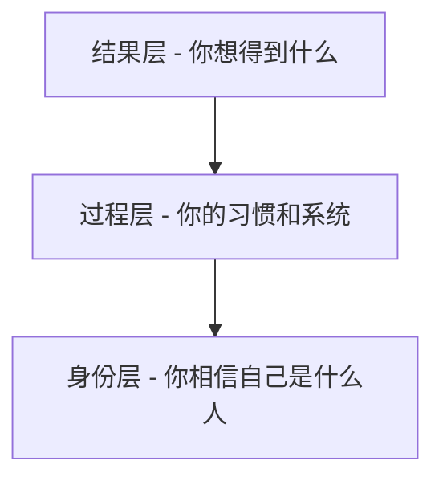

# 《原子习惯》深度读书笔记

> [!abstract] 全书速览
> 这本书的核心主张可以用一句话概括：==微小的改变带来显著的结果==。詹姆斯·克利尔认为，习惯改变的关键不在于追求轰轰烈烈的转变，而在于每天进步1%的持续积累。他提出了一套完整的习惯系统——"行为改变四定律"：让它显而易见、让它有吸引力、让它简便易行、让它令人愉悦。这不是一本告诉你"应该养成什么习惯"的书，而是一本教你"习惯是如何运作的、如何被设计的"底层操作手册。

## 这本书解决什么问题

如果你曾经尝试过养成新习惯却失败了——健身坚持不过三周、早起打卡中断、阅读计划无疾而终——这本书能帮你理解问题出在哪里。

詹姆斯·克利尔自己就是这套方法的活体验证。高中时他被棒球棒意外击中面部，遭受严重脑损伤，花了很长时间才恢复。大学期间，他开始用微小习惯重建自己的生活，最终成为校棒球队的优秀球员，后来更被评为年度最佳男运动员。这段经历让他深刻理解：==改变不是一个事件，而是一个过程==。

这本书和大多数自我提升书籍的不同之处在于：它不喊口号，而是拆解机制。克利尔不说"你要有毅力"，而是告诉你"毅力是一种设计出来的结果"。他把习惯当作一个可以被工程化的系统来看待——就像工程师设计产品一样，你可以设计你的习惯系统。

## 方法论全景

克利尔的习惯系统建立在一个核心洞察上：==习惯的本质是你重复了足够多次的行为，以至于它变成了自动化==。

每一个习惯都遵循相同的四步循环：

**提示** → **渴望** → **反应** → **奖励**

提示触发你的大脑启动某个行为；渴望是推动行为的动机；反应是你实际执行的习惯本身；奖励是行为带来的满足感，它教会你的大脑这个循环值得重复。

基于这个循环，克利尔提出了"行为改变四定律"：

| 要养成好习惯 | 要戒除坏习惯 |
|-------------|-------------|
| 让它显而易见 | 让它隐而不见 |
| 让它有吸引力 | 让它缺乏吸引力 |
| 让它简便易行 | 让它困难重重 |
| 让它令人愉悦 | 让它令人厌恶 |

这套框架的精妙之处在于：它不依赖意志力。你不需要每天和自己的欲望搏斗，而是==通过设计环境和系统，让正确的行为变成阻力最小的选择==。

> [!tip] 核心洞察
> 你不会上升到目标的高度，你会下降到系统的水平。

## 逐个工具拆解

### 工具一：习惯记分卡

**解决什么问题**：很多人对自己的日常习惯缺乏觉察。你可能不知道自己每天查看手机多少次，或者在什么时候最容易吃零食。改变的第一步是看见。

**具体操作**：
1. 拿出一张纸，从早上睁眼开始，列出你一天中所有的习惯
2. 在每个习惯后面标记：+（好习惯）、-（坏习惯）、=（中性习惯）
3. 标记的标准不是"社会认为好不好"，而是"这个习惯是否帮助我成为想成为的人"

**最佳使用场景**：当你感觉"不知道问题出在哪"的时候

**不适用场景**：不要用它来给自己打分或产生内疚感，它只是一个觉察工具

> [!example] 类比
> 习惯记分卡就像给自己的生活做一次"体检报告"——你不是为了批判自己，而是为了知道现状。

### 工具二：执行意图

**解决什么问题**：模糊的计划导致模糊的执行。"我要多运动"这种目标基本等于没有目标。

**具体操作**：使用这个公式——

> 我会在【时间】于【地点】做【行为】

不是"我要每天阅读"，而是"我会在晚上9点于书房阅读30分钟"。

**为什么有效**：研究表明，写下具体的时间和地点，可以让人实际执行的概率提高2-3倍。因为当那个时刻到来时，你的大脑不需要做决定，只需要执行。

> [!tip] 关键洞察
> ==决策疲劳是习惯的大敌==。每一次你需要"决定"是否要做某件事，你就消耗了一点意志力。执行意图把决策前置，把执行变成自动化。

### 工具三：习惯叠加

**解决什么问题**：新习惯没有触发机制，很容易被遗忘。

**具体操作**：使用这个公式——

> 在我【当前习惯】之后，我会【新习惯】

例如：
- 在我早上倒完咖啡之后，我会冥想一分钟
- 在我坐下准备午餐之后，我会说出今天感恩的一件事
- 在我脱下工作的鞋之后，我会立刻换上运动服

**为什么有效**：你的大脑已经为现有习惯建立了强大的神经通路。把新习惯绑定到旧习惯上，你是在借用已有的神经通路，而不是从零建立。

**注意事项**：
- 选择一个已经稳定存在的习惯作为"锚点"
- 新习惯和锚点习惯在时间和场景上要自然衔接
- 开始时不要把链条设计得太长

> [!example] 类比
> 就像多米诺骨牌，你不需要每一张都单独推，只要把它们排好，推倒第一张，后面的就会自动跟着倒。

### 工具四：环境设计

**解决什么问题**：意志力是有限的资源，依赖意志力的习惯策略注定失败。

**核心原则**：==让好习惯的提示显而易见，让坏习惯的提示隐而不见==。

**具体操作**：
- 想多喝水？把水杯放在你视线范围内最显眼的地方
- 想少刷手机？把手机放在另一个房间充电
- 想多阅读？把书放在枕头上，而不是书架上
- 想健康饮食？把水果放在餐桌上，把零食藏到柜子深处

> [!example] 核心类比
> 你是环境的建筑师，不是环境的受害者。与其每天和冰箱里的蛋糕做斗争，不如一开始就不买蛋糕。

**进阶技巧**：为不同的习惯设计不同的空间。如果可能，让你的书桌只用来工作，床只用来睡觉。当一个空间只和一个习惯关联，触发就会更稳定。

### 工具五：两分钟规则

**解决什么问题**：完美主义和畏难情绪让你迟迟无法开始。

**具体操作**：任何习惯都可以被缩减到两分钟版本。

- "每天阅读30分钟" → "每天读一页"
- "做30分钟瑜伽" → "拿出瑜伽垫"
- "学习新语言" → "打开学习App"
- "整理房间" → "把一件东西放回原位"

**为什么有效**：==习惯的关键是"开始"，而不是"做多少"==。一旦你开始了，你往往会继续做下去。但如果你连开始的门槛都迈不过去，后面什么都不会发生。

> [!warning] 常见误区
> 很多人会觉得"只做两分钟有什么用"。但克利尔的观点是：你首先要成为"每天阅读的人"，然后才能成为"每天阅读30分钟的人"。==先标准化，再优化==。

### 工具六：承诺装置

**解决什么问题**：你知道某件事对你好，但当诱惑来临时，你的未来自我总是敌不过当下的欲望。

**具体操作**：在你有理性的时候，为未来的自己锁定选择。

- 想存钱？设置工资自动转入储蓄账户
- 想减少社交媒体？用App限制器设定每日上限
- 想早起？让朋友在固定时间给你打电话
- 想健康饮食？周末做好一周的便当

**核心逻辑**：==让做正确的事变得自动化，让做错误的事变得麻烦==。

> [!example] 类比
> 就像奥德修斯让船员把自己绑在桅杆上，才能听塞壬的歌声而不被诱惑跳海。你用一个清醒时刻的决定，约束了未来无数个可能软弱的时刻。

### 工具七：习惯追踪

**解决什么问题**：缺乏可视化的进度，让人容易放弃。

**具体操作**：
- 用日历、App或简单的清单记录每天是否完成习惯
- 关注"不断链"——连续完成的天数越多，你越不想中断

**为什么有效**：
1. 追踪本身就是一个提示
2. 看到自己的进步很有成就感
3. 不想"断链"的心理会推动你继续

> [!warning] 重要提醒
> 克利尔强调"绝不错过两次"原则。错过一次是意外，错过两次是新习惯的开始。==如果你错过了一天，立刻恢复==，不要让一次失误变成滑坡。

### 工具八：身份认同转换

**解决什么问题**：很多人的习惯失败，是因为改变只停留在行为层面，没有触及身份层面。

克利尔提出，改变有三个层次：

大多数人从"结果"出发：我想减肥 → 我要节食。但真正持久的改变从"身份"出发：==我是一个健康的人 → 健康的人会怎么做？==

**具体操作**：
- 不要说"我正在戒烟"，说"我不是吸烟的人"
- 不要说"我想成为作家"，说"我是一个写作的人"
- 每一次完成小习惯，都是在为新身份投票

> [!tip] 核心洞察
> ==每个行动都是你想成为什么人的一张选票==。你不需要完美，你只需要大多数时候投票给正确的身份。

## 常见误区

**误区一：追求戏剧性的改变**

很多人觉得改变应该是"脱胎换骨"式的，所以他们设定宏大的目标，然后很快因为无法坚持而放弃。克利尔的观点是：==微小的改变更容易坚持，而坚持比强度重要得多==。每天进步1%，一年后你会进步37倍。

**误区二：专注于目标而非系统**

目标是你想要达到的结果，系统是导向那个结果的过程。赢家和输家有同样的目标——都想赢。区分他们的是系统。==当你爱上过程而不仅仅是结果，你就不需要等到成功才能快乐==。

**误区三：认为习惯会限制自由**

有人担心习惯会让生活变得无聊和机械。但克利尔指出：习惯不是自由的敌人，而是自由的基础。当基本的事情变成自动化，你的心智资源就被释放出来，可以用于真正需要创意和决策的地方。

**误区四：在错误的层次努力**

很多人在"结果"层次努力，试图通过意志力直接改变行为。但更有效的做法是在"环境"层次努力（设计让正确行为变容易的环境）和"身份"层次努力（改变对自己的认知）。

**误区五：忽视习惯的复利效应**

习惯的回报不是线性的，而是指数级的。开始的时候你几乎看不到变化，这被克利尔称为"失望谷"或"潜能蓄积期"。很多人在这个阶段放弃，就像在冰块即将融化之前停止加热一样可惜。

> [!note] 关于"高原期"
> 克利尔特别提到，习惯的进步往往不是均匀的。你可能会经历长时间的"看不到进展"，然后突然迎来突破。==理解这种非线性是坚持的关键==。

## 快速启动指南

> [!tip] 如果只做一件事
> 选择一个你想养成的习惯，用"两分钟规则"把它缩减到最小版本，然后用"习惯叠加"把它绑定到一个已有的习惯上。

**第一周：建立基础**
- 做一次习惯记分卡，了解你当前的习惯地图
- 选择**一个**想要养成的习惯（不要贪多）
- 用两分钟规则设计它的最小版本
- 用执行意图写下"我会在【时间】于【地点】做【行为】"
- 简单追踪（日历上打勾就行）

**第一个月：固化和扩展**
- 如果两分钟版本已经稳定，可以慢慢增加时间/强度
- 设计你的环境，让正确的提示更明显
- 尝试习惯叠加，把新习惯和已有习惯绑定
- 开始思考身份层次：这个习惯让你成为什么样的人？

**三个月后：系统化**
- 评估什么有效、什么无效，调整策略
- 可以开始加入第二个习惯
- 考虑设置承诺装置，自动化你的选择
- 持续追踪，庆祝你的进步

## 延伸阅读

如果你想深入理解习惯和行为改变，可以继续阅读：

- [[《习惯的力量》]]（查尔斯·杜希格）：侧重于解释习惯背后的神经科学，和《原子习惯》形成互补。《原子习惯》更偏"怎么做"，《习惯的力量》更偏"为什么"。杜希格的"提示-惯常行为-奖励"循环是克利尔四步循环的基础。

- [[《微习惯》]]（斯蒂芬·盖斯）：把"从小处开始"的理念推到极致。如果你觉得《原子习惯》的两分钟规则还是太难，可以试试这本书的"小到不可能失败"的策略，比如每天只做一个俯卧撑。
