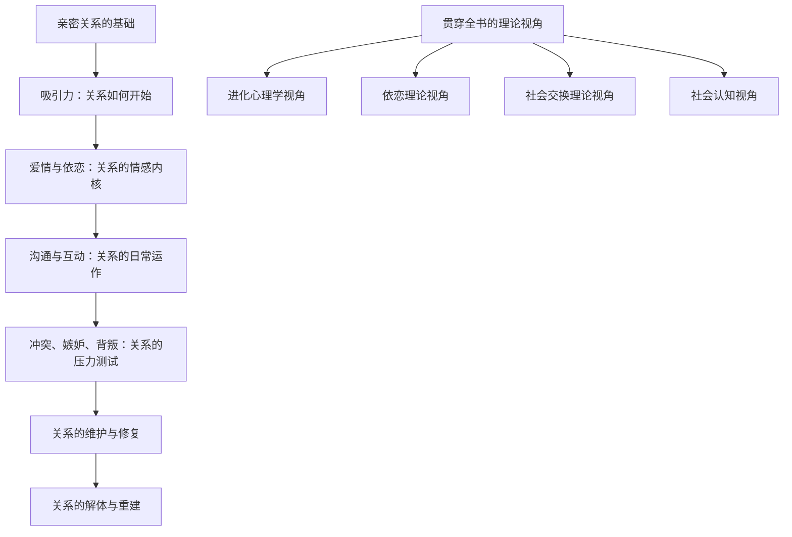

# 《亲密关系》深度读书笔记

> [!abstract] 全书速览
> 你以为你懂爱情，但你可能从未真正理解过亲密关系是如何运作的。罗兰·米勒这本社会心理学教科书，用几十年的实证研究拆解了亲密关系的每一个环节——从最初的吸引到最终的分离，从依恋模式到沟通困境，从嫉妒的进化根源到背叛的心理后果。它不给你鸡汤式的"爱情指南"，而是把关系当作一个可以被科学观察、测量和理解的现象来分析。读完这本书，你不会变成恋爱高手，但你会开始用一双完全不同的眼睛来审视你所有的亲密关系——包括那些正在发生的和那些已经结束的。理解机制不等于控制结果，但不理解机制，你甚至不知道自己为什么会反复跌进同一个坑里。

## 这本书揭示了什么

你可能注意过这样一个现象：有些人谈恋爱总是重复同一种模式——选择同一类人，犯同一种错误，经历同一种崩溃。他们换了对象，却仿佛在演同一出戏。这不是"命运"，也不是"缘分"，而是有深层的心理机制在驱动。

罗兰·米勒和丹尼尔·珀尔曼合著的《亲密关系》，是关系科学（relationship science）领域最重要的综合性著作之一。它的核心发现可以浓缩为一句话：==亲密关系不是两个人之间自然而然发生的事情，而是受到个体心理特征、互动模式和社会文化环境三重力量塑造的复杂系统。==

> [!note] 背景信息
> 这本书的学术根基是扎实的。米勒是萨姆·休斯顿州立大学的心理学教授，研究人际关系超过三十年。这本教科书自1988年首版以来已更新至第八版，综合了来自社会心理学、进化心理学、临床心理学、传播学等多个学科的研究成果。它引用的研究文献超过三千篇。与通俗情感读物不同，这本书的每一个论断都有实验证据或大规模调查数据作为支撑。

这本书的重要性在于它揭示了一个被忽视的事实：人们在亲密关系中遭遇的大多数痛苦，并非来自"遇到了错误的人"，而是来自==对关系运作机制的无知==。你不理解依恋系统如何运作，就不明白为什么有些人越被推开越要靠近；你不理解[[归因]]过程如何扭曲判断，就不明白为什么同一句话在关系好的时候听起来是关心、在关系差的时候听起来是挑剔。这本书提供的不是答案，而是一套看清问题的镜片。

## 理论框架

这本书的架构可以理解为对亲密关系"生命周期"的系统性科学解剖。

> [!tip] 核心洞察
> 米勒用四个主要的理论视角贯穿全书：==进化心理学==解释"为什么"（为什么人类会嫉妒、为什么男女在择偶标准上存在差异）；==依恋理论==解释"个体差异"（为什么同样的情境，不同人反应截然不同）；==社会交换理论==解释"关系的经济学"（人们如何评估关系的成本和收益）；==社会认知视角==解释"认知如何扭曲现实"（为什么你看到的伴侣可能不是真实的伴侣）。这四个视角不是互相排斥的，而是从不同层面照亮同一个现象。最精彩的章节往往是四个视角交汇的地方——比如解释"为什么出轨"时，进化、依恋、交换和认知各自提供了一块拼图。

## 核心发现深度解读

### 发现一：依恋风格——你在关系中的"操作系统"

你有没有遇到过这种情况：你的伴侣只是晚回了一条消息，你就开始焦虑地想各种可能性——是不是在和别人聊天？是不是不在乎你了？或者相反，你的伴侣想要更多的亲密，而你本能地想后退，觉得"窒息"。

这两种反应背后是不同的==依恋风格==。这是《亲密关系》中最有解释力的概念之一，最早由约翰·鲍尔比提出、玛丽·安斯沃斯通过"陌生情境"实验在婴儿身上验证，后由辛迪·哈赞和菲利普·谢弗扩展到成人关系。

> [!example] 关键实验
> 安斯沃斯的"陌生情境"实验观察12至18个月大的婴儿在母亲短暂离开又返回时的反应。大约60%的婴儿表现出==安全型依恋==——母亲离开时不安，回来时欣喜并迅速恢复平静；约20%表现出==焦虑-矛盾型==——母亲离开时极度痛苦，回来时既靠近又生气推开；约20%表现出==回避型==——看似对母亲的离开和返回都无动于衷，但生理指标（如心率）显示他们的内心压力同样巨大。

哈赞和谢弗在1987年的一项经典研究中发现，成人的依恋风格分布与婴儿惊人地相似——大约56%的成年人报告自己是安全型，25%是回避型，19%是焦虑型。更关键的是，==依恋风格深刻影响了人们在关系中的几乎所有行为==：从如何应对冲突、如何表达需求、如何处理嫉妒，到关系满意度和持续时间。

焦虑型的人像一个过度敏感的"关系雷达"——他们不断扫描伴侣的行为以寻找被抛弃的信号，一有风吹草动就拉响警报。回避型的人则像戴着一副"情感防护罩"——不是不需要亲密，而是早年经验教会了他们"靠近等于受伤"。当焦虑型和回避型配对时（这种组合比你想象的常见得多），就形成了经典的"追-逃循环"：焦虑的一方越追，回避的一方越逃，而逃的行为又进一步激活了追的焦虑。

> [!warning] 注意
> 依恋风格不是一成不变的标签。后续的纵向研究显示，大约30%的人在不同的人生阶段会经历依恋风格的转变。一段足够安全的关系可以逐渐"修复"不安全的依恋模式，反过来，持续的创伤性关系经历也可能削弱原本安全的依恋。依恋风格更像是一个"默认设置"，而非不可更改的命运。

### 发现二：吸引力的科学——你以为是"缘分"的东西

你以为你爱上一个人是因为"感觉对了""灵魂契合"。研究告诉你的却是另一个故事：吸引力的发生有非常可预测的规律，而这些规律并不总是浪漫的。

==接近性==（proximity）是最强大却最不被承认的吸引力因素。费斯廷格对麻省理工学院学生宿舍的经典研究发现，住在同一层楼的人成为朋友的概率是不同楼层的人的十倍。在纽约警察学院的一项研究中，学员的亲密友谊严格遵循字母表——按姓氏排座位，座位紧邻的人最可能成为好友。你跟谁坠入爱河，在很大程度上取决于你跟谁碰巧经常碰面。

> [!example] 日常体现
> 为什么办公室恋情如此常见？不是因为办公室有什么浪漫气氛，而是因为你和同事反复接触。心理学家把这称为==曝光效应==——仅仅是反复看到一个面孔，就足以让你对这个人产生好感。扎荣茨的实验证明，即使受试者无法有意识地回忆起那些面孔，反复曝光仍然提升了好感度。你觉得你是"日久生情"，但可能只是"日久曝光"。

==外表吸引力==的影响力比大多数人愿意承认的更大。沃尔斯特和她同事在明尼苏达大学组织的经典"电脑舞会"实验中，随机配对了700多名新生，让他们参加一场舞会。研究者事先测量了参与者的智力、人格、社交技能等各种指标。结果只有一个变量预测了人们是否想要第二次约会：对方的外貌吸引力。智力、幽默、性格——统统不显著。

但在你愤世嫉俗之前，有两个重要的修正：第一，外貌的影响在关系初期最大，在长期关系中逐渐被其他因素（如性格、价值观、相处模式）超越；第二，==匹配假说==表明，人们最终倾向于和自己吸引力水平相近的人在一起——不是因为不想要更好看的对象，而是因为被拒绝的风险会校正你的选择。

==相似性==对长期关系的预测力远超互补性。"异性相吸"是一个迷人的说法，但几乎没有研究支持它。伯恩的大量研究表明，在态度、价值观、性格特征、兴趣爱好等维度上，==相似性与人际吸引之间存在近乎线性的正相关==。一项对超过一万对夫妻的元分析发现，伴侣之间在政治态度和宗教信仰上的相似性对婚姻满意度有显著预测力。

### 发现三：爱情的三角形——爱情不是一种东西，而是三种

你说你"爱"一个人。但你说的"爱"到底是什么？

罗伯特·斯滕伯格的==爱情三角理论==把"爱"拆解为三个成分：亲密（intimacy）——温暖、连接、分享的感觉；激情（passion）——强烈的吸引、性欲望和兴奋感；承诺（commitment）——维持关系的决定和长期投入。

> [!tip] 核心洞察
> 三个成分的不同组合产生了截然不同的"爱的类型"：只有激情是"迷恋"（infatuation），只有亲密是"喜欢"（liking），只有承诺是"空洞之爱"（empty love）。亲密+激情是"浪漫之爱"，亲密+承诺是"友伴之爱"，激情+承诺是"愚蠢之爱"。三者兼备才是"完满之爱"——它存在，但比大多数人以为的稀少得多，而且维持它比获得它更难。

这个理论最有现实冲击力的部分是关于==激情的时间曲线==。研究显示，浪漫激情在关系的头一两年达到巅峰，随后不可避免地下降。这不是"爱消失了"，而是大脑的多巴胺系统对同一刺激产生了适应。特克和同事对超过5000名来自25个国家的被试的研究确认了这一跨文化模式。你不是遇到了错误的人——你的神经化学系统正在按照设计好的程序运行。

与此同时，==友伴之爱==（以亲密和承诺为基础）随着时间推移可以保持甚至增长。长期幸福关系的秘诀不在于维持最初的激情强度（这在生理上几乎不可能），而在于在激情自然消退之后，是否建立了足够深厚的亲密感和足够坚定的承诺。

### 发现四：社会交换——关系中的"隐性账本"

你可能觉得用"成本-收益"来分析爱情是冷酷的。但研究显示，人们在亲密关系中确实在做类似的计算——通常是无意识的。

==社会交换理论==认为，人们对关系的满意度取决于一个简单的公式：关系结果 = 收益 - 成本。但聪明之处在于接下来的两个概念：==比较水平==（comparison level, CL）是你对关系的期望标准，它由你过去的关系经验和社会参照决定——如果你的前任非常体贴，你的CL就被抬高了。==替代比较水平==（comparison level for alternatives, CLalt）是你认为离开当前关系后能获得的最佳选择。

> [!example] 理论运作
> 想象这个情境：你的关系是"还行"（收益略大于成本）。如果你过去的关系很糟糕（低CL），你会觉得现在的关系不错；但如果你过去的关系很好（高CL），"还行"就让你不满。现在再加入替代品：即使你不满意，如果你认为没有更好的选择（低CLalt），你也可能留下来。鲁斯布尔特把这种状态称为==关系投入模型==：满意度高、替代品少、投资多（共同财产、共同朋友、共同记忆），三者共同决定承诺水平。这解释了为什么有些人留在明显不幸福的关系中——不是因为满意，而是因为替代品差、沉没成本高。

这套理论听上去冰冷，但它有惊人的预测力。鲁斯布尔特的纵向研究发现，投入模型对分手和留下的预测准确率超过了仅用"满意度"预测的准确率。人们不是简单地因为不开心就离开——他们是在做一个复杂的、通常不自觉的多维度评估。

值得注意的是，==公平理论==对社会交换做了重要补充：人们不仅关心绝对收益，还关心相对公平。如果你觉得自己付出了90%而对方只付出了10%，即使你获得的绝对收益很高，你也会不满。然而研究也发现，在最满意的关系中，伴侣往往不太做精确的"记账"——他们采用"共同体取向"（communal orientation）而非"交换取向"（exchange orientation），更关注对方的需求而不是自己的投入产出比。

### 发现五：沟通中的致命四骑士

婚姻研究的领军人物约翰·戈特曼在他的"爱情实验室"（Love Lab）中做了一件惊人的事：他让夫妻讨论一个分歧话题，只观察前三分钟的互动，就能以超过90%的准确率预测这对夫妻会不会在六年内离婚。

他的秘密是识别了四种毒性沟通模式，他称之为"==末日四骑士=="：

**批评**（criticism）：不是对具体行为的抱怨，而是对人格的攻击。"你从来不倒垃圾"和"你太懒了"的区别在于，前者指向行为，后者指向人格。批评的特征标志是"你总是……""你从来不……"

**蔑视**（contempt）：带有优越感的不尊重——讽刺、挖苦、翻白眼、冷笑。蔑视是四骑士中最具破坏力的。戈特曼的研究发现，关系中蔑视的频率不仅预测离婚率，甚至能预测被蔑视方的免疫系统功能下降和患病次数增加。

> [!warning] 注意
> 戈特曼发现了一个精确的比例：==在稳定的关系中，积极互动与消极互动的比例至少是5:1==。一次负面互动的破坏力大约等于五次正面互动的建设力。这就是为什么"没有大吵"不等于"关系很好"——如果积极互动太少，关系同样会枯萎。

**防御**（defensiveness）：面对批评时的自我辩护和反击。"那是因为你先……"。防御的问题在于它本质上是在说"问题不在我"，从而让对方觉得自己的感受被无视。

**石墙**（stonewalling）：情感关闭、拒绝沟通。一方试图讨论问题，另一方沉默、回避目光、离开房间。戈特曼的生理监测数据显示，石墙通常发生在一方的心率超过每分钟100次时——大脑进入了"战斗或逃跑"模式，理性沟通的能力暂时关闭了。约85%的石墙者是男性，这可能与男性的生理应激反应更强烈有关。

### 发现六：归因偏差——你看到的不是事实，而是你的解读

你的伴侣下班回家，把包往沙发上一扔，什么也没说就走进了卧室。

如果你们的关系很好，你可能会想："他今天一定很累。"如果你们最近经常吵架，你可能会想："他又在给我脸色。"

==同一个行为，在关系满意的人和关系不满意的人眼中，意义完全不同。==米勒在书中详细讨论了这种==关系归因偏差==。

满意的伴侣做出"关系增强归因"：对方的好行为被归因为内在的、稳定的、整体的原因（"他就是这么体贴的人"），对方的坏行为被归因为外在的、暂时的、局部的原因（"他只是今天压力大"）。不满意的伴侣做出完全相反的"苦恼维持归因"：对方的好行为被打折（"他只是想要什么吧"），坏行为被放大（"他就是个自私的人"）。

> [!tip] 核心洞察
> 这创造了一个==自我实现的循环==：关系好→积极归因→积极回应→关系更好；关系差→消极归因→消极回应→关系更差。归因模式不仅是关系质量的结果，它本身就是驱动关系走向的强大力量。布拉德伯里和芬查姆的纵向研究表明，==归因模式比冲突频率更能预测关系满意度的长期变化==。

这意味着改善关系的一个关键杠杆点不是改变对方的行为，而是觉察和校准你自己的归因模式。当你发现自己在对伴侣做"他/她就是这种人"的整体性负面判断时，暂停一下，问自己：如果换一个解释呢？

### 发现七：嫉妒——进化的遗产与现代的困境

嫉妒是亲密关系中最具破坏力的情绪之一，但它的存在有深刻的进化逻辑。

进化心理学家大卫·巴斯和他的同事做了一个至今仍有争议的实验：让男性和女性分别想象伴侣的性背叛和情感背叛，同时测量他们的生理反应（心率、皮肤电导率、眉间肌收缩）。结果显示，==男性对性背叛的反应更强烈，女性对情感背叛的反应更强烈==。

> [!example] 进化解释
> 巴斯的理论认为这源于不同的进化压力：在人类进化史上，男性面临的独特风险是"父权不确定性"——如果伴侣发生性关系外的受孕，男性可能在不知情的情况下抚养非亲生后代。因此对性背叛的高度警觉被选择保留。女性面临的独特风险是资源转移——如果伴侣情感转移，她和子女可能失去生存所需的资源和保护。因此对情感背叛的高度警觉被选择保留。

但这一发现受到了持续的学术挑战。德斯特诺和萨洛维提出，性别差异可能部分源于"双重推断"：女性假设性背叛意味着情感也背叛了，而男性不做这个假设。后续的跨文化研究结果也不一致——在一些性别平等程度较高的社会中，这种性别差异会缩小。

米勒在书中对这个争议的处理是审慎的：进化视角提供了一个有价值的解释框架，但不应该被简化为"男人天生就这样""女人天生就那样"。嫉妒的表达和管理受到文化、个人经历和关系质量的强烈影响。

### 发现八：关系的溶解——不是突然断裂，而是缓慢死亡

大多数关系不是因为一次戏剧性的背叛或爆发而结束。它们更像是慢性病——症状逐渐加重，直到某个时刻累积到了无法承受的程度。

达克提出了==关系解体模型==，描述了关系走向终结的四个阶段：内心阶段（一方开始反复权衡关系的利弊）→对偶阶段（把不满说出来，和伴侣谈判）→社会阶段（告诉朋友和家人，寻求社会支持或认可）→坟墓修饰阶段（为关系撰写"死亡叙事"——一个对自己有利的故事版本）。

> [!note] 研究发现
> 鲁斯布尔特发现，当人们对关系不满时，他们的反应可以沿两个维度分类：积极-消极，主动-被动。这产生了四种策略：==表达==（积极主动：讨论问题、寻求帮助）、==忠诚==（积极被动：等待情况改善、保持乐观）、==忽视==（消极被动：回避伴侣、减少接触）、==退出==（消极主动：威胁离开、实际分手）。关系满意度高、投入多的人更倾向于建设性策略（表达和忠诚），而不是破坏性策略（忽视和退出）。

分手后的心理影响比大多数人预期的更深远也更持久。研究显示，分手后的情绪恢复期平均需要数月到一年，但对自我概念的影响可能持续更久。斯洛特和他的同事发现，被分手的一方往往经历"自我概念清晰度"的显著下降——因为在亲密关系中，你的自我认知与对方深度交织，关系的断裂在某种意义上也是"自我"的断裂。

## 认知纠偏清单

读完这本书，以下这些常见的思维习惯值得你警惕：

**"灵魂伴侣"信念。** 相信存在一个"命中注定"的完美对象，只要找到他/她就一切顺利。这种信念被称为"命运信念"（destiny belief），持有这种信念的人在遇到关系困难时更容易放弃——既然不是命中注定的，何必挣扎。相比之下，"成长信念"（growth belief）——相信好关系是通过共同努力培养出来的——与更高的关系满意度和更有效的冲突应对策略相关。

**高估激情的持久性。** 你以为心跳加速、日夜思念的感觉应该永远持续。当这些感觉自然消退时（通常在一到两年之后），你以为是"不爱了"。这是对爱情化学机制的误解——==激情消退是生理常态，不是关系失败的信号==。

**"读心术"假设。** "如果他真的爱我，他应该知道我需要什么。"这是一个在研究中被反复证伪的期望。研究显示，即使是关系非常亲密的伴侣，对彼此想法和感受的准确判断率也只是比随机猜测略高。伴侣之间的"心有灵犀"很大程度上是事后归因的结果。

**忽视接近性的力量。** 你以为你爱上谁完全是因为对方的内在品质。但如果你当初坐在教室的另一头、分到了另一个项目组、住在另一个楼层，你很可能会爱上一个完全不同的人。承认这一点不会让爱情变得不浪漫——它只是让你意识到"缘分"在很大程度上是概率。

**把关系问题归因于对方的性格。** "他就是太自私了""她就是太敏感了"。这种整体性的性格归因会锁死关系——如果问题是性格，那就无解了。但如果你把同样的问题重新归因为行为模式或情境因素，解决空间就打开了。

## 这本书的局限

首先，这是一本教科书，其核心使命是综述研究而非提出原创理论。它在广度上无可匹敌，但在某些议题上的深度不及专门著作。比如依恋理论的讨论，远不如鲍尔比原著或者马里奥·米库林策的研究那么深入。

其次，书中引用的研究以西方文化（尤其是美国中产阶级大学生样本）为主。米勒在后续版本中增加了更多跨文化内容，但亲密关系的运作模式在集体主义文化、包办婚姻文化、经济发展水平不同的社会中是否完全适用，仍然是一个需要谨慎对待的问题。

第三，关于性取向和多元关系形式的讨论在早期版本中比较薄弱。虽然后续版本有所改善，但这本书的主体框架仍然是以异性恋、一对一的关系为默认模型构建的。LGBTQ+关系和非传统关系形式中的独特动态尚未得到充分整合。

最后，综述类著作不可避免地带有"幸存者偏差"——被引用的研究往往是结果显著、被成功复制的。近年来心理学的"复制危机"对一些经典发现提出了挑战，这本书中引用的个别研究结论可能在未来被修正。

## 行为改变指南

**觉察你的依恋模式，但不要用它当借口。** 花一些时间诚实地评估你在关系中的典型反应模式——你是容易焦虑还是容易回避？识别你的模式是改变的第一步。但"我是焦虑型所以我才这样"不是终点——它是起点。知道了自己的默认反应之后，下一次在同样的情境中，你多了一个选择：按默认程序反应，还是选择一种不同的回应方式。

**练习行为描述而非人格审判。** 下一次你想说"你总是……"或"你就是……"的时候，强迫自己重新造句：用具体的行为（"你昨天答应洗碗但没洗"）替代整体性判断（"你就是不负责任"）。这一个小改变，就能把对话从"指控-防御"模式切换到"问题解决"模式。

**主动维护5:1的正负互动比例。** 不要等到出了问题才关注关系。日常生活中主动增加积极互动——不需要是宏大的浪漫举动。戈特曼的研究显示，在日常对话中对伴侣的"转身"（bid for attention）做出回应，比偶尔的玫瑰花和烛光晚餐更能预测关系的长期质量。

**定期检查你的归因模式。** 当你对伴侣产生负面解读时，暂停三秒钟，问自己："如果我对一个陌生人做出同样的行为，我会怎么解读？"如果你对陌生人更宽容，说明你的归因已经被关系中的负面情绪扭曲了。

**接受激情的自然消退，投资于亲密和承诺。** 如果你处在一段长期关系中，不要用最初的"心动"标准来评判当下的感受。问自己更有意义的问题：你们还会分享内心深处的想法吗？你们还会在对方需要时出现吗？你们是否还在共同建设一些东西？如果答案是肯定的，那不是"激情不再"，那是爱情进入了更成熟的形态。

## 延伸阅读

如果你对[[依恋理论]]想要更深入的理解，阿米尔·莱文和蕾切尔·海勒的《依恋》（Attached）提供了更贴近日常的解读。如果你对沟通模式和关系修复特别感兴趣，约翰·戈特曼的[[《幸福的婚姻》]]是绕不开的。如果你对爱情的进化心理学角度着迷，海伦·费舍尔的[[《我们为何结婚，又为何不忠》]]提供了引人入胜的视角。如果你想从更宏观的角度理解人类社会性的根源，马修·利伯曼的[[《社交天性》]]值得一读。
