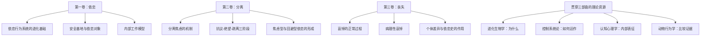

# 《依恋三部曲》深度读书笔记

> [!abstract] 全书速览
> 你大概听过"依恋"这个词，也许还在某个心理学公众号上测过自己是"安全型"还是"焦虑型"。但你可能不知道，这套如今在流行心理学中被简化为几道选择题的理论，最初是一个人用了三十多年的时间、在精神分析学界的集体抵制中一砖一瓦建起来的。约翰·鲍尔比的《依恋三部曲》——《依恋》（1969）、《分离》（1973）、《丧失》（1980）——是20世纪发展心理学领域最具颠覆性的著作之一。鲍尔比打破了弗洛伊德学派"婴儿依赖母亲只是因为母亲提供食物"的正统解释，提出依恋是一种独立的、有进化根基的行为系统，婴儿寻求与照料者的亲近不是为了吃奶，而是为了生存。三部曲从进化生物学、控制系统论和认知心理学中汲取资源，系统论述了依恋行为的本质、分离焦虑的发生机制，以及丧失与哀悼的心理过程。这不是一套教你"如何建立安全依恋"的自助手册，而是一部关于人类情感纽带的基础科学工程。读完它，你会明白为什么一个孩子在母亲离开时会哭泣，一个成年人在失去至亲后会经历那样特定的心理序列，以及为什么"关系"对人类而言不是锦上添花，而是生死攸关。

## 这本书揭示了什么

在鲍尔比开始工作的20世纪40年代，精神分析学界的主流观点认为婴儿依赖母亲是因为母亲是食物的来源——所谓"口腔驱力"理论。按照这个逻辑，谁喂奶谁就是依恋对象，婴儿对母亲的黏附本质上是一种"次级驱力"，附属于饥饿这个"初级驱力"。

鲍尔比认为这个解释根本说不通。他在二战后研究了大量被战争分离的儿童和孤儿院中的孩子，观察到一个反复出现的模式：==即使基本生理需求（食物、温暖、清洁）得到了满足，与母亲分离的幼儿仍然表现出严重的情绪和行为障碍==——退缩、攻击、发育迟滞，甚至死亡率的升高。如果依恋只是饥饿的副产品，这些现象就无法解释。

> [!note] 背景信息
> 鲍尔比1944年发表的《四十四个少年小偷》是他早期最重要的研究之一。他比较了44名有盗窃行为的少年和44名有情绪问题但无盗窃行为的对照组，发现盗窃组中有显著更高比例的人在幼年经历过与母亲的长期分离。其中14名被诊断为"无情感性格"（affectionless character）的少年中，有12人在五岁前经历过长时间的母子分离。这项研究为鲍尔比后来的理论工作埋下了种子。

鲍尔比的核心洞察是：==依恋不是某种其他需求的副产品，它本身就是一种基本的生物需求==，与饥饿和性驱力并列。人类婴儿在进化史上面临的最大威胁不是饥饿（因为食物通常由照料者提供），而是与照料者的分离——在人类进化的绝大部分时间里，一个落单的婴儿等于一个死去的婴儿。因此，自然选择塑造了一套精密的行为系统，驱动婴儿主动寻求和维持与照料者的亲近。这套系统就是依恋行为系统。

> [!tip] 核心洞察
> 鲍尔比的理论革命在于他改变了提问方式。之前的问题是"婴儿为什么依赖母亲？"——答案被锁定在"因为母亲喂奶"。鲍尔比的问题是"==在进化环境中，与照料者保持亲近对婴儿生存有什么价值？=="——这个问题打开了一个全新的解释空间。哈洛的恒河猴实验从侧面提供了戏剧性的支持：幼猴在铁丝做的"有奶妈妈"和绒布做的"没奶妈妈"之间，压倒性地选择了后者。它们在绒布妈妈身上寻找的不是食物，而是==接触性安慰==。

这套理论的重要性已经远远超出了儿童心理学的范畴。它深刻影响了成人关系研究、临床心理治疗、社会政策（比如医院允许父母陪护住院儿童的政策变革）、甚至对丧失与哀悼的理解。今天，依恋理论是发展心理学中被引用最多、被检验最充分的理论之一。

## 理论框架

三部曲的架构可以理解为对人类情感纽带的三个维度的系统性科学探索：纽带如何形成（依恋）、纽带断裂时发生什么（分离）、纽带永久性断裂时发生什么（丧失）。

> [!tip] 核心洞察
> 鲍尔比做了一件在当时极为大胆的事：他把精神分析的临床观察与三个当时与精神分析学界几乎没有交集的领域嫁接在一起。==进化生物学==提供了"为什么"的框架——依恋行为为什么被自然选择保留？因为它提高了幼体的生存概率。==控制系统论==（cybernetics）提供了"怎么运作"的模型——依恋行为系统像一个恒温器一样运作，有一个"设定目标"（与依恋对象保持一定范围内的接近），当偏离目标时（分离或威胁），系统就被激活。==认知心理学==提供了"内部表征"的概念——婴儿不是被动地对分离做反应，而是在大脑中建立了关于依恋对象可得性和自身价值的"内部工作模型"，这些模型一旦形成就会持续影响后续的关系预期和行为。这种跨学科整合在当时是前所未有的，也是鲍尔比被精神分析学界排斥的重要原因之一——他被视为"叛徒"，因为他用了"敌人"（行为主义和生物学）的语言。

## 核心发现深度解读

### 发现一：依恋行为系统——不是"依赖"，而是一套精密的生存程序

你可能觉得"依恋"就是"依赖"的另一个说法。鲍尔比花了整整第一卷来澄清：不是这样。

依恋行为系统是一套在进化过程中被塑造的、有特定功能的行为控制系统。它的"设定目标"是与依恋对象保持足够的接近。当这个目标被满足时（照料者在身边，可触及，有回应），系统处于低活跃状态，婴儿可以安心地探索环境。当目标偏离时（照料者离开、陌生人出现、婴儿受到惊吓），系统被激活，婴儿会表现出一系列旨在恢复接近的行为——哭泣、呼唤、爬行、伸手、攀附。

> [!example] 关键概念
> 鲍尔比借鉴了控制工程中的概念来描述这个系统。一个简单的恒温器检测到室温低于设定值时会启动加热，达到设定值后关闭。依恋行为系统的逻辑类似：==它不是一个固定的行为序列，而是一个目标校正系统——婴儿会根据环境反馈灵活地选择不同的行为（哭、爬、伸手）来达到同一个目标（恢复与照料者的接近）==。随着年龄增长和认知能力的发展，这个系统变得越来越精密——幼儿不仅能追踪照料者的物理位置，还能评估照料者的"心理可得性"（她虽然在房间里，但是不是在注意我？）。

这个框架的革命性在于两点。第一，它把依恋行为从"幼稚的依赖"重新定义为"适应性的生存策略"。一个在母亲离开时大哭的婴儿不是"太黏人"——他正在执行一个经过数百万年进化打磨的程序，这个程序的功能是在危险的环境中确保不与保护者失散。第二，==它预测了依恋行为和探索行为之间的动态平衡==——当依恋系统被满足时，探索系统被释放；当依恋系统被激活时，探索系统被抑制。这就是为什么一个安全的孩子能自如地探索新环境，而一个不安全的孩子要么焦虑地黏着大人，要么表面上独立但实际上无法真正投入探索。

### 发现二："安全基地"——人类一切探索的心理起点

如果你在公园里仔细观察学步期的幼儿，你会注意到一个精巧的模式：孩子离开母亲去探索，走到一定距离就回头看看母亲是否还在，确认之后继续走得更远，遇到什么让他不安的东西就跑回来。确认安全之后，再次出发。

这个模式就是鲍尔比和安斯沃斯所说的==安全基地现象==。依恋对象不是一个让孩子"固定在旁边"的锚点，而是一个让孩子"可以从这里出发"的基地。安全基地提供的不是"你不能离开"，而是"你可以离开，因为你知道你能回来"。

> [!note] 研究发现
> 安斯沃斯在乌干达的纵向观察研究（1960年代初）中首次系统描述了安全基地行为。她发现，在那些母亲对婴儿信号最敏感、回应最一致的家庭中，婴儿反而表现出最多的独立探索行为。==敏感的回应不会制造"依赖性的黏人孩子"，恰恰相反，它制造了"有信心的探索者"==。这个发现对"惯坏孩子"的民间智慧构成了直接挑战——在生命的最初几年，及时回应婴儿的需求不是在"宠溺"，而是在为未来的独立性打下心理基础。

这个概念的射程远超婴幼儿期。鲍尔比明确指出，安全基地的需求"从摇篮到坟墓"贯穿一生。成年人在面对挑战时同样会转向依恋对象寻求安慰和支持，然后从这个"心理基地"出发去应对困难。你在一次重要面试前给伴侣打电话，不一定是需要对方给你什么具体建议，而是需要确认"那个人还在那里"——这就是安全基地在成人关系中的运作。

### 发现三：内部工作模型——关系经验如何写入大脑

鲍尔比理论中最有远见的概念之一是==内部工作模型==（internal working models）。这个概念解释了早期依恋经验如何对后续的关系产生持续影响。

在与照料者反复互动的过程中，婴儿逐渐建立了两套相互关联的心理表征：一套是关于依恋对象的——"当我需要她的时候，她会在吗？她会回应我吗？"另一套是关于自己的——"我值得被回应吗？我的需求是合理的吗？"

> [!tip] 核心洞察
> 如果照料者一致地、敏感地回应婴儿的需求，婴儿就建立了一个积极的工作模型：==他人是可靠的，我是值得被关爱的==。如果照料者的回应是不一致的（有时回应，有时忽视），婴儿建立的模型是：他人不可预测，我需要加大信号强度才能得到回应——这就是焦虑型依恋的种子。如果照料者持续地回避或拒绝亲密接触，婴儿建立的模型是：他人是不可及的，表达需求是没用的甚至是危险的——这就是回避型依恋的起源。

内部工作模型一旦建立，就倾向于自我维持。它们像一副有色眼镜，过滤着后续所有的关系信息。一个带着"他人不可靠"模型的人，在新关系中会不自觉地==选择性关注==那些证实这个信念的信息（对方的一次迟到被解读为不在乎），而忽略或贬低那些反驳它的信息（对方的十次准时到达被视为理所当然）。这就形成了鲍尔比所说的防御性排除——与既有工作模型不一致的信息被排除在意识加工之外。

> [!warning] 注意
> 鲍尔比并不认为内部工作模型是完全不可改变的。他强调这些模型在生命早期具有最大的可塑性，但在后续的重要关系经验中仍然可以被更新——尤其是当一个人获得了==与旧模型不一致的、持续的新关系经验==时。一段安全的治疗关系或一段安全的亲密关系都可能提供修正的机会。但他也承认，修正比建立更困难，因为旧模型会主动抵抗与之矛盾的信息。

### 发现四：分离的三个阶段——抗议、绝望、疏离

三部曲的第二卷聚焦于一个每个父母都会面对的现象：孩子与依恋对象分离时发生了什么？

鲍尔比和他的同事詹姆斯·罗伯逊通过对住院幼儿和寄养幼儿的系统观察，识别出分离反应的三个阶段。

第一阶段是==抗议==（protest）。孩子积极地试图恢复与照料者的接触——大声哭泣、呼唤妈妈、搜寻、拒绝其他人的安慰。这个阶段可以持续几小时到一周以上。抗议行为在依恋行为系统的逻辑中完全合理：照料者不在了，系统被激活到最高强度，孩子在使用一切可用的手段来恢复接近。

第二阶段是==绝望==（despair）。孩子变得安静、退缩、悲伤。哭泣减少了，但不是因为好了——而是因为希望在消退。孩子不再积极搜寻，表现出明显的悲伤和对环境的退缩。在不了解内情的观察者看来，孩子"适应了"。但这不是适应，而是哀悼。

第三阶段是==疏离==（detachment）。如果分离持续，孩子似乎"恢复了"——他开始对周围的人和事表现出兴趣，甚至对陌生人也能微笑。但当母亲最终返回时，孩子不是像安全型婴儿那样扑过去，而是冷淡地回避，似乎不认识她了。这个表面上的"好转"实际上是==防御性的情感关闭==——孩子为了保护自己不再经历被抛弃的痛苦，在心理上切断了与依恋对象的情感连接。

> [!example] 关键案例
> 罗伯逊1952年拍摄的纪录片《一个两岁孩子住进了医院》（A Two-Year-Old Goes to Hospital）记录了一个名叫劳拉的小女孩在住院八天期间的行为变化。这部影片生动而令人心碎地展示了三个阶段的完整展开。在当时的英国医院系统中，父母的探视被严格限制，因为院方认为父母的来访会让孩子"不安分"。罗伯逊和鲍尔比用影像证据表明，==真正造成伤害的不是父母的来访，而是父母的缺席==。这部影片直接推动了英国医院探视政策的改革，成为依恋理论产生实际社会影响的标志性事件之一。

鲍尔比强调，这三个阶段不是"异常反应"，而是依恋行为系统在分离情境下的正常运作序列。抗议是系统被激活的直接表达；绝望是持续的系统激活在得不到回应后的能量耗竭；疏离是一种保护性的系统关闭——如果反复激活都得不到结果，系统不会永远保持激活状态，它会进入一种防御模式，代价是情感连接能力的暂时（有时是长期）受损。

### 发现五：分离焦虑——恐惧的不是"已经发生的"，而是"可能发生的"

第二卷的另一个核心贡献是对==分离焦虑==的重新理解。

在鲍尔比之前，精神分析的传统解释是：分离焦虑源于对"无法满足的驱力"的恐惧——没有母亲，谁来喂我？鲍尔比认为这完全搞反了因果关系。分离焦虑不是关于过去的匮乏体验的记忆，而是关于==未来的可得性的预期==。孩子焦虑的不是"我饿了没人喂"，而是"如果发生了什么可怕的事情，她不在身边"。

> [!tip] 核心洞察
> 鲍尔比用一个类比来说明这个区别：==一个人在黑暗的小巷里感到恐惧，不是因为他正在被攻击，而是因为他知道自己在一个容易被攻击的环境中==。分离焦虑的逻辑与此类似——孩子恐惧的不是当下的痛苦，而是"如果有危险发生而保护者不在"的可能性。这就是为什么分离焦虑在以下条件下会加剧：环境陌生（危险概率更高）、天黑了（危险更难被发现）、孩子生病或疲倦（应对能力下降）——所有这些因素都增加了"如果有威胁我可能无法应对"的评估值。

这个框架还解释了一个看似矛盾的现象：为什么有些孩子在与不可靠的照料者在一起时反而表现出更强的分离焦虑？按照"口腔驱力"理论，只要有人喂饭就不应该焦虑。但按照鲍尔比的理论，一个行为不可预测的照料者恰恰会制造最大的焦虑——因为孩子无法形成关于"她会不会在"的可靠预期。==不确定性本身就是焦虑的最大来源==，比确定的缺席更令人不安。

### 发现六：安斯沃斯的"陌生情境"与依恋类型

虽然"陌生情境"实验是安斯沃斯的工作而非鲍尔比直接完成的，但它是在鲍尔比理论框架下设计的，也是依恋三部曲中反复引用的核心实证基础。

安斯沃斯在1970年代设计了一个标准化的实验范式：在一个不太熟悉的房间里，让12至18个月大的婴儿经历一系列情境——母亲在、陌生人进入、母亲离开、陌生人尝试安慰、母亲返回。关键的编码对象不是婴儿在分离时多痛苦，而是==母亲返回时婴儿如何反应==。

> [!example] 三种依恋类型
> **安全型**（约占60-65%）：母亲离开时可能会不安，但母亲返回时积极寻求接触，很快就能恢复平静并继续探索。这些婴儿的母亲通常是一致地、敏感地回应婴儿信号的。
>
> **焦虑-矛盾型**（约占10-15%）：母亲离开时极度痛苦，但母亲返回时表现出矛盾的反应——既想靠近又表现出愤怒，难以被安抚。这些婴儿的母亲往往是不一致的——有时非常热情，有时冷淡或不在。
>
> **回避型**（约占20-25%）：表面上对母亲的离开和返回都显得"无所谓"，不太寻求接触，也不太表达不安。但==生理监测数据（心率、皮质醇水平）显示，他们的内心压力与其他类型的婴儿一样大甚至更大==——他们只是学会了不表达。这些婴儿的母亲通常是持续回避亲密身体接触或对婴儿的情感需求不予回应的。

安斯沃斯的另一个关键发现是关于==母亲敏感性==的。她在家庭中进行了大量的自然观察，发现母亲在日常生活中对婴儿信号的敏感度和响应性——是否能准确地"读懂"婴儿的需求，是否能及时和恰当地做出回应——是预测婴儿依恋类型的最重要因素。这不是关于"母亲是否爱孩子"的问题——几乎所有母亲都爱自己的孩子——而是关于==互动质量的微观结构==。

> [!warning] 注意
> 后来的研究者玛丽·梅因在安斯沃斯三分类的基础上增加了第四种类型：==混乱型依恋==（disorganized attachment）。这些婴儿在母亲返回时表现出互相矛盾的行为——同时靠近和回避，或者出现冻结、恍惚等异常行为。混乱型依恋与照料者既是安慰来源又是恐惧来源的矛盾情境有关（如照料者本身有未解决的创伤或虐待行为），被认为是后续心理病理风险最高的依恋类型。

### 发现七：丧失与哀悼——不是"阶段"，而是一个波动的过程

第三卷《丧失》是三部曲中最深沉的一卷。鲍尔比把他关于分离反应的理论框架扩展到了永久性丧失——所爱之人的死亡——的心理过程。

鲍尔比描述了成人哀悼的四个阶段：

第一阶段是==麻木==（numbing）。在得知丧失消息后的最初几小时到一周，人可能表现得出奇地"镇定"，好像消息没有真正渗透进来。偶尔会被极度强烈的情绪冲击打断——突然崩溃大哭——然后又恢复麻木。

第二阶段是==渴望与搜寻==（yearning and searching）。这个阶段可以持续数月甚至数年。人在理智上知道对方已经不在了，但==依恋行为系统不接受这个信息==——它仍然在执行"搜寻丢失的依恋对象"的程序。你在人群中"看到"已故的人，听到相似的声音就转头去找，保留着他/她的物品和习惯，不自觉地想打电话告诉他/她今天发生的事。这不是"否认"（那是弗洛伊德的框架），而是依恋系统在完成它的进化设定功能——搜寻失踪的依恋对象。只是这一次，搜寻永远不会成功。

> [!note] 研究发现
> 鲍尔比注意到，丧失后的愤怒——对死去的人的愤怒——是一种普遍但经常被压抑的反应。在依恋系统的逻辑中，愤怒完全合理：当依恋对象"离开"时，愤怒是用来"惩罚"对方离开并"阻止"未来再次离开的功能性反应。在分离情境中，这是适应性的——孩子对离开又返回的母亲表达愤怒，实际上是在传达"不许再走"。但在丧失情境中，这种功能性的愤怒失去了对象——你对谁发火？这种无处安放的愤怒可能转向自己（抑郁）、转向医护人员、转向其他家人，或者被压抑到意识之下，成为==病理性哀悼的一个重要来源==。

第三阶段是==混乱与绝望==（disorganization and despair）。当搜寻反复失败、现实不断被确认时，人进入一种深层的悲伤和方向感丧失。旧的生活模式——那些围绕着与亡者的关系组织起来的习惯、角色、日常结构——崩塌了，新的模式尚未建立。

第四阶段是==重组==（reorganization）。逐渐地，人开始建立新的角色、新的关系、新的日常结构。这不意味着"忘记"或"放下"——鲍尔比明确反对"与死者切断情感联系"是健康哀悼之终点的传统观点。==健康的哀悼的终点不是遗忘，而是与亡者建立一种新的、内化的关系==——他/她成为你内心世界的一部分，你可以在想起他/她时感到温暖而不是被痛苦压倒。

> [!warning] 注意
> 鲍尔比反复强调，这些"阶段"不是线性的、不可逆的序列。一个人可能在同一天内经历多个阶段的来回波动——早上还能正常工作（重组），下午突然在某个触发点上被拉回到强烈的渴望中，晚上陷入绝望。哀悼更像是一个==波浪式的过程==，随着时间推移，波浪的强度和频率逐渐减弱，但可能永远不会完全消失。

### 发现八：病理性哀悼——当哀悼被卡住了

鲍尔比在第三卷中对病理性哀悼的分析，至今仍然是临床领域最有影响力的框架之一。

他识别了两种主要的病理模式。一种是==慢性哀悼==——哀悼过程被无限延长，人持续停留在渴望和搜寻阶段，无法进入重组。丧失发生了多年之后，日常生活仍然围绕着亡者组织，好像他/她随时会回来。另一种是==延迟或缺席的哀悼==——人在丧失后表现得"异常坚强"，迅速"恢复正常"，似乎没有受到影响。但这种表面的平静通常是防御性的——悲伤被隔离在意识之外，可能在数月甚至数年后以看似无关的方式爆发：无法解释的抑郁、身体症状、对其他次要丧失的过度反应。

> [!tip] 核心洞察
> 鲍尔比提出了一个对临床实践极为重要的命题：==一个人如何哀悼，在很大程度上取决于他的依恋史==。安全型依恋的人更有可能经历正常的哀悼过程——他们能够承受悲伤的痛苦，能够向他人寻求支持，最终能够在保持与亡者内在联系的同时重组自己的生活。焦虑型依恋的人更容易发展出慢性哀悼——因为他们的依恋系统本身就处于高激活状态，丧失使得这种激活变得永久化。回避型依恋的人更容易表现出延迟或缺席的哀悼——因为他们一贯的应对策略就是抑制依恋相关的情绪，丧失只不过是这种策略面临的最大挑战。

这个洞察意味着，帮助一个人"正常地哀悼"，可能需要先理解和处理他的依恋模式。一个回避型的来访者说"我没事，已经过去了"，治疗师不应该照单全收——这可能不是真正的重组，而是防御性的情感关闭。一个焦虑型的来访者在丧失三年后仍然无法恢复日常功能，问题可能不只是"这次丧失太沉重"，而是他的依恋系统从来就没有一个安全的基础来消化这样的冲击。

## 认知纠偏清单

读完这套书，以下这些关于依恋和丧失的常见观念值得你重新审视：

"婴儿太黏人是被惯坏了。" 鲍尔比和安斯沃斯的研究结论恰恰相反——在生命最初几年，==对婴儿信号的一致性回应不是"惯坏"，而是安全依恋的基础==。安全依恋的孩子不是更黏人的孩子，而是更有信心探索世界的孩子。真正导致"过度黏人"的，不是回应太多，而是回应不一致——孩子无法预测照料者是否会在，因此不得不时刻保持高度警觉。

"时间会治愈一切。" 时间本身不治愈任何东西。鲍尔比在第三卷中反复指出，==哀悼的质量比哀悼的时长更重要==。如果一个人的悲伤被压抑、被否认、被周围环境要求"尽快走出来"，那么再多的时间流逝也不会带来真正的修复——只会带来更加僵硬的防御。

"坚强就是不哭。" 丧失之后的哭泣、愤怒、搜寻，在鲍尔比的框架中不是"软弱"的表现，而是依恋系统的正常运作。==抑制这些反应不是坚强，而是阻断了哀悼的自然过程==，增加了病理性结果的风险。

"孩子太小不懂事，感觉不到分离。" 鲍尔比的工作正是为了反驳这个危险的假设。婴幼儿不仅能感受到分离的痛苦，而且因为他们缺乏成人的认知资源来理解"妈妈会回来"，分离对他们的冲击可能比对成人更大。

"健康的哀悼意味着最终'放下'。" 鲍尔比明确反对这个观点。健康哀悼的终点不是与亡者切断情感联系，而是将外在的关系转化为内在的心理表征——你不需要"忘记"或"放下"，你需要的是找到一种新的方式来保持这段关系，让它成为你生活中持续的、但不再令你瘫痪的存在。

**"依恋风格是固定的，改变不了。"** 鲍尔比自己在三部曲中就强调了内部工作模型的可修正性。虽然早期形成的模型有强大的惯性，但它们不是刻在石头上的——后续的关系经验，尤其是持续的安全关系经验（包括治疗关系），可以逐步更新这些模型。改变是困难的，但不是不可能的。

## 这本书的局限

鲍尔比的工作不可避免地受到他所处时代的局限。三部曲中几乎所有关于"母亲"的讨论都假设母亲是唯一的或主要的依恋对象。虽然鲍尔比后来承认婴儿可以与多个照料者形成依恋关系，但三部曲的整体论述框架仍然是以母子二元关系为中心的。这在一定程度上忽视了父亲、祖父母、其他照料者在依恋形成中的角色，也忽视了不同文化中多元照料安排的合理性。

三部曲中引用的实证研究主要来自西方中产阶级家庭。跨文化研究后来发现，依恋类型的分布比例在不同文化中有显著差异——例如，在德国样本中回避型比例偏高，在日本样本中焦虑-矛盾型比例偏高。这些差异究竟反映了文化背景下不同的养育实践，还是反映了"陌生情境"实验本身的文化偏差，至今仍有争论。

鲍尔比对依恋与精神病理之间关系的论述有时过于直线——"不安全依恋导致心理问题"的因果叙事在后续研究中被证明过于简化。不安全依恋是许多心理问题的风险因素，但不是充分条件；许多不安全依恋的人终其一生没有出现严重的心理问题，基因、气质、后续经历等因素都在发挥调节作用。

最后，三部曲的写作风格——尤其是第一卷——对非专业读者相当不友好。鲍尔比在第一卷中用了大量篇幅讨论控制系统论和动物行为学的技术细节，这些对于理解核心概念并非必要，但确实反映了他试图为依恋理论建立坚实跨学科基础的雄心。

## 行为改变指南

**觉察你的"默认搜索程序"。** 当你在亲密关系中感到不安时——被忽视、被冷落、不确定对方是否在意——暂停一下，观察自己的第一反应。你是开始反复试探、追问、发信息？还是告诉自己"我才不在乎"然后把自己封闭起来？这两种反应都是依恋系统的自动化运作。"看见"它，不是为了评判自己，而是为了在自动反应和有意识的选择之间插入一个间隙。

**如果你是照料者，优先投资"可预测性"。** 鲍尔比和安斯沃斯的研究反复指向同一个结论：对安全依恋来说最重要的不是完美的照料，而是一致的、可预测的回应。你不需要每次都做出"正确"的反应——你需要的是让孩子能够预测"当我需要你的时候，你会在"。不一致——今天热情明天冷淡——比一致的不完美更有害。

**允许自己完整地哀悼。** 如果你正在经历丧失，不要急于"走出来"。鲍尔比的研究表明，哀悼需要时间和空间，被压抑的悲伤不会消失，只会以更隐蔽的方式表达自己。哭泣是正常的，愤怒是正常的，反复想起是正常的。你不需要为这些反应感到羞耻——它们是你的依恋系统在完成一项艰难但必要的工作。

**对"我已经没事了"保持一份审慎。** 无论是你自己还是身边的人，在丧失后很快就"恢复正常"，这不一定是好事。它可能是真正的韧性，也可能是防御性的情感关闭。区别在于：你是否能够在安全的环境中（比如独处时、和信任的人在一起时）允许悲伤浮现？如果答案是"完全没有悲伤"，那值得留意。

## 延伸阅读

如果你想更深入地理解依恋理论在成人关系中的应用，辛迪·哈赞和菲利普·谢弗开创的[[成人依恋]]研究领域是核心文献。阿米尔·莱文和蕾切尔·海勒的《依恋》（Attached）提供了更通俗的日常解读。如果你对依恋与心理治疗的交汇特别感兴趣，[[《亲密关系》 - 罗兰·米勒]]从更广泛的关系科学角度提供了补充视角。如果你想了解依恋理论在临床中的应用，杰里米·霍姆斯的《约翰·鲍尔比与依恋理论》是一部优秀的学术传记兼理论介绍。而如果你对丧失与哀悼的主题想做进一步的探索，科林·默里·帕克斯（鲍尔比的学生和同事）的《丧亲：成人丧亲之后的悲伤研究》是直接延续鲍尔比工作的经典之作。