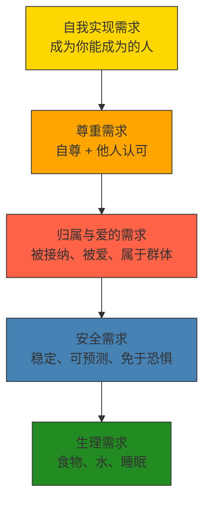
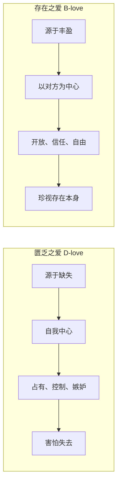

# 《动机与人格》深度读书笔记

> [!abstract] 全书速览
> 马斯洛用这本书提出了一个看似简单却颠覆整个心理学界的主张：人不仅仅是被恐惧和匮乏驱动的动物，人有一种内在的、向上生长的力量，渴望成为自己能够成为的样子。他建立了一套==需求层次理论==来解释人类行为的深层动力，并通过研究那些"最好的人"——自我实现者——来探索人类潜能的上限。这本书是人本主义心理学的奠基之作，它的影响远远超出了心理学，渗透到管理学、教育学和日常生活的方方面面。

## 这本书揭示了什么

你有没有注意到一个奇怪的现象：当你饿得前胸贴后背的时候，什么理想、什么尊严，统统不重要，脑子里只有食物。但一旦吃饱了，你立刻开始想别的事——工作有没有保障，朋友圈里有没有人在乎自己，领导有没有认可自己的表现。这个日常经验背后，藏着一个关于人类动机的深刻结构。

再想想这样的场景：你刚换了一份薪水翻倍的新工作，最初几周兴奋不已，觉得所有问题都解决了。但不到三个月，你又开始焦虑——新团队里你是不是被接纳了？老板对你的评价怎样？每天做的事情有没有意义？收入问题消失了，新的不安却冒了出来。这种"满足了一个又冒出下一个"的体验，不是你贪心，而是人类动机系统的基本运作方式。

马斯洛在1954年出版这本书的时候，心理学界被两股力量统治。一股是行为主义——把人等同于实验室里的老鼠，认为一切行为不过是刺激和反应的机械链条。华生曾经宣称："给我一打健康的婴儿，我可以把他们训练成任何类型的专家——医生、律师、乞丐、小偷。"另一股是弗洛伊德的精神分析——把人看作被无意识欲望和童年创伤驱动的存在，心理学的任务就是治疗病态。

> [!note] 背景信息
> 马斯洛最初在威斯康星大学师从行为主义心理学家哈里·哈洛研究灵长类动物行为。哈洛的实验揭示了一个行为主义无法解释的现象：小猴子宁可选择柔软但不提供食物的"布妈妈"，也不选择提供食物但冰冷的"铁丝妈妈"——爱和接触的需求独立于食物需求。后来马斯洛在纽约遇到了格式塔心理学家韦特海默和人类学家本尼迪克特，对这两位"最好的人"的私人研究催生了整本书的核心思想。

这个问题的答案，彻底改变了心理学的方向。马斯洛发现，人类的动机不是一锅乱炖，而是有层次、有结构的。更重要的是，当基本需求得到满足之后，人不会停下来——人会继续向上追求，追求成为最好的自己。这种追求不是奢侈品，而是人类本性中内置的驱动力。

## 理论框架

马斯洛的理论可以用一条主线串起来：人类的需求从低到高排列成一个层次结构，低层需求相对满足后，高层需求才会成为主要的行为驱动力。

最底层是生理需求——一个真正饥饿的人，整个意识都会被食物占据，连做梦都在吃东西。往上是安全需求——你对稳定工作的渴望、对储蓄的焦虑、对保险的依赖，都是安全需求在运作。再往上是归属与爱的需求——你有500个社交媒体"朋友"，但深夜难过的时候不知道可以打给谁。然后是尊重需求——分为自尊和来自他人的尊重，最稳定的自尊建立在真实能力之上。最顶层是自我实现需求——"一个音乐家必须作曲，一个画家必须画画，如果他最终要做到内心安宁的话。"

但这不只是一个静态的金字塔（顺便说一句，马斯洛本人从来没画过什么金字塔图，那是后人的简化）。它的核心动力学在于两种截然不同的动机模式：==匮乏动机==和==成长动机==。前四层需求属于匮乏动机——你缺什么就想要什么，得到之后欲望就消退了。但自我实现属于成长动机——你越是实现自己，就越想继续成长，满足非但不会让欲望消退，反而会让它更加强烈。一个作曲家不会因为写了一首好曲子就不想再写了——那首好曲子会激发他创作下一首的更强烈冲动。

> [!tip] 核心洞察
> 匮乏动机和成长动机的区分才是马斯洛整本书最深刻的洞见。它解释了为什么有些人赚了很多钱、获得了很高的地位之后，依然感到空虚——他们一直在匮乏动机的轨道上运行，每一次满足都只是暂时性的。他们从来没有切换到成长动机的频道，在那个频道里，满足本身就是继续前进的动力。

## 核心发现深度解读

### 发现一：需求的层次不是电梯，而是潮水

你可能在无数管理学教科书里见过马斯洛的需求层次被画成一个整齐的金字塔，仿佛人必须先完全满足一层，才能进入下一层。但马斯洛自己的表述远比这复杂和微妙得多。

他打的比方更像是潮水。当潮水（低层需求的满足）涨到一定程度，新的陆地（高层需求）就会浮现出来。但潮水不需要完全涨满——可能生理需求满足了85%，安全需求满足了70%，归属需求满足了50%，尊重需求满足了40%，自我实现需求满足了10%，这些都是同时存在的。

你今天早上可能因为没睡好（生理）而暴躁，上午因为听到裁员消息（安全）而焦虑，中午因为和好朋友吃了一顿饭（归属）而开心，下午因为项目得到表扬（尊重）而满足，晚上因为写了一段自己很满意的文字（自我实现）而感到充实。同一天之内，五个层次的需求轮番登场。

马斯洛还特别指出了层次逆转的可能性——革命者为理想放弃安全，梵高在极度贫困中坚持画画。长期的匮乏也可能让人"固着"在某个层次——经历过严重饥荒的人，可能终生都在囤积食物，这就像心理上的"疤痕效应"。明尼苏达大学的半饥饿实验也印证了这一点：36名限食6个月的志愿者，社交兴趣急剧下降，性欲几乎完全消失，一切高层需求都被饥饿压制了。

> [!example] 生活中的映射
> 当你感到焦虑、不安、缺乏动力的时候，不要急着去读励志书或设定宏大目标。先往下看——是不是你的某些基本需求没有得到满足？睡眠够不够？经济上有没有安全感？有没有真正亲近的人？一个长期睡眠不足的人很难谈什么自我实现，一个时刻担心被裁员的人很难享受创造性工作。先把地基修好，上层建筑自然会稳固。

### 发现二：匮乏之爱和存在之爱是两种完全不同的东西

在归属与爱的需求这一层，马斯洛做了一个精妙的区分，这个区分对理解人际关系极其重要。

==匮乏之爱==（D-love）源于缺失。你感到孤独、空虚、不完整，于是你寻找一个人来填补这个洞。这种爱是自我中心的——你爱的其实不是对方这个人，而是对方能给你的东西：安全感、陪伴、被需要的感觉。对方没有及时回复消息你就开始胡思乱想，对方和异性朋友吃了一顿饭你就坐立不安。

==存在之爱==（B-love）源于丰盈。你自身是完整的，你的爱不是为了填补什么，而是你内在充盈到要溢出来。这种爱是对另一个人存在本身的珍视——你爱的是对方作为一个独立个体的全部，包括缺点。马斯洛说，存在之爱有一种"审美"的品质——你看待爱人的方式，就像你欣赏一幅伟大的画作，不是想要占有它，而是因为看到了它的美而心生喜悦。

大多数人的恋爱都是从匮乏之爱开始的，这很正常。年轻时候的恋爱几乎都带有强烈的匮乏色彩。但马斯洛指出，如果一段关系始终停留在匮乏之爱的层面，它注定会充满焦虑和冲突。真正持久而深厚的关系，需要双方都向存在之爱的方向发展。这和[[《亲密关系》 - 罗兰·米勒]]中讨论的依恋风格有很深的呼应——安全型依恋者的关系模式确实更接近马斯洛描述的存在之爱。

### 发现三：自我实现者并不是完美的人，而是"完整地活着"的人

马斯洛选取了一批他认为达到了自我实现水平的人来研究——林肯、爱因斯坦、埃莉诺·罗斯福、威廉·詹姆斯、斯宾诺莎等。他归纳出了15项特征。

这些特征中最令人意外的可能不是那些"高光"特质，而是第15项：**不完美性**。马斯洛坦率地说，自我实现者也有缺陷。林肯有严重的抑郁症，爱因斯坦对家人疏离冷漠，罗斯福在人际关系中有支配倾向。

> [!tip] 核心洞察
> 自我实现不是一个终点，不是达到某种完美状态，而是一种活法——一种更充分、更真实、更有深度地活着的方式。如果你一直在等"我够好了"那一天才开始追求自我实现，那你永远不会开始。

在15项特征中，有几项特别值得留意：

- "**以问题为中心**"——自我实现者不纠结于自己的内心戏，而是把注意力投向自身之外的问题和使命。有时候治愈自己最好的方式不是向内挖掘，而是向外投入一个大于自己的事业。
- "**持续的新鲜感**"——自我实现者能够反复从日常事物中获得惊叹和喜悦，抵抗了习惯化效应，保持着一种近乎孩童般的惊奇感。
- "**抵抗文化濡化**"——行为标准来自内在的价值体系而非外在社会压力。他们像是"居住在一种文化中，但不完全属于它"。
- "**深厚但选择性的人际关系**"——朋友不多，但每段关系都异常深入和真诚。
- "**民主的性格结构**"——能够真诚地尊重任何人，看到的是人，而不是标签。

### 发现四：高峰体验是每个人都可能经历的意识状态

你有没有过这样的时刻：在某个瞬间，你完全忘记了自己，忘记了时间，感到一种难以言说的完满和喜悦？也可能是在运动中——跑步跑到某个临界点之后，身体的疲惫突然消失了，整个世界变得清晰而明亮。马斯洛把这叫做==高峰体验==（peak experience）。

他通过对190多人的深度访谈发现，这种体验有一些共同特征：世界被感知为一个完整的统一体，自我的边界消融了，时间感消失了，一切都显得必然而美好。很多人用宗教性或神秘性的语言来描述——"与宇宙合一""感受到了永恒"——但马斯洛认为这些体验的本质是心理学的，而不是超自然的。

高峰体验不是自我实现者的专利。普通人也会经历，只是频率和深度不同。它可以由音乐、性爱、自然美景、创造性的突破、对一个问题的顿悟触发。与高峰体验紧密相关的是**存在认知**（B-cognition）——从功利性的"对我有什么用"切换到纯粹的"看见事物的存在本身"。这种认知模式让世界变得异常丰富和美丽，因为你终于在"看"，而不只是在"评估"。这和[[《心流》 - 米哈里·契克森米哈赖]]所描述的最优体验有深刻的呼应。当代正念研究和神经科学也开始探索高峰体验的生理基础——有证据表明，这些体验可能涉及默认模式网络活动的暂时性降低。

### 发现五：存在价值——人类在最高发展水平上追求什么

马斯洛在自我实现者身上发现了一组他们共同珍视的==存在价值==（B-values）：真、善、美、完整、活力、独特、完美、公正、秩序、简约、丰富、轻松、趣味、自足。

他认为这些价值不是文化建构的，而是人类本性在充分发展后的自然涌现——就像一棵树在良好条件下会自然长出茂盛的枝叶。

> [!warning] 值得警惕
> 马斯洛认为被剥夺这些价值会导致"超越性病态"——一种存在层面的营养不良。你在流水线式的工作中缺乏"美"和"独特"，在虚伪的社交圈中缺乏"真"和"简约"——这些不仅仅是"不舒服"，而是一种真实的心理病态的根源。这可能解释了为什么很多物质丰裕的现代人依然感到不幸福。但这个论点在哲学上非常有争议，因为它本质上是在说价值有"客观性"，这和道德相对主义直接冲突。

### 发现六：心理学不应该只研究病态

这本书的一个深层贡献，是为心理学重新定义了研究对象。马斯洛的逻辑很朴素：如果你想知道人类能跑多快，你应该去研究奥运冠军，而不是去研究普通路人。他还批评心理学过度迷恋"科学主义"——模仿物理学的研究方法来研究人类心理，结果只能研究那些容易量化的低层次现象，而把爱、创造力、意义感排除在外。

后来马丁·塞利格曼创立的积极心理学运动，在很大程度上是对马斯洛思想的继承和发展。马斯洛晚年还开始讨论"自我超越"的概念，认为最高的境界不是实现自己，而是超越自己，投入到比自己更大的存在中去——他甚至开始构想需求层次的第六层，但这个工作在他1970年突然去世后未能完成。

## 认知纠偏清单

读完这本书，你应该警惕自己的几个思维习惯：

1. **"空中楼阁"偏误**——感到焦虑时先检查需求层次，是不是基本需求没被满足？你设定了宏伟目标，却忽略了自己三个月没好好睡觉，半年没和朋友深聊过，这就是在搭空中楼阁。
2. **"填洞式恋爱"偏误**——评判关系时问自己：我在"索取"还是"给予"？如果你总在关系中感到不安全，解决方案不是找一个更会"证明"的伴侣，而是先发展自己内在的完整感。
3. **"终点思维"偏误**——不要把自我实现想象成一个终点。马斯洛自己说，自我实现不是固定状态，而是一系列的"自我实现时刻"。
4. **"更好版本"偏误**——真正的成长不是"变得更好"（匮乏动机），而是"更充分地成为自己"（成长动机）。前者是焦虑驱动的，后者是兴奋驱动的。
5. **"物质解药"偏误**——如果你的问题是缺乏美、缺乏真、缺乏创造性，那么再多的物质满足也填不了这个洞。你需要的可能不是更多的东西，而是一种不同质量的生活。

## 这本书的局限

> [!warning] 诚实评估
> - **实证基础薄弱**：严格的层次顺序没有得到一致验证。2011年一项覆盖123个国家的研究发现，人们可以在基本需求未满足的情况下追求高层需求并获得满足感
> - **方法论问题严重**：自我实现者样本完全基于马斯洛个人判断，偏向西方白人男性精英
> - **过度乐观**：斯坦福监狱实验和米尔格拉姆的服从实验都显示，普通人在特定情境下可以做出令人震惊的恶行——这不容易用"需求被阻挠"来完全解释
> - **文化局限**："自我实现"带有强烈的西方个人主义色彩，在集体主义文化中，人生最高追求可能是融合而非个人实现

## 行为改变指南

**做一次需求审计。** 拿出一张纸，画五行，分别写上生理、安全、归属、尊重、自我实现。在每行后面用"充分""基本""不足""严重不足"四个等级评估，并写下具体现状描述。找到最薄弱的一层，制定具体改善计划，优先处理它。

**在重要关系中做"动机检查"。** 选择你最重要的一段关系，问自己：我最害怕失去什么？如果对方不再满足这个需求，我还会珍视这段关系吗？让关系从"我离不开你"变成"我很好，但有你更好"。

**培养"存在认知"的片刻。** 每天找5分钟，刻意用"存在"的眼光看待一个日常事物——不评判好坏，只是看见它的存在。你可以把它和日常活动绑定——比如每天喝第一杯水时，花30秒真正感受水的温度和味道。

**找到你的"以问题为中心"的事。** 有什么问题是你真正关心的、大于个人利益的？它可以很小——帮社区老人学会使用智能手机，在你的专业领域写出真正有用的教程。关键在于你能否在这件事中忘记自己。

**做一次"存在价值"盘点。** 回顾过去一周，问自己接触到了多少"真""美""公正""趣味"？如果某些价值严重缺失，想想能做什么来补充。

**接受不完美，从今天开始。** 不要等到"准备好了"才开始追求更充实的生活。那一步不需要很大——它可以是今天对一个人说一句真话，可以是重新拿起一个搁置了很久的爱好。

## 延伸阅读

[[《心流》 - 米哈里·契克森米哈赖]]从实证研究的角度深入探讨了马斯洛所说的"最优体验"——用更严谨的科学方法验证和拓展了马斯洛关于高峰体验的直觉。

[[《活出生命的意义》 - 维克多·弗兰克尔]]从一个极端的反面印证了马斯洛的理论：当一切基本需求都被剥夺时，意义追求如何成为维系生存的最后力量。

马丁·塞利格曼的《真实的幸福》展示了积极心理学如何用更严格的实证方法来研究人类的优势和美德——这正是马斯洛五十年前呼吁的方向。
