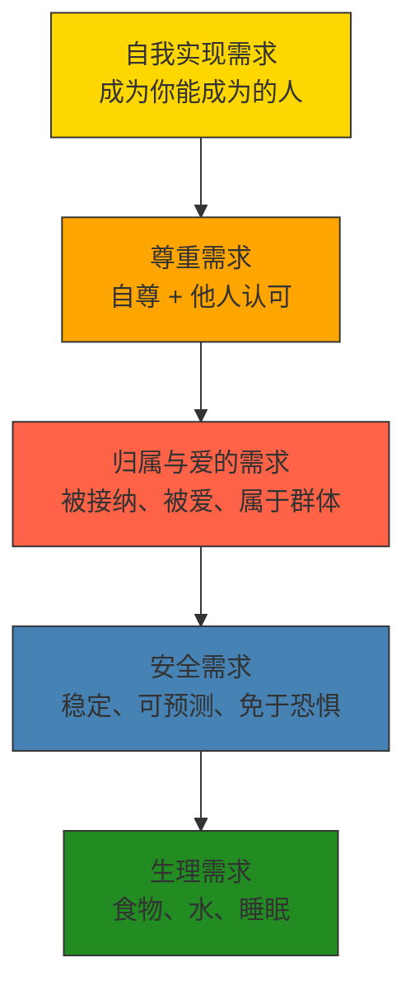
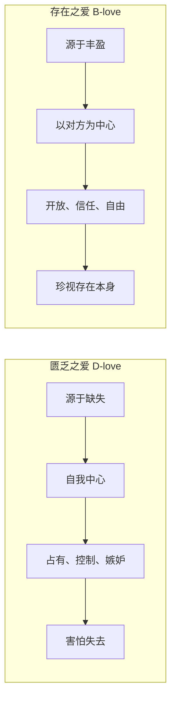

# 《动机与人格》深度读书笔记

> [!abstract] 全书速览
> 马斯洛用这本书提出了一个看似简单却颠覆整个心理学界的主张：人不仅仅是被恐惧和匮乏驱动的动物，人有一种内在的、向上生长的力量，渴望成为自己能够成为的样子。他建立了一套==需求层次理论==来解释人类行为的深层动力，并通过研究那些"最好的人"——自我实现者——来探索人类潜能的上限。这本书是人本主义心理学的奠基之作，它的影响远远超出了心理学，渗透到管理学、教育学和日常生活的方方面面。

## 这本书揭示了什么

你有没有注意到一个奇怪的现象：当你饿得前胸贴后背的时候，什么理想、什么尊严，统统不重要，脑子里只有食物。但一旦吃饱了，你立刻开始想别的事——工作有没有保障，朋友圈里有没有人在乎自己，领导有没有认可自己的表现。这个日常经验背后，藏着一个关于人类动机的深刻结构。

马斯洛在1954年出版这本书的时候，心理学界被两股力量统治。一股是行为主义——把人等同于实验室里的老鼠，认为一切行为不过是刺激和反应的机械链条。另一股是弗洛伊德的精神分析——把人看作被无意识欲望和童年创伤驱动的存在，心理学的任务就是治疗病态。马斯洛对这两种看法都不满意。他问了一个当时几乎没人问的问题：如果我们不去研究病人，不去研究普通人，而是去研究最健康、最杰出的人，我们会发现什么？

> [!note] 背景信息
> 马斯洛最初在威斯康星大学师从行为主义心理学家哈里·哈洛研究灵长类动物行为，后来逐渐转向人本主义研究。他提出的"第三势力"心理学，既不是行为主义也不是精神分析，而是关注人类积极潜能的全新范式。

这个问题的答案，彻底改变了心理学的方向。马斯洛发现，人类的动机不是一锅乱炖，而是有层次、有结构的。更重要的是，当基本需求得到满足之后，人不会停下来——人会继续向上追求，追求成为最好的自己。这种追求不是奢侈品，而是人类本性中内置的驱动力。

## 理论框架

马斯洛的理论可以用一条主线串起来：人类的需求从低到高排列成一个层次结构，低层需求相对满足后，高层需求才会成为主要的行为驱动力。

但这不只是一个静态的金字塔（顺便说一句，马斯洛本人从来没画过什么金字塔图）。它的核心动力学在于两种截然不同的动机模式：==匮乏动机==和==成长动机==。前四层需求属于匮乏动机——你缺什么就想要什么，得到之后欲望就消退了。但自我实现属于成长动机——你越是实现自己，就越想继续成长，满足非但不会让欲望消退，反而会让它更加强烈。

> [!tip] 核心洞察
> 匮乏动机和成长动机的区分才是马斯洛整本书最深刻的洞见。它解释了为什么有些人赚了很多钱、获得了很高的地位之后，依然感到空虚——他们一直在匮乏动机的轨道上运行，从来没有切换到成长动机的频道。

## 核心发现深度解读

### 发现一：需求的层次不是电梯，而是潮水

你可能在无数管理学教科书里见过马斯洛的需求层次被画成一个整齐的金字塔，仿佛人必须先完全满足一层，才能进入下一层。但马斯洛自己的表述远比这复杂和微妙得多。

他打的比方更像是潮水。当潮水（低层需求的满足）涨到一定程度，新的陆地（高层需求）就会浮现出来。但潮水不需要完全涨满——可能生理需求满足了85%，安全需求满足了70%，归属需求满足了50%，尊重需求满足了40%，自我实现需求满足了10%，这些都是同时存在的。主导你行为的，是那个"最迫切"的需求。

马斯洛还特别指出了层次逆转的可能性。有些人会为了理想放弃安全，有些创作者会为了创造性表达忍受贫困和孤独。长期的匮乏也可能让人"固着"在某个层次——经历过严重饥荒的人，可能终生都在囤积食物，即使后来已经不再缺乏。

> [!example] 生活中的映射
> 当你感到焦虑、不安、缺乏动力的时候，不要急着去读励志书或设定宏大目标。先往下看——是不是你的某些基本需求没有得到满足？睡眠够不够？经济上有没有安全感？有没有真正亲近的人？很多时候，看似"上层"的问题，根源在"下层"。

### 发现二：匮乏之爱和存在之爱是两种完全不同的东西

在归属与爱的需求这一层，马斯洛做了一个精妙的区分，这个区分对理解人际关系极其重要。

==匮乏之爱==（D-love）源于缺失。你感到孤独、空虚、不完整，于是你寻找一个人来填补这个洞。这种爱是自我中心的——你爱的其实不是对方这个人，而是对方能给你的东西：安全感、陪伴、被需要的感觉。它的特征是占有欲强、嫉妒心重、害怕失去、需要对方不断证明自己的爱。

==存在之爱==（B-love）源于丰盈。你自身是完整的，你的爱不是为了填补什么，而是你内在充盈到要溢出来。这种爱是对另一个人存在本身的珍视——你爱的是对方作为一个独立个体的全部，包括缺点。它的特征是开放、信任、不占有，让对方成为他自己。

大多数人的恋爱都是从匮乏之爱开始的，这很正常。但马斯洛指出，如果一段关系始终停留在匮乏之爱的层面，它注定会充满焦虑和冲突。真正持久而深厚的关系，需要双方都向存在之爱的方向发展。这和[[《亲密关系》 - 罗兰·米勒]]中讨论的依恋风格有很深的呼应。

### 发现三：自我实现者并不是完美的人，而是"完整地活着"的人

马斯洛选取了一批他认为达到了自我实现水平的人来研究——林肯、爱因斯坦、埃莉诺·罗斯福等。他归纳出了15项特征。

这些特征中最令人意外的可能不是那些"高光"特质，而是第15项：**不完美性**。马斯洛坦率地说，自我实现者也有缺陷。他们可能显得冷漠、不近人情，可能有普通人的恶习，也可能偶尔做出不道德的事。

> [!tip] 核心洞察
> 自我实现不是一个终点，不是达到某种完美状态，而是一种活法——一种更充分、更真实、更有深度地活着的方式。

在15项特征中，有几项特别值得留意：

- "**以问题为中心**"——自我实现者不纠结于自己的内心戏，而是把注意力投向自身之外的问题和使命。有时候治愈自己最好的方式不是向内挖掘，而是向外投入一个大于自己的事业。
- "**持续的新鲜感**"——自我实现者能够反复从日常事物中获得惊叹和喜悦，第一千次看日落和第一次看日落一样激动。
- "**抵抗文化濡化**"——自我实现者能够保持独立判断，不盲从社会潮流。不是为了叛逆而叛逆，而是行为标准来自内在的价值体系。

### 发现四：高峰体验是每个人都可能经历的意识状态

你有没有过这样的时刻：在某个瞬间，你完全忘记了自己，忘记了时间，感到一种难以言说的完满和喜悦？马斯洛把这叫做==高峰体验==（peak experience）。

他通过大量访谈发现，这种体验有一些共同特征：世界被感知为一个完整的统一体，自我的边界消融了，时间感消失了，一切都显得必然而美好，那个瞬间本身就是圆满的，不需要任何补充。

高峰体验不是自我实现者的专利。普通人也会经历，只是频率和深度不同。与高峰体验紧密相关的是**存在认知**（B-cognition）的概念——从功利性的"对我有什么用"切换到纯粹的"看见事物的存在本身"。这和[[《心流》 - 米哈里·契克森米哈赖]]所描述的最优体验有深刻的呼应。

### 发现五：存在价值——人类在最高发展水平上追求什么

马斯洛在自我实现者身上发现了一组他们共同珍视的==存在价值==（B-values）：真、善、美、完整、活力、独特、完美、公正、秩序、简约、丰富、轻松、趣味、自足。

> [!warning] 值得警惕
> 马斯洛认为被剥夺这些价值会导致"超越性病态"——一种更高级的存在危机。这可能部分解释了为什么很多物质丰裕的现代人依然感到不幸福。但这个论点在哲学上非常有争议，因为它本质上是在说价值有"客观性"，这和道德相对主义直接冲突。

### 发现六：心理学不应该只研究病态

这本书的一个深层贡献，是为心理学重新定义了研究对象。马斯洛的逻辑很朴素：如果你想知道人类能跑多快，你应该去研究奥运冠军，而不是去研究普通路人。同理，要理解人类的心理潜能，就应该去研究最健康、最杰出的人。

后来马丁·塞利格曼创立的积极心理学运动，在很大程度上是对马斯洛思想的继承和发展。

## 认知纠偏清单

读完这本书，你应该警惕自己的几个思维习惯：

1. 下次感到莫名焦虑时，先检查需求层次——是不是有什么基本需求没被满足？
2. 评判关系时，问自己：我在"索取"还是"给予"？我爱这个人因为需要他，还是珍视他的存在本身？
3. 不要把自我实现想象成一个终点——它是一个过程，一种每天的选择。
4. 真正的成长不是"变得更好"（匮乏动机），而是"更充分地成为自己"（成长动机）。

## 这本书的局限

> [!warning] 诚实评估
> - **实证基础薄弱**：严格的层次顺序没有得到一致验证，跨文化研究显示不同文化中需求优先级不同
> - **方法论问题严重**：自我实现者样本完全基于马斯洛个人判断，偏向西方白人男性精英
> - **过度乐观**：进化心理学和社会心理学表明，攻击性和自私可能也是人类本性的一部分
> - **文化局限**："自我实现"带有强烈的西方个人主义色彩，在集体主义文化中，人生最高追求可能是融合而非个人实现

## 行为改变指南

**做一次需求审计。** 花20分钟评估你五个层次需求的满足程度。找到最薄弱的一层，优先处理它。

**在重要关系中做"动机检查"。** 我在这段关系中最害怕失去什么？如果对方不再满足这个需求，我还会珍视和对方在一起的时光吗？

**培养"存在认知"的片刻。** 每天找5分钟，刻意用"存在"的眼光看待一个日常事物——不评判好坏，只是看见它的存在。

**找到你的"以问题为中心"的事。** 有什么问题是你真正关心的、大于个人利益的？你需要一个让你忘我投入的方向。

**接受不完美，从今天开始。** 不要等到"准备好了"才开始追求更充实的生活。

## 延伸阅读

[[《心流》 - 米哈里·契克森米哈赖]]从实证研究的角度深入探讨了马斯洛所说的"最优体验"——用更严谨的科学方法验证和拓展了马斯洛关于高峰体验的直觉。

[[《活出生命的意义》 - 维克多·弗兰克尔]]从一个极端的反面印证了马斯洛的理论：当一切基本需求都被剥夺时，意义追求如何成为维系生存的最后力量。

马丁·塞利格曼的《真实的幸福》展示了积极心理学如何用更严格的实证方法来研究人类的优势和美德——这正是马斯洛五十年前呼吁的方向。
