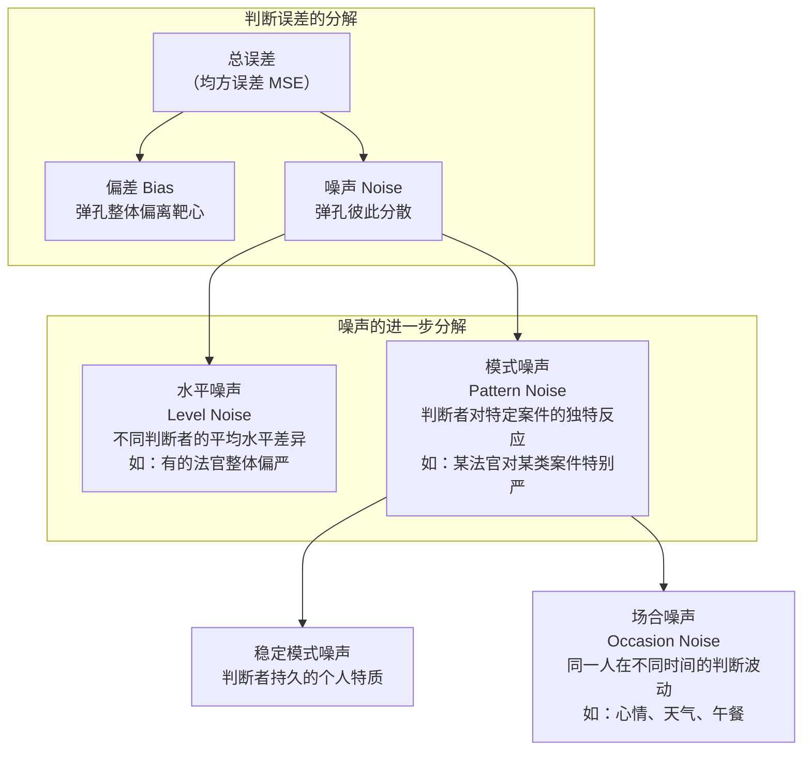

# 《噪声》深度读书笔记

> [!abstract] 全书速览
> 你大概已经知道人类判断存在"偏差"（bias）——系统性地偏向某个方向。但卡尼曼和他的两位合作者在这本书里揭示了判断误差中一个同样重要却长期被忽视的维度：==噪声==（noise），即判断中不应该存在的随机变异性。同一个案件，不同法官量刑可以相差数年；同一份保险理赔，不同核保员的估算可以相差数倍；甚至同一个医生在不同时间看同一张X光片，诊断结论都可能不同。偏差让你往一个错误的方向偏，噪声让你往各种方向散——两者对判断准确性的损害同等严重，但噪声几乎从未得到应有的关注。这本书就是要让你看见这个"隐形"的问题，理解它的来源，并学会减少它。

## 这本书揭示了什么

想象一个场景：一个城市的法院系统中，每天有大量相似的案件需要量刑。如果这个系统是精确的，相似的案件应该得到相似的判决。但现实是什么样的？

20世纪70年代，美国一项经典的量刑研究让208位联邦法官对同一批案件进行量刑。结果触目惊心：同一个案件，不同法官给出的刑期从3年到20年不等。这不是偶尔发生的极端情况，而是系统性的、普遍存在的现象。

> [!note] 背景信息
> 丹尼尔·卡尼曼是诺贝尔经济学奖得主，《思考，快与慢》的作者，认知偏差研究的奠基人。奥利维耶·西博尼是麦肯锡前资深合伙人，专注于战略决策研究。卡斯·桑斯坦是哈佛法学教授、奥巴马政府信息与监管事务办公室前主任。三人的组合——心理学家、商业决策专家、法律政策学者——决定了这本书的独特视角：它不只是描述一个心理学现象，而是追问这个现象在组织和制度层面的后果，并提供可操作的解决方案。这本书出版于2021年，是卡尼曼生前最后一部重要著作。

卡尼曼此前的毕生工作集中在==偏差==上——人类判断如何系统性地偏离理性。[[《思考，快与慢》 - 丹尼尔·卡尼曼]]讲的就是这个故事。但在这本书里，他和合作者发现了一个被忽视的"孪生问题"：即使你修正了所有的偏差，判断中依然存在大量==不应该存在的变异性==。一个法官比另一个法官更严厉，这是偏差；但同一个法官在星期一和星期五给出不同的量刑，这就是噪声。两者都会损害判断的准确性，但噪声在统计上通常和偏差一样严重，有时甚至更严重——然而它几乎从未得到系统性的关注和治理。

这本书之所以重要，是因为它改变了你看待"判断"这件事的方式。在此之前，你可能以为减少判断错误主要就是纠正偏差。读完这本书，你会意识到还有一半的错误来自噪声——而且噪声的治理路径和偏差的治理路径非常不同。

## 理论框架

卡尼曼用一个射击靶的比喻来解释偏差和噪声的关系。

> [!tip] 核心洞察
> 把判断误差想象成射击。偏差是所有弹孔的平均位置偏离了靶心——所有人都往同一个错误方向偏。噪声是弹孔彼此之间的分散程度——即使平均位置命中靶心，但弹孔散布一大片，每一发的误差依然很大。==噪声不是朝某个方向的错误，而是判断的不可预测的随机散布==。数学上，总误差（均方误差）= 偏差的平方 + 噪声的平方。这意味着即使偏差为零，只要噪声存在，判断依然会大量出错。

噪声可以进一步分解为三个层次。==水平噪声==（level noise）来自不同判断者的整体严厉程度不同——有的法官平均判5年，有的判8年。==模式噪声==（pattern noise）来自不同判断者对特定案件的不同反应——同一个法官可能对毒品犯罪特别严、对白领犯罪特别宽，而另一个法官恰好相反。模式噪声往往比水平噪声更大，也更难发现。最后还有==场合噪声==（occasion noise）——同一个人在不同时间对同一个问题给出不同的判断，因为心情、疲劳程度、刚刚处理过什么案件等因素都在产生影响。

## 核心发现深度解读

### 发现一：噪声审计——当你真的去测量，结果令人震惊

假设你是一家保险公司的高管。你手下有几十个核保员，负责评估保单的风险和定价。你觉得他们对同一个案件的估算会差多少？大多数高管猜测差异在10%左右。

卡尼曼和西博尼实际进行了这样的"噪声审计"。他们让同一家公司的核保员独立评估同一批案件。结果：不同核保员对同一案件给出的保费估算，中位差异大约是55%。不是5%，不是15%，是55%。一个核保员觉得应该收9500美元，另一个觉得应该收16700美元——同一个案件，同一家公司，受过同样培训的专业人员。

> [!example] 更多测量结果
> 噪声审计在多个领域的发现都令人警醒。美国联邦法官对同样案件的量刑差异极大——量刑研究显示，被告的命运在很大程度上取决于他被随机分配给哪位法官。在指纹鉴定领域，研究发现鉴定专家在不知情的情况下重新审查自己之前看过的指纹时，约6%的时间会给出不同的结论。在儿童保护领域、难民庇护申请审批中、专利审查中，类似的噪声都大量存在。公司内部的绩效评估、招聘面试评分同样充满噪声。

噪声审计之所以重要，是因为噪声通常是"隐形的"。偏差相对容易发现——如果所有法官都判得太重或太轻，和某个标准一对比就看出来了。但噪声被平均值掩盖了。如果一半法官判得重、一半判得轻，平均量刑可能看起来"刚刚好"——管理者会觉得系统运作正常，但对每一个具体的被告而言，他面对的是一场量刑上的"乐透"。

> [!warning] 注意
> 噪声审计的方法其实并不复杂：让多个判断者独立评估同一批案例，然后比较他们的判断。但绝大多数组织从不进行这样的测量。部分原因是管理者对噪声程度的直觉估计远远偏低（就像那些猜10%的保险高管），部分原因是人们默认专业训练已经足以保证判断的一致性。这本书最重要的贡献之一，就是敦促组织去"做一次噪声审计"——你不能治理你看不见的问题。

### 发现二：场合噪声——你的判断被天气、心情和午餐左右

你可能愿意接受不同的人有不同的判断风格——毕竟人和人确实不同。但同一个人在不同时间对同一个问题做出不同判断，这就更难接受了。然而这正是==场合噪声==的含义。

研究发现，以色列假释委员会的假释通过率在午餐前会急剧下降，午餐后又回升——法官在饥饿状态下更倾向于拒绝假释申请（虽然这项研究后来在方法论上受到质疑，但类似的"疲劳效应"在多个领域被反复观察到）。其他研究显示，法官在当地球队输球后的周一量刑更重；在气温极端的日子里，决策更保守。医生的诊断准确率在一天的工作结束时会下降。

> [!tip] 核心洞察
> 场合噪声的可怕之处在于：做判断的人自己毫不知情。你不会觉得自己因为今天天气好就给了一个更宽松的评估——你会给自己的判断编织一套完美的理由。==你的判断在波动，但你的自信不波动。== 这和[[《思考，快与慢》 - 丹尼尔·卡尼曼]]中系统1的"所见即所有"（WYSIATI）机制一脉相承——你的大脑只根据当前能获取的信息做判断，而且对这个判断充满信心，完全意识不到自己在不同场合下获取和加工信息的方式是不同的。

### 发现三：模式噪声与个人风格的代价

==模式噪声==是噪声中最隐蔽、占比最大的成分。水平噪声相对容易理解和发现——张法官平均比李法官判得重三年。但模式噪声是说，张法官和李法官在对待不同类型案件时的宽严模式不同：张法官对暴力犯罪很严但对经济犯罪比较宽，李法官恰好相反。

这种模式差异通常被尊重性地称为"专业判断"或"个人风格"。事实上它确实包含了专业判断的成分——不同的人基于不同的经验和价值观，对特定情况做出不同的权衡。但这里的问题在于：==当系统要求"相似案件相似判决"时，模式噪声就不是"风格"，而是不公正。==

> [!example] 日常体现
> 模式噪声在企业中同样普遍。两个面试官对同一个候选人的评分差异，很大一部分不是因为一个"手松"一个"手紧"（那是水平噪声），而是因为他们对不同特质的重视程度不同——一个看重沟通能力，另一个看重技术深度。在医疗领域，不同医生面对同样的症状组合会做出不同的诊断判断，部分因为他们各自的临床经验让他们对不同疾病的"先验概率"有不同的内在感觉。在投资领域，不同分析师对同一只股票的估值差异，很大一部分来自他们对不同因素（增长率、行业风险、管理层质量）的权重设置不同。

### 发现四：心理偏差如何制造噪声

如果所有人都受到完全相同的偏差影响，偏差只会导致偏差，不会导致噪声。但实际上，不同的人受到不同偏差的影响程度不同，而且同一个人在不同场合受到偏差的影响也不同。这就使得心理偏差成了噪声的重要来源之一。

书中详细讨论了几个关键的噪声制造机制：

**过度一致性偏差（excessive coherence）**。你的大脑会迅速形成一个"连贯的故事"，然后让后续的信息去适应这个故事。在面试中，如果你对候选人的第一印象很好，你会不自觉地把后续信息解读为支持这个好印象。不同面试官的"第一印象"不同，于是他们各自构建了不同但都"自洽"的故事——模式噪声就这样产生了。

**锚定效应制造的噪声**。不同的判断者被不同的初始信息锚定。一个核保员如果先看了一个高风险案件，再来评估一个中等风险案件，他的估价会比先看了低风险案件的同事偏高——他们各自被不同的锚锚定了，于是对同一个案件的判断就出现了分歧。

**替代效应**。当一个问题太复杂时，你的大脑会悄悄地把它替换成一个更简单的问题来回答。面对"这个候选人五年后能否成为优秀的管理者"，你实际上在回答"我和这个人聊天时感觉好不好"。不同人替代的问题不同，于是判断进一步分散。

> [!warning] 注意
> 这些机制揭示了一个重要的理论洞察：==偏差和噪声不是两个完全独立的问题，而是同一套心理机制在不同条件下的不同表现==。当所有人受到相同方向的偏差影响时，它表现为偏差；当不同人受到不同方向的偏差影响时，它表现为噪声。这意味着减少偏差的某些策略（比如去偏差训练）在减少噪声方面效果有限——因为你可能教会每个人意识到了某种偏差，但每个人"纠偏"的程度不同，噪声依然存在。

### 发现五：判断与决策中的量尺问题

书中一个非常有启发性的发现是关于"判断量尺"的讨论。当你让不同的人用同一个评分标准来评价某件事时，即使所有人都"知道"标准是什么，他们对标准的理解和使用方式也会系统性地不同。

这就像一把尺子——如果每个人手里的尺子刻度不同，即使他们都在认真测量，结果也会不一致。绩效评估中的"优秀"对不同主管意味着不同的门槛。医疗疼痛评分中的"7分"对不同患者意味着不同的痛苦程度。这种"量尺差异"本身就是噪声的重要来源。

> [!example] 关键实验
> 在一项研究中，不同的精神科医生对同一批患者进行诊断。即使使用相同的诊断标准（DSM），医生们的诊断一致性在很多类别上也远低于你的预期。对于精神分裂症等边界较为清晰的诊断，一致性较高；但对于人格障碍、焦虑障碍等边界模糊的诊断，一致性显著下降。这不是因为医生不够专业，而是因为诊断标准中的语言（"显著损害""持续性"等）对不同人意味着不同的阈值。

### 发现六：群体判断——"多数人的智慧"的条件和限度

书中详细讨论了"群体智慧"效应——多个独立判断的平均值通常比大多数个体判断更准确。弗朗西斯·高尔顿在1906年的经典发现是：800个人对一头牛体重的猜测的中位数，几乎完全等于牛的实际体重。

但卡尼曼指出，群体智慧有一个关键前提：==判断必须是独立的==。一旦判断者之间相互影响——知道了彼此的判断、受到了同一个权威意见的锚定、在群体讨论中趋同——群体智慧就会大打折扣，甚至变成"群体愚蠢"。

> [!tip] 核心洞察
> 这个发现对组织决策有深远的实际意义。很多公司的决策流程恰恰违反了"独立性"原则：先开一个会，让老板或最资深的人先发言，然后其他人"讨论"——实际上是被锚定了。卡尼曼建议：在团队讨论之前，让每个人先独立写下自己的判断和理由，密封提交，然后再打开讨论。这个简单的流程改变可以显著减少噪声。

### 发现七：决策卫生——系统性地减少噪声

这本书最有实践价值的部分是"决策卫生"（decision hygiene）的概念。卡尼曼用"卫生"这个比喻是有意为之的：就像你不需要知道具体哪个细菌会让你生病才去洗手一样，你也不需要知道噪声的具体来源才去采取降噪措施。==决策卫生是一套通用的、不依赖于具体领域知识的降噪策略。==

核心策略包括：

**用结构化判断替代整体直觉判断。** 把一个复杂的整体判断分解成若干个独立的维度，分别打分，最后用规则（而非直觉）汇总。招聘面试中，不要让面试官给一个"整体评价"，而是让他们分别对沟通能力、技术深度、学习速度等维度打分，最后加权汇总。结构化面试比非结构化面试的预测效度显著更高，同时噪声也显著更低。

**先独立判断，后讨论汇总。** 确保每个判断者在知道他人观点之前形成自己的判断。这是保护群体智慧的关键。

**使用相对判断而非绝对判断。** 比较两个候选人"谁更适合这个职位"比分别给每个人打一个绝对分数更可靠、噪声更低。

**抵抗过早形成整体印象。** 在收集完所有维度的信息之前，不要形成总体结论。信息呈现的顺序不应该影响最终判断。

> [!example] 实际应用
> 算法和规则在很多预测任务上优于人类专家判断，一个重要原因正是它们==没有噪声==——同样的输入永远产生同样的输出。保罗·米尔（Paul Meehl）早在1954年就证明了这一点：在临床预测任务中，简单的线性模型通常优于临床专家的整体判断。这不是因为模型"更聪明"，而是因为模型虽然可能有偏差，但完全没有噪声——而专家既有偏差又有大量噪声。书中强调，即使是"有缺陷的规则"也往往优于"不受约束的判断"，因为规则至少消除了噪声这一半的误差。

## 认知纠偏清单

读完这本书，以下是你在日常判断中应该保持警觉的几个陷阱。

1. **"我的判断很稳定"错觉。** 你以为自己对同一类问题会给出一致的判断，但实际上你的判断随心情、疲劳、信息呈现顺序和最近处理过的案例而波动。意识到这种不稳定性是减少场合噪声的第一步
2. **过早的整体印象。** 你在接触到最初几条信息后就形成了一个连贯的"故事"，然后让后续信息去适应这个故事。在重要判断中，刻意延迟形成总体印象，先逐个维度收集和评估信息
3. **"专业判断"的光环。** 当你把自己的判断模式称为"经验"或"直觉"时，你可能在合理化一种不应该存在的变异性。你的"专业判断"在多大程度上和同事一致？如果不一致，有多少不一致是真正的专业洞见，有多少只是噪声？
4. **锚定的隐蔽影响。** 你在做判断之前接触到的任何数字——上一个案件的数据、同事随口说的一个估计、新闻里的一个统计——都可能在不知不觉中锚定了你的判断
5. **替代效应。** 当一个判断很复杂时，检查你是否在回答一个更简单的替代问题。"这个项目的风险有多大"是否被你偷偷替换成了"我对这个团队的感觉好不好"？
6. **信息污染。** 在做独立判断之前，你是否已经知道了别人的判断？如果是，你的判断就已经不是独立的了——即使你觉得自己"没有受到影响"

## 这本书的局限

> [!warning] 诚实评估
> - **规则与判断的张力**：书中强调用规则和算法来减少噪声，但在很多领域（如法律、教育、临床心理），完全依赖规则会牺牲对个案的灵敏度和公平性。这个张力书中承认了，但讨论不够充分
> - **"噪声总是坏的"这个前提值得追问**：在创意领域、艺术评判、某些探索性科学中，判断的多样性可能是有价值的——它是创新的来源之一。书中主要讨论的是"需要一致性的判断场景"（法律、医疗、保险等），但读者可能会过度泛化
> - **实验基础的局限**：书中引用的很多噪声测量研究使用的是模拟案例，而非真实判断情境。虽然有理由认为真实情境中的噪声不会更小（可能更大，因为真实案件更复杂），但严格来说这是一个外部效度的问题
> - **决策卫生的执行成本**：结构化判断、独立评估、多维打分等策略在理论上很好，但在实践中需要更多时间和流程成本。书中对这些成本的讨论相对不足
> - **个体差异的忽视**：有些人的判断确实比其他人更准确、更稳定。用群体平均值替代最佳判断者的判断，在某些情况下可能降低而非提升判断质量。书中对"识别和培养优秀判断者"这个路径讨论较少

## 行为改变指南

**做一次个人"噪声审计"。** 选一个你经常需要做判断的领域（比如面试评分、项目风险评估、文章质量评价），记录下你在不同时间对类似对象的判断。一个月后回顾——你的判断有多一致？如果你发现波动比你预期的大，那就是你个人的场合噪声在发挥作用。

**在团队决策中实行"先写后说"。** 下次开会讨论一个重要判断时，在讨论开始之前让每个人先把自己的判断和关键理由写下来并密封提交。这个简单的改变可以保护判断的独立性，显著减少群体中的噪声。具体步骤：（1）把问题书面发给所有参与者；（2）每个人独立写下判断和理由，不与他人交流；（3）所有人同时亮出判断；（4）先讨论分歧最大的维度，再讨论整体。

**把整体判断拆解成分维度判断。** 下次做一个复杂的评估——无论是评估一个候选人、一个项目方案还是一个投资机会——把它分解成4-6个独立维度，分别打分，最后用预设的权重汇总。这比直接给一个"总体评分"噪声低得多，而且迫使你对每个维度都认真思考。

**给自己的判断设置"冷却期"。** 对于不紧急的重要判断，在做出初步判断后隔一天再做一次，看看两次判断是否一致。如果不一致，取平均值通常比随便选一个更准确——你在对自己进行一次"迷你群体智慧"操作。

**警惕信息顺序效应。** 当你需要评估多个对象时（比如审阅多份简历），注意信息的呈现顺序会影响你的判断。有意识地随机调整评估顺序，或者对最终结果做一次"顺序盲审"的心理检查。

## 延伸阅读

[[《思考，快与慢》 - 丹尼尔·卡尼曼]]是理解本书的前置读物。《噪声》可以被视为其"续集"——前者聚焦偏差，后者聚焦变异性。两者合在一起，构成了对人类判断缺陷的完整诊断。

[[《影响力》 - 罗伯特·西奥迪尼]]从社会影响的角度补充了另一个维度——当人们的判断被社会压力和说服技巧操纵时，噪声和偏差同时被放大。

菲利普·泰特洛克的《超预测》从"什么样的人判断更准确"的角度提供了互补视角——它关注的不是如何通过流程降噪，而是如何通过培养特定思维习惯来提升个体判断质量。保罗·米尔的《临床预测与统计预测》是书中反复引用的经典，虽然写于1954年，但其核心论证至今依然成立。
