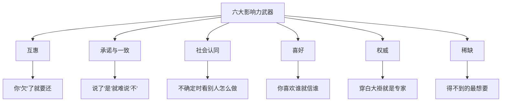

# 《影响力》深度读书笔记

> [!abstract] 全书速览
> 你每天都在被说服，但你很少意识到。西奥迪尼——一位在推销员、募捐者和骗子中间做了三年"卧底"的社会心理学家——发现人类的顺从行为遵循六条基本原则。这些原则不是阴谋论，而是在漫长进化中形成的心理快捷方式。它们大部分时候帮你节省认知资源，但一旦被有意利用，它们就变成了你最容易被攻破的心理防线。这本书既是一本说服科学的经典，也是一份实用的心理自卫手册。

## 这本书揭示了什么

罗伯特·西奥迪尼是亚利桑那州立大学的社会心理学教授。他花了三年时间"卧底"——在汽车经销商受训、在慈善募捐机构工作、去传销组织观察——学习说服专业人士如何让人点头。他发现底层的心理机制只有几种，而且大多数时候它们是有益的快捷方式，只是也可以被操控。

西奥迪尼把这种现象称为"咔嗒-呼"反应：特定的触发信号会自动启动一段预设的行为程序，你来不及思考，行为就已经发生了。问题在于，当别人学会了你的"按钮"在哪里，他们就可以随时"按"你。

> [!note] 核心理论
> 西奥迪尼的理论建立在"固定行为模式"类比上：雌火鸡听到小鸡叫声就会抚育它——即使叫声来自天敌标本。人类也有类似的==自动触发反应==，说服专业人士学会了如何制造这些触发信号。他用"柔道术"来类比：最高明的说服者不会跟你正面对抗，而是利用你自己内部已经存在的心理力量——借力打力。

## 理论框架

## 核心发现深度解读

### 原则一：互惠

> [!example] 经典实验
> "乔"在休息时主动给受试者买了一瓶可乐（几毛钱）。后来请他们买抽奖券，收到可乐的人购买量是没收到的两倍——几毛钱换回了几块钱。更关键的是，即使受试者不喜欢乔，只要收了可乐，购买量依然显著增加——互惠的力量甚至能盖过个人好恶。

==互惠==是人类社会最古老的规范：别人给了你什么，你有义务回报。即使给予不请自来、你并不想要、回报价值远超原始给予——你仍然觉得必须回报。人类学家古尔德纳研究了全世界的文化，发现没有任何一个社会不存在互惠规范——它是人类合作能力的基石。

互惠原则有三个令人警惕的特点：它可以触发不对等的交换；它可以强加给你不想要的债务；它可以让你答应一个你原本会拒绝的请求。

**让步互惠**更精妙：先提一个会被拒绝的大请求，再降低到小请求。因为你"让步"了，对方觉得也应该"让步"。请大学生带少年犯去动物园，直接问只有17%答应；先请做两年志愿者被拒，再降到去一次动物园，答应率升至50%。而且通过让步互惠答应的人不仅更可能说"是"，还更可能真的出现——让步互惠改变的不仅是行为，还有态度。

### 原则二：承诺与一致

一旦做出选择或表明立场，你就面临巨大压力保持一致。因为在社会中，言行一致的人被认为可靠，而前后矛盾的人会被认为不可信。

**"脚在门里"技术**：先答应小请求（插小标牌），再提大请求（立巨大广告牌），接受率提升三倍以上——因为你已经把自己定义为"配合的人"。

> [!warning] 注意"抛低球"
> 汽车销售员先给好价格让你心理承诺，再"发现"价格有误需要加价。理性上你应该走开，但很多人不会——你已经"决定了"，内心推动你保持一致。你甚至会主动找理由说服自己：颜色不错、离家近——这些理由在价格变化之前你可能根本不在乎。

承诺在以下条件下最强大：==主动的、公开的、需要付出努力的、被认为是自由选择的==。一些公司举办征文比赛让消费者写"我为什么喜欢这个品牌"——表面上是比赛，实质上是让你主动、公开地承诺了对品牌的喜爱。

### 原则三：社会认同

不确定时，人参照他人行为来决策。在**不确定性高**和**对方与你相似**时最强大。

旁观者效应是极端案例：每个人都在等别人先行动，结果没人行动。**维特效应**更微妙：媒体大规模报道自杀事件后，接下来几天自杀率会显著上升，而且模仿者倾向于和被报道者特征相似——人们不仅模仿行为，还倾向于模仿"和自己相似的人"。

日常中无处不在——"销量第一"、餐厅排队、罐头笑声、网购评价。社交媒体上，获得大量点赞的帖子更容易获得更多点赞——已有的点赞本身就是社会认同信号。

### 原则四：喜好

你更容易对你喜欢的人说"是"。影响喜好的因素：
- **外表吸引力**：光环效应——好看=更聪明、更善良。法庭上好看的被告获得更轻判决，选举中更有吸引力的候选人获得更多选票
- **相似性**：销售员"偶然"和你同乡。仅仅穿着相似就能提高请求成功率
- **赞美**：即使知道是恭维也有效——你的理性知道"他在拍马屁"，但情感系统不管
- **熟悉感**：反复接触增加好感。扎荣茨实验证明反复看无意义图形就会产生好感
- **关联效应**：产品和明星绑定。波斯帝国杀死带来战败消息的信使——同一心理机制跨越几千年

> [!tip] 防御策略
> 把"我喜欢这个人"和"这笔交易值不值"分开评估。

### 原则五：权威

> [!example] 米尔格拉姆实验
> 超过60%的普通人在"研究者"（穿白大褂）指示下，愿意施加他们认为可能致命的电击——450伏特。受试者出汗、颤抖、恳求停止，但当权威说"请继续"，他们就继续了。

权威服从在进化上有道理——听从专业人士在大多数情况下是有效的生存策略。问题在于，它容易被外在标志所劫持。

权威通过==头衔、服装、装饰==发挥作用。一个人穿便装闯红灯，跟随者很少；穿高档西装闯红灯，跟随者增加三倍半。在医疗领域，当"医生"通过电话下达不合理用药指令时，95%的护士准备执行，没人核实来电者身份。

问两个问题：他真的是专家吗？他有没有利益冲突？

### 原则六：稀缺

> [!example] 饼干实验
> 罐子里有很多饼干vs只剩两块——同样的饼干在稀缺条件下被评为更好吃。饼干没变，你的感知变了。

稀缺背后有两层心理机制。第一层是==心理捷径==：难以获得的东西通常更好。第二层更深——==心理抗拒理论==：当自由受威胁时，你会更加渴望那个快要消失的选择。

==新近稀缺==（从有到没有）比一直稀缺影响更大。==竞争稀缺==（别人也在抢）让渴望进一步升级。拍卖是竞争稀缺的极端形式——你看到别人出价，渴望不断升级，最终支付的价格远超预期。限时折扣、"仅剩最后3件"都是在制造稀缺感。

这与[[《思考，快与慢》 - 丹尼尔·卡尼曼]]中的==损失厌恶==有深层连接：你对"可能得不到"的恐惧比对"可能得到"的期待更有驱动力。从生理层面看，损失激活的大脑区域与身体疼痛区域有重叠——"失去"真的是一种"痛"。

## 六大原则的协同效应

现实中这六个原则很少单独出现。以汽车销售为例：找共同点（喜好）、试驾填表（承诺与一致）、"今天最后一天"（稀缺）、"上月销量冠军"（社会认同）、经理"特批"（权威）、谈判让步（互惠）——一次成功的销售可能动用了全部六个原则。

原则叠加得越多，你越应该警觉。

## 认知纠偏清单

1. 有人先给你"礼物"再提请求——觉察互惠本能，把感激和请求的合理性分开
2. 坚持一个不太合理的决定"因为已经投入太多"——承诺与一致在作祟，问"如果重来我还会这样做吗？"
3. 判断依据是"大家都在做"——检查"大家"是否真的知道自己在做什么
4. 对推销员莫名好感——把好感和交易实质分开
5. "专家"推荐——他真的是专家吗？有没有利益冲突？
6. "必须立刻行动否则错过"——稀缺感可能是制造的，如果不稀缺你还想要吗？
7. 多个原则同时起作用——这是最需要警觉的时刻，后退一步给自己时间

## 这本书的局限

> [!warning] 诚实评估
> - **文化差异**：社会认同在集体主义文化中更强，个人一致性在个人主义文化中更强；东亚"面子"文化与承诺一致有复杂交互
> - **交互复杂性**：现实中多个原则同时起作用，可能互相增强也可能冲突，书中讨论不够充分
> - **框架可能不完整**：西奥迪尼后来增加第七原则"统一性"，暗示六原则不是穷尽的
> - **复制危机影响**：核心原则证据总体坚实，但某些具体实验效应量在重复研究中有所减弱

## 行为改变指南

**制作"说服识别卡"：** 六大原则写在卡片上，面对重要决策时逐条检查。

**建立"冷静期"习惯：** 被说服做重大决定时坚持不当场决定，给自己24小时。大多数操纵在脱离情境后失效。如果对方催促你"现在就决定"——这本身就是危险信号。

**区分"触发信号"和"真实信息"：** 产品热销不等于适合你，人看起来像专家不等于建议正确，东西快卖光不等于你需要它。

**回顾过去的决定：** 选几个事后觉得不太明智的决定，用六大原则逐一分析——这种事后分析会显著提高你在未来类似情境中的警觉度。

**善用而非滥用：** 了解这些原则是为了更有效沟通，不是为了操纵。

## 延伸阅读

[[《思考，快与慢》 - 丹尼尔·卡尼曼]]从认知科学角度揭示思维偏差的内部机制，和本书揭示的外部利用方式形成完美互补——一本告诉你大脑为什么这样运作，一本告诉你别人怎么利用你的大脑。

西奥迪尼的后续著作《先发影响力》探讨说服的"前奏"——在正式提出请求之前如何通过改变注意力焦点增加成功率。说服的效果不仅取决于你说了什么，更取决于对方在听到你的话之前，注意力被引导到了哪里。

理查德·塞勒和卡斯·桑斯坦的《助推》展示了如何将影响力原则用于公共政策——温和引导人们做出更好决策，同时保留选择自由。

《乌合之众》从群体心理角度补充了社会认同原则的讨论，帮你理解个体汇入群体时认知和行为的系统性改变。
