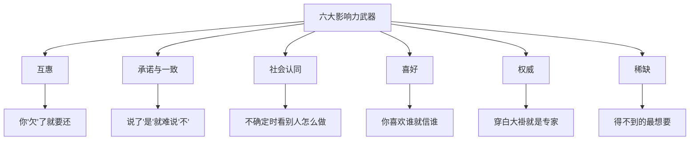

# 《影响力》深度读书笔记

> [!abstract] 全书速览
> 你每天都在被说服，但你很少意识到。西奥迪尼——一位在推销员、募捐者和骗子中间做了三年"卧底"的社会心理学家——发现人类的顺从行为遵循六条基本原则。这些原则不是阴谋论，而是在漫长进化中形成的心理快捷方式。它们大部分时候帮你节省认知资源，但一旦被有意利用，它们就变成了你最容易被攻破的心理防线。这本书既是一本说服科学的经典，也是一份实用的心理自卫手册。

## 这本书揭示了什么

罗伯特·西奥迪尼是亚利桑那州立大学的社会心理学教授。他花了三年时间"卧底"——在汽车经销商受训、在慈善募捐机构工作、去传销组织观察——学习说服专业人士如何让人点头。他发现底层的心理机制只有几种，而且大多数时候它们是有益的快捷方式，只是也可以被操控。

> [!note] 核心理论
> 西奥迪尼的理论建立在"固定行为模式"类比上：雌火鸡听到小鸡叫声就会抚育它——即使叫声来自天敌标本。人类也有类似的==自动触发反应==，说服专业人士学会了如何制造这些触发信号。

## 理论框架

## 核心发现深度解读

### 原则一：互惠

> [!example] 经典实验
> "乔"在休息时主动给受试者买了一瓶可乐（几毛钱）。后来请他们买抽奖券，收到可乐的人购买量是没收到的两倍——几毛钱换回了几块钱。

==互惠==是人类社会最古老的规范：别人给了你什么，你有义务回报。即使给予不请自来、你并不想要、回报价值远超原始给予——你仍然觉得必须回报。

**让步互惠**更精妙：先提一个会被拒绝的大请求，再降低到小请求。因为你"让步"了，对方觉得也应该"让步"。请大学生带少年犯去动物园，直接问只有17%答应；先请做两年志愿者被拒，再降到去一次动物园，答应率升至50%。

### 原则二：承诺与一致

一旦做出选择或表明立场，你就面临巨大压力保持一致。

**"脚在门里"技术**：先答应小请求（插小标牌），再提大请求（立巨大广告牌），接受率提升三倍以上——因为你已经把自己定义为"配合的人"。

> [!warning] 注意"抛低球"
> 汽车销售员先给好价格让你心理承诺，再"发现"价格有误需要加价。理性上你应该走开，但很多人不会——你已经"决定了"，内心推动你保持一致。

承诺在以下条件下最强大：==主动的、公开的、需要付出努力的、被认为是自由选择的==。

### 原则三：社会认同

不确定时，人参照他人行为来决策。在**不确定性高**和**对方与你相似**时最强大。

旁观者效应是极端案例：每个人都在等别人先行动，结果没人行动。日常中无处不在——"销量第一"、餐厅排队、罐头笑声、网购评价。

### 原则四：喜好

你更容易对你喜欢的人说"是"。影响喜好的因素：
- **外表吸引力**：光环效应——好看=更聪明、更善良
- **相似性**：销售员"偶然"和你同乡
- **赞美**：即使知道是恭维也有效
- **熟悉感**：反复接触增加好感
- **关联效应**：产品和明星绑定

> [!tip] 防御策略
> 把"我喜欢这个人"和"这笔交易值不值"分开评估。

### 原则五：权威

> [!example] 米尔格拉姆实验
> 超过60%的普通人在"研究者"（穿白大褂）指示下，愿意施加他们认为可能致命的电击。这不是因为他们坏，而是权威服从的力量太强大。

权威通过==头衔、服装、装饰==发挥作用。广告中穿白大褂推荐牙膏的人很可能不是医生。问两个问题：他真的是专家吗？他有没有利益冲突？

### 原则六：稀缺

> [!example] 饼干实验
> 罐子里有很多饼干vs只剩两块——同样的饼干在稀缺条件下被评为更好吃。饼干没变，你的感知变了。

==新近稀缺==（从有到没有）比一直稀缺影响更大。==竞争稀缺==（别人也在抢）让渴望进一步升级。限时折扣、"仅剩最后3件"都是在制造稀缺感。

这与[[《思考，快与慢》 - 丹尼尔·卡尼曼]]中的==损失厌恶==有深层连接：你对"可能得不到"的恐惧比对"可能得到"的期待更有驱动力。

## 认知纠偏清单

1. 有人先给你"礼物"再提请求——觉察互惠本能，把感激和请求的合理性分开
2. 坚持一个不太合理的决定"因为已经投入太多"——承诺与一致在作祟，问"如果重来我还会这样做吗？"
3. 判断依据是"大家都在做"——检查"大家"是否真的知道自己在做什么
4. 对推销员莫名好感——把好感和交易实质分开
5. "专家"推荐——他真的是专家吗？有没有利益冲突？
6. "必须立刻行动否则错过"——稀缺感可能是制造的，如果不稀缺你还想要吗？

## 这本书的局限

> [!warning] 诚实评估
> - **文化差异**：社会认同在集体主义文化中更强，个人一致性在个人主义文化中更强
> - **交互复杂性**：现实中多个原则同时起作用，可能互相增强也可能冲突，书中讨论不够充分
> - **框架可能不完整**：西奥迪尼后来增加第七原则"统一性"，暗示六原则不是穷尽的
> - **复制危机影响**：核心原则证据总体坚实，但某些具体实验效应量在重复研究中有所减弱

## 行为改变指南

**制作"说服识别卡"：** 六大原则写在卡片上，面对重要决策时逐条检查。

**建立"冷静期"习惯：** 被说服做重大决定时坚持不当场决定，给自己24小时。大多数操纵在脱离情境后失效。

**区分"触发信号"和"真实信息"：** 产品热销不等于适合你，人看起来像专家不等于建议正确，东西快卖光不等于你需要它。

**善用而非滥用：** 了解这些原则是为了更有效沟通，不是为了操纵。

## 延伸阅读

[[《思考，快与慢》 - 丹尼尔·卡尼曼]]从认知科学角度揭示思维偏差的内部机制，和本书揭示的外部利用方式形成完美互补——一本告诉你大脑为什么这样运作，一本告诉你别人怎么利用你的大脑。

西奥迪尼的后续著作《先发影响力》探讨说服的"前奏"——在正式提出请求之前如何通过改变注意力焦点增加成功率。

理查德·塞勒和卡斯·桑斯坦的《助推》展示了如何将影响力原则用于公共政策——温和引导人们做出更好决策，同时保留选择自由。
