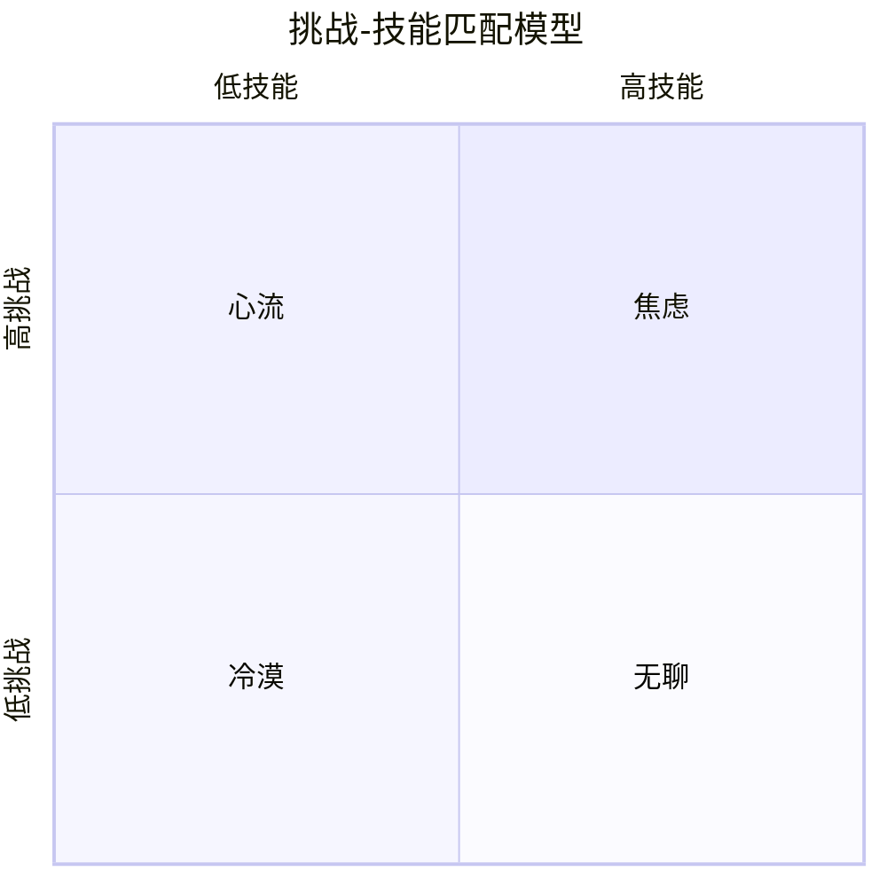

# 《心流》深度读书笔记

> [!abstract] 全书速览
> 幸福不是一种你可以追到手的东西，而是一种你在全神贯注做某件事时自然涌现的副产品。契克森米哈赖通过对全球数千人的研究发现，人类最幸福的时刻不是放松的时刻，而是身心全力以赴、接近自身极限、去完成某件有难度但有价值之事的时刻。他把这种==最优体验==的状态称为"心流"。这本书不是一本关于如何更高效的指南，而是一本关于如何更深入地活着的心理学经典。

## 这本书揭示了什么

问你一个问题：你人生中最快乐的时刻是什么时候？如果你仔细回忆，你可能会发现一个反直觉的事实：那些最快乐的时刻，往往不是你躺在沙滩上什么都不做的时候，而是你全神贯注地完成一个有挑战性的项目时、在钢琴前弹出一段困难但动听的旋律时、或者在写作中忘记了时间的流逝时。

> [!note] 作者背景
> 契克森米哈赖的童年在二战期间的欧洲度过，亲眼目睹了许多成年人在战争摧毁了他们的财富、地位和安全感之后彻底崩溃，但也有少数人在同样的废墟中保持着某种内在的完整和力量。这个童年观察埋下了他一生研究的种子。他使用"经验抽样法"——给受试者寻呼机，在一天中随机时刻呼叫，让他们记录当时的活动和感受。通过收集超过十万条来自不同国家、不同职业、不同年龄的人的体验报告，他发现：人在"心流"状态中报告的幸福感最高。这个发现更支持亚里士多德的"幸福即卓越的实现"（eudaimonia），而非伊壁鸠鲁的享乐主义。塞利格曼曾明确说，心流概念是积极心理学的核心理论之一。

## 理论框架

> [!tip] 核心洞察
> 当==挑战水平==和==技能水平==都处于较高水平且恰好匹配时，心流出现。这个模型后来被发展为"八通道模型"——增加了唤醒、控制、放松、担忧四个中间状态，解释了为什么你有时觉得"快要进入状态了"（唤醒区）或"做起来轻松但没什么刺激"（控制区）。关键在于平衡点是动态的：随着技能提升，你需要不断寻找更高挑战来维持心流。这意味着幸福不是外部条件的产物（财富、地位），而是==内在体验的质量==。一个全神贯注工作的技工，可能比百无聊赖的富翁更接近幸福。

## 核心发现深度解读

### 发现一：心流的八大特征

契克森米哈赖归纳出心流状态的八个核心特征：

1. **清晰的目标**——每一刻都知道自己要做什么。反过来想想你在工作中最烦躁的时刻——往往不是忙的时候，而是不知道该做什么的时候。目标的模糊是心流的天敌
2. **即时的反馈**——不需要等到结束就知道做得好不好。反馈不必来自外部——经验丰富的写作者能从自己写出的句子中感受到是否"对了"
3. **挑战与技能的平衡**——任务刚好在能力边缘，与维果斯基的"最近发展区"概念高度吻合
4. **行动与意识的融合**——你就是那件事本身。一位舞者这样描述："我的身体在自己跳舞，我什么都不用想"
5. **排除干扰**——日常烦恼完全进不来。不是刻意压制，而是意识被任务填满了，没有多余带宽
6. **不担心失败**——自我评判退场，过程完全吸收了意识
7. **自我意识消失**——不再意识到"自己"在行动。悖论的是，恰恰在此刻"自我"在经历成长
8. **时间感扭曲**——时间变快或变慢。神经科学解释：注意力集中时，大脑用来"标记时间流逝"的认知资源被重新分配了

> [!example] 普遍性
> 这些特征在攀岩者、外科医生、国际象棋大师、工厂工人、日本年轻人、意大利阿尔卑斯山区农民、韩国跆拳道练习者、印度瑜伽修行者身上都得到了验证。心流不是精英体验，也不是某种文化特产，而是人类意识的普遍可能性。

### 发现二：心流可以在任何活动中被主动创造

> [!example] 工厂工人乔的案例
> 在芝加哥的一家工厂，装配线工人乔把工作变成了游戏：记住所有机器的维修方法，不看手册诊断问题，不断挑战更快更优雅的操作，还主动学习了整个生产流程。他的效率是同事的两倍，"从不觉得无聊"，甚至拒绝了升职管理岗——因为管理工作不如操作机器让他投入。

> [!example] 阿尔卑斯山村妇女
> 意大利山村的老年妇女从事看似单调的挤奶、做奶酪工作，但她们建立了精微的技能体系——能从牛奶质地判断天气变化，从草色预测季节转换。她们的幸福感和生活满意度高于米兰城市里拥有更多物质条件的同龄人。

关键洞见：心流不是外部给予的，而是你主动创造的。契克森米哈赖称这种能力为"把经验转化为心流的能力"，它比你做什么工作更重要。不要把"没有心流"归咎于工作太无聊——你有没有主动设定挑战、学习新技能、建立反馈系统？

### 发现三：工作悖论——你工作时其实比休闲时更幸福

经验抽样数据显示：人们工作中约==54%==的时间处于"高挑战、高技能"的心流区间，休闲中仅==18%==，但主观上更想休闲。因为工作提供了心流结构条件（目标、反馈、挑战），但你的叙事是负面的——把工作看作义务而把休闲看作奖励，这个叙事强大到覆盖了实际体验。

而大多数休闲是"被动休闲"——刷手机、看电视——不提供心流条件。看电视甚至是所有休闲活动中幸福感报告最低的类别之一——人们看完后常报告感到"被掏空了"而不是"充了电"。

> [!tip] 实用建议
> 真正让人在休闲中幸福的是"主动休闲"——运动、创作、深度社交、学习新技能、园艺、烹饪复杂菜肴。如果想周末更充实，安排有适度挑战的活动，而不是追求"什么都不做"。周末结束时的充实感，不来自你休息了多久，而来自你投入了什么。

### 发现四：注意力是幸福的货币

契克森米哈赖估计意识在任何时刻只能处理约126比特的信息。心流之所以让人幸福，是因为它占据全部注意力容量，不留空间给焦虑和反刍思维。临床抑郁症患者的核心特征之一正是"反刍性思维"——注意力被困在对过去错误和未来威胁的循环思考中。心流是反刍思维的天然解药。

他把注意力的有序组织称为==精神负熵==（psychic negentropy），把意识的混乱称为==精神熵==（psychic entropy）——不幸福的根本形式。

> [!tip] 核心洞察
> ==幸福不是发生在你身上的事，而是你对自己注意力的组织方式。== 能控制注意力的人，在任何环境中都更幸福。集中营幸存者中那些能维持内在秩序的人（通过回忆诗歌、在脑中下棋、设定微小目标），比完全被外部环境控制的人更可能存活。这与正念研究中"注意力管理决定体验质量"的发现形成呼应——心流强调在高挑战任务中的全情投入，正念强调对当下体验的非评判觉察，但底层逻辑一致。

### 发现五：自我目的性——做事本身就是奖励

心流体验是==自我目的的==（autotelic，源自希腊语auto"自我"和telos"目的"）——活动本身就是目的。自我目的性的人在同样活动中报告的心流频率是其他人的两到三倍。关键在于将注意力从"结果"转向"过程"——同样是跑步，盯着配速和里程是生产任务，关注呼吸和脚感是体验世界。

> [!warning] 注意
> 外部奖励有时反而会"挤出"内在动机——这就是"过度理由效应"。一个孩子本来因为喜欢画画而画画，你开始给他每幅画五块钱奖励，几周后撤掉奖励他反而不想画了——因为外部奖励替代了内在动机成为了行为的"理由"。这和[[《动机与人格》 - 亚伯拉罕·马斯洛]]中"成长动机"的概念深度呼应。

### 发现六：统一生命主题

一个有意义的人生，是由连贯的"生命主题"把分散的心流体验串联起来的人生。契克森米哈赖举了一个盲人女性的例子——她的生命主题是"证明失去视力不等于失去生活的能力"，这个主题把她学习盲文、独立旅行、教授其他盲人等看似不同的心流体验串联成了有力量的整体叙事。

没有生命主题的人即使经历很多心流也感到碎片化——就像一本充满精彩段落但没有主线的书。有生命主题的人即使遭遇挫折也能找到意义——挫折不是无意义的苦难，而是通向某个方向的阻力。他还区分了"发现的生命主题"（主动探索得来，更能带来深层满足）和"接受的生命主题"（从文化或家庭继承）。

## 认知纠偏清单

1. **"幸福即享乐"偏误**——数据表明人在适度挑战中比在放松中更幸福。真正的放松是恢复手段，不是目的
2. **"工作即痛苦"偏误**——你工作中进入心流的频率更高（54% vs 18%），问题可能在叙事而非工作本身
3. **"活动决定论"偏误**——心流可以在任何活动中被主动创造，关键是你怎么做而非做什么
4. **"心流等于高效"偏误**——心流核心是体验深度，效率是副产品。只在乎产出你反而可能错过心流
5. **"被动休闲即恢复"偏误**——看电视的幸福感报告甚至低于"什么都不做"。真正的恢复需要主动投入

## 这本书的局限

> [!warning] 诚实评估
> - **过度个人化**：把幸福责任完全放在个人身上，忽视结构性因素（贫困、压迫、缺乏自主性）对进入心流的系统性阻碍
> - **道德中性问题**：赌徒赌博、游戏成瘾者游戏时也可能经历心流——心流本身不等于有益
> - **文化局限**："全力以赴的个人挑战"在强调和谐与集体性的文化中可能不是幸福最佳路径——日本学者发现集体合作活动中的心流体验与个人挑战同样强烈
> - **方法论局限**：经验抽样法依赖自我报告，且寻呼机打断本身就可能破坏正在进行的心流

## 行为改变指南

**识别心流活动：** 回顾过去一个月，找出让你忘记时间的2-3个活动，如果它们只占每周2小时，试着增加到4小时。

**在工作中创造心流：** 设定略超当前水平的具体目标，建立即时反馈机制。每天找30分钟"深度工作"时段——关掉通知、关上门、只做一件事。

**重新设计休闲：** 看看上周末时间花在了哪里，把"被动休闲"和"主动休闲"标出来。如果被动超过60%，用一项主动休闲替换一项被动休闲。

**练习注意力集中：** 每天15分钟全神贯注做一件事，不查手机、不多线程。前几分钟最难——注意力反复试图逃跑。每次把它拉回来，就是一次注意力的举重训练。

**思考生命主题：** 列出你最充实的心流时刻，找出它们之间的共同线索。不要期待顿悟，生命主题通常在反思中逐渐浮现。

**调整工作叙事：** 把"我又要去上班了"换成"今天我在工作中可以设定什么新挑战"。你工作中的心流数据比休闲时更好，让叙事和体验对齐。

## 延伸阅读

[[《动机与人格》 - 亚伯拉罕·马斯洛]]中的"高峰体验"是心流概念的哲学先驱——马斯洛凭直觉捕捉到了最优体验的存在，契克森米哈赖用更严谨的实证方法对其进行了系统研究。

[[《贪婪的多巴胺》 - 丹尼尔·利伯曼]]提供了有趣的神经化学视角——利伯曼提出的"掌控"概念，即多巴胺的"渴望"系统和此时此地分子的"满足"系统达到最和谐平衡的时刻，几乎就是心流的神经化学描述。

丹尼尔·平克的《驱动力》从管理角度探讨了内在动机（自主、精通、目的）如何驱动最佳表现，"精通"概念与心流直接关联。安德斯·艾利克森的《刻意练习》提供了互补视角：刻意练习在"学习区"提升你的天花板，心流则在"甜蜜点"给你投入的奖赏。
