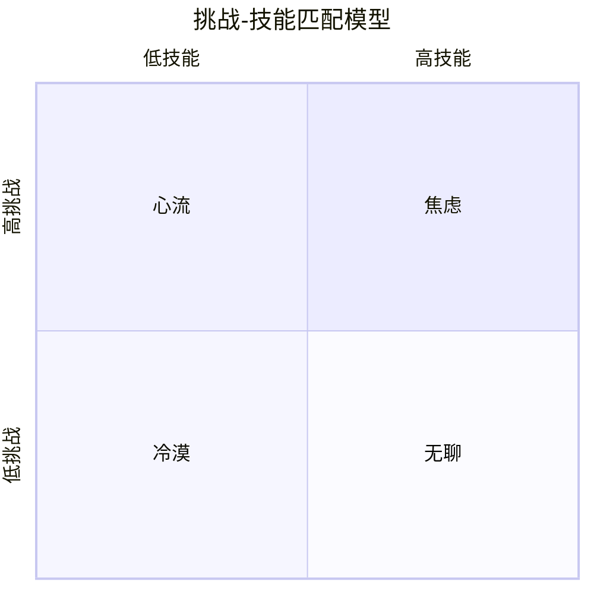

# 《心流》深度读书笔记

> [!abstract] 全书速览
> 幸福不是一种你可以追到手的东西，而是一种你在全神贯注做某件事时自然涌现的副产品。契克森米哈赖通过对全球数千人的研究发现，人类最幸福的时刻不是放松的时刻，而是身心全力以赴、接近自身极限、去完成某件有难度但有价值之事的时刻。他把这种==最优体验==的状态称为"心流"。

## 这本书揭示了什么

问你一个问题：你人生中最快乐的时刻是什么时候？如果你仔细回忆，你可能会发现一个反直觉的事实：那些最快乐的时刻，往往不是你躺在沙滩上什么都不做的时候，而是你全神贯注地完成一个有挑战性的项目时、在钢琴前弹出一段困难但动听的旋律时、或者在写作中忘记了时间的流逝时。

> [!note] 研究方法
> 契克森米哈赖使用"经验抽样法"——给受试者寻呼机，在一天中随机时刻呼叫，让他们记录当时的活动和感受。通过收集超过十万条来自不同国家、不同职业、不同年龄的人的体验报告，他发现：人在"心流"状态中报告的幸福感最高。

## 理论框架

> [!tip] 核心洞察
> 当==挑战水平==和==技能水平==都处于较高水平且恰好匹配时，心流出现。这意味着幸福不是外部条件的产物（财富、地位），而是==内在体验的质量==。一个全神贯注工作的技工，可能比百无聊赖的富翁更接近幸福。

## 核心发现深度解读

### 发现一：心流的八大特征

契克森米哈赖归纳出心流状态的八个核心特征：

1. **清晰的目标**——每一刻都知道自己要做什么
2. **即时的反馈**——不需要等到结束就知道做得好不好
3. **挑战与技能的平衡**——任务刚好在能力边缘
4. **行动与意识的融合**——你就是那件事本身
5. **排除干扰**——日常烦恼完全进不来
6. **不担心失败**——自我评判退场
7. **自我意识消失**——不再意识到"自己"在行动
8. **时间感扭曲**——时间变快或变慢

> [!example] 普遍性
> 这些特征在攀岩者、外科医生、国际象棋大师、工厂工人、日本年轻人、意大利农民身上都得到了验证。心流不是精英体验，而是人类意识的普遍可能性。

### 发现二：心流可以在任何活动中被主动创造

> [!example] 工厂工人乔的案例
> 在芝加哥的一家工厂，装配线工人乔把工作变成了游戏：记住所有机器的维修方法，不看手册诊断问题，不断挑战更快更优雅的操作。他的效率是同事的两倍，"从不觉得无聊"。

关键洞见：心流不是外部给予的，而是你主动创造的。不要把"没有心流"归咎于工作太无聊——你有没有主动设定挑战、学习新技能、建立反馈系统？

### 发现三：工作悖论——你工作时其实比休闲时更幸福

经验抽样数据显示：人们工作中进入心流的频率远高于休闲时间，但主观上更想休闲。因为工作提供了心流结构条件（目标、反馈、挑战），但你的叙事是负面的。而大多数休闲是"被动休闲"——刷手机、看电视——不提供心流条件。

> [!tip] 实用建议
> 真正让人在休闲中幸福的是"主动休闲"——运动、创作、深度社交、学习新技能。如果想周末更充实，安排有适度挑战的活动，而不是追求"什么都不做"。

### 发现四：注意力是幸福的货币

契克森米哈赖估计意识在任何时刻只能处理约126比特的信息。心流之所以让人幸福，是因为它占据全部注意力容量，不留空间给焦虑和自我怀疑。

> [!tip] 核心洞察
> ==幸福不是发生在你身上的事，而是你对自己注意力的组织方式。== 能控制注意力的人，在任何环境中都更幸福。这与正念研究中"注意力管理决定体验质量"的发现形成呼应。

### 发现五：自我目的性——做事本身就是奖励

心流体验是==自我目的的==（autotelic）——活动本身就是目的。自我目的性的人能在更多活动中找到心流，关键在于将注意力从"结果"转向"过程"。这和[[《动机与人格》 - 亚伯拉罕·马斯洛]]中"成长动机"的概念深度呼应。

### 发现六：统一生命主题

一个有意义的人生，是由连贯的"生命主题"把分散的心流体验串联起来的人生。没有生命主题的人即使经历很多心流也感到碎片化；有生命主题的人即使遭遇挫折也能找到意义。

## 认知纠偏清单

1. "幸福就是轻松自在"——数据表明人在适度挑战中比在放松中更幸福
2. "工作是痛苦的"——你工作中进入心流的频率更高，问题可能在叙事而非工作本身
3. "只有有趣活动才有心流"——心流可以在任何活动中被主动创造
4. "心流等于高效"——心流核心是体验深度，效率是副产品

## 这本书的局限

> [!warning] 诚实评估
> - **过度个人化**：把幸福责任完全放在个人身上，忽视结构性因素（贫困、压迫）对进入心流的系统性阻碍
> - **道德中性问题**：赌徒赌博、游戏成瘾者游戏时也可能经历心流——心流本身不等于有益
> - **文化局限**："全力以赴的个人挑战"在强调和谐与集体性的文化中可能不是幸福最佳路径
> - **方法论局限**：经验抽样法依赖自我报告，存在天然偏差

## 行为改变指南

**识别心流活动：** 回顾过去一个月，找出让你忘记时间的2-3个活动，多分配时间。

**在工作中创造心流：** 设定略超当前水平的具体目标，建立即时反馈机制。

**重新设计休闲：** 减少被动休闲，增加主动休闲。

**练习注意力集中：** 每天15分钟全神贯注做一件事，不查手机、不多线程。

**思考生命主题：** 列出你最充实的心流时刻，找出它们之间的共同线索。

## 延伸阅读

[[《动机与人格》 - 亚伯拉罕·马斯洛]]中的"高峰体验"是心流概念的哲学先驱——马斯洛凭直觉捕捉到了最优体验的存在，契克森米哈赖用更严谨的实证方法对其进行了系统研究。

[[《贪婪的多巴胺》 - 丹尼尔·利伯曼]]提供了有趣的对照视角——心流可能是多巴胺"渴望"和此时此地分子"满足"达到最和谐平衡的状态。

丹尼尔·平克的《驱动力》从管理角度探讨了内在动机（自主、精通、目的）如何驱动最佳表现，"精通"概念与心流直接关联。
