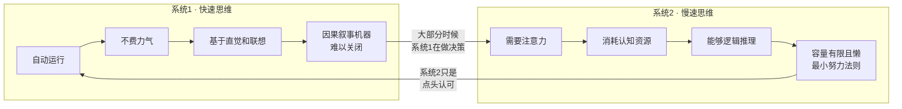

# 《思考，快与慢》深度读书笔记

> [!abstract] 全书速览
> 你的大脑里住着两个"自我"：一个反应迅速、凭直觉行事、永不疲倦但经常犯错；另一个缓慢理性、精于计算但懒得出奇。卡尼曼用数十年的实验研究揭示了这两个系统如何交替主导你的思维，以及它们的互动如何系统性地扭曲你的判断和决策。这本书不是教你如何思考得更快或更慢，而是让你看清思考本身的运作机制——看清之后，你才有可能少犯一些代价高昂的错误。

## 这本书揭示了什么

假设你走进一家超市，看到一瓶标价88元的红酒。你觉得贵不贵？你的答案很大程度上取决于你在走进超市之前看到了什么数字——哪怕那个数字和红酒毫无关系。

这不是魔术，这是你大脑的标准运行方式。丹尼尔·卡尼曼——这位以色列裔美国心理学家、诺贝尔经济学奖得主——花了将近半个世纪来研究这类看似荒谬却无处不在的认知偏差。他和已故的合作者阿莫斯·特沃斯基一起，从根本上改变了我们对人类理性的理解。

> [!note] 背景信息
> 在卡尼曼之前，经济学和决策科学的主流假设是"理性人"——这个假设是整个现代经济学的地基。卡尼曼和特沃斯基用一个又一个精巧的实验证明：人根本不是这样思考的。两人的合作始于1969年耶路撒冷希伯来大学的一间小办公室。特沃斯基思维锐利、论证严密，卡尼曼擅长捕捉直觉现象中的异常。特沃斯基1996年因癌症去世，卡尼曼在获奖演讲中说，这个奖应该属于他们两个人。这个发现催生了==行为经济学==这个全新的学科。

## 理论框架

卡尼曼用"系统1"和"系统2"这对隐喻来描述人类思维的两种运作模式。这是一个思维工具，不是对大脑物理结构的描述。

> [!tip] 核心洞察
> 关键在于"懒"这个字。系统2不是不能工作，而是能不工作就不工作（"最小努力法则"）。你犯错的根本机制是：系统1快速给出一个答案，系统2太懒（或太忙）而没有检查，于是一个有偏差的判断就这样通过了。==认知负荷会进一步削弱系统2==——当你疲劳、忙碌或心烦意乱时，更容易接受系统1给出的有偏差答案。

## 核心发现深度解读

### 发现一：锚定效应

卡尼曼和特沃斯基让受试者先转一个幸运转盘（操纵为停在10或65），然后估计联合国中非洲国家的比例。看到10的组平均估计25%，看到65的组平均估计45%。一个完全随机的数字，让判断产生了巨大差异。

这就是==锚定效应==。你的大脑在做数量估计时，会不自觉地从一个"锚"出发，然后做不充分的调整。

> [!example] 日常体现
> 德国法官在掷出操纵过的骰子后，掷出9的比掷出3的平均多判了近50%的刑期——受过专业训练的人在最擅长的任务上依然被锚定。商品的"原价"锚定了你对折扣价的感知——"原价599，现价299"让你觉得占便宜，但如果没见过那个599，你可能觉得299还是贵了。谈判中先出价的一方设定了锚；精明的中介会先带你看又贵又差的房子，让后面的都显得"性价比高"。

### 发现二：可得性启发

你觉得飞机和汽车哪个更危险？大多数人说飞机，但以每英里死亡率计算，飞机安全系数是汽车的几十倍。因为你的大脑用"想到例子的容易程度"替代了"实际发生的概率"。

卡尼曼和特沃斯基的实验显示，人们认为以K开头的英文单词比K在第三个位置的更多——但实际上后者约是前者的三倍，只是大脑搜索的难度不同。

> [!warning] 注意
> 在社交媒体时代，可得性偏差被算法进一步放大——暴力事件、极端言论、灾难新闻被优先推送，你的"可得性数据库"被严重扭曲。你的世界观不是基于统计事实，而是基于你最近刷到了什么。

### 发现三：框架效应

"手术存活率90%"和"手术死亡率10%"是完全相同的信息。但前者让你觉得可以接受，后者让你犹豫。==框架效应==揭示了同一问题的不同描述方式如何导致不同的决策。

卡尼曼和特沃斯基的"亚洲疾病问题"是经典实验：选项描述为"拯救200人"时72%选确定方案，描述为"400人将会死亡"时78%选冒险方案——完全相同的方案，偏好因描述方式而反转。政客用"遗产税"和"死亡税"触发不同情感反应；超市用"每人限购5件"暗示你应该多买。培养"翻转框架"的习惯，是对抗操纵的基本方法。

### 发现四：损失厌恶与前景理论

> [!tip] 核心洞察
> 人对损失的敏感度大约是对收益的两倍。你丢100块钱的痛苦，是捡到100块钱快乐的两倍。这就是==损失厌恶==，也是==前景理论==的核心——这个理论直接挑战了传统经济学中的期望效用理论，是卡尼曼获得诺贝尔奖的主要贡献。

前景理论三个核心洞见：
1. 人评估的是"变化"而非"终态"——同样拥有50万，从30万涨上来和从80万跌下来感受完全不同
2. 损失比同等收益更有分量
3. 面对收益时厌恶风险，面对损失时追求风险

衍生的"禀赋效应"：塞勒的实验中，随机分到马克杯的学生设定的卖出价是没分到学生出价的两倍——你拥有的东西仅仅因为"是你的"就变得更有价值。损失厌恶解释了：股民不肯卖亏损股票、人们维持糟糕的关系、改革难以推行（受损者的反对声量远大于受益者的支持声量）。

### 发现五：回归均值

以色列空军飞行教练发现：表扬后表现变差，批评后表现变好。结论：批评有效，表扬有害。

卡尼曼指出这完全错误——这只是==回归均值==。任何极端表现之后，下次都大概率回到平均水平。安慰剂效应之所以顽固，部分原因在于此——大多数人在症状最严重时去看医生，之后自然回归均值。"封面魔咒"也不是魔咒，而是统计的必然。

### 发现六：确定性效应

你对概率的心理感知是非线性的——小概率被高估（所以你买彩票），确定性被过度重视（所以你宁要确定的900元而不要90%概率的1000元）。同一个人同时买彩票和买保险看似矛盾，但在前景理论里完全合理：你不是风险偏好或风险厌恶，你是概率加权函数扭曲的。

### 发现七：经验自我与记忆自我

> [!example] 冰水实验与肠镜研究
> 冰水实验中，方案B（总痛苦更多但结尾稍好）反而被大多数人选择。肠镜研究也证实：患者的痛苦回忆几乎完全取决于过程中最痛的瞬间和结尾——持续时间被忽略了。一个8分钟的高度痛苦检查，在回忆中反而比24分钟但结尾温和的检查更痛苦。

你的==记忆自我==在乎"峰值"和"结尾"（峰终定律），不在乎持续时间。这揭示了一个深刻问题：你追求幸福的策略取决于你为谁服务。一个两周假期在经验上比一周好一倍，但在记忆中可能只好一点点——因为"高峰"和"结尾"差不多。这和[[《心流》 - 米哈里·契克森米哈赖]]所探讨的最优体验问题形成互补。

## 认知纠偏清单

1. **锚定检查**——做重要决策前，先独立形成自己的估计，再看参考数字。如果已被锚定，试着设一个反方向的"反锚"
2. **可得性检查**——当你觉得某事"经常发生"，问自己是不是刚看过相关生动报道。养成查数据的习惯
3. **框架翻转**——有意识地把信息框架反过来看。"存活率90%"换成"死亡率10%"再想一遍
4. **损失厌恶检查**——感到损失痛苦时问："如果我现在没有这个东西，我会花这么多钱/精力去得到它吗？"
5. **回归均值检查**——看到极端表现后的变化，先考虑"如果什么都没做，这个结果有没有可能自然发生？"
6. **系统2激活提醒**——重要决定前问自己：我现在是在"感觉"还是在"想"？

## 这本书的局限

> [!warning] 诚实评估
> - **复制危机影响**：启动效应等部分实验（如读到"老年"词汇后走路变慢）未能完全复制，卡尼曼本人承认"过于相信了一些未经充分检验的结果"。核心发现（锚定、损失厌恶、前景理论、框架效应）证据依然坚实
> - **隐喻而非科学描述**：系统1和系统2是有用的思维工具，但大脑中并没有两个物理独立的系统，实际认知过程是连续谱
> - **实验室与现实的差距**：大多实验使用小金额赌注和假设场景，高利害关系下偏差可能有所不同（有时加剧，因为情绪压力进一步削弱系统2）
> - **样本局限**：研究主要来自WEIRD样本（Western, Educated, Industrialized, Rich, Democratic），东亚文化中某些框架效应实验表现出不同模式
> - **偏差的"严重性"可能被夸大**：系统1的快捷方式在大部分情况下是有效的进化工具

## 行为改变指南

**创建"决策清单"：** 重要决策前逐项检查——锚定效应？可得性偏差？框架操纵？损失厌恶？回归均值误判？把清单打印出来贴桌上或存在手机备忘录里。

**用"局外人视角"做预测：** 先查"类似项目历史上花了多久"，再从自己的计划出发。卡尼曼自己的惨痛教训：团队估计两年写完教科书，实际花了八年。

**重大决策前设"冷静期"：** 给系统2时间来检查系统1的冲动判断。做完决定先睡一觉，第二天没变就执行。

**区分"经验"和"记忆"来规划生活：** 问自己是在为当下的体验优化，还是为将来的回忆优化。旅行时确保有几个"高峰时刻"和一个美好的结尾。

**培养"事前验尸"习惯：** 做重大决策前假想"一年后这个决定是灾难性的"，写下所有可能的失败原因。

## 延伸阅读

[[《影响力》 - 罗伯特·西奥迪尼]]从社会心理学角度探讨了人如何被说服和操纵——和卡尼曼的认知偏差研究形成互补，前者关注人际影响，后者关注内部认知。

理查德·塞勒的《"错误"的行为》讲述了行为经济学如何从实验室走向政策应用。纳西姆·塔勒布的《黑天鹅》从极端事件的角度延展了卡尼曼关于概率感知偏差的工作。
