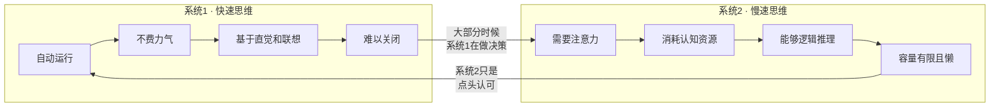

# 《思考，快与慢》深度读书笔记

> [!abstract] 全书速览
> 你的大脑里住着两个"自我"：一个反应迅速、凭直觉行事、永不疲倦但经常犯错；另一个缓慢理性、精于计算但懒得出奇。卡尼曼用数十年的实验研究揭示了这两个系统如何交替主导你的思维，以及它们的互动如何系统性地扭曲你的判断和决策。这本书不是教你如何思考得更快或更慢，而是让你看清思考本身的运作机制——看清之后，你才有可能少犯一些代价高昂的错误。

## 这本书揭示了什么

假设你走进一家超市，看到一瓶标价88元的红酒。你觉得贵不贵？你的答案很大程度上取决于你在走进超市之前看到了什么数字——哪怕那个数字和红酒毫无关系。

这不是魔术，这是你大脑的标准运行方式。丹尼尔·卡尼曼——这位以色列裔美国心理学家、诺贝尔经济学奖得主——花了将近半个世纪来研究这类看似荒谬却无处不在的认知偏差。他和已故的合作者阿莫斯·特沃斯基一起，从根本上改变了我们对人类理性的理解。

> [!note] 背景信息
> 在卡尼曼之前，经济学和决策科学的主流假设是"理性人"——人会收集所有相关信息，计算期望效用，然后做出最优选择。卡尼曼和特沃斯基用一个又一个精巧的实验证明：人根本不是这样思考的。这个发现催生了==行为经济学==这个全新的学科。

## 理论框架

卡尼曼用"系统1"和"系统2"这对隐喻来描述人类思维的两种运作模式。

> [!tip] 核心洞察
> 关键在于"懒"这个字。系统2不是不能工作，而是能不工作就不工作。你犯错的根本机制是：系统1快速给出一个答案，系统2太懒而没有检查，于是一个有偏差的判断就这样通过了。

## 核心发现深度解读

### 发现一：锚定效应

卡尼曼和特沃斯基让受试者先转一个幸运转盘（操纵为停在10或65），然后估计联合国中非洲国家的比例。看到10的组平均估计25%，看到65的组平均估计45%。一个完全随机的数字，让判断产生了巨大差异。

这就是==锚定效应==。你的大脑在做数量估计时，会不自觉地从一个"锚"出发，然后做不充分的调整。

> [!example] 日常体现
> 商品的"原价"锚定了你对折扣价的感知；谈判中先出价的一方设定了锚；房产中介带你看的第一套房子，锚定了你对后续所有房子的评估。研究表明，连法官的量刑也会受到锚定效应的影响。

### 发现二：可得性启发

你觉得飞机和汽车哪个更危险？大多数人说飞机，但统计上开车的死亡率远远更高。因为你的大脑用"想到例子的容易程度"替代了"实际发生的概率"。飞机失事是大新闻，容易回忆；车祸每天发生，但不吸引眼球。

> [!warning] 注意
> 可得性启发解释了为什么人们过度恐惧恐怖袭击而忽视心脏病，为什么人们对核电站事故的恐惧远大于燃煤污染——尽管后者造成的健康损害远大于前者。

### 发现三：框架效应

"手术存活率90%"和"手术死亡率10%"是完全相同的信息。但前者让你觉得可以接受，后者让你犹豫。==框架效应==揭示了同一问题的不同描述方式如何导致不同的决策。

卡尼曼和特沃斯基的"亚洲疾病问题"是经典实验：选项描述为"拯救200人"时，人们选确定方案；描述为"400人将会死亡"时，人们选冒险方案。面对收益厌恶风险，面对损失追求风险。

### 发现四：损失厌恶与前景理论

> [!tip] 核心洞察
> 人对损失的敏感度大约是对收益的两倍。你丢100块钱的痛苦，是捡到100块钱快乐的两倍。这就是==损失厌恶==，也是==前景理论==的核心——这个理论直接挑战了传统经济学中的期望效用理论，是卡尼曼获得诺贝尔奖的主要贡献。

前景理论三个核心洞见：
1. 人评估的是"变化"而非"终态"——你在乎赚了多少或亏了多少，而不是你现在有多少钱
2. 损失比同等收益更有分量
3. 面对收益时厌恶风险，面对损失时追求风险

损失厌恶解释了：股民不肯卖亏损股票（不卖就不算"真亏"）、人们维持糟糕的关系（分手是"损失"）、谈判中"你将失去"比"你将获得"更有说服力。

### 发现五：回归均值

以色列空军飞行教练发现：表扬后表现变差，批评后表现变好。结论：批评有效，表扬有害。

卡尼曼指出这完全错误——这只是==回归均值==。任何极端表现之后，下次都大概率回到平均水平。你的大脑天生是因果推理机器，看到前后发生的事就假设因果关系，但很多"改善"只是统计上的自然回归。

### 发现六：确定性效应

你对概率的心理感知是非线性的——小概率被高估（所以你买彩票），确定性被过度重视（所以你宁要确定的900元而不要90%概率的1000元），中等概率被低估。这种扭曲的概率加权是前景理论的关键组成部分。

### 发现七：经验自我与记忆自我

> [!example] 冰水实验
> 方案A：60秒14度冰水。方案B：60秒14度冰水+30秒15度冰水（结尾稍好但总痛苦更多）。受试者选择再来一次时，大多数人选B。你的==记忆自我==在乎"峰值"和"结尾"（峰终定律），不在乎持续时间。

这揭示了一个深刻问题：你追求幸福的策略取决于你为谁服务。为经验自我服务，最大化每刻体验；为记忆自我服务，制造高峰和好结尾。两者的最优策略往往不同。

## 认知纠偏清单

1. 做重要决策前，检查有没有"锚"在影响你的判断
2. 当你觉得某事"经常发生"，区分"容易想到"和"经常发生"
3. 有意识地把信息框架翻转——"存活率90%"换成"死亡率10%"再想一遍
4. 感到损失痛苦时问自己：如果是"从未拥有"而非"失去"，我还会同样痛苦吗？
5. 看到极端表现后的变化，先考虑回归均值的可能性

## 这本书的局限

> [!warning] 诚实评估
> - **复制危机影响**：启动效应等部分实验未能完全复制，卡尼曼本人承认"过于相信了一些未经充分检验的结果"。核心发现（锚定、损失厌恶、前景理论、框架效应）证据依然坚实
> - **隐喻而非科学描述**：系统1和系统2是有用的思维工具，但大脑中并没有两个物理独立的系统
> - **实验室与现实的差距**：大多实验使用小金额赌注和假设场景，高利害关系下偏差可能有所不同
> - **样本局限**：研究主要来自西方受教育群体，不同文化中偏差程度和表现可能有差异

## 行为改变指南

**创建"决策清单"：** 重要决策前逐项检查——锚定效应？可得性偏差？框架操纵？损失厌恶？这不消除偏差，但能激活系统2。

**用"局外人视角"做预测：** 先查"类似项目历史上花了多久"，再从自己的计划出发。

**重大决策前设"冷静期"：** 给系统2时间来检查系统1的冲动判断。

**区分"经验"和"记忆"来规划生活：** 问自己是在为当下的体验优化，还是为将来的回忆优化。

## 延伸阅读

[[《影响力》 - 罗伯特·西奥迪尼]]从社会心理学角度探讨了人如何被说服和操纵——和卡尼曼的认知偏差研究形成互补，前者关注人际影响，后者关注内部认知。

理查德·塞勒的《"错误"的行为》讲述了行为经济学如何从实验室走向政策应用。纳西姆·塔勒布的《黑天鹅》从极端事件的角度延展了卡尼曼关于概率感知偏差的工作。
