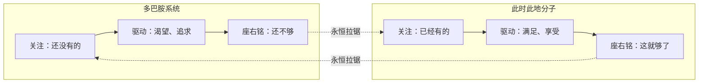

# 《贪婪的多巴胺》深度读书笔记

> [!abstract] 全书速览
> 你的大脑里有一种化学物质，它不负责让你享受此刻拥有的东西，而专门负责让你渴望还没有得到的东西。这种化学物质叫==多巴胺==。利伯曼揭示了一个深刻的悖论：驱动你追求更多的力量和让你感到满足的力量，来自大脑中两套完全不同的化学系统。理解这个悖论，你就理解了为什么人类能把火箭送上月球，却无法在沙发上安心地享受一杯茶。

## 这本书揭示了什么

你有没有经历过这样的时刻：你拼命想要一样东西——一个新手机、一份梦想工作、一段恋爱关系——得到之后，那种兴奋感却迅速消退？你可能会责怪自己"不知足"，但利伯曼告诉你，这不是你的性格缺陷，这是你大脑的出厂设置。

> [!note] 作者背景
> 丹尼尔·利伯曼是乔治·华盛顿大学的精神病学教授，长期研究成瘾行为和多巴胺系统。他和作家迈克尔·朗合著的这本书（英文原名"The Molecule of More"）于2018年出版，用多巴胺这条线索串起了爱情、成瘾、创造力、政治倾向和文明走向等看似无关的现象。

## 理论框架

利伯曼的核心框架：你的大脑可以被理解为两套系统在对话。

==多巴胺==不是"快乐分子"（这是流行的误解），它是"渴望分子"。==此时此地分子==（血清素、催产素、内啡肽）才负责让你享受当下。人类的伟大和痛苦，都来自这两套系统的永恒拉锯。

## 核心发现深度解读

### 发现一：多巴胺是"渴望分子"

> [!tip] 关键实验
> 沃尔弗拉姆·舒尔茨的猴子实验发现：多巴胺不在获得奖励时放电，而在==预测到奖励即将到来时==放电。如果预测到的奖励没出现，多巴胺活动急剧下降到基线以下。多巴胺回应的是"预期"和"惊喜"，不是"满足"。

你打开外卖APP浏览菜单时的兴奋感，可能比你吃到食物时的愉悦感更强烈。"期待一件事"总是比"得到这件事"更让人兴奋——不是你贪心，是多巴胺天生对"新"和"意外"有反应，对"已有"和"确定"失去兴趣。

### 发现二：恋爱中的多巴胺陷阱

恋爱初期的强烈兴奋是多巴胺对"新奇""未知""还没完全得到"的疯狂反应。随着对方变得熟悉，多巴胺回落。这不是爱情死了，而是化学基础发生了转变——从多巴胺驱动的"激情之爱"转向催产素和血清素驱动的"陪伴之爱"。

> [!warning] 注意
> 很多人把多巴胺驱动的激情当成爱情的全部，激情消退就去找新对象重新点燃多巴胺。长久关系需要你有意识地完成这个化学转变。这和[[《动机与人格》 - 亚伯拉罕·马斯洛]]中"匮乏之爱"向"存在之爱"的转变有深层呼应。

### 发现三：成瘾的恶性循环

成瘾性物质绕过正常反馈回路，制造巨量多巴胺。大脑降低受体敏感度自保，导致耐受性增加、日常快乐消失、最终使用物质不是为了快乐而是为了逃避痛苦。

利伯曼将此延伸到行为成瘾——刷社交媒体、网购、赌博利用的是同样的==间歇性奖励==机制。你打开手机查看通知时的期待和赌徒拉老虎机的期待，在多巴胺层面的机制相通。

### 发现四：创造力与疯狂的共享通路

> [!note] 两种多巴胺回路
> **欲望回路**（中脑边缘通路）：驱动追求具体奖励
> **控制回路**（中脑皮质通路）：抽象思考、长期规划、延迟满足

创造力需要控制回路高度活跃——在"可能性空间"中自由探索。但过度活跃可能导致联想过度松散、偏执、脱离现实。这解释了天才创作者与精神疾病的统计关联——梵高、伍尔夫、尼采的天才和痛苦可能源于同一条通路的异常活跃。

### 发现五：多巴胺与政治倾向

多巴胺偏向的人更关注未来和可能性，与自由主义吻合；此时此地分子偏向的人更珍视传统和稳定，与保守主义吻合。

> [!warning] 需要谨慎
> 政治倾向极其复杂，受文化、教育、经济等多因素影响，不可能简化为一种神经递质的作用。多巴胺基因变体与政治倾向的统计关联很弱。

### 发现六：现代社会的多巴胺危机

人类文明的进步——农业、科学、互联网——都是多巴胺驱动的"还不够"的产物。但同样的力量也带来了环境破坏、消费主义、社交媒体成瘾和存在性空虚。出路是在多巴胺的驱动力和此时此地分子的满足感之间找到平衡。

## 认知纠偏清单

1. 得到渴望之物后兴奋消退，不是你不知足，是多巴胺的设计特性
2. 不停刷手机、购物、换目标时，问自己：我在回应真实需求还是在喂养多巴胺？
3. 恋爱激情消退不等于爱情死亡——可能只是化学基础在转变
4. "永远追逐下一个目标"看似励志，也可能是多巴胺的奴役

## 这本书的局限

> [!warning] 诚实评估
> - **过度简化**："多巴胺系统vs此时此地分子系统"是有力隐喻但在神经科学上严重失真——多巴胺有多条通路和多种功能
> - **推导跨度过大**：从神经化学到政治和文明的推导，一种神经递质不可能解释如此多样的人类行为
> - **引用选择性**：倾向于选取支持叙事的研究，对反面证据和学术争议着墨不多

## 行为改变指南

**做"多巴胺审计"：** 列出一天中让你"兴奋渴望"的活动和让你"满足安宁"的活动，检查比例。

**每天安排30分钟"此时此地"时间：** 不刷手机，不思考目标，沉浸在当下感官体验中。

**在关系中从"渴望"转向"珍视"：** 主动建设以身体接触、共处时光、深度对话为基础的陪伴之爱。

**识别你的"多巴胺陷阱"：** 每个人都有特定触发器，识别它不是为了消灭它，而是为了在它控制你之前先看见它。

## 延伸阅读

[[《心流》 - 米哈里·契克森米哈赖]]描述了多巴胺"渴望"和此时此地分子"满足"达到平衡时的最优体验——心流可能就是两套系统最和谐的时刻。

[[《思考，快与慢》 - 丹尼尔·卡尼曼]]和这本书互补：卡尼曼揭示你"怎么"想错的，利伯曼揭示你"为什么"想要你想要的东西。

安娜·伦布克的《多巴胺国度》从成瘾精神科医生视角深入探讨现代社会中多巴胺系统被过度刺激的问题。
