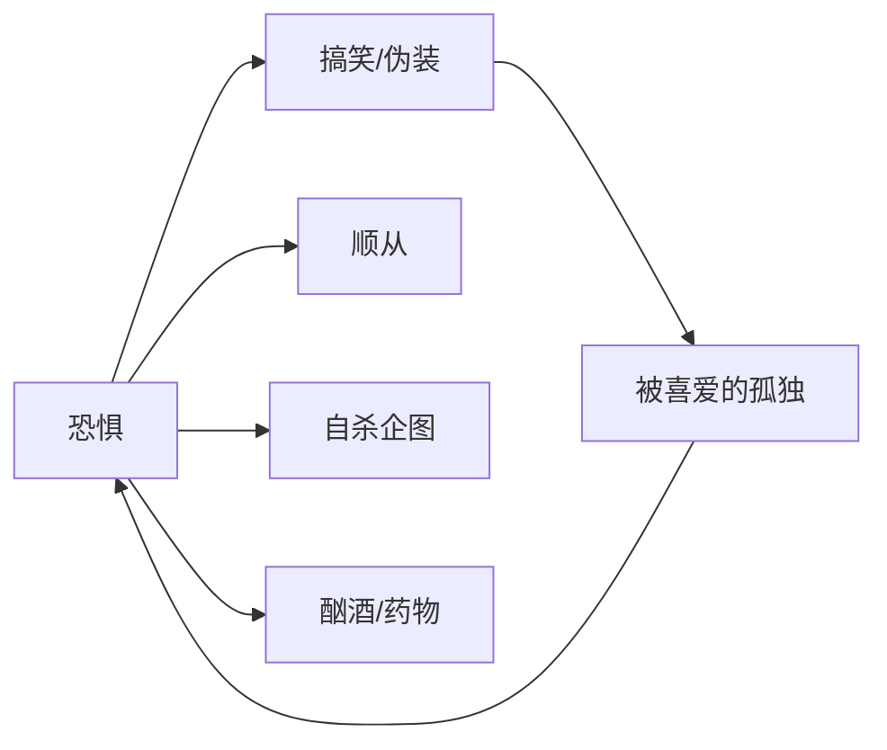
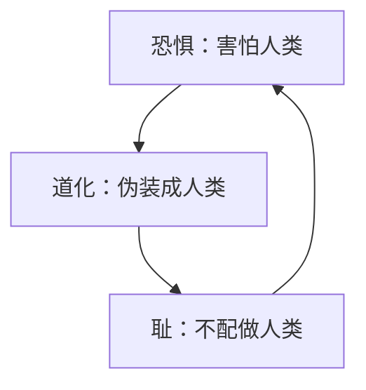
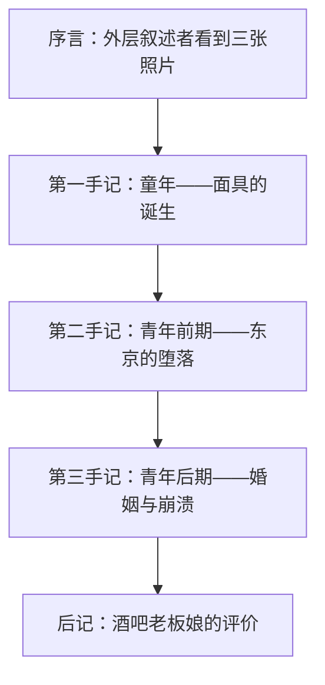

# 《人间失格》深度读书笔记

> [!abstract] 全书速览
> 这是一本关于==无法成为"正常人"==的书。太宰治以近乎自传的笔法，讲述了主人公大庭叶藏从童年到青年的精神崩解历程：一个极度敏感的灵魂，因无法理解人类社会的运作规则，选择以"搞笑"作为伪装面具与世界周旋，最终在酗酒、药物成瘾、自杀未遂的连环坠落中，彻底丧失了"作为人活着"的资格。这不是一个励志故事的反面，而是对人类孤独处境最极端、最诚实的凝视。它不给你答案，不给你安慰，甚至不给你希望——它只是把一个人无法成为人的全部过程，毫无保留地摊开在你面前。读完它，你不会获得任何解决方案，但你可能会在黑暗中发现一双与你对视的眼睛。

---

## 时代与作者

太宰治（1909-1948）出生于青森县津轻的大地主家庭，是日本战后"无赖派"文学的代表人物。他的一生像一出预告了结局的悲剧——五次自杀未遂，终于在发表《人间失格》的同年，与情人山崎富荣在玉川上水投水身亡。

理解太宰治，需要理解两个背景：

**家庭与身份的撕裂**。太宰治出身豪门，却从小感到与家族格格不入。他的敏感和内向在一个注重体面、等级分明的大家族中显得异类。家中兄弟众多，父亲长期忙于政治，母亲体弱，他由乳母和保姆带大。这种"在家庭中缺席的在场"，让他很早就体会到了一种隐秘的不安：明明属于这里，却从不觉得自己是这里的人。这种"不属于自己所属之处"的疏离感，成为他一生的精神底色。

**战后日本的虚无**。二战结束后，日本社会的旧秩序崩塌，新秩序尚未建立。天皇从神坛跌落，军国主义的道德体系一夜瓦解，整个社会陷入价值真空。无赖派作家以颓废、放浪的姿态对抗战后社会的虚伪道德。但太宰治的"无赖"不同于波西米亚式的浪漫叛逆——他不是在反抗社会，他是在被社会的"人类性"本身碾碎。其他无赖派作家的颓废中尚有一份洒脱，太宰治的颓废背后却是深入骨髓的恐惧。

《人间失格》于1948年发表，是太宰治的遗作，也是他最后的自白。书中的大庭叶藏几乎就是太宰治的文学分身——同样的富裕家庭出身、同样的社会疏离感、同样的女性关系纠葛、同样的药物依赖。但这不是简单的自传：太宰治做了精密的文学加工，将个人痛苦升华为一种关于"人之为人"的根本性追问。他把自己的伤口变成了一面镜子，让每一个在人群中感到格格不入的人，都能在其中看到自己的倒影。

---

## 故事的核心张力

> [!abstract] 核心冲突
> 《人间失格》的底层张力是：**一个无法理解人类的人，如何在人类社会中生存？**

这不是一个关于"社恐"或"内向"的故事——那些太轻了。叶藏面对的是一种==存在论层面的异质感==：他不理解人类为什么要吃饭（他看到家人围坐吃饭，觉得那是一种"仪式"，却不明白意义何在），不理解人类为什么要说那些明显是假话的寒暄，不理解人类社会的基本运作逻辑。对于一个正常的孩子来说，这些不需要理解，它们是本能。但叶藏连人类最基本的生理驱动都无法共情——这意味着他与人类之间的隔阂不是文化的、社会的，而是生物性的、存在论的。

你可以把叶藏想象成一个被扔进人类世界的外星人。他观察人类的行为模式，模仿他们的表情和动作，学习他们的语言和规则——但他从未真正"理解"过这一切的意义。普通人不需要理解吃饭的意义就能感到饿，不需要理解寒暄的意义就能自然地打招呼。叶藏做不到。他的每一个"正常"行为都是刻意模仿的结果，而这种持续的模仿带来的疲惫是致命的。

由此产生了叶藏一生的核心策略：==伪装==。他发现，如果让别人笑，就能获得善意；获得善意就意味着安全。于是他系统性地将自己打造成一个"小丑"：故意在体操课上做出笨拙的动作、故意写搞笑的作文、故意说引人发笑的话。但这个策略有一个致命的悖论——你越是成功地扮演了另一个人，你就越是失去了自己。叶藏的面具太成功了，所有人都认为他是一个快乐、有趣的人，没有人察觉到他的痛苦。他越是成功地隐藏自己，就越是孤独——因为被喜爱的不是他，是他的面具。

这种==被喜爱的孤独==，比不被喜爱更加致命。一个不被喜爱的人至少还保有"真实的自己"，而叶藏连这最后的退路都没有。

---

## 人物命运

### 大庭叶藏：在"人"的边界之外

叶藏是日本文学中最复杂的"反英雄"之一。他不是一个"坏人"，也不是一个"好人"——他是一个在"人"这个范畴之外挣扎的存在。

> [!note] 叶藏的核心特质
> **极端敏感性**：他能察觉到他人话语背后的真实意图、社交礼仪背后的空洞、道德说教背后的虚伪。但这种敏感性不是优势，而是诅咒——因为他看到了太多，却无力处理看到的东西。他就像一个没有音量调节功能的收音机，所有的信号都以最大音量涌入，直到把他的精神世界震碎。
>
> **极端被动性**：他几乎从不主动做任何事——被女人收留、被朋友带着走、被命运推着坠落。他唯一主动的行为是自杀，而自杀也未能成功。这种极端的被动性不是"懒惰"，而是一种存在论层面的无力感：一个不理解人类游戏规则的人，怎么可能在游戏中采取主动？

叶藏的一生呈现为一条清晰的坠落曲线。童年时期，他发现了"搞笑"这个生存策略，获得了暂时的安全感。到了东京之后，这个策略逐渐失效——在更复杂的成人世界里，搞笑不再足以应付一切。他开始依赖酒精和女人来填补内心的空洞，参加左翼运动寻找某种归属感（但仍然是被动地被拉入），最终与一个酒吧女招待殉情未遂。到了第三手记，叶藏遇到了良子、经历了信任的崩塌、沉溺于药物，最终被送进精神病院。

叶藏与加缪笔下的默尔索形成了有趣的对比。默尔索的疏离是冷漠的、无动于衷的——他不在乎。叶藏的疏离是痛苦的、充满渴望的——他极度在乎，但他无法在乎。默尔索是太阳下冷酷的旁观者，叶藏是黑暗中颤抖的溺水者。如果说默尔索是因为"不需要"世界而被世界驱逐，叶藏则是因为"不理解"世界而将自己驱逐。

叶藏最后的自白令人心碎："我今年二十七岁，头发几乎白了一半，大多数人都以为我四十岁以上。"一个人可以在二十七岁就耗尽全部的生命力——不是因为苦难太多，而是因为伪装太累。

### 良子：被玷污的信赖

良子是叶藏的妻子，全书中最令人心碎的角色。她被描述为拥有"信赖天才"的女性——对一切人和事都持有一种近乎天真的无条件信任。叶藏被这种信任所吸引，因为在一个充满欺骗和伪装的世界里，良子是唯一不需要他戴面具的人。

良子的存在对叶藏而言是一种奇迹般的安慰。她不像其他女性那样需要叶藏表演什么，她的信任是无条件的、不需要回报的。叶藏第一次感到某种接近"正常生活"的可能性。

但良子遭到商人侵犯的事件摧毁了一切。叶藏目睹了这一切，他的反应不是保护良子或惩罚加害者，而是对"信赖"这个概念本身的崩溃——如果信任会被利用、纯真会被玷污，那么这个世界的最后一点光也熄灭了。

> [!warning] 关键解读
> 太宰治写良子事件的笔法极为残酷：他不是在写一个女性被侵犯的悲剧，而是在写"信任"这个人类基本能力被摧毁的悲剧。叶藏失去的不是妻子的贞操，而是他与人类世界之间最后一条连接线。更深一层地说，叶藏对良子的"信赖天才"的迷恋，本身就带有一种不自觉的利用——他需要良子的纯真来证明世界还有不需要伪装的角落。当这个证明被摧毁时，叶藏的精神世界也随之坍塌。

### 堀木：平庸的镜子

堀木是叶藏在东京的朋友，一个平庸的画家。他具有叶藏所缺乏的东西——在人类社会中自如行走的能力。当两人讨论"罪的反义词"时，堀木说是"法律"，暴露了他的精神平庸——他只能在社会规范的层面理解道德问题。但正是这种平庸，使他能够安然无恙地活着。

太宰治借此暗示：=="正常"可能只是"平庸"的另一个名字==。堀木活得不痛苦，但他也活得不深。叶藏活得极其痛苦，却看到了人类存在的某些深层真相。这个对比不是在美化痛苦，而是在追问：在这个世界上活得安稳，是否总是需要某种精神上的钝感？

### 女性群像：被依附的拯救者

叶藏生命中的女性——常子、静子、良子——形成一条特殊的线索。她们都在不同程度上"收留"了叶藏，为他提供物质和情感的庇护。叶藏对女性的依赖不是出于爱或欲望，而是出于一种更原始的需求：在女性身边，他的伪装可以稍微松懈。

> [!note] 女性角色的双重功能
> 太宰治笔下的女性同时承担着两个功能：她们是叶藏的避难所，也是他坠落的台阶。每一次被女性收留都带来短暂的安宁，但每一段关系最终都以更深的堕落告终。这不是在指控女性，而是在展示叶藏的悲剧模式：一个无法自立的人，注定会将每一个支撑他的人拖入深渊。

---

## 主题深层解读

### 恐惧：对人类的根本性恐惧

全书的情感基调是**恐惧**——不是对某个具体威胁的恐惧，而是对"人类"这个物种本身的恐惧。

第一手记的开篇是日本文学中最著名的段落之一：

> "我过的是一种充满耻辱的生活。我甚至认为，我不了解人的生活。"

这句话的力量在于它的绝对性——不是"我不太理解人"，而是"我完全不了解人的生活"。这不是程度问题，这是本质问题。

恐惧在本书中是一切行为的原动力：

叶藏的搞笑是因为恐惧（害怕被发现自己的异质性），他的顺从是因为恐惧（害怕与人冲突），他的自杀是因为恐惧（害怕继续在人类世界中伪装），他的酗酒和药物成瘾是因为恐惧（需要麻醉才能暂时消除恐惧感）。恐惧是叶藏精神世界的万有引力。

但太宰治的高明之处在于：他没有让叶藏的恐惧显得矫情。叶藏恐惧的不是某个人或某件事，而是他在人类世界中感受到的那种根本性的"不对劲"——就像一个左撇子被强迫用右手写字，那种别扭不是任何具体的痛苦，而是一种弥漫在每个瞬间的不适感。只不过叶藏的"别扭"不是左手右手的问题，而是"整个存在"的问题。

### 道化：面具作为生存策略

> [!tip] "道化"的含义
> "道化"在日语中意为"扮演小丑"。叶藏选择搞笑作为应对世界的方式，是一种精妙的伪装——它同时满足两个需求：隐藏真实的自我，以及获得他人的接纳。一个总是让别人笑的人，不会被追问内心。

叶藏发现"搞笑"策略的过程被写得极为精确。他注意到，当他故意做出滑稽的动作时，周围的人会笑——而笑意味着善意，善意意味着安全。他从小就在磨练这项技能：在体操课上故意做出滑稽的翻滚，在作文中写令人捧腹的段落，在家人面前扮演令人发笑的角色。

但这个策略有致命的代价：久而久之，叶藏甚至不知道面具下面还有没有一张真实的脸。他的面具与普通人的社交面具有本质区别——普通人的社交面具是半透明的，面具下面的真实面孔隐约可见，而且他们自己知道什么时候戴着面具、什么时候摘下面具。叶藏的面具则是不透明的，而且他已经无法区分面具和面孔。他的面具不是一种选择，而是一种强迫性的生存本能。

道化策略还有一个更隐蔽的毒性：它让叶藏对"真实"本身产生了恐惧。他害怕被人看穿——不是害怕别人看到他的缺点，而是害怕别人看到他"不是人类"的真相。这意味着，即使有人真心想靠近叶藏，他也会本能地退缩，因为靠近意味着被看穿的风险增加。==道化不仅是一种伪装，它已经变成了一座囚禁叶藏的监狱。==

### 耻：存在性的羞耻

日本文化本身就是一种"耻文化"（鲁思·本尼迪克特在[[《菊与刀》]]中的经典概括），而太宰治将这种文化中的羞耻感推到了极致——叶藏不是为了某个具体的错误感到羞耻，他是==为了自己的存在本身感到羞耻==。

"人间失格"的字面意思是"丧失作为人间的一员的资格"。这意味着叶藏的羞耻指向的是一个根本性的判决：他不配做人。这个判决的施加者不是某个具体的权威——父亲、社会、法律——而是叶藏自己。他给自己判了"不是人"的罪。

恐惧、道化与耻构成了叶藏精神世界的三角结构：

三者互相强化，形成一个无法逃脱的闭环。恐惧驱动伪装，伪装的失败（或者说伪装的成功本身就是一种失败，因为它确认了"真实的自己不被接纳"）带来羞耻，羞耻又进一步加深恐惧。这个闭环没有外力介入几乎不可能打破——而叶藏的悲剧恰恰在于，没有任何外力成功介入过。

### 罪与罚：没有救赎的陀思妥耶夫斯基

叶藏与朋友堀木有一场关于"罪的反义词"的对话，这是全书最具哲学密度的段落之一。

- **如果罪的反义词是"法律"**——那罪是一个社会概念，被法律禁止的就是罪。但叶藏的"罪"不在法律范畴内：他的罪是伪装、是不真实、是对人类的恐惧。没有任何法律能审判这种"罪"。

- **如果罪的反义词是"罚"**——那意味着罪和罚是平行的、可以互相抵消的。你犯了罪，受了罚，两清了。但叶藏的处境是：他的存在本身就是罪，而他的痛苦就是罚——两者无法分离。他不是先犯罪后受罚，而是犯罪和受罚同时发生、始终发生。

- **如果罪的反义词是"神"**——那意味着只有超越人类的力量才能真正化解罪，也意味着在人类的层面上，罪是不可化解的。

这将本书与陀思妥耶夫斯基的文学世界连接起来。但差异是根本性的：陀氏笔下的拉斯柯尔尼科夫犯了一个具体的罪（杀人），然后通过痛苦走向救赎。叶藏的"罪"没有具体的内容，他的痛苦也不指向任何救赎。==太宰治写了一个没有救赎出口的陀思妥耶夫斯基世界==。在陀思妥耶夫斯基那里，苦难是通向上帝的阶梯；在太宰治这里，苦难只是苦难本身，它不通向任何地方。

### 人间失格：最终的判词

"人间失格"是全书所有主题的汇聚点：

> 恐惧（无法理解人类）+ 道化（无法真实地做人）+ 耻（不配做人）= 人间失格（不再是人）

叶藏最终被送进精神病院。出院后住在乡下的破旧房子里，由一个不漂亮的老女佣照顾。他的坠落不像余华笔下的福贵——福贵失去一切之后依然可以"活着"。叶藏失去的不是外在的东西（财产、亲人、地位），而是内在的某种根本性的东西：==与人类世界产生连接的能力==。这种丧失是不可修复的。

但后记中酒吧老板娘的那句话——"像神一样的好孩子"——为这个黑暗的故事打开了一条缝隙。叶藏自认为是"怪物"，但在他人眼中，他却是一个善良温柔的人。这意味着什么？也许意味着：==叶藏对自己的判决，未必就是最终的真相==。他的"人间失格"可能不是客观事实，而是一个过度敏感的灵魂对自身的过度审判。这个可能性让这本书在绝望之中保留了一丝微弱的光——不是希望，但至少是一个问号。

---

## 文学手法

### 三重嵌套的叙事框架

小说由"序言""三札手记""后记"构成，形成一个精密的叙事装置：

这一结构设计至少有四重功能：

1. **客观化的距离**：太宰治没有让叶藏直接对读者讲述，而是插入了一个"发现手记"的外层叙述者。这个装置制造了考古学式的冷静——你不是在听一个人倾诉，你是在阅读一份被发现的精神档案。这种距离感让读者可以在同情叶藏的同时保持观察者的冷静，避免被叶藏的自我叙述完全吞噬。

2. **照片的锚定**：序言中对三张照片的描述（幼年的诡异笑容、青年的美丽却空洞的面容、近乎老人般的疲惫面容）预先建立了叶藏的视觉形象，同时也预设了全书的坠落弧线——你还没读手记，就已经看到了这个人的命运轨迹。

3. **不可靠叙述的暗示**：后记中酒吧老板娘说叶藏"像神一样的好孩子"，这与叶藏自我认知中的"怪物"形成惊人的裂缝。太宰治借此暗示：叶藏对自己的判断可能并不准确。整本书都是叶藏的自我叙述，但这个叙述者是否可信？后记留下的这个疑问，让全书的意义变得更加丰富和暧昧。

4. **递进的坠落曲线**：三本手记不是流水账，而是精心设计的精神坠落曲线——第一手记（恐惧的发现与面具的诞生）、第二手记（伪装的消耗与堕落的加速）、第三手记（最后的希望与彻底的崩溃）。每一札手记都比前一札更沉重、更绝望。

### 语言风格

太宰治的语言呈现一种独特的矛盾：既是极度自恋的（充斥着自我剖析），又是极度自毁的（每一次自我剖析都是一刀）。

> [!tip] 语言的核心张力
> 他的语言策略是：**用最轻盈的语调讲最沉重的内容**。叶藏描述自己最痛苦的经历时，往往使用近乎漫不经心的语气——仿佛在说别人的事。这种语气与内容之间的反差制造了令人不安的效果：你不确定叶藏是真的无所谓，还是痛苦到已经说不出痛苦了。

另一个特征是频繁的自我否定。叶藏的叙述中充满了"也许""大概""我不确定"这样的限定词，仿佛他连自己的感受都不敢确认。这是一种深层的自我不信任——一个不确定自己是不是人的人，怎么可能确定自己的任何感受是真实的？

还有一点值得注意：太宰治的文字有一种奇特的"亲密感"。尽管叶藏在叙述中不断自我贬低，但他的语调却像是在深夜对一个最亲密的朋友低声倾诉。这种矛盾——内容上的自我否定与语调上的亲密信任——恰好复制了叶藏的核心困境：他渴望被理解，却认为自己不值得被理解。

### 象征系统

太宰治在书中构建了几组重要的象征：

**三张照片**：代表叶藏精神坠落的三个阶段，也是全书的视觉索引。幼年照片上的"诡异笑容"预示了道化策略的萌芽；青年照片的"美丽却空洞"暗示了伪装的完美与内在的虚无；晚年照片的"疲惫"则是伪装耗尽后的残骸。

**酒与药物**：不仅是叶藏的逃避工具，更是他与"人类世界"唯一能建立的连接方式。清醒时无法做人，酒醉时才能暂时"像个人一样"与他人交流。这个讽刺性的细节揭示了叶藏困境的深度：他需要失去理智才能获得"正常"。

**精神病院**：是全书最具讽刺性的场所。叶藏被送进去意味着社会正式宣判他"不正常"——但对叶藏来说，他一生都在假装正常，精神病院反而是第一个不需要假装的地方。

---

## 为什么今天还要读这本书

《人间失格》之所以在出版七十多年后仍然拥有大量读者，在于它触及了一种跨时代、跨文化的普遍人类体验：==觉得自己与世界格格不入==。

在社交媒体时代，叶藏的困境获得了新的共鸣。每个人都在社交平台上维持着精心策划的"人设"——快乐的、成功的、有趣的。这本质上就是一种数字时代的"道化"。而那些在深夜放下手机、面对空荡荡的天花板时感到的空虚和疲惫，与叶藏摘下面具后的感受并无不同。

如果你在阅读中感到共鸣，那值得认真对待——不是对号入座地认同叶藏，而是追问：**你的哪些面具是必要的社交工具，哪些已经变成了无法摘下的枷锁？** 你在人群中的疲惫，是来自正常的社交消耗，还是来自某种更深层的不安？

但需要警惕的是：《人间失格》不应被简单地用作"我很特别所以我很痛苦"的自我安慰。叶藏的痛苦不是一种美学姿态，而是一种真实的精神灾难。太宰治不是在歌颂痛苦，他是在记录痛苦。

这本书最特殊的价值在于：它不提供任何解决方案。它不告诉你"如何好起来"，它只是诚实地展示了一个人"好不起来"的全部过程。在一个充斥着正能量和成功学的时代，这种残酷的诚实本身就是一种珍贵的礼物。它让你知道：在这个世界上，有人和你一样感到格格不入，而这种感受不需要被"治愈"——它首先需要被看见。

---

## 延伸阅读

- [[《斜阳》]]（太宰治）：从女性视角讲述贵族家庭的衰落，与《人间失格》形成互补。如果说《人间失格》是叶藏的独白，《斜阳》则提供了一个更广阔的社会图景，让你看到太宰治对"衰亡"这个主题的另一种书写方式。

- [[《地下室手记》]]（陀思妥耶夫斯基）：与《人间失格》形成跨文化对话。"地下人"的社会疏离感、自我厌恶和对人类的恐惧，与叶藏高度共鸣。但两者的差异也值得玩味：地下人更具攻击性——他的疏离带有愤怒和报复，叶藏更具自毁性——他的疏离只指向自己。

- [[《局外人》]]（加缪）：默尔索的冷漠与叶藏的痛苦形成鲜明对照。两本书都在讨论"与世界格格不入"，但给出了截然不同的情感色调。默尔索对世界的态度是"无所谓"，叶藏对世界的态度是"无法承受"。将两本书对照阅读，你会更清楚地看到"疏离"这枚硬币的两面。
