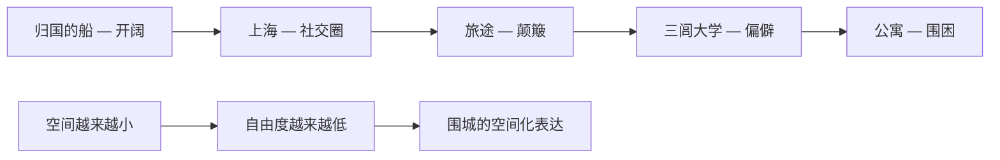
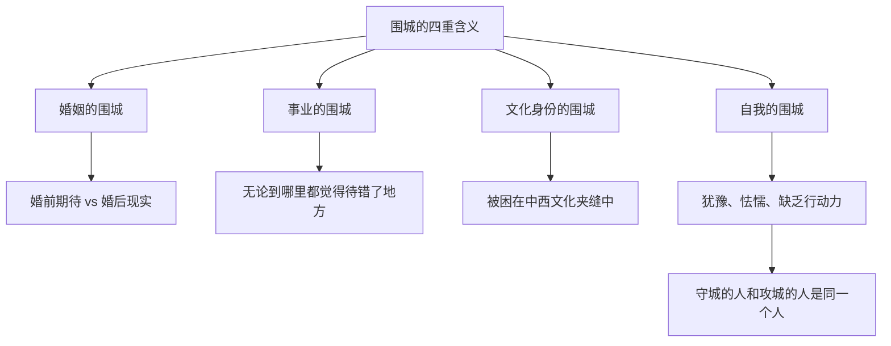

# 《围城》深度读书笔记

> [!abstract] 全书速览
> 一个拿着假文凭的留学生回到中国，在情场、职场和婚姻中辗转沉浮，最终发现自己无处可去。钱钟书用最机智的语言写最平庸的人生，用最尖刻的眼光看最普遍的困境。《围城》不是一部让你痛哭或震撼的小说，它是一部让你笑完之后忽然安静下来的小说——因为你发现自己就在那座城里。"城外的人想冲进去，城里的人想逃出来"不只是婚姻的隐喻，它是人如何被自己的期待反复围困的写照。这本书最残忍的地方在于：==它不给你一个敌人，不给你一场灾难，甚至不给你一个明确的悲剧——它只是让你看着一个不够好也不够坏的人，在一个不够好也不够坏的世界里，慢慢地、不可逆转地滑向平庸。==

## 时代与作者

1944年，日军占领下的上海。整个中国在战火中挣扎，所有的文学都被期待服务于抗战主题。但钱钟书在这个时候开始写一部和抗战几乎无关的小说。

这个选择本身就是一种态度。

> [!note] 从内部解剖知识分子
> 钱钟书是20世纪中国最渊博的学者之一，1910年出生于无锡书香世家，清华毕业后赴牛津留学，精通英、法、德、意、拉丁等多种语言。他去过牛津、巴黎，见识过中西方学术界的种种虚荣；在多所大学任教，亲历过教授们的倾轧和空谈。==《围城》的讽刺之所以精准，是因为他不是从外部嘲讽知识分子，而是从内部解剖自己的同类——甚至可能包括他自己。==杨绛回忆说，钱钟书写这本书时常常边写边笑——那种笑，既是嘲讽，也是无奈。

他的学术巨著《管锥编》《谈艺录》以中西文化互通为特色，是真正的"打通"式学问。而《围城》是他唯一的长篇小说——他后来再也没有写过。

抗战只是小说遥远的背景——远处的隆隆炮声、偶尔提及的沦陷区、旅途中的不便。钱钟书刻意将战争推到幕后，让前景完全留给这群知识分子的日常生活。他要写的是那些==不因战争而起、也不因和平而灭的人性困境==。当时代要求你把一切归结为民族危亡时，钱钟书说：不，人性本身的围城比任何战争都更持久，也更难攻破。

在中国文学脉络中，《围城》是一部极其独特的存在。它不是鲁迅式的启蒙呐喊，不是茅盾式的社会写实，不是沈从文式的田园牧歌，也不是张爱玲式的苍凉传奇。它最接近的西方传统是英国的知识分子讽刺小说。在更远的源头上，它与福楼拜对庸人的冷峻解剖、塞万提斯对理想主义者的温柔反讽有着气质上的亲缘。但它又是彻底中国的：那些婆媳关系、面子文化、世俗人情，是任何翻译都无法完全传达的中国式困境。

## 故事的核心张力

> [!tip] 核心冲突
> 《围城》的底层冲突不是善与恶、正与邪的对抗，而是一种更令人窒息的东西：**期待与现实之间永恒的、不可弥合的落差。**

方鸿渐的每一次"选择"——如果那可以称为选择的话——都遵循同一个模式：向往某个状态，进入之后发现不是想象中那样，然后开始向往下一个状态。他不是被外力困住的，他是被自己围困的。

这种张力在小说中有一个极其精妙的空间化表达：方鸿渐的活动空间在不断收窄。从归国船上的开阔大海，到上海的都市社交圈，到前往内地的颠簸旅途，到偏僻的三闾大学，最后收窄到一间公寓里的夫妻对峙。

那句法国谚语——"婚姻是一座被围困的城堡，城外的人想冲进去，城里的人想逃出来"——表面上是在谈婚姻。但钱钟书的野心远不止于此。==这个结构适用于人生的一切领域==——事业是围城，人际关系是围城，文化身份是围城，甚至"自我"本身也是一座围城。

> [!warning] 围城的本质
> 围城到底是客观存在的困境，还是主观构建的心理牢笼？赵辛楣面对同样的处境却能潇洒离开，方鸿渐却越陷越深——这说明围城的厚度因人而异。==对犹豫的人，它是铜墙铁壁；对果断的人，它不过是一道矮墙。==外部环境是围城的材料，但你自己才是围城的建筑师。

## 人物命运

### 方鸿渐——"没有用的好人"

杨绛用六个字概括方鸿渐："无用之人，不讨厌。"这个评价精准得令人心惊。

方鸿渐是中国现代文学中最真实的"反英雄"。他有知识分子的见识，却没有知识分子常常自诩的行动力。他有基本的善良和正直，却没有与之匹配的勇气和决断。他的善良只够让他不作恶，不够让他行善；他的正直只够让他看不惯别人，不够让他改变什么。

> [!example] 假文凭的多重讽刺
> 方鸿渐在欧洲混了四年，什么学位也没拿到，花钱买了一张"克莱登大学"的假博士文凭。这个细节的讽刺层次极其丰富：
> - **第一层**：他需要文凭来应对社会期待——学历不是知识的证明，而是身份的通行证
> - **第二层**：明知是假的，被人质疑时却感到愤怒——他对自己的谎言产生了奇怪的"所有权"感
> - **第三层**：在三闾大学，那些拿着真文凭的教授们，人品和学识未必比假文凭更"真"

他从来没有主动选择过任何一段感情——被动地卷入，被动地退出，被动地接受。他的悲剧不是英雄陨落，而是==一个不够好也不够坏的人，在一个需要你要么足够精明、要么足够超脱的世界里，找不到容身之处==。钱钟书给他的不是跌落，而是一次次侧向的滑动——从一个围城滑入另一个围城，每一次移动都以为是出路，每一次到达都发现是新的困境。

### 孙柔嘉——被低估的"围城建筑师"

孙柔嘉是全书最复杂的女性。表面温顺柔弱，实则从旅途开始就在编织一张网，把方鸿渐引入婚姻。她制造被骚扰的恐惧以获得保护，用"不经意"的举动创造两人独处的机会。方鸿渐以为自己在追求她，实际上是她在猎捕方鸿渐。

但钱钟书没有把她简单写成"心机女"。她没有苏文纨的家世和学历，没有唐晓芙的天然魅力，她的心计也许是那个对女性极不公平的时代里唯一的武器。==婚后她的强势，与其说是本性暴露，不如说是终于获得了一个可以展示自己意志的位置。==

孙柔嘉和方鸿渐的婚姻是围城最直观的展示：两个都不够好的人，带着各自的弱点走进婚姻，然后被这些弱点互相折磨。围城不是某一个人建造的，它是两个人合力修建的。

### 唐晓芙——不曾实现的可能

唐晓芙是全书唯一被赋予真正美好品质的女性。她天真、聪慧、率直，是方鸿渐唯一真心爱过的人。但因苏文纨的破坏和方鸿渐的怯懦，这段感情夭折。

> [!tip] 围城的逻辑
> 杨绛透露钱钟书最初想让唐晓芙再次出现，但杨绛劝说：如果结了婚，她也会变成令人失望的妻子。==也许最美好的爱情就是不曾实现的爱情，因为只有未完成的东西才不会让你失望。==唐晓芙必须消失，才能完成"围城"的封闭。

### 赵辛楣——围城的旁观者

赵辛楣是方鸿渐的对照组。同样的处境，他更果断、更务实，不会被困在围城里——不是因为更聪明，而是因为他不纠结。==他的存在证明：你的性格决定了围城的厚度。==

## 主题深层解读

### "围城"——人生困境的总隐喻

四重围城互相嵌套、互相加强。外部的困境加剧了内心的软弱，内心的软弱又让外部的困境更不可逃脱。这个恶性循环，就是方鸿渐的命运。

### 知识分子的解剖——学识不等于智慧

三闾大学是学术界讽刺的集中火力。学历的虚伪、学术的空洞、人格的分裂——这些知识分子受过教育，懂得很多道理，但行为上和普通人一样自私卑怯。==他们的教育只是给他们提供了更精致的自我欺骗方式。==知识可以让人变得更精明，但不一定能让人变得更好。

> [!warning] 讽刺的自省性
> 钱钟书的讽刺不是恶意的。他讽刺的是人性的弱点，这些弱点并不限于知识分子——只是知识分子因为自诩清高，显得更加讽刺。他让你看到这些人的可笑，同时也让你意识到：如果换了你在那个位置上，你未必做得更好。

### 爱情的四重解构——从欲望到围困

四段情感关系构成了对浪漫爱情的系统性祛魅：

> [!example] 四段关系的递进
> - **鲍小姐**（欲望的幻灭）：船靠岸关系就结束——所有的关系都将让方鸿渐感到多余
> - **苏文纨**（虚荣的幻灭）：两人都在演戏，但各自演的是不同的剧本
> - **唐晓芙**（理想的幻灭）：如果你相信那是真爱，小说是"错过真爱"的悲剧；如果怀疑那只是幻想，小说就是更彻底的讽刺
> - **孙柔嘉**（现实的围困）：不是基于爱情，而是基于策略和妥协

这是一条==不断下行的弧线==——从最高的期待投射到最低的日常磨损。

### 语言的围城——最华丽的包装与最空虚的内容

书中几乎所有人物都擅长使用语言，但他们越是能说，越是暴露出说的和做的之间的鸿沟。钱钟书自己的写作也构成了一种反讽：用最华丽的语言描写最庸俗的人物和最空虚的生活，==越是华丽的包装，越凸显内容的匮乏==。

## 文学手法

钱钟书最为人称道的是他的比喻——出其不意，将两个看似毫无关联的事物放在一起，让你先是一愣，然后发出会心的笑，最后意识到这个比喻说出了某种你感受到但从未能表达的真相。

> [!example] 经典比喻
> - 形容张先生的脸："那两条法令纹把嘴包括在内，象括弧里的话，不过是附带的。"——不仅勾勒了面部特征，还暗示这个人的存在本身是"附带的"
> - "他并不想占有苏小姐，但他也不愿被苏小姐占有。他只要保持现状——对她若即若离。"——精准概括了方鸿渐的性格核心：==永远处于中间状态，既不进也不退==

讽刺手法上，钱钟书不告诉你某人"是坏人"，而是通过描写言行让你自己得出结论。这种"让事实说话"的讽刺比任何道德宣判都更有力。

叙述者不是中立的，而是带有极强的评论性。他不仅知道人物在做什么，还知道人物"自以为"在做什么，并且乐于指出两者之间的差距。这创造了一种阅读体验：你始终处于"优越"的位置——但掩卷之后，你会开始怀疑：==我是否也像方鸿渐一样，被困在自己看不见的围城里？==

结尾的老钟敲出比手表慢了五个钟头的时间——它属于另一个时代，像方鸿渐的人生，总是与当下错位。小说不需要一个"结局"，因为围城没有出口。

## 为什么今天还要读这本书

> [!tip] 当代回响
> 方鸿渐的假文凭在"学历社会"中有惊人的当下感——当"名校"变成社交货币，你的文凭定义了你，但文凭可能并不代表你。知识分子之间的攀比在社交媒体时代被放大了无数倍——每一条朋友圈都是一座微型的围城。方鸿渐的犹豫在"选择过剩"的现代社会获得了新的意义——==围城的当代版本不是"进不去出不来"，而是"每一个方向看起来都差不多，所以站在原地不动"。==

你读《围城》的时候会一直笑——笑别人的可笑，笑作者的聪明。但读完之后你会开始不笑了。因为你会发现：方鸿渐身上那些弱点——犹豫、怯懦、眼高手低、逃避现实——你身上也有。你以为你是站在城外看笑话的人，读着读着你才发现，你也在城里。

而这就是《围城》最高级的地方：它不需要打动你。它只需要让你在某个安静的瞬间忽然意识到——你不是读者，你是角色。

## 延伸阅读

- [[《包法利夫人》]]（福楼拜）：另一部关于"期待与现实之落差"的杰作。爱玛·包法利和方鸿渐本质上是同一种人——被浪漫幻想喂大，在平庸的现实中找不到出路。

- [[《儒林外史》]]（吴敬梓）：中国文学中知识分子讽刺传统的源头。从范进中举到方鸿渐买假文凭，中国知识分子被学历绑架的历史已经几百年了。

- [[《洗澡》]]（杨绛）：钱钟书夫人的长篇小说，描写知识分子在政治运动中的遭遇。如果说《围城》是知识分子的日常讽刺，《洗澡》则展示了当外部压力变成政治风暴时同一群人的另一副面孔。
