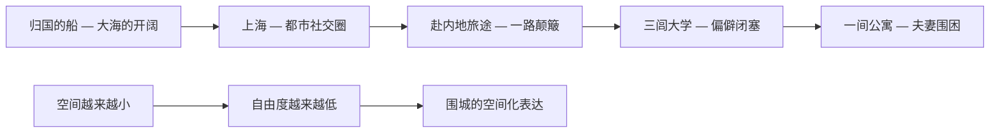
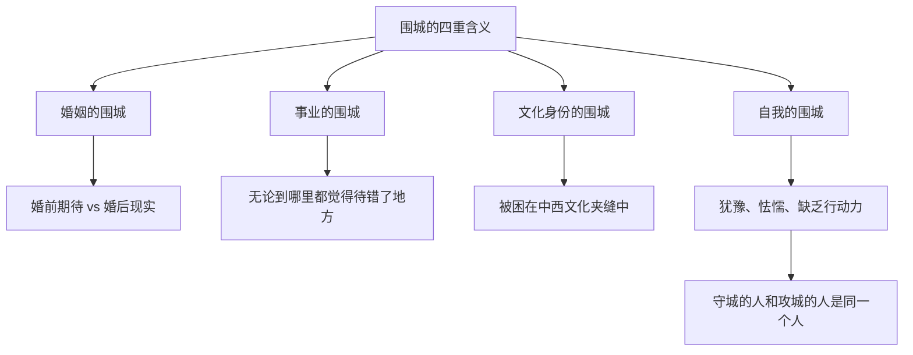

# 《围城》深度读书笔记

> [!abstract] 全书速览
> 一个拿着假文凭的留学生回到1930年代的中国，在情场上节节溃退，在职场上处处碰壁，最后稀里糊涂地走进一段婚姻，才发现婚姻不过是另一座更小的牢笼。钱钟书用中国现代文学中最机智的语言，写了一个最普通的人生故事——没有英雄，没有恶人，没有戏剧性的灾难，只有一个不够好也不够坏的人，在一个不够好也不够坏的世界里，一步步滑向平庸。"城外的人想冲进去，城里的人想逃出来"，这句话表面上说的是婚姻，实际上说的是人生中一切你以为走进去会变好、走进去之后才发现也不过如此的处境。==这本书最令人不安的地方在于：你以为自己是在城外看笑话的人，读到最后你会发现——你也在城里。==

## 时代与作者

1944年，日军占领下的上海。整个中国在战火中挣扎，文学被期待服务于抗战、为民族发声。但钱钟书在这个时候开始写一部和抗战几乎无关的小说。这个选择本身就是一种态度——他认为人性中那些不因战争而起、也不因和平而灭的困境，才是更持久、更值得书写的东西。

> [!note] 从内部解剖知识分子
> 钱钟书是20世纪中国最渊博的学者之一。1910年生于无锡书香世家，父亲钱基博是著名的古文学家。1933年清华外文系毕业后赴英国牛津留学，获副博士学位，又到巴黎大学进修。他精通英、法、德、意、拉丁等多种语言，中国传统文化更是从小浸润其中。回国后辗转于西南联大、蓝田国立师范学院（三闾大学的原型之一）、上海暨南大学等多所高校任教。==《围城》的讽刺之所以精准，是因为他不是从外部嘲讽知识分子，而是从内部解剖自己的同类——他去过牛津、巴黎，见识过中西方学术界的种种虚荣；他在多所大学任教，亲历过教授们的倾轧和空谈。==杨绛回忆说，钱钟书写这本书时常常边写边笑——那种笑，既是智识上的快感，也是对人性弱点的无奈确认。

他的学术巨著《管锥编》《谈艺录》融汇上千种中西文献，是真正的"打通"式学问。但《围城》是他唯一的长篇小说——此后他再也没有写过。一个学者用唯一一部小说就确立了中国现代讽刺文学的标杆，这本身就说明了这部作品的分量。

抗战在小说中只是遥远的背景音——远处的炮声、偶尔提及的沦陷区、旅途中的不便。钱钟书刻意将战争推到幕后，让前景完全留给这群知识分子的日常生活。当时代要求你把一切归结为民族危亡时，他说：不，==人性本身的围城比任何战争都更持久，也更难攻破==。

在中国文学脉络中，《围城》是极其独特的存在。它不是鲁迅式的启蒙呐喊，不是茅盾式的社会写实，不是沈从文式的田园牧歌，也不是张爱玲式的苍凉传奇。它最接近英国的知识分子讽刺小说——伊夫林·沃、赫胥黎那一路。在更远的源头上，它与福楼拜对庸人的冷峻解剖、塞万提斯对理想主义者的温柔反讽有着气质上的亲缘。但它又是彻底中国的：那些婆媳关系、面子文化、世俗人情，是任何翻译都无法完全传达的中国式困境。

## 故事的核心张力

> [!tip] 核心冲突
> 《围城》的底层冲突不是善与恶的对抗，而是一种更令人窒息的东西：**期待与现实之间永恒的、不可弥合的落差。** 方鸿渐的每一次行动都遵循同一个模式——向往某个状态，进入之后发现不是想象中那样，然后开始向往下一个状态。他不是被外力困住的，==他是被自己围困的。==

这种张力在小说中有一个极其精妙的空间化表达：方鸿渐的活动空间在不断收窄。

大海上什么都是可能的；到了公寓里，连吵架的方式都固定了。空间的收窄就是人生可能性的收窄——每一次移动看似是选择，实际是自由度的又一次递减。

那句法国谚语——"婚姻是一座被围困的城堡，城外的人想冲进去，城里的人想逃出来"——在小说中由苏文纨说出，表面上是在谈婚姻。但钱钟书的野心远不止于此。==这个结构适用于人生的一切领域==——事业是围城，人际关系是围城，文化身份是围城，甚至"自我"本身也是一座围城。你被困在自己的性格、习惯和认知模式里，无论怎么挣扎都是在城墙内打转。

> [!warning] 围城的本质
> 围城到底是客观存在的困境，还是主观构建的心理牢笼？赵辛楣面对同样的处境却能潇洒离开，方鸿渐却越陷越深——这说明围城的厚度因人而异。==对犹豫的人，它是铜墙铁壁；对果断的人，它不过是一道矮墙。==外部环境提供了材料，但你自己才是围城的建筑师。

## 人物命运

### 方鸿渐——"没有用的好人"

杨绛用六个字概括方鸿渐："无用之人，不讨厌。"这个评价精准得令人心惊。

方鸿渐是中国现代文学中最真实的"反英雄"。他有知识分子的见识，却没有行动力。他有基本的善良和正直，却没有与之匹配的勇气和决断。他不是恶人——他不像李梅亭那样虚伪贪婪，不像韩学愈那样阴险狡诈，不像高松年那样虚与委蛇。但他的好是无用的——它不能帮他找到工作，不能帮他赢得爱情，不能帮他在尔虞我诈的环境中站稳脚跟。他的善良只够让他不作恶，不够让他行善；他的正直只够让他看不惯别人，不够让他改变什么。

> [!example] 假文凭的多重讽刺
> 方鸿渐在欧洲混了四年，换了三所大学，"随便听几门功课，兴趣颇广，心得全无"，什么学位也没拿到，花钱买了一张"克莱登大学"的假博士文凭。这个细节的讽刺至少有三层：
> - **第一层**：他需要文凭来应对社会期待——学历不是知识的证明，而是身份的通行证
> - **第二层**：明知是假的，被人质疑时却感到愤怒——他对自己的谎言产生了奇怪的"所有权"感
> - **第三层**：在三闾大学，那些拿着真文凭的教授们，人品和学识未必比假文凭更"真"——韩学愈的美国文凭来自一所野鸡大学，同样货真价实地假

方鸿渐在情感上的模式更加令人扼腕。他对鲍小姐是逢场作戏，对苏文纨是推拖敷衍，对唐晓芙是真心喜欢却不敢全力争取，对孙柔嘉是稀里糊涂被套牢。你注意到了吗？他从来没有主动选择过任何一段感情。他在每一段关系中都是被动的——被动卷入、被动退出、被动接受。鲍小姐主动靠近他，他半推半就；苏文纨追求他，他不好意思拒绝；唐晓芙让他心动，他却在苏文纨的破坏面前放弃抵抗；孙柔嘉用柔弱的姿态编了一张网，他直到婚礼当天可能都没完全弄清楚自己是怎么走到这一步的。

在职场上同样如此。在岳父的点金银行，他是寄人篱下的摆设；在三闾大学，他既没有学术能力也没有政治手腕，眼睁睁看着高松年、韩学愈们排挤他，却毫无还手之力。他连愤怒都是无力的——他能看清别人的卑鄙，却拿他们一点办法都没有。

方鸿渐让你想到俄国文学中的"多余人"——但他比那些人更彻底：他甚至没有"曾经有过理想"的悲壮。他的悲剧不是英雄陨落，而是==一个不够好也不够坏的人，在一个需要你要么足够精明、要么足够超脱的世界里，找不到容身之处==。钱钟书给他的不是跌落，而是一次次侧向的滑动——从一个围城滑入另一个围城，每一次移动都以为是出路，每一次到达都发现是新的困境。

你可能觉得这样一个人物不值得同情。但钱钟书的厉害之处在于：他让你意识到方鸿渐的弱点其实就是大多数人的弱点——只是大多数人没有被放在显微镜下观察而已。你真的从来没有因为怯懦而错过什么吗？你真的从来没有因为犹豫而让局面从坏变到更坏吗？

### 孙柔嘉——被低估的"围城建筑师"

孙柔嘉是全书最复杂的女性角色。表面上，她是去三闾大学任教的年轻女教师，寡言少语，温顺柔弱，需要人保护。但细读文本会发现，从赴三闾大学的旅途开始，她就在编织一张精密的网：制造被李梅亭骚扰的恐惧以获得保护，在众人面前展示孤立无援的姿态以激起同情，用"不经意"的举动创造两人独处的机会。方鸿渐以为自己在追求她，实际上是她在猎捕方鸿渐。

这些是算计还是本能？钱钟书刻意保持了模糊。这种模糊本身就是对人性的深刻理解——很多时候，算计和本能之间的界线并不清晰。一个在婚姻市场上没有太多筹码的年轻女性——没有苏文纨的家世和学历，没有唐晓芙的天然魅力——她的心计也许是那个对女性极不公平的时代里唯一的武器。

婚后孙柔嘉完全变了一个人。温顺消失了，取而代之的是强势、敏感、记仇。她和方鸿渐的婚姻变成一场无休止的战争——为了钱、为了姑妈和婆婆的矛盾、为了任何可以点燃战火的理由。但钱钟书没有把她简单写成"恶妻"。她的变化是合理的：婚前的温顺是策略，但也可能包含真实的期待。当她发现方鸿渐既挣不到钱又不会处理家庭关系、既没主见又没担当时，失望转化为愤怒。==她的控制欲，与其说是本性暴露，不如说是终于获得了一个可以展示自己意志的位置——这可能是她人生中第一次有权力要求别人按她的方式来。==

孙柔嘉和方鸿渐的婚姻是围城最直观的展示：两个都不够好的人，带着各自的弱点走进婚姻，然后被这些弱点互相折磨。围城不是某一个人建造的，它是两个人合力修建的。

### 苏文纨——虚荣的才女

苏文纨出身名门，才华真实，但自我评价远超实际。她需要所有男人都围着她转，需要所有场合的焦点都在她身上。她对方鸿渐的兴趣，一部分是因为方鸿渐态度不够热情，反而刺激了她的征服欲——被拒绝对她来说比失去一段感情更不可接受。

她最残忍的行为发生在发现方鸿渐喜欢唐晓芙之后。她故意向表妹揭露方鸿渐的一切丑事——假文凭、和鲍小姐的风流——导致两人决裂。"得不到的就毁掉"——这是一种你在生活中经常见到、但很少有作家写得这么精准的心理。后来她嫁给了粗俗的曹元朗，这个选择看似出人意料实则符合逻辑：她需要的不是爱情而是崇拜。曹元朗提供的正是无条件的、不加鉴别的崇拜——他把她的平庸诗作夸得天花乱坠，他的俯首帖耳让她获得了最需要的东西：被仰视的满足感。

### 唐晓芙——不曾实现的可能

唐晓芙是全书唯一被赋予真正美好品质的女性。天真而不天真得可笑，聪慧而不聪慧得刻薄，率直而不率直得冒犯。她是方鸿渐唯一真心爱过的人，也是他唯一主动付出过热情的对象。但因苏文纨的破坏和方鸿渐自身的缺陷，这段感情夭折了。

> [!tip] 围城的封闭逻辑
> 杨绛透露钱钟书最初想让唐晓芙在后文再次出现。但杨绛劝说：如果结了婚，她也会变成令人失望的妻子——因为婚姻本身就是围城。==也许最美好的爱情就是不曾实现的爱情，因为只有未完成的东西才不会让你失望。==唐晓芙必须消失，她的消失是围城封闭的关键——所有的出口都必须被堵死，方鸿渐才能被迫进入最终的婚姻围城。

### 赵辛楣——围城的旁观者

赵辛楣是方鸿渐的朋友、对照和镜像。他们有很多相似之处：都是留学归来的知识分子，都在情场上受过挫折。但赵辛楣比方鸿渐更果断、更务实、更懂得如何在这个世界上生存。在三闾大学被排挤，他干脆离开另谋出路；追求苏文纨不成，他转身就放下了。他是那种不会被困在围城里的人——不是因为更聪明，而是因为不纠结。方鸿渐在每一座围城里都要犹豫很久，而赵辛楣会直接翻墙而出。

赵辛楣的存在是钱钟书刻意安排的对照组：同样的时代、同样的阶层、同样的困境，一个人能找到出路，一个人越陷越深。==他的存在证明：你的性格决定了围城的厚度。==

### 三闾大学群像——知识分子的照妖镜

三闾大学是全书最集中的讽刺火力。校长高松年是政客型学者，表面道貌岸然，实则满脑子权谋算计，嘴上说着"教育救国"，实际上只关心自己的位子。韩学愈阴沉刻板，他的美国文凭和方鸿渐的克莱登文凭一样可疑，但他比方鸿渐高明的地方在于他敢面不改色地把假的说成真的。李梅亭贪财好色，旅途中偷吃带给生病同事的食物，道德虚伪到了滑稽的地步。汪处厚附庸风雅，写旧诗自抬身价，但才华平平。

这些人凑在一起，构成了一幅知识分子的群丑图。但钱钟书的讽刺不是恶意的——他没有把这些人写成漫画式的坏人。每一个人都有自己的可理解之处：高松年在乱世中维护一所大学的运转确实不容易；韩学愈的阴险部分来自对虚假地位被揭穿的恐惧；李梅亭的贪婪是人性弱点的普遍展现。钱钟书让你看到这些人的可笑，同时也让你意识到：==如果换了你在那个位置上，你未必做得更好。==

## 主题深层解读

### "围城"——人生困境的总隐喻

"围城"在小说中有四重层次的展开，每一层都比上一层更深。

最表层是**婚姻的围城**。方鸿渐稀里糊涂结了婚，发现两人在性格、家庭、习惯上重重矛盾。婚前的期待——即使是模糊的、微弱的期待——全部落空。婚姻不是爱情的完成，而是幻想的终结。

往深一层是**事业的围城**。在上海找不到体面的工作，去三闾大学以为找到了栖身之所，却发现那里的人际关系更加复杂压抑。被排挤后回到上海，又陷入更深的职业困境。无论在哪里他都觉得待错了地方，别处一定更好——但到了别处，又是新的围城。

再往深一层是**文化身份的围城**。方鸿渐是留学生，但留学是失败的——他既没有获得真正的西方学术训练，也没有真正融入西方社会。回国后，他既不是真正的"西化人"（假文凭就是最好的象征），也无法完全回到传统中国人的角色。他被困在中西文化的夹缝里，两边都不完全属于。这在1930-40年代的中国知识分子中是极其普遍的困境。

最根本的一层是**自我的围城**。方鸿渐最深的围城是他自己——他的犹豫、怯懦、虚荣、缺乏行动力，构成了一座永远无法逃出的内心城堡。外部环境可以改变，但他改变不了自己。围城之所以无法攻破，不是因为城墙太高，而是因为守城的人和攻城的人是同一个人。

四重围城互相嵌套、互相加强。外部的困境加剧了内心的软弱，内心的软弱又让外部的困境变得更不可逃脱。这个恶性循环，就是方鸿渐的命运。

### 知识分子的解剖——学识不等于智慧

三闾大学是钱钟书对学术界进行集中讽刺的舞台，但他讽刺的不只是学术界——他讽刺的是"有知识的人"这个群体的普遍弱点。

**学历的虚伪**是最表层的讽刺。方鸿渐的假文凭是最直接的例子，但韩学愈的美国文凭同样可疑。更讽刺的是，拿假文凭的方鸿渐反而是这群人里最不虚伪的——因为他至少知道自己的文凭是假的，而其他人可能真诚地相信自己的学识是真的。学历本应是学识的证明，在这里却成了虚荣和欺骗的工具。

**学术的空洞**更令人悲凉。教授们整天忙于勾心斗角、争权夺利，没有人真正关心学问。学术成为谋生的手段、晋升的阶梯、攻击同事的武器——唯独不是追求真理的事业。高松年的开学演讲说得冠冕堂皇，但学校的日常运作完全是另一套逻辑。

**人格的分裂**是最深层的讽刺。这些知识分子受过教育，能引经据典地谈论道德和理想，但在行为上和没受过教育的人一样自私卑怯。他们的教育只是给他们提供了更精致的自我欺骗方式。一个不识字的人贪财好色，人们可以归咎于无知；一个满腹经纶的教授贪财好色，就暴露了教育的无力——==知识可以让人变得更精明，但不一定能让人变得更好。==

> [!warning] 讽刺的自省性
> 钱钟书的讽刺不是恶意的。他讽刺的是人性的弱点，这些弱点并不限于知识分子——只是知识分子因为自诩清高，显得更加讽刺。他让你看到这些人的可笑，同时也让你意识到：如果换了你在那个位置上，你未必做得更好。

### 爱情的四重解构——从欲望到围困

方鸿渐与四个女性的关系，构成了对浪漫爱情的系统性祛魅。每一段关系代表爱情的一个维度，而每一个维度都走向了幻灭。

> [!example] 四段关系的递进
> - **鲍小姐**（欲望的幻灭）：船上的风流是无根的、短暂的。船靠岸的那一刻关系就结束了——她的未婚夫来接她，方鸿渐像个多余的人站在一旁。这定下了全书的情感基调：所有的关系都将以某种方式让方鸿渐感到多余。
> - **苏文纨**（虚荣的幻灭）：两个人都在演戏，但各自演的是不同的剧本。这段关系的本质是虚荣而非爱情。
> - **唐晓芙**（理想的幻灭）：如果你相信那是真爱，小说是"错过真爱"的悲剧；如果你怀疑那只是又一个幻想，小说就是更彻底的讽刺——方鸿渐连自己的感情都看不清。
> - **孙柔嘉**（现实的围困）：不是基于爱情，而是基于策略、习惯和妥协。

四段关系是一条==不断下行的弧线==——从欲望的幻灭到虚荣的幻灭，到理想的幻灭，到现实的围困。这不是一个"找到真爱"的故事，而是一个"爱情的每一种形态都被证明不可靠"的故事。

### 语言的围城——最华丽的包装与最空虚的内容

这个主题容易被忽略，但它可能是钱钟书最深层的讽刺之一。

书中几乎所有人物都擅长使用语言。方鸿渐能说会道，苏文纨能诗善赋，高松年官话连篇，知识分子们出口成章。但他们越是能说，越是暴露出说的和做的之间的鸿沟。语言不是沟通的工具，而是掩饰的工具——他们用漂亮的话掩盖空虚的内心，用精致的修辞美化平庸的生活。

钱钟书自己的写作也构成了一种反讽：他用最华丽、最机智的语言描写最庸俗、最平庸的人物和事件。==越是华丽的包装，越凸显内容的匮乏。==语言本身也是一座围城——它让你以为自己理解了世界，实际上你只是掌握了描述世界的技巧，而技巧和理解之间的距离，比你想象的更远。

## 文学手法

钱钟书最为人称道的是他的比喻——将两个看似毫无关联的事物放在一起，让你先是一愣，然后发出会心的笑，最后意识到这个比喻说出了某种你感受到但从未能表达的真相。

> [!example] 经典比喻
> - 形容张先生的脸："那两条法令纹把嘴包括在内，象括弧里的话，不过是附带的。"——不仅勾勒了面部特征，还暗示了这个人的存在本身是"附带的"
> - "他并不想占有苏小姐，但他也不愿被苏小姐占有。他只要保持现状——对她若即若离。"——精准概括了方鸿渐的性格核心：==永远处于中间状态，既不进也不退==

讽刺手法上，钱钟书不告诉你某人"是坏人"，而是通过描写言行让你自己得出结论。他写李梅亭偷吃带给生病同事的食物，没有一句评论——但读者自然会产生鄙夷。这种"让事实说话"的讽刺比任何道德宣判都更有力，因为它让你觉得结论是自己得出的，而不是被灌输的。

叙述者的视角也值得注意。《围城》的叙述者不是中立的，而是带有极强的评论性。他不仅知道人物在做什么，还知道人物"自以为"在做什么，并乐于指出两者之间的差距。你始终处于一种"优越"的位置——你看到了人物看不到的自己的可笑。但这种优越感最终会反弹——掩卷之后你会开始怀疑：==我是不是也像方鸿渐一样，被困在自己看不见的围城里？==

小说的结尾意蕴丰富。那只祖传的老钟从容不迫地敲响，敲出比手表慢了五个钟头的时间。老钟属于另一个时代，它敲出的时间不属于"现在"——就像方鸿渐的人生，总是与当下错位。小说不需要一个"结局"，因为围城没有出口。钟声之后明天还会来，新的一天会带来新的争吵、新的围困。故事没有结束，它只是停在了一个任何时刻都可以停的地方——因为对一个困在围城里的人来说，每一天都是一样的。

## 为什么今天还要读这本书

> [!tip] 当代回响
> 方鸿渐的假文凭在"学历社会"中有惊人的当下感——当"名校"变成社交货币，你的文凭定义了你，但文凭可能并不代表你。知识分子之间的攀比在社交媒体时代被放大了无数倍——每一条朋友圈都是一座微型的围城。==围城的当代版本不是"进不去出不来"，而是"每一个方向看起来都差不多，所以站在原地不动"。==

你读《围城》的时候会一直笑——笑别人的可笑，笑作者的聪明。但读完之后你会开始不笑了。因为你会发现：方鸿渐身上那些弱点——犹豫、怯懦、眼高手低、逃避现实——你身上也有。你以为你是站在城外看笑话的人，读着读着你才发现，你也在城里。

下次当你在某个处境中感到"被困住"的时候——一份不满意的工作、一段不太顺的关系、一种"别处一定更好"的冲动——停下来问自己：这是真的困境，还是你自己在修建围城？方鸿渐的教训不在于他做了什么错事，而在于他什么都没做。

而这就是《围城》最高级的地方。它不需要打动你，不需要震撼你。它只需要让你在某个安静的瞬间忽然意识到：**你不是读者，你是角色。**

## 延伸阅读

- [[《包法利夫人》]]（福楼拜）：另一部关于"期待与现实之落差"的杰作。爱玛·包法利和方鸿渐本质上是同一种人——被浪漫幻想喂大，在平庸的现实中找不到出路。福楼拜的冷峻和钱钟书的机智是两种风格，但指向同一个人性困境。

- [[《儒林外史》]]（吴敬梓）：中国文学中知识分子讽刺传统的源头。从范进中举到方鸿渐买假文凭，中国知识分子被学历绑架的历史已经几百年了。

- [[《洗澡》]]（杨绛）：钱钟书夫人的长篇小说，描写知识分子在政治运动中的遭遇。如果说《围城》是知识分子的日常讽刺，《洗澡》则展示了当外部压力变成政治风暴时，同一群人的另一副面孔。两本书对照着读，会获得对中国知识分子命运更完整的理解。