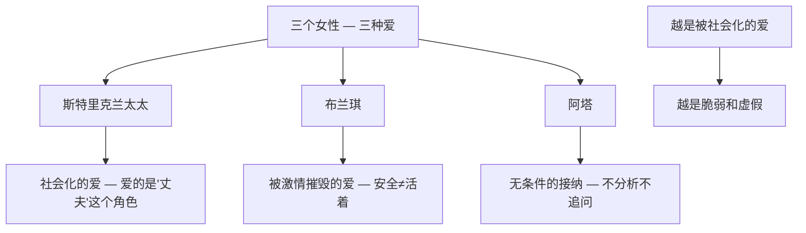
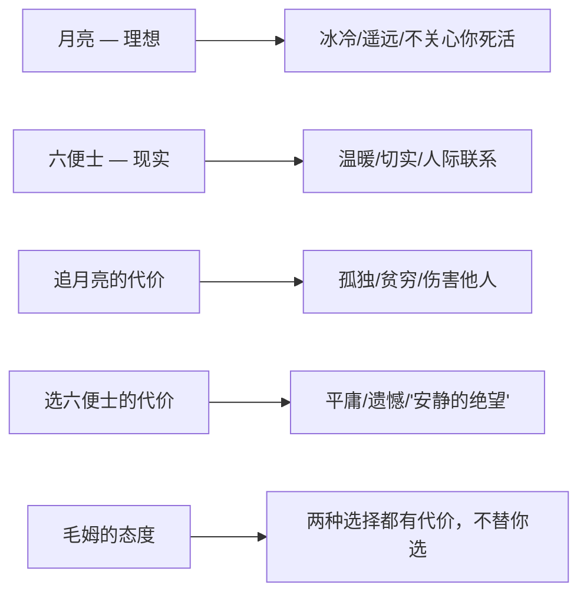

# 《月亮与六便士》深度读书笔记

> [!abstract] 全书速览
> 一个四十岁的伦敦证券经纪人，在某一天毫无预兆地抛弃了妻子、孩子和体面的生活，只身前往巴黎学画。所有人都以为他是为了一个女人，但真相更令人不安——他只是"不得不"画画。毛姆通过这个故事追问的不是"你敢不敢追求理想"，而是一个更尖锐的问题：==如果一个人内心有某种不可抗拒的召唤，他是否有权利为此毁掉所有人（包括自己）的生活？== 你以为月亮代表崇高的理想，六便士代表庸碌的现实，读完才发现，追月亮的人未必崇高，捡六便士的人未必庸碌。**真正的理想主义可能是丑陋的、残忍的、令人厌恶的。** 而你以为的"平凡生活"，也许包含着你看不见的勇气。

## 时代与作者

威廉·萨默塞特·毛姆（1874-1965）是英国文学史上最会讲故事的作家之一，也是最不被"正典"认可的大师之一。弗吉尼亚·伍尔夫嘲笑他是"一流的二等作家"。这种身份焦虑渗透在《月亮与六便士》的每一页中。

> [!note] 被迫沉默的观察者
> 毛姆1874年出生于巴黎的英国大使馆，八岁丧母，十岁丧父，由叔父收养，在英国寄宿学校度过了孤独的少年时代。他有口吃的缺陷，这让他从小就养成了观察而非表达的习惯——当你无法流畅地说话时，你就学会了沉默地看。这种被迫的沉默，成了他后来洞察人性的最好训练。

他学过医，在贫民区的接生经历让他直面了人性的底层。一战期间为英国情报机构工作。到1919年《月亮与六便士》出版时，他已经四十五岁，对人性不再抱有任何浪漫的幻想。==他不相信人会因为高尚的理由做事。他只相信人会因为自己"不得不"的理由做事。==

小说的灵感来自法国后印象派画家保罗·高更的生平。但毛姆借用了高更的外壳，填充了自己对天才、艺术与道德之间关系的思考。真实的高更远比斯特里克兰复杂，毛姆选择性地使用素材，构建了一个纯粹的思想实验：如果一个天才完全服从内心的召唤、完全不在乎道德，会怎样？

在文学史的坐标上，《月亮与六便士》的主题——个体对社会规范的反叛——与陀思妥耶夫斯基的[[《地下室手记》]]和加缪的[[《局外人》]]遥相呼应；它对"天才"的审视，与托马斯·曼的[[《死于威尼斯》]]构成对话。但毛姆的方式更冷静、更克制——他不做判断，只是观察和呈现，然后把判断的权利交给读者。

## 故事的核心张力

> [!tip] 核心冲突
> 底层张力不是"艺术vs.生活"这么简单。毛姆要追问的是：**一个人对自己内心召唤的绝对忠诚，与他对他人的基本责任，是否存在不可调和的冲突？如果存在，谁应该让步？**

斯特里克兰的选择是绝对的。他不是在"平衡"艺术与家庭，他是彻底抛弃了后者。当叙述者问他为什么画画时，他只能笨拙地说："我不得不画。"他无法解释自己的动机，因为这个动机在语言之外、在理性之外。他不像追求理想的英雄，更像一个被恶魔附身的人。

> [!warning] 核心悖论
> ==真正的创造欲不是一种爱好、一种追求、一种选择——它是一种疾病，一种附身，一种宿命。== 如果这是真的，那么斯特里克兰伤害他人的行为是否获得了某种"豁免"？毛姆拒绝给出答案。他让你同时看到天才的力量和伤害的真实——然后让你自己去判断。

"月亮"与"六便士"的隐喻比表面更复杂。月亮代表理想、超越——但月亮也是冰冷的、遥远的。六便士代表现实、责任——但六便士也是温暖的、切实的。==毛姆真正的追问不是"你选择月亮还是六便士"，而是"你凭什么认为选择月亮就比选择六便士更高尚"。==

## 人物命运

### 查尔斯·斯特里克兰——被恶魔附身的人

斯特里克兰是文学史上最令人困惑的主人公之一。他粗鲁、冷漠、自私、利用他人——但他身上有一种让人敬畏的真实。他不演戏。在一个人人都在表演社会角色的世界里，他是唯一拒绝表演的人。

他的弧光不是"成长"而是"剥除"——不断剥除自己身上社会性的部分，直到只剩下纯粹的创作冲动。这不是"变好"或"变坏"的故事，而是一个"变纯粹"的故事——==而"纯粹"在这里是一个既令人敬畏又令人恐惧的词==。

> [!example] 壁画的焚毁
> 斯特里克兰临死前在小屋墙壁上画了一幅杰作——据看过的人说，那幅画触及了某种原始的、令人恐惧的美。然后他嘱咐土著妻子阿塔在他死后烧掉它。他不在乎作品是否流传，他在乎的只是创作本身。==创造本身就是目的，作品只是创造过程的副产品。意义不在于留下什么，而在于燃烧过。==

### 德克·斯特洛夫——善良的代价

> [!warning] 善良的脆弱
> 德克是一个二流画家，但他是第一个识别出斯特里克兰是天才的人——==一个没有天才的人，比任何人都更能辨认天才==。他在斯特里克兰将死时救了他的命，结果斯特里克兰夺走了他的妻子。世界记住了斯特里克兰，遗忘了斯特洛夫。善良不会进入艺术史，天才的冷酷反而成了传奇的一部分。

最让人心碎的是布兰琪离开时德克的反应：他请求她留在这个家里，自己搬出去——宁愿放弃自己的家也不愿让她流落街头，即使她是因为另一个男人才离开他的。

### 三个女性——爱的光谱

斯特里克兰太太的"爱"从一开始就是社会性的，她爱的不是斯特里克兰这个人，而是"丈夫"这个角色。布兰琪在安全的德克身边感受不到某种东西，在毁灭性的斯特里克兰身上找到了——但这个东西最终杀死了她。阿塔不分析、不追问、不期待，她只是在那里，照顾他直到他死去，然后按照遗嘱烧毁了杰作。

### 叙述者——你我的替身

叙述者是一个有教养、有同理心、选择了"正常道路"的年轻作家。他代表的正是大多数读者。

> [!tip] 深层追问
> 毛姆通过叙述者传递了一个核心的自我追问：==你是否因为缺乏勇气而选择了安全的生活？你所谓的"道德感"，是否不过是懦怯的美化？== 这个问题的残忍之处在于：它没有"正确答案"。

## 主题深层解读

### 天才与道德——无法解决的悖论

==天才与道德属于不同的维度，它们之间不存在简单的换算关系。== 斯特里克兰的伟大不能"抵消"他的残忍，他的残忍也不能"否定"他的伟大。毛姆让你同时感受到天才的震撼和伤害的真实——然后让你自己去面对这个矛盾。

也许最诚实的回答是：斯特里克兰既是被召唤驱使的，也是在利用"召唤"来为自己的自私开脱。最真诚的动机和最自私的动机可以共存于同一个行为之中。

### 文明的虚伪外衣

> [!warning] 社会控制的隐秘机制
> 社会不是主要通过法律来约束人的，而是通过"可理解性"来约束人的。为了女人离开家庭是"可理解"的；为了画画离开家庭是"不可理解"的，因此是更大的威胁。==斯特里克兰的可怕之处不在于他不道德，而在于他不演戏。在一个人人都在演戏的社会里，一个不演戏的人是最大的异端。==

斯特里克兰的生命旅程从伦敦到巴黎再到塔希提岛，是一个逐步剥除文明外衣的过程。但文明的问题不在于它是"坏"的，而在于它是"虚假"的——它用舒适和体面遮蔽了生命的真实。

### 艺术的本质——表达不可表达的

斯特里克兰不善言辞，他只能笨拙地说"我不得不画"。他的画——狂野的色彩、扭曲的形态、原始的力量——是他唯一的语言。**真正的艺术是表达那些无法用其他方式表达的东西。**

> [!note] 叙事的留白
> 毛姆让斯特里克兰的终极壁画永远缺席。你永远无法看到它，只能通过别人的描述来想象。这与整本书的认识论结构一致——==你永远无法直接接触天才的本质，你只能通过间接的、不完整的信息来接近它==。

### 月亮与六便士——被颠覆的简单对立

在斯特里克兰身上，追月亮的行为并不崇高——它是暴力的、自私的。而六便士的生活也并不卑微——德克那种"普通的善"在道德上比斯特里克兰的"伟大的冷酷"更有价值。

## 文学手法

毛姆选择了精妙的叙事策略：让一个平庸的、具有正常道德感的"我"来讲述一个不平庸的、超越道德的天才的故事。

> [!example] 叙事策略的三重功能
> - **距离感的控制**：叙述者从未真正理解斯特里克兰——天才如果可以被普通人完全理解，它就不是天才了
> - **判断的悬置**：叙述者对斯特里克兰既反感又敬畏——这种矛盾正是毛姆要传递给读者的
> - **反讽的空间**：叙述者代表社会共识，斯特里克兰是对这一切的根本否定，两者碰撞产生持续张力

小说结构不是线性推进，而是拼图式的人物重构。叙述者在不同时间地点收集信息，拼贴成故事。毛姆的语言是清晰、精准、不炫技、暗藏刀锋的——他的讽刺是手术刀式的，一刀下去，切口精准而深。

## 为什么今天还要读这本书

> [!tip] 当代意义
> 在一个所有人都被鼓励"做自己""追求热爱"的时代，斯特里克兰的故事像一记清醒的耳光。真正的"做自己"可能意味着伤害你爱的人，摧毁你已有的一切。==你所谓的"热爱"，是真正的内在召唤，还是对"追求热爱"这个文化叙事的消费？斯特里克兰不享受画画——他在画画中受苦。如果你的"热爱"让你感到快乐和充实，那它可能只是一个高级的爱好。真正的召唤更接近一种诅咒。==

德克·斯特洛夫的故事对"善良"文化提出了警示：善良如果没有力量和边界的支撑，就只是软弱的美化。善良的人把自己打开了，而打开自己的人最容易受伤。

月亮很远、很冷、很美。六便士很近、很暖、很实在。毛姆不告诉你应该选哪个。他只告诉你：不管你选了哪个，都要付出代价。

## 延伸阅读

- [[《人性的枷锁》]]（毛姆）：毛姆的半自传体长篇小说，主人公菲利普的挣扎比斯特里克兰更接近普通人的处境——他不是天才，他只是一个试图在没有意义的世界里找到意义的普通人。

- [[《刀锋》]]（毛姆）：毛姆晚年巨作，与本书构成姊妹篇。拉里同样放弃世俗生活追求精神真实，但道路温和得多——他追求的是内在的平静，他不伤害任何人。

- [[《悉达多》]]（黑塞）：同样是一个"不得不"走自己道路的人，但悉达多最终找到了一种与世界和解的方式，而斯特里克兰永远没有。两本书代表了面对"内心召唤"的两种态度：燃烧与安宁。
