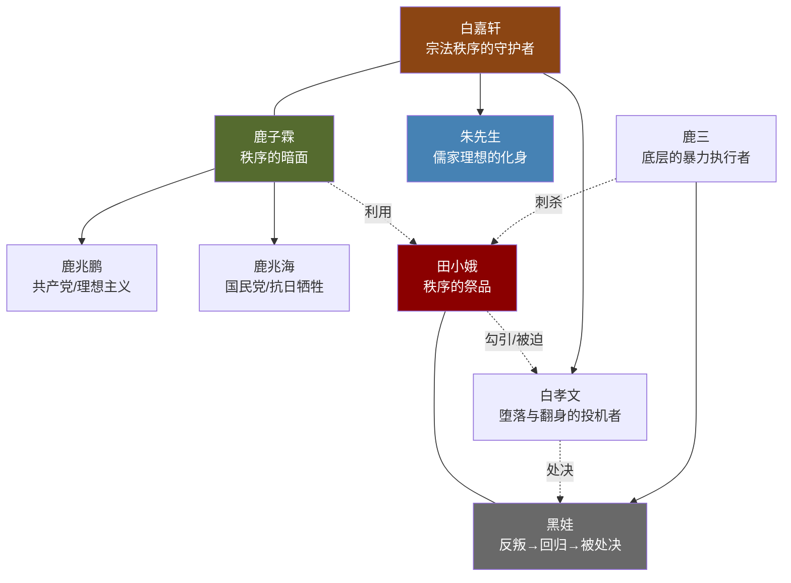
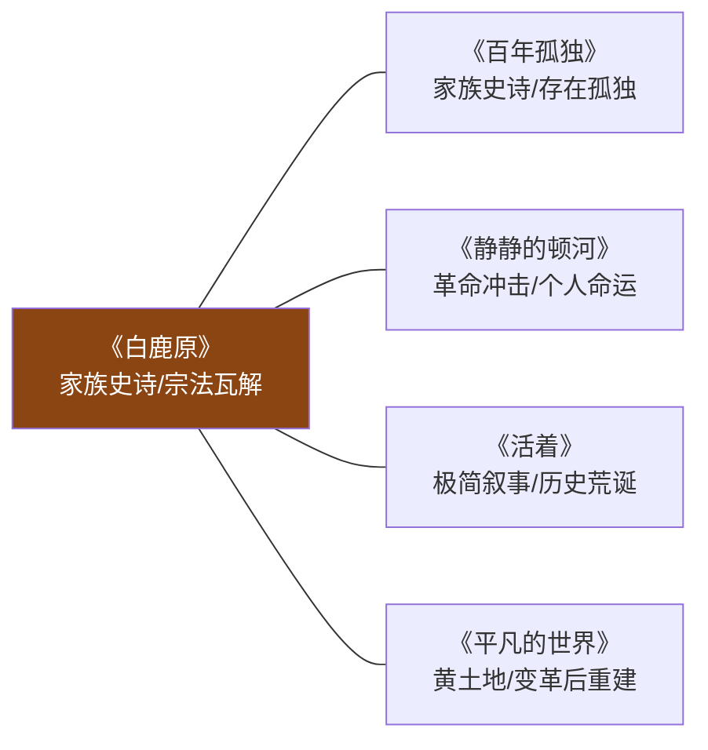

# 《白鹿原》深度读书笔记

> [!abstract] 全书速览
> 这是一部关于中国乡土文明如何在历史的碾压下碎裂、变形、又顽强残存的史诗。陈忠实以陕西关中平原上一个叫白鹿原的地方为舞台，用近五十万字的篇幅讲述白、鹿两大家族从清末到建国后半个世纪的恩怨沉浮。小说不是简单的家族纷争，它追问的是一个更大的问题：一套维系了数百年的宗法伦理秩序，在辛亥革命、军阀混战、国共分裂、抗日战争、解放战争的连续冲击下，如何一块砖一块砖地松动、裂开，最终坍塌成废墟；而那些碎片，又以怎样的方式嵌入每个人的灵魂深处，成为你甩不掉的胎记。读完这本书，你会感到一种难以言说的沉重——不是因为悲惨，而是因为你在那些人身上看到了某种属于你自己的东西。

---

## 时代与作者

陈忠实说过，他要写一部"死后可以放在棺材里当枕头"的书。这句话本身就散发着浓烈的关中泥土气——棺材里的枕头，是陪伴自己进入永恒的最珍贵之物。《白鹿原》正是这部枕头之书，历时六年创作，1993年出版，1997年获第四届茅盾文学奖。

要读懂这部作品，你需要理解陈忠实的双重身份。他是关中平原的儿子，生于西安东郊灞桥区西蒋村，对这片土地上的人情世故有着骨血相连的熟悉——方言、风俗、农事节令、宗族礼仪，都是他生命经验的一部分。同时他又是经历过"文革"的知识分子，对那些以"革命"之名碾碎传统的历史有着切肤之痛。他见过祠堂被砸、家谱被烧、老人被批斗的场景，也见过革命退潮后人们精神世界的荒芜。

这种双重身份造就了《白鹿原》独特的张力。它既不是怀旧的田园牧歌，也不是激进的革命檄文，而是一种==含泪的审视==：承认传统有其不可辩护的黑暗面——对女性的压制、对异端的迫害、对个体自由的扼杀；同时也承认，随着传统的消逝，某些珍贵的东西被一并卷走了——秩序、意义、归属感、人与土地之间那条看不见的脐带。

为了写这部书，陈忠实做了大量准备工作。他阅读了关中地区的县志、宗族家谱和历史文献，实地走访了无数村庄，收集口述历史和民间传说。他要做的不是编织一个故事，而是重建一个世界——白鹿原这个虚构的地理空间，要成为关中平原乃至整个中国传统乡土社会的缩影。六年的创作过程是孤独而艰苦的。陈忠实把自己关在农村老家的窑洞里，远离城市的喧嚣，沉浸在他所创造的世界中。他后来回忆说，写完最后一个字的时候，他感到一种巨大的空虚——仿佛与自己相处了六年的人物突然离去。

在中国当代文学的版图上，《白鹿原》占据着无可替代的位置。它不是伤痕文学的控诉，不是寻根文学的怀旧，更不是先锋文学的形式实验。在世界文学的脉络中，它可以与[[《百年孤独》]]的家族史诗叙事、福克纳"约克纳帕塔法"系列的地方志书写、以及[[《静静的顿河》]]对历史洪流中个人命运的深切关注形成对话。陈忠实的独特之处在于，他的叙事深深扎根于儒家宗法文化的土壤，他关心的核心问题不是个体如何面对荒诞，而是一整套文明秩序在历史的碾压下如何碎裂。

---

## 故事的核心张力

> [!tip] 核心冲突
> 《白鹿原》的底层张力不是善与恶的对立，而是==秩序与混乱、传统与革命、集体伦理与个人命运==之间不可调和的撕裂。

白鹿原上的人们曾经生活在一套自足的宗法体系中。祠堂是权力中心，族规是法律，辈分决定尊卑，面子就是命。白嘉轩按照刻在祠堂里的《乡约》治理白鹿村——赌博受惩，偷盗进祠堂，通奸被公开羞辱。这套体系粗粝但有效，它提供了秩序、意义和归属感。你知道自己是谁，知道自己应该做什么，知道如果犯了错会付出什么代价。

然后，历史来了。

辛亥革命推翻了皇帝，从此没有了天命的庇护。军阀混战搅乱了地方秩序，国共合作带来了闻所未闻的新思想，分裂又带来了血腥的清洗。抗日战争把每一个白鹿原上的人卷入民族存亡的漩涡，解放战争则决定了谁来做新时代的主人。每一次浪潮冲过白鹿原，都让那套古老的秩序更加松动。

但陈忠实的深刻之处在于，他没有把这写成一个"旧的坏、新的好"的简单叙事。他让你看到：旧秩序有其压迫性，但也有其稳定性和意义供给；新革命有其解放性，但也有其暴力性和投机者。最终胜出的不是最正义的人，而是最善于在变局中重新给自己定位的人——白孝文从族长之子到乞丐再到县长的轨迹，就是对这一残酷真相的最好注脚。

> [!warning] 无解的追问
> 这部小说追问的是一个没有标准答案的问题：==当旧秩序的大厦倒塌时，我们失去的究竟是枷锁还是家园？==也许两者兼是——这正是悲剧的根源。

---

## 人物命运图谱

### 白嘉轩——最后的族长

白嘉轩是宗法秩序的人格化身。小说开篇第一句话就奠定了他的分量："白嘉轩后来引以为豪壮的是一生里娶过七房女人。"这句话把你一把拉入一个以身体延续和家族传承为中心的世界——前六任妻子都死了，但白嘉轩的腰杆依然挺直，他的生命力依然顽强，他对延续家族血脉的执念依然如铁。

> [!note] 身体隐喻
> 白嘉轩==挺直的腰杆==是全书最重要的身体意象。它不仅是一种身体姿态，更是一种道德姿态——他对自己的要求、对族人的期待、对秩序的坚守，都凝结在那根脊梁上。后来黑娃打断了他的腰，宗法秩序的脊梁被底层的反叛力量打断了，但他的精神从未屈服。

白嘉轩按照《乡约》治理白鹿村，他的权威来源不是暴力——虽然他也使用惩罚手段——而是==道德的自洽性==。他自己先做到了他要求别人做到的一切。当儿子白孝文与田小娥厮混败坏门风时，他可以狠心将其逐出家门；当鹿子霖暗中使坏时，他可以不与其计较。他是儒家伦理在乡土社会最完整的一个投影。

但陈忠实没有把白嘉轩写成圣人。他用计骗取鹿家的风水宝地，展示了精明算计的一面；他对田小娥的冷酷排斥，展示了道德体系中非人性的一面；他对堕落儿子的决绝，展示了"家族名誉"可以如何凌驾于"父子亲情"之上。白嘉轩的"好"中有专制的成分，他的正直中有残忍的影子。你敬佩他，但你也会在某些时刻感到一阵寒意。

他最令人深思的处境是：他守护的那套秩序，无论如何完善，都无法应对正在到来的历史。当整个世界都在剧烈变化时，他的"不动"从一种美德变成了一种悲剧——==他守住了自己的尊严，但他守住的那个世界已经不在了。==

### 鹿子霖——秩序的暗面

> [!warning] 权力的明暗两面
> 白嘉轩和鹿子霖的对照揭示了一个洞察：==任何秩序的运转都需要明暗两面的合力==。没有白嘉轩的道德旗帜，秩序缺乏合法性；没有鹿子霖的手段运作，秩序无法实际落地。他们彼此厌恶，但又彼此需要。

鹿子霖利用田小娥去勾引白孝文的情节，是全书最阴暗的权力运作。他的目的不是田小娥本身，而是通过搞垮白嘉轩的长子来羞辱白家。性在这里是权力斗争的武器，女性的身体成了男性博弈的战场。

鹿子霖最终疯癫。在政治运动的反复冲击下，他的精神彻底崩溃。这个结局带有寓言色彩——那些在旧秩序和新秩序之间两面讨好的人，最终被两面夹击，碎成了精神的碎片。他的疯癫不仅是个人的悲剧，更是一种生存策略的破产——==当你用权谋和投机应对一切时，一旦局势超出算计能力，你就会彻底崩溃，因为你没有可以依靠的内在信念。==

### 田小娥——被侮辱与被损害的

田小娥是《白鹿原》中最令人心痛的角色。她是宗法体系中==最没有话语权的人==——一个女人、一个被买卖的妾、一个被贴上"不守妇道"标签的人。她的命运暴露了这个体系全部的残忍。

> [!example] 无处可逃
> 田小娥的人生轨迹是一条持续下行的线：被卖给年迈举人做妾 → 被公公当作"泡枣"的工具 → 与黑娃相爱以为找到了出路 → 黑娃离开后孤立无援 → 被鹿子霖利用 → 被白嘉轩拒于祠堂之外 → 被鹿三刺死 → 死后骨骸被镇压在塔下。白鹿原上的每一条路都堵死了。

杀死她的是鹿三——黑娃的父亲、白嘉轩最忠诚的长工。他杀田小娥不是出于个人仇恨，而是出于对宗法秩序的维护。这正是宗法秩序最可怕的地方——==它能让被压迫者成为同样被压迫者的刽子手==。鹿三是底层中的底层，田小娥是弱势中的弱势，但秩序的逻辑让前者成了后者的刑罚执行者。

田小娥死后的"瘟疫事件"更具象征力量。白鹿原上爆发瘟疫，村民认为是她的冤魂作祟。白嘉轩下令修建六棱砖塔，将田小娥的遗骨压在塔下。活着的时候压迫你的身体，死了之后还要压制你的灵魂——这就是秩序对"异端"的终极处置。你读到这里，会感到一种穿越纸面的冰凉。

陈忠实对她的态度是复杂的：同情她的遭遇，但也没有简单地将她塑造成纯洁的受害者。她有欲望、有算计、有报复心理——她是一个完整的人，而==作为一个完整的人，她无法在那个社会中找到容身之处==。她的悲剧揭示了传统社会的一个根本性矛盾：它的道德体系建立在对女性的压制之上，但这种压制本身就是最大的不道德。

### 黑娃——反叛与回归的悲剧

黑娃（鹿兆谦）是全书命运最曲折的人物。长工的儿子，天性自由、不服管教。他与田小娥的爱情是对宗法秩序最直接的挑战——一个长工的儿子爱上了一个被排斥的女人，这在白鹿原的伦理体系中是双重的越轨。但这段爱情又是全书中最真实的情感。

黑娃后来参加农民运动、当土匪、投靠保安团、最终加入共产党。最耐人寻味的是他晚年拜朱先生为师、学习儒家经典——==这个从反叛者到回归者的弧线暗示了宗法文化对人的深层塑造==。你可以在行为上叛离它，但你的灵魂最终还是会被它召唤回来。真正继承朱先生精神的，不是那些从小接受正统教育的人，而是这个浪子回头的土匪——那些在规矩中长大的人把规矩当作工具（白孝文），只有在规矩之外流浪过的人才能理解规矩的价值。

黑娃最终被白孝文以"反革命"的罪名处决。一个真诚的回归者被一个投机的变色龙以正义的名义杀死——这是全书最残忍的反讽，也是陈忠实对历史最冷峻的注脚。新秩序的合法暴力被用来清算旧日的私怨，"革命"成了权力运作的新外衣。黑娃的死是双重的悲剧：他既是宗法秩序的受害者（年轻时被排斥），又是新秩序的祭品（归顺后被处决）——无论旧的还是新的，秩序总需要牺牲品。

### 鹿三——沉默的底层

鹿三是一个容易被忽视但极其重要的角色。他是白嘉轩最忠诚的长工，一辈子兢兢业业，把白嘉轩当作自己的主人和道德标杆。他是宗法秩序中最底层的存在，但也是最坚定的维护者——因为这套秩序虽然让他处于从属地位，却也给了他一个明确的身份和意义。

他杀死田小娥不是为了自己，而是为了维护他所信仰的秩序——在他看来，田小娥败坏了他儿子黑娃的名声。但杀人之后，鹿三并没有获得他期待的道德安宁。田小娥的鬼魂附在他身上，让他终日恍惚、精神失常。这个细节意味深长：==当底层的人被秩序利用去执行暴力时，暴力的反噬同样会落在他们身上==。秩序获得了它需要的"清洗"，而执行者则承受了全部的精神代价。

### 白孝文——最令人不安的幸存者

白孝文的人物弧线是全书最"现实"的。从白嘉轩精心培养的继承人，到与田小娥厮混的堕落者，被逐出家门后沦为乞丐，然后在解放战争末期投机加入革命队伍，最终成为新政权的县长——并下令处决了曾经的战友黑娃。

他的堕落暴露了传统道德教育的致命弱点：它培养的是外在的服从，而非内在的自律。一个从未被允许面对自己欲望的人，一旦防线被突破，就没有任何内在的力量可以依靠。

> [!warning] 残酷的真相
> 白孝文的故事追问的是一个尖锐的问题：==在政治剧变中，最终胜出的往往不是最坚定的理想主义者，而是最善于随风转舵的人。==这个判断冰冷，但翻开历史，你很难否认它。

### 朱先生——白鹿精神的最后守护者

朱先生是小说中最理想化的人物，也是最具悲剧色彩的人物。他代表了儒家文明在最好状态下的样子：学识渊博、品德高洁、超越利害、关怀苍生。他一人退清兵的壮举是全书最具传奇色彩的段落，他主持编撰的县志是为这片土地留下的最后一份记忆。

但朱先生最终死于新旧交替的时代缝隙中。他的学问、他的预言、他的道德典范，在革命的洪流中显得无力而苍凉。他临死前留下的话语成了无人听从的空谷回音。==你能预见灾难，但你无法阻止灾难==——这是知识分子的终极困境，朱先生用一生诠释了这种困境的全部重量。

### 鹿兆鹏与鹿兆海——革命的两条岔路

鹿子霖的两个儿子分别走上了共产党和国民党的道路。

> [!note] 历史的复杂性
> 陈忠实没有简单地将共产党写成正义、国民党写成邪恶。鹿兆海在中条山抗日战役中英勇牺牲，他的死是高尚的、值得尊敬的。鹿兆鹏在地下工作中展现了理想主义者的坚定，但他抛弃不愿离婚的妻子——最终导致妻子自杀——也暴露了革命者在"大义"面前对个人伦理的冷漠。

这对兄弟的命运追问着一个沉重的问题：在历史的岔路口做出选择的人，往往并不知道自己的选择将通往何方。他们都以为自己在为更好的未来而战，但历史只承认其中一方，而另一方的鲜血和牺牲则被静静地遗忘。

---

## 主题深层解读

### 宗法秩序——一座正在坍塌的大厦

陈忠实为什么要如此细密地书写宗法秩序？因为中国乡土社会的根基不是法律、不是宗教，而是以祠堂、族规、辈分、面子为核心的宗法伦理。要理解中国人灵魂深处的密码，你必须理解这套系统；要理解这套系统的瓦解意味着什么，你必须先看到它完整运转时的样子。

通过白嘉轩这个"完美族长"的形象，陈忠实展示了宗法秩序在理想状态下的运作——公正、严厉、有效，能够解决纠纷、维护稳定、提供意义。然后通过一系列冲击——田小娥事件、白孝文堕落、革命运动的反复冲刷——让这座大厦一块砖一块砖地松动、裂开。

> [!tip] 核心洞察
> 白嘉轩的宗法秩序是"好"的吗？这个问题没有简答。从社会功能的角度看，它维持了秩序、解决了纠纷、提供了意义系统；从个体自由的角度看，它压制了女性、扼杀了异端、将一切非主流的生活方式定性为不道德。==陈忠实的态度是复杂的：他既敬佩白嘉轩的正直，又让你看到这种正直背后的残忍。这种不做简单价值判断的态度，是《白鹿原》超越一般历史小说的关键。==

### 革命——新秩序的诞生阵痛

革命在本书中与宗法秩序构成了核心对立。但陈忠实的深刻之处在于，他展示了两者之间的==暧昧关系==：革命声称要推翻旧秩序，但革命后建立的新秩序是否真的"新"？

白孝文从族长之子变成了县长，权力的形式变了，权力的本质变了吗？黑娃从土匪变成了革命者又回归了儒学，最终被白孝文以新秩序的名义处决——旧仇在新制度下以合法的方式完成了清算。

> [!warning] 哀伤的清醒
> 陈忠实对革命的态度是一种==哀伤的清醒==：他承认旧秩序必须被打破，但对新秩序能否避免旧秩序的弊病持深深的怀疑。他不是反对革命，而是拒绝对革命的浪漫化。

### 白鹿——文明的隐喻

白鹿作为传说中的灵物贯穿全书，时隐时现，成为衡量白鹿原精神状态的隐喻。白鹿出现，则原上安泰；白鹿隐去，则灾祸降临。

白嘉轩之所以用计换得鹿家的那块地，正是因为他发现那里有白鹿出没的迹象。这个行为本身就充满了矛盾：白嘉轩是道德楷模，但他获取这块地的方式是一场精心策划的欺骗。==白鹿原的根基从一开始就埋下了道德暧昧的种子。==

朱先生在某种意义上是白鹿精神的人格化身，超越于白鹿两家的纷争之上。但他最终也无力阻止历史的碾压。而田小娥可以被视为白鹿的暗面——她代表了这片土地上被压抑、被否认、被镇压的生命力。白鹿原的表面繁荣，建立在对田小娥们的牺牲之上。

### 身体与土地——存在的双重根基

陈忠实为什么如此执着于身体叙事和土地描写？因为对农耕文明中的人来说，身体和土地是存在的两个基本维度。身体是人与世界的界面，土地是人的根。

小说开篇的身体叙事极为大胆：白嘉轩娶了七房妻子，前六个都死了。这在象征层面暗示了==生命本身的脆弱与顽强==——死亡不断发生，但生命通过再婚、生育不断延续。而土地在小说中不是背景板，而是角色。白鹿原上的人为土地而活、为土地而争、最终也被绑定在土地上无法挣脱。

性在小说中也不仅仅是生理行为，它是权力关系的体现和人性的显现。郭举人把田小娥当作"泡枣"的工具，鹿子霖通过性来操控田小娥，白孝文在性中经历了自我的崩溃。田小娥与黑娃的结合是全书中最真实的情感之一，因为它发生在所有社会规范的约束之外，是两个完全赤裸的人之间的相遇。

### 性别困境——秩序的牺牲品

田小娥的命运不是个案，而是整个宗法体系对女性压迫的缩影。在这套体系中，女性的价值被简化为两个功能：繁衍后代和维护男性的名誉。前六任妻子的死亡被白嘉轩视为命运的考验而非悲剧，因为她们的意义就是为白家延续血脉。

鹿子霖利用田小娥去勾引白孝文，==性在这里彻底沦为权力斗争的工具，女性身体成了男性博弈的战场==。而杀死田小娥的鹿三——一个底层长工——用的正是维护秩序的逻辑。这告诉你，性别压迫不需要施压者是强者，它已经内化为一种集体无意识，连最弱势的男性也可以成为女性的加害者。

但陈忠实笔下的女性也不全然是被动的受害者。白嘉轩的第七任妻子仙草，在沉默中展现了一种不同于男性的坚韧。她没有田小娥的反抗性，却在日常生活的坚守中展现了另一种生命力。如果田小娥代表了秩序无法容纳的"异端"，仙草则代表了秩序内部的"顺从者"——但这种顺从同样付出了巨大的代价，只是那代价更加沉默、更加隐蔽。

### 性描写的叙事功能

《白鹿原》中的性描写曾引起争议，出版时甚至被删减过。但这些描写并非为了刺激，而是具有深刻的叙事功能。

性是权力关系的体现：郭举人把田小娥当作"泡枣"的工具，鹿子霖通过性来操控田小娥，白孝文在性中经历了自我的崩溃。每一场性关系都是一种权力结构的缩影。性也是反抗的形式：田小娥与黑娃的结合是对等级秩序的挑战，他们的爱情是全书中最真实的情感之一。性还是人性的显现：在性的场景中，人物卸下了社会面具，展现出最真实的欲望和恐惧。==白孝文在田小娥身边的沉溺和崩溃，比任何说教都更有力地揭示了传统道德教育的虚伪性==——一个被禁欲主义训练了二十多年的人，他的欲望并没有消失，只是被压到了更深的地下。

---

## 与其他作品的对话

> [!note] 与《百年孤独》的比较
> 两者都是家族史诗，但关切点不同。马尔克斯关心的是存在的孤独（普遍性哲学主题），陈忠实关心的是文化的断裂（具体历史问题）。布恩迪亚家族的问题是无法真正建立深度联结，每个人都困在自己的宇宙中；而白鹿原上的人恰恰相反——他们被宗法纽带紧密捆绑，个体几乎没有独立存在的空间。

> [!note] 与《静静的顿河》的呼应
> 两者有更深的亲缘关系。都描绘传统社会在革命冲击下的命运，都关注普通人在历史洪流中的挣扎。葛利高里的悲剧与黑娃有惊人的相似——都在不同阵营间摇摆，都最终被历史碾碎。这种摇摆不是因为软弱，而是因为==没有任何一个阵营能够完整地容纳一个完整的人==。

---

## 文学手法

### 年代记式全知叙事

陈忠实采用了全知视角的叙事方法。叙述者无所不知、无处不在，能够自由进入每一个人物的内心，也能跳出来俯瞰整个白鹿原的兴衰。

这种叙事选择有其深刻的理由。白鹿原上人物众多、关系复杂、利益纠葛交错，单一视角无法承载如此庞大的叙事。全知叙事让陈忠实能够同时展示白嘉轩的内心独白和鹿子霖的暗中算计，让你看到每个人行为背后的动机，看到表面平静的宗族秩序下涌动的暗流。

历史事件不是作为独立章节出现的，而是通过人物的行动和命运自然嵌入叙事。鹿兆鹏加入共产党、鹿兆海参加国军、白孝文的堕落与翻身——这些个人选择都是历史洪流在白鹿原上的具体投射。你不是在读一本历史教科书，而是在看历史如何一点一点改变了具体的人的命运。

### "慢"的节奏与世界的质感

陈忠实选择了一种"慢"的叙事节奏——大量的日常生活铺陈、风俗描写、人物心理刻画。种地、收粮、修祠堂、办丧事、过年、祭祖——这些反复出现的日常仪式让白鹿原变成了一个你仿佛住过的地方。

> [!tip] 理解"慢"
> ==只有当你真正"住进"了白鹿原，你才能感受到这个世界被撕裂时的痛。如果叙事太快，历史变成了新闻；只有足够慢，历史才能变成命运。==

### 关中方言与感官密度

《白鹿原》的语言具有强烈的关中地域特色。大量的方言词汇、农事术语和民间口语赋予了小说不可替代的质地。陈忠实的描写充满了视觉、触觉、嗅觉的细节——麦子的颜色、泥土的气味、皮肤的触感、饭菜的热气。这种感官密度让白鹿原不是一个抽象的文学空间，而是一个你仿佛能触摸到的物理世界。方言的使用也意味着一种立场：这是一部从"内部"讲述的故事，叙述者与这片土地上的人呼吸着同样的空气。

### 象征与民间叙事的融合

白鹿的传说、田小娥死后的瘟疫、朱先生的预言——这些带有神秘色彩的元素不是迷信的点缀，而是民间信仰世界的有机组成部分。在白鹿原的世界观里，冤魂可以复仇，预言可以应验，风水可以决定家族兴衰。陈忠实没有从启蒙理性的角度否定这些信仰，而是将它们作为那个世界的一部分来尊重和呈现。这种处理方式让《白鹿原》具有了某种寓言式的厚重感——在这种认知方式中，人与自然、生者与死者、可见的现实与不可见的力量之间并不存在截然的边界。这种认知方式正是宗法文化的一部分，它的消逝也是现代性的代价之一。

---

## 叙事结构的深层逻辑

### 开篇的密码

> [!note] 全书最好的开头之一
> "白嘉轩后来引以为豪壮的是一生里娶过七房女人。"——"后来引以为豪壮"暗示了时间的纵深，"七房女人"在一句话内建立了这个世界的基本坐标：生死、婚姻、血脉延续。前六任妻子都死了这个事实不需要直接说出——"七房"这个数字本身就携带着巨大的死亡阴影。而==引以为"豪壮"而非"悲伤"==，揭示了白嘉轩理解世界的方式：个人的死亡不过是延续之路上的障碍，真正重要的是家族的血脉得以传承。

### 时间的处理

陈忠实处理时间的方式值得仔细关注。小说覆盖了近半个世纪的历史，但时间的推进不是匀速的。在白鹿原秩序稳定的时期，时间是缓慢的、凝滞的——大量日常细节让你感觉时间几乎停止了。但当历史事件冲击白鹿原时，时间突然加速——辛亥革命、国共分裂、抗日战争，像连续的地震波。这种加速和减速不是技巧性的，而是体验性的：==对白鹿原上的人来说，日常生活大部分时间是重复的、静态的，偶尔被突如其来的外部力量打断。==

### 结尾的意味

小说结尾没有悲壮的死亡，没有戏剧性的转折。白嘉轩老了，白鹿原上的秩序已经彻底改变，但他还活着——弯着被打断的腰，站在一个他已经不认识的世界里。陈忠实没有为他安排一个符合其道德高度的死亡，也没有让他在新时代中得到某种形式的"承认"。他只是让他活着——==在一个你所珍视的一切都已经坍塌的世界里，活着本身就是最沉重的注脚==。

---

## 为什么今天还要读这本书

《白鹿原》写的是清末到建国后的故事，但它追问的问题在任何时代都成立。

**传统与变革的张力**。你所处的时代正在经历高速的技术变革和价值重构。许多你习以为常的观念——家庭结构、职业路径、人生意义——都在被重新定义。白嘉轩面对的困境，在本质上与今天每一个在传统价值和现代生活之间挣扎的人是相通的：==你无法完全守住旧的，也无法完全拥抱新的，你只能在裂缝中寻找自己的位置。==

**权力的运作逻辑**。白孝文的故事在当代语境中有着刺骨的现实感。在任何组织、任何制度中，都有白嘉轩式的理想主义者和白孝文式的投机者。制度更迭、口号变化，但权力的运作逻辑——谁能在变局中最快地给自己找到合适的位置——往往惊人地一致。

**弱势者的命运**。田小娥的故事不只属于那个时代。在任何一套秩序中，都有被排斥在主流叙事之外的人。他们的声音被忽略、他们的痛苦被合理化、他们的反抗被污名化。==衡量一个文明的标准，不是看它如何对待它的精英，而是看它如何对待它的弃儿。==

**历史的非线性**。《白鹿原》呈现了一种复杂的历史观——进步不是直线的，革命不总是解放，新秩序可能重复旧秩序的暴力。这种对历史的清醒认知，在任何时代都是稀缺的智慧。黑娃的命运告诉你，真诚地追求进步的人未必能获得进步的庇护；白孝文的命运告诉你，投机者常常是变革中最大的受益者。

**文学的价值**。好的文学不提供简单的答案，而是提出正确的问题。《白鹿原》的价值不在于它告诉你什么是对的、什么是错的，而在于它让你面对历史的复杂性，思考那些没有标准答案的问题。在一个越来越倾向于非黑即白的简化思维的时代，这种对复杂性的尊重本身就是一种珍贵的精神资源。这也是"秘史"的意义：它不是要改写官方叙事，而是要补充官方叙事所遗漏的东西——那些普通人的喜怒哀乐，那些被大历史淹没的小命运，那些在宏大叙事中失声的低语。

---

## 延伸阅读

- [[《百年孤独》]] — 加西亚·马尔克斯的家族史诗，与《白鹿原》在家族叙事和历史书写上形成对话。如果你被白鹿原的命运轮回所触动，布恩迪亚家族的百年孤独会给你另一种共鸣。

- [[《静静的顿河》]] — 肖洛霍夫的哥萨克史诗，同样聚焦革命对传统社会的冲击。格里高利的命运与黑娃有着惊人的相似——都是在新旧秩序的夹缝中找不到归属的人。

- [[《活着》]] — 余华的极简叙事与陈忠实的史诗叙事形成方法上的对照。如果《白鹿原》是用五十万字展开历史的褶皱，《活着》就是用极简的笔触刺穿历史的荒诞。

- [[《平凡的世界》]] — 路遥的现实主义巨著，同为陕西作家的关中书写，时间线接续《白鹿原》之后，可以看到那片土地上的人在新时代的命运延续。
