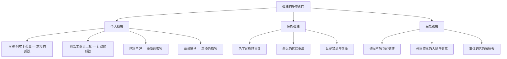

# 《百年孤独》深度读书笔记

> [!abstract] 全书速览
> 这是一部让你从第一句话就被拽入一个陌生又熟悉世界的小说。布恩迪亚家族七代人在马孔多小镇的兴衰，不是一段异域传奇，而是一面照见人类根本处境的镜子。你会在何塞·阿尔卡蒂奥·布恩迪亚对未知的狂热中看到自己的好奇心，在乌尔苏拉不停操持家务的身影里看到母亲的倔强，在奥雷里亚诺上校空洞的眼神里看到所有理想主义者的暮年。马尔克斯用一种将魔幻与现实浑然一体的叙事方式告诉你：==孤独不是某个人的遭遇，而是人类存在的底色==。

## 时代与作者

加西亚·马尔克斯1927年出生在哥伦比亚北部沿海的阿拉卡塔卡小镇。那个小镇曾经因为联合果品公司的香蕉种植园而繁荣一时，后来公司撤走，小镇迅速衰落成一个被遗忘的角落。这段由盛转衰的历史，日后几乎原封不动地映射在了马孔多的命运上。

马尔克斯的童年在外祖父母家度过，这段经历深刻塑造了他的文学基因。外祖父是参加过哥伦比亚内战的退役上校，喜欢带他去看马戏团和冰块——多年后，小说开篇那个"父亲带他去见识冰块的遥远下午"正来源于此。外祖母则是一位天才的叙事者，她用最平静、最不动声色的语气讲述最不可思议的事情：死去的亲人回来跟活人一起吃饭，某家的孩子因为诅咒长出了猪尾巴，隔壁的女人被风卷上了天。在她的讲述里，这些事跟邻居家的母鸡下了个双黄蛋一样稀松平常。

这种叙事态度——将不可思议之事视为理所当然——对马尔克斯的影响是决定性的。你可以在整部《百年孤独》中感受到这个外祖母的声音。每当叙述者提到某人升天、某人被鬼魂拜访、某个人的血液流过半个城镇的街道最后停在母亲面前时，语调始终是沉稳的、日常的，仿佛在说"今天天气不错"。正是这种不动声色的语调让魔幻获得了现实的重量。

> [!note] 创作背景
> 马尔克斯花了十五年时间想这本书该怎么写，直到1965年的某天开车去阿卡普尔科度假的路上突然顿悟——他要用外祖母讲故事的方式来写。他立刻调转车头回家，卖掉汽车，让妻子梅赛德斯靠向肉铺和面包店赊账维持全家生活，自己闭关十八个月写完了这部作品。完稿时他甚至付不起邮寄手稿的邮费。1967年出版后首印八千册两周内售罄，1982年为他赢得诺贝尔文学奖。你或许会注意到，妻子梅赛德斯的形象与小说中的乌尔苏拉有着惊人的相似——都是在男人沉迷于某种近乎疯狂的执念时，用双手和沉默维系着整个家庭的存续。

理解这个背景至关重要：《百年孤独》不是凭空的想象力游戏，而是一个拉丁美洲人试图用文学捕捉自己大陆命运的深切努力。三百年殖民统治、十九世纪的独立战争、二十世纪的军事独裁与内战、外国资本的经济掠夺——这一切被马尔克斯压缩进了一个家族和一个小镇的百年兴亡史。他曾说，拉丁美洲的现实远比任何文学虚构都更不可思议，作家的任务不是发明奇迹，而是忠实地记录现实本身的荒诞。

## 故事的核心张力

> [!tip] 核心冲突
> 《百年孤独》的底层张力是：**人类对联结、意义和爱的渴望**与**存在本身不可消除的孤独性**之间的永恒拉扯。

这种张力不是抽象的哲学命题，而是通过家族每一代人具体的人生选择来呈现的。何塞·阿尔卡蒂奥·布恩迪亚用科学和炼金术试图穿透世界的表象，想要找到某种终极的真相来锚定自己的存在——结果发现真相是地球在转圈，时间在循环，一切终归虚无，他疯了。乌尔苏拉选择了截然相反的路径：她不追问抽象的意义，而是扎进具体的日常——操持家务、养育后代、维系家族——但她活了一百多年之后发现，她用一辈子的劳作搭建起来的秩序早已在眼前坍塌，只是她假装看不见罢了。

奥雷里亚诺上校选择了行动。他把全部生命投入战争，相信战斗可以改变世界。但三十二场战争打完，他连自己最初为什么而战都记不清了。阿玛兰妲选择了另一种循环：她白天织寿衣，晚上拆掉，把死亡变成一个永远推迟的可控项目。美人蕾梅黛丝则选择了超脱——她根本不理解这个世界的规则，最后抓着一条床单升上了天空。

你仔细看就会发现，这些选择构成了一个完整的人类应对存在困境的光谱。从最积极的探索（求知）到最务实的建设（劳作），从最激烈的反抗（战争）到最消极的等待（织寿衣），从最决绝的超脱（升天）到最彻底的沉沦（疯狂）——每一种可能的路径都被尝试过了，而每一条路的终点都是孤独。

但没有一种选择能够真正驱散孤独。==科学走向疯狂，劳作走向失明，行动走向空洞，超脱走向消失。==这种张力之所以让几代读者为之动容，是因为你在读的时候会隐隐感觉到：这不只是马孔多的故事，这是你自己的故事。

## 人物命运

### 乌尔苏拉·伊瓜兰——用双手对抗命运的女人

如果说布恩迪亚家族是一棵不断分叉、不断枯萎的大树，乌尔苏拉就是那根拼命扎进土里的主根。她是这个家族真正的支柱，是混乱中唯一的秩序来源。

当丈夫沉迷于吉普赛人的磁铁、放大镜和炼金术时，是乌尔苏拉在养活全家。当儿子们死于战争、情欲和疯狂时，是她一次次把破碎的家重新拼起来。她活了超过一百年，见证了马孔多从一片荒芜的沼泽地变成繁华的小镇，又从繁华的小镇退化成被遗忘的废墟。

乌尔苏拉代表了人类最质朴也最顽强的那种信念：相信勤劳可以战胜命运，相信秩序可以对抗混乱，相信爱可以阻止诅咒。她一生都在警惕乱伦的发生——从新婚时穿上特殊的贞操裤拒绝与丈夫圆房，到晚年的反复叮嘱。那条贞操裤是整个家族悲剧的微型缩影：对命运的恐惧本身成了命运的一部分。但最终——在她死后——乱伦还是发生了，长着猪尾巴的孩子还是出生了。

> [!example] 关键细节
> 晚年失明之后，乌尔苏拉凭借记忆在房子里穿行，甚至比看得见时还要准确。她记得每一块地砖的位置，每一扇门的方向。这个细节既是对她惊人意志力的致敬，也是一个残酷的隐喻：她用意志力维持的秩序早已名存实亡，那个房子已经不是她记忆中的房子了——墙壁在剥落，后代在她看不见的角落里重复着她一生都在警惕的错误。最后她的身体缩成胎儿般大小，被曾孙们当作玩具摆弄——一个曾经撑起整个家族的女人，最后变成了被遗忘的小东西。

### 奥雷里亚诺·布恩迪亚上校——理想主义者的幻灭

上校是全书最复杂、最令人心痛的人物。他在母亲子宫里就开始哭泣，一出生就睁着眼睛打量这个世界，仿佛从一开始就预感到了自己将要面对的一切。

年轻时他爱上了蕾梅黛丝夫人，但她很快死于怀孕的并发症。这段短暂的爱情是他一生中唯一真正柔软的时刻，蕾梅黛丝夫人的死夺去了他与世界之间最后一根温柔的纽带。此后他投身自由派的革命战争，发动了三十二场武装起义，全部失败。他逃过十四次暗杀、七十三次埋伏和一次行刑。他与十七个女人生了十七个儿子，这十七个儿子后来在一夜之间全部被杀。

> [!tip] 核心洞察
> 战争结束后，奥雷里亚诺上校回到家中的作坊，开始日复一日地制作小金鱼。用金子做成鱼的形状，然后融化掉，然后再做，再融化。这个无限重复的行为是他存在状态的完美象征——==行动不再指向任何目的，只是用来填充时间、抵抗虚无的机械动作==。在人生最后的时刻，他站在栗树下——正是他父亲被绑在上面发疯至死的那棵树。父子二人以不同的方式在同一棵树下走向终结，命运的循环在此清晰可见。

上校的悲剧是所有理想主义者的寓言：当你把全部生命投入一个事业，却最终发现这个事业是空的，你还剩下什么？

### 阿玛兰妲——在爱与骄傲之间自我毁灭

阿玛兰妲是一个被嫉妒和骄傲毁掉的女人。她深爱意大利钢琴师皮埃特罗·克雷斯皮，但因为各种复杂的心理原因不断拒绝他的求婚。她的拒绝不是因为不爱——恰恰是因为太爱了，爱到害怕失去，于是先发制人地把对方推开。克雷斯皮最终绝望自杀。

你在阿玛兰妲身上看到的其实是一种极端的自我保护机制。她选择永远做拒绝的一方——只要她先拒绝别人，别人就无法拒绝她。这种策略在短期内确实保护了她，但长期来看，它制造了一座她自己永远走不出去的监狱。她用骄傲建造了高墙，然后发现自己被永远地关在了墙里面。

她最后的岁月献给了编织寿衣。白天织，晚上拆掉重织，与死亡达成了一种奇特的约定。当寿衣终于完成的那天，她平静地宣布了自己的死期。她是一个用骄傲把自己困在孤独里的人——而最讽刺的是，她清楚地知道自己在做什么，却无法停下来。这种清醒的自我囚禁或许是比无知更深的悲剧。

### 美人蕾梅黛丝——超越一切的纯净

她的美貌具有致命的吸引力，所有爱上她的男人都会以各种方式死于非命。但她本人对此毫无意识，她不穿衣服到处走动，不是出于叛逆，而是因为她根本不理解为什么要穿衣服。最后，她抓着一条白色床单升上了天空，消失在连鸟儿都飞不到的高处。

蕾梅黛丝升天的场景被马尔克斯写得异常轻盈——没有神迹，只是一阵风吹起了床单，她抓住了，然后就上去了。旁边的人抬头看了一眼，继续晒衣服。她代表了一种彻底的超脱：她的孤独是绝对的，但也是自足的。然而，这种超脱是以放弃全部人性为代价的。

### 何塞·阿尔卡蒂奥·布恩迪亚——求知者的疯狂

作为家族的创始人，他对知识的渴望近乎疯狂。最终摧毁他理智的是一个关于世界本质的发现：地球是圆的——如果地球是圆的，那就意味着无论朝哪个方向走，最终都会回到原点。空间是封闭的，时间是循环的，不存在真正的"远方"。这个认知摧毁了他，他被绑在栗树下，直到在一场黄色小花的雨中死去。他的命运是全书主题的一个浓缩表达：对终极真相的追求最终通向的不是启蒙，而是疯狂。

## 主题深层解读

### 孤独：不是情绪，而是存在的地基

布恩迪亚家族的每一个人都被困在自己的孤独里。何塞·阿尔卡蒂奥·布恩迪亚被绑在栗树下，用无人能懂的语言喃喃自语。蕾贝卡把自己关在房间里几十年。奥雷里亚诺上校反复做金鱼。阿玛兰妲独自缝制寿衣。每个人都有自己的栗树、自己的房间、自己的金鱼、自己的寿衣——那是他们与孤独相处的方式。

你可以把这些象征物想象成每个人为自己建造的小小庇护所。人需要一个动作、一件东西、一个仪式来"做"孤独——否则孤独就是纯粹的虚空，而虚空是人无法承受的。

更深一层来看，这种孤独不仅是个人的，也是集体的。马孔多从诞生之日起就是一个与世隔绝的存在。它与外部世界的每一次接触——吉普赛人、政府、内战、香蕉公司——都以灾难收场。==这个小镇的命运是整个拉丁美洲孤独处境的缩影。==

马尔克斯并没有给出克服孤独的方案。但认识到孤独是地基而非裂缝不是绝望——它是一种清醒。你不再需要假装自己不孤独，也不再需要强迫别人来填满你的孤独。这种清醒虽然不舒服，但它是真实的——而真实始终好过幻觉。

### 时间的循环：历史不是前进的，而是打转的

在这本书里，时间不是一条从过去流向未来的河，而是一个不断旋转的轮子。人物的名字在代际间重复，命运也在代际间重复。乌尔苏拉在晚年曾经惊恐地意识到这一点——她看着重孙们，发现他们正在犯自己孩子们当年犯过的错误。这个发现意味着她一辈子的努力全都是徒劳的，她不是在对抗命运，她只是命运剧本中的一个角色。

> [!warning] 循环的陷阱
> 这种循环不是简单的文学手法，而是马尔克斯对拉丁美洲历史的深刻判断：殖民者走了，独裁者来了；独裁者倒了，另一个独裁者又来了。革命成功了，压迫却依旧。每一代人都以为自己在创造新历史，实际上只是在重演古老的剧本。

名字的重复是这种循环最外在的标记，但更深层的重复发生在性格和命运的层面。第一代沉迷于炼金术而发疯，最后一代沉迷于羊皮卷手稿而毁灭。第一代在栗树下的孤独中结束，最后一代在飓风中的孤独中结束——仿佛整个百年只是一个圆。

而羊皮卷手稿的设定把这种循环推到了形而上的层面：布恩迪亚家族的全部历史早就被写好了。当最后一个奥雷里亚诺终于读懂了手稿，他发现自己正在阅读的正是自己的命运。循环在这里达到了绝对的完美：==理解就是终结，终结就是回到起点==。

### 记忆与遗忘：最可怕的死亡

小说中最令人不安的段落之一是失眠症的流行。整个马孔多的人突然都无法入睡，随之而来的是记忆的丧失。人们开始遗忘事物的名称和功能，不得不在每样东西上贴标签："这是牛，每天要挤奶"；"这是门"；甚至"上帝存在"。

想象一下那个场景。你早上起来，看着桌上的一个物体，你知道它在那里，但你不记得它叫什么，也不记得它是做什么用的。你照镜子，看到一张脸，但你不确定那是谁。当记忆消失，"你"也就消失了，剩下的只是一个没有历史、没有身份、没有方向的空壳。

> [!warning] 历史的教训
> 这个主题在香蕉公司大屠杀中达到最沉痛的高潮。三千名罢工工人被军队机枪扫射，尸体被火车运走，官方宣称什么都没有发生。幸存者何塞·阿尔卡蒂奥第二一遍遍讲述真相，一遍遍被否认，直到他自己也分不清那是记忆还是噩梦。权力的可怕之处在于——它不仅能杀死你的身体，还能杀死你对自己经历的确信。马尔克斯用文学为被抹去的记忆作证——==遗忘比死亡更可怕==。

### 爱的不可能与必要

小说中没有一段圆满的爱情。奥雷里亚诺上校与蕾梅黛丝夫人的爱被死亡截断。阿玛兰妲在爱与骄傲之间撕扯一生。佩特拉·科特斯与奥雷里亚诺第二的关系充满原始活力——他们做爱时牲畜就会繁殖得更快——但本质依然是瞬时的、无法在精神层面真正抵达对方。

全书最热烈也最悲剧的爱情发生在最后一代：奥雷里亚诺·巴比伦尼亚与阿玛兰妲·乌尔苏拉的乱伦之爱。这是全书中唯一一段不带保留的、两个人完全向对方敞开的爱，但它直接导致了长着猪尾巴的孩子出生和家族的毁灭。仿佛马尔克斯在说：最纯粹的爱也是最危险的力量——它能让你暂时忘记孤独，但那种遗忘的代价可能是一切。

马尔克斯传达的信息是矛盾的：==爱无法拯救人于孤独，但爱也许是孤独中唯一值得的东西==。

### 权力的荒诞与历史的嘲讽

内战的描写揭示了政治斗争的本质荒诞。奥雷里亚诺上校最终认识到："我们打了这么多年仗，只是为了不用把房子漆成蓝色。"而香蕉公司带来了繁荣的幻象，却也带来了大屠杀和集体遗忘。马孔多的居民在这个过程中从未拥有过真正的主动权。

这种权力批判有一个容易被忽略的维度：时间本身也是一种权力工具。谁控制了什么被记住、什么被遗忘、什么被定义为"进步"，谁就掌握了真正的权力。香蕉公司让马孔多的人相信，公司来之前是"落后"的，公司带来的才是"文明"。当公司撤走、繁荣消失之后，马孔多人发现自己既失去了旧的世界，也没有得到新的世界——他们被悬挂在时间的断裂处，前后都不着地。

## 文学手法

马尔克斯最为人称道的是魔幻现实主义的叙事语调。在他笔下，超自然事件和日常事件使用完全相同的语调。当蕾梅黛丝抓着床单升天时，叙述者没有表现出任何惊讶，就像在描述一个人出门散步。

> [!example] 叙事语调示例
> 当何塞·阿尔卡蒂奥·布恩迪亚死去时，黄色的小花从天而降覆盖了整个马孔多。这个细节被呈现得既诗意又日常，既不可思议又理所当然——这就是马尔克斯从外祖母那里学到的讲故事的方式。

还有一个容易被忽略的手法：马尔克斯对荒诞与精确的同时运用。上校逃过"七十三次埋伏"，这个数字精确得像档案记录，但本身又荒诞到不可能。你同时感到"这是真的"和"这不可能是真的"——而这种双重感受正是面对荒诞现实时的真实体验。

在叙事时间上，小说开篇的著名句子同时包含三个时间层：叙述的"现在"、行刑队的"将来"、见识冰块的"过去"。这个结构在全书中反复出现，形成类似音乐主题的回旋效果。每当叙述到达关键节点，马尔克斯就用"多年以后"或"许多年以前"来打破时间的线性——因为在这个被预言和记忆笼罩的世界里，==线性时间从来就不是真的==。

象征系统贯穿全书：栗树是孤独和疯狂的象征，黄色蝴蝶是爱情和死亡的信使，失眠症象征集体遗忘的危险，连绵大雨象征衰败和终结——那场持续了四年十一个月零两天的暴雨，淹没了香蕉公司带来的一切"现代化"成果，仿佛大自然在用最原始的方式清洗被玷污的大地。这些象征不是外加的装饰，而是从叙事内部自然生长出来的。

## 为什么今天还要读这本书

> [!tip] 当代意义
> 在社交媒体让你觉得自己与全世界"连接"着的时代，《百年孤独》提出了一个你也许不愿面对的问题：你真的不孤独吗？

你有几百个微信好友，你每天刷几个小时的短视频——但当你深夜放下手机，躺在黑暗中面对自己时，那种不可名状的空洞感是否依然在那里？马尔克斯温柔但坚定地告诉你：那个空洞是无法被填满的，但你可以学会与它共处。

这本书还提醒你记忆的重要性。在一个历史不断被改写的时代，马孔多的失忆症瘟疫是一个格外刺耳的警告。==当一个社会选择遗忘自己的创伤，它就注定会在不知不觉中重蹈覆辙。==

还有第三重意义：在一个效率至上的时代，你是否也像上校一样，把生命投入了一个你其实并不真正理解其意义的事业？你做的那些事情，是否也在不知不觉中变成了另一种"做金鱼再融化"？这不是劝你放弃努力，而是提醒你偶尔停下来，看看脚下的路是否通向你想去的地方。

## 延伸阅读

- [[《佩德罗·巴拉莫》]]（胡安·鲁尔福）：被马尔克斯称为对他影响最深的作品。这本薄薄的小说同样模糊了生与死的界限，用更凝练的篇幅探索了记忆、孤独和死亡的主题。理解了鲁尔福，你会更理解马尔克斯从哪里来。

- [[《霍乱时期的爱情》]]：马尔克斯的另一部杰作，探讨了孤独的另一面——那种跨越五十年、近乎偏执的爱的渴望。两本书对照着读，你会看到马尔克斯对人类处境更完整的思考。

- [[《族长的秋天》]]：马尔克斯用更激进的文学实验探讨独裁与权力。如果你被《百年孤独》的循环历史观所触动，这本书会带你更深入地理解拉丁美洲的政治创伤。
