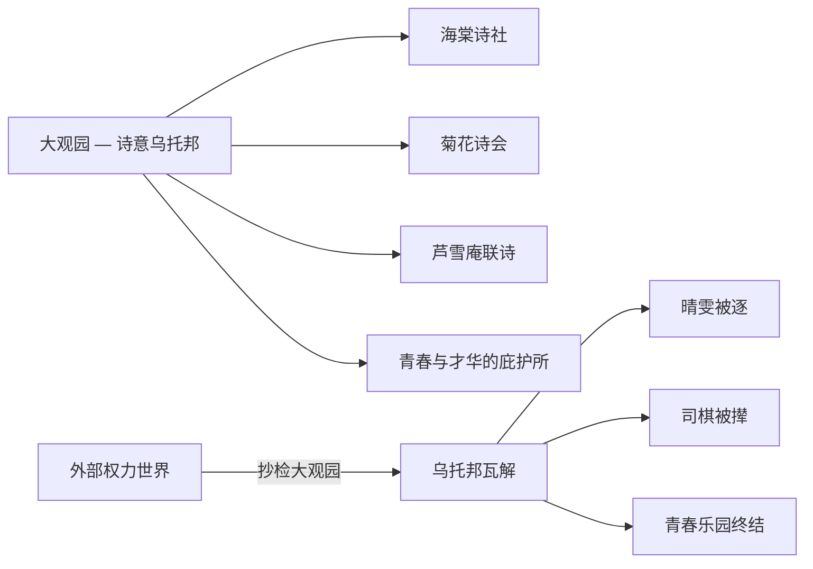

# 《红楼梦》深度读书笔记

> [!abstract] 全书速览
> 这是一部关于繁华与幻灭、情与空、真与假的史诗。它以贾宝玉、林黛玉、薛宝钗的情感纠葛为经线，以贾府由盛转衰为纬线，编织出一幅十八世纪中国封建社会的全景画卷。这不仅是一个家族衰败的故事，更是一部关于存在本身之虚实的哲学文本——==用最深情的笔触书写最无情的命运，用最绚烂的文字挽留最终将消逝的一切==。读完它，你会觉得自己真的在那个园子里住过，真的认识那些人，真的经历过那场大梦。

## 时代与作者

要理解《红楼梦》，你需要先知道曹雪芹是谁。

曹家曾是江南最显赫的家族之一。三代四人担任江宁织造长达六十年，负责为皇室采购丝绸织物，接驾康熙帝南巡四次。江宁织造不仅仅是一个经济职位，更是皇帝在江南的耳目和代理人，曹家实际上扮演着情报官和社交中心的双重角色。然而雍正年间，曹家被抄，家道中落。曹雪芹晚年贫困潦倒，"举家食粥酒常赊"，在北京西郊的黄叶村中写作此书，"披阅十载，增删五次"，未及完稿便抱憾去世。

> [!note] 核心理解
> ==曹雪芹不是在旁观繁华与幻灭，他是亲身经历过的人==。这使得他笔下的大观园不是想象出来的乌托邦，而是一个真实存在过、然后永远失去了的世界。他写大观园的每一道菜、每一首诗、每一件衣裳时，那种近乎执拗的详尽，不是在炫耀知识，而是在做最后的挽留——他知道这些东西都已经不在了，但他要把它们全部写下来，至少让它们在文字里活着。

在中国文学史上，《红楼梦》标志着叙事文学从类型化走向个人化、心理化、诗意化。一个人的一个眼神、一句话的语气变化、一顿饭时的座位安排——这些在传统小说中完全不值得书写的"小事"，在曹雪芹笔下成了最重要的事。在世界文学的坐标上，它常被与[[《追忆似水年华》]]和[[《安娜·卡列尼娜》]]相提并论。但《红楼梦》的独特之处在于：它融汇了诗词、戏曲、佛道哲学、饮食器物、建筑园林等庞大的文化体系，成为一部真正的百科全书式文学作品。

## 故事的核心张力

> [!tip] 三重张力
> 《红楼梦》的力量不在故事本身，而在故事背后那些不可调和的张力：**情与空**、**繁华与幻灭**、**真与假**。

**第一重张力：情与空。** 宝玉是一个"情痴"，对身边的女孩们怀有近乎宗教式的珍惜。但儒释道三家都告诉他：情是执着，是牵绊，是需要克服的东西。曹雪芹既不站在儒释道任何一边，也不简单地站在"情"这一边。他呈现的是：人之所以为人，恰恰在于有情；但有情者注定要承受更多的痛苦。这里面没有出路，只有真实。

**第二重张力：繁华与幻灭。** "好便是了，了便是好"。元春省亲是繁华的顶点，但在那最荣耀的夜晚，元春自己却一再哭泣——她在皇宫里的生活，名为荣耀，实为囚禁。繁华的顶点恰恰是悲剧的起点。但曹雪芹不是虚无主义者——他一边告诉你"到头一梦，万境归空"，一边用最精细的笔触让你触摸那个消逝世界的每一个纹理。==他的写作本身就是对繁华的深情挽留，这种矛盾恰恰赋予了作品无与伦比的情感力量。==

**第三重张力：真与假。** "假作真时真亦假，无为有处有还无。"贾府表面的繁华在崩溃之日露出"假"的底色，而被压抑的真情反因不被承认而成了"假"的。小说本身是"假"的（虚构），但它所承载的情感和洞察是"真"的——这种以假写真、借空言实的手法，是曹雪芹对文学本质的深刻理解。

## 人物命运

### 贾宝玉——石头、叛逆者与情的化身

他含玉而生，却厌恶仕途经济，鄙视"国贼禄鬼"。他说："女儿是水做的骨肉，男人是泥做的骨肉。"这里"女儿"代表的是一种未被功名利禄污染的存在状态。他对已婚妇女的态度与对未婚女孩截然不同——在他看来，婚嫁之后的女性已经被卷入了权力和利益的体系。

> [!tip] 关键理解
> 警幻仙子称宝玉为"天下古今第一淫人"——此处的"淫"不是肉欲，而是"天分中生成一段痴情"，即以情感去感应万物的能力。宝玉的情不是要"得到"谁，而是对所有美好存在的一种无差别的珍惜和心痛。这是理解整部《红楼梦》情感哲学的钥匙。

宝玉的核心矛盾在于：他生在一个他无法认同的世界里，却又无力改变或离开。他的"叛逆"是消极的——不是抗争，而是拒绝。大观园是他最后的避难所。宝玉最终出家——不是因为"看破红尘"，而是因为红尘中他所珍惜的一切都已经被毁灭了。黛玉死了，晴雯死了，大观园空了——他出家不是解脱，而是无处可去。==曹雪芹没有把出家写成光明的结局——宝玉的出家是带着无尽的遗憾和创伤的。==

### 林黛玉——诗意、孤绝与泪

黛玉之所以动人，在于她绝不伪装。她的真实是最大的魅力，也是最大的弱点——在一个需要圆滑才能生存的环境中，真实是一种危险的品质。

> [!example] 葬花吟
> "花谢花飞花满天，红消香断有谁怜？"她哀悼的不仅是落花，更是对自身命运的预感。黛玉不愿落花流入污水沟渠，所以要建花冢安葬——这种对美好事物的极端呵护，正是她整个人格的核心。

> [!warning] 重新理解"多疑"
> 黛玉的"小性儿"其实主要集中在与宝玉的关系上。在其他场合，她是幽默的、温暖的——教香菱写诗时展现了一个耐心无私的老师形象。她的多疑是针对性的而非无差别的，这恰恰说明她的情感是集中的、真挚的。

神话框架为她的命运提供了超验维度：她是绛珠仙草转世，下凡以一生眼泪偿还神瑛侍者的灌溉之恩。她的泪不是软弱，而是宿命性的还债——当泪还完的那一天，她的生命也就到了尽头。

### 薛宝钗——另一种完美与另一种悲剧

如果说黛玉代表了"真"，宝钗代表的则是"周全"。"好风凭借力，送我上青云"——她柳絮词中的野心，与日常的端庄含蓄形成微妙的裂缝。她吃的冷香丸暗示她需要用外在的"冷"压制体内的"热"——她不是没有激情，而是把激情压在了深处。

宝钗有一个被很多读者忽略的时刻：扑蝶。那是她最少女、最不设防的瞬间——但紧接着，她就因为听到丫鬟的私密对话而迅速恢复警觉，甚至不惜嫁祸黛玉。"周全"已经内化为她的本能。

==她做对了一切，却什么都没有得到——这也许是比黛玉更深层的悲剧。==黛玉至少得到了真爱；而宝钗得到了婚姻的外壳，却一辈子活在一个没有心的男人身边。

### 王熙凤——权力的艺术与毁灭

协理宁国府充分展示了她的行政能力——条分缕析地整顿规矩、赏罚分明。但她也放高利贷、逼死尤二姐。曹雪芹写凤姐的方式值得注意：他不做道德评判。"机关算尽太聪明，反算了卿卿性命。"她的悲剧不在于不够聪明，恰恰在于太聪明——聪明到能在对女性极度不公的体制内攫取最大限度的权力，但也聪明到不可能看不见这种权力的脆弱和代价。

### 晴雯与袭人——忠诚的两种形态

袭人的忠诚是服从式的——关心宝玉的世俗前途。晴雯的忠诚以她自己的方式呈现——病补雀金裘不是被命令，而是因为在乎。王夫人撵晴雯的真正原因不是行为，而是存在方式——一个丫鬟不应该那么好看、那么有个性。宝玉为她写了《芙蓉女儿诔》——他有能力写诔文悼念，却没有能力阻止她被逐。

## 主题深层解读

### "情"——超越儒释道的第四维度

曹雪芹为"情"正名。"情"不是通向其他目标的障碍，"情"本身就是存在的理由。但有情者注定要承受更多的痛苦。宝玉不是在悲剧发生后才悲伤，他是在繁华正盛时就已经预感到幻灭。这种"预悲"是全书最深沉的情感底色——不是悲观，而是一种过于敏锐的生命意识。

### 女性世界——大观园作为乌托邦

大观园是一种"时间之外"的空间——四季轮回只带来不同的花和不同的诗，生老病死被暂时隔离在高墙之外。但墙外的时间从未停止流动。

抄检大观园不是为了找到什么违禁物品，而是为了重新建立等级秩序的威权。"千红一窟（哭）"、"万艳同杯（悲）"——曹雪芹为这些女性立传，他的深情不是居高临下的怜悯，而是平等的、甚至是仰视的注视。

### 阶级、权力与日常暴力

> [!warning] 金钏与晴雯之死
> 金钏因一句话被逐、投井自尽——王夫人给了几两银子就当"体面"处理了，仿佛一条人命和一笔银子之间存在合理的兑换关系。晴雯因太出挑被撵出，病死。宝玉有能力写《芙蓉女儿诔》悼念，却没有能力阻止悲剧——他的优渥来自等级制度，他对制度的每一次反抗都受限于他不可能真正脱离它的事实。这种矛盾——享受着制度的好处却厌恶制度本身——是宝玉处境中最深刻的困境，也是曹雪芹对人性局限最诚实的书写。

### 色与空的交织

"好了歌"唱的是佛道层面的"空"。但甄士隐的注解更为悲凉："陋室空堂，当年笏满床"——这已不是抽象哲理，而是具体的、可触摸的失去。曹雪芹让"空"不再是一个宗教概念，而变成了一种你能在胸口感受到的钝痛。正是因为知道一切终将消逝，那些短暂的美好才更加珍贵。

## 文学手法

叙事结构包含三个层次：神话框架（女娲补天遗石）、现实框架（贾府兴衰）、诗谶系统（判词、曲文暗示命运）。曹雪芹不在乎"悬念"，你从第五回起就隐约知道了结局——这种"已知结局"的阅读体验反而加深了悲剧感。

> [!example] "不写之写"
> 黛玉初进贾府时的外貌——"两弯似蹙非蹙罥烟眉，一双似泣非泣含露目"——全用"似……非……"的模糊笔法，美是流动的、不可被占有的。而凤姐出场——"一双丹凤三角眼，两弯柳叶吊梢眉"——笔锋锐利、线条清晰。写法的差异本身就是人物性格的注脚。

诗词是叙事的有机组成部分。每个人物的诗作风格与性格严格对应，许多诗词暗含谶语功能——黛玉的"葬花吟"预示夭亡，探春的"日边红杏倚云栽"预示远嫁。人物语言的个性化同样登峰造极——==仅凭对话就能识别说话者==。这种个性化不是表面的口头禅差异，而是深入到思维方式和价值观层面的差异。

## 为什么今天还要读这本书

> [!tip] 当代意义
> 黛玉式的真实与宝钗式的周全之间的张力，至今仍然是每个人在社交生活中面临的核心困境。你在朋友圈里展示的，是真的你还是你希望别人看到的你？

宝黛之间"我懂你、你懂我，但我们不能在一起"的悲剧模式，在任何时代都能引发共鸣。大观园的毁灭是一个关于"成长的代价"的寓言——每个人都曾有过一个"大观园"——长大意味着离开它，而你永远无法回去。

最终，《红楼梦》的力量在于：==一个人用虚构的文字去挽留真实的记忆，用有限的生命去书写无限的深情==。曹雪芹知道他会输，但他还是写了。而正是这种明知徒劳仍要书写的姿态，赋予了文学以尊严。

## 延伸阅读

- [[《红楼梦的两个世界》]]（余英时）：从思想史角度解读"大观园内/外"的二元结构，是理解《红楼梦》深层意涵的重要学术著作。

- [[《追忆似水年华》]]（普鲁斯特）：与《红楼梦》在"记忆""时间""失去"主题上深度呼应。如果你被曹雪芹对逝去时光的哀悼所打动，普鲁斯特会给你另一种同样深刻的体验。

- [[《源氏物语》]]（紫式部）：日本古典文学巨著，同样书写贵族世界的繁华与幻灭，是东亚文学传统中与《红楼梦》遥相呼应的杰作。
