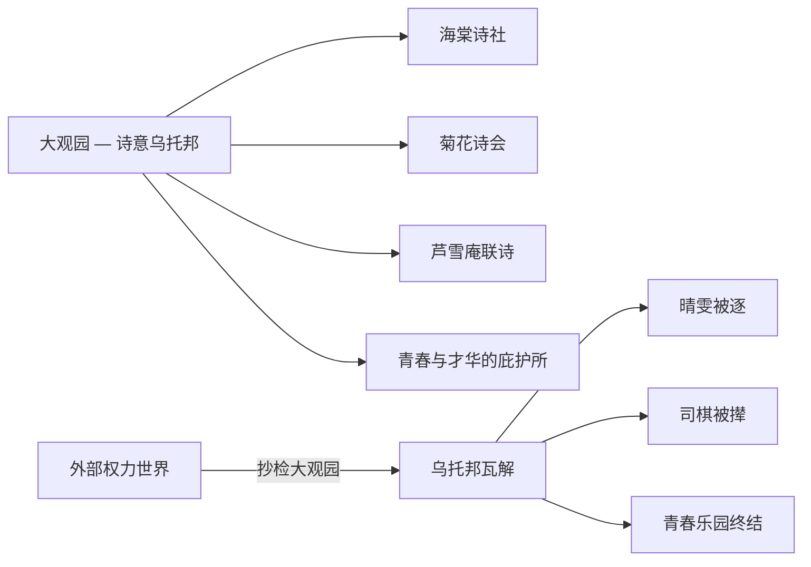

# 《红楼梦》深度读书笔记

> [!abstract] 全书速览
> 这是一部关于繁华与幻灭、情与空、真与假的史诗。它以贾宝玉、林黛玉、薛宝钗的情感纠葛为经线，以贾府由盛转衰为纬线，编织出一幅十八世纪中国封建社会的全景画卷。这不仅是一个家族衰败的故事，更是一部关于存在本身之虚实的哲学文本——==用最深情的笔触书写最无情的命运，用最绚烂的文字挽留最终将消逝的一切==。读完它，你会觉得自己真的在那个园子里住过，真的认识那些人，真的经历过那场大梦。

## 时代与作者

要理解《红楼梦》，你需要先知道曹雪芹是谁。

曹家曾是江南最显赫的家族之一。三代四人担任江宁织造长达六十年，负责为皇室采购丝绸织物，接驾康熙帝南巡四次。那是怎样的荣耀——"烈火烹油、鲜花着锦"。然而雍正年间，曹家被抄，家道中落。曹雪芹晚年贫困潦倒，"举家食粥酒常赊"，在北京西郊的黄叶村中写作此书，"披阅十载，增删五次"，未及完稿便抱憾去世。

> [!note] 核心理解
> ==曹雪芹不是在旁观繁华与幻灭，他是亲身经历过的人==。这使得他笔下的大观园不是想象出来的乌托邦，而是一个真实存在过、然后永远失去了的世界。他不是在写小说，他是在用文字对抗时间。

在中国文学史上，《红楼梦》标志着叙事文学从类型化走向个人化、心理化、诗意化。在世界文学的坐标上，它常被与[[《追忆似水年华》]]和[[《安娜·卡列尼娜》]]相提并论。但《红楼梦》的独特之处在于：它融汇了诗词、戏曲、佛道哲学、饮食器物、建筑园林等庞大的文化体系，成为一部真正的百科全书式文学作品。

## 故事的核心张力

> [!tip] 三重张力
> 《红楼梦》的力量不在故事本身，而在故事背后那些不可调和的张力：**情与空**、**繁华与幻灭**、**真与假**。

**第一重张力：情与空。** 宝玉是一个"情痴"，对身边的女孩们怀有近乎宗教式的珍惜。但儒释道三家都告诉他：情是执着，是牵绊，是需要克服的东西。曹雪芹既不站在儒释道任何一边，也不简单地站在"情"这一边。他呈现的是：人之所以为人，恰恰在于有情；但有情者注定要承受更多的痛苦。

**第二重张力：繁华与幻灭。** "好便是了，了便是好"。元春省亲是繁华的顶点，但在那最荣耀的夜晚，元春自己却一再哭泣。繁华的顶点恰恰是悲剧的起点。但曹雪芹不是虚无主义者——如果他真的认为一切都是空的，他就不会花那么大的力气去描写大观园中的每一首诗、每一道菜。==他的写作本身就是对繁华的深情挽留。==

**第三重张力：真与假。** "假作真时真亦假，无为有处有还无。"贾府表面的繁华在崩溃之日露出"假"的底色，而被压抑的真情反因不被承认而成了"假"的。

## 人物命运

### 贾宝玉——石头、叛逆者与情的化身

他厌恶仕途经济，鄙视"国贼禄鬼"。他说："女儿是水做的骨肉，男人是泥做的骨肉。"这里"女儿"代表的是一种未被功名利禄污染的存在状态。

> [!tip] 关键理解
> 警幻仙子称宝玉为"天下古今第一淫人"——此处的"淫"不是肉欲，而是"天分中生成一段痴情"，即以情感去感应万物的能力。这是理解整部《红楼梦》情感哲学的钥匙。

宝玉最终出家。从佛学角度看是"悟"；从心理角度看是对不可承受之痛苦的极端逃避；从社会角度看是一个不愿融入体制的个体唯一可能的出路。==曹雪芹没有把出家写成光明的结局——宝玉的出家是带着无尽的遗憾和创伤的。==

### 林黛玉——诗意、孤绝与泪

黛玉之所以动人，在于她绝不伪装。她的真实是最大的魅力，也是最大的弱点——在一个需要圆滑才能生存的环境中，真实是一种危险的品质。

> [!example] 葬花吟
> "花谢花飞花满天，红消香断有谁怜？"她哀悼的不仅是落花，更是对自身命运的预感——她就是那朵无依无靠的落花。

> [!warning] 重新理解"多疑"
> 黛玉的"小性儿"常被诟病。但如果你是一个孤女，寄居在庞大的家族中，没有父母撑腰，在这种处境下，不多疑才是不正常的。她的敏感是一个处于不安全境地的聪明人对威胁的敏锐感知。

### 薛宝钗——另一种完美与另一种悲剧

如果说黛玉代表了"真"，宝钗代表的则是"周全"。"好风凭借力，送我上青云"——她柳絮词中的野心，与日常的端庄含蓄形成微妙的裂缝。她住的蘅芜苑"雪洞一般"——这种极端朴素是自律还是自我否定？

她最终嫁给了宝玉，但宝玉的心不在她身上。==她做对了一切，却什么都没有得到——这也许是比黛玉更深层的悲剧。==

### 王熙凤——权力的艺术与毁灭

她是贾府的实际管家人，精明强干到令人畏惧。曹雪芹写凤姐的方式值得注意：他不做道德评判。他让你看到她的精明能干，也让你看到她的残忍，但从不跳出来说"凤姐是好人还是坏人"。"机关算尽太聪明，反算了卿卿性命。"

## 主题深层解读

### "情"——超越儒释道的第四维度

曹雪芹为"情"正名。"情"不是通向其他目标的障碍，"情"本身就是存在的理由。但有情者注定要承受更多的痛苦。宝玉不是在悲剧发生后才悲伤，他是在繁华正盛时就已经预感到幻灭。这种"预悲"是全书最深沉的情感底色。

### 女性世界——大观园作为乌托邦

"千红一窟（哭）"、"万艳同杯（悲）"——金陵十二钗各有各的复杂性。曹雪芹为这些女性立传，让她们的生命不至于无声无息地消失。

### 阶级、权力与日常暴力

> [!warning] 金钏与晴雯之死
> 金钏因一句话被逐、投井自尽。晴雯因太出挑被王夫人撵出，病死。宝玉有能力写《芙蓉女儿诔》悼念，却没有能力阻止悲剧发生。他的"情"是真诚的，他的"无力"同样是真实的——这正是曹雪芹作为作家的诚实。

### 色与空的交织

正是因为知道一切终将消逝，那些短暂的美好才更加珍贵。曹雪芹用最深情的笔触书写最终将消逝的一切，这既是眷恋，也是告别。

## 文学手法

叙事结构包含三个层次：神话框架（女娲补天遗石）、现实框架（贾府兴衰）、诗谶系统（判词、曲文暗示命运）。曹雪芹不在乎"悬念"，他在乎的是你知道结局之后，怎样去体味过程中的每一个细节。

> [!example] "不写之写"
> 黛玉初进贾府时的外貌描写——"两弯似蹙非蹙罥烟眉，一双似泣非泣含露目"——全用"似……非……"的模糊笔法，让你永远无法在头脑中固定一个黛玉的形象。这正是曹雪芹的用意：黛玉之美是不可定义的、流动的。

诗词是叙事的有机组成部分。每个人物的诗作风格与性格严格对应，许多诗词暗含谶语功能。人物语言的个性化同样登峰造极——==仅凭对话就能识别说话者==。

## 为什么今天还要读这本书

> [!tip] 当代意义
> 黛玉式的真实与宝钗式的周全之间的张力，至今仍然是每个人在社交生活中面临的核心困境。你在朋友圈里展示的，是真的你还是你希望别人看到的你？

大观园的毁灭是一个关于"成长的代价"的寓言。每个人都曾有过一个"大观园"——长大意味着离开它，而你永远无法回去。

最终，《红楼梦》的力量在于：==一个人用虚构的文字去挽留真实的记忆，用有限的生命去书写无限的深情==。曹雪芹知道他会输，但他还是写了。而正是这种明知徒劳仍要书写的姿态，赋予了文学以尊严。

## 延伸阅读

- [[《红楼梦的两个世界》]]（余英时）：从思想史角度解读"大观园内/外"的二元结构，是理解《红楼梦》深层意涵的重要学术著作。

- [[《追忆似水年华》]]（普鲁斯特）：与《红楼梦》在"记忆""时间""失去"主题上深度呼应。如果你被曹雪芹对逝去时光的哀悼所打动，普鲁斯特会给你另一种同样深刻的体验。

- [[《源氏物语》]]（紫式部）：日本古典文学巨著，同样书写贵族世界的繁华与幻灭，是东亚文学传统中与《红楼梦》遥相呼应的杰作。
