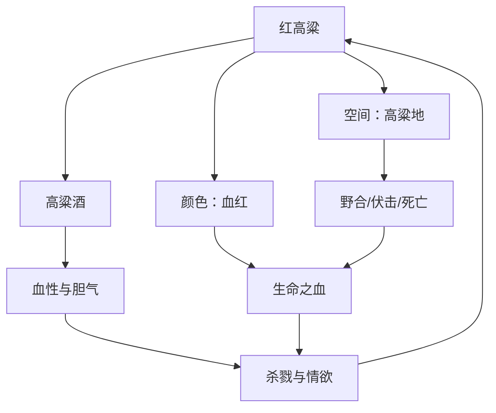
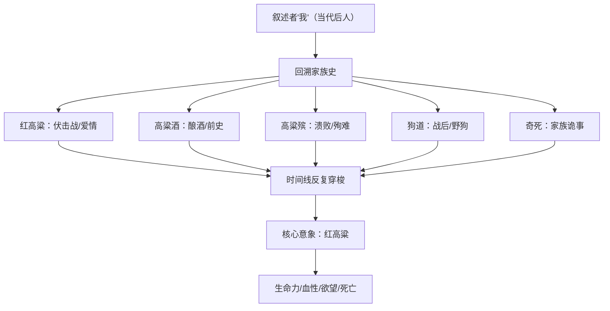

# 《红高粱家族》深度读书笔记

> [!abstract] 全书速览
> 这是一部用==血色==和==野性==铸就的家族传奇。莫言以山东高密东北乡为舞台，借"我爷爷"余占鳌与"我奶奶"戴凤莲的一生，讲述了一种已经从大地上消失的生命状态——那些人杀人、酿酒、做爱、抗日，一切遵循本能而非道德，在红高粱地里活出了最浓烈也最粗粝的人生。你读到的不是一部常规的抗战小说，而是对==人类原始生命能量==的赞歌与挽歌。小说由《红高粱》《高粱酒》《高粱殡》《狗道》《奇死》五部中篇组成，以"我"（孙辈）的视角回溯祖辈传奇，在历史与想象之间自由穿梭。莫言要追问的是：当文明驯服了野性，当杂交高粱取代了血红的纯种高粱，我们在获得秩序与安全的同时，是否也失去了某种不可替代的东西？

---

## 时代与作者

1986年，中国文学正站在一个十字路口。"伤痕文学"和"反思文学"的政治叙事已经走到尽头，"寻根文学"和"先锋文学"正在生长。就在这个节点上，莫言的《红高粱》横空出世，像一声炸雷劈开了中国当代文学温文尔雅的外壳。

莫言生于山东高密，那片土地上的风物、方言、气味和人情渗透了他所有的写作。他公开承认受到[[《百年孤独》]]的作者马尔克斯和福克纳的深刻影响——但他不是在模仿。他做的事情更像是嫁接：把拉美魔幻现实主义的叙事方法移植到中国北方乡土的根茎上，长出了一片完全属于高密东北乡的文学高粱地。

你需要理解这个创作背景才能理解这部小说的破坏力。在几十年的政治规训之后，中国文学中的"英雄"都是正确的、崇高的、被组织领导的。莫言偏要让土匪当主角，让酿酒女人当灵魂，让杀人放火的民间豪杰成为叙事的绝对中心。他需要用这些人身上那股==不受任何规训束缚的生命力==，给已经贫血的文学输一管野血。

1987年张艺谋将《红高粱》改编为电影，获柏林电影节金熊奖——这是中国电影首次拿下欧洲三大电影节最高奖项。2012年莫言获诺贝尔文学奖，授奖词提到他"将魔幻现实主义与民间故事、历史和当代社会融为一体"。《红高粱家族》正是这一切的原点。

---

## 故事的核心张力

> [!tip] 核心冲突
> 《红高粱家族》的底层张力不是抗日与侵略的对抗，而是==生命力与规训、野性与文明、传说与历史==之间永恒的角力。

这部小说表面上讲的是抗日，但如果你只看到这一层，你就只抓住了它的皮。真正驱动整部作品的是三重更深层的冲突。

第一重是==生命力与文明规训的冲突==。余占鳌和戴凤莲代表的是一种前文明的存在方式——他们的杀人、饮酒、做爱、复仇都遵循本能而非教条。莫言以近乎崇拜的笔触来写这种野蛮，因为他看到了一个事实：现代文明在给予人类安全与秩序的同时，也阉割了人类最原始的生命能量。他的整本书就是在追问——这笔交易到底值不值。

第二重是==代际之间退化与强悍的冲突==。叙述者"我"作为当代后人回望祖辈，不断发出自我贬抑的感叹。后代的萎靡与祖辈的血性形成刺眼的反差。曾经高大血红的高粱如今被矮小的杂交品种取代——这不是农业叙事，而是精神隐喻。高粱的退化就是人的退化。

第三重是==民间叙事与官方历史的冲突==。在正统历史中，抗战是在正确领导下由人民军队完成的伟业。莫言说：不。在高密东北乡，打日本人的是一群土匪、酒鬼和村妇。他们不理解什么政治意义，他们只知道有人侵入了自己的地盘、杀了自己的人。这是一种领地性的、动物性的反抗，但正因为如此，比任何主义都更真实、更有力量。

---

## 人物命运

### 余占鳌——被文明驱逐的超人

余占鳌是莫言文学世界中最具爆发力的男性形象。轿夫出身，杀人之后成为土匪头子，在抗战中组织民间武装，一生杀人无数、女人无数、酒无数。

> [!warning] 关键洞察
> 你不应该试图用善恶二元论来评判余占鳌。莫言创造这个角色不是让你模仿，而是让你感受到一种==文明社会已经丧失的生命形态==。

余占鳌最核心的特质是**不犹豫**。他要一个女人，就在高粱地里把她放倒；他要杀一个人，就拿刀割了他的喉咙；他要打日本人，就在路边挖坑埋土雷。这种不犹豫不是鲁莽，而是身体与意志完全合一的状态——人类在被教育、被规训、被社会化之前的原始行动模式。

他的爱与杀是一体两面的。他为了得到戴凤莲可以杀人（杀死单家父子），为了保卫家园可以组织伏击战，甚至为了维护尊严可以杀自己的部下。莫言不做道德判断，他呈现的是一种前文明的行为逻辑：在那个世界里，力量就是正义，敢爱敢杀就是英雄。

余占鳌的悲剧在于，他的生命力找不到一个能容纳它的秩序。在封建社会他是土匪，在革命叙事里他是"历史的糟粕"，在现代文明中他是野蛮的遗存。但莫言赋予他一种悲壮的尊严：他知道自己将被历史遗忘或丑化，但他依然按照自己的方式活着、杀着、爱着。

### 戴凤莲——红高粱的人格化身

戴凤莲是中国现当代文学中最复杂、最光彩照人的女性形象之一。她既是"我奶奶"——一个家族长辈，又是情欲自主的独立女性；既是酒坊的女掌柜，又是抗日战场上的殉道者。

> [!note] 人物深度
> 戴凤莲身上集合了==母亲、情人、女王和烈士==四种角色，而这四种角色之间不存在矛盾——它们共同构成了一个完整的、丰沛的生命。

她的出嫁是理解这个人物的钥匙。她被父亲嫁给了麻风病人单扁郎——一个令人绝望的安排。花轿里的她愤怒到几乎要冲破文字。但当轿夫余占鳌在高粱地里放倒她时，她没有反抗。不是因为软弱，而是因为她的身体和意志在那一刻达成了一致：与其嫁给一个麻风病人行尸走肉地活着，不如在高粱地里与一个强壮的男人结合。这是一个被压迫者的主体性选择。

戴凤莲最动人的特质是她的**坦荡**。她不为自己的任何选择感到羞耻——不为高粱地里的结合，不为后来与其他男性的关系，不为自己的权力欲望。她临死前的内心独白接近祈祷的语气：她对天说话，回顾自己的一生，不回避自己的情欲和"不贞"。她说自己"什么都不怕""什么都不后悔"。在一个要求女性"三从四德"的文化中，她活出了一种==超越性别规训的自由==。

她的死是全书最具仪式感的段落之一。她在给战士送饭的途中被流弹击中，血染红高粱。她临死前想的不是国家大义，而是自己的一生——她的情欲、她的遗憾、她对生命的眷恋。死亡不是为了某个崇高目的的牺牲，而是一个丰沛生命的终结。

### "我"——退化的后代与不可靠的叙述者

叙述者"我"不仅是讲述者，更是一面当代之镜。他反复感叹自己这一代人的萎靡和退化，将自己与祖辈进行不利于自己的比较。这种自我贬抑不是作秀，而是莫言借"我"表达的一种深层文化焦虑：==现代化、城市化、文明化的过程是否同时也是一个去势的过程？==

"我"的不可靠叙事同样值得深思。他说"据说""也许""我愿意相信"，这些词汇暴露了一个事实：关于祖辈的故事已经无法被完整还原，它们在传播中被夸大、被神话化、被注入了后人的想象和愿望。但故事的真相不重要——重要的是后人需要这些故事来定义自己的来处。

### 罗汉大爷——最极端的生命见证

罗汉大爷是酒坊的忠诚伙计，他被日军活剥皮的段落是中国当代文学中最令人难以忍受的场景之一。但莫言写了一个非凡的细节：罗汉大爷在被剥皮的过程中==一直在骂日本人==。他骂到最后一口气，骂到声音变成气泡从血肉中涌出。这个普通农民在极端痛苦中展现出的不屈，正是高密东北乡精神的极致体现——不是英雄主义，而是纯粹的生命力在死亡面前的最后爆发。

---

## 主题深层解读

### 主题一：原始生命力——被文明压抑的野性

> [!example] 文本细读
> 小说开篇的高粱地野合场景，是中国当代文学中最大胆的段落之一。余占鳌把戴凤莲放倒在高粱地里，周围的高粱"齐刷刷地跪倒"为他们让出一块空地。这不是色情，也不是浪漫——它是==仪式性的==。高粱的"跪倒"赋予了这个行为一种天地为证的庄严感。

莫言之所以要歌颂土匪式的暴力与情欲，是因为他看到了1980年代中国社会和文学中的一种生命力匮乏。几十年的政治规训不仅压制了人的自由意志，还阉割了文学的血性。莫言需要一剂猛药——通过塑造余占鳌和戴凤莲这样不受道德规训束缚的人物，让他们的杀人、饮酒、做爱、复仇都散发出一种粗犷的美感。

但这种生命力的书写始终伴随着**暴力**。你需要区分两种暴力书写：一种是将暴力作为手段来制造快感，另一种是将暴力作为生命现象来呈现其内在的能量结构。莫言属于后者。他笔下的暴力不是让你模仿的，而是让你感受到自身体内被压抑的那股力量——那种在办公室格子间里、在社交媒体的小心翼翼中被层层包裹的东西。

### 主题二：红高粱——贯穿全书的超级意象

莫言选择高粱而非小麦、玉米或其他作物，是因为高粱本身的物理特性——==高大、血红、密集、粗犷==——与他要表达的生命观形成了天然的同构关系。高粱不是精致的作物，它是北方大地上最蛮横的植物。

高粱在小说中不是背景，而是**参与者**。它为野合提供场地，为伏击战提供掩护，为酿酒提供原料，为死亡提供墓地。莫言赋予高粱人格、情感甚至意志——高粱会"跪倒"，会"发出悲伤的呻吟"，会"骄傲地挺立"。在高密东北乡，人与植物之间的界限是模糊的。

小说结尾处"我"的哀叹是全书最沉痛的段落之一：曾经高大血红的高粱被矮小的杂交品种取代。这不仅仅是农业的变迁——高粱的命运就是人的命运。杂交高粱产量更高、更"实用"，但它失去了纯种高粱的血红与高大。人也一样：现代人更安全、更长寿、更"文明"，但也更萎靡、更温吞、更缺乏血性。

### 主题三：历史的民间重写——谁有权讲述抗战

> [!tip] 核心洞察
> 莫言要挑战的是官方叙事对抗战记忆的垄断。通过让土匪成为英雄、让官方话语缺席，他暴露了"正史"的建构性，并提供了一种来自民间的、身体化的、充满矛盾的==替代性历史叙事==。

墨水河伏击战是全书叙事的高潮之一。莫言没有按传统战争小说的模式来写（英雄运筹帷幄、英勇杀敌），而是将大量篇幅用于描写战斗中的混乱、恐惧和生理反应。子弹击中人体时的声音、肠子流出来的触感、血液的气味——莫言用几乎病态的精确度描写了战争的感官层面。这不是猎奇，而是把战争从抽象概念还原为肉体经验。

更值得注意的是戴凤莲在伏击战中的死。她不是在想国家大义，而是在回忆自己的一生。死亡不是宏大叙事中的一个"牺牲"符号，而是一个具体的、丰沛的生命的终结。莫言用这种写法告诉你：每一个死在战争中的人，都不是统计数字，而是一整个宇宙的消失。

### 主题四：死亡与殉葬——生命的另一种强度

莫言笔下的死亡不是生命的反面，而是==生命的另一种强度==。越是惨烈的死亡，越凸显出生命力的强度。一个平静老死的人不会让你感受到生命的力量，但一个被活剥皮还在骂人的人会。

> [!warning] 触目惊心的场景
> 罗汉大爷被日军活剥皮的段落，莫言以几乎冷静到残忍的笔触一刀一刀地描写了全过程。但在这个极端暴力的场景中，罗汉大爷==始终在辱骂日本人==，骂到声音变成气泡从血肉中涌出。

《狗道》中战后野狗啃食尸体的场景提供了另一种死亡视角。人死后身体回归自然，成为动物的食物。这种书写消解了死亡的神圣性，将死亡还原为纯粹的生物学事件。在莫言的世界里，没有灵魂升天、没有来世轮回，只有肉体的分解和物质的循环。这种冷酷的唯物主义，反而赋予了生命本身更大的重量——正因为死后什么都没有，活着的每一秒才弥足珍贵。

### 主题五：感官写作——身体作为认知方式

莫言之所以如此密集地调动视觉、嗅觉、味觉、触觉和听觉，是因为在他的文学观中，==思想是廉价的，感觉才是真实的==。你可以用理性来伪装历史、歪曲记忆，但身体的感觉不会说谎。

以嗅觉为例——全书充满各种气味：高粱的腥甜味、高粱酒发酵时的醇厚味、血液的铁锈味、尸体腐烂的臭味、日本人身上的异族气味。这些气味不是修饰性的描写，而是叙事的驱动力。在很多段落中，是气味引发了记忆，是气味区分了敌我，是气味标记了生与死的边界。

全书的主色调是**红色**——高粱的红、血的红、太阳的红、火的红、高粱酒的红。这种红色的密集铺排不仅是视觉效果，更是一种情绪基调：灼热、激烈、浓稠、不可调和。当你读完这本书，闭上眼睛，最先浮现的一定是那片铺天盖地的红。

---

## 文学手法

### 叙事结构：多声部的家族叙事

《红高粱家族》采用了极为复杂的叙事结构：以"我"（第三代后人）的视角回溯家族历史，但"我"并非全知叙述者——时而依赖传闻，时而凭借想象，时而以近乎通灵的方式"看见"祖辈的生活。

这种叙事策略实现了四重功能。

**时间的自由跳跃**。小说的时间线不是线性的，而是在抗日战争的"当下"、余占鳌和戴凤莲的前史、以及"我"所处的当代之间反复穿梭。这种跳跃呈现的是记忆本身的运作方式——记忆从来不按时间顺序排列，它以情感强度为索引。

**不可靠叙事的魅力**。"我"不断提醒你他的叙述是二手的、三手的，甚至是想象的。这种不可靠性并非削弱了故事的真实感，反而增强了它的神话感。当你知道一个故事可能被夸大了，你反而更想听。

**代际对话**。"我"作为当代人回望祖辈，不断发出感叹和追问。后代的退化与祖辈的强悍形成对比，当代的萎靡与过去的血性形成反差。这种代际视角制造的张力贯穿全书。

**五部曲的交织**。《红高粱》《高粱酒》《高粱殡》《狗道》《奇死》五个部分不是五个独立的故事，而是围绕同一组人物和事件的不同切面——同一个生命场域的五个维度。

### 语言风格：汹涌、浓稠、不节制

莫言的语言可以用四个词概括：汹涌、浓稠、感官化、不节制。他的句子往往很长，充满各种感官细节的堆叠，读起来像一条浑浊而有力的河流。

他不追求精确和节制（那是余华和苏童的路线），而是追求==过剩和泛滥==。他写一个气味，会用三四个比喻来形容；写一个场景，会从视觉、嗅觉、触觉、听觉多个维度同时轰炸。这种写法的风险是显而易见的——容易流于冗赘。但莫言的天才在于：他的冗赘本身具有一种压迫性的美感，就像你站在一片无边无际的高粱地里，四面八方都是红色，你无处逃避，只能被淹没。

莫言大量使用山东高密方言和北方口语，使小说的语言具有强烈的地域性和肉体感。这些方言词汇在普通话语境中显得粗砺、不雅，但正是这种粗砺感赋予了文本一种不可替代的质地——它提醒你，这个故事不是从书斋里写出来的，而是从泥土里长出来的。

### 魔幻与现实的无缝缝合

莫言在叙事中经常不加预警地从现实滑入魔幻。人可以和鬼对话，高粱可以有意识地行动，死者的灵魂可以被活人感知。这种转换是无缝的——莫言不用"突然""奇怪的是"这类提示语来标记魔幻的边界，因为在他的世界观中，现实与魔幻之间根本没有边界。对高密东北乡的人来说，鬼魂是日常，神灵是邻居，超自然事件是生活的一部分。这不是"魔幻现实主义"的技巧，而是民间认知方式的如实呈现。

---

## 为什么今天还要读这本书

读《红高粱家族》不是为了了解抗战历史，也不是为了学习什么人生道理。你读这本书，是为了**感受**。

当你在城市的格子间里被KPI压得喘不过气，当你在社交媒体上小心翼翼地经营人设，当你发现自己连愤怒和欲望都变得温吞——这时候读一读这本书，让余占鳌和戴凤莲那种不计后果、不问对错、只遵循本能的生命冲动，短暂地在你体内复活一下。

> [!tip] 阅读的意义
> 这本书最厉害的地方在于：你读完之后不会变成余占鳌，但你会感觉到自己身体里有某种东西被唤醒了。那种东西平时被教养、礼貌、规则压在最底下，但它从来没有消失。莫言把它挖了出来，让你看了一眼。

莫言在小说结尾的哀叹是绝望的：杂交高粱取代了纯种高粱，当代人已经回不到祖辈的生命状态了。这种不可逆的丧失，才是全书最深层的悲剧。但意义恰恰在于书写本身——当现实中的高粱已经矮化，文学中的高粱还可以保持血红和高大。文学是对抗退化的最后防线。它不能改变现实，但它可以保存一种记忆、一种想象、一种生命曾经可以抵达的强度。

这部小说也提醒你：历史不只有一种讲法。官方叙事、精英叙事之外，还存在着民间的记忆和想象。那些"不够英雄"或"不够正确"的故事，那些粗粝的、矛盾的、不可被整理成直线的人和事，同样是历史的一部分。它们值得被讲述，值得被倾听。

---

## 延伸阅读

- [[《丰乳肥臀》]]：莫言的另一部史诗巨作，以母亲形象为核心覆盖百年中国历史，和《红高粱家族》形成家族叙事的深层互文——如果说《红高粱家族》写的是生命力的爆发，《丰乳肥臀》写的是生命力的承受
- [[《白鹿原》]]：陈忠实的家族史诗，可与《红高粱家族》形成关中与山东的地域对照，同样书写民间生命力在历史洪流中的命运，但陈忠实更关注秩序的瓦解，莫言更关注野性的歌颂
- [[《百年孤独》]]：马尔克斯的杰作，莫言自述深受其影响，两者在魔幻现实主义手法和家族叙事上有深层对话，但马尔克斯的基调是宿命与孤独，莫言的基调是血性与生命力
- [[《活着》]]：余华以极简叙事呈现苦难，与莫言的极繁叙事形成方法论上的对照，两者共同拒绝把人简化为意识形态的符号
