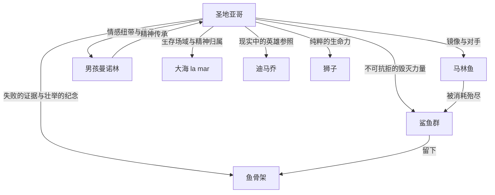

# 《老人与海》深度读书笔记

> [!abstract] 全书速览
> 一个古巴老渔夫，连续八十四天一无所获，在第八十五天独自驶入深海，与一条巨大的马林鱼搏斗了三天两夜后将其制服，却在返航途中被接踵而至的鲨鱼群吃光了全部鱼肉，最终只带回一副巨大的鱼骨架。这部仅两万六千字的中篇小说，是海明威"冰山理论"的极致实践——它几乎不解释任何东西，只是把一个老人、一条大鱼、一片空旷无垠的大海摆在你面前，让你自己去感受什么叫做"被毁灭但不被打败"。它写的是捕鱼，谈的却是人在面对注定的失去时，如何守住自己的尊严。

## 时代与作者

海明威写《老人与海》的时候已经五十三岁。他的身体因为早年的战争创伤、两次飞机失事和长年酗酒而每况愈下。在此之前，他经历了长达十二年的创作低潮——1940年的《丧钟为谁而鸣》获得好评之后，1950年出版的《过河入林》遭到批评界几乎一致的差评，很多人断言海明威已经写完了。

1952年，《老人与海》发表于《生活》杂志，两天内售出五百三十万份。1953年获普利策小说奖，1954年海明威凭借此作及其整体文学成就获诺贝尔文学奖。瑞典文学院在授奖词中特别提到了他"精通现代叙事艺术"。

故事的原型来自真实的古巴渔民生活。海明威从1932年起在哈瓦那附近的科希玛尔小渔村居住了二十多年，与当地渔夫交往密切。早在1936年的一篇杂志文章中他就提到了这个老人与大鱼的故事，但花了整整十六年才将它写成小说。据说他把文稿重写了两百多遍，每一个句子都经过反复锤炼。

> [!note] 创作背景
> 理解这段经历，你会对小说多一层感受：==圣地亚哥不只是一个虚构的老渔夫，他在某种程度上是海明威的自画像==——一个感到自己正在衰老的创作者，用最后的力量搏出了一部杰作，却深知自己可能无法保住此后的创作力量。老人与大鱼的搏斗，未尝不是海明威与自己衰退的才华之间的对抗。七年后，海明威在爱达荷州的家中饮弹自尽。

## 故事的核心张力

> [!tip] 核心冲突
> 《老人与海》的底层张力不是"人对抗自然"这么简单，而是一个更深的问题：==当你竭尽全力仍然失败时，你如何定义自己？==

海明威在这部小说中拆解了"胜利"与"失败"的传统定义。从世俗标准看，圣地亚哥彻底失败了——他带回的只是一副毫无经济价值的鱼骨架。但从另一个维度看，他从未被打败过——在搏斗的每一个瞬间，他都没有放弃。

这构成了小说最深刻的张力：物质世界的法则（你无法对抗鲨鱼群的数量）与精神世界的法则（你可以选择不投降）之间的永恒对峙。海明威不允许圣地亚哥在任何一个维度上获得完整的胜利——他必须承受物质上的失败，但他可以保有精神的完整。

小说中最著名的那句话——"一个人可以被毁灭，但不能被打败"——正是这种张力的凝缩。身体的毁灭属于物质世界的法则，人力终究无法对抗自然的绝对力量；但精神的溃败——放弃、投降、丧失尊严——是一个人自己的选择。你的身体可以被夺走，但你的姿态只能由你自己交出去。

这个张力之所以动人，还因为它不回避痛苦。海明威没有把圣地亚哥写成一个麻木的硬汉——他的手在流血，他的背在疼痛，他一度质疑自己是否走得太远了。但正是因为痛苦是真实的，他的坚持才有重量。一个感觉不到痛苦的人坚持下去不算什么，一个浑身都在疼的人仍然握紧鱼线，那才是故事的力量所在。

## 人物命运

### 圣地亚哥：硬汉中最柔软的一个

圣地亚哥是海明威塑造的最纯粹的"硬汉"形象，但如果你仔细读，会发现他同时也是最柔软的。不同于杰克·巴恩斯（[[《太阳照常升起》]]）的疲惫和罗伯特·乔丹（[[《丧钟为谁而鸣》]]）的壮烈赴死，圣地亚哥身上有一种近乎宗教性的平静。他不愤怒、不怨恨，他只是做他该做的事，然后接受结果。

海明威对他的描写充满了具体的身体细节：脖子后面因为长年暴晒而布满深褐色的斑点，双手因为处理渔线而伤痕累累，眼睛"像海水一样蓝，充满愉快和不服输的神色"。这些不是装饰性的描写，它们定义了这个人——一个与大海融为一体的人，身上带着海的痕迹。

> [!note] 人物弧线
> 圣地亚哥的弧光不是传统意义上的"变化"——他在出海前和回来后本质上是同一个人。他的弧光体现在**显现**而非**变化**：三天两夜的搏斗将他一直存在但不可见的品质——==耐力、尊严、谦逊中的骄傲==——淋漓尽致地展示了出来。

最容易被忽视的是圣地亚哥的谦逊。他说自己"不够聪明"，他承认自己走得太远了，他感谢男孩的帮助。这种谦逊与他的骄傲并不矛盾——他知道自己不是万能的，但在自己能力范围内，他拒绝做任何有损尊严的事。这种"有限度的骄傲"比无限的自信更加真实，也更加动人。

你还能注意到一个微妙的矛盾：圣地亚哥说"不能被打败"，但他同时也在不断自问"也许我不该走那么远"。这不是软弱，而是海明威的诚实——真正的英雄不是没有怀疑的人，而是带着怀疑仍然前行的人。

他与大鱼的对话是全书最动人的段落之一。"鱼啊，我爱你，非常尊敬你。但是今天天黑以前我一定要把你杀死。"这不是矛盾——这是一种超越了道德范畴的存在论真诚。他理解这条鱼的伟大，正如他理解自己必须杀死它。爱与杀戮在这里不再对立，它们共同构成了生存的全部真相。

### 曼诺林（男孩）：人间的锚

曼诺林在叙事中是功能性的，但绝非可有可无。他是圣地亚哥与人类社会之间的唯一连接点。如果没有曼诺林，圣地亚哥就只是一个孤独的老人在海上独自搏斗——男孩的爱和信任赋予了老人的行为以人间的温度。

曼诺林代表的是"传承"。他的存在暗示着圣地亚哥的精神不会随着肉体的衰亡而消失——男孩已经从老人身上学到了如何成为一个渔夫，更学到了如何成为一个不肯低头的人。

> [!tip] 关键细节
> 小说开头，曼诺林被父母安排去了其他更"幸运"的渔船；小说结尾，曼诺林在老人床边哭泣，然后说无论父母怎么说他都要回来。"去他的运气"——男孩做出了自己的选择。这是全书中最温暖的时刻：==老人在世俗意义上彻底失败了，但在精神传承的意义上，他赢了。==

曼诺林的父母让他离开圣地亚哥，这个细节代表了世俗的实用主义对精神忠诚的否定。男孩被迫在实际利益和精神归属之间做出选择。而结尾他为老人端来咖啡、照料他的伤口——这个简单的行为比任何豪言壮语都更接近"救赎"两个字。

### 马林鱼：镜像与对手

马林鱼不是一条普通的猎物，它是圣地亚哥的镜像。它的特征——力量、耐久、尊严、孤独——与圣地亚哥完全对应。它是文学史上最微妙的"对手关系"之一。

鱼是孤独的，老人也是孤独的。鱼有超常的耐力，老人也有。鱼到死都没有放弃挣扎，老人到最后一条鲨鱼也没有放弃战斗。在最激烈的对抗中，对手之间产生了最深的理解。杀死这条鱼对圣地亚哥来说不是胜利的快感，而是完成了某种命定的仪式——两个孤独的强者相遇，必须决出胜负，但胜负本身不重要，重要的是这场相遇的质量。

海明威从未详细描写马林鱼的"内心"——它始终是一个沉默的、被人类意识投射的对象。但正是这种沉默赋予了它一种超越语言的尊严。你无法翻译一条鱼的想法，但你可以通过它不肯屈服的身体感受到它的伟大。

### 鲨鱼：不可名状的消耗

如果马林鱼代表了高贵的对手，鲨鱼则代表了另一种力量——无差别的、毫无尊严可言的消耗。鱼是因为被圣地亚哥的技艺所捕获，它的死亡是一场公平的较量。但鲨鱼的出现纯粹是因为血腥味——它们不是来与圣地亚哥较量的，它们只是来抢夺。

圣地亚哥与鲨鱼的战斗有一种悲剧性的徒劳感。鱼叉丢了，刀断了，棍子折了。每杀死一条鲨鱼，更多的鲨鱼被血腥味吸引过来。这像极了生活中某些时刻——你可以战胜一个具体的困难，但你无法战胜困难本身源源不断地到来。鲨鱼代表了命运中不可抗拒的消耗性力量，你可以搏斗，但你无法赢。

## 主题深层解读

### 主题一：不被打败——在没有上帝的世界里做英雄

"人可以被毁灭，但不能被打败"——这句话太有名了，以至于很容易被当成一句励志口号。但如果你把它放回小说的语境中，它的分量完全不同。

> [!warning] 常见误读
> 这不是一句"永不放弃"的鸡汤。海明威的意思比这更冷峻：==他承认失败是不可避免的，毁灭是真实的，你确实可能失去一切。但即便如此，"被打败"——即精神上的屈服——仍然是你自己的选择。==

这种英雄主义与古典英雄主义有本质不同。古典英雄（阿喀琉斯、奥德修斯）通过胜利来证明伟大；现代文学中的反英雄（卡夫卡的K，贝克特的等待者）在无力中展示荒诞。海明威的英雄处于两者之间：他承认失败的不可避免，但拒绝接受失败对尊严的剥夺。

这是一种没有天堂奖赏、没有命运眷顾的英雄主义——只有一个人在空旷的宇宙中维持自身的完整。圣地亚哥不信佛不念经，他只是一个渔夫，但他活出了人类精神所能抵达的高度。

"不被打败"与"孤独""骄傲""衰老"三个概念紧密相连。因为孤独，他的坚持没有观众，因而更为纯粹；因为骄傲，他无法允许自己被击倒；因为衰老，他的每一次搏斗都可能是最后一次，因而更加悲壮。三者交织在一起，构成了圣地亚哥式英雄主义的全部底色。

### 主题二：人与自然——敬意中的搏杀

圣地亚哥称大海为"la mar"（阴性，带有亲昵意味），而不是年轻渔夫们使用的"el mar"（阳性，更正式）。海明威特意指出了这个区别：年轻人把大海当作一个竞争场所，老人把大海当作一个有生命的存在。

这个语言细节揭示了圣地亚哥与自然之间关系的本质：他不是大海的征服者，而是大海的一部分。马林鱼吃小鱼，圣地亚哥捕马林鱼，鲨鱼抢圣地亚哥的猎物——这是一条完整的生存链，没有谁对谁错。圣地亚哥不恨鲨鱼（至少在最初不恨），正如马林鱼不恨圣地亚哥——这是自然的法则，每个参与者都在执行自己的角色。

但海明威同时让你感受到这个法则的残酷：公平不意味着仁慈，自然的公正中没有怜悯的位置。大海可以杀人，鲨鱼没有道德。自然的"神圣"不在于它是善的，而在于它是真实的——它不说谎，不伪装，不按人类的期望运行。这种真实本身就是一种庄严。

### 主题三：孤独——创造性的独处

> [!tip] 核心洞察
> 海明威曾说："写作在本质上是孤独的。"圣地亚哥的海上独处可以被读作一个隐喻：==创造性的劳动——无论是捕鱼还是写作——在最深层面上都是一个人的事。没有人能替你拉住那条鱼线，没有人能替你写出那个句子。==

圣地亚哥在海上的独白是全书最具深度的段落之一。他与自己的手说话（"手啊，你怎么了"），与鱼说话，与鸟说话，与星星说话。这些独白不是疯癫的表现，而是一种在孤独中维持人类性的策略。当你身边没有任何人时，语言——即使是自言自语——是你保持"人"这个身份的最后工具。

孤独与尊严的关系藏得更深：只有在孤独中，你才知道自己真正是什么样的人。当没有人会知道的时候，你是否还会战斗到最后一刻？圣地亚哥的回答是肯定的。他的尊严不是表演给别人看的，它是他存在的本质。小说结尾，游客看到鱼骨误以为是鲨鱼——真正的壮举发生在没有观众的深海，而岸上的人甚至无法辨认它的遗迹。这个细节中包含着海明威冷峻的温柔：壮举不需要被理解，它自身就是它的意义。

### 主题四：失败与超越——骨架的双重象征

> [!warning] 深层意义
> 骨架作为象征物具有双重意义。从世俗角度看，它是彻底的失败——一条巨大的鱼只剩下骨头，没有任何经济价值。但从精神角度看，它是壮举的纪念碑——它的巨大尺寸证明了圣地亚哥所对抗的是多么强大的对手，也证明了他的确曾经做到了不可能的事。

从世俗角度看，圣地亚哥的远航毫无收益。但海明威通过整部小说的叙述方式告诉你：如果成功只用结果来衡量，那么所有人的人生最终都是失败的——因为所有人都会死，一切成就最终都会消散。

圣地亚哥的"成功"在于过程。他钓到了那条鱼——这本身就是壮举。他搏斗了三天三夜——这是意志力的证明。他与鲨鱼战斗到底——这是尊严的体现。这些都真实发生过，不会因为鱼肉被吃掉而消失。

这里有一个反直觉的洞察：如果圣地亚哥成功地把鱼带回来了，这个故事反而会变得平庸。正是因为他"失败"了，他的精神才得以凸显。成功让人关注结果，失败才让人关注过程——而过程中那个从未屈服的灵魂，才是这个故事真正要说的。

### 主题五：技艺与存在——"我就是渔夫"

海明威对捕鱼技术的描写极其详细——如何放线，如何判断鱼的大小，如何利用洋流，如何在搏斗中保存体力。这些技术细节不是在炫耀知识，而是在定义角色。

圣地亚哥是一个手艺人。他的身份完全由他的手艺所定义。他不是"一个会捕鱼的人"，他就是"渔夫"——捕鱼不是他做的事，而是他之所以是他的原因。当你完全投入一件事，当你的手艺成为你存在的方式，你就达到了一种纯粹。

圣地亚哥在与大鱼搏斗时，没有过去，没有未来，只有当下——只有绳索在手中的感觉，只有鱼的每一次挣扎，只有太阳和海水和疼痛。这种专注超越了"工作"的范畴，它更接近一种生命状态。在今天这个什么都可以外包、什么都可以自动化的时代，这种"技艺即存在"的状态愈发珍贵。

### 主题六：基督意象——没有救赎承诺的受难

小说中布满了基督教意象：圣地亚哥的名字本身就是"圣雅各"；他扛着桅杆走上山坡的姿势像基督扛着十字架；他的手被渔线勒伤，让人想起基督的钉痕；他最终在小屋里摊开手掌睡去，如同受难后的安息。

但如果你接受这种解读，会发现一个关键的缺席：没有复活。圣地亚哥的"受难"没有超自然的补偿——没有天堂的承诺，没有神迹的降临，只有一副鱼骨架和沉沉的睡眠。海明威借用了基督教的意象外壳，但赋予了它彻底世俗的意义：苦难不需要超验的目的来赋予价值，苦难本身——以及人在苦难中的姿态——就是意义。

## 核心意象网络

### 狮子

圣地亚哥反复梦见年轻时在非洲海滩上看到的狮子。这个意象出现在小说的开头和结尾，形成了一个完美的环形结构。

> [!tip] 意象解读
> ==狮子象征的不是力量，不是野性，而是纯粹的、无目的的生命力。==海明威笔下的狮子不在捕猎，不在搏斗，它们只是在黄昏的海滩上玩耍。这个意象之所以反复出现在圣地亚哥的梦中，是因为它代表了一种他在清醒时无法企及的状态——一种不需要证明什么的存在方式。

为什么是狮子而不是其他动物？狮子在西方文化中是力量和高贵的象征，但海明威的狮子不是猎杀中的狮子，而是嬉戏中的狮子。这个选择至关重要——它暗示着真正的力量不在于搏斗，而在于搏斗之外的那种自在。圣地亚哥在海上拼尽全力，但他的灵魂向往的是海滩上无忧无虑的狮子。这构成了全书最深层的张力：搏斗是为了生存，但生命的意义不在搏斗之中。

小说以狮子的梦结束。失败没有摧毁老人的精神，他仍然活在狮子的国度里。

### 棒球与迪马乔

圣地亚哥在搏斗中反复想到棒球名将乔·迪马乔，特别是迪马乔在脚跟长了骨刺的情况下仍然坚持打球这件事。这个看似突兀的现实细节精准地嵌入了主题：迪马乔是圣地亚哥在现实世界中的参照系——一个在身体受限的情况下仍然卓越的人。

棒球的引入还有另一层功能：它将圣地亚哥锚定在具体的社会现实中，防止他的形象过度象征化。他不是一个抽象的"人类意志的化身"，他是一个喜欢棒球、关心比赛结果、用迪马乔来激励自己的普通老人。正是这种日常性使他的壮举更加动人——伟大不属于神话中的英雄，而属于那些会为棒球比分兴奋的普通人。

### 大海（la mar）

大海在本书中不是布景，而是一个活的存在。海明威赋予它阴性特征，将其与月亮、潮汐、生育联系在一起。大海既给予（提供鱼），也夺取（带来鲨鱼）；既温柔（平静的水面、银色的飞鱼），也残酷（无情的风浪、无边的孤独）。

大海是圣地亚哥的生存场域，也是他的精神归属。他不像年轻渔夫那样把大海当作需要征服的对象，而是把自己视为大海的一部分。这种态度使他的搏斗具有了不同的伦理意味——他不是在侵入一个异己的领域，而是在自己的家园中执行自己的角色。

### 鱼骨架

骨架是全书收束的意象。它连接着"证据""记忆"和"虚无"三个维度——骨架是证据，证明圣地亚哥没有在吹牛，他真的捕到了一条大鱼；骨架是记忆的物质载体，让那三天两夜的搏斗留下了可触摸的痕迹；但骨架同时也指向虚无——当它最终被潮水冲走或腐烂后，什么都不会留下，除了男孩和老人之间无需言说的理解。

## 文学手法

### 冰山理论的极致实践

海明威在《午后之死》中提出了著名的"冰山理论"：如果一个作家对他所写的东西心里有数，那么他可以省略他所知道的东西，读者仍然能强烈地感觉到他所省略的一切。冰山运动之所以雄伟壮观，是因为它只有八分之一露出水面。

《老人与海》是这个理念最彻底的实践。全书几乎没有传统意义上的心理描写，没有景物抒情，没有说教评论。海明威只写圣地亚哥做了什么、看到了什么、说了什么，而将"这一切意味着什么"完全交给你去填充。

> [!example] 省略的力量
> 全书最大的省略是圣地亚哥对失败的最终感受。当鲨鱼吃光了马林鱼后，海明威没有写圣地亚哥崩溃、哭泣或愤怒。他只是写老人继续驾船回港，回到小屋，倒在床上睡着了，然后又梦见了狮子。这个省略是全书最强有力的"冰山"——==你知道那个沉默下面有什么，但海明威拒绝把它挖出来给你看==。圣地亚哥在失败后的沉默，比任何悲痛的描写都更为震撼。

### 动作即性格

海明威不告诉你圣地亚哥是什么样的人，他只给你看圣地亚哥做了什么。当圣地亚哥在手抽筋时强迫自己吃生金枪鱼、对自己的手说话督促它恢复，你不需要被告知他是一个"坚韧的人"——这个判断已经在行动中了。这是从新闻写作中继承来的核心原则：删掉一切可以通过行动推断出来的说明。

### 语言的极简与重量

海明威的句子以简洁著称，《老人与海》将这种简洁推向了极限。主语-动词-宾语的短句，很少有从句，形容词和副词被削减到最少。

"他是一个老人，独自在湾流中的一条小船上钓鱼。"——这是小说的第一句话。没有任何修饰，直接进入场景。这种简洁产生了一种独特的效果：它让每一个词都变得重要。在一个充满形容词的句子中，单个形容词不引人注意；但在海明威的句子中，当他使用一个形容词时，它格外醒目。当他说大鱼"美丽"时，这个词的重量是不同的。

### 重复与节奏

某些句式和动作在全书中反复出现：梦见狮子、想到迪马乔、与鱼说话、看天空的变化。这种重复不是冗余，而是节奏的建构。它模拟了真实时间中的体验——在三天两夜的搏斗中，时间是缓慢的、重复的、渐变的，而不是戏剧性地跳跃的。重复也产生了催眠般的效果，将你带入一种接近冥想的阅读状态——你仿佛真的在那条小船上，一分钟一分钟地跟圣地亚哥一起熬。

### 极简结构中的史诗感

全书的叙事结构近乎古典的简洁：一个人，一条船，一片海，一条鱼。没有次要情节线，没有闪回蒙太奇，没有多视角切换。海明威将小说的叙事要素压缩到了极限，但恰恰因此获得了史诗般的纵深感。线性叙事将你锁定在圣地亚哥的时间流中，你无法跳出去获得"上帝视角"，你必须跟他一起一分钟一分钟地熬过那三天两夜。这种叙事策略把阅读本身变成了一种身体性的体验。

## 多元解读视角

**存在主义视角**：圣地亚哥可以被视为加缪所说的"荒诞英雄"的变体。与西西弗斯的对比最为直接——两人都在做一件注定没有持久结果的事（推石头/捕鱼），但态度有微妙差异。加缪说"我们应该想象西西弗斯是快乐的"，但海明威不谈快乐，他谈的是尊严。这种立场比加缪更为冷峻，也更不依赖主观感受。

**基督教象征主义视角**：圣地亚哥身上的基督意象——手的伤痕、扛桅杆上山、摊开手掌的睡姿——是明显的。但这是没有救赎承诺的受难，没有复活、没有天堂，只有一副鱼骨架和沉沉的睡眠。基督教象征在这里被挪用到了后基督教的语境中：受难的形式被保留，超自然的补偿被移除。

**生态批评视角**：圣地亚哥对大鱼的"尊重"是否足以正当化他的捕杀行为？在当代语境下，他为了证明自己而杀死一条伟大的生命，这种"英雄主义"是否有问题？海明威写作时生态意识尚未成为主流话语，但他笔下人与自然的复杂关系为今天的反思提供了丰富的文本基础。

**男性气质研究视角**：圣地亚哥的所有品质——坚韧、沉默、忍耐——都是传统男性气质的特征，小说中几乎没有女性角色。但也有论者指出，海明威笔下的男性气质并非有毒的——圣地亚哥对曼诺林的温柔、对大鱼的爱，与他的刚强同样重要。他的"硬"中有"软"，这恰恰是海明威晚年对自己笔下男性形象的一次深化。

**后殖民视角**：故事发生在古巴，但海明威完全没有触及古巴的政治和社会现实。圣地亚哥是一个"去政治化"的古巴人。这可以被解读为海明威对"普遍人性"的追求，也可以被解读为一种文化挪用——用一个古巴渔夫的故事来表达美国式的个人主义价值观。

## 为什么今天还要读这本书

《老人与海》之所以在七十多年后仍然被阅读，是因为它触及的问题超越了特定的时代和文化：==当你竭尽全力后仍然失败了，你如何面对自己？==

你生活在一个将"成功"量化为可见指标的时代——KPI、OKR、粉丝数、薪资水平。在这种文化中，圣地亚哥是一个彻底的失败者——他的ROI是负数，他的产出是零。但海明威坚持说：这不对。人的价值不能只用产出来衡量。有些东西是无法量化的——尊严、勇气、专注、与命运的抗争。鱼骨架没有市场价值，但三天两夜的搏斗具有存在的价值。

这也是为什么《老人与海》常常在人生的不同阶段给人不同的感受。年轻时读它，你可能觉得只是一个"老人捕鱼"的简单故事。在经历过努力、失败、失去之后再读，你会在圣地亚哥的沉默中听到自己的回声——那种"我已经做了我能做的一切"的坦然，是人在失败之后能给予自己的最好的安慰。

另一个当代意义在于"技艺"的概念。在一个什么都可以外包和自动化的时代，亲手做一件事、精通一门手艺的价值是什么？圣地亚哥的回答是：技艺是你与世界建立关系的方式。当你完全掌握一门手艺时，你就不再是旁观者，你是参与者。这种参与感是任何工具都无法替代的。

用最简单的话来说：如果你读完之后觉得心里沉甸甸的、但说不出为什么——那就对了。那个"说不出为什么"的部分，就是海明威省略的那八分之七。

## 延伸阅读

- [[《太阳照常升起》]] — 海明威的成名作，迷惘一代的精神肖像，理解海明威英雄观的起点
- [[《永别了，武器》]] — 战争与爱情的毁灭，海明威早期的悲剧美学，可以看到"硬汉"形象在极端环境下的起源
- [[《白鲸》]] — 梅尔维尔的大海史诗，另一个人与海洋生物搏斗的故事，但篇幅和野心都大得多，可以与《老人与海》的极简形成对照
- [[《西西弗神话》]] — 加缪的哲学随笔，"人可以被毁灭但不能被打败"的哲学版本，探讨在荒诞中如何活得有尊严
- [[《活着》]] — 余华笔下的中国式坚韧，与圣地亚哥的"不被打败"构成跨文化共鸣
