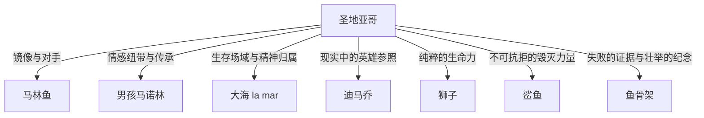

# 《老人与海》深度读书笔记

> [!abstract] 全书速览
> 一个古巴老渔夫，八十四天一无所获，在第八十五天独自驶入深海，与一条巨大的马林鱼搏斗三天两夜后将其制服，却在返航途中被鲨鱼群吃光了猎物，最终只带回一副巨大的鱼骨架。这部仅两万七千字的中篇小说，是海明威"冰山理论"的极致实践——它几乎不解释任何东西，只是把一个老人、一条大鱼、一片空旷的海摆在你面前，让你自己去感受什么是"被毁灭但不被打败"。

## 时代与作者

海明威写《老人与海》时已经五十多岁，身体因早年的战争创伤和两次飞机失事而每况愈下。在此之前，他经历了长达十二年的创作低潮——1940年的《丧钟为谁而鸣》之后，1950年的《过河入林》遭到评论界几乎一致的差评，很多人认为海明威已经写完了。

1952年，《老人与海》发表于《生活》杂志，两天内售出五百三十万份。1953年获普利策小说奖，1954年海明威凭此作及其整体文学成就获诺贝尔文学奖。瑞典文学院在授奖词中特别提到了他"精通现代叙事艺术"。

理解这个创作背景，你会对小说多一层感受：圣地亚哥不只是一个虚构的老渔夫，他在某种程度上是海明威的自画像——一个感到自己正在衰老的创作者，用最后的力量搏出了一部杰作，却深知自己可能无法保住此后的创作力量。老人与大鱼的搏斗，未尝不是海明威与自己衰退的才华之间的对抗。

## 故事的核心张力

> [!tip] 核心冲突
> 《老人与海》的底层张力不是"人vs.自然"这么简单，而是一个更深的问题：==当你竭尽全力仍然失败时，你如何定义自己？==

海明威在这部小说中拆解了"胜利"与"失败"的传统定义。从世俗标准看，圣地亚哥彻底失败了——他带回的只是一副没有任何经济价值的鱼骨架。但从另一个维度看，他从未被打败过——在搏斗的每一个瞬间，他都没有放弃。

这构成了小说最深刻的张力：物质世界的法则（你无法对抗鲨鱼群）与精神世界的法则（你可以选择不投降）之间的对峙。海明威不允许圣地亚哥在任何一个维度上获得完整的胜利——他必须承受物质的失败，但他可以保有精神的完整。

小说中最著名的一句话——"一个人可以被毁灭，但不能被打败"——正是这种张力的凝缩。身体的毁灭是物质世界的法则，人力无法对抗自然的绝对力量；但精神的溃败——放弃、投降、丧失尊严——是一个人自己的选择。

## 人物命运

### 圣地亚哥：硬汉中最柔软的一个

圣地亚哥是海明威塑造的最纯粹的"硬汉"形象，但也是最柔软的。与杰克·巴恩斯（[[《太阳照常升起》]]）的疲惫和罗伯特·乔丹（[[《丧钟为谁而鸣》]]）的悲壮不同，圣地亚哥身上有一种近乎宗教性的平静。他不愤怒、不怨恨，他只是做他该做的事，然后接受结果。

> [!note] 人物弧线
> 圣地亚哥的弧光不是传统意义上的"变化"——他在出海前和回来后本质上是同一个人。他的弧光体现在**显示**而非**变化**：三天两夜的搏斗将他一直存在但不可见的品质——耐力、尊严、谦逊中的骄傲——淋漓尽致地展示了出来。

最容易被忽视的是圣地亚哥的谦逊。他说自己"不够聪明"，他承认自己走得太远了，他感谢男孩的帮助。这种谦逊与他的骄傲并不矛盾——他知道自己不是万能的，但在自己能力范围内，他拒绝做任何有损尊严的事。这种"有限度的骄傲"比无限的自信更加真实，也更加动人。

你还可以注意到一个微妙的矛盾：圣地亚哥说"不能被打败"，但他同时也在不断自问"也许我不该走那么远"。这不是软弱，而是海明威的诚实——真正的英雄不是没有怀疑的人，而是带着怀疑仍然前行的人。

### 马诺林（男孩）：人间的锚

马诺林在叙事中是功能性的，但绝非可有可无。他是圣地亚哥与人类社会之间的唯一连接点。如果没有马诺林，圣地亚哥就只是一个孤独的老疯子在海上搏斗——男孩的爱和信任赋予了老人的行为以人间的温度。

马诺林代表的是"传承"。他的存在暗示着圣地亚哥的精神不会随他的死亡而消失——男孩已经从老人身上学到了如何成为一个渔夫、一个男人。小说结尾，男孩在老人床边哭泣，然后为他送来咖啡。这个简单的行为——哭泣与照料——是全书中最接近"救赎"的时刻。

### 马林鱼：镜像与对手

马林鱼是圣地亚哥的镜像。它的特征——力量、耐久、尊严、孤独——与圣地亚哥完全对应。这是文学史上最微妙的"对手关系"之一。圣地亚哥在搏斗中不断对鱼说话："鱼啊，我爱你，非常尊敬你。但是今天天黑以前我一定要把你杀死。"

这种既爱且杀的态度不是矛盾，而是一种原始的、前文明的生存伦理——猎人对猎物的敬意。海明威从未详细描写马林鱼的"内心"——它始终是一个沉默的、被人类意识投射的对象。但正是这种沉默赋予了它一种超越语言的尊严。

## 主题深层解读

### 主题一：不被打败——后宗教时代的英雄主义

这种英雄主义与古典英雄主义有本质不同。古典英雄（阿喀琉斯、奥德修斯）通过胜利来证明自己的伟大；现代文学中的反英雄（卡夫卡的K，贝克特的等待者）则在无力中展示荒诞。海明威的英雄处于两者之间：==他承认失败的不可避免，但拒绝接受失败对尊严的剥夺==。

这是一种后宗教时代的英雄主义——没有上帝的奖赏，没有命运的眷顾，只有一个人在空旷的宇宙中维持自身的完整。

"不被打败"与"孤独""骄傲""衰老"三个概念紧密相连。圣地亚哥是孤独的——他独自出海，独自搏斗，独自承受失败，没有人见证他的壮举；他是骄傲的——即使八十四天没有捕到鱼，他也拒绝接受怜悯和施舍；他正在衰老——他的手抽筋、背疼痛、身体在不断发出衰退的信号。正因为孤独，他的坚持没有观众，因而更为纯粹；正因为骄傲，他无法允许自己被击倒；正因为衰老，他的每一次搏斗都可能是最后一次，因而更加悲壮。

### 主题二：人与自然——敬意中的搏斗

圣地亚哥称大海为"la mar"（阴性，带有亲昵意味），而不是"el mar"（阳性，更正式）。海明威特意指出，年轻渔夫们把大海当作一个竞争者或一个场所（el mar），而老人把大海当作一个有生命的存在（la mar）。这个细节揭示了圣地亚哥与自然之间关系的本质：他不是大海的征服者，而是大海的一部分。

马林鱼吃小鱼，圣地亚哥捕马林鱼，鲨鱼抢圣地亚哥的猎物——这是一条完整的生存链，没有谁对谁错。圣地亚哥不恨鲨鱼（至少在最初），正如马林鱼不恨圣地亚哥——这是自然的法则，每个参与者都在执行自己的角色。但海明威同时让你感受到这个法则的残酷：公平不意味着仁慈，自然的公正中没有怜悯的位置。

### 主题三：孤独——创造性的独处

海明威曾说："写作在本质上是孤独的。"圣地亚哥的海上独处可以被读作一个隐喻：创造性的劳动（无论是捕鱼还是写作）在最深层面上是一个人的事。没有人能替你拉住那条鱼线，没有人能替你写出那个句子。

圣地亚哥在海上的独白是全书最具深度的段落之一。他与自己的手说话（"手啊，你怎么了"），与鱼说话，与鸟说话，与星星说话。这些独白不是疯癫的表现，而是一种在孤独中维持人类性的策略。当你身边没有任何人时，语言——即使是对自己说的语言——是你保持"人"这个身份的最后工具。

### 主题四：失败与超越——骨架的象征

> [!warning] 深层意义
> 骨架作为象征物具有双重意义。从世俗角度看，它是彻底的失败——一条巨大的鱼只剩下骨头，没有任何经济价值。但从精神角度看，它是壮举的纪念碑——它的巨大尺寸证明了圣地亚哥所对抗的是多么强大的对手，也证明了他的确曾经做到了不可能的事。

小说结尾有一个极为精妙的细节——港口的游客看到绑在圣地亚哥船旁的巨大鱼骨，问服务员那是什么。服务员用英语说是鲨鱼（shark），游客便不再关心。这个误读蕴含了深刻的讽刺：真正的壮举发生在没有观众的深海，而岸上的人们甚至无法正确辨认它的遗迹。

骨架与"证据""记忆""虚无"构成一组意象关系。骨架是证据——证明圣地亚哥没有在吹牛，他真的捕到了一条大鱼；骨架是记忆的物质载体——它让那三天两夜的搏斗留下了可触摸的痕迹；但骨架同时也指向虚无——当骨架最终也被潮水冲走或腐烂后，什么都不会留下，除了男孩和老人之间无需言说的理解。

## 核心意象网络

### 狮子

圣地亚哥反复梦见年轻时在非洲海滩上看到的狮子。这个意象出现在小说的开头和结尾，形成了一个完美的环形结构。

狮子象征的不是力量，不是野性，而是==纯粹的、无目的的生命力==。海明威笔下的狮子不在捕猎，不在搏斗，它们只是在黄昏的海滩上玩耍。这个意象之所以反复出现在圣地亚哥的梦中，是因为它代表了一种他在清醒时无法企及的状态——一种不需要证明什么的存在方式。

为什么是狮子而不是其他动物？狮子在西方文化中是力量和高贵的象征，但海明威的狮子不是猎杀中的狮子，而是嬉戏中的狮子。这暗示着真正的力量不在于搏斗，而在于搏斗之外的那种自在。圣地亚哥在海上拼尽全力，但他的灵魂向往的是海滩上无忧无虑的狮子。这构成了全书最深层的张力。

### 棒球与迪马乔

圣地亚哥在搏斗中反复想到棒球名将乔·迪马乔，特别是迪马乔在脚跟长了骨刺的情况下仍然坚持打球这件事。这个看似突兀的现实细节精准地嵌入了主题网络：迪马乔是圣地亚哥在现实世界中的参照系——一个在身体受限的情况下仍然卓越的人。

棒球的引入还具有另一层功能：它将圣地亚哥锚定在具体的社会现实中，防止他的形象过度象征化。他不是一个抽象的"人类意志的化身"，他是一个喜欢棒球、关心比赛结果、用迪马乔来激励自己的普通老人。正是这种日常性使他的壮举更加动人——伟大不属于神话中的英雄，而属于那些会为棒球比分兴奋的普通人。

## 文学手法

### 冰山理论的极致实践

海明威在《午后之死》中提出了著名的"冰山理论"：如果一个作家对他所写的东西心里有数，那么他可以省略他所知道的东西，读者仍然能强烈地感觉到他所省略的一切。冰山运动之所以雄伟壮观，是因为它只有八分之一露出水面。

《老人与海》是冰山理论最彻底的实践。全书几乎没有心理描写（传统意义上的），没有景物抒情，没有说教评论。海明威只写圣地亚哥做了什么、看到了什么、说了什么，而将"这一切意味着什么"完全交给读者去填充。

> [!example] 省略的力量
> 全书最大的省略是圣地亚哥对失败的最终感受。当鲨鱼吃光了马林鱼后，海明威没有写圣地亚哥崩溃、哭泣或愤怒。他只是写老人继续驾船回港，回到小屋，倒在床上睡着了，然后又梦见了狮子。这个省略是全书最强有力的"冰山"——圣地亚哥在失败后的沉默，比任何悲痛的描写都更为震撼。

### 动作即性格

海明威不告诉你圣地亚哥是什么样的人，他只给你看圣地亚哥做了什么。当圣地亚哥在手抽筋时强迫自己吃生金枪鱼、对自己的手说话督促它恢复，你不需要被告知他是一个"坚韧的人"——这个判断已经在行动中了。

### 极简结构中的史诗感

全书的叙事结构近乎古典的简洁：一个人，一条船，一片海，一条鱼。没有次要情节线，没有闪回蒙太奇，没有多视角切换。海明威将小说的叙事要素压缩到了极限，但恰恰因此获得了史诗般的纵深感。

线性叙事将读者锁定在圣地亚哥的时间流中，你无法跳出去获得"上帝视角"，你必须跟他一起一分钟一分钟地熬过那三天两夜。这种叙事策略把阅读本身变成了一种身体性的体验。

## 多元解读视角

**存在主义视角**：圣地亚哥可以被视为加缪所说的"荒诞英雄"的变体。与西西弗斯的对比最为直接——两人都在做一件注定没有持久结果的事（推石头/捕鱼），但态度有微妙差异。加缪说"我们应该想象西西弗斯是快乐的"，但海明威不谈快乐，他谈的是尊严。这种立场比加缪更为冷峻，也更不依赖主观感受。

**基督教象征主义视角**：许多批评家指出了圣地亚哥身上的基督意象：他在船上的姿态（手被鱼线勒伤，如同钉痕）、他扛着桅杆上山坡（如同背负十字架）、他在小屋里摊开手掌睡去（如同受难后的安息）。如果接受这种解读，那么圣地亚哥的"受难"是没有救赎承诺的受难——没有复活，没有天堂，只有一副鱼骨架和沉沉的睡眠。

**生态批评视角**：在当代语境中，《老人与海》引发了一个新的问题——人类与海洋生物的关系是否应该被重新审视？圣地亚哥对马林鱼的"尊重"是否足以正当化他的捕杀行为？海明威写作时生态意识尚未成为主流话语，但他笔下人与自然的复杂关系为今天的生态反思提供了丰富的文本基础。

## 为什么今天还要读这本书

《老人与海》之所以在七十多年后仍然被阅读，是因为它触及的问题超越了特定的时代和文化：==当你竭尽全力后仍然失败了，你如何面对自己？==

在当代语境中，这个问题可能比海明威的时代更加紧迫。你生活在一个将"成功"量化为可见指标（收入、粉丝、影响力）的时代，而圣地亚哥的故事告诉你另一种衡量标准：你的价值不在于你得到了什么，而在于你在争取的过程中展现了什么。鱼骨架没有市场价值，但三天两夜的搏斗具有存在的价值。

这也是为什么《老人与海》常常在人生的不同阶段给人不同的感受。年轻时读它，你可能觉得这只是一个"老人捕鱼"的简单故事。在经历过努力、失败、失去之后再读它，你会在圣地亚哥的沉默中听到自己的回声——那种"我已经做了我能做的一切"的坦然，是人在失败之后能给予自己的最好的安慰。

用最简单的话概括：如果你读完之后觉得心里沉甸甸的、但说不出为什么——那就对了。那个"说不出为什么"的部分，就是海明威省略的八分之七。

## 延伸阅读

- [[《太阳照常升起》]] — 海明威的成名作，迷惘一代的精神肖像，理解海明威英雄观的起点
- [[《永别了，武器》]] — 战争与爱情的毁灭，海明威早期的悲剧美学
- [[《白鲸》]] — 梅尔维尔的大海史诗，与《老人与海》在主题上形成宏大的对话——同样是人与海洋生物的搏斗，但海明威剔除了梅尔维尔的百科全书式的庞杂，只保留了最纯粹的对抗
- [[《活着》]] — 余华笔下的中国式坚韧，与圣地亚哥的"不被打败"构成跨文化共鸣
- [[《局外人》]] — 加缪的荒诞英雄，与海明威的存在主义立场形成参照
