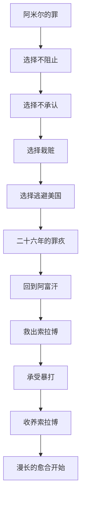

# 《追风筝的人》深度读书笔记

> [!abstract] 全书速览
> 一个阿富汗富家少爷，在童年目睹仆人之子遭受侵害却选择了沉默和逃避。这个怯懦的选择像一根刺，扎在他心里二十六年。当他终于有机会"再次成为好人"时，他踏上了返回战火中的阿富汗的旅程。这是一个关于背叛与救赎的故事，但它追问的是人性中最难以直视的部分：==在关键时刻，你是否会为了自己的私欲而背叛最爱的人？而如果你真的这样做了，你还有救吗？==

## 时代与作者

卡勒德·胡赛尼1965年出生于喀布尔，父亲是外交官。1980年苏联入侵后全家移居美国。他后来成为医生，2003年处女作出版后引发轰动才转为全职作家。

> [!note] 失乐园视角
> 胡赛尼写的不是想象中的阿富汗，而是他失去的故乡。书中战前喀布尔的金色童年——放风筝的少年、石榴树下的阅读——都是他真实的记忆。但他没有把故乡浪漫化，而是诚实地写出了那个社会的阶级歧视。正是这种诚实，让这本书超越了移民怀乡文学。

《追风筝的人》是第一部用英语写作的阿富汗小说，为西方读者打开了了解阿富汗的窗户。但它同时超越了地域性，因为它触及的主题——罪疚、救赎、父子关系、友谊与背叛——是普世的。

## 故事的核心张力

> [!tip] 核心冲突
> 底层张力不是"阿富汗的苦难"，而是一个更根本的问题：**当你对他人犯下了无法挽回的错误，你如何继续活下去？**

1975年冬天，阿米尔目睹哈桑在小巷中被阿塞夫强暴，选择了逃跑。他为什么逃跑？书中有一段令人不寒而栗的内心独白：阿米尔告诉自己，哈桑只是一个哈扎拉人，牺牲他换取蓝风筝、换取父亲的认可，是"公平的代价"。

==这揭示了一个你不愿承认的真相：在关键时刻，人可能会在完全清醒的状态下背叛最爱的人。==

二十六年后，拉辛汗来电："来吧，这里有再次成为好人的路。"阿米尔回到阿富汗救哈桑的儿子索拉博——而此时他才得知哈桑其实是他同父异母的弟弟。

## 人物命运

### 阿米尔——被罪疚定义的人生

阿米尔不是传统意义上的"好人"。他嫉妒、软弱、自私，甚至残忍——诬陷哈桑偷窃逼他离开。但胡赛尼让你理解他：一个活在父亲巨大阴影下的男孩，绝望地渴望认可。

> [!example] 关键场景
> 被阿塞夫打得血肉模糊时，阿米尔笑了。这个细节令人毛骨悚然又心酸——他终于找到了一种承受哈桑曾经承受的痛苦的方式。一个人要痛苦到什么程度，才会在被暴打时感到释然？

### 哈桑——忠诚的极限

"为你，千千万万遍。"哈桑知道阿米尔看到了一切却逃跑了，但从未提起。被诬陷偷窃时他选择承认，只为保护阿米尔。他至死都在守护阿米尔家的房子，等待着少爷也许有一天会回来。

> [!warning] 深层悲剧
> 哈桑的忠诚是近乎自我毁灭的。这背后有爱，也有社会根深蒂固的阶级压迫——一个哈扎拉仆人对主人的儿子，忠诚到宁愿毁掉自己。

### 巴巴——矛盾的父亲

正义的化身，但也是永远不肯承认哈桑是亲生儿子的懦夫。==他最恨"偷窃"，但自己偷走了阿里的妻子、哈桑知道父亲的权利、阿米尔拥有兄弟的机会。==他用一生的"正义"掩盖这个偷窃。

### 索拉博——创伤的继承者

哈桑的痛苦在儿子身上延续。索拉博在被告知可能要回孤儿院时试图自杀。结尾他一闪而过的微笑暗示：经过足够漫长的时间和足够真诚的努力，伤口可以开始愈合。

## 主题深层解读

### 罪与救赎——人能否被原谅

> [!tip] 核心洞察
> 救赎不是廉价的。它需要行动，需要付出代价，甚至需要血。但即便如此，==救赎也不是一个终点，而是在罪行的阴影下继续生活、努力做得更好的承诺==。

### 父与子——寻求认可与逃离阴影

多条父子线交织：阿米尔与巴巴、哈桑与阿里、阿米尔与索拉博。讽刺的是，阿米尔通过风筝比赛赢得父亲认可的代价，是对另一个"儿子"的背叛。阿米尔最终创造了一种新的父子关系——基于选择、基于责任、基于爱。

### 阶级、种族与暴力

普什图人与哈扎拉人的种族差异是悲剧的重要推手。阿塞夫是这种暴力的具象化——从童年恶霸到塔利班官员，代表了意识形态暴力与个人施虐欲的结合。

### 风筝——自由与追逐

> [!example] 象征的颠倒
> 曾经是哈桑为阿米尔追风筝——"为你，千千万万遍"。结尾是阿米尔为索拉博追风筝，对索拉博说出同样的话。他终于从"接受牺牲"的人变成了"做出牺牲"的人。

## 文学手法

胡赛尼让阿米尔自己讲述故事，包括最不堪的时刻。这种诚实让你无法简单谴责他——你被迫问自己：如果是我，会不会做出同样的选择？

小说在两个时空之间切换形成镜像：逃跑/救人、接受忠诚/付出忠诚、童年风筝/救赎风筝。==人生是一个圆，你逃避的东西，终究要回来面对。==

## 为什么今天还要读这本书

> [!tip] 个人启示
> 这本书最终不是关于阿富汗的。它是关于==人如何与自己的过去相处==。你的人生中是否也有一个你一直在逃避的时刻？阿米尔用了二十六年才鼓起勇气回去；你打算等多久？

"那里有再次成为好人的路"——这是一个邀请，也是一个挑战。风筝还在天上飞，问题是：你愿意去追吗？

## 延伸阅读

- [[《灿烂千阳》]]：胡赛尼的第二部小说，聚焦阿富汗女性的命运。如果《追风筝的人》是父子的故事，这本书是母女和姐妹的故事。同样揪心，同样有希望。

- [[《赎罪》]]（伊恩·麦克尤恩）：另一个关于童年错误如何毁掉一生的故事，在结尾抛出更尖锐的问题：虚构的原谅算不算真正的原谅？

- [[《群山回唱》]]：胡赛尼的第三部，用更宏大的结构讲述一个家族跨越六十年、三大洲的故事。文学性更强，但不如前两部那么直击人心。
