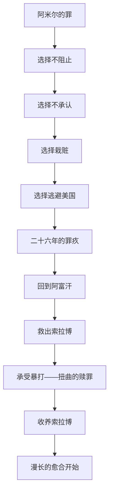

# 《追风筝的人》深度读书笔记

> [!abstract] 全书速览
> 这是一个关于背叛与救赎的故事，但它追问的远不止于此。一个阿富汗富家少爷，在童年目睹仆人之子遭受侵害却选择了沉默和逃避。这个怯懦的选择像一颗种子，在黑暗中生长了二十六年。当他终于踏上返回战火中的阿富汗的旅程时，他要面对的不仅是童年的噩梦，更是自己内心深处那个一直在逃跑的人。胡赛尼用有温度的笔触写出了人性中最难以直视的部分：==在关键时刻，你是否会为了自己的私欲而背叛最爱的人？而如果你真的这样做了，你还有救吗？==这本书不会给你一个轻松的答案，但它会让你在某个深夜突然想起时，感到胸口发紧。

## 时代与作者

卡勒德·胡赛尼1965年出生于喀布尔，父亲是阿富汗外交官，母亲是一所女子中学的教师。他的童年在一个相对西化、开明的上层家庭中度过——那时的喀布尔还是一座充满活力的现代城市，女性可以穿裙子上街，电影院和书店随处可见，孩子们在冬天的天空下追逐风筝，周五去电影院看约翰·韦恩的西部片。1976年父亲被派驻巴黎，全家离开阿富汗。三年后苏联入侵，他们再也没能回去。1980年全家以政治难民身份移居美国加州圣何塞。胡赛尼在美国读完高中和大学，后来成为一名内科医生，直到2003年这部处女作出版引发全球轰动，才转为全职作家。

> [!note] 失乐园视角
> 胡赛尼写的不是一个想象中的阿富汗，而是他失去的故乡。书中那个战前喀布尔的金色童年——放风筝的少年、石榴树下的阅读、街头小贩的叫卖声——都是他真实的记忆。而后来塔利班统治下的恐怖，则是他在美国通过新闻报道和难民故事拼凑出的噩梦。这种"失乐园"的视角，让整本书笼罩着一层挥之不去的乡愁——不是对某个具体地方的思念，而是对一种已经被永远摧毁的生活方式的哀悼。

你在书中看到的那个喀布尔，已经不存在了。阿米尔后来回到喀布尔时发现：街道上曾经卖烤羊肉串的地方变成了废墟，曾经放风筝的天空下面是塔利班的处刑场。

但胡赛尼没有把阿富汗浪漫化。他诚实地写出了那个社会根深蒂固的阶级歧视——阿米尔和哈桑之间、普什图人和哈扎拉人之间，那道看不见却无处不在的墙。即使在那个"美好的"战前时代，哈扎拉人也被视为低等人种，教科书里几乎不提他们的历史，普什图人的孩子可以公然嘲笑和欺负哈扎拉孩子而不受惩罚。正是这种诚实，让这本书超越了普通的移民怀乡文学，成为一部真正探讨人性和社会结构的作品。胡赛尼不允许你简单地将阿富汗分成"美好的过去"和"恐怖的现在"——他逼你看到，后来的暴行在更早的日常歧视中就已经埋下了种子。

《追风筝的人》是第一部用英语写作的阿富汗小说，为西方读者打开了一扇了解阿富汗的窗户。但它同时超越了地域性，因为它触及的主题——罪疚、救赎、父子关系、友谊与背叛——是普世的。你读到阿米尔在那条小巷前犹豫的时刻，心跳加速，不是因为你了解阿富汗，而是因为你认识那种犹豫。

## 故事的核心张力

> [!tip] 核心冲突
> 底层张力不是"阿富汗的苦难"，而是一个更根本的问题：**当你对他人犯下了无法挽回的错误，你如何继续活下去？你能被原谅吗？你能原谅自己吗？**

1975年冬天，十二岁的阿米尔和仆人之子哈桑在喀布尔的风筝比赛中获胜。哈桑去追那只被割断线的蓝风筝——"为你，千千万万遍"——却在小巷中被恶霸阿塞夫和同伴堵住。阿米尔目睹了哈桑被强暴的整个过程，但他选择了逃跑。

他为什么逃跑？不全是因为恐惧。书中有一段令人不寒而栗的内心独白：阿米尔告诉自己，哈桑只是一个哈扎拉人，牺牲他换取那只蓝风筝、换取父亲的认可，是"公平的代价"。这才是这本书真正黑暗的地方。==它揭示了一个你不愿承认的真相：在关键时刻，人可能会在完全清醒的状态下背叛最爱的人。==阿米尔当时知道那是错的，他知道哈桑把他当作最好的朋友，他知道哈桑为他做了一切。但在那一刻，他的自私、他对父爱的渴望、他内心深处对哈扎拉人的轻视，共同做出了那个决定。这个场景之所以令人如此不安，是因为你被迫承认：你自己内心深处也许也有类似的东西——一种在安全时会被掩盖、但在极端压力下会暴露出来的自私和怯懦。

这个选择的后果是终生的。阿米尔为了不再面对哈桑——准确地说，为了不再面对哈桑眼中那种沉默的、毫无责备的注视——栽赃他偷窃，逼走了他和父亲阿里。他以为离开阿富汗、移民美国就可以逃避过去，但过去从未真正离开。他无法生育——仿佛是命运的惩罚；他写的小说反复围绕背叛和赎罪的主题；他和妻子索拉雅之间始终隔着一层他无法说出口的秘密。罪疚不是墨水，不会随时间变淡——它更像一颗种子，在黑暗中只会越长越大。

直到二十六年后，老友拉辛汗的电话打来："来吧，这里有再次成为好人的路。"阿米尔得知哈桑已死于塔利班之手，更震惊的是哈桑其实是他同父异母的弟弟。他回到阿富汗，从阿塞夫手中救出哈桑的儿子索拉博，被打得肋骨断裂、脾脏破裂，最终将索拉博带回美国收养。小说以阿米尔为索拉博追风筝、索拉博露出一闪而过的微笑收尾——不是终点，而是一个脆弱得几乎不敢触碰的开始。

小说的张力在于：救赎是否可能？阿米尔无法改变过去，哈桑已经死了，那个冬天的下午永远不能重来。但他可以救哈桑的儿子，他可以承受自己本该承受的痛苦，他可以直面自己一直在逃避的东西。这条路不通向遗忘，不通向原谅——它通向的是一种比逃避更诚实的活法。

## 人物命运

### 阿米尔——被罪疚劫持的人生

阿米尔是一个复杂到让人不舒服的主角。他不是传统意义上的"好人"——他嫉妒、软弱、自私，甚至有些残忍。他明知哈桑不识字，却故意在读故事时编造内容来捉弄他，享受那种知识上的优越感；他把自己的手表藏在哈桑床下，诬陷哈桑偷窃，逼走了这对父子。在美国的生活中，他甚至对父亲的病感到一种隐秘的满足——终于轮到父亲需要他了。

但胡赛尼的高明之处在于，他让你理解阿米尔为什么会这样。这个男孩从小活在父亲巨大的阴影下。巴巴是喀布尔的传奇人物——据说赤手空拳和熊搏斗过——而阿米尔体弱、爱读书、不喜欢足球，完全不符合父亲对"男子汉"的定义。更折磨人的是，父亲似乎更喜欢仆人的儿子哈桑：勇敢、忠诚、运动天赋出众。阿米尔的整个童年都在试图赢得父亲的爱。那只蓝风筝代表的不只是比赛胜利，而是他证明自己的唯一机会。想象一下那种绝望：一个十二岁的男孩觉得自己必须赢得一场比赛才能换回父亲的一个拥抱。

成年后的阿米尔，表面上是一个成功的移民：作家、好丈夫、美国公民。但他的整个人生都被那个冬日的下午劫持了。他选择索拉雅做妻子，部分原因是她也有不光彩的过去——她曾与一个男人私奔。这让阿米尔感到安慰，因为他不再是唯一有秘密的人。但区别在于：索拉雅勇敢地把自己的过去告诉了阿米尔，而阿米尔从来没有对任何人说出那个冬天的真相。她的坦诚反而加深了他的羞耻——他连她那种勇气都没有。

> [!example] 关键场景
> 直到他回到阿富汗，被阿塞夫打得血肉模糊时，他才获得某种解脱。那场殴打几乎是他主动求来的——他终于找到了一种承受哈桑曾经承受的痛苦的方式。被打的时候他笑了。这个细节令人毛骨悚然又让人心酸：一个人要压抑多久的罪疚、要积攒多深的自我厌恶，才会在被暴打时感到释然？那不是受虐癖，那是一种扭曲的赎罪——他的身体终于在替灵魂偿还债务。

### 哈桑——忠诚的极限

"为你，千千万万遍。"这句话贯穿全书，每次出现都让人心碎。哈桑是这本书的道德核心——有着兔唇，是一个哈扎拉人，是阿米尔家的仆人之子。但他同时是最忠诚、最勇敢、最善良的人。他射弹弓百发百中，追风筝从不失手，愿意为阿米尔做任何事——字面意义上的任何事。

哈桑知道阿米尔在小巷里看到了一切。他知道阿米尔躲在那里，看着，然后跑掉了。但他从来没有提起过，从来没有用这件事来责备阿米尔。甚至在被诬陷偷窃、被迫离开时，他选择承认那个从未犯下的罪——只为保护阿米尔免受父亲的愤怒。你能想象那种痛苦吗？你被最好的朋友背叛、抛弃、诬陷，而你选择承担所有的后果，因为你爱他，因为保护他是你存在的意义。

> [!warning] 深层悲剧
> 这是一种近乎自我毁灭的忠诚。背后有爱，毫无疑问有纯粹的、不求回报的爱。但也有那个社会根深蒂固的阶级压迫在起作用——哈桑从出生那天起就被教导：他是仆人，他的使命是服务。当他说"为你，千千万万遍"时，"为你"这个句式本身就暗示了一种不对等的关系。他的忠诚之所以如此极端，不仅因为天性善良，也因为整个社会都在告诉他：牺牲自己是他应该做的事。

哈桑的结局极其惨烈。塔利班占领喀布尔后，他和妻子法莎娜被当街处决，因为一个哈扎拉人"不配"住在那样的房子里。他至死都在守护那栋房子——阿米尔家的房子——等待着少爷也许有一天会回来。那栋空房子在某种意义上就是他整个人生的隐喻：守护一个属于别人的东西，为一段被背叛的关系保留着最后的忠诚。他甚至给自己的儿子取名索拉博——那是阿米尔小时候最爱的故事里的英雄。到死，他都没有停止爱那个抛弃了他的人。

多年后，当阿米尔得知哈桑其实是他同父异母的弟弟时，一切都有了新的含义。父亲对哈桑的特别关注、阿米尔对哈桑说不清道不明的复杂感情——嫉妒中夹杂着爱、轻视中暗含着依赖——都在这个秘密的光照下重新显现。但这个秘密来得太晚——哈桑已经死了。真相不再是和解的可能，而是另一层无法弥补的遗憾。

### 巴巴——矛盾的父亲

巴巴是全书最矛盾的人物。他是正义的化身——敢于当面反驳毛拉、在苏联士兵面前保护陌生妇女、资助孤儿院建设。在喀布尔，他是一个传奇：身材高大如山，性格刚烈如火。但他也是那个让阿米尔一生寻求认可的冷漠父亲——他对阿米尔的爱好（写作、读诗）嗤之以鼻，却对哈桑的勇敢赞不绝口；他是那个永远不肯承认哈桑是自己亲生儿子的懦夫。

==巴巴最恨的罪是"偷窃"。他告诉年幼的阿米尔：所有的罪行归根到底都是偷窃。杀人是偷走了别人的生命，说谎是偷走了别人知道真相的权利。但他自己偷走了阿里的妻子、偷走了哈桑知道父亲是谁的权利、偷走了阿米尔拥有兄弟的机会。==他用一生的"正义"来掩盖这个偷窃——孤儿院、慈善、为弱者出头——这些好事是真心的，但它们也是一层又一层的遮羞布。每一次善行都是对自己罪疚的微小偿还，但他从来没有勇气做那件最重要的事：说出真相。

这个设定让巴巴从一个令人敬畏的父亲形象，变成一个和阿米尔一样被罪疚缠绕的普通人。父子俩都在用不同的方式逃避同一种罪——背叛了最不该背叛的人。区别是巴巴用行动来赎罪，而阿米尔用逃避来逃罪。到了美国，巴巴从喀布尔的传奇人物变成了加油站的小工——这种身份的巨大落差他从不抱怨，仿佛觉得这种苦也是某种应得的惩罚。阿米尔最终完成了父亲没有完成的事——他承认了哈桑的血脉，他把哈桑的儿子带回了家。从这个角度看，阿米尔的救赎也是替父亲完成的。

### 索拉博——创伤的继承者

索拉博是哈桑的儿子，是这个故事中最脆弱也最令人心痛的人物。他经历了父母被当街枪杀、被孤儿院出卖给塔利班官员、被阿塞夫囚禁和性侵的噩梦。当阿米尔找到他时，他跳舞、涂口红——那是阿塞夫的变态爱好强加给他的。他几乎完全封闭了自己，像一个被掏空了的壳。

索拉博代表了创伤的代际传承。哈桑的痛苦没有随着他的死亡而结束，它在儿子身上以更残酷的形式延续。阿米尔的罪疚也没有随着时间而消退，它在索拉博的眼神中重新被唤醒——那双眼睛和哈桑一模一样。拯救索拉博是阿米尔的赎罪，但这个赎罪每时每刻都在提醒他：如果不是他当年的背叛，也许一切都会不同。

救索拉博的过程本身充满折磨。阿米尔因为签证问题，曾对索拉博说他可能需要暂时回孤儿院——就是那个把他卖给阿塞夫的孤儿院。索拉博当晚在浴室里割腕自杀。一个已经被世界伤害到极点的孩子，终于以为自己找到了安全的港湾，却被告知可能要回到地狱。他的信任被再次撕碎了。从那以后，索拉博不再说话，不再笑，不再哭——他变成了一个活着的空壳。

小说的结尾是开放的：在公园里放风筝时，索拉博终于露出了一个微笑——"一个一闪而过的微笑，一个小到几乎不存在的微笑"。胡赛尼没有给你一个圆满的结局。愈合需要时间，可能需要一辈子。那个微笑不是终点，而是一个脆弱得几乎不敢触碰的开始。

### 阿塞夫——恶的具象化

阿塞夫值得单独分析，因为他不仅仅是一个反派，更是一种系统性暴力的人格化身。童年时他是一个崇拜希特勒的恶霸——他的母亲是德国人，他随身携带一本德语版的《我的奋斗》——他公开鼓吹种族净化，认为阿富汗应该清除所有哈扎拉人。成年后他无缝衔接成为塔利班官员：在足球场上石刑处决人，在自己的豪宅里囚禁和性侵哈扎拉男童。

阿塞夫代表的是一种将意识形态暴力和个人施虐欲结合在一起的恶。他不是因为信仰而残忍——他是一个天生的施虐者，不同的政治环境只是为他的暴力提供了不同的外衣。在君主制时代他是恶霸，在塔利班时代他是官员——施虐的本质从未改变，变的只是借口。这让你看到一个令人不安的真相：极权体制之所以能运转，不仅因为它制造恐惧，更因为它总能找到像阿塞夫这样的人——那些渴望合法伤害他人的人。

更微妙的是，阿塞夫真诚地相信自己在做正确的事。当他对阿米尔解释自己为什么加入塔利班时，他的眼神是狂热的、甚至是虔诚的。他不认为自己是怪物，他认为自己是战士。这比单纯的邪恶更可怕——一个知道自己在作恶的人，至少还保留了道德判断的能力；一个把恶行当作使命的人，才是真正无可救药的。历史上最大规模的暴行，往往不是由知道自己在犯罪的人实施的，而是由坚信自己在执行正义的人实施的。

## 主题深层解读

### 罪与救赎——人能否被原谅

> [!tip] 核心洞察
> 救赎不是廉价的。它需要行动，需要付出代价，甚至需要血。但即便如此，==救赎也不是一个终点，而是在罪行的阴影下继续生活、努力做得更好的承诺==。

这是全书最核心的主题。阿米尔的罪行不是一次性的行为，而是一系列的选择：选择不阻止、选择不承认、选择栽赃、选择逃避。每一个选择都加深了他的罪疚。这就是罪的运作方式——它不是一个事件，而是一个不断生长的过程。你以为逃避可以让它缩小，但逃避本身就是新的罪行。

胡赛尼给出的答案是复杂的：人可以获得救赎，但救赎不是廉价的。阿米尔必须回到阿富汗，穿越塔利班的检查站，面对童年的噩梦阿塞夫，被打得肋骨断裂、脾脏破裂——然后带着哈桑的儿子逃出来。值得注意的是，阿米尔在做出这个选择之前犹豫了很久——他不是一个突然顿悟的英雄，而是一个被罪疚折磨到无法再逃的普通人。他回到阿富汗不完全是因为勇气，也是因为他已经受不了了——二十六年的自我厌恶终于比恐惧更沉重。

但即便如此，救赎也不是一个终点。哈桑已经死了，阿米尔永远不可能从他那里得到原谅。拉辛汗说："当罪行导致善行，那就是真正的获救。"这句话不是说善行可以抵消罪行——十件好事不能"抵消"一件恶事——而是说你无法改变过去，但可以用过去来驱动未来的善行。救赎不是"清零"，而是在罪行的阴影下继续生活，带着那根刺努力做得更好。

这个观点对你可能也有启示。你或许不会犯下阿米尔那样严重的错，但你一定有过让自己后悔的时刻——一次没有说出口的道歉、一个你明知该帮却没有帮的人、一段因为你的懦弱而破碎的关系。胡赛尼告诉你的不是"一切都会好起来"，而是"你可以从现在开始做对的事，即使它不能抹去过去"。

### 父与子——寻求认可与逃离阴影

这本书里有多条父子关系线，每一条都充满张力，每一条都在回应同一个问题：一个儿子如何在父亲的阴影下找到自己？

阿米尔穷尽整个童年试图让父亲以他为荣。讽刺的是，当他终于通过风筝比赛赢得父亲的认可时，代价是对另一个"儿子"的背叛。那个冬天的下午，巴巴拥抱了捧着蓝风筝回来的阿米尔——那是阿米尔等了一辈子的拥抱。但那个拥抱是用哈桑的痛苦换来的。从此以后，这个拥抱的记忆不再是温暖的，而是灼热的——每次想起它，阿米尔都会想起那条小巷里发生的事。

更深层的讽刺是：阿米尔以为父亲不爱他是因为他不够"男子汉"，但真相是父亲无法全心爱他，因为阿米尔的存在本身就是对巴巴罪行的提醒。巴巴每次看到阿米尔和哈桑在一起，看到的都是自己的两个儿子——一个可以公开承认，一个必须永远隐藏。他对阿米尔的冷淡，与其说是失望，不如说是一种无法面对自己罪行的痛苦投射。

哈桑与阿里的关系则是另一种悲剧。阿里知道哈桑不是自己的亲生儿子——因为他因疾病不能生育。但他从未流露过一丝怨恨，全心全意地爱他。在阿米尔诬陷哈桑偷窃那一天，阿里牵着哈桑的手离开了他服务了一辈子的房子。巴巴哭了，阿里没有。那种沉默比任何哭声都更让人心碎——它装着一个人一生的委屈和一个父亲对儿子无条件的保护。

阿米尔最终也成为了父亲——索拉博的养父。他要做的，不是重复自己父亲的模式（用秘密和谎言建造关系），而是创造一种新的父子关系：基于选择、基于责任、基于真相。这种坦诚本身就是对巴巴一生谎言的修正。

### 阶级、种族与暴力——阿富汗的伤痕

阿米尔是普什图人，哈桑是哈扎拉人。这个种族差异贯穿全书，成为悲剧的重要推手。当危险来临时，阿米尔的本能反应是：哈桑只是一个哈扎拉人，不值得我冒险。这个反应不是阿米尔个人的邪恶，而是社会结构的产物。他从小就被教导——不是通过明确的言语，而是通过无数细微的信号——哈扎拉人的命不如普什图人值钱。这种双重标准不是虚伪——它是社会结构在个人心理中的内化。在关键时刻，那些内化的等级观念替他做出了选择。

胡赛尼把这种结构性暴力与个体暴力交织在一起。阿塞夫的暴行——无论是童年的强暴还是成年后的屠杀——不是孤立的恶，而是一个允许甚至鼓励这种恶的社会系统的产物。哈桑的悲剧不只是个人的，它是整个社会结构的缩影。

### 历史与个人——时代的伤口

小说的时间跨度覆盖了阿富汗现代史上最动荡的时期：1970年代的君主制末期、1978年的共产主义政变、1979年的苏联入侵、1990年代军阀混战、塔利班的崛起与统治。胡赛尼把历史作为背景而非主题，聚焦于个人命运。

但他最深刻的洞察是：==历史不仅在宏观层面塑造命运，也在微观层面扭曲人性。==苏联入侵让阿米尔的家庭流亡美国，使得他和哈桑的裂痕永远无法弥合。塔利班的统治让哈桑被杀、索拉博被虐。个人的道德选择和历史的宏大力量是纠缠在一起的，你无法把它们分开讨论。

在历史的巨浪面前，个人的选择似乎微不足道。但胡赛尼的回答是：正是这些微小的个人选择，构成了历史的真实质地。历史不是抽象的力量——它是由无数个阿米尔的逃跑、无数个哈桑的忠诚、无数个阿塞夫的暴行编织而成的。

### 风筝——自由与追逐

> [!example] 象征的颠倒
> 曾经是哈桑为阿米尔追风筝——"为你，千千万万遍"。结尾是阿米尔为索拉博追风筝，对索拉博说出同样的话。他终于从"接受牺牲"的人变成了"做出牺牲"的人。同一个意象，两种截然不同的含义——这种转化本身就是整本小说的微缩版本。

风筝在小说中是核心象征，它的含义随着故事的推进不断变化。在童年段落中，放风筝象征着自由、快乐、童真。追风筝则象征着忠诚、牺牲、服从。但那只蓝风筝也是悲剧的起点——从自由和快乐的象征变成了欲望和背叛的象征。

小说的结尾，角色颠倒了。"为你，千千万万遍"——当阿米尔对索拉博说出这句话时，它不再是仆人对主人的效忠，而是一个赎罪者的承诺。而索拉博在那一刻露出的微笑，是风筝重新变回美好象征的第一个信号。

## 文学手法

胡赛尼选择让阿米尔自己讲述这个故事，包括他最不堪的时刻。这种第一人称叙事需要极大的技巧：让读者厌恶叙述者的行为，同时又理解、甚至同情他。阿米尔的叙述没有为自己开脱——他记录下自己每一个卑劣的念头。这种诚实反而让你无法简单地站在道德高地上谴责他——因为你被迫问自己：如果是我，会不会做出同样的选择？

小说在两个时空之间切换形成精妙的镜像结构：童年时阿米尔看着哈桑被侵犯而逃跑，成年后他冲进阿塞夫的房间救索拉博；童年时哈桑说"为你，千千万万遍"，结尾处阿米尔对索拉博说出同样的话；童年的风筝比赛是人生的顶点和坠落的开始，结尾的风筝是治愈的可能。==这种结构在说：人生是一个圆，你逃避的东西，终究要回来面对。==

胡赛尼的语言风格相当克制。最催泪的场景往往用最简单的语言描写。哈桑临终前写给阿米尔的信，没有怨恨、没有控诉——只有对童年时光的怀念。索拉博割腕后，阿米尔跪在医院走廊里终于学会了祈祷——一个从不信教的人，在绝望中找到了唯一还没试过的东西。正是这种克制，让情感的冲击更持久——它不在你读的那一刻让你大哭，而是在你合上书之后，在某个深夜突然想起时，让你感到胸口发紧。

还有一个值得注意的手法：气味和感官记忆。胡赛尼反复使用具体的感官细节来锚定情感——哈桑身上肥皂的味道、石榴树的酸甜气息、风筝线上玻璃粉的刺痛、阿富汗馕饼在炭火上烤出的焦香。这些细节暗示了记忆的运作方式：你记住的不是事件本身，而是附着在事件上的感官碎片。

最后值得一提的是胡赛尼处理"巧合"的方式。阿米尔正好碰上阿塞夫、索拉博正好用弹弓射中阿塞夫的眼睛——从写实角度看削弱了可信度，但从叙事功能上强化了核心信念：命运是一个圆环，你逃避的终将以另一种面貌回来找你。你可以批评它不够"真实"，但你必须承认它在情感上是有力的。

## 为什么今天还要读这本书

> [!tip] 个人启示
> 这本书最终不是关于阿富汗的。它是关于==人如何与自己的过去相处==。你的人生中是否也有一个你一直在逃避的时刻？阿米尔用了二十六年才鼓起勇气回去；你打算等多久？

这本书出版于2003年。在2021年美军撤离、塔利班重新掌权之后，它的意义更加沉重——那些在书中被描述的恐怖，正在再次成为现实。喀布尔机场上绝望的人群攀附在飞机起落架上的画面，让你想起阿米尔和巴巴当年挤在油罐车里逃亡的场景——历史在重复，苦难在继续。

但这本书最终不是关于阿富汗的。它是关于人如何与自己的过去相处。你的人生中是否也有一个你一直在逃避的时刻？也许不是什么惊天大事——也许只是一次你本该站出来却保持沉默的时刻，一次你为了自我保护而伤害了别人的时刻。在职场上你是否见过同事被不公正对待，但你选择了沉默？在朋友需要你的时候，你是否因为麻烦太大而退缩了？阿米尔用了二十六年才鼓起勇气回去面对；你打算等多久？

这本书还展示了移民经验的复杂性。阿米尔在美国获得了安全和自由，但同时失去了归属感——他在阿富汗是异乡人（因为他已经离开太久），在美国也是异乡人（因为他永远带着口音和记忆）。你不必是难民才能理解这一点——任何离开过家乡的人都知道，离开改变了你，回不去了。

"那里有再次成为好人的路"——拉辛汗的这句话是一个邀请，也是一个挑战。胡赛尼没有许诺你原谅——也许有些事永远得不到原谅。但他许诺了另一种东西：即使无法被原谅，你仍然可以选择做对的事。风筝还在天上飞。问题是：你愿意去追吗？

## 延伸阅读

- [[《灿烂千阳》]]：胡赛尼的第二部小说，聚焦阿富汗女性的命运。如果《追风筝的人》是关于罪疚和救赎的男性叙事，这本书是关于忍耐和反抗的女性叙事，两者合在一起才构成了胡赛尼对阿富汗命运的完整书写。

- [[《赎罪》]]（伊恩·麦克尤恩）：同样是关于童年错误如何毁掉一生的故事，但在结尾抛出了更尖锐的问题：如果写作本身就是赎罪方式，那虚构的原谅算不算真正的原谅？这会让你对阿米尔作为作家的身份有新的理解。

- [[《耻》]]（J.M.库切）：同样探讨罪疚、赎罪和暴力，放在南非种族隔离结束后的语境中。库切的追问更冷酷：如果暴力是历史常态，"赎罪"这个概念本身还有意义吗？三本书对照着读，你会对"人能否被原谅"有更丰富的理解。
