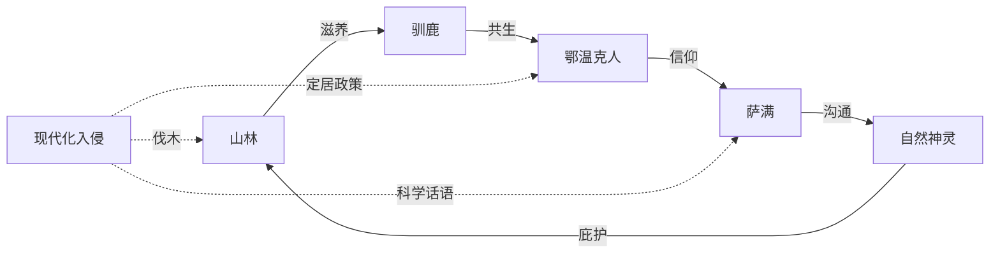

# 《额尔古纳河右岸》深度读书笔记

> [!abstract] 全书速览
> 这是一个九十岁的鄂温克族老女人坐在最后的火塘边，用一整个黄昏讲完她的民族百年故事的书。你听到的声音从大兴安岭的密林深处传来，混着松脂的气味、驯鹿的铃声和萨满鼓点的回响。你读到的不是一段猎奇的边疆民俗志，而是一个古老民族从丛林走向消亡的完整弧线——他们随驯鹿迁徙，依河流而居，在零下四十度的冬天里生孩子、埋死人、与熊对峙、同风雪周旋。迟子建没有用人类学家的冷静距离去记录他们，也没有用旅行者的浪漫滤镜去美化他们，她用的是一种介于歌谣与挽歌之间的声音——温暖、哀伤、不急不缓，像额尔古纳河本身一样绵长。你读完这本书，不会觉得自己了解了一个民族，你会觉得自己失去了一个世界。

## 时代与作者

迟子建1964年出生在中国最北端的漠河，大兴安岭的莽莽林海是她从小到大的生活底色。她不是鄂温克族人，但她是在这片土地上长大的孩子。北方那种漫长的冬天、极昼极夜的交替、人与自然之间既亲密又紧张的关系，渗透在她几乎所有的写作中。如果你读过她的《北极村童话》或《伪满洲国》，你会发现她笔下的世界始终围绕着东北和大兴安岭展开，而她对这片土地的感情不是远观式的乡愁，而是一种骨子里的熟悉——她知道雪什么时候会停，知道白桦树在什么季节落叶，知道零下四十度时人呼出的气会在眉毛上结成霜。

在中国当代文坛，迟子建的位置是独特的。她既不属于先锋派的形式实验（余华、格非那一路），也不归入新写实的日常还原（方方、池莉那一路），更不同于寻根文学对传统文化的知识分子式反思。她走的是一条以==自然、死亡、灵性==为核心的叙事道路——你在她的小说里总能遇到雪、河流、动物、死亡，以及某种超越日常的神秘力量。

《额尔古纳河右岸》写于2005年，获得了第七届茅盾文学奖。它的创作缘起是迟子建对鄂温克族使鹿部落的一次深入走访。鄂温克族是中国人口最少的少数民族之一，其中的使鹿部落更是只剩下几百人。他们世世代代在大兴安岭的原始森林中放养驯鹿，跟随驯鹿的觅食路线在山间迁徙，住在用桦树皮搭成的"希楞柱"里，信仰萨满教，与自然万物保持着一种你在现代生活中几乎无法想象的亲密关系。

但到了二十一世纪初，这种生活方式已经走到了尽头。2003年，政府实施"生态移民"政策，将最后一批使鹿鄂温克人从山上迁到山下的定居点。驯鹿被圈养，猎枪被收缴，希楞柱被砖房取代。迟子建的走访正好发生在这个转折点前后，她看到了一种文明在消失前的最后面貌。她后来说，她想为这个民族留下一部"民间史诗"，不是学术意义上的民族志，而是用文学的温度去呈现一种即将逝去的生命方式。

> [!note] 创作中的个人之痛
> 更特殊的是，在写作这部小说的过程中，迟子建的丈夫在一场车祸中意外去世。==个人的丧失之痛与一个民族的消逝之悲==，在这部作品中形成了深层的共振。当你读到"我"讲述失去丈夫拉吉达时的痛苦——那种突然的、不可理解的、被命运一击击碎的感觉——那不仅是一个虚构角色的感受，也是作者本人在文字中安放的哀恸。这种共振赋予了小说一种不同寻常的真实力量——它的悲伤不是计算出来的，而是从骨头里渗出来的。

理解这个创作背景对你读这本书非常重要。《额尔古纳河右岸》不是一部猎奇式的少数民族题材小说，也不是一部控诉现代化的环保檄文。它是一个作家面对文明消逝时的复杂感情——既有不舍，也有理解；既有挽歌般的哀伤，也有对生命本身的信任。你在读的时候能感觉到，迟子建不是在替鄂温克人代言，她是在用文学的方式让这些声音被更多的人听到，在它们彻底沉寂之前。

## 故事的核心张力

如果你试着为《额尔古纳河右岸》找到一条最底层的裂缝——那条贯穿始终、无法弥合的裂缝——它不是善与恶的对抗，不是文明与野蛮的碰撞，而是一个更深沉、更无解的东西：**自然的时间与历史的时间之间的撕裂**。

鄂温克人的生活运行在自然的时间里。他们的日历是季节的轮转——春天跟着驯鹿寻找新的苔藓地，夏天在河边扎营躲避蚊虫，秋天猎取灰鼠储备过冬的皮毛，冬天在大雪封山的密林中围着火塘取暖。他们的生死也嵌入自然的循环——人死了，不用棺材，用白布裹了放在树上，让风和鸟带走。驯鹿生了小鹿，全族人围过来像迎接自己的孩子。河流涨水、林火烧山、暴风雪突降，这些不是"灾难"，而是自然节律的一部分，就像呼吸有呼也有吸。这种时间是圆形的，年复一年，循环往复，没有起点也没有终点。

但历史的时间是线性的、不可逆的。它带来了日本人的侵略、苏联的影响、新中国的成立、人民公社、文化大革命，以及最终的定居政策。每一波历史浪潮都以自己的方式冲击这个小小的部落：日本人征走了他们的壮劳力，文革中有人因为跳萨满舞被批斗，定居政策则从根本上取消了他们的生活方式。历史的时间是直线的、单向的，它只朝一个方向走——朝着所谓的"进步"和"现代化"走——而它每前进一步，鄂温克人的世界就缩小一寸。

> [!warning] 核心张力
> 这种张力的残忍之处在于，它不是坏人造成的。实施定居政策的人不是恶人，他们真的觉得让鄂温克人住进暖和的砖房、让孩子上学、让老人看病是好事。从他们的逻辑出发，这一切确实是"进步"。但对于那些在密林中活了几百年的人来说，"进步"意味着==失去驯鹿、失去迁徙、失去与自然万物的对话方式、失去作为鄂温克人的根基==。你不能简单地说谁对谁错。你只能站在这条裂缝的边缘，看着两种时间互相撕扯，然后承认——有些东西一旦失去，就再也回不来了。

小说中最让你感到这种撕裂的，不是某个具体的冲突场景，而是整个叙事的节奏变化。前半部分——老女人讲述她的童年和青壮年时期——叙事舒缓、绵长，像一条慢慢流淌的河。季节在转，人在生死，但底色是安稳的。到了后半部分，叙事加速了，事件变得密集，外部世界的介入越来越频繁，你能感觉到一种从容正在被侵蚀。这种节奏上的变化本身就是核心张力的体现——自然的时间被历史的时间追赶、挤压，最后被覆盖。

## 人物命运

### "我"：最后的讲述者

全书以一个九十岁鄂温克老女人的第一人称讲述展开。她没有被赋予一个具体的名字——这个处理是有深意的。她不是一个"角色"，而是一个"声音"，是整个民族最后的声音。

她的叙述有一种独特的质地：不急不缓，带着老年人特有的平静和偶尔的跑题。她讲到一个人的死，可能突然插入一段关于那年冬天驯鹿产仔的记忆；讲到一场暴风雪，又会回忆起暴风雪之后她和丈夫在火塘边的一个温暖夜晚。你如果习惯了现代小说的紧凑叙事，一开始可能会觉得"散"，但读进去之后你会发现，这种散恰恰是真实的——一个九十岁老人的记忆就是这样工作的，它不分章节，它按照温度和气味来排列。

她最显著的特质是==清醒的悲悯==。"清醒"意味着她既不美化过去——她知道游牧生活的艰辛，严寒、疾病、婴儿的夭折、野兽的威胁，这些她都亲身经历过；"悲悯"意味着她也不否定现在——她理解年轻人想下山的渴望，理解他们对更舒适生活的向往。但她内心深处知道一件事：有些东西一旦失去就再也找不回来了。

> [!tip] 不下山的选择
> 当氏族的大多数人决定搬迁到山下的定居点时，"我"选择留在山上。这个选择不是"反动"或"守旧"。她不是因为不了解山下的生活而拒绝——她比谁都清楚山下有医院、有学校、有电视、有暖气。她的选择是一种存在性的：在她看来，==离开山林的鄂温克人就不再是鄂温克人了==。山林不是一个可以被替换的"居住环境"，而是鄂温克人之所以是鄂温克人的根基。她的不下山是一种最后的尊严：我知道这个世界正在改变，我知道我无法阻止，但我可以选择不参与这种改变——至少在我还活着的时候。

为什么迟子建选择了一个女性来担任叙事者？在鄂温克族的游牧生活中，男性是猎人——他们出发、追逐、捕获、归来，他们的生活节律是断裂的、外向的。而女性是日常生活的真正维系者——她们负责搭建和拆卸希楞柱、照料驯鹿、鞣制兽皮、制作食物、养育后代、维系火塘。男性狩猎归来又离去，而女性始终在场。选择女性视角，就是选择了一个更完整、更连续、更贴近生活肌理的叙事立场。女性的目光不是英雄式的——它不聚焦于壮举和征服，而是关注日常的细节：食物的味道、孩子的哭声、驯鹿的脚步、火塘的温度。正是这些细节构成了一种文化的真实质地。

### 妮浩萨满：以命换命的悲剧

如果全书中有一个人物最集中地体现了迟子建对生命的理解，那就是妮浩萨满。妮浩继承了萨满的神职，拥有救人的能力。但这种能力有一个可怕的代价：==每救一个人的命，她就必须付出自己一个孩子的生命==。

你第一次读到这个设定的时候，可能会觉得它是一种文学夸张。但这个设定来自鄂温克族萨满信仰中关于"代价"的观念——在这种信仰体系中，宇宙间的生命力是守恒的：要拯救一个生命，就必须以另一个生命来交换。萨满是这种交换的中介，而交换的"货币"往往是萨满自己最亲近的人。

妮浩不是一个抽象的信仰符号。迟子建花了大量笔墨让你看到她作为一个普通女人的一面——她会哭、会怕、会犹豫、会在每次丧子之后像所有母亲一样崩溃。她怀孕时会小心翼翼地抚摸肚子，她看着孩子长大时会露出温柔的笑容。正是这些"普通"的细节让她后来的每一次选择都变得如此沉重——你知道她在付出什么代价。

每当氏族中有人生了重病、面临死亡的威胁时，妮浩就会被请来跳神。她穿上那件神裙——那件裙子在她身上越来越沉重——跳起萨满的舞蹈，唱起古老的神歌。每一次，她都成功了。每一次，她的一个孩子就在不久之后死去。

> [!example] 伟大与残忍的边界
> 妮浩的选择带来一个尖锐的追问：这到底是伟大还是残忍？从现代伦理学的角度来看，一个母亲让自己的孩子去死来救别人的孩子，几乎是不可接受的。但迟子建没有用现代的伦理框架来审判妮浩。她呈现的是一种前现代的生命观——在鄂温克人的世界里，萨满不是一个可以选择的"职业"，而是一种降临在你身上的"命运"。妮浩没有选择成为萨满，是萨满选择了她。她的痛苦恰恰是她神圣性的来源——正因为代价如此巨大，她的救赎才具有真正的力量。

妮浩最后一次跳神是全书的情感顶点之一。她已经失去了多个孩子，她的身体已经被一次次的跳神掏空，但当又一个人面临死亡时，她再次穿上了神裙。这一次，她知道代价可能是她自己的生命。她跳了，她救了人，然后她倒下了。这个场景之所以如此动人，不是因为它"悲壮"——迟子建不追求悲壮的效果。而是因为它呈现了一种你在现代社会中几乎看不到的东西：一个人愿意为了一种看不见的信念，付出最高的代价。在一个所有东西都可以被定价、被交易、被替代的世界里，妮浩用生命证明了某些东西是不可替代的。

你如果把妮浩的处境放到自己的生活里去感受，你会意识到她面对的是一种极端形式的"义务"。你在工作中也好，在家庭中也好，常常会面对"个人利益"和"责任"之间的冲突。妮浩的故事不会教你怎么选，但它会让你用一种不同的维度去理解"义务"这个词——义务不总是压迫，有时候它是一个人和世界之间最深的纽带。

### 林克与达玛拉：黄金时代的缩影

"我"的父母林克和达玛拉代表了鄂温克族的黄金时代。林克是一个优秀的猎人和领袖——他强壮、果断、对山林了如指掌。达玛拉是一个温暖的母亲和歌者——她的歌声能在漫长的冬夜里抵御严寒。他们之间的爱情没有被戏剧化。它不是热烈的、充满冲突的那种文学化的爱情，而是一种嵌入在日常生活深处的默契——他打猎归来，她生火做饭；他沉默不语，她心领神会。这种爱的质地与鄂温克人的生活方式是一致的：不张扬、不刻意，但深沉、持久，像山林中的河流，表面平静，底下从不停歇。

他们的存在让你知道：这个民族曾经拥有怎样的丰盛。这不是物质的丰盛——鄂温克人从来不富裕——而是==一种存在方式的完整性和尊严感==。当你看到他们与驯鹿、山林、河流和谐共处的画面时，你会隐约感到一种在今天的生活中缺失的东西——一种人与世界之间自在的契合。

### 依莲娜：断裂一代的悲剧

依莲娜是"我"的孙女，一个在外面的世界接受了教育的年轻画家。她代表了被迫在两个世界之间选择的一代人。她走出了大兴安岭，接受了现代教育，有了绘画的梦想，但她也酗酒、迷茫、在城市和森林之间来回撕扯。她的画反复出现森林和驯鹿的意象——这说明她从未真正离开。但她也回不去了。她像是一棵从原生土壤中被连根拔起、移植到另一种土壤中的树——活着，但总是不太对劲。

依莲娜的最终命运——酗酒致死——不是一个个人的弱点导致的悲剧，而是一种文化断裂的必然结果。当一个人失去了定义自身存在的整套参照系统，当他既无法回到传统也无法融入现代，他就容易滑入一种存在性的虚无。

你不需要是鄂温克人才能理解那种撕裂感——任何一个从小地方来到大城市的人，任何一个在传统和现代之间摇摆的人，都能在依莲娜身上看到自己的影子。她的痛苦不是因为新世界不好，而是因为旧世界已经回不去，而新世界又不完全是她的。她的画布上留下了山林的影子，但她自己再也走不进那片山林了。

### "我"的两段婚姻：爱在无常中的不同面貌

"我"与第一任丈夫拉吉达的爱情是全书最温暖的段落之一。拉吉达是一个沉默寡言但内心柔软的猎人。他对"我"的爱不体现在言语中，而是在每一个日常的细节里——帮她暖手、为她猎取最好的皮毛、在风雪夜守护她。拉吉达的死——被雷电击中——是突然的、不可解释的、带有某种自然神秘力量的终结。

"我"与第二任丈夫瓦罗加的关系则呈现了爱情的另一面。瓦罗加后来沉溺于酗酒——这指向了一个更深层的问题：当一个民族的生活方式被侵蚀、当一个男人作为猎人的存在意义被动摇时，个体会以何种方式崩溃。两段婚姻的对比不是在比较两个男人的好坏，而是在展现一个民族从完整到破碎的过程中，个人命运如何被裹挟。拉吉达的时代，人与自然的关系尚且完好，爱情可以在这种完好中生长。瓦罗加的时代，这种关系开始破裂，连爱情都无处扎根了。

## 主题深层解读

### 万物有灵：不是信仰，而是一种存在方式

在大多数小说里，自然是故事发生的"背景"。但在《额尔古纳河右岸》中，自然不是背景，它是角色。额尔古纳河、大兴安岭、驯鹿、白桦林、极光、暴风雪——它们参与了故事的进程，影响了人物的命运，甚至拥有自己的"意志"。

驯鹿是最明显的例子。鄂温克人不是"养"驯鹿的——这个"养"字暗含了一种人对动物的主导关系。更准确地说，鄂温克人是"跟随"驯鹿的。驯鹿知道哪里有苔藓，哪里有水源，哪里可以安全过冬。人类依赖它们的引导来决定迁徙路线。这种关系不是驯养关系，而是伙伴关系。当你读到鄂温克人给每一头驯鹿取名字、在驯鹿死去时真心悲痛的段落，你会意识到，"人与自然的关系"这个抽象的环保话题，在这本书里被具象化为了你能够感受到的情感联结。

> [!tip] 驯鹿的隐喻
> 驯鹿被带到定居点后的萎靡和生病，是全书最有力的隐喻。驯鹿需要自由行走在山林中，需要吃新鲜的苔藓，围栏和人工饲料对它们来说是慢性毒药。而这不仅是一个动物福利的问题——==整个鄂温克文化在现代化环境中的"水土不服"，浓缩在了驯鹿的萎靡之中==。

火塘是另一个关键意象。鄂温克人的希楞柱中央永远燃烧着火塘。火塘不只是物理意义上的取暖设施——它是温暖的来源、食物的媒介、聚会的中心、故事讲述的场所。在漫长的冬夜里，一家人围坐在火塘边，老人讲述古老的故事，孩子们在火光中入睡。火塘是家的心脏——火塘灭了，家就散了。小说最终的意象——"我"坐在最后的火塘边讲述——既是叙事设置，也是最沉重的象征。

在鄂温克人的世界里，万物有灵不是一种"信仰"，而是一种认知方式。他们不是"相信"树有灵魂然后才尊重树——他们从一出生就生活在一个树、水、动物和人同等重要的世界里。萨满不是"迷信从业者"，而是这种认知方式的维护者。迟子建在这个问题上做了最难的事——在小说的叙事中让两种认知体系并存。你不需要"相信"萨满教才能读懂这本书；你需要做的是暂时放下自己的认知框架，进入另一种理解世界的方式，去感受它的内在逻辑和情感真实。

### 死亡：嵌入自然的循环

死亡在《额尔古纳河右岸》中是高频出现的。但你在读这些死亡的时候，会发现一件奇怪的事：你没有那种在读其他小说时感到的"被虐"的感觉。死亡在这里不是故事的高潮，不是情节的转折点，它是叙事的日常肌理。

这和鄂温克人对死亡的理解有关。他们把死者放在树上——这个仪式叫"风葬"。让风和鸟慢慢带走肉体，让灵魂回到自然中去。在这个体系里，==死亡不是终结，而是回归==。人从自然中来，活的时候和自然共处，死了之后回到自然中去。没有什么真正消失，一切只是在变换形态。

迟子建在写死亡的时候，总是把它放在自然的怀抱中。一个猎人死在了雪地里，雪慢慢覆盖了他的身体；一个老人死在了希楞柱中，外面的松树在风中摇晃。这种处理方式不是在美化死亡，而是在还原死亡在鄂温克人生活中的本来面貌——它不是需要被恐惧的怪物，而是生命的另一个面向。

你在现代社会中对死亡的恐惧，很大程度上来自你与自然的断裂。当你的生活完全发生在人造环境中——城市、办公室、医院——死亡就变成了一个孤立的、可怕的事件。但如果你的生活嵌入在自然的循环中，死亡只是循环的一个环节。这本书不是在教你不怕死，它是在让你看见另一种和死亡相处的方式。

> [!note] 讲述对抗遗忘
> 小说中还有一个被很多读者忽略的主题：讲述本身就是一种对抗死亡的方式。在没有文字的文化中，口耳相传是记忆的唯一载体。一个人"真正"的死亡，不是心跳停止，而是最后一个记得他的人也离去了。"我"的讲述因此获得了一种紧迫感——如果她不说，就没有人能说了。这些人、这些事、这种生活方式，就将真正地从世界上消失。==只要被讲述，死者就没有真正离开==。

### 文明的消逝：谁有权定义"进步"

这可能是全书最沉重也最无解的主题。鄂温克人的使鹿生活方式正在消失，这是一个事实。政府让他们下山定居，给他们砖房、给孩子上学的机会、给老人医疗保障——这些从任何"客观"标准来看都是好事。但当你读完这本书，你很难用"进步"这个词来描述这个过程。

问题的核心在于：谁有权定义什么是"好的生活"？如果你用人均寿命、受教育程度来衡量，鄂温克人定居之后的生活确实"更好"了。但如果你用人与自然的关系、文化的完整性、精神世界的丰富度来衡量，他们失去的远比得到的多。下了山的鄂温克人中，酗酒、抑郁、身份迷失的比例很高——这些在大兴安岭的密林中几乎不存在的问题，在定居点成了普遍现象。

> [!warning] 闭合生态系统的瓦解
> 小说中的核心意象构成了一个闭合的生态循环：山林滋养驯鹿，驯鹿与鄂温克人共生，鄂温克人通过萨满与自然神灵沟通，自然神灵庇护山林。现代化的入侵打破的不是某一个环节，而是整个循环系统——伐木队砍伐山林，定居政策拆散了人与驯鹿的共生关系，科学话语消解了萨满信仰。==一旦循环断裂，每个环节都开始枯萎==。

迟子建没有给出答案。她没有说"定居是错的"，也没有说"原始生活才是对的"。她做的是更有文学良心的事——她把两种生活方式都呈现给你，让你自己去感受。你会发现这个问题比你想象的复杂得多。你不能简单地站在某一边，因为两边都有真实的人在承受代价。

但她确实通过叙事的力量让你感受到了一种你在日常生活中很少感受到的东西：文明消逝的具体质感。不是统计数字意义上的"一个民族的传统文化在流失"，而是具体到——你再也听不到驯鹿踏过积雪的声音了，再也看不到萨满在篝火旁跳舞了，再也不会有人用鄂温克语唱那些古老的歌了。这种具体性才是文学能做到而社会学做不到的事。

### 女性的韧性：撑起世界的沉默力量

你读完《额尔古纳河右岸》之后会发现一个有趣的事实：这本书中最坚韧、最丰富、最让你记住的角色，几乎都是女性。老女人、妮浩、达玛拉、依莲娜——是她们在承受丧失之后继续维系部落的日常运转，是她们在男人们打猎、喝酒、或者倒下之后撑起了这个世界。

但迟子建不是在写一部"女性赞歌"。她笔下的女性不是因为性别身份而被抬高的，她们的力量来自她们的经历和选择。老女人经历了两任丈夫的死亡，但她没有崩溃——她继续照顾驯鹿，继续记住每一个活过和死去的人。妮浩付出了最残酷的代价，但她没有放弃自己的职责。这些女性的韧性不是超人式的，而是日常式的——==她们的力量不在于做了什么惊天动地的大事，而在于每一天、每一个季节、每一次丧失之后，她们还在那里==。

你如果把这本书和余华的[[《活着》]]放在一起看，会发现一个有趣的对照。余华笔下的家珍也是一个沉默坚韧的女性，但家珍的坚韧是在一个父权社会的框架内展开的——她的力量在很大程度上依附于家庭。而迟子建笔下的女性拥有更大的独立性——她们的力量不是来自对男性的忍让或对家庭的维护，而是来自她们与自然、与信仰、与部落的直接连接。这是鄂温克文化的特殊性赋予她们的空间，也是迟子建作为女性作家特别敏锐地捕捉到的东西。

## 文学手法

迟子建在《额尔古纳河右岸》中最显著的文学手法是她的叙事声音。全书以第一人称的九十岁老女人口吻讲述，这个声音从第一页到最后一页保持了高度的一致性——缓慢、温暖、偶尔带着老人特有的絮叨和跑题，但从不刻意煽情。这种声音的选择决定了全书的调性：你不是在"看"一个故事，而是在"听"一个故事。你能感觉到火塘的温度，能闻到松脂的气味，能听到外面风雪的声音。

结构上，小说被分为"清晨""正午""黄昏"三个部分加一个尾声，对应老女人一生从年少到暮年。这种以一天的时间结构来框架一个人一生的手法，本身就是一个隐喻——一个人的一生和一天的长度相比并没有多大区别。清晨是清新的、充满希望的；正午是炽热的、事情最多的；黄昏是安静的、带着回顾和不舍的。这三段的叙事节奏、语调和情感密度都明显不同，但过渡极其自然，像日光的移动一样不知不觉。

迟子建处理时间的方式也值得你注意。她不依赖精确的年代来标记时间——你很少在书中看到"1952年"或"1978年"这样的标记。时间是通过自然现象来标记的："那年冬天雪特别大""驯鹿公鹿掉角的那个秋天"。这种计时方式是鄂温克人真实的时间感知方式。她把它移植到了叙事中，产生了你在其他小说中很少体验到的效果——时间变得柔软、模糊，不再是硬性的坐标，而是一种弥漫在空气中的东西。

在语言层面，迟子建的文字有一种独特的质地：它既不是余华式的极简冷酷，也不是莫言式的汪洋恣肆。她的语言是==温润的、有包浆的==，像一块被河水长年冲刷过的鹅卵石。她写雪、写河、写驯鹿、写火，每一处自然描写都不是孤立的风景画，而是和人物的内心状态紧密交织在一起。当人物快乐的时候，河水是欢快的；当人物悲伤的时候，暴风雪会在恰当的时候降临。

另一个值得你关注的手法是她处理"超自然"元素的方式。萨满的法术、人与动物之间的神秘联结、某些无法用理性解释的巧合——这些元素在小说中以一种"就是这样"的语气出现，不解释、不质疑、不惊讶。这和马尔克斯那种刻意的、炫技的魔幻不同，迟子建的"魔幻"来自鄂温克文化本身的日常逻辑。在一个万物有灵的世界里，萨满治病和猎人打猎一样正常。她没有把这些元素当作"奇观"来展示，而是把它们融入了叙事的日常肌理中，让你在不知不觉中接受了另一种世界运行的方式。

> [!note] 历史的边缘化处理
> 历史事件在小说中被边缘化处理也是一个有意识的叙事选择。小说覆盖了从日本侵华到改革开放的近一个世纪，但这些"大历史"不是叙事的主轴，而是从山林深处被边缘性地感知到的回响。日本人来了，他们知道山下在打仗；新中国成立了，有人上山来动员他们。迟子建完成了一个根本性的叙事立场转换：==不是让少数民族成为主流历史的注脚，而是让主流历史成为少数民族生活的注脚==。这种处理方式告诉你，有一种人类生活，它的重心不在国家政治和意识形态中，而在人与自然、人与驯鹿、人与火塘的日常关系中。

## 为什么今天还要读这本书

你大概生活在一个城市里。你的一天由闹钟、手机、地铁和屏幕组成。你和自然的接触可能仅限于周末的公园或朋友圈里的风景照。你不知道驯鹿长什么样，不知道白桦树的皮可以做什么，不知道零下四十度是什么感觉。在你的世界里，"迁徙"是换一个城市工作，"打猎"是在网上抢购限量商品。

读《额尔古纳河右岸》不是为了满足你对"原始生活"的猎奇心理，也不是为了让你在读完之后感叹一句"真可惜，又一种文化消失了"然后继续刷手机。这本书能给你的，是一种视角的校准——它让你意识到，你习以为常的那种生活方式只是人类生活的无数种可能之一，而且是非常晚近的一种。在这种方式出现之前，人类已经用完全不同的方式在这个星球上生活了几万年。

> [!tip] 阅读启示
> 当你在加班到深夜、感到被工作掏空的时候，当你在人际关系中感到疲惫和虚伪的时候，当你问自己"这一切到底有什么意义"的时候——你不需要真的跑到大兴安岭去放驯鹿。你只需要知道有一种生活方式曾经存在过：在那种方式里，一个人的价值不取决于他的收入或地位，而取决于他能不能在暴风雪中找到回家的路；一个人的幸福不来自购物或娱乐，而来自春天第一只小驯鹿的降生；一个人面对死亡不需要恐惧，因为死亡只是回到你本来就属于的那个世界。

这本书还能改变你对"少数"和"边缘"的理解。在你的认知框架中，鄂温克人是"少数民族"，他们的文化是"非主流的"。但在他们自己的世界里，他们不是少数，他们就是世界本身——大兴安岭、驯鹿、额尔古纳河，这些构成了他们全部的现实。"少数"这个标签是从外部贴上去的。《额尔古纳河右岸》邀请你站在另一边去看——从密林中向外看，那个高楼林立、汽车轰鸣的世界，才是奇怪的、不可理喻的。

每一个在城市化进程中失去故乡的人，每一个看到传统手艺和方言消失的人，每一个感到自己的生活越来越"标准化"的人，都能在这部小说中找到回响。当你的老家被拆迁成商业楼盘，当你发现自己已经说不流利家乡话——你就在某种程度上经历着"我"所经历的那种失去。

读完这本书之后，你可能会停下来想一想：你的生活中有什么是"火塘"？有什么是你不愿意放弃的东西，即使全世界都说应该"进步"？这本书不会给你明确的答案。但它会让你知道：==追问这个问题本身，就是一种抵抗——抵抗那种认为一切都可以被标准化、被量化、被替代的思维方式==。

## 延伸阅读

- [[《尘埃落定》]]：阿来以藏族土司制度的覆灭为背景，和《额尔古纳河右岸》有着类似的主题关切——一种古老的生活方式在历史的碾压下走向终结。两本书的叙事策略也有有趣的对照：迟子建用温暖的挽歌，阿来则用一个"傻子"的视角来呈现同样的主题。对照着读，你会看到"文明消逝"这个主题在不同民族经验中的不同回响。

- [[《呼兰河传》]]：萧红是迟子建的文学前辈，两人共享东北大地的地理和精神亲缘。《呼兰河传》同样以女性视角呈现一个正在消逝的世界——不是少数民族的，而是北方乡土的。两位作家都擅长在日常生活的细节中捕捉时代变迁的痕迹，都有一种不动声色的悲凉。

- [[《群山之巅》]]：迟子建另一部长篇，继续探索东北大地上的人性与命运。你也可以读沈从文的[[《边城》]]——两本书都在写边缘地带的人群，都在写自然与人的关系，但沈从文的笔调是牧歌式的，迟子建则多了一层对消逝本身的正视。
