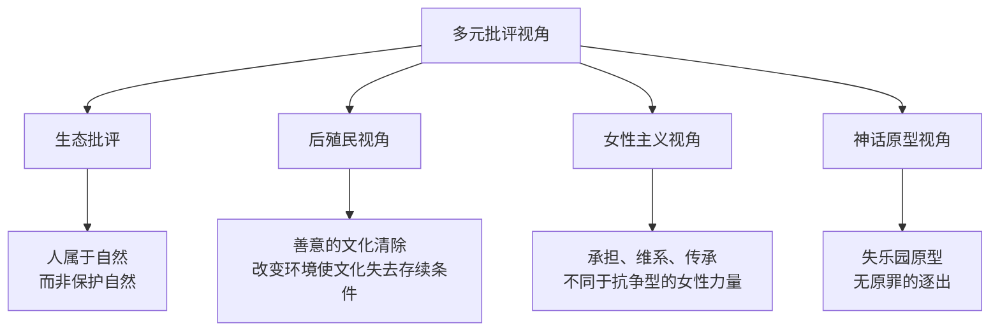

# 《额尔古纳河右岸》深度读书笔记

> [!abstract] 全书速览
> 这是一部关于消逝的挽歌。一位年近九旬的鄂温克族老人坐在最后的火塘边，用她苍老但清醒的声音，讲述着她的民族如何在大兴安岭的山林中与驯鹿相伴、与自然共生，又如何在近百年的时间里被现代化的洪流冲刷得支离破碎。读完这本书，你不会愤怒，你会感到一种深沉的悲凉——不是控诉式的愤怒，而是明知一切终将逝去却仍要郑重讲述的庄严。这是2008年茅盾文学奖的获奖作品，也是中国当代文学中最具自然书写意识的长篇之一。

## 时代与作者

迟子建1964年出生于黑龙江漠河北极村，那片中国最北端的冰雪覆盖的土地赋予了她笔下独特的地理诗学。在中国当代文坛，她的位置独特：既不属于先锋派的形式实验，也不归入新写实的日常还原，而是走出了一条以==自然、死亡、灵性==为核心的叙事道路。她的小说里总有雪、有河流、有动物、有死亡、有某种超越日常的神秘力量。

这部小说的写作缘起值得注意。2003年，迟子建读到一则新闻：鄂温克族最后的猎民部落被要求从山林搬迁到定居点。她随后深入大兴安岭采访鄂温克族老人，收集口述史料，并在丈夫意外去世的巨大悲痛中完成了这部作品。==个人的丧失之痛与一个民族的消逝之悲==在这部小说中形成了深层共振——当你读到"我"讲述失去丈夫拉吉达时的痛苦，那不仅是一个虚构角色的感受，也是作者本人在文字中安放的哀恸。这种个人经验与文学创作之间的共振，赋予了小说一种不同寻常的真实力量。

> [!note] 文学史定位
> 在世界文学脉络中，《额尔古纳河右岸》可与加西亚·马尔克斯的[[《百年孤独》]]（家族史诗与文明消逝）、阿尔谢尼耶夫的《德尔苏·乌扎拉》（猎人与自然的关系）、以及北美原住民文学中的部落叙事形成对话。但迟子建的独特之处在于：她不是以旁观者或人类学家的视角去"记录"一个民族，而是**让这个民族自己开口说话**。

## 故事的核心张力

这部小说的底层冲突不是善与恶、爱与恨，而是==生存方式之间的不可调和==。一边是鄂温克人与驯鹿相伴、与山林共生、在万物有灵的世界观中安然栖居的传统生活；另一边是以"进步"为名、以定居为形式、以标准化为目标的现代文明。

> [!warning] 核心张力
> 这个冲突的残酷之处在于：它不是暴力的征服，而是**温柔的消解**。没有人举着枪逼迫鄂温克人下山——政府为他们建造了砖瓦房，提供了自来水和电视，年轻人被"更好的生活"吸引。但当驯鹿被带到定居点后无法适应围栏和人工饲料而萎靡生病时，当萨满信仰被"科学"话语消解时，当最后一个会讲完整故事的老人即将离去时——一种生活方式就这样在善意中走向了终结。

小说的另一重张力存在于叙事者"我"的身份之中。她既是故事的亲历者，又是故事的最后守护者。她的讲述既是回忆，也是告别。她知道，当她停止讲述的那一刻，那个世界就真的消失了。这种叙事位置使得文本弥漫着一种明知终将失去却仍要讲述的悲凉力量——就像风葬中的死者被放在树上归还给自然一样，"我"的讲述是要把一个民族的记忆归还给语言。

全书分为"清晨""正午""黄昏""尾声"四部分，用一天的时间来隐喻一个民族的兴衰。但这个结构不是宿命论——挽歌之所以是挽歌，正是因为唱歌的人既承认了死亡的必然，又拒绝了沉默的屈从。

## 人物命运

### "我"——最后的讲述者

小说的叙事者"我"是一位年近九旬的鄂温克族老年女性，她没有被赋予具体的名字——她不是一个"角色"，而是一个"声音"，是整个民族最后的声音。她的一生横跨了鄂温克族近百年的历史，她是所有事件的见证者，也是最后一个完整记住这些事件的人。

她最显著的特质是==清醒的悲悯==。她既不美化过去（她知道游牧生活的艰辛——严寒、疾病、婴儿的夭折、野兽的威胁），也不否定现在（她理解年轻人想下山的渴望），但她内心深处知道：有些东西一旦失去就再也找不回来了。

> [!tip] 关键洞察
> 她的讲述不是为了控诉谁，而是为了在语言中保存即将消逝的世界。当她选择不下山时，这不是"反动"或"守旧"，而是一种最后的尊严：我知道这个世界正在改变，我知道我无法阻止，但我可以选择不参与这种改变——至少在我还活着的时候。在她看来，离开山林的鄂温克人就不再是鄂温克人了——山林不是"居住环境"，而是这个民族之所以成为这个民族的根基。

为什么选择"酋长的女人"而不是酋长本人来叙述？因为在鄂温克族的游牧生活中，女性是日常生活的真正维系者——她们负责搭建和拆卸希楞柱（帐篷）、照料驯鹿、制作食物、养育后代、维系火塘。男性狩猎归来又离去，而女性**始终在场**。选择女性视角，就是选择了一个更完整、更贴近生活肌理的叙事立场——女性的目光不聚焦于壮举和征服，而是关注食物的味道、孩子的哭声、驯鹿的脚步、火塘的温度。

### 妮浩——信仰的重量与代价

妮浩是全书最令人心碎的角色。她是氏族的女萨满，拥有通灵和治病的能力，但**每一次她跳神救活别人，她自己的一个孩子就会死去**。这个设定来自鄂温克族萨满信仰中关于"代价"的观念：宇宙间的生命力是守恒的，要拯救一个生命，就必须以另一个生命来交换。

妮浩不是一个符号或象征，而是一个活生生的女人——她会哭、会怕、会犹豫、会在每次丧子之后像所有母亲一样崩溃。但每当氏族需要她时，她就穿上那件神裙，跳起那段舞蹈，然后承受又一次丧子之痛。

> [!example] 伟大与残忍的边界
> 妮浩的选择是伟大还是残忍？在现代伦理学中，一个母亲"选择"让自己的孩子去死来救别人的孩子，几乎是不可接受的。但迟子建没有用现代伦理框架来审判妮浩。她呈现的是一种**前现代的生命观**：萨满不是一个"职业"，而是一种"命运"，妮浩的痛苦恰恰是她神圣性的来源。她的伟大在于：她在痛苦中依然选择承担使命。
>
> 在一个不再相信萨满的世界里，妮浩的牺牲还有意义吗？迟子建的回答是：意义不取决于信仰是否被"证实"，而取决于承担者是否真诚。妮浩用自己孩子的生命为代价来实践信仰，这种代价本身就构成了意义——在一个所有东西都可以被定价、被交易的世界里，妮浩用生命证明了某些东西是不可替代的。

### 林克与达玛拉——黄金时代的缩影

"我"的父母代表了鄂温克族黄金时代的缩影。林克是优秀的猎人和领袖，达玛拉是温暖的母亲和歌者。他们的爱情不是戏剧化的，而是嵌入在日常生活深处的默契——不张扬、不刻意，但深沉、持久。他们的存在让你知道：这个民族曾经拥有怎样的丰盛——不是物质的丰盛，而是一种==存在方式的完整性和尊严感==。

### 依莲娜——断裂的一代

依莲娜是"我"的孙女，一个在外面的世界接受了教育的年轻画家。她试图用绘画来保存鄂温克族的文化记忆，但她自己已经无法完全回到那个世界。依莲娜代表了文化断裂中最痛苦的状态：==她知道自己失去了什么，却无力挽回==。她既不属于山林，也无法真正融入城市。她的最终命运（酗酒致死）不是个人弱点导致的悲剧，而是文化断裂的必然结果——当一个人失去了定义自身存在的整套参照系统，酒精成为填充存在性虚无的最便捷工具。她的画布上留下了山林的影子，但她自己再也走不进那片山林了。

### 两代萨满的对照与"我"的两段婚姻

尼都萨满代表信仰尚未被质疑的时代——萨满的权威是不证自明的。妮浩萨满则面临着更复杂的处境：她不仅要承担使命，还要在信仰逐渐被消解的时代里独自坚守。两代萨满的对照，折射出整个民族精神世界从笃信到动摇的历程。尼都的时代，信仰是空气；妮浩的时代，信仰变成了水中的石头——你必须用力握住它，否则它就会滑落。

"我"与拉吉达的爱情是全书最温暖的段落——他沉默寡言但内心柔软，爱体现在每一个日常细节中。他的雷电之死在鄂温克人的世界观中并非"偶然"，而是天神的意志。"我"与瓦罗加的关系则呈现了爱情的另一面——当一个民族的生活方式被侵蚀、当猎人的存在意义被动摇时，个体以酗酒的方式崩溃。两段婚姻的对比展现的是一个民族从完整到破碎的过程中，个人命运如何被裹挟。

## 主题深层解读

### 自然——万物有灵的世界观

迟子建用整部小说来呈现鄂温克人与自然的关系，因为这种关系代表了一种正在消逝的人类生存方式——不是征服自然、利用自然，而是==作为自然的一部分而存在==。

驯鹿是最核心的意象。鄂温克人不把驯鹿当作"牲畜"或"财产"，而是视为共同生活的伙伴。驯鹿有名字，有性格，有情感。人跟着驯鹿走——不是驯鹿跟着人走——驯鹿吃苔藓，苔藓吃完了就迁徙到下一个营地。这种关系决定了鄂温克人的生活节律，也决定了他们的世界观：**人不是自然的主人，人是自然循环中的一个环节**。

火是另一个关键意象。希楞柱中央永远燃烧着火塘，它是温暖的来源、食物的媒介、聚会的中心、故事讲述的场所。火塘是家的心脏——火塘灭了，家就散了。小说最终的意象正是最后的火塘面临熄灭、最后的讲述者即将沉默、最后的驯鹿在定居点无精打采——三重"最后"叠加在一起，构成了全书最沉重的告别。

额尔古纳河既是地理边界，也是文化归属。"右岸"不仅指一个物理方位，更指一种文化的根基之地——一旦离开右岸，鄂温克人就失去了定义自身的坐标。

> [!tip] 深层追问
> 迟子建是否在美化一种"原始"的生活方式？小说并没有回避游牧生活的艰辛，但它确实赋予了这种生活一种**尊严感和完整性**，而这种尊严感在现代化的定居生活中似乎被稀释了。迟子建不是在主张"回到过去"，而是在追问：**当我们获得现代生活的便利时，我们失去了什么？**

### 死亡——生命的另一种形式

在鄂温克人的世界观中，死亡不是生命的终结，而是==生命的转化==。理解他们如何面对死亡，就理解了他们如何理解生命。

风葬是极具表现力的意象。鄂温克人将死者的遗体放在树上，让风雪和时间将其归还给自然。这种丧葬方式本身就是一种世界观的表达：人来自自然，回归自然。没有坟墓、没有墓碑，大兴安岭的整片山林就是他们的墓园——每一棵树下都可能安息着一个先人，每一阵风中都可能携带着他们的气息。

小说中安排了大量的死亡：林克冻死在雪地、拉吉达被雷电击中、瓦罗加死于酗酒、妮浩为救他人而牺牲自己的孩子——每一次死亡都有其独特的形态和意义。萨满的存在本身就是生与死之间的桥梁；风葬将死亡纳入自然循环；而老人的讲述则完成了代际间的记忆传承——==只要被讲述，死者就没有真正消失==。

讲述本身就是一种对抗死亡的方式。在没有文字的文化中，口耳相传是记忆的唯一载体。一个人"真正"的死亡，不是心跳停止，而是最后一个记得他的人也离去了。"我"的讲述因此获得了一种紧迫感——如果她不说，就没有人能说了。

### 文明的消逝——挽歌与抵抗

鄂温克族的命运折射出一个全球性的问题：在现代化的进程中，那些与主流文明不同的生活方式和世界观，是否注定要被淘汰？

> [!warning] 闭合生态系统的瓦解
> 小说中的核心意象构成一个闭合的生态系统。现代化的入侵打破的不是某一个环节，而是整个循环系统：伐木破坏山林，定居政策拆散人与驯鹿的共生关系，科学话语消解萨满信仰。当信仰消解，人与自然之间的敬畏性联结也随之断裂——山林从"神灵庇护的圣地"变成了"可开发的资源"。一旦循环断裂，每个环节都开始枯萎。

驯鹿的命运是文明消逝的最直观体现。被带到定居点的驯鹿无法适应——它们需要吃苔藓，需要在山林中自由行走，围栏和人工饲料让它们萎靡生病。驯鹿的水土不服，正是整个鄂温克文化在现代化环境中的隐喻。

迟子建的叙事立场值得注意：她没有将现代化简单地描绘为"恶"。她承认定居生活带来了医疗、教育和物质条件的改善。但她追问：==一种生活方式的消亡是否是"进步"的必要代价？==如果答案是"是"，那么我们至少应该知道我们失去了什么。

鄂温克人的下山定居，是"解放"还是"消灭"？迟子建的回答暗含在小说的结构中："我"的讲述是在下山之前完成的，**当讲述结束，一切也就结束了**。

### 爱与命运——在无常中寻找恒常

在迟子建看来，爱是人类面对命运无常时最本能的回应——在一切都可能失去的世界里，爱是唯一确定的东西。

与许多爱情叙事不同的是，迟子建笔下的爱不是两个人的私事——它总是嵌入在氏族生活和自然节律的整体之中。山林、河流、驯鹿不只是爱情的"背景"，它们是爱情的"场域"——爱在自然中生长，被自然所滋养，又在死亡中被中断或升华。正因为一切都可能在一场雷暴、一次严寒或一头熊的袭击中失去，每一个在一起的夜晚才格外珍贵。

## 文学手法

### 叙事结构的深意

小说分为四个部分：清晨、正午、黄昏、尾声——对应着这个民族从繁盛到衰落的生命周期。

这一结构设计至少有四重深意：

1. **时间的自然隐喻**："清晨—正午—黄昏—尾声"不是线性历史的划分，而是一个==生命有机体的节律==。迟子建用一天的时间来隐喻一个民族的兴衰，暗示文明如同生命，有它自然的生长与凋零。但这里有一个微妙的张力：如果衰落是"自然"的，那现代化就不值得哀悼——迟子建的结构更像是一种接受：接受终将失去，但不接受无声地失去。

2. **口述史的仪式感**：老人坐在火塘边讲述，这个场景本身就是鄂温克族文化传承的核心方式——没有文字的民族依靠口耳相传保存记忆。迟子建选择让"最后一个知道全部故事的人"来讲述，赋予了叙事一种挽歌式的紧迫感：如果她不说，就没有人说了。

3. **女性视角的选择**：在鄂温克族的游牧生活中，女性是日常生活的维系者，男性狩猎归来又离去，而女性**始终在场**。选择女性视角，就是选择了一个更完整、更贴近生活肌理的叙事立场。

4. **叙事者的双重身份**："我"既是故事的亲历者，又是故事的最后守护者。她的讲述既是回忆，也是告别。

### 历史的边缘化处理

小说的时间跨度从20世纪初延伸到21世纪初，覆盖了日本侵华、新中国成立、文化大革命、改革开放等重大历史事件。但迟子建的处理方式与大多数"史诗性"小说截然不同——这些历史事件不是叙事的主轴，而是从大兴安岭深处一个游牧氏族的视角被==边缘性地感知到的回响==。

日本人来了，他们知道山下在打仗；新中国成立了，有人上山来动员他们；文革来了，外面的世界很混乱——但对于以驯鹿为伴的鄂温克人来说，最重要的事情始终是迁徙、狩猎和生存。

> [!note] 叙事伦理
> 迟子建刻意将"大历史"处理为背景噪音，是为了完成一个根本性的叙事立场转换：不是让少数民族成为主流历史的注脚，而是**让主流历史成为少数民族生活的注脚**。这是一种深刻的叙事伦理选择。

为什么不用第三人称或全知视角？因为第三人称会将鄂温克人变成"被观察的对象"，而迟子建要的是**主体性**——这是"我们的故事"，不是"他们的故事"。

为什么小说的结尾不是"大团圆"或"彻底毁灭"，而是一种含混的、未完成的告别？因为现实本身就是如此。鄂温克人没有在某一天突然"消失"——他们在漫长的过程中被稀释、被同化、被遗忘。这种缓慢的消逝比突然的毁灭更令人心痛。

### 语言风格

迟子建的语言兼具诗性与朴素，她的叙事声音像是一条大兴安岭的河流——表面平缓，底下暗流涌动。她用==诗性的语言讲述粗粝的生活==：鄂温克人的日常生活是粗粝的——宰杀猎物、处理兽皮、在零下四五十度的严寒中迁徙。但迟子建的语言赋予了这些劳作一种诗意的尊严。她不是在"美化"苦难，而是让你看到：在这种生活方式内部，存在着一种自足的美感。

在对话语言方面，迟子建为鄂温克人创造了一种独特的说话方式——简短、直接、带有自然意象。他们不说"我很难过"，他们说"我的心像被冰雪覆盖了"。这种语言不是刻意的诗化，而是来自一个与自然深度共生的民族的自然表达方式。

小说的节奏是缓慢的、绵延的、带有回忆特有的跳跃和重复。这种节奏模拟了口述传统的特质——不是现代小说的精心设计，而是一个老人坐在火塘边、想到哪里说到哪里的自然流淌。但在看似随意的讲述中，迟子建精心嵌入了命运的伏笔和意象的呼应——驯鹿的走失总是预示着某个人的离去，一场暴风雪总是带来一个命运的转折。

## 批判性视角

这部小说的力量在于深情凝视，而非冷静分析。迟子建对鄂温克文化的呈现带有明显的美学化倾向，游牧生活中的冲突、暴力等方面未被充分展开。小说也没有深入探讨现代化进程中的复杂博弈——政策制定者的考量、年轻一代的真实心声、不同鄂温克人对"下山"的分歧。对萨满信仰的呈现是尊重的、甚至是神圣化的——如果你对"前现代"信仰持怀疑态度，这本书可能会让你觉得过于浪漫。

## 为什么今天还要读这本书

> [!tip] 当代意义
> 《额尔古纳河右岸》的力量超越了鄂温克族的个体命运，指向了21世纪人类面临的核心问题之一：==在全球化和现代化的浪潮中，文化多样性如何存续？==

你不需要是鄂温克人才能感受到这种共鸣。每一个在城市化进程中失去故乡的人，每一个看到传统手艺和方言消失的人，每一个感到自己的生活越来越"标准化"的人，都能在这部小说中找到回响。当你的老家被拆迁成商业楼盘，当你发现自己已经说不流利家乡话——你就在某种程度上经历着"我"所经历的那种失去。

迟子建提供的不是答案，而是一面镜子。她让你看到：在我们习以为常的"进步"叙事之外，还存在着另一种衡量生活价值的方式——不是用GDP、不是用物质丰富程度，而是用**人与自然的关系、人与信仰的关系、人与社群的关系**来衡量。

> [!tip] 阅读启示
> 当"我"在小说结尾选择留在山上时，她的选择不是"反动"或"守旧"，而是一种最后的尊严。这提醒我们：在面对不可逆转的变化时，我们至少可以选择如何告别——是匆忙遗忘，还是郑重记录。
>
> 读完这本书，你可能会停下来想一想：我的生活中有什么是"火塘"？有什么是我不愿意放弃、即使全世界都说应该"进步"的东西？这本书不会给你明确的答案。但它会让你知道：**追问这个问题本身，就是一种抵抗——抵抗那种认为一切都可以被标准化、被量化、被替代的思维方式**。

## 延伸阅读

- [[《百年孤独》]] — 加西亚·马尔克斯的家族史诗，在"一个自成体系的世界如何走向终结"这个主题上与本书深度共鸣
- [[《尘埃落定》]] — 阿来写藏族土司家族的消亡，同为少数民族视角的文明挽歌，可作为本书的"兄弟篇"阅读
- [[《呼兰河传》]] — 萧红的东北叙事，与迟子建共享地理和精神上的亲缘，同样以女性视角呈现一个正在消逝的世界
- [[《群山之巅》]] — 迟子建另一部长篇，继续探索东北大地上的人性与命运，可作为理解作者整体创作脉络的延伸
