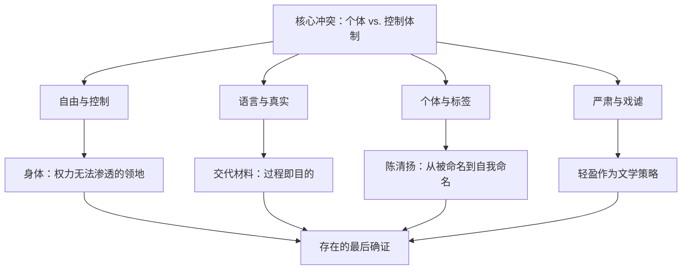
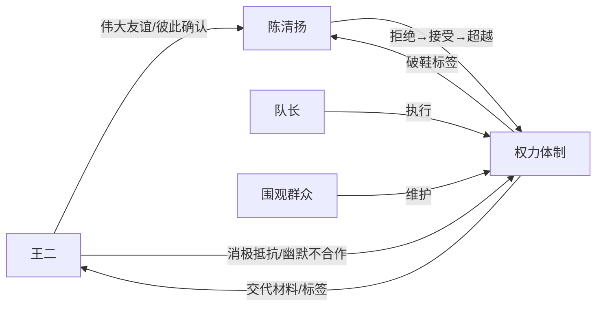
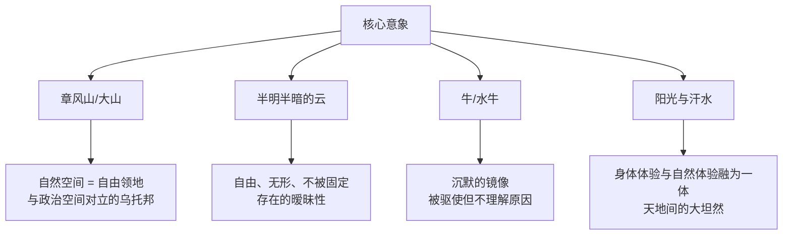

# 《黄金时代》深度读书笔记

> [!abstract] 全书速览
> 这是一部关于==自由、身体与荒诞==的中篇小说。王小波用戏谑而诗意的笔触，讲述了知青王二与女医生陈清扬在云南农场的性爱关系，以及他们被迫反复书写"交代材料"的荒诞经历。小说不控诉、不怀念、不自怜，而是以一种轻盈的智性姿态，呈现了一个年轻人如何在政治高压的缝隙中，用身体和思想守住了属于自己的自由领地。读完这本书，你会感受到一种奇异的明朗——在最糟糕的时代里，竟然可以活得如此坦然。书名"黄金时代"既是巨大的反讽，也是真诚的陈述：==恰恰因为被剥夺了一切，他们反而获得了悖谬的自由==。

---

## 时代与作者

王小波（1952-1997）是中国当代文学中最难归类的作家。他不属于伤痕文学，虽然写了文革；不属于先锋派，虽然叙事高度实验化；不属于寻根文学，虽然触及文化深层；也不完全是自由主义知识分子写作，虽然他是中国最著名的自由主义作家之一。他是一个在所有流派之间滑行的异类。

《黄金时代》的写作跨度从1982年至1994年最终定稿，前后打磨了十二年。1992年，这部小说在台湾《联合报》文学奖获中篇小说大奖后引起关注，1997年收入"时代三部曲"出版。王小波本人有过云南插队的经历，这为小说提供了真实的经验底色。但《黄金时代》远不止是自传式的回忆——它是王小波对自由、权力、语言与身体的深度思考，凝结成的一部高度文学自觉的作品。

> [!note] 文学史位置
> 当同时代的知青文学（如梁晓声、张承志）还在追忆理想主义的激情或控诉苦难的创伤时，王小波做了完全不同的事——他用戏谑的、充满智性快感的方式来处理那段历史。如果说梁晓声写的是知青经历中的苦难与理想，张承志写的是精神信仰的热度，那么==王小波写的是一种更基本的东西：个体如何在集体话语的重压下保持自己==。

在世界文学的参照系中，你会在王小波身上看到多条清晰的精神血脉——乔治·奥威尔对极权的冷峻观察、卡尔维诺对叙事游戏的迷恋、卡夫卡的荒诞感、杜拉斯的情欲书写、马克·吐温的幽默传统，以及他极为推崇的罗素的理性精神。但他不是任何人的中国翻版，他将这些养分消化为独属于自己的声音。王小波身上理科生的逻辑训练和对英美散文传统的深入阅读，共同塑造了一种在中国文学中几乎没有先例的语言质地：干净、精确、逻辑严密，同时拥有一种出人意料的诗意。

---

## 故事的核心张力

> [!tip] 核心冲突
> 这个故事的底层冲突是：**在一个试图控制一切的体制中，个体如何保存自己最后的领地？**

文革时期——政治高压、物质匮乏、精神钳制——在任何正常的评价体系中都是最糟糕的时代。但王小波偏偏将其称为"黄金时代"。这个命名包含了多重含义：二十一岁是肉体生命的黄金时代——身体充满能量，一切都在最饱满的状态；同时，恰恰因为被剥夺了一切（前途、名誉、社会身份），王二和陈清扬反而获得了一种悖谬的自由——既然已经没有什么可以失去，那就没有什么需要恐惧。

小说呈现了几组相互缠绕的张力：

**自由与控制。** 权力试图通过监视、批斗、交代材料来规训个体。整个社会被编织成一张巨大的控制网络。但王二和陈清扬发现了一个权力无法完全渗透的领地：身体。在章风山的山野间做爱，是对控制最彻底的越界——在那一刻，==两个人的存在完全属于自己，不需要任何外在的许可或认证==。

**语言与真实。** 组织要求他们"如实交代"，但在荒诞的权力结构中，"如实"本身是不可能完成的任务。越是"如实"地写，越是显得不够"深刻"，于是要求重写。语言在这里不是通向真实的工具，而是权力操控的媒介。

**个体与标签。** 陈清扬被称为"破鞋"，这个标签将一个女性的全部存在压缩为一个道德污点。它不需要证据，不接受反驳。整个故事的重要线索之一，就是陈清扬如何从"拒绝标签"走向"接受标签"，最终在主动选择中超越了标签对她的定义。

**严肃与戏谑。** 王小波处理的是中国现代史上最沉重的题材之一，但选择了最轻盈的方式。这种轻盈不是回避，而是经过深思熟虑的文学策略——==当所有人都用沉重的方式写沉重的事情时，沉重本身失去了冲击力；王小波的轻盈反而能穿透读者的防线==。

---

## 人物命运

### 王二：自由人的原型

王二是王小波理想中的自由人——聪明、诚实、对权威保持本能的怀疑，同时拥有旺盛的生命力。他不是一个"英雄"式的人物，没有崇高的使命感，也没有为某种理想献身的打算。他只是一个想好好活着的年轻人，恰好活在了一个不让你好好活着的时代。

> [!example] 那一天我二十一岁
> "那一天我二十一岁，在我一生的黄金时代。我有好多奢望。我想爱，想吃，还想在一瞬间变成天上半明半暗的云。"
>
> 这段著名的文字之所以动人，是因为它将最基本的欲望（爱、吃）与最诗意的想象（变成云）并置在一起，没有任何等级之分。==欲望不低于诗意，身体不低于灵魂==。在那个将一切分为"革命的"和"反革命的"二元体系中，王小波拒绝了所有等级划分。

王二的聪明不是体制化的聪明（善于迎合、善于表演），而是一种野生的、不驯服的聪明。他看穿了交代材料的荒诞本质，也看穿了整个政治仪式的虚假性，但他不点破。他用幽默的方式去"配合"——在交代材料中越写越详细、越写越生动，表面上是积极交代，实际上是在嘲弄整个制度。这种"配合"是最高级的不合作：==它在形式上满足了权力的要求，在内容上却完全颠覆了权力的意图==。

他保持着一种消极抵抗的姿态——不是对抗而是不配合，不是英雄式的反叛而是懒洋洋的、幽默的不合作。他没有预设的身份认同——不是"知识分子"、不是"革命者"、不是"受害者"。他只是在那里，活着，感受着，思考着。

在情感层面，王二对陈清扬的感情不是传统意义上的"爱情"——没有海誓山盟，没有浪漫仪式。但它比传统爱情更深刻，因为它建立在两个自由个体的彼此确认之上。他们确认的不是"你爱不爱我"，而是"你是不是一个真实的人"。在一个所有人都戴着面具的时代，找到一个真实的人比找到一个爱你的人更难、也更珍贵。

### 陈清扬：从被命名到自我命名

陈清扬是小说中最具深度的人物。她是北京来的女医生，因丈夫入狱而独身，被当地人称为"破鞋"。她的人物弧光在于：==从被动接受命名到主动选择自我命名==。

陈清扬一开始找王二，是要他"证明她不是破鞋"。一个清白的女性，仅仅因为独身，就被社会赋予了侮辱性的标签。更深层的暴力在于：这个标签不需要任何证据，但要反驳它却几乎不可能。

她的转变分三个阶段：

1. **拒绝标签**：她努力证明自己"不是破鞋"，但越努力越无效——因为标签的逻辑不在事实层面，而在权力层面
2. **主动接受**：她与王二发生了关系，在事实层面"成为"了破鞋。但这个"成为"是主动选择的——它把权力强加的侮辱转化为自我决定的行动
3. **超越标签**：当她主动接受这个身份时，标签的侮辱性被消解了——==你不能用一个我自己选择的东西来侮辱我==

> [!tip] "伟大友谊"的深意
> 陈清扬后来告诉王二，她当时说他们之间是"伟大友谊"而非爱情。多年后她承认当时其实"爱上了"王二，但她用"伟大友谊"来命名，因为"爱情"这个词在那个语境中已经被污染了——它或者被政治化，或者被道德化，不再能承载真实而复杂的感情。==当语言被权力污染后，真实的情感需要另找词汇来栖身。==

### 次要人物：权力网络中的众生

队长代表了基层权力执行者——他未必是恶人，但他是制度的忠实执行者。他要求王二和陈清扬写交代材料，不是出于个人恶意，而是因为"组织"需要一个交代。围观的群众则构成了权力的社会基础——他们参与对陈清扬的侮辱，不是因为憎恨她，而是因为参与本身让他们感到安全。这种从众心理是权力体制得以运转的最深层支撑。

---

## 主题深层解读

### 主题一：在不自由中寻找自由

这本书的起点是一个悖论：为什么要在一个极不自由的时代背景中书写自由？

答案是：自由的本质恰恰在极端不自由的环境中才最清晰地显现。当外在自由被完全剥夺时，什么是无法被剥夺的？身体的感受和独立思考的能力。

王二从不表现出受害者的姿态。他用一种轻盈的、几乎是快乐的语调来讲述一切。这种语调本身就是自由的宣示：你可以控制我的处境，但无法控制我讲述自己故事的方式。

> [!tip] 核心洞察
> 王二的自由是真正的自由还是自我安慰？如果他可以选择不被下放，他还会认为那是"黄金时代"吗？王小波没有美化苦难。他要说的是一个更微妙的东西：==自由不是一种客观状态，而是一种主观姿态==。你的处境不自由，但你面对处境的方式可以是自由的。你被迫写交代材料，但你可以选择把它写成一篇文学作品。这种自由是有限的、不完美的，但它是真实的，而且在那个时代，它是唯一可得的自由。

王小波笔下的自由与萨特的存在主义自由形成了有趣的对比。萨特的自由伴随着深重的焦虑——自由是一种负担。但王小波笔下的自由是轻盈的、愉悦的。王二不为存在焦虑，他享受自由。这种轻盈不是浅薄，而是一种深刻思考之后的通透——看清了荒诞之后的坦然。

### 主题二：身体作为存在的确证

王小波在小说中大量书写性，不是为了感官刺激，而是因为：在一个试图否定个体存在的时代，身体是最后的实在。当思想被审查、语言被扭曲、社会关系被政治化，==身体的感受是唯一无法被篡改的证据==。

王小波笔下的性是光明的、健康的、充满力量的。王二和陈清扬在蓝天白云下的草地上做爱，没有任何阴暗感，反而有一种近乎希腊式的明朗。这种明朗挑战了中国文学传统中关于性的两种主要写法：古典文学中的含蓄暗示，和现代文学中的道德化处理。王小波既不遮掩也不道德化，他让性坦坦荡荡地呈现在阳光下。

> [!warning] 不仅是身体的结合
> 性与自然景观在《黄金时代》中融为一体——阳光、汗水、山野反复出现，将身体体验与自然体验编织在一起。这不是密室中的偷情，而是天地间的大坦然。更深的层面是：在一个所有关系都被政治化的时代，==两个人赤裸相对的时刻是唯一不需要表演、不需要戴面具的时刻==。身体的坦诚对应着精神的坦诚。

### 主题三：荒诞——逻辑的失效

小说弥漫着一种荒诞感，因为文革时期的社会运作逻辑从根本上是反逻辑的。在一个反逻辑的世界里，逻辑清晰的人天然成为异类。

> [!warning] 交代材料的无限循环
> 交代材料是小说中最核心的荒诞意象——永远在写，永远写不完，不是因为事情太复杂，而是因为权力本身需要这个过程持续存在。==权力的目的不是查清真相，而是维持审查的状态本身。==这与卡夫卡的[[《审判》]]有深刻的共鸣：K被审判但永远不知道自己被指控了什么，审判永远不会结束——因为审判本身就是目的。

但王小波与卡夫卡的不同在于：卡夫卡笔下的K在荒诞面前是焦虑的、被碾碎的；而王小波笔下的王二在荒诞面前是幽默的、甚至有些快活的。这种不同来自两种文化应对方式——既然荒诞不可避免，不如用幽默来化解它。你不能消灭荒诞，但你可以嘲笑它。而嘲笑本身就是一种自由。

荒诞还体现在逻辑本身被武器化：你越是用逻辑证明清白，越被认为态度不端正（因为你在"狡辩"）；你越是坦诚交代，越被要求交代更多。沉默是有罪的，说话也是有罪的。这种不确定性本身就是荒诞的核心。

### 主题四：存在的姿态

王二始终保持不合作的姿态，不是因为有什么政治立场，而是因为他在本能层面拒绝被定义。他不接受别人为他设定的任何角色——无论是"坏分子"还是"好知青"。这些角色都是权力提供的，==接受其中任何一个都意味着进入权力的话语系统==。王二的方式是：我不进入你的系统，我就待在外面。

这种存在姿态与中国传统思想有着深层呼应。庄子的"逍遥游"——在困境中保持自由自在的精神状态——可以在王二身上找到回声。魏晋名士的放达——不拘礼法、率性而为——也在王二的气质中有所体现。嵇康在刑场上弹琴的从容，与王二写交代材料时的戏谑，有着跨越千年的精神相通。

### 主题五：语言、权力与叙事主权

《黄金时代》在更深层面上是一本关于语言的小说——关于谁有权讲述故事，关于语言如何被权力劫持，以及个体如何通过语言夺回自己的主权。

交代材料是这个主题最集中的体现。从形式上看，它是权力指定的文体——有固定的格式、固定的目的（认罪和表态）。权力通过规定"你应该怎么写"来控制"你能够怎么想"。但王二做了一件微妙的事：==他在交代材料的形式内注入了文学的内容==，把认罪书写成了小说。从权力的角度看他在积极配合，但从文学的角度看他在夺回叙事的主权。

> [!note] 三层嵌套的元叙事
> 王小波在写一部小说，小说里的人物在被迫写一份"小说"（交代材料），而这份交代材料的内容又构成了小说的情节。三层叙事互相嵌套，形成了关于"谁在讲故事"的元叙事。到最后你分不清哪层是"真实"的——但这种分不清本身就是王小波的意图：在一个"真实"被权力垄断定义的时代，文学的回应不是提供另一种"真实"，而是让"真实"这个概念本身变得复杂和不确定。

语言被污染的主题还体现在词汇选择上。"破鞋""交代""组织""批斗"——这些词汇携带着那个时代特有的权力含义。而"伟大友谊"这个看似荒谬的命名，恰恰揭示了==当标准词汇被权力污染后，真实情感必须寻找非标准的表达方式==。

---

## 文学手法

### 时间的折叠术

《黄金时代》最显著的叙事特征是其非线性的时间结构。故事不断在"过去"（云南农场时期）与"现在"（王二成为大学讲师后的回忆）之间跳跃。

小说中至少存在三个时间层：
- **叙事的现在**：王二已是大学教师，从成熟的视角回望过去
- **核心过去**：云南插队时期，王二二十一岁，与陈清扬的关系构成故事主体
- **中间过去**：王二回城后、文革结束后的各种经历片段

这种时间折叠不是炫技，而是服务于核心主题。线性叙事暗含一种因果逻辑，但王小波要表达的恰恰是：==在荒诞的时代中，因果逻辑是失效的==。时间的折叠还模拟了记忆的真实运作——回忆不是线性回放，而是围绕核心场景反复盘旋的旋涡。

### 交代材料：叙事中的叙事

小说中最精妙的叙事装置是"交代材料"。几层反讽由此产生：
- 权力要求"真实"，但"如实"在荒诞的权力结构中是不可能的任务
- 王二在交代材料中越写越详细、越写越生动，既是表面服从又是深层嘲弄
- 到最后，交代材料不再是认罪书，而变成了变形的情书

谁在控制叙事？表面上是组织在要求叙事的生产，但实际上王二通过将交代材料写成文学作品，夺回了叙事的主权。这是权力的盲点——它可以要求你写，但无法完全控制你怎么写。

### 重复与变奏

小说中许多场景被反复叙述，每次都有微妙差异。这种手法有三重功能：
1. **模拟记忆的真实运作**：记忆不是线性回放，而是围绕核心意象反复盘旋
2. **质疑叙事的可靠性**：当同一件事有多个版本，到底哪个是真的？
3. **营造音乐感**：类似音乐中的主题与变奏，赋予叙事独特的节奏品质

### 语言的质地

王小波的语言在中国当代文学中具有高度辨识性：

> [!example] 语言的三重特质
> **简洁性**：每个词都有其功能，没有任何"注水"。来自英美散文传统和理工科训练带来的逻辑习惯。
>
> **幽默感**：不是插科打诨，而是基于逻辑推演的黑色幽默。经常用一本正经的语气说出荒谬的内容——让你先笑，然后意识到那个荒谬的东西其实是真实的。
>
> **诗意**：在简洁和幽默的底色上偶尔释放令人惊艳的诗意。==正是因为诗意来得节制，它才来得猛烈==——如果每个句子都是诗，诗就消失了；诗只在最关键的时刻出现，才像子弹一样击中你。

---

## 核心意象网络

**章风山/大山。** 自然空间作为自由的领地，与政治空间对立。在山上没有组织、没有交代材料、没有标签，只有两个赤裸的人和无垠的天地。山代表了一种前政治的、前社会的存在状态。

**半明半暗的云。** "想在一瞬间变成天上半明半暗的云"——全书最诗意的意象。云是自由的、无形的，"半明半暗"暗示了==存在的暧昧性——人既不完全光明也不完全黑暗，既不完全自由也不完全被束缚==。

**牛/水牛。** 王二放牛，牛是沉默的、不反抗的存在，被驱使但不理解原因。农场里的所有人都是"牛"——被集体的力量驱赶着走。但与牛不同的是，王二在沉默中保留了思考的能力。

**阳光与汗水。** 性爱场景中反复出现，将身体体验与自然体验融为一体。阳光是明亮的、公开的，与性在中国文化中通常的"阴暗"联想形成对比。劳动出汗和做爱出汗被并置在一起，消解了"劳动"与"享乐"之间的道德等级。

---

## 为什么今天还要读这本书

《黄金时代》写的是1970年代的云南农场，距今已超过半个世纪。但这本书的生命力在于它的超时代性。它触及的核心问题——个体自由与社会控制的张力、语言与权力的关系、身体作为最后堡垒的意义、标签化对个体的暴力——在任何时代都有回响。

> [!tip] 阅读建议
> 每当你感到自己被某种外在的标准或话语所定义、所束缚——被KPI定义，被社会期待定义，被年龄定义——被要求按照某种模板来生活和表达时，王小波的声音就会传出来：你可以选择做自己。不是通过英雄式的对抗，而是通过一种轻盈的、幽默的、拒绝配合的姿态。
>
> 即使在最糟糕的处境中，只要你还能感受、还能思考、还能用自己的方式讲述自己的故事，你就还拥有某种不可剥夺的自由。这不是鸡汤式的自我安慰，而是经过苦难淬炼的通透。

王小波用这本书证明了：==文学不必沉重才深刻，反叛不必悲壮才有力，自由不必宏大才真实==。在所有关于那个时代的书写中，《黄金时代》也许是最轻盈的一部——而恰恰因为这份轻盈，它飞得比任何沉重的作品都更高、更远。

---

## 延伸阅读

- [[《沉默的大多数》]]：王小波的杂文集，直接呈现他的思想立场。读完小说再读杂文，你会发现小说中藏在叙事背后的思考——关于自由、理性、独立思考——在杂文中被清晰地说出来了。两者对照着读，你会看到一个更完整的王小波。

- [[《1984》]]（乔治·奥威尔）：理解王小波对极权思考的必读之作。奥威尔预言式地写出了权力如何控制语言、控制记忆、控制现实本身。王小波在某种程度上是奥威尔的中国回声——但他比奥威尔多了一种幽默感，多了一种来自中国文化土壤的生存智慧。

- [[《棋王》]]（阿城）：另一种知青叙事。阿城笔下的王一生和王小波笔下的王二，都是在荒诞环境中保持了某种纯粹的人。但阿城更沉静、更东方、更接近道家的气质，王小波更幽默、更西化、更接近理性主义的传统。对照阅读颇有趣味。

- [[《审判》]]（卡夫卡）：荒诞权力逻辑的经典呈现。交代材料的无限循环与K的无尽审判遥相呼应。但卡夫卡写的是被荒诞碾碎的人，王小波写的是在荒诞中笑出声的人。

- [[《情人》]]（杜拉斯）：情欲与记忆交织的另一种写法。杜拉斯用碎片式的回忆拼贴出跨越种族和阶层的情事，王小波用折叠式的时间讲述跨越政治高压的感情。两者在叙事策略上有相似之处，但气质截然不同——杜拉斯是忧伤的，王小波是明朗的。
