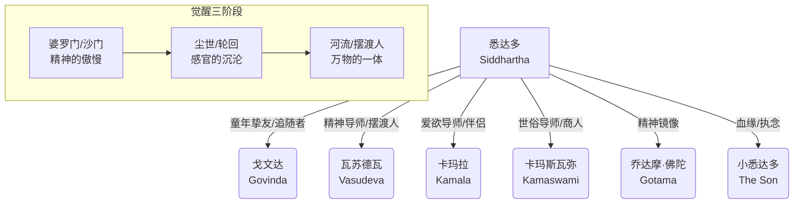

> [!abstract] 核心思想
> **智慧无法被传授，只能被体验。**
> 一个人必须亲自品尝痛苦、欲望、空虚和圆满，才能在时间的河流中听见万物合一的“Om”。这不是关于佛陀的故事，而是关于每一个试图在裂变的世界中寻找完整自我的灵魂的故事。

## 📖 作品背景与概况

《[[悉达多]]》（Siddhartha）是德国作家、诺贝尔文学奖得主 **[[赫尔曼·黑塞]]** 于1922年出版的小说。书中融合了东西方哲学，特别是佛教思想与荣格心理学（黑塞曾接受荣格学派的心理分析）。

- **书名含义**：Siddhartha 意为“达成目的的人”或“不仅寻得解脱，且已完成解脱的人”。
- **写作背景**：一战后的欧洲精神危机，黑塞试图在东方智慧中寻找救赎，同时也投射了与第一任妻子婚姻破裂、父亲去世等个人危机。

---

## 🗺️ 人物关系与英雄之旅

---

## 🪜 深度拆解：灵魂觉醒的四个乐章

### 第一乐章：精神的傲慢（婆罗门与沙门时期）
> [!quote] "知识可以传授，但智慧不能。"

*   **阶段特征**：极端的苦行主义，试图通过**否定自我**（杀死欲望、感官）来通过“空”的境界。
*   **关键事件**：
    1.  **离家**：悉达多感到传统宗教仪式（婆罗门教）无法平息内心的渴望，毅然辞别父亲。
    2.  **遇见佛陀**：这是全书的转折点。挚友[[戈文达]]选择追随佛陀，皈依体制化的宗教；但悉达多**拒绝了佛陀的教导**。
*   **深度解读**：
    *   悉达多发现佛陀的法义完美无缺，但法义包含的是“知识”，而非佛陀成道时的“体验”。
    *   他意识到，**追随老师（Authority）永远无法成佛**，因为一旦成为信徒，就失去了自我探索的独立性。这是黑塞对制度化教育和宗教的深刻批判。

### 第二乐章：感官的沉沦（尘世生活）
> [!quote] "正如一块石头落入水中，悉达多穿过尘世的事物，不费力气，也不受阻碍。"

*   **阶段特征**：从极端的出世转向极端的入世。学习爱（性）与金钱。
*   **关键人物**：
    *   **[[卡玛拉]] (Kamala)**：教会他爱欲的艺术，让他明白身体不是要被克服的敌人，而是体验生命的容器。
    *   **[[卡玛斯瓦弥]] (Kamaswami)**：教会他商人的逻辑，但他始终保持着“游戏人生”的疏离感。
*   **危机**：**“轮回之苦”（Samsara）**。起初他像个旁观者在玩游戏，但逐渐地，贪婪、惰性、衰老和厌倦抓住了他。他发现自己变成了一个庸俗的“孩子气的人”（Child People），灵魂充满了恶心感。
*   **关键意象**：**笼中鸟之梦**。卡玛拉的金丝雀死了，象征着悉达多内心的灵性之死。

### 第三乐章：河流的智慧（摆渡人时期）
> [!quote] "水在流，一直在流，却时刻都在，永远是同一条河，却每一时刻都是新的。"

*   **阶段特征**：绝望后的重生。在河边试图自杀时，他听到了来自宇宙深处的“Om”声。
*   **导师**：**[[瓦苏德瓦]]**（摆渡人）和**河流**。
*   **核心领悟**：
    1.  **倾听**：向河流学习不带评判地倾听。
    2.  **时间是幻觉**：河流同时在源头、在河口、在瀑布、在渡口。过去、现在、未来同时存在。如果时间不存在，那么“罪人”和“佛陀”之间就没有距离，罪人**就是**未来的佛陀。
    3.  **万物一体**：世间万物不再被分为“神圣”和“世俗”，石头不仅是石头，它也是梵。

### 第四乐章：最后的执念（关于儿子）
> [!quote] "这种盲目的爱，不也是一种轮回吗？"

*   **事件**：卡玛拉死于蛇咬，留下了她和悉达多的儿子。
*   **冲突**：悉达多试图用爱和智慧去感化娇生惯养的儿子，但儿子只感到窒息并最终逃离。
*   **深度解读**：
    *   这是悉达多成道前的最后一关：**爱与执着**。
    *   他曾经嘲笑世人（孩子气的人）为琐事痛苦，现在他自己也因为爱而痛苦。这让他终于完全理解并融入了普通人的悲欢。
    *   **伤口的愈合**：当他看着儿子逃离的背影，他想起了当年自己违背父命离家出走的背影。轮回在这一刻闭环。他必须学会**放手**，允许儿子去经历属于他自己的痛苦（Karma），就像他的父亲当年允许他一样。

---

## 🧠 核心哲学主题深度解析

### 1. 时间的幻觉与单一性 (Unity)
> [!info] 概念解析
> 黑塞受东方哲学（尤其是《奥义书》）影响，认为线性的时间是思维构建的幻觉。

*   **分析**：如果在永恒的维度上看，一个人不是“正在变好”或“正在变坏”，他**同时**是那个贪婪的商人和觉悟的圣人。
*   **应用**：这消解了道德审判。我们不需要急于摆脱现在的状态，因为“现在”包含了圆满。接受当下的自己，就是接受佛性。

### 2. 对立的统一 (Synthesis of Opposites)
*   **分析**：世界不是非黑即白的。真理的反面，同样是真理。
    *   “求道者”往往因为过于专注于“寻找”，而失去了“发现”的能力（如戈文达）。
    *   “罪恶”不仅仅是堕落，它也是恩典的一部分。悉达多必须堕落，才能学会谦卑；必须挥霍，才能摒弃物欲。
    *   **Obsidian Link**: 这种思想与荣格的[[阴影原型]]（Shadow）整合理论高度一致。

### 3. 摆渡人 (The Ferryman) 的象征
*   **分析**：瓦苏德瓦是全书最高境界的人物。他几乎不说话，只是倾听和摆渡。他象征着**连接**——连接此岸与彼岸，连接凡俗与神圣。他不需要教义，因为他已经与河流（道/Logos）合二为一。

---

## 💬 经典金句摘录

> [!quote] 关于寻找
> “当你寻找时，”悉达多说，“很容易发生这种情况：你的眼睛只看到你要寻找的东西，你却什么也找不到，什么也接收不到，因为你只想着你要找的东西……**寻找意味着拥有目标，而发现意味着自由、敞开、没有目标**。”

> [!quote] 关于爱
> “在我看来，爱似乎是头等要务。看透这个世界，解释它，藐视它，这可能是思想家的事。但我唯一关心的，就是能够爱这个世界，不藐视它，不憎恨它和我自己，能够怀着爱、惊叹和敬畏的感情去观察它和我自己以及万物。”

> [!quote] 关于智慧
> “智慧是无法传授的。智者试图传授的智慧，听起来总像痴人说梦……知识可以传授，但智慧不能。人们可以寻见智慧，在生命中体验智慧，以智慧自强，以智慧创造奇迹，但人们无法传授和教导智慧。”

---

## 📎 延伸阅读与关联
- **关联书籍**:
    - [[德米安]] (Demian): 黑塞另一部关于自我探索的杰作。
    - [[刀锋]] (The Razor's Edge): 同样探讨东西方精神追求的小说。
    - [[炼金术士]] (The Alchemist): 一个更通俗版本的“追随天命”的故事。
- **关联概念**:
    - [[荣格心理学]]: 自性化过程 (Individuation)。
    - [[佛教哲学]]: 四圣谛、八正道、轮回。
    - [[存在主义]]: 每个人必须独自面对存在的荒谬并创造意义。
