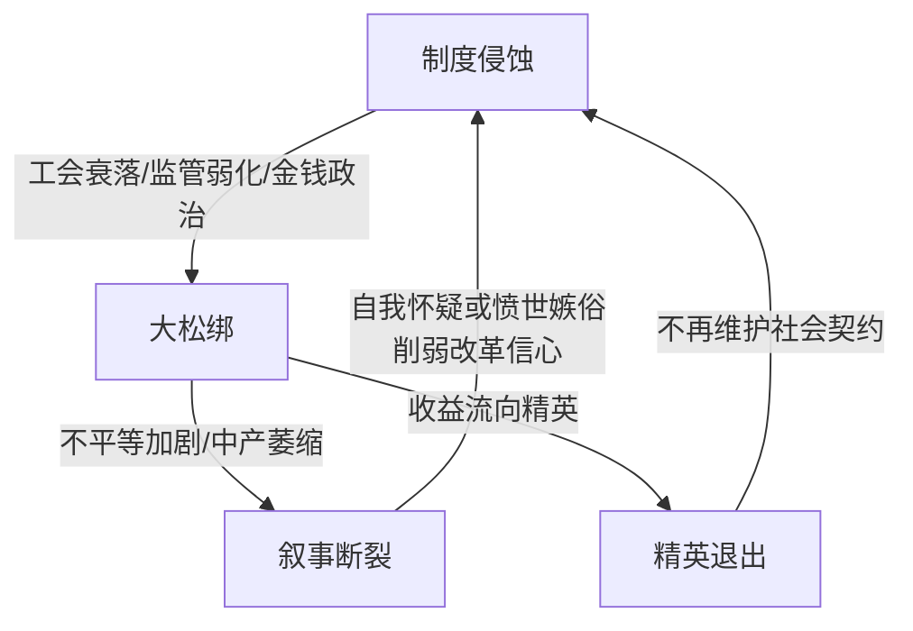
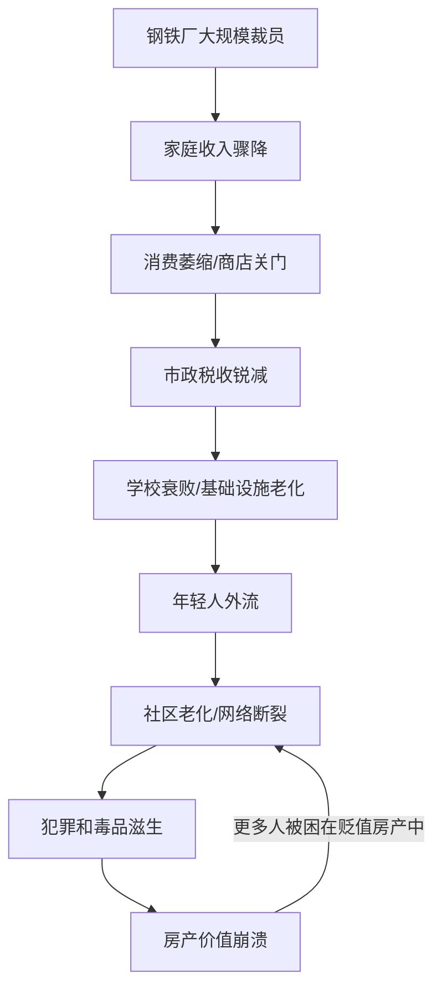
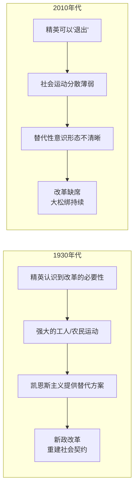

# 《下沉年代》深度读书笔记

> [!abstract]
> 《下沉年代》是一部关于美国社会契约瓦解的史诗级非虚构作品。帕克没有用统计数据或政策分析来讲述这个故事，而是通过四个真实人物从1978年到2012年的人生轨迹，展现了一个宏大的主题：==当游戏规则被系统性地改写，个人努力不再能决定命运==。这不是"失败者"的故事——书中的人物都很努力。问题在于，美国战后那套隐性社会契约——努力工作就能过上好日子——在四十年间被一根根拆除了。帕克用"unwinding"（松绑/解体）而非"collapse"（崩溃）来命名这个过程：美国没有轰然倒塌，它是像一根绳子被慢慢解开，身在其中的人几乎察觉不到。

## 核心议题

这本书追问的是一个让无数美国人困惑的问题：**为什么我们这一代比上一代过得更差？**

表面上这是一个经济问题——工资停滞、就业不稳定、房价高企。但帕克的野心更大。他试图揭示的是一种更深层的断裂：美国社会曾经存在一套隐性契约，这套契约不写在任何法律文书里，却构成了战后美国繁荣的基础。它承诺三件事：努力工作就能获得体面生活；下一代会比上一代更好；无论出身如何，都有向上流动的机会。

> [!tip] 1978年的标志性意义
> 帕克选择1978年作为叙事起点——那一年，里根革命还未正式开始，但新自由主义的政策框架已在酝酿。此后四十年，减税、去监管、工会衰落、全球化加速，一点点地拆除了支撑社会契约的制度基础。

帕克的方法极为独特。他没有写一部政策分析报告，而是选择了四个具体的人——一个南方梦想家、一个锈带工人、一个华盛顿内部人、一个硅谷亿万富翁——让他们的生命轨迹成为时代的注脚。通过他们的故事，抽象的"社会契约瓦解"变成了可以触摸的日常悲剧。这本书延续了约翰·多斯·帕索斯[[《美国》]]三部曲的传统——用多线叙事和蒙太奇手法呈现时代全景。

## 理论框架

帕克的分析视角可以概括为三个关键概念：**大松绑**、**制度侵蚀**和**叙事断裂**。

==大松绑==（The Great Unwinding）是全书的核心隐喻。它与经济学家所说的"大压缩"（1940s-1970s贫富差距缩小的时代）形成对照。如果说大压缩是一个收紧的过程——社会各阶层被纳入共同繁荣的框架，那么大松绑就是这个框架的解体。帕克使用"松绑"而非"撕裂"是有深意的：这不是一次剧烈的断裂，而是一个缓慢的、几乎不被察觉的松动过程。就像一艘船的缆绳被一根一根地解开，直到某天船漂走了，人们才意识到发生了什么。

**制度侵蚀**是帕克的第二个分析工具。他关注的不是制度的正式废除，而是制度的实质性空心化。工会在法律上仍然存在，但成员比例从约35%降到不到7%；反垄断法从未被废除，但执法力度大大减弱；民主选举依然进行，但金钱对政治的影响力越来越大。这种侵蚀是隐秘的——没有人会报道"今天工会会员比例又下降了0.3个百分点"——但它日积月累地改变了权力和利益的分配格局。

> [!note] 制度侵蚀的洞察
> 帕克的核心洞察在于：==制度的崩溃往往不需要任何人蓄意摧毁它，只要足够多的人在足够长的时间里忽视它、绕过它、掏空它，制度就会从内部腐烂。==

**叙事断裂**是第三个关键概念。美国梦的话语——"只要努力就能成功"——仍然被不断重复，但它与越来越多人的实际经验脱节。这种话语与现实的落差，催生了两种反应：一种是自我怀疑（"是不是我不够努力？"），另一种是愤世嫉俗（"整个系统都是骗局"）。两种反应都在腐蚀社会的凝聚力。

这三个概念构成了一个相互强化的循环：制度侵蚀导致物质层面的不平等加剧（大松绑），物质不平等与美国梦话语的落差导致叙事断裂，叙事断裂又削弱了人们对制度改革的信心，从而进一步加速制度侵蚀。

## 论证深度解读

### 迪恩·普莱斯：美国梦的信徒与殉道者

迪恩是北卡罗来纳州的一个小商人，他的故事是美国梦叙事的一次压力测试。

> [!note] 人物背景
> 迪恩的父亲是烟草农民，在农业集约化浪潮中逐渐失败。迪恩没有自怨自艾，而是相信创业和创新是出路。他先后经营加油站、便利店连锁、生物柴油企业——每一次都充满热情地投入，每一次都被结构性力量击败。

迪恩的故事揭示了一个残酷的悖论：**他越是践行美国梦的信条——勤奋、创新、自力更生——就越是在一个已经倾斜的游戏场上消耗自己**。生物柴油企业败给了石油巨头的价格战——大公司可以承受短期亏损，小企业不能。连锁餐厅败给了2008年金融危机中的信贷紧缩——不是因为经营不善，而是因为银行突然停止了小企业贷款。

帕克始终没有把迪恩塑造成受害者。迪恩保持着一种近乎顽固的乐观，一次次失败又一次次站起来。这种乐观既令人敬佩又令人心酸。帕克想说的是：==问题不在个人品质，问题在于当资本集中度达到一定程度，当金融体系的风险可以转嫁给社会，个人创业者就变成了系统性力量的燃料而非受益者。==

> [!warning] 美国梦话语的双面性
> 迪恩的故事有一个更深层的讽刺：正是美国梦的话语让他把所有失败归咎于自己。"如果我更聪明一点""如果我再坚持一下"——这种自我归因阻止了他看到结构性力量的存在。帕克暗示，美国梦的最大危险可能不是它不再实现，而是==它即使不再实现也仍然被人们相信——因为这种信念会让人把制度的失败内化为个人的失败，从而消解了集体行动的可能==。

### 塔米·托马斯：去工业化的微观史

塔米是俄亥俄州扬斯敦的一名黑人女性，她的故事是美国去工业化进程的一部微观史诗。

扬斯敦曾是美国钢铁工业的心脏。1977年"黑色星期一"，这座城市一天之内失去了5000个工作岗位。但帕克告诉我们，工厂关闭只是开始。==真正的灾难是之后的连锁反应==：

这是一个自我强化的死亡螺旋——每一个环节的恶化都加剧了其他环节的恶化。

塔米在这个过程中选择留下。她从事社区工作，试图帮助这座城市在废墟上重建。帕克通过她的眼睛，让我们看到了一个社区从内部瓦解的全过程。

> [!tip] 核心洞察
> 帕克通过塔米的故事提出了一个重要观点：==工作不仅是收入来源，更是尊严、身份和社区的基础==。新自由主义经济学将劳动力视为可以自由流动的要素，但人不是要素。当一个人失去工作，他失去的远不止工资——还有身份认同、社会网络、代际传承。

塔米的章节中有一个令人难忘的场景：她带帕克参观废弃的钢铁厂——杂草丛生的厂房、生锈的设备、空无一人的停车场。帕克写道，这不是"创造性破坏"，而是**没有创造的破坏**。扬斯敦的故事挑战了自由贸易的标准叙事：全球化创造了效率，但效率的收益以分散方式流向消费者，成本却以集中方式由特定社区承担。这种不对称是政策选择的结果，而非经济规律的必然。

### 杰夫·康诺顿：权力的内部人

杰夫是华盛顿的内部人——曾是拜登的忠实追随者，后来成为游说者，最后愤然辞职成为批评者。他的故事揭示了美国政治是如何被金融资本俘获的。

杰夫的觉醒发生在2008年金融危机之后。他期待奥巴马政府进行真正的金融改革，却看到政府用华尔街的人来"改革"华尔街。没有一个高管被起诉，银行获得了万亿级别的救助，而普通人失去了房屋和储蓄。

> [!example] 旋转门机制
> 帕克通过杰夫的经历详细描述了"旋转门"机制：同一批人在政府监管部门和被监管的金融机构之间来回流动。今天的财政部官员，明天就是高盛的高管；今天的SEC律师，明天就是华尔街律所的合伙人。这种人事流动在法律上完全合法，但实质上消解了监管的可能性。==旋转门不需要任何人行贿受贿——它通过改变人的激励结构，从内部消解了监管的可能性。==

杰夫的故事提出了一个尖锐的问题：**在一个政治献金不受实质限制的系统中，民主还能代表谁的利益？** 帕克没有给出简单的答案，但他通过杰夫的愤怒和幻灭，让读者感受到这个问题的重量。

杰夫的章节也呈现了不同观点。有人会说，政治献金是言论自由的一种形式；有人会说，专业人士的流动有助于政府获得专业知识。帕克承认这些观点的存在，但他通过杰夫的亲身经历，展示了这些辩护在实践中是如何失效的。

### 彼得·蒂尔：赢家的退出

彼得·蒂尔是PayPal联合创始人，硅谷的亿万富翁。他在书中的角色与其他三人不同——他是赢家。但帕克把他写进来，是为了展示一个更深层的危机：==当赢家选择"退出"而非"改革"，社会契约就彻底失效了==。

蒂尔是自由至上主义者。他相信政府无效，民主低效，技术可以绕过政治。他投资海上城市项目、太空殖民计划——这不是科幻幻想，而是一种严肃的政治哲学：如果你对这个社会不满意，最好的策略不是改变它，而是离开它。

> [!warning] 帕克的批判
> 帕克对蒂尔的描绘带有明显的批判色彩。传统上，精英阶层——无论多么自利——都与普通人共享同一个社会。这种共享命运创造了最低限度的利益联结。蒂尔代表的新型精英打破了这种联结：==当你可以在公海上建城市、在新西兰买农场、在太空中建殖民地时，你和普通人之间就不再共享命运。维护社会契约对你来说不再是理性选择，而只是道德义务——而没有利益支撑的道德义务是脆弱的。==

但这里也存在争议。蒂尔的支持者会说，他的投资推动了技术创新，最终会惠及所有人；他对政府的批评反映了对低效官僚体系的合理不满。帕克没有充分回应这些观点，这可能是本书的一个局限。蒂尔的故事提出的问题比帕克给出的答案更加丰富：技术进步和社会团结之间是否存在内在的张力？

### 2008年：所有故事线的交汇

2008年金融危机是全书的高潮，四条故事线在这里交汇。

迪恩的餐厅连锁在信贷紧缩中倒闭。塔米的社区在止赎潮中进一步空心化。杰夫在华盛顿目睹救助华尔街的政治交易。蒂尔则在危机中逆势扩张，进一步巩固财富。

帕克用这种交汇结构说明：==危机不是随机的灾难，而是三十年结构性问题的总爆发==。更重要的是，危机的后果呈现出惊人的不对称：制造危机的人获得了救助，承受危机后果的人被抛弃。

> [!tip] 核心论点
> "大而不能倒"的逻辑意味着利润私有化、风险社会化。银行高管的收益在繁荣时期归自己，损失在危机时期由纳税人承担。==这不是市场失灵，而是权力成功——拥有政治影响力的华尔街成功地把自己的风险转嫁给了没有政治影响力的普通纳税人。==

## 历史比较

帕克隐含了与1930年代大萧条的关键对比。那时美国同样面临严重危机，但产生了新政改革。这一次为何不同？

三个关键差异：精英共识的缺失（当代精英有"退出"选项，缺乏改革紧迫感）；社会运动力量的差异（当代运动组织分散、政策主张模糊）；意识形态的困境（替代性方案不清晰，愤怒找不到建设性出口）。

## 学术争鸣

《下沉年代》出版后引发了广泛讨论。支持者称赞帕克的叙事技巧和结构性分析，批评者则指出若干问题。

**保守派的批评**认为，帕克过度强调了结构性因素，忽视了个人责任和文化因素。查尔斯·默里等学者认为，美国工人阶级的困境与婚姻解体、宗教衰落、工作伦理下降等文化因素有关，不能全归咎于政策和制度。帕克会回应说，这些文化因素本身也是经济困境的结果而非原因，但这场争论远未结束。

**左派的批评**则认为帕克不够激进。他详细描述了问题，但对解决方案着墨甚少。一些批评者认为，帕克的悲观主义本身带有精英主义色彩——他看到了问题，但不相信普通人有能力改变它。

**方法论层面的质疑**：帕克的四个主角是精心挑选的。但如果选择其他四个人——在四十年间实现阶级跃升的移民、在新经济中找到位置的年轻人——故事会不会不同？帕克可能会说个案不能否定结构性趋势，但这把刀是双面的。

> [!note] 比较政治学的补充
> 帕克把美国困境主要归因于内部政策选择，但类似趋势也出现在英国、法国、德国等国家——这暗示某些驱动力（全球化、技术变革、金融化）具有跨国性质。但北欧国家通过强大的社会安全网和积极的劳动力市场政策，在很大程度上保持了社会凝聚力——==这说明政策选择确实重要，结构性压力不等于注定的结局==。

## 方法论反思

帕克的研究方法是**浸入式新闻**与**编年体叙事**的结合。

他花费数年时间追踪四个主角的生活，进行深度访谈，参与他们的日常。这种方法的优势是提供了传统社会科学难以捕捉的质感和细节——一种对他者处境的共情性把握。编年体结构让读者同时在微观和宏观两个层面感受时代变迁：当你在迪恩的生物柴油企业失败之后紧接着读到华尔街的衍生品泡沫膨胀，微观命运与宏观制度之间的联系就变得直观可感。

> [!warning] 方法论局限
> 四个人的故事无法代表三亿美国人。帕克没有系统讨论反例，也没有充分考虑地区差异、族裔差异、代际差异。更重要的是，帕克作为作者的视角始终在场——他的编辑选择塑造了读者的感受。你读到的是帕克版本的美国故事，而非唯一可能的版本。

## 现实映射

《下沉年代》写到2012年，但它的分析框架在今天看来依然有效——甚至更加有效。

**2016年特朗普当选**可以被理解为本书论证的一个注脚。那些被"大松绑"抛弃的锈带选民，那些感受到"叙事断裂"的普通美国人，他们的愤怒找到了一个出口。帕克在书中没有预测特朗普，但他描述的那种愤怒和幻灭，正是特朗普崛起的土壤。但帕克的框架也暗示：特朗普不是解决方案，而是症状。

**新冠疫情**进一步放大了帕克描述的不平等。在封锁期间，能够远程工作的知识工作者相对安全，而服务业工人被迫在风险中谋生。疫情中的救助措施暂时缓解了一些问题，但结构性问题并未解决。

**科技巨头的崛起**延续了蒂尔章节的主题。今天的马斯克、贝佐斯，比蒂尔更加明确地展示了"退出"的可能性——私人太空计划不再是幻想，而是正在进行的工程。当亿万富翁可以建造自己的火箭逃离地球，普通人和精英的命运共同体还能维持多久？

## 延伸阅读

- [[《乡下人的悲歌》]]：J.D. 万斯从内部视角讲述美国白人工人阶级的困境，强调文化因素，与帕克的结构性分析形成对照
- [[《扫地出门》]]：马修·德斯蒙德聚焦美国住房危机，用类似的浸入式方法讲述被驱逐者的故事——如果帕克展示了中产的下沉，德斯蒙德展示的是下沉到底部之后的挣扎
- [[《21世纪资本论》]]：托马斯·皮凯蒂从宏观数据层面分析不平等的长期趋势，核心发现"r>g"（资本回报率持续高于经济增长率）为帕克的微观叙事提供了宏观支撑
- [[《美国大城市的死与生》]]：简·雅各布斯关于社区、公共空间和城市生态的分析，为理解帕克笔下的社区瓦解提供了理论基础
