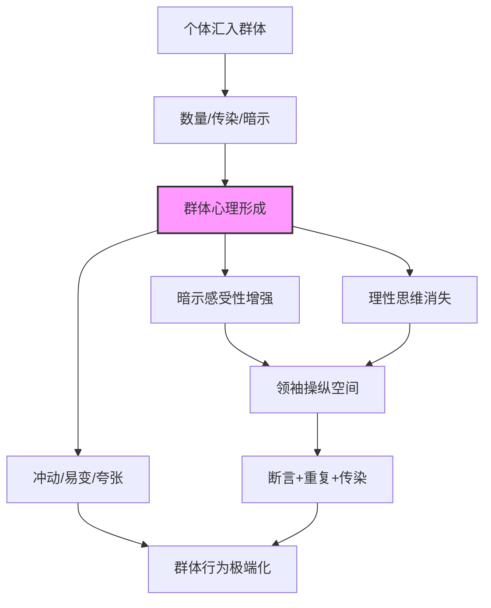
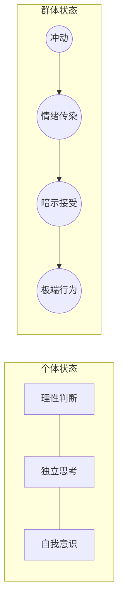

# 《乌合之众》深度读书笔记

> [!abstract] 全书速览
> 这是一部试图回答"为什么聪明人一旦汇入群体就变得愚蠢"的经典之作。勒庞在1895年写下这本书时，法国大革命的记忆仍在欧洲回荡，工业化带来的大规模人口聚集正在改变政治的面貌。他观察到一个令人不安的现象：个体在群体中会丧失理性判断能力，变得情绪化、易受暗示、行为极端。群体不会思考，只会感受；群体不要逻辑，只要形象；群体不服从理性，只服从领袖的意志和口号的魔力。勒庞由此构建了一套关于群体心理的理论框架，涵盖群体的一般特征、群体的意见与信念、不同类型群体的分类。这本书影响深远——墨索里尼和希特勒都曾从中汲取操纵群众的技术，而弗洛伊德、社会心理学家和现代传播学者也不断与它对话。它的价值不在于给出关于群体的科学定论，而在于以一种极端化但发人深省的方式，揭开了人类理性的脆弱面。

## 核心议题

勒庞在这本书里追问的核心问题是：==当个体汇聚成群体时，心理层面究竟发生了什么？为什么一群各自理性的人聚在一起之后，反而做出比任何个体都更极端、更非理性的事情？==

这个问题在他写作的年代有特殊的紧迫性。19世纪末的欧洲正在经历深刻的社会转型——工业化造成大量人口涌入城市，传统的宗教权威和贵族秩序逐渐瓦解，识字率提高和印刷术普及让大众第一次拥有了获取信息的能力，普选权的扩大让"群众"成为政治舞台上不可忽视的力量。法国大革命是这种转变的预演——一群"人民"推翻了国王，但随后陷入了恐怖统治，理性的启蒙理想被群体的狂热所吞噬。勒庞亲眼目睹了1871年的巴黎公社——一场群众运动如何在短短几周内从解放的狂欢走向暴力的深渊。

古斯塔夫·勒庞（1841-1931）是法国社会心理学家、社会学家，出身于法国诺让勒罗特鲁的一个中产家庭。他最初学医，后来广泛涉猎人类学、考古学、物理学，是一个典型的19世纪博学者。他的知识背景跨越自然科学和社会科学，这让他的写作风格兼具科学的野心和文学的煽动力。但也正是这种跨界性质，让他的"科学"论断常常缺乏严格的方法论支撑——他更像一个敏锐的观察者和雄辩的论述者，而不是严谨的实证研究者。

在社会思想的谱系中，勒庞的位置很独特。他不属于任何严格的学术传统——既不是涂尔干那样的社会学家，也不是冯特那样的实验心理学家。他更接近于一个公共知识分子，用通俗的语言表达了一个时代的焦虑。《乌合之众》出版于1895年，此后的一个多世纪里，群体心理这个议题经历了从直觉观察到实验验证的漫长历程——从弗洛伊德的精神分析式重读，到阿希的从众实验，到米尔格拉姆的服从权威实验，到津巴多的斯坦福监狱实验，到如今社交媒体时代的群体极化研究。勒庞的贡献在于，他第一个系统地提出了这些问题，尽管他给出的答案在今天看来远非完善。

==他描述的那个"群体时代"不仅没有过去，反而在社交媒体的加持下变得更加剧烈。== 当你看到一条微博下面成千上万的愤怒评论、当你感受到网络舆论风暴的裹挟力量、当你发现自己在群聊中说出了独处时绝不会说的话——勒庞在一百多年前就试图解释这些现象背后的心理机制。

## 理论框架

勒庞构建的理论框架以一个核心前提为起点：==群体不是个体的简单加总，而是一种全新的心理实体。== 当人们汇聚成群体时，个体的意识人格被淹没，一种"群体心理"浮现出来。这种群体心理有自己独立的特征，不能用组成它的个体的心理来推导。

第一层是群体心理的形成机制。勒庞认为群体心理的产生有三个原因：其一，数量赋予力量感——个体在群体中感到一种不可战胜的力量，于是放纵了那些独处时会压抑的本能；其二，情绪传染——情绪在群体中像瘟疫一样蔓延，每个人的情绪都会被周围人的情绪放大；其三，暗示感受性增强——个体在群体中进入一种近似催眠的状态，对暗示的接受度急剧上升，批判性思维几乎完全消失。

第二层是群体心理的基本特征。基于上述机制，群体表现出一系列共同特征：冲动性（群体被刺激驱动，不会三思）、易变性（群体的情绪可以瞬间从一个极端跳到另一个极端）、易受暗示性（群体不分辨真假，只接受生动的形象和断言）、情绪的夸张化（群体只有极端的感情，崇拜或仇恨，没有中间地带）、偏执与专横（群体对异见零容忍，要求绝对服从）、保守性（群体在根本上是保守的，对传统和权威有深层的依恋）。

第三层是群体的意见与信念。群体的信念分为两类：根深蒂固的基本信念（由种族传统、宗教、社会制度等塑造，变化极慢）和表面流动的即时意见（受当下事件、舆论领袖、流行话语影响，变化极快）。影响群体意见的因素包括：形象而非概念、断言而非论证、重复而非证据、领袖的个人魅力而非观点的逻辑力量。

第四层是群体领袖与动员术。勒庞认为群体天然需要领袖。领袖的权威来自"名望"——一种让人不加批判地服从的神秘力量。领袖操纵群体的三大手段是：断言（不加论证地宣布结论）、重复（同一断言反复灌输直到被接受为真理）、传染（让已经被说服的人去感染更多人）。

## 论证深度解读

### 一、群体的一般特征：个体如何在群体中"消失"

勒庞全书最核心的论点是：一个人一旦融入群体，他的个性就会被群体所淹没。不管他是教授还是农民，在群体中他们的表现趋于一致——智力水平下降到最低公约数，而情绪强度则上升到最高公倍数。

这个判断在当时是震撼性的。启蒙运动以来，欧洲知识界的主流信念是理性进步论——人是理性的动物，社会由理性个体组成，历史在理性的指引下不断进步。勒庞说：不对。人在独处时也许是理性的，但一旦汇入群体，理性就是第一个被抛弃的东西。群体不思考，群体只感受。

> [!note] 勒庞的核心比喻
> 勒庞把群体中的个体比作被催眠的人。催眠状态下，人的自主意识消退，对催眠师的暗示几乎毫无抵抗力。群体中的个体同样如此——他进入了一种"无意识"主导的状态，批判性思维停止运作，取而代之的是对群体情绪和领袖暗示的无条件接受。

勒庞所说的"传染"是一个特别值得深入理解的概念。他不是在做比喻——他真的认为情绪在群体中的传播方式类似于传染病。一个人的恐惧会"感染"身边的人，身边人的恐惧又会反过来加强第一个人的恐惧，形成正反馈循环。在这个过程中，情绪不是被线性传递的，而是被指数级放大的。一个人的愤怒变成十个人的愤怒，十个人的愤怒变成一百人的暴怒，一百人的暴怒就可能变成一场骚乱。

> [!warning] 注意
> 勒庞的"传染"理论在表述上带有强烈的隐喻性质，缺乏明确的机制解释。他使用了大量催眠术、脊髓反射等当时流行的概念来支撑论点，但这些解释在现代心理学看来是粗糙的。后来的研究者——特别是社会认同理论的倡导者——提供了更精确的解释机制。但勒庞所描述的现象本身——情绪在群体中的快速传播和放大——已被大量实证研究所证实。

勒庞还指出了群体心理的一个看似矛盾的特征：==群体在表面上是革命的，但在本质上是保守的。== 群体可以摧毁一个政权，但不会创建一个新秩序。群体的破坏力来自情绪的极端化，但群体对传统、权威和秩序有深层的依恋——他们推翻旧的偶像，是为了立刻竖起新的偶像。法国大革命推翻了国王，但很快就接受了拿破仑的独裁。群体需要被领导，需要崇拜，需要服从——只是崇拜的对象可以更换，服从的本能不会改变。

> [!tip] 核心洞察
> ==群体的"革命性"和"保守性"并不矛盾。群体反抗的不是权威本身，而是当下这个权威。他们永远需要一个权威来服从——这就是为什么革命往往以新的专制告终。== 这个观察对理解20世纪的极权主义运动——无论是法西斯主义还是斯大林主义——有极强的预见性。

群体的另一个核心特征是==对形象的崇拜==。勒庞反复强调：群体不理解概念，只理解形象。你不能用逻辑论证来说服群体，但你可以用一个生动的故事、一个有力的口号、一幅震撼的画面来打动他们。"自由""平等""博爱"这些抽象词汇之所以能点燃群体的激情，不是因为群体理解了它们的哲学含义，而是因为这些词汇在群体心目中唤起了模糊但强烈的情感形象。同一个词在不同的人心中唤起的形象完全不同——但这不重要，重要的是它唤起了情感。

### 二、群体的推理与想象力：为什么谎言比真相更有力

勒庞对群体思维方式的分析是全书最具洞察力的部分之一。他指出，群体的推理方式和个体的推理方式有本质区别：==群体只能进行"表面联想"——把看似相关的事物直接等同，把个案当成普遍规律，把先后关系当成因果关系。==

举个例子：一个群体看到某个外国人犯了罪，就得出"所有外国人都是罪犯"的结论。这不是逻辑推理——逻辑推理需要区分个案和总体、相关和因果。但群体不做这种区分。他们把最近发生的、最刺激的、最符合他们既有偏见的事件当作"证据"，直接跳到结论。

> [!note] 群体推理的特征
> 勒庞说群体的推理类似于"低级的类比联想"。你告诉他们爱斯基摩人住在冰屋里，冰是透明的，所以爱斯基摩人住在透明的房子里——群体的推理就是这种水平。每一步看起来都"有道理"，但整个链条是荒谬的。关键在于，群体根本不在乎链条是否荒谬——他们只需要一个能引发情感共鸣的结论。

群体的想象力也有独特的特征：它是极其活跃的，但完全不受理性约束。群体对"可能性"没有概念——在他们的想象中，一切都是绝对的，要么完全是，要么完全不是。这就是为什么阴谋论在群体中如此有市场——阴谋论提供了一个简单、戏剧化、善恶分明的叙事，这完全契合群体的思维方式。

勒庞由此得出一个深具现实意义的判断：==在说服群体这件事上，事实几乎毫无用处。== 你可以拿出所有的数据和证据来反驳一个谣言，但如果那个谣言足够生动、足够符合群体的情感需求，它就会继续传播。因为群体接受的不是"真相"，而是"他们想听的故事"。

> [!warning] 对当下的映照
> 这个判断在社交媒体时代有惊人的现实感。"后真相"（post-truth）这个概念虽然是2016年才流行起来的，但勒庞在1895年就已经描述了它的心理基础。在微博热搜、微信群转发、短视频传播的时代，情绪化的叙事总是比冷静的事实分析传播得更快更广。一段煽情的短视频的影响力，远远大于一份详尽的调查报告。

### 三、群体的意见与信念：什么在塑造群体的想法

勒庞区分了群体信念的两个层次：深层的"基本信念"和表层的"即时意见"。

**基本信念**是由种族传统（勒庞对"种族"的理解带有明显的时代局限）、历史遗产、宗教精神、社会制度等长期因素塑造的。它们变化极慢，构成了一个文明的深层底色。在基本信念的层面上，群体是高度保守的——即使政权更迭、制度变革，深层的信念结构往往延续下来。法国大革命推翻了波旁王朝，但法国人对"荣耀"（la gloire）的崇拜、对中央集权的偏好、对文化优越性的自信，并没有随着革命而消失。

**即时意见**则是流动的、短暂的，受当下的事件、传言、流行话语和舆论领袖的影响。今天群体热烈支持某个人物或主张，明天就可能同样热烈地反对他。这种易变性不是因为群体"善变"——而是因为他们从来不是基于理性分析来形成意见的，所以意见的更替不需要理性的过程，只需要新的情感刺激。

> [!tip] 核心洞察
> ==基本信念的稳定性和即时意见的易变性，构成了群体心理的一组核心张力。== 这也是为什么民意调查往往具有欺骗性——你测量到的可能只是表面的"即时意见"，而深层的"基本信念"根本不会在调查问卷中显露。真正决定一个社会长期走向的，是那些很少被讨论、很少被质疑的基本信念。

勒庞接着分析了影响群体意见的几种主要力量：

首先是形象（images）的力量。群体只理解具象的、视觉化的内容。抽象的统计数据打动不了群体，但一张令人震惊的照片可以。这不是说群体"笨"——而是群体的认知模式不是分析性的，而是感知性的。它通过感官印象来把握世界，而非通过概念推理。

其次是词汇（words）的魔力。某些词汇拥有几乎魔法般的力量。"民主""自由""正义"——这些词汇之所以强大，不是因为它们有清晰的定义（恰恰相反，它们的力量部分来自定义的模糊性），而是因为它们在群体心中唤起了强烈的情感联想。勒庞敏锐地指出，==同一个词在不同时代唤起的联想完全不同——词汇的意义不是固定的，而是随着社会语境不断漂移的。== 一个聪明的政治家可以用同一个词去动员持有截然相反诉求的人群，只要这个词的模糊性足够大。

第三是幻觉（illusions）的驱动力。勒庞认为人类历史上最强大的力量不是理性，而是幻觉。宗教的力量来自对天堂的幻觉，政治运动的力量来自对理想社会的幻觉。谁能创造最有吸引力的幻觉，谁就能领导群体。而试图用理性来打碎幻觉的人，往往会被群体视为敌人。

最后是经验（experience）的作用。只有经验——特别是痛苦的经验——才能真正改变群体的信念。但即使是经验，也需要足够的重复才能生效。一次失败不够，两次失败不够，需要同类经验反复发生，群体才会缓慢地调整自己的信念。而且经验的教训往往是一代人一代人的——上一代人用鲜血换来的教训，下一代人可能完全不当回事。

### 四、群体领袖与动员术：谁在操纵群体

勒庞对领袖的分析是全书最具实践意义的部分。他指出，群体天然需要领袖——就像羊群需要牧羊人。==没有领袖，群体就只是一群乌合之众；有了领袖，乌合之众就变成了一支可以被动员的力量。==

领袖的核心特质不是智慧，而是"意志力"和"名望"。勒庞说，历史上许多伟大的领袖在智力上并不出众，甚至可能相当偏执。但正是这种偏执——对某个信念的绝对确信——让他们能够以不容置疑的口吻发出指令，而群体恰恰需要这种不容置疑的确定性。一个充满疑虑的智者永远无法领导群体，因为群体厌恶犹豫、厌恶"一方面……另一方面……"式的理性权衡。群体要的是斩钉截铁的"这就是对的"。

> [!note] 领袖的"名望"
> 勒庞把"名望"（prestige）视为领袖权力的核心来源。名望是一种让人不加批判地服从的力量，类似于催眠术中催眠师对被催眠者的控制。名望可以来自个人的成就（如拿破仑的军事胜利）、来自头衔和地位（如国王的王冠）、来自财富、来自名声。但名望也是脆弱的——==一次重大的失败就可能摧毁名望，而名望一旦消失，昨天的崇拜立刻变成今天的蔑视。== 群体对失败的领袖毫不留情。

领袖操纵群体的三大手段——断言、重复、传染——构成了一套完整的"群体动员术"：

第一种手段是断言，即不加论证地宣布一个结论。越简洁越有力，越绝对越有效。"犹太人是我们一切不幸的根源"——这是一个断言，不是一个论证。但作为断言，它简单、明确、指向一个明确的"敌人"，完全契合群体的思维方式。论证需要耐心，而群体没有耐心。

第二种手段是重复，即同一个断言反复灌输。重复的力量在于，它不需要说服——当你听到一句话足够多次之后，它就会自动变成你信念的一部分。广告业深谙此道——一个品牌名称被重复了一千遍之后，你就会在购物时"不由自主地"选择它，即使你从来没有被"说服"过。

第三种手段是传染，即让已经被说服的人去影响更多人。勒庞称之为"模仿的力量"——人在本能上倾向于模仿周围人的行为和意见。当你发现身边的人都在说同一句话、支持同一个人时，即使你内心有疑虑，你也会感到压力去附和。这不是因为他们的论证说服了你，而是因为作为群体中的一员，与众不同的代价太高了。

> [!warning] 历史的警示
> 勒庞写下这些分析时，他可能没有预见到它们会被多么精确地应用。纳粹宣传部长戈培尔被广泛认为深受勒庞思想的影响——"谎言重复一千遍就变成真理"这句（常被错误归于戈培尔的）话，精确地浓缩了勒庞的"断言+重复"逻辑。墨索里尼曾公开表示《乌合之众》是他的"案头书"。==这本书既是对群体心理的诊断，也不幸地成为了操纵群体的教科书。== 这提醒你，理解群体心理的知识本身是中性的——它可以被用来保护人们免受操纵，也可以被用来更有效地操纵人们。

### 五、不同类型的群体：犯罪群体、陪审团、议会与选民

勒庞在全书后半部分对不同类型的群体进行了分类讨论。他区分了两大类群体：异质性群体（由不同背景的人随机聚合而成，如街头人群）和同质性群体（由相似背景的人构成，如教派、阶层、职业团体）。

首先看犯罪群体。勒庞指出，群体犯罪和个体犯罪有本质区别。群体犯罪者在犯罪时往往相信自己在执行正义——他们感受到的不是犯罪的罪恶感，而是履行义务的崇高感。法国大革命中的九月屠杀就是典型案例——那些杀人者并不觉得自己在犯罪，他们相信自己在"保卫共和国"。这个洞察对理解群体暴力有重要价值：==群体暴力之所以可怕，不是因为参与者天性残忍，而是因为他们在群体中获得了一种"道德许可"——群体的共同行动赋予了暴力行为以正当性。==

其次是陪审团。勒庞以法国陪审团为例，分析了群体心理如何影响司法判决。他发现，陪审团的判决往往不取决于证据和法律条文，而取决于被告是否唤起了陪审员的同情心或厌恶感。一个善于煽情的律师比一个逻辑严密的律师更容易赢得陪审团的支持。这不是说陪审团制度没有价值——而是说当普通人组成一个群体来做判断时，他们的判断方式和理性分析有根本区别。

再看选民群体。勒庞对民主选举的分析充满了精英主义的悲观。他认为选民作为一个群体，表现出所有群体的典型特征——易受暗示、被形象而非概念打动、对复杂问题倾向于接受简单的答案。候选人要想获胜，不需要提出最好的政策方案——他只需要给选民一个最能引发情感共鸣的形象。勒庞不无刻薄地说，普选权的结果和世袭贵族的决策差不多——因为群体和个人独裁者一样容易犯错，只是方式不同。

> [!note] 议会群体
> 勒庞对议会的分析也很有意思。他认为议会在大多数情况下表现得和其他群体一样——受情绪左右、被领袖操纵、对复杂问题做出简单化的判断。但议会有一个自我纠正的机制：由于议会内部存在对立的派系，不同方向的极端化倾向会相互制衡，最终的决议往往处于折中位置。这也许是勒庞对民主制度做出的最接近肯定的评价——不是因为议会做出了最优决策，而是因为对立力量的制衡防止了最坏的决策。

### 六、群体信念的生命周期：从产生到消亡

勒庞在全书中隐含了一个关于群体信念如何兴衰的历史观。他认为，一种伟大的信念——无论是宗教、政治理想还是社会运动——都遵循着类似的生命周期：

首先是诞生期。一个新信念最初只存在于极少数人的头脑中。这些人是"信徒"——他们以绝对的确信拥抱这个信念，并以传教士般的热情传播它。

接着是扩散期。通过领袖的断言、重复和情感传染，信念开始在更大的群体中传播。在这个阶段，信念的力量不断增强——它开始获得"不可质疑"的地位。

然后是鼎盛期。信念被整个社会或文明所接受，成为"常识"或"自然法则"。在这个阶段，质疑它几乎等于异端。

随后进入衰退期。当信念承诺的东西与现实之间的差距越来越大时，怀疑开始滋生。经验——特别是痛苦的经验——缓慢地侵蚀着信念的基础。

最后是消亡期。信念最终被抛弃，但不是被理性论证所驳倒，而是被新的信念所取代。==一种旧的幻觉被打碎时，群体不会变得更理性——他们只是在寻找下一个幻觉。==

> [!tip] 核心洞察
> 勒庞对信念生命周期的描述，暗示了一种对历史的悲观主义理解：人类不是在理性的指引下进步的，而是在一个又一个幻觉之间轮回。每一代人都以为自己终于找到了"真理"，但他们不过是在重复前人的模式——用新的幻觉取代旧的幻觉。==这种历史观是否正确，是一个开放的问题。但它至少提醒你保持警惕：当你确信自己属于"对的一方"时，也许值得停下来想想，你的确信本身是否就是勒庞所描述的那种群体心理的产物。==

## 学术争鸣

《乌合之众》出版一百三十年来，引发了持续不断的讨论和争议。

**支持者**认为，勒庞以惊人的直觉把握了群体心理的核心特征。弗洛伊德在1921年的《群体心理学与自我分析》中，承认勒庞的描述"才华横溢、准确无误"，但认为勒庞只是描述了现象而未解释机制——弗洛伊德试图用"里比多"理论来补充这个机制：群体成员对领袖的服从本质上是一种"移情"，群体成员之间的情感联结则是"认同"机制的产物。[[《思考，快与慢》]]的作者丹尼尔·卡尼曼虽然没有直接援引勒庞，但他对"系统一"（快速、直觉、情绪化）思维模式的描述，在很大程度上印证了勒庞关于群体思维方式的判断——群体就是一个被"系统一"主导的集合体。

**社会认同理论**的代表人物亨利·塔弗尔和约翰·特纳提出了一种替代性解释。他们认为，群体中的个体并非简单地"丧失自我"，而是从"个人认同"转向了"社会认同"——他们不是变得非理性了，而是开始用另一套标准来判断和行动。群体成员的行为在群体的标准看来是完全"理性"的——问题不在于理性的消失，而在于评价标准的切换。这个修正比勒庞的"个体在群体中变蠢"更加精确和公允。

**批评者**的意见主要集中在以下几点：

1. **精英主义偏见**。勒庞对群体的描述充满了居高临下的蔑视——群体是"野蛮的""低等的""像女人一样情绪化的"。这不是客观的科学分析，而是一个保守主义贵族知识分子的偏见。勒庞把"群众"等同于"暴民"，忽略了群体行动可能具有的正面价值——民权运动、工人运动、反殖民运动，这些改变了世界的力量也是"群体"的产物。

2. **缺乏实证基础**。勒庞的论述几乎完全基于历史轶事和个人观察，没有任何系统的数据收集或实验设计。他的"证据"主要来自法国大革命和殖民地的故事，这些案例的选择明显受到他个人偏见的影响——他总是挑选最能印证他论点的例子。

3. **"种族"概念的滥用**。勒庞在书中大量使用"种族"（race）这个概念，并赋予其决定性的解释力。他认为"拉丁种族"和"盎格鲁-撒克逊种族"有本质不同的群体心理特征。这种种族决定论在今天已被科学所否定。

4. **对群体的片面化描述**。勒庞几乎只关注群体的破坏性面向，而忽略了群体的建设性潜力。集体智慧（如詹姆斯·索罗维基在《群体的智慧》中所论述的）、群体协作创新、社会运动的进步力量——这些都是勒庞视野之外的东西。后来的研究表明，在特定条件下（如成员具有多样性、独立判断、有合理的信息汇聚机制），群体的决策质量可以超过任何个体。

> [!note] 一个公允的评价
> 尽管有这些严重的缺陷，《乌合之众》的核心洞察——群体情境会深刻改变个体的心理和行为——已经被后续一个多世纪的社会心理学研究反复证实。阿希的从众实验、米尔格拉姆的服从实验、津巴多的斯坦福监狱实验，都在不同侧面印证了勒庞的直觉判断。勒庞的错误主要在于表述的极端化和解释机制的粗糙——他把"群体会影响个体"这个正确的观察，推到了"群体完全消灭个体"的极端结论；他用"催眠""传染"这些隐喻代替了真正的因果解释。但作为一本开创性的著作，它的价值在于提出了正确的问题，即使它给出的答案需要大幅修正。

## 方法论反思

勒庞的"研究方法"——如果可以称之为方法的话——是一种混合了历史叙述、个人观察和理论推测的"散文式论述"。他没有设计实验，没有收集系统的数据，没有使用任何统计分析。他的论据主要是历史事件（法国大革命、巴黎公社、拿破仑战争）和殖民地观察，外加大量的断言和比喻。

这种方法的**优势**在于它的敏锐和可读性。勒庞是一个极其出色的观察者和写作者——他能用几句话就抓住一个现象的核心特征，让读者产生强烈的"就是这样"的共鸣。他的比喻（群体如催眠、情绪如传染）虽然在科学意义上不够精确，但在传达直觉理解方面极有效力。

**局限**则同样明显。第一，他的证据选择有严重的确认偏误——他只选取那些支持他论点的案例，而忽略反例。群体行为中有大量的理性合作、集体智慧和建设性行动，但勒庞的视野中几乎看不到这些。第二，他的因果推断极其粗糙——他经常把相关性当作因果性，把描述当作解释。"群体是冲动的"这是一个描述，不是一个解释——为什么冲动？在什么条件下冲动？冲动的程度受什么因素调节？这些问题他都没有回答。第三，他的理论框架缺乏可证伪性——当他说"群体总是非理性的"时，如果有人举出群体理性行为的例子，他可以说"那不是真正的群体"。这种自我封闭的论述结构，让他的理论很难被严格检验。

> [!warning] 阅读提醒
> 阅读《乌合之众》时，最重要的是区分他的"观察"和他的"解释"。他观察到的现象——群体中情绪会被放大、个体判断会受到群体压力的影响、领袖的话语风格对群体有特殊的影响力——这些在后来的研究中大多得到了证实。但他的解释——催眠、种族本能、文明衰退——大多需要被替换为更精确的现代理论。把这本书当作一组敏锐的直觉起点，而不是科学定论，你就能最大限度地从中受益。

## 现实映射

勒庞描述的群体心理现象在今天不仅没有消失，反而在新的技术条件下被剧烈放大了。

在社交媒体与群体极化方面，社交媒体创造了一种前所未有的"虚拟群体"。你不需要走上街头，只需要打开手机，就能成为一个群体的一部分。而且社交媒体的算法天然倾向于放大情绪化的内容——愤怒、恐惧、道德义愤——因为这些内容能获得更多的点击和转发。勒庞说群体只接受形象而非概念、接受断言而非论证——看看社交媒体上什么样的内容传播最广，你就会发现这个判断惊人地准确。短视频比长文章传播快，口号比分析传播快，情绪化的表达比冷静的分析传播快。社交媒体不是创造了群体心理，而是为群体心理提供了一个效率远超任何历史时代的传播平台。

在网络暴力与"道德许可"层面，网络空间中的群体暴力——人肉搜索、网络霸凌、"社死"——和勒庞描述的群体犯罪有惊人的结构相似性。参与网络暴力的人很少认为自己在做坏事——他们相信自己在"主持正义"。这正是勒庞所说的"群体犯罪的道德许可"：群体的共同行动赋予了攻击行为以正当性。"整个互联网都在骂这个人"——当你看到这个局面时，你加入声讨的心理门槛急剧降低，因为"大家都在做"本身就是一种道德背书。

在消费行为与品牌崇拜领域，勒庞关于"断言+重复+传染"的动员术分析，精确地描述了现代营销的核心逻辑。广告不试图说服你——它只是重复一个断言（"怕上火喝X"）直到它变成你的本能反应。品牌崇拜——消费者对某些品牌的狂热忠诚——也符合勒庞对群体偶像崇拜的描述。[[《影响力》]]中罗伯特·西奥迪尼所分析的"社会认同"原理——人们倾向于做"周围人都在做的事情"——和勒庞的"传染"概念如出一辙。

在政治动员与民粹主义方面，21世纪全球范围内的民粹主义浪潮——无论是美国的特朗普运动、英国的脱欧公投、还是各国不断涌现的强人政治——都可以在勒庞的框架中找到解释。民粹主义领袖的话语风格完全符合勒庞的"动员术"描述：用简单的口号代替复杂的政策分析，用情绪化的叙事代替理性的论证，用"我们vs他们"的二元对立来激发群体的认同和敌意。勒庞说群体需要"确定性"而厌恶"复杂性"——民粹主义领袖提供的正是虚假的确定性。

> [!tip] 勒庞的核心启示
> 勒庞做了一件重要的事：他打碎了一个幻觉——人类是理性动物的幻觉。他让你看到，==理性在个体身上已经够脆弱了，在群体中则几乎不堪一击。== 这不是让你绝望，而是让你保持警醒。当你发现自己被某个舆论浪潮裹挟时，当你感到一种"不反对不行"的压力时，当你在群体中说出独处时绝不会说的话时——停下来问自己：这真的是我在想，还是"群体"在想？认识到群体心理的存在，本身就是抵御它的第一步。

## 延伸阅读

如果《乌合之众》激发了你对群体心理的兴趣，以下几本书可以进一步深入：

- [[《群体心理学与自我分析》]]（弗洛伊德）：弗洛伊德对勒庞理论的精神分析式重读。他接受了勒庞的现象描述，但试图提供更深层的心理机制解释——群体成员对领袖的依恋本质上是"移情"，群体成员之间的联结是"认同"。

- [[《思考，快与慢》]]（丹尼尔·卡尼曼）：从认知心理学角度解释人类判断中的系统性偏差。卡尼曼所描述的"系统一"思维——快速、直觉、情绪化——和勒庞所描述的群体思维有深层的呼应。个体在群体中的"非理性"，可能正是"系统一"被激活、"系统二"被压制的结果。

- [[《影响力》]]（罗伯特·西奥迪尼）：从社会心理学的实证研究出发，系统地分析了人是如何被影响和说服的。其中"社会认同""权威""稀缺性"等原理，可以视为对勒庞直觉性论述的科学升级版。

- [[《逃避自由》]]（埃里希·弗洛姆）：从社会心理学角度分析了为什么人们会主动放弃自由、投入极权主义的怀抱。弗洛姆的分析和勒庞的群体理论形成了深刻的对话——勒庞描述了群体心理的现象，弗洛姆则追问了更深层的动机。

- [[《狂热分子》]]（埃里克·霍弗）：分析了群众运动的本质和参与者的心理特征。霍弗的洞察和勒庞有很多交叉，但他更关注的是什么样的人会成为群众运动的追随者——答案是那些对自己当下生活不满、急需一种更大的身份认同来替代自我的人。

- [[《乌合之众》与政治操纵]]：关于勒庞思想如何被20世纪的独裁者所利用，可参阅罗伯特·奈（Robert Nye）的传记性研究，以及塞奇·莫斯科维奇的《群氓的时代》——后者试图在勒庞的基础上建立一个更完整的群体心理学理论。