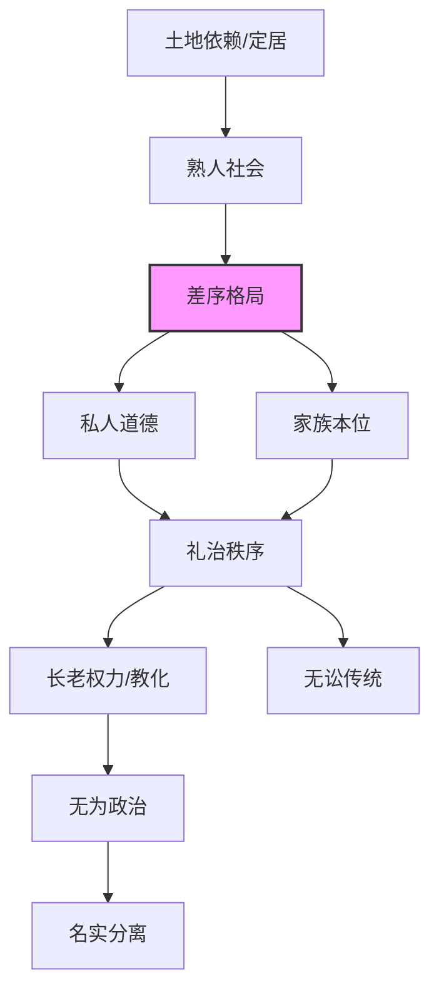
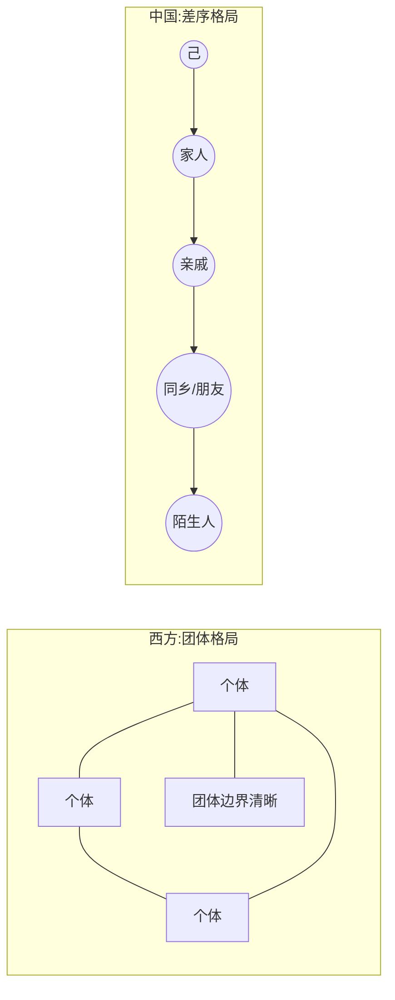

# 《乡土中国》深度读书笔记

> [!abstract] 全书速览
> 这是一部试图从社会学角度解释"中国人为什么是这样"的经典之作。费孝通用14篇短文，从土地、血缘、礼俗、权力等维度，勾勒出传统中国农村社会的基本结构——一个以"差序格局"为核心特征的乡土社会。他拒绝用西方的标准评判中国，而是从田野调查中生长出本土概念，试图从中国社会的内在逻辑来理解它。读完之后你会发现，很多你以为是"人性"的东西，其实是"乡土性"——是这片土地上几千年农耕生活塑造出来的社会基因。

## 核心议题

费孝通在这本书里追问的核心问题是：==中国传统社会究竟是怎样运作的？它和西方社会有什么本质区别？这种区别不是"先进vs落后"的程度之差，而是社会结构上的类型之别。==

这个问题之所以重要，是因为近代以来中国人一直在用西方的标尺丈量自己。西方人说我们"不守法"，我们就觉得自己落后；西方人说我们"没有公共精神"，我们就觉得自己自私。但费孝通说，且慢——你用的那把尺子本身就是为另一种社会设计的，拿来量中国当然不对。

费孝通（1910-2005）是中国社会学与人类学的奠基人之一，曾在伦敦政治经济学院师从人类学家马林诺夫斯基。他的研究路径很独特——不是从书本到书本的纯理论推演，而是从实地田野调查中生长出来的洞察。他在江村（开弦弓村）、禄村等地做过大量的乡村调查，这些具体的观察让他看到了一个活生生的乡土中国，而非概念中的中国。他的写作风格极其平实——用你每天都能看到的场景，说出你从未想通的道理。

这本书写于1947年，脱胎于他在西南联大的授课讲稿。它描述的那个"乡土中国"并没有完全消失。当你困惑于为什么中国人特别讲"关系"，为什么"面子"在中国社会如此重要，为什么中国的法治建设总有些"水土不服"——费孝通在七十多年前就给出了结构性的解释。

## 理论框架

费孝通构建的理论框架是一个层层递进的因果链条：

**基底层：乡土性**——中国社会的根基是农业。农业把人绑在土地上，土地不能移动，人也世代不移动。定居产生了"熟人社会"——一个人从生到死都生活在同一群人中间，彼此知根知底。这种状态决定了中国社会的一切后续特征。

**结构层：差序格局**——这是全书最核心的概念。在熟人社会中，人际关系不是以清晰边界的"团体"为单位组织的，而是以"己"为中心向外一圈圈推展。每个人都是自己那个同心圆的中心。这种格局决定了中国人的道德标准是"伸缩的"——对不同圈层的人有不同的道德义务。这不是"自私"，而是一种完全不同的社会构造方式。

**制度层：礼治秩序**——在差序格局下，社会是怎么维持秩序的？不是靠法律（那是西方"团体格局"的产物），而是靠"礼"。礼是一套每个人从小就在具体情境中学会的行为规范，不需要外在强制，因为你从心底里觉得"就该这样"。违反礼的人不是被法律惩罚，而是被舆论和耻感约束。

**权力层：长老统治**——在变化缓慢的社会中，老人的经验就是最可靠的知识，长辈因此拥有基于传统的权威。这种权力通过"教化"而非"强制"来运作。

**变迁层：名实分离**——当社会开始变化而传统权威不允许公开修改规则时，就出现了"名义不变、实际另搞一套"的应对策略。

这五个层次环环相扣：==乡土性决定了差序格局，差序格局决定了礼治秩序，礼治秩序塑造了长老权力，而当这个体系面对变迁时，名实分离成为必然的应对机制。==

## 论证深度解读

### 一、乡土本色：土地如何塑造人

费孝通开篇就点明："从基层上看去，中国社会是乡土性的。"这不只是说中国有很多农民，而是说中国社会的基本运作逻辑都是由农业定居生活这个"基底"决定的。

中国农民和土地的关系，不是西方那种"生产者与生产资料"的关系，而是一种近乎宗教性的依恋。土地是祖先传下来的，是要传给子孙的，它承载的不只是经济功能，更是家族延续的象征。

> [!note] "土"的文化含义
> "土"在中国语境里从来不是贬义词。我们说"故土"，说"落叶归根"，说"入土为安"——土是最终的归宿，是安稳的象征。

这种人和土地的牢固绑定，产生了两个重要后果：

第一，**人口不流动，形成熟人社会**。农民被束缚在土地上，一个村子里的人世世代代都是那几户，彼此太熟悉了。费孝通说，这是一个"熟人社会"——每个人都知道每个人的底细，不需要介绍，不需要名片，甚至不需要认字。信任不靠契约保障，而靠长期互动和声誉积累。你欺骗了一个人，整个村子都会知道，而且你一辈子都走不掉——这种惩罚比任何法律都有效。

第二，**文字成为多余**。费孝通提出一个看似大胆的判断：在乡土社会里，文字是没有用的。这不是说农民愚昧，而是说他们的生活方式不需要文字。文字是用来和不在场的人、和陌生人沟通的；而在一个面对面的熟人社会里，语言、表情、甚至沉默都能传递信息。所谓"文盲"，只是用城市的标准来衡量农村的结果。

> [!warning] 注意
> 费孝通这个判断容易被误读为"为愚昧辩护"。其实他是在做社会学的结构分析——每种社会形态都有与之匹配的沟通方式，用A社会的标准评价B社会是不公平的。当社会形态发生变化（从熟人社会转向陌生人社会），沟通方式自然需要随之改变。

这两个后果又衍生出第三个深层后果：==时间的权威==。在变化极慢的社会里，过去就是未来的指南。"言必称三代"不是迂腐，而是最理性的态度——经过了时间检验的做法就是"正确"的证明。创新反而是危险的——在容错空间极小的农业社会里（一次实验失败可能意味着一年的饥荒），保守是最安全的策略。

### 二、差序格局：中国式的人际关系

这是全书最重要的概念，也是费孝通对中国社会学最大的理论贡献。

费孝通先描述了西方社会的组织方式，他称之为"团体格局"。西方社会的基本单位是"团体"，像教会、公司、俱乐部。团体有明确的边界——你要么是成员，要么不是；有共同的规则——对所有成员一视同仁；有超越个人的存在——团体可以比任何个体活得更久。在这种社会里，"公"和"私"是清楚的：团体之内是公，团体之外是私。

但中国社会不是这样的。中国人的人际关系是**以自己为中心向外推出去的**，像水波纹一样一圈一圈扩散。最中心是自己，往外是家人，再往外是亲戚，再往外是同乡、朋友、同学……每一圈的亲疏远近都不一样，对待方式也不一样。

> [!example] 费孝通的经典比喻
> 西方社会像一捆柴，每根柴都是独立平等的，捆在一起就形成一个界限分明的"团体"。
> 中国社会像把石头丢进水里，以自己为中心泛起一圈圈涟漪，越远越淡。==每个人都是自己那个水波的中心。==

这个差序格局解释了大量让外人困惑的中国现象：

**为什么中国人分不清"公"和"私"？** 因为这个边界本来就是伸缩的。对家人来说是"私"的钱，对朋友来说可能是"公"的（"朋友有通财之义"）；对自己村子来说是"公"的祠堂，对外村人来说就是"私"的。公和私不是绝对的，而是看你站在哪一圈。

**为什么中国人特别讲"关系"？** 因为你和每个人的关系远近不同，对待方式就应该不同。根据关系远近区别对待不是不道德，恰恰是差序格局下"道德"的要求——对自己人好是应该的。

**为什么中国人常被批评"没有公德心"？** 费孝通说，不是没有，而是"公"的范围不一样。对自己人（圈子里的人）讲道德、讲义气；对外人，那是另一套规则。苏州人家门口的公共街道可以很脏，但自己家里一尘不染——因为街道是"圈外"，不在他的差序格局里。

> [!tip] 核心洞察
> ==差序格局不是道德缺陷，而是社会结构的产物。== 在一个熟人社会里，差序格局是最有效率的社会组织方式——你的时间、精力和资源都是有限的，维护好核心几圈关系网就能生存得很好。只是当现代国家需要建立超越血缘地缘的公民身份时，当法治要求对所有人一视同仁时，这种格局就成了深层障碍。

### 三、家族与血缘：为什么"家"在中国那么大

在差序格局中，最核心的那几圈是"家"。但中国的"家"和西方的family很不一样。

西方的家庭（family）是一个边界清楚的小团体：父母和未成年子女。孩子成年后就独立出去，自己组建新的家庭。这是一个"生育社群"，主要功能是繁衍后代。

中国的"家"则是一个可以无限伸缩的概念。你可以说"我们家三口人"，也可以说"我们老王家"——指整个家族。在功能上，中国的家不仅管生育，还管经济（家是生产和消费的单位）、管教育（家训、家学）、管政治（家长权威、家规家法）、管宗教（祖先崇拜、祠堂祭祀）。这是一个**氏族系统**，不是一个小家庭。"齐家治国平天下"的排序说明了问题：先齐家，然后才有资格谈治国。

费孝通特别指出，中国家庭的主轴不是夫妻，而是**父子**（纵向的血缘传承）。夫妻关系是淡化的、被压抑的。"男女之大防"不是为了道德纯洁，而是为了不让夫妻的感情冲击家族的秩序——如果夫妻太亲密，就可能形成独立的情感和利益单元，与大家族整体利益冲突。

> [!note] 夫妻关系的结构性压抑
> 传统戏曲里，感人的从来是父子、母子、兄弟的情感，很少歌颂夫妻爱情——那被认为不合"礼"。"五伦"里的夫妇关系，强调的是"别"——分工、差异，而不是亲密。这和西方把夫妻视为"一体"的观念完全不同。

血缘关系的重要性，又衍生出"地缘"。费孝通说，中国的地缘关系其实是血缘关系的投射。村子往往是由一个扩大的家族构成的，"张家村""李家庄"——同村就是同宗。即使后来有外姓迁入，也要通过联姻等方式被"吸收"进血缘网络，才能真正成为"自己人"。"老乡"之所以亲切，是因为在传统观念里，老乡很可能就是远亲。==血缘是基础，地缘是血缘的外延。==

### 四、礼治秩序：没有法律如何维持秩序

很多人说中国传统社会是"人治"社会，费孝通不同意。他认为，中国传统社会是"礼治"社会——既不是人治，也不是法治，而是第三种秩序维持方式。

什么是"礼"？==礼是社会公认的行为规范==，但它不是写在法典里由国家强制执行的，而是每个人从小在具体的生活情境中学会的。"礼"告诉你：长辈面前怎么说话，客人来了怎么接待，葬礼上怎么哭，婚礼上怎么笑。你不需要翻书，因为你从小就看着别人这样做，你也自然而然这样做。礼不是抽象的原则，而是具体的行为模式——不是"尊敬长辈"这个原则，而是"见到长辈要起立""长辈坐下你才能坐"这些具体动作。

礼治能够运作，有几个前提：

1. **传统的权威**。礼不是哪个立法者制定的，而是"老祖宗传下来的"。"祖宗之法"本身就有不需要论证的权威——这样做就是对的。

2. **熟人社会的舆论**。违反礼的人不会被逮捕或罚款，而会被"看不起"、被议论、被孤立。在一个人员不流动的社会里，这种软性惩罚比硬性的法律更可怕——你没办法换个地方重新开始。"名声"一旦受损，可能几代人都洗不掉。

3. **内化的耻感**。礼最终会变成你内心的一部分。你做了不合礼的事，哪怕没人知道，你自己也会觉得羞耻、不安。这是儒家教化的终极目标：让外在的规范变成内在的自觉。"慎独"就是这种内化的极致表达。

> [!warning] 礼治的根本局限
> 礼治有效的前提是**社会变化缓慢**。当社会急剧变迁时，"老祖宗的规矩"可能不再适用，但礼治社会缺乏修改规则的合法机制。你只能遵守祖宗的做法，或者彻底反叛——没有中间的"修法"选项。这种刚性是礼治面对变革时的根本困境。

费孝通进一步分析了"无讼"现象。中国人传统上厌讼、耻讼，打官司被视为丢人的事。为什么？因为在礼治秩序下，每个人都该知道该怎么做，需要打官司说明有人破坏了礼——这本身就是可耻的。而且打官司意味着请外人（官员）来介入自己人的事务，这是对差序格局的破坏。=="息讼""和为贵"不是软弱，而是维护社区内部关系网络的策略——官司赢了，关系断了，在乡土社会里是得不偿失的。==

### 五、权力的类型：横暴、同意与教化

费孝通区分了四种权力：

1. **横暴权力**：靠暴力维持的统治，典型如征服者对被征服者。
2. **同意权力**：社会分工产生的权力，大家为了共同利益而授权某人管理公共事务。这是现代民主的基础。
3. **长老权力**：传统的权威，长辈因为掌握祖宗传下来的知识而有权力。
4. **时势权力**：社会剧变时出现的，有能力应对新局面的人获得的权力。

费孝通认为，中国乡土社会的权力主要是**长老权力**。

为什么不是横暴权力？因为在传统的小农经济中，剥削的空间有限。皇权虽然名义上是绝对的，但"天高皇帝远"，对乡村的实际控制力很弱。所谓"皇权不下县"——县以下的社会基本是自治的。

为什么不是同意权力？因为乡土社会几乎没有公共事务。每家种自己的地，过自己的日子。没有公共事务，就不需要公共权力；不需要公共权力，就不需要民主程序来授权。

长老权力的运作逻辑是**教化**而非强制。长辈告诉你该怎么做，你接受，不是因为他能打你，而是因为他知道的比你多——他见过更多的情况，他知道祖宗是怎么处理这种事的。晚辈对长辈的服从，不是恐惧，而是信任。

> [!tip] 长老权力的前提与崩塌
> ==在一个变化极慢的社会里，老人的经验就是最宝贵的知识。== "老"就是"对"的同义词。但当社会剧变时，老人的经验突然失效，长老权力就会崩塌——这正是近代中国发生的事情。长老权力的崩塌，是传统社会解体的重要标志之一。

### 六、名实分离：为什么规则和实践总是脱节

费孝通观察到一个贯穿中国历史的现象：中国社会的官方规则和实际做法往往是两回事。

法律规定继承时诸子均分，但实际上往往长子得大头；儒家强调"君为臣纲"，但历史上臣子架空皇帝、废立皇帝的例子比比皆是。

费孝通的解释是：这是礼治秩序应对社会变迁的一种结构性策略。

在一个强调传统权威的社会里，公开修改规则意味着承认祖宗错了——这在礼治社会中是不可接受的。但现实在变化，老规矩可能不再适用。怎么办？办法就是：名义上维持老规矩不变，实际上另搞一套。法律文本不改，但实际操作偷偷调整。

这样做的好处是：维护了传统的面子，又应对了现实的需要。
坏处是：==规则和实践长期脱节，规则失去了指导作用，变成了纯粹的仪式。人们习惯了"阳奉阴违"——不是对某条具体规则，而是对"规则"这个概念本身失去了敬畏。==

> [!note] 名实分离的当代延续
> 这种"名实分离"在今天的中国依然可见。很多政策法规写得很完美，但真正执行时"灵活变通"；很多官方表述和民间理解之间存在巨大鸿沟。"上有政策下有对策"的文化基因，可以追溯到费孝通所描述的这种结构性应对策略。这不是单纯的"执法不严"问题，而是有深远的文化根源。

## 学术争鸣

《乡土中国》出版后获得了广泛认可，但也有不少批评和讨论。

**支持者**认为，费孝通用极其简洁的语言，捕捉到了中国传统社会最本质的特征。"差序格局"这个概念已经成为中国社会学的基本词汇，几乎所有研究中国社会关系的学者都必须和这个概念对话。费孝通最大的贡献是方法论上的——他示范了如何从中国经验出发构建本土理论概念，而不是简单搬用西方框架。

**批评者**提出了几点质疑：

1. **过度理想化**。费孝通描绘的是一个和谐稳定的乡土社会，但忽略了其中的阶级压迫、性别不平等、暴力冲突。乡村并非田园诗，而是充满了压榨和苦难。

2. **静态化倾向**。费孝通把中国社会描述成几千年不变的"乡土性"，但忽略了历史上的重大变迁：唐宋变革、明清之际的商品经济繁荣、近代冲击。中国社会一直在变化，只是变化的节奏和方向与西方不同。

3. **城乡二元简化**。费孝通把"乡土"当作理解中国的钥匙，但忽略了城市社会的独特逻辑。中国历史上一直有繁荣的城市文明（长安、汴京、苏杭），它们的社会结构和乡村有很大不同。

4. **地域差异忽视**。中国幅员辽阔，南北东西差异巨大。费孝通主要的调查经验在江南（开弦弓村在吴江），他描述的模式在多大程度上适用于华北、西南、岭南，是有疑问的。华北的宗族组织远不如华南强大，游牧地区和农耕区的社会结构截然不同。

公允地说，费孝通自己也承认这本书是"尝试性的"、"概括性的"，不是严密的学术论证。它的价值在于提出了一套观察中国的视角，而非给出最终答案。

## 方法论反思

费孝通的研究方法是"社区研究"——通过深入观察一个具体社区，来理解更大的社会结构。这种方法源自马林诺夫斯基的功能主义人类学——在社区中长期驻扎，观察日常行为，从中发现运作逻辑。

这种方法的**优势**在于：接地气，不是从概念到概念的空转，而是从活生生的人的生活中生长出来的洞察。费孝通书中那些精彩的比喻——涟漪、一捆柴——都来自他对真实生活的直接感知。

**局限**也很明显：一个村子能在多大程度上代表整个中国？费孝通的案例在统计意义上不具有代表性。而且《乡土中国》更像是基于多年田野积累的"理论随笔"，14篇文章之间虽有逻辑联系，但论证的严密性不如后来的社会学著作。

> [!warning] 阅读提醒
> 阅读《乡土中国》时，不能把它当作对当代中国社会的直接描述。它描述的是一个正在消逝的世界。但那个世界的遗产——差序格局、关系社会、礼俗传统、名实分离——仍然以各种变形的方式影响着今天的中国人。应把它当作理解当代中国社会"从何而来"的一个窗口。

## 现实映射

虽然费孝通描述的那个"乡土中国"已经大大改变，但它的遗产仍然无处不在：

**关系型社会**：在中国做生意、找工作、办事情，"关系"仍然比"规则"重要。这不是简单的"腐败"，而是差序格局在现代社会的延续。差序格局从农村的血缘地缘网络演变为城市的校友网络、同乡会、商会等新形态，但核心逻辑——以"己"为中心、按亲疏远近区别对待——并没有根本改变。

**变通文化**：政策出了，上有政策下有对策；规定明确，但"特殊情况特殊处理"。这种名实分离的传统，让中国的制度常常有很大的弹性空间——这既是灵活性，也是不确定性。

**家族观念**：虽然大家族已经瓦解，但"家"的观念仍然强大。为什么中国年轻人买房压力那么大？因为"成家立业"仍然是最重要的人生目标。为什么中国父母对子女的教育投入那么高？因为子女的成就就是家族的成就。

**熟人信任 vs 陌生人警惕**：中国人在熟人圈子里极其热情慷慨，对陌生人则保持警惕。这是差序格局的现代表现。

**法治的深层挑战**：法治要求"法律面前人人平等"——对所有人一视同仁。但差序格局的文化基因让人习惯于"看人下菜碟"。认识到这一点，才能理解为什么中国的法治建设不只是制定法律条文的问题，更是改造根深蒂固的社会关系模式的问题。

理解这些现象的"乡土根源"，不是为了给它们辩护，而是为了更有效地改变它们。费孝通的书告诉你：==这些行为模式不是某些人的道德缺陷，而是整个社会结构的产物。要改变它们，需要从结构入手，而不是简单地道德谴责。==

## 延伸阅读

如果《乡土中国》引发了你对中国社会的兴趣，以下几本书可以进一步深入：

- [[《江村经济》]]（费孝通）：这是费孝通的博士论文，对一个江南村庄（开弦弓村）的详细调查。如果说《乡土中国》是理论概括，《江村经济》就是具体案例。两者对照阅读，能更好地理解费孝通从田野到理论的思维路径。

- [[《中国文化的深层结构》]]（孙隆基）：从心理和文化的角度分析中国人的行为模式，与费孝通的社会结构视角形成互补。孙隆基的批判更加尖锐，不像费孝通那样试图"同情地理解"。

- [[《私人生活的变革》]]（阎云翔）：通过对一个东北村庄（下岬村）几十年变迁的追踪，展示乡土社会在当代的瓦解和重构。可以视为《乡土中国》的时间续篇——费孝通描述了那个世界是什么样的，阎云翔则展示了那个世界后来发生了什么。

- [[《中国的宗教：儒教与道教》]]（马克斯·韦伯）：从比较社会学角度分析中国社会结构与宗教伦理的关系，与费孝通形成外部视角和内部视角的互补。
