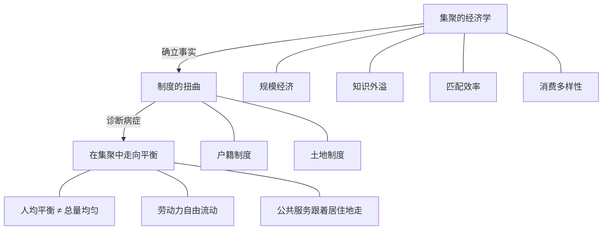
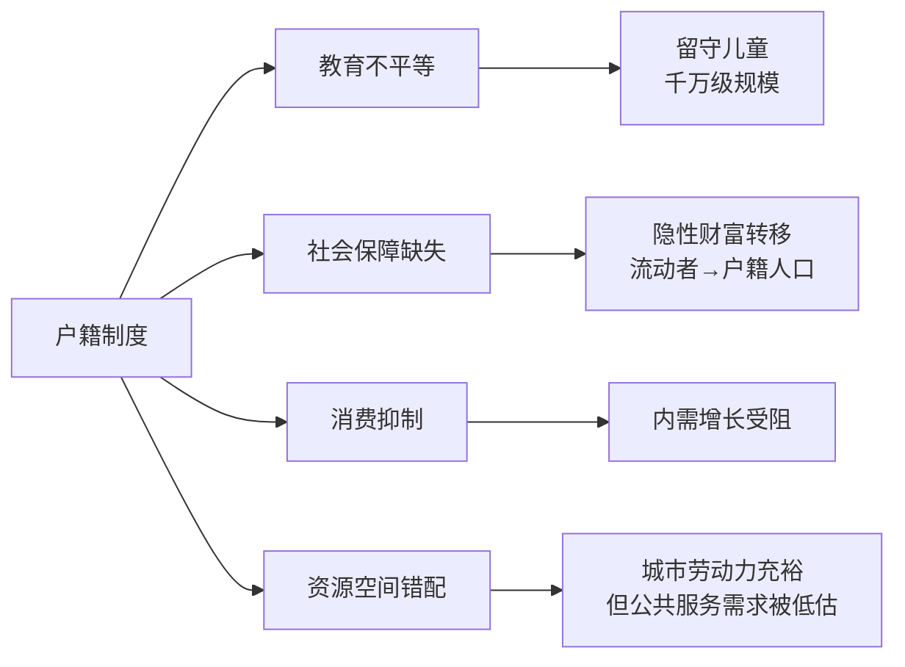

# 《大国大城》深度读书笔记

> [!abstract]
> 2016年出版的《大国大城》是中国城市化和区域发展政策讨论中最重要的著作之一。陆铭系统论证了一个与当时主流认知截然相反的观点：中国的大城市不是太大了，而是还不够大；人口集聚不是问题的根源，而是经济规律的自然结果。阻碍人口自由流动的制度——尤其是户籍制度和土地制度——造成了巨大的效率损失和社会不公。这本书重新定义了"区域平衡"：不是追求人口和经济总量的均匀分布，而是追求不同地区人均收入的趋同——在集聚中走向平衡。

## 这本书要回应什么问题

陆铭写作《大国大城》的2010年代中期，中国社会和政策界弥漫着关于城市化的焦虑：北京上海"太大了"，交通拥堵、房价高企似乎都指向"人口太多"的结论。2014年前后，北京和上海先后提出人口控制目标，中央政策层面也倾向于"产业西移"。"控制大城市、发展中小城市、促进区域均衡"几乎成为共识。

> [!tip] 核心问题
> ==中国的城市化应该走什么路径？人口向大城市集聚究竟是需要纠正的问题，还是应该顺应的规律？区域平衡的正确含义到底是什么？==

陆铭的答案在当时显得异端：人口集聚是全球普遍的经济规律；中国的城市化程度不是太高而是太低；大城市的问题根源不在于人太多，而在于公共服务供给不足和城市治理能力欠缺。正确的做法不是对抗集聚趋势，而是通过制度改革让集聚更加有序——==在集聚中实现人均收入的趋同==。

在中国区域经济学的谱系中，陆铭是"大城市派"的代表人物，与"均衡发展派"形成对话。在国际学术脉络中，他的观点与哈佛大学城市经济学家格莱泽（[[《城市的胜利》]]）、世界银行2009年《世界发展报告》以及新经济地理学创始人克鲁格曼的研究高度共鸣。

## 核心论证地图

三个核心命题层层递进：

- **集聚的经济学**：四种经济力量（规模经济、知识外溢、匹配效率、消费多样性）形成正反馈循环，驱动人口和经济活动向大城市集聚。这是全球普遍规律，不是中国的特殊病症
- **制度的扭曲**：中国的特殊之处在于制度对集聚的阻碍——户籍制度制造"二等公民"，土地制度使资源配置方向与人口流动方向相反
- **在集聚中走向平衡**：区域平衡不是总量均匀分布，而是人均收入趋同。允许人口自由流动和经济集聚恰恰是实现人均平衡的最有效途径

> [!note] 论证结构
> 如果只看到第一个命题就会认为陆铭只是在为大城市辩护，只看到第三个命题就会认为他忽视了区域公平。完整地看三个命题会发现：==集聚和平衡不矛盾，制度才是矛盾的根源。==

## 逐层深入

### 集聚的四种经济力量

人口向大城市集聚不是偶然现象，而是四种强大经济力量共同作用的结果。

> [!example] 四种集聚力量
> 1. **规模经济**：大城市支撑更专业化的分工——小城市只需要全科医生，大城市能养活数百个细分专科。基础设施的人均分摊成本随人口增加而递减
> 2. **知识外溢**：创新依赖高密度的人际互动。非正式的、偶然的知识交流在城市环境中发生频率远高于低密度地方。硅谷、纽约、伦敦无一例外
> 3. **匹配效率**：更大的劳动力市场降低搜寻成本，人才与岗位的适配度更高，生产力因此提升
> 4. **消费多样性**：大城市能支撑更丰富的文化设施、餐饮选择和生活方式，对高技能人群有很强吸引力

这四种力量形成正反馈循环：规模经济创造高薪岗位 → 吸引高技能人才 → 强化知识外溢 → 催生创新和新产业 → 扩大市场规模 → 提高匹配效率和消费多样性 → 吸引更多人口流入。==这个循环是全球性的，越是进入知识经济时代，集聚的力量越强。==

陆铭用大量国际数据证明这个规律的普遍性：日本东京都市圈集中了全国约1/3的人口和经济活动，韩国首尔都市圈集中了近半人口，美国经济高度集中在东西海岸大都市圈。这些国家人均收入远高于中国，但集聚趋势并没有因为富裕而逆转。

### 中国集聚不足的证据

> [!warning] 与流行认知相反
> 中国的城市化程度和人口集聚程度不是太高，而是==太低==：
> - 常住人口城市化率超60%，但==户籍城市化率只有约45%==——数以亿计的人口是"半城市化"状态
> - 与同发展阶段国家相比，大城市人口比重偏低——日本在中国当前人均收入水平时东京的集中度已远高于今天的北京
> - 各省人均GDP差距是全世界最大的之一——==巨大的区域差距恰恰说明人口流动受到了阻碍==

### 四个流行误区的拆解

**误区一："大城市已经太大了"**

陆铭从三个角度拆解。比较角度：北京行政面积16400平方公里约等于8个东京都，整体人口密度远低于东京，而东京运转效率远优于北京。因果角度：拥堵的根源是公共交通投资不足和空间布局不合理，房价高的根源是土地供给制度性不足，污染的根源是产业结构和环保标准——==人口控制是因果倒置，不去解决真正问题，却试图消灭问题的"载体"==。后果角度：被清退的往往是城市运转不可或缺的低端服务业从业者，结果城市服务成本上升，所有居民受损。

**误区二："人口流入是抽血"**

> [!tip] 三个被忽略的事实
> 1. 劳动者自己选择流动是因为有更好机会——限制流动损害的首先是他们自己的利益
> 2. 外出务工者的汇款是极其高效的转移支付机制——比政府财政转移更精准
> 3. 人口流出减少当地劳动力供给，提高留守者工资——==从人均意义看，人口流出对留守者是有利的==

**误区三："应该产业西移"**

产业布局不是可以随意搬动的棋子：出口制造业需要靠近港口，高科技产业依赖人才集聚和知识外溢，金融业需要信息密集环境。产业集聚形成的供应链网络和人才池是几十年市场演化的产物。中西部大量工业园区招商困难、土地闲置已是明证。

**误区四："农民工应该回乡"**

权利层面：选择居住地和工作地是基本权利。效率层面：如果回乡是最优选择，不需要政策推动。现实层面：很多人在城市生活了几十年，子女在城市出生成长。

### 户籍制度的系统性代价

中国户籍制度的核心问题：==将公共服务与户籍身份挂钩，而不是与居住地挂钩==。

> [!warning] 四重代价
> - **教育不平等**：非户籍子女难获公办教育，被迫成为留守儿童。大量研究表明留守儿童在认知发展、心理健康和学业成绩方面显著落后
> - **社会保障缺失**：在城市缴纳社保却难以在当地享受待遇——年轻时为城市社保基金做贡献，老了却享受不到
> - **消费抑制**：缺乏永久定居预期，不敢买房、不敢大额消费——数以亿计有消费能力的劳动者压低消费水平
> - **资源空间错配**：劳动力在城市工作、家庭消费在农村，供需空间分离

户籍制度难以改革的深层逻辑：大城市户籍人口是既得利益者；地方财政约束使接纳更多人口意味着更大支出压力；政绩考核侧重经济增长而非公共服务覆盖率；认知偏差将问题归咎于"人太多"。

### 土地制度的系统性扭曲

> [!tip] 核心发现
> ==中国建设用地的空间配置方向，与人口流动的方向恰好相反。==

人口流入的东部：建设用地指标受严格控制，住宅用地被压缩 → 房价高企。人口流出的中西部：大量建设用地指标用于建工业园区和新城 → 招商困难，"有城无人"。

"土地财政"模式加剧扭曲：政府有激励限制供给推高地价 → 土地供给不足推高房价 → 高房价吸引投机需求 → 进一步推高房价 → 削弱城市竞争力。与此同时，农村居民的宅基地和承包地无法自由流转变现——==财产权利被锁定在土地上==，无法获得进城定居的资本。

陆铭的建议：允许建设用地指标跨区域流转；改革农村土地制度，赋予更完整的财产权。

### "在集聚中走向平衡"的完整论证

> [!tip] 关键区分
> - **总量平衡**：追求各地区人口和经济总量均匀分布 → ==既不可能也不可取==
> - **人均平衡**：追求不同地区人均收入和生活水平趋于接近 → ==唯一正确的区域平衡目标==

机制：劳动力从低工资地区流向高工资地区 → 流入地工资上升放缓 → 流出地劳动力减少、人均资源增加、人均收入上升 → ==不同地区人均收入趋于收敛==。

> [!example] 日本的示范
> 东京都市圈集中了日本约1/3的人口和经济活动，经济在空间上高度集中。但日本是全世界区域差距最小的国家之一——不同都道府县之间人均收入差距很小。原因：没有户籍制度限制人口流动，劳动力自由从低收入地区流向高收入地区，直到工资差距基本消除。==经济集中了，但人均收入平衡了。==

反面例证：中国由于户籍制度限制人口流动，各省人均GDP差距是全世界最大的之一。==限制流动既损害效率又加剧不公——这不是效率与公平的权衡，而是两者同时受损。==

### 行政思维与经济逻辑的冲突

行政思维：每个省要有完整产业体系，每个市要有大学和三甲医院，每个县要有工业园区。根源是GDP增长考核使资源被分散到每个行政单元。

经济逻辑：资源配置服从比较优势原则，不同地区做各自最擅长的事情。

> [!note] 对欠发达地区的正确"造血"
> 陆铭不反对转移支付，反对的是转移支付的方向——用于建工业园区和修高速公路在缺乏产业和人口基础的地方效率极低。替代方案：==将转移支付的重点从"投资基建"转向"投资人"——大力投资教育，提升人力资本==。受过良好教育的人，无论留在本地还是流动到外地，都能获得更好的发展机会。让人有能力流动，本身就是最有效的扶贫。

## 国际经验对照

**日本**：东京都市圈集中约1/3人口和经济活动，但区域差距全球最小之一。没有户籍限制，劳动力自由流动使工资差距基本消除。

**美国**：经济高度集中在大都市圈，劳动力自由流动使20世纪后半叶不同州人均收入差距持续缩小。近年来差距扩大的原因恰恰是知识经济使高技能劳动力向科技中心集中、低技能劳动力的流动面临住房成本障碍——==当流动受阻时区域差距就会扩大==。

**关于"逆城市化"**：所谓逆城市化多数是大都市圈内部的郊区化，不是人口流向偏远地区。这是城市化成熟后在高速公路和私家车普及条件下的正常阶段。==中国远未到这个阶段，讨论逆城市化为时过早。==

**关于拉美教训**：巴西、墨西哥的贫民窟问题不在于集聚本身，而在于制度环境——产权保护不力、公共服务缺位、社保体系不完善。==关键不在于是否允许集聚，而在于是否建立了配套制度让集聚有序运行。==

## 预测与现实

> [!warning] 验证与局限
> - 北京2017年严厉人口疏解措施导致城市服务成本上升，政策随后缓和；越来越多城市放宽落户限制——方向与陆铭主张一致
> - 中西部大量工业园区和新城沦为"鬼城"，验证了资源错配的判断
> - 但户籍改革推进速度比预期慢，大城市户籍门槛仍高；土地财政改革进展缓慢
> - ==人口结构变化是陆铭未充分预见的变量==：2022年中国总人口首次下降，给"在集聚中走向平衡"增添了新的紧迫性

## 不同立场怎么说

- **"均衡发展派"**：市场机制不会自动实现区域平衡（循环累积因果——强者越强），需要政府通过产业政策和转移支付来纠偏。陆铭的回应：政府干预应集中在消除流动障碍和投资人力资本，而非人为改变产业空间布局
- **新经济地理学**（克鲁格曼）：为陆铭提供了理论基础。"中心-外围"模型表明经济活动自发向少数中心集聚，通过劳动力流动可实现人均收入收敛
- **制度经济学**（诺斯）：补充了"为什么中国形成如此独特的阻碍人口流动的制度"这个问题——制度是历史路径依赖和利益博弈的产物
- **城市规划学界**：承认经济合理性，但担心过快集聚超出承载能力，强调"有序城市化"。陆铭的立场：城市规划应服务于人口流动方向，而不是对抗它

## 对你意味着什么

- 看到"某某城市太拥挤了"的说法时追问：与同级别国际大都市比人口密度如何？问题是人太多还是公共服务没跟上？==把问题归咎于"人太多"往往是最偷懒的归因==
- 评估城市发展前景时关注人口流动方向——持续有人口流入说明经济基本面有吸引力；人口持续流出则无论GDP增速多高都值得警惕
- 理解区域经济要区分"总量"和"人均"——人口流出不一定是坏事，如果留下的人人均收入提高了就是资源在更合理配置
- 大城市的高房价和高生活成本是集聚经济的"入场费"——为更高收入、更好职业匹配和更丰富生活选择付出的代价

## 延伸阅读

- [[《城市的胜利》]]：格莱泽从全球视角论证城市为什么是人类最伟大的发明，与陆铭高度互补
- [[《置身事内》]]：兰小欢从政府行为和财政体制角度分析中国经济，在土地财政、地方政府行为和区域发展等议题上与《大国大城》深度互补
- [[《乡土中国》]]：费孝通理解中国传统社会结构的经典，帮助体会城市化对中国社会意味着多么根本的转型
- [[《新结构经济学》]]：林毅夫更强调政府在产业升级中的引导作用，与陆铭的市场自发配置立场形成有益张力
