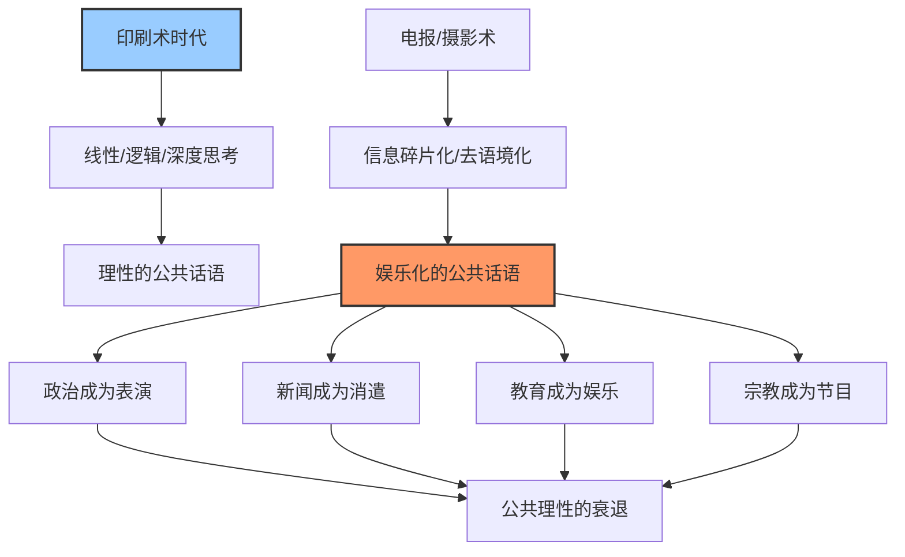

# 《娱乐至死》深度读书笔记

> [!abstract] 全书速览
> 这是一部关于媒介如何重塑人类思维方式和公共话语的警世之作。尼尔·波兹曼的核心论点惊人地简洁：==奥威尔害怕的是禁书，赫胥黎害怕的是没有人想读书；奥威尔害怕的是信息被剥夺，赫胥黎害怕的是信息被淹没在汪洋大海中变得无关紧要。==波兹曼认为，赫胥黎是对的。电视作为20世纪的主导媒介，并不是通过审查和压制来摧毁文化，而是通过把一切——政治、宗教、新闻、教育——都变成娱乐来完成这一使命。当严肃的公共话语必须以娱乐的形式呈现才能获得关注时，话语本身的性质就已经改变了。这本书写于1985年，但它对当下的社交媒体、短视频和算法推荐时代的预见力，让人不寒而栗。

## 核心议题

波兹曼追问的核心问题是：==当一个社会的主导传播媒介发生根本变化时，这个社会的公共话语、思维方式和文化品质会发生什么？==

这个问题之所以重要，是因为大多数人把媒介当作"透明的管道"——信息从一端进去、从另一端出来，管道本身不会改变信息的内容。但波兹曼继承并发展了马歇尔·麦克卢汉"媒介即讯息"的思想，他认为管道本身会根本性地改变流经它的一切。用印刷术传递思想和用电视传递思想，得到的不是同样的思想——媒介选择了什么能被表达、什么不能被表达，什么被强调、什么被忽略，什么显得"自然"、什么显得"格格不入"。

尼尔·波兹曼（1931-2003）是纽约大学媒介生态学教授，他创立的"媒介生态学"（Media Ecology）学科，专门研究传播技术如何影响人类的感知、理解和价值观。他的学术谱系可以追溯到加拿大传播学者马歇尔·麦克卢汉（[[《理解媒介》]]的作者）和哈罗德·伊尼斯。麦克卢汉提出了"媒介即讯息"的口号，但表述往往晦涩跳跃；波兹曼的贡献在于把这个洞察做了更系统、更具历史感的论证——他不只是断言媒介重要，而是通过对比印刷时代和电视时代的公共话语，具体地展示了媒介变化如何改变了话语的质地。

这本书写于1985年，针对的是电视。但波兹曼的分析框架远不止适用于电视——今天的社交媒体、短视频平台、算法推荐系统，在很多方面比电视走得更远。波兹曼担忧的是娱乐化吞噬严肃话语；今天的问题可能更复杂——不仅是娱乐化，还有碎片化、极化、注意力经济对深度思考的全面侵蚀。

> [!note] 两种反乌托邦的对比
> 波兹曼在全书开篇就抛出了他最有力的修辞框架：[[《1984》]]vs[[《美丽新世界》]]。奥威尔担心的是外在的压迫——国家审查信息、控制思想、禁止自由表达。赫胥黎担心的则完全不同——不是有人会剥夺你获取信息的权利，而是信息太多、娱乐太丰富，以至于你根本不想去关注严肃的事情。一个是铁拳式的，一个是温水煮青蛙式的。波兹曼说，西方社会正在走赫胥黎预言的路线——不是被压迫致死，而是被娱乐致死。

## 理论框架

波兹曼的理论框架建立在三个递进的命题之上：

**第一个命题：媒介不是中性的工具。** 每一种媒介都有自己的"认识论偏向"——它倾向于表达某些类型的内容，排斥另一些类型的内容。印刷术天然适合线性的、逻辑的、抽象的论证；电视天然适合视觉的、情感的、片段化的呈现。你不能用烟信号来讨论哲学，同理，你也很难用电视来进行严肃的政治辩论——不是因为电视人不聪明，而是因为媒介的形式决定了内容的性质。

**第二个命题：主导媒介塑造了时代的"认识论"。** 当一个社会的主导传播媒介发生变化时，这个社会理解世界、组织信息、判断真假的方式都会随之改变。在印刷时代，"真理"长得像一个论证——有前提、有推理、有结论。在电视时代，"真理"长得像一个画面——可信的面孔、动人的故事、令人震撼的影像。==媒介不仅传递信息，它还定义了什么叫"信息"、什么叫"有意义"、什么叫"值得关注"。==

**第三个命题：电视将一切变成了娱乐。** 电视的本质是一种娱乐媒介。这不是因为电视人偏爱娱乐，而是因为电视的技术特性——视觉主导、片段化、连续播出、需要持续吸引注意力——决定了它必须以娱乐的形式呈现一切内容。当政治、新闻、宗教、教育都必须适应电视的形式要求时，它们就不可避免地被娱乐化了。

## 论证深度解读

### 一、媒介即认识论：你用什么工具思考，就会成为什么样的思考者

波兹曼论证的起点是一个看似简单的洞察：==我们使用的传播工具不只是传递已有的思想，它还参与塑造了思想本身。==

他从部落社会的口语传统讲起。在没有文字的口语文化中，知识只能通过记忆和口耳相传来保存。这意味着什么？意味着只有容易记忆的东西才能成为"知识"——韵律、故事、格言、重复的句式。你不可能在纯口语社会中发展出微积分或宪法学，不是因为那些人笨，而是因为口语这种媒介无法承载那种复杂度的抽象推理。

> [!example] 媒介如何筛选内容
> 波兹曼举了一个精彩的例子：假设你只能用烟信号来传递信息，你能讨论哲学吗？答案显然是不能。烟信号这种媒介决定了你只能传递简单的、预先约定好的信息。同理，每一种媒介都有自己的"语法"——它允许某些类型的表达，排斥另一些类型。问题不在于某种媒介好不好用，而在于当某种媒介成为社会的主导传播工具时，它所排斥的那些表达类型会逐渐从公共空间中消失。

波兹曼进一步论证说，每种媒介不仅筛选内容，还定义了什么叫做"真理"。在口语文化中，权威来自长者的记忆和讲述能力——"说得好"就是"说得对"。在印刷文化中，权威来自论证的逻辑和证据的充分——你必须展示推理过程，读者可以逐字逐句地检验你的论证。在电视文化中，权威来自可信的外表和令人信服的表演——你"看起来"可信就是可信的。

> [!tip] 核心洞察
> ==每一种主导媒介都创造了自己的真理标准。== 这不是说真理本身是相对的，而是说不同的媒介环境会让人们用不同的方式来判断什么是真、什么是假、什么值得相信。当你意识到这一点时，你就获得了一种珍贵的自觉——你可以开始审视自己的判断标准是否被你使用的媒介悄悄塑造了。

这个论点的激进之处在于：它意味着媒介转型不仅仅是技术问题，而是认识论问题。当一个社会从印刷时代转向电视时代，改变的不只是信息传播的速度和方式，而是这个社会判断什么是"知识"、什么是"真理"、什么是"值得关注的事"的整套标准。

### 二、印刷时代的美国：一个以文字为中心的文明

波兹曼花了相当的篇幅重建18-19世纪美国公共文化的面貌，目的是为后面批判电视时代提供一个对照基准。

他指出，美国是一个诞生于印刷术的国家。==美国的建国者——杰斐逊、富兰克林、麦迪逊、汉密尔顿——不仅是政治家，更是出色的作家和思想者。美国宪法和《联邦党人文集》本身就是印刷文化的产物——它们要求读者进行细致的、逻辑的、持续的阅读理解。==一个不识字的人不可能参与制宪辩论；一个没有耐心阅读长篇论证的人也不可能理解宪法的精微之处。

波兹曼用了一个令人印象深刻的历史案例来说明印刷时代的公共话语品质：1858年林肯与道格拉斯的系列辩论。这些辩论每场持续数小时，双方围绕奴隶制和联邦权力进行高度详尽的论证，而观众——普通的农民和小镇居民——不仅全程聆听，还能跟上复杂的论证逻辑。波兹曼强调，这些观众并非什么知识精英，他们只是生活在一个以印刷品为主导媒介的社会中，长期的阅读训练塑造了他们处理复杂信息的能力。

> [!note] 印刷文化的思维特征
> 印刷术培养了一系列特定的思维能力：
> - **线性推理**：文字从左到右、从上到下的排列，训练了读者按照因果逻辑链条思考
> - **延迟满足**：阅读一本书需要花几个小时甚至几天，读者必须学会推迟判断，等待论证的完成
> - **抽象思维**：文字天然是抽象的符号，阅读要求你在脑中把符号还原为意义
> - **独立判断**：面对一本书，你只能靠自己的理性来评估论证的质量，没有配乐、画面或表情来影响你
> - **持续注意**：一篇长文章或一本书要求持续的注意力集中——如果你走神了，就跟不上论证了

波兹曼并不是在浪漫化印刷时代。他知道那个时代也有谎言、偏见和愚蠢。但他的论点不是说印刷时代的人更聪明或更善良，而是说==印刷术作为主导媒介，创造了一种有利于理性公共话语的环境==。在那个环境中，严肃的论证是被期待的、受尊重的、有观众的。一个政治家如果只会喊口号而不能展开论证，在印刷时代是不会被认真对待的。

他还指出了印刷文化的一个重要特征：==内容和呈现者的分离==。当你读一本书时，你关注的是论证本身，而不是作者长什么样、穿什么衣服、声音是否好听。这意味着在印刷文化中，思想可以凭借自身的力量——而非包装——来获得影响力。一个丑陋的天才写出的深刻论证，在印刷时代完全可以改变世界。但在电视时代，这种可能性大大降低了。

### 三、从电报到电视：信息是如何变成垃圾的

波兹曼论证的一个关键转折点是电报的发明。他认为，==真正开始瓦解印刷文化认识论的不是电视，而是电报。==

在电报之前，信息是"本地的"。你生活在某个社区，你关心的是和你的生活直接相关的事情——本地的政治、经济、社会状况。这些信息对你来说是有用的——它们能帮助你做出实际的决定和行动。

> [!warning] 电报带来的认识论革命
> 电报做了一件根本性的事：它让远方的信息可以几乎即时传到你面前。表面上这是进步——你知道的更多了。但波兹曼追问了一个尖锐的问题：==这些远方的信息对你有什么用？==你知道了遥远国度发生了一场地震，你能做什么？你知道了千里之外一个政客说了什么话，这对你的日常决策有什么帮助？答案是：几乎没有。电报创造了一种全新的信息类型——与你无关、无法行动、但不断涌来的"新闻"。信息从"有用"变成了"有趣"。

电报还有另一个深远的影响：它迫使信息变得碎片化。电报按字数收费，这就产生了一种经济压力——信息必须尽可能短。长篇的论证、细致的分析、充分的背景介绍，在电报时代都是奢侈品。电报培养了一种新的信息美学：短、快、新、奇。这和印刷时代的信息美学——长、深、完整、系统——形成了尖锐的对比。

摄影术的加入进一步加速了这个转变。如果说电报让信息变得碎片化和去语境化，那么摄影术让信息变得视觉化和情感化。一张照片的力量在于它的直观性——你不需要思考就能"理解"它。但正因为如此，照片也容易误导——它呈现的是一个瞬间、一个角度、一个被框定的片段，而读者很容易把这个片段当成全部的真相。波兹曼指出，==照片和电报的结合——速度加上画面——创造了一种"伪语境"：信息脱离了它原本的来龙去脉，被重新包装成独立的、可消费的碎片。==

电视是电报和摄影术的逻辑终点。它把碎片化的信息、视觉化的呈现和持续的情感刺激结合在一起，创造了一种前所未有的传播环境：你坐在沙发上，屏幕上的画面不断变换——战争、广告、喜剧、天气预报、悲剧——一切都以同样的速度流过你的眼前，没有任何一个话题会停留足够长的时间让你深入思考。

### 四、"好……现在"：电视新闻的认识论

波兹曼对电视新闻的批判是全书最具洞察力的段落之一。他注意到电视新闻中一个看似无关紧要的细节：新闻主播在播报完一条灾难性的消息后，会面带微笑地说"好，现在让我们来看看……"，然后转向下一条完全不相关的新闻。

> [!example] "好……现在"的深层含义
> 一条关于战争中平民死伤的新闻结束后，主播说"好，现在让我们来看看今天的体育赛事"。这个"好……现在"不是主播个人的冷漠，而是电视新闻的结构性要求——节目必须继续，注意力必须被持续维持，任何一个话题都不能停留太久。==它传递了一个隐含的信息：没有什么事情是真正严重的、需要你深入关注的。一切都是可以被一句"好……现在"轻松翻过去的。==

波兹曼指出，电视新闻创造了一种"信息的幻觉"——你觉得自己知道了很多（看了一小时新闻，接触了几十条信息），但实际上你对任何一件事都没有真正的理解。因为电视新闻的结构决定了：每条新闻只有几十秒到几分钟；没有充分的背景介绍；没有复杂的因果分析；强调视觉冲击而非逻辑论证；一条接一条的快速切换让你没有时间消化和反思。

他进一步指出，电视新闻的真正竞争对手不是其他新闻节目，而是娱乐节目。电视新闻必须和肥皂剧、综艺节目争夺观众的注意力，这意味着它必须在某种程度上"变成"娱乐。新闻主播的选拔标准不是他们对公共事务的理解深度，而是他们的上镜效果和表演能力。新闻选题的标准不是事件的重要性，而是事件的视觉冲击力——这就是为什么火灾、车祸、暴力事件总是比政策分析更容易上头条。

> [!tip] 新闻的两种模式
> ==印刷时代的新闻模式是"信息-行动"模式：你获取信息是为了做出决定和采取行动。== 你读报纸上关于本地选举的报道，是为了决定投票给谁。你关注市场行情，是为了决定买卖什么。信息和行动之间有直接的联系。
>
> ==电视时代的新闻模式是"信息-消遣"模式：你获取信息是为了打发时间。== 你看一小时电视新闻，接触了几十条来自世界各地的信息，但你对其中任何一条都无法采取行动。它们的功能不是帮助你做决定，而是给你提供谈资——明天在办公室你可以聊聊昨晚新闻里的那个故事。信息从"行动的依据"变成了"聊天的素材"。

### 五、政治的娱乐化：当竞选变成选秀

波兹曼对政治话语娱乐化的分析直击要害。他指出，电视根本性地改变了政治竞选的规则——==在印刷时代，政治竞选是一场论证的竞赛；在电视时代，政治竞选是一场形象的竞赛。==

他以1960年美国总统大选的电视辩论为标志性事件。在那场著名的肯尼迪-尼克松辩论中，通过广播收听辩论的人普遍认为尼克松赢了——他的论证更有力、对政策的掌握更熟练。但通过电视观看辩论的人压倒性地认为肯尼迪赢了——他更年轻、更英俊、更从容。波兹曼认为，这个事件标志着美国政治进入了一个新时代：==外表胜过了内容，形象取代了论证。==

电视时代的政治广告就是这种转变的极致体现。政治广告不是为了说明候选人的政策立场——三十秒的时间根本不够说明任何复杂的政策。政治广告是为了创造情感联系和品牌认同——让你"感觉"某个候选人是可信的、有力量的、和你站在一起的。

波兹曼指出了一个令人不安的后果：==在电视时代，一个长得好看但思想贫乏的候选人，比一个长得普通但思想深刻的候选人更有优势。== 这不是因为选民愚蠢，而是因为电视这种媒介天然地偏向形象而非论证。当你在电视上看到一个候选人时，你接收到的信息首先是他的外表、表情、肢体语言和语调，其次才是（如果有的话）他的政策主张。而且在三十秒的广告或两分钟的辩论回答中，复杂的政策论证根本无法展开——你只能喊口号。

> [!warning] 注意
> 波兹曼并不是说电视直接导致了坏的政治家上台。他的论点更为深刻——==电视改变了"好的政治家"的定义。== 在印刷时代，好的政治家是善于论证、思想深刻的人；在电视时代，好的政治家是善于表演、形象良好的人。这两种标准选出的人可能完全不同。问题不在于某一个政治家，而在于整个政治话语的质地发生了改变。

### 六、宗教、教育与商业：全面的娱乐化

波兹曼没有把批判局限在新闻和政治领域。他逐一考察了电视如何改造了宗教、教育和商业话语。

**宗教的娱乐化。** 电视布道是波兹曼分析的一个典型案例。他指出，电视上的宗教节目不是把传统的宗教仪式搬上了屏幕，而是根本性地改变了宗教体验的性质。传统的宗教仪式需要特定的神圣空间（教堂、寺庙）、特定的身体参与（跪拜、祈祷、唱诗）和一个共同在场的社群。电视把这一切都取消了——你穿着睡衣、吃着零食、坐在沙发上"参加"礼拜。当宗教必须以娱乐的形式呈现才能在电视上存活时，它就不再是宗教了——==它变成了一种以宗教为主题的娱乐节目。==布道者必须像电视节目主持人一样吸引观众、维持收视率，这意味着灵魂的拷问必须让位于情感的抚慰，深邃的神学必须让位于简单的鸡汤。

**教育的娱乐化。** 波兹曼对《芝麻街》（Sesame Street）这类教育节目的批判出人意料。大多数人认为这类节目是电视的正面应用——用电视的形式教孩子学习。但波兹曼说，问题恰恰在这里。==《芝麻街》教给孩子的不是字母和数字，而是一个更深层的观念：学习应该是有趣的。== 如果学习不有趣，那就不值得学。这看似无害，实则深远——它摧毁了一种重要的能力：在无趣中坚持、在困难中深入的能力。真正的学习很多时候就是不有趣的——背单词、做数学练习、啃艰深的理论著作——但这种"不有趣"正是思维能力成长的必要条件。

> [!note] 教育的悖论
> 波兹曼指出了一个教育领域的深层悖论：==电视教育节目的目的是让孩子爱上学习，但它实际上教给孩子的是爱上电视。== 当孩子习惯了通过快速切换的画面、活泼的音乐和可爱的角色来"学习"时，他们再面对一本没有插图的教科书或一个不会讲笑话的老师时，就会觉得"无聊"。电视教育没有让课堂变得更像电视——它让课堂在和电视的比较中显得更加难以忍受。

**商业广告的文化影响。** 波兹曼认为，商业广告在某种意义上是电视时代最"诚实"的内容——因为广告从来不伪装自己在传递严肃信息，它坦然承认自己的目的就是制造欲望和推动消费。但正因如此，==广告成了电视时代的"元话语"——它定义了电视上所有内容的呈现规则。==新闻必须像广告一样简短和吸引眼球，政治必须像广告一样推销形象而非论证，教育必须像广告一样令人愉快——广告的逻辑渗透了一切。波兹曼说，电视广告创造了一种新的商业文化：你购买的不是产品，而是产品所象征的生活方式和情感体验。三十秒的广告没有时间告诉你产品的成分和性能——它只有时间让你产生一种"感觉"。

### 七、赫胥黎的预言：为什么温柔的控制更危险

波兹曼在全书结尾回到了开篇的对比：[[《1984》]]的世界 vs [[《美丽新世界》]]的世界。

奥威尔式的压迫是容易识别的——当政府焚烧书籍、监控言论、惩罚思想犯时，人们知道自己在被压迫，因此有反抗的意识和动力。整个20世纪的反极权运动——从反法西斯到反殖民——都建立在这种明确的压迫意识之上。

但赫胥黎式的控制完全不同。在赫胥黎的[[《美丽新世界》]]中，没有人被迫做任何事——他们被给予了无穷无尽的快乐、刺激和消遣，以至于他们自愿放弃了思考、自由和尊严。==没有人禁止你读书——只是你不想读了。没有人审查信息——只是你在信息的海洋中迷失了方向，无法分辨什么重要什么不重要。没有人剥夺你的自由——只是你自愿用自由交换了娱乐。==

> [!tip] 核心洞察
> 波兹曼的论证之所以有力，在于他揭示了一种与常识相悖的危险：==最大的威胁不是来自你恐惧的东西，而是来自你喜爱的东西。==奥威尔式的压迫激发反抗——痛苦是清醒的，恐惧是警觉的。但赫胥黎式的控制消解反抗——当你被娱乐得很舒服时，你为什么要反抗？你甚至都不知道自己失去了什么。这是一种真正的无解困境：你无法从一种你甚至不觉得是囚禁的囚禁中越狱。

波兹曼没有声称自己有解决方案。他能做的，也是他认为最重要的，是让人们意识到这个问题的存在。他引用了赫胥黎《美丽新世界》中一个深刻的讽刺：在那个世界里，人们失去了自由，但他们没有任何不满，因为他们热爱自己的奴役。波兹曼说，如果赫胥黎是对的，那么我们面对的不是一个需要"解决"的问题，而是一个需要"意识到"的困境。

## 学术争鸣

《娱乐至死》在学术界引发了广泛的讨论，也面临了严肃的批评。

**支持者**认为，波兹曼的核心洞察——媒介形式根本性地塑造了公共话语的质地——已经被随后几十年的发展反复验证。社交媒体时代的信息碎片化、假新闻泛滥、公共话语的极化和浅薄化，都在印证波兹曼的预见。特别是他关于"信息从有用变成有趣"的分析，在今天的注意力经济中更加切中要害——短视频平台上每天产生的海量内容，绝大部分的功能不是传递有用信息，而是"杀时间"。

**批评者**提出了几类质疑：

1. **技术决定论的问题。** 波兹曼把太多的解释力赋予了媒介技术本身，忽略了经济结构、政治制度和社会阶层等其他重要因素。电视新闻的肤浅不只是因为电视这种媒介的技术特性，还因为商业电视台需要追逐收视率以获取广告收入——如果电视由非商业的公共机构运营（如BBC），结果会大不相同。

2. **精英主义的偏见。** 波兹曼对印刷时代的描述被批评为过度浪漫化。18-19世纪的美国并不是一个全民都在读《联邦党人文集》的知识天堂——大量民众不识字，识字者中很多人读的也是煽情小说和八卦报纸。波兹曼有选择性地呈现了印刷时代的最佳面貌，然后和电视时代的最差面貌相比较——这种对比是不公平的。

3. **受众能动性的忽略。** 波兹曼把电视观众描绘成被动的接受者——媒介形式决定了他们的思维方式，他们无力抵抗。但文化研究学派指出，观众并不是无差别地接受电视传递的一切。不同的观众会根据自己的经验、知识和立场，对同样的内容做出不同的解读。观众有能力对媒介保持批判距离，尤其是在媒介素养教育日益普及的情况下。

4. **对电视正面功能的忽视。** 波兹曼几乎完全忽略了电视在教育、文化传播和社会动员方面的正面作用。民权运动通过电视画面唤醒了无数美国人的良知；越南战争的电视报道加速了反战运动；一些优秀的纪录片和深度报道节目确实提高了公众对重要议题的认知。电视不全是"娱乐至死"。

5. **历史对照的选择性。** 林肯-道格拉斯辩论虽然令人印象深刻，但它是那个时代的例外而非常态。波兹曼把它作为印刷时代的代表性案例，可能夸大了印刷文化的普遍水平。

> [!note] 一个公允的评价
> 波兹曼自己也承认，他不是在做"客观的"学术分析，而是在发出一个"警告"。这本书更像一篇雄辩的檄文而非严谨的学术论文。它的价值不在于每一个论点都无可辩驳，而在于它提出了一个正确的问题——媒介如何影响文化——并用一种令人难以忽视的方式迫使你认真对待这个问题。

## 方法论反思

波兹曼的研究方法可以称为"媒介生态学"——把媒介看作一种"环境"，而不仅仅是传递信息的"工具"。正如生态学研究生物与环境的关系，媒介生态学研究人类文化与传播环境的关系。

这种方法的**优势**在于它提供了一个宏观的、结构性的分析视角。它不纠缠于某一个具体的电视节目好不好，而是追问电视作为一种传播环境对整个文化产生了什么影响。这种"退后一步看全貌"的方法，让波兹曼看到了许多沉浸在媒介环境中的人看不到的东西——正如鱼看不到水一样，生活在电视时代的人很难察觉电视对自己思维方式的塑造。

**局限**也很明显。波兹曼的论证基本上是定性的、直觉性的和修辞性的。他没有做任何定量研究——没有对比印刷时代和电视时代公众知识水平的统计数据，没有测量电视观看时长和思维能力之间的相关性，也没有设计实验来检验他的因果假说。他的论证力量主要来自历史对比、案例分析和修辞技巧。这使得他的论点很有说服力但难以证伪——你可以觉得他说得对，但很难用科学的标准来检验。

此外，波兹曼的分析框架是高度二元对立的：印刷vs电视，理性vs娱乐，深度vs肤浅。真实的文化状况远比这种二分法复杂——印刷时代也有大量垃圾出版物，电视时代也有高质量的深度节目，同一个人可以同时阅读严肃书籍和观看娱乐节目。波兹曼的分析抓住了主要趋势，但可能过度简化了现实。

> [!warning] 阅读提醒
> 阅读《娱乐至死》时需要保持一个平衡：既要认真对待波兹曼的警告——媒介确实深刻地影响着我们的思维方式和文化品质，同时也要意识到他的论证有选择性和倾向性。他不是一个中立的观察者，而是一个深感忧虑的批评家。这本书最好被当作一面镜子——帮助你审视自己与媒介的关系——而不是一幅精确的地图。

## 现实映射

波兹曼在1985年针对电视提出的批判，在社交媒体和短视频时代获得了惊人的新生命力。

**短视频是电视逻辑的极端化。** 如果电视把信息压缩到了几分钟一条，短视频则进一步压缩到了十几秒到几分钟。TikTok、抖音等平台的核心设计逻辑——无限下滑、算法推荐、即时满足——正是波兹曼所描述的"娱乐化"的极端版本。你甚至不需要像电视时代那样等待节目开始，算法会精确地推送你最可能停留的内容，然后在你的注意力即将涣散的那一秒递上下一条。波兹曼担心的是电视观众的注意力从小时级别缩短到分钟级别；今天的问题是注意力正在被压缩到秒级别。

**算法推荐比电视更深层地塑造认知。** 电视时代的"信息过滤"由编辑和制片人完成——虽然有偏见，但至少有人类的判断在其中。算法推荐则完全根据"参与度"（点击率、停留时长、分享次数）来筛选内容——这意味着最能触发情绪反应的内容（愤怒、恐惧、惊讶、搞笑）会被优先推送，而需要耐心和思考的内容则被算法边缘化。波兹曼所说的"媒介定义了什么叫信息"，在算法时代变成了"算法定义了什么叫信息"——而算法的标准是参与度，不是重要性、真实性或深度。

**"好……现在"变成了无限滑动。** 波兹曼批判电视新闻中"好……现在"的话语——一条严肃新闻之后立即切换到无关内容，消解了一切的严重性。社交媒体的信息流把这个逻辑推到了极致：在你的微博或朋友圈中，一条关于战争难民的新闻可能紧邻一条关于明星八卦的帖子，再下面是一个搞笑视频。这种并置不是偶然的——它是信息流的结构性特征。==当所有内容都以相同的格式、在相同的界面中出现时，它们之间的价值差异就被抹平了。==一个关于气候变化的深度报道和一个关于猫的搞笑视频，在信息流中占据相同的位置、相同的格式、要求相同的注意力。

**政治的娱乐化在社交媒体时代变本加厉。** 波兹曼分析的政治广告和电视辩论，在今天已经进化为政治人物的社交媒体账号运营。政治人物不再只是通过三十秒广告来塑造形象，他们直接在社交平台上和选民"互动"——发布短视频、参加直播、制造话题。政治话语的碎片化程度远超电视时代：从几分钟的辩论回答缩短到280字符的推文或15秒的短视频。在这样的话语环境中，口号和情绪比论证和政策更有传播力——这正是波兹曼预见到的趋势的加速。

**注意力经济是波兹曼理论的商业变体。** 波兹曼说电视把一切变成了娱乐；今天更精确的表述可能是：注意力经济把一切变成了争夺注意力的竞赛。在一个注意力稀缺的时代，任何内容——无论是新闻、教育还是商业——都必须首先解决"如何让人注意到我"的问题。而最有效的引起注意的方式，通常也是最不利于深度思考的方式：耸动的标题、极端的观点、强烈的情绪刺激。

> [!tip] 波兹曼的当代启示
> 波兹曼没有见到智能手机和社交媒体，但他的分析框架对理解当下的困境仍然极其有用。他最核心的提醒是：==不要只关注通过媒介传播的内容好不好，要关注媒介本身的形式在对你做什么。==你可以选择在短视频平台上只看"高质量内容"，但你无法改变这种媒介对你注意力模式的影响——十几秒切换一次的节奏，无论内容多么优质，都在训练你的大脑习惯短暂的、碎片化的信息处理方式。

## 延伸阅读

如果《娱乐至死》引发了你对媒介与文化关系的兴趣，以下几本书可以进一步深入：

- [[《理解媒介》]]（马歇尔·麦克卢汉）：波兹曼的思想源头。麦克卢汉提出了"媒介即讯息"这一石破天惊的命题，但他的写作风格晦涩跳跃。波兹曼让麦克卢汉的洞察变得可读了，但要理解波兹曼的理论根基，读麦克卢汉是必要的。

- [[《美丽新世界》]]（奥尔德斯·赫胥黎）：波兹曼全书的立论基础。赫胥黎在1932年就预见了一个不靠压迫而靠享乐来控制人的社会。读完波兹曼再读赫胥黎，你会惊讶于这位小说家的预见力。

- [[《1984》]]（乔治·奥威尔）：波兹曼的"对照组"。奥威尔描绘的是一个极权主义的反乌托邦——信息被控制、语言被篡改、历史被改写。把它和赫胥黎的《美丽新世界》对照阅读，你会更深刻地理解波兹曼所说的"两种控制方式"的区别。

- [[《浅薄：互联网如何毒化了我们的大脑》]]（尼古拉斯·卡尔）：可以视为《娱乐至死》在互联网时代的续篇。卡尔用神经科学的研究成果论证了互联网对注意力和深度思考能力的影响，为波兹曼的直觉提供了实证基础。

- [[《注意力商人》]]（吴修铭）：从商业史的角度追溯注意力如何成为一种可买卖的商品。它填补了波兹曼分析中缺少的经济维度——娱乐化不仅是媒介技术驱动的，也是商业利益驱动的。

- [[《技术垄断》]]（尼尔·波兹曼）：波兹曼自己在《娱乐至死》之后写的续作，进一步探讨了技术文化对人类社会的全面影响，论述范围从电视扩展到整个技术体系。
