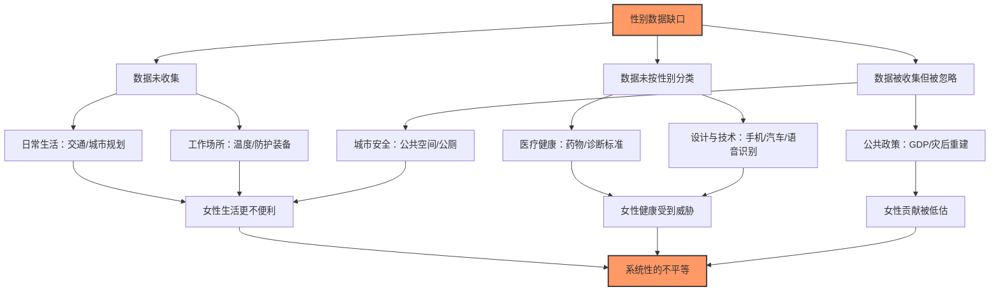

# 《看不见的女性》深度读书笔记

> [!abstract] 全书速览
> 这是一部揭示世界如何系统性地忽略女性数据的调查之作。卡罗琳·克里亚多·佩雷斯的核心论点可以用一句话概括：==从城市规划到医学研究，从手机尺寸到防弹背心，几乎所有"默认设计"都以男性身体和男性行为模式为标准，而女性的数据要么缺失、要么被忽略。==这不是某个人的恶意，而是一种深嵌在制度和习惯中的系统性疏忽——佩雷斯称之为"性别数据缺口"（gender data gap）。她横跨日常生活、工作场所、产品设计、医疗健康、公共政策和城市安全六大领域，用数百个案例和大量实证数据展示了同一个模式：当"人类"这个词出现时，设计者、研究者和决策者脑中浮现的默认形象是男性。这种默认不仅让女性的生活更不便利、工作更不安全，在某些情况下甚至直接威胁女性的生命——比如基于男性身体设计的汽车碰撞测试假人，让女性在车祸中受重伤的概率高出47%。这本书出版于2019年，在全球范围内引发了关于数据公平和性别盲点的广泛讨论。

## 核心议题

佩雷斯追问的核心问题是：==当我们说"以人为本的设计"时，这个"人"到底是谁？==

这个问题之所以重要，是因为绝大多数人从未意识到"默认"本身就是一种选择。当一个工程师设计一部手机时，他选择了某个"标准手掌尺寸"；当一个城市规划师设计交通路线时，他选择了某种"典型出行模式"；当一个医学研究者设计临床试验时，他选择了某类"标准受试者"。在所有这些选择中，"标准"几乎总是意味着"男性"——男性的身体尺寸、男性的行为模式、男性的生理特征。问题在于，做出这些选择的人往往并不觉得自己在做选择——他们以为自己选择的是"普遍的人类"，而不只是人类的一半。

卡罗琳·克里亚多·佩雷斯是一位英国记者和社会活动家，她因推动英格兰银行将简·奥斯汀印上英镑纸币而广为人知。《看不见的女性》（Invisible Women: Data Bias in a World Designed for Men）出版于2019年，获得了英国皇家学会科学图书奖。佩雷斯不是学院派的性别研究者，她的研究路径更接近调查记者——大量收集证据、横向比对不同领域、用案例的密度和广度来建立论证的说服力。她的核心概念"性别数据缺口"指的不是某一个领域的偶然疏忽，而是一个贯穿几乎所有领域的系统性模式：==女性的数据没有被收集、没有被分析、没有被纳入决策，结果是整个世界的设计默认服务于男性。==

> [!note] "默认男性"的运作机制
> 佩雷斯指出，性别数据缺口的根源不是恶意歧视，而是一种更为隐蔽的东西——==把男性经验等同于人类经验的无意识习惯==。当医学教科书说"心脏病的典型症状是胸痛和左臂放射痛"时，它描述的是男性心脏病的典型症状，但它没有说"男性的"——它说的是"典型的"。当女性出现不同的症状（恶心、疲劳、消化不良）时，她们就可能被误诊，因为她们的症状不符合"典型"——也就是男性——的标准。这种把特殊当普遍的操作，正是数据缺口产生的认知根源。

## 理论框架

佩雷斯的分析框架建立在一个核心概念和三个递进的论证层次之上：

**核心概念：性别数据缺口。** 这个概念指的是，在数据的收集、分析和应用的每一个环节中，女性的数据都可能被系统性地遗漏或忽视。缺口存在于三个层面：第一，数据根本没有被收集——比如全球大多数国家不统计无偿家务劳动的时间和经济价值；第二，数据被收集了但没有按性别分类——比如很多医学研究把男女数据混在一起分析，掩盖了性别差异；第三，数据被收集和分类了，但在实际决策中被忽略——比如即使知道女性的出行模式不同于男性，交通规划仍然优先服务通勤而非链式出行。

**第一层论证：数据缺口不是偶然的疏忽，而是系统性的模式。** 佩雷斯通过横跨六大领域的案例展示，同样的"默认男性"模式反复出现在完全不同的场景中。这种跨领域的一致性说明，问题的根源不在于某个行业或某个人的疏忽，而在于一种深层的认知偏见：==把男性身体和男性经验当作"人类"的代表。==

**第二层论证：数据缺口造成的后果不是抽象的不公平，而是具体的伤害。** 佩雷斯不满足于指出"这不公平"，她用数据展示了缺口造成的实际后果——女性在车祸中更容易受重伤，女性心脏病被误诊的概率更高，女性在使用不合身的防护装备时面临更大的职业风险。==数据缺口不是一个理论问题，它是一个关系到生命安全的现实问题。==

> [!tip] 核心洞察
> ==性别数据缺口之所以难以察觉，恰恰因为它是一种"不存在"——不存在的数据、不存在的问题、不存在的受试者。== 你很难反对一个你看不见的东西。当一个设计"为所有人"服务时，你需要具备相当的分析意识才能追问：这个"所有人"的标准是谁？佩雷斯的贡献在于把这种"不存在"变成了"看得见"的——她用几百个具体的案例让你无法再假装这个问题不存在。

**第三层论证：填补数据缺口是可行的，而且往往成本不高。** 佩雷斯并不认为这是一个无解的困境。她举了多个案例说明，当决策者有意识地纳入女性数据时，设计和政策可以显著改善——比如瑞典卡尔斯科加市改变除雪顺序（先清人行道再清车道）后，因滑倒受伤的人数大幅减少，医疗费用的节省远超除雪成本的增加。

## 论证深度解读

### 一、日常生活中的隐形偏见：谁的出行才算"出行"

佩雷斯对城市交通规划的分析是全书最具说服力的段落之一，因为它揭示了一个几乎所有人都习以为常却从未质疑过的假设：=="出行"的默认模式是从家到单位的单程通勤。==

大多数城市的交通规划都围绕这个假设展开：高峰时段加密地铁和公交班次，连接居住区和商业区的快速干道优先建设，交通数据的采集以工作日通勤为主要样本。这看上去是中性的、服务所有人的设计。但佩雷斯指出，这种"直线式通勤"主要反映的是全职工作者——尤其是男性——的出行模式。

> [!example] 链式出行 vs 直线式通勤
> 承担照护责任的人——全球范围内主要是女性——的出行模式完全不同。一个典型的场景是：早上先送孩子去学校，然后去超市买菜，再去上班，中午可能要去接生病的老人看医生，下班后再接孩子。这种"链式出行"（trip-chaining）不是从A到B的直线，而是A→B→C→D→E的多点路线。它更依赖公交而非地铁（因为公交站点更密集、更灵活），更依赖步行和非高峰时段的交通服务。当交通规划把资源集中在高峰通勤上时，链式出行者的需求就被系统性地忽略了。

佩雷斯用了一个精彩的案例来说明这种偏见的实际后果：瑞典卡尔斯科加市的除雪政策。长期以来，这座城市的除雪顺序是先清扫主要车道，再清扫次要道路，最后才轮到人行道和自行车道。这看起来完全合理——车道承载的交通流量最大。但当研究者按性别分析交通数据后发现，==男性更多驾车出行，女性更多步行和使用公共交通。先清扫车道的政策实质上是优先服务男性的出行方式。==更关键的是，在冬季因路面湿滑而受伤的人中，女性——尤其是推婴儿车和搀扶老人的女性——远多于男性。当卡尔斯科加市改变了除雪顺序（先清人行道和公交站点，再清车道）后，受伤人数大幅下降，节省的医疗费用远超除雪成本的增加。

> [!tip] 核心洞察
> ==一个看起来"性别中立"的政策，可能在效果上极不中立。== 除雪顺序从来没有被标记为"性别政策"，它被归类为"基础设施维护"。但当你追问"谁在使用哪种基础设施"时，性别维度就浮现了。佩雷斯的论点不是说决策者有意歧视女性，而是说他们根本没有想到需要按性别来分析数据——在他们的认知框架中，"出行"就是"通勤"，"通勤"就是"开车上班"。

公共厕所是另一个看似琐碎却深刻的例子。大多数公共建筑给男女厕所分配相同的面积。这看起来公平——一样大，一视同仁。但佩雷斯指出，"相同面积"并不意味着"公平使用"。女性平均如厕时间是男性的2.3倍（需要进入隔间、处理更多衣物、可能需要处理生理期用品），而且女性更可能带着需要帮助的孩子或老人。==相同的面积，在使用效率完全不对等的情况下，产生的是不平等的结果：女厕门前排长队，男厕空无一人。==

### 二、工作场所的身体政治：当"标准"身体不是你的身体

佩雷斯对工作场所的分析揭示了一个令人不安的事实：==很多女性每天都在使用按照别人的身体设计的工具工作。==

她从办公室温度讲起。大多数办公楼的空调温度标准是基于1960年代的一项研究设定的，那项研究的样本是——一个40岁、体重70公斤的男性的静息代谢率。女性的平均代谢率低于男性，对温度更敏感。研究显示，办公室的"标准"温度对女性系统性地偏冷约5摄氏度。这不只是舒适度问题：有研究表明，温度不适会影响认知表现，偏冷的环境会降低女性的工作效率。

> [!warning] 从不舒适到危险
> 温度偏冷只是不舒服。但在某些职业中，"按男性身体设计"的后果远比不舒服严重。佩雷斯详细记录了女性警察、消防员和军人面临的装备问题：防弹背心是按男性胸部轮廓设计的，女性穿上后胸部挤压、活动受限，在需要迅速拔枪的情况下反应时间更慢。==一件本应保护你的装备，因为不是按你的身体设计的，反而成了一种额外的风险。==消防员的手套太大、靴子太宽、呼吸面罩不贴合——每一件装备的不合身都意味着在紧急情况下多一分危险。

佩雷斯指出，这不是因为生产商不愿意为女性生产装备——在很多情况下，问题更根本：==采购标准本身就没有考虑性别差异。== 军队和警察部门的装备采购规格是统一的，"统一"意味着"基于男性身体的标准尺码"。女性可以申请"小号"装备，但"小号"只是按比例缩小的男性装备——它不是按女性身体的实际形态重新设计的。一个按比例缩小的男性防弹衣，仍然不适合女性的身体。

无偿劳动的数据缺口是工作场所分析的另一个重要维度。全球女性承担了约75%的无偿照护劳动——照顾孩子、老人、病人，做饭、打扫、洗衣。这些劳动不被计入GDP，不被纳入经济统计，不被视为"工作"。佩雷斯引用了经济学家的估算：==如果把全球女性的无偿劳动按市场价格折算，其价值相当于每年10万亿美元——大约是全球GDP的13%。== 但在现行的统计体系中，这些劳动是"不可见的"。一个全职照顾三个孩子和一个老人的女性，在经济数据中被归类为"不工作"。

> [!note] 数据缺口的经济学后果
> 无偿劳动的隐形化不仅是统计上的疏忽，它直接影响了政策制定。如果一个国家的经济决策者只看GDP增长，他们看不到无偿照护劳动对经济运转的支撑作用。当政府削减公共服务（关闭托儿所、减少养老补贴）时，这些负担会转移到家庭中——而在家庭中，承担者主要是女性。==削减的是公共预算，增加的是女性的无偿劳动时间。== 但因为后者不在数据中，决策者可以声称自己只是在"节约开支"。

### 三、设计与技术的性别盲区：当产品只为一半的人类而造

佩雷斯对产品设计和技术领域的分析直接触及了"以用户为中心的设计"这一理念的盲区：==如果你的"用户"模型默认是男性，那么"以用户为中心"的设计就是以男性为中心的设计。==

智能手机是一个典型例子。近年来智能手机屏幕越做越大，从4英寸到5英寸、5.5英寸、6英寸甚至更大。这个趋势背后的假设是：更大的屏幕意味着更好的使用体验。但"更好"是对谁而言？男性的平均手掌比女性大约大一英寸。一部5.5英寸的手机，男性可以单手握持和操作，女性则需要两只手或者频繁调整握持姿势。当女性还需要一只手推婴儿车、拎购物袋或者扶着公交扶手时，一部需要双手操作的手机就不只是不方便——它实际上在很多场景中不可用。

> [!example] 语音识别的性别偏差
> 语音识别系统是另一个典型案例。佩雷斯引用了多项研究显示，主流语音识别系统对男性声音的识别准确率显著高于女性声音。原因不难理解：==训练语音识别AI的数据集中，男性声音样本远多于女性声音样本。== 算法从数据中学习"什么是正常的人类语音"，而这些数据中的"人类语音"更多是男性的声音。结果是，一项本应方便所有人的技术，对一半的使用者效果更差。

汽车安全是佩雷斯论证中最触目惊心的案例。汽车碰撞测试使用的标准假人——用来模拟人体在碰撞中的受力情况——长期以来只有一种：基于一个身高177厘米、体重76公斤的男性身体的假人。直到2011年，美国才在碰撞测试中引入了"女性"假人——但这个所谓的"女性"假人只是标准男性假人的缩小版，身高149厘米、体重48公斤，它不反映女性的实际体型分布（比如不同的颈部肌肉力量、不同的骨密度、不同的脂肪分布）。

==结果是：女性在同等严重的车祸中，受严重伤害的概率比男性高47%，死亡概率高17%。== 安全带的设计基于男性躯干比例，对女性胸部和腹部的保护效果更差；安全气囊的弹出力度和角度针对的是坐在"标准"位置的"标准"身体——而女性因为身高较矮，通常需要把座椅调得更靠前，这意味着她们距离安全气囊更近，气囊弹出时的冲击力更大。

> [!warning] 注意
> ==佩雷斯不是说汽车制造商故意设计出对女性更危险的汽车。她的论点更为结构性——整个碰撞安全测试的体系，从假人的设计到测试标准的制定，都建立在"驾驶员是一个标准男性"的假设之上。== 当这个假设从未被质疑时，系统就会持续产出对女性更不安全的汽车。这不是恶意，是盲区——但盲区造成的后果和恶意一样致命。

### 四、医疗健康的性别鸿沟：当你的症状不算"典型"

医疗领域的性别数据缺口可能是所有领域中后果最严重的，因为它直接关系到生死。

佩雷斯详细记录了心脏病诊断中的性别偏差。心脏病是全球女性的头号杀手，但多数人——包括很多医生——仍然认为心脏病是"男性疾病"。这种误解不是空穴来风：医学教科书中描述的心脏病"典型症状"——剧烈胸痛、左臂放射痛、大汗淋漓——确实是男性心脏病的典型表现。==但女性心脏病发作时的症状往往不同：恶心、呼吸急促、极度疲劳、上腹部不适、下颌疼痛。这些症状不符合教科书上的"典型"描述，因此更容易被忽视、被误判为焦虑或消化问题。==

> [!tip] 核心洞察
> 佩雷斯引用的数据显示，==女性心脏病被误诊的概率比男性高约50%。== 这个数字背后是真实的生命：被误诊意味着错过了最佳治疗窗口，而心脏病的治疗时效性极强——每延误一小时，存活率都在下降。一个本来可以被及时发现和治疗的心脏病，因为患者是女性、症状不"典型"，就被当成了别的问题处理。

药物研究是另一个重灾区。佩雷斯追溯了一段惊人的历史：美国FDA直到1993年才要求临床试验纳入女性受试者。在此之前，制药公司长期以"保护育龄女性"和"避免月经周期干扰数据"为由，将女性排除在药物试验之外。结果是几十年间上市的药物，其安全性和有效性数据几乎完全基于男性身体。

==但女性和男性代谢药物的方式不同——女性的体脂比例更高（影响脂溶性药物的分布）、肝酶活性不同（影响药物代谢速度）、激素水平波动（影响药物与受体的结合）。== 同样剂量的同一种药物，在男性和女性体内可能产生完全不同的效果。佩雷斯举了安眠药唑吡坦（Ambien）的例子：这种药物上市多年后才发现，女性代谢它的速度比男性慢得多，导致女性在第二天早上仍有药物残留，影响驾驶能力。FDA在2013年将女性的推荐剂量减半——但这距离药物上市已经过去了二十年。

> [!note] "月经周期干扰数据"的悖论
> 佩雷斯指出了排除女性受试者的理由中的深层悖论：研究者说月经周期带来的激素波动会"干扰"数据——使数据更复杂、更难分析。==但如果一种药物对激素波动敏感，那恰恰说明它在女性体内的表现可能不同于男性——这不是"干扰"，这正是你需要研究的问题。== 把复杂性排除出去，得到的不是更好的数据，而是一个关于世界一半人口不完整的、可能误导的数据集。

### 五、公共政策的盲区：不被计算的贡献

佩雷斯对公共政策领域的分析集中在一个核心问题上：==当政策制定依据的数据本身就存在性别缺口时，政策的结果必然不利于女性。==

GDP是她分析的重点对象。GDP衡量的是"有市场价格的经济活动"——你在工厂里工作，工厂付你工资，这笔工资计入GDP；你在家里做饭、洗衣、照顾孩子、照看老人，没有人付你工资，这些劳动不计入GDP。佩雷斯指出，这种计算方式系统性地低估了女性的经济贡献。如果一个男人娶了他的保姆，GDP会下降——因为同样的劳动从"有偿"变成了"无偿"。这个荒谬的假设性场景恰好揭示了GDP作为经济衡量指标的根本缺陷。

灾后重建和人道主义援助是另一个佩雷斯深入分析的领域。她记录了多个自然灾害和冲突后重建项目忽视女性需求的案例。==援助物资的发放往往以"家庭"为单位，通过"户主"——通常是男性——来分配。== 当家庭关系因灾难而破裂时（丈夫死亡、家庭分离），女性可能无法独立获取援助。灾后临时安置点的设计很少考虑女性的安全和隐私需求——没有隔开的卫生设施、没有充足的照明、没有安全的行走路线。佩雷斯引用的报告显示，在很多灾后安置点中，女性遭受性暴力的风险急剧上升。

> [!example] 税收政策的性别盲点
> 佩雷斯还分析了税收政策中的隐性性别偏见。很多国家的税制以"家庭"为征税单位，采用累进税率。这意味着在一个家庭中，收入较低的第二收入者（通常是女性）的边际税率实际上被推高了——因为她的收入被叠加到了第一收入者（通常是男性）的较高税率区间上。==这种税制在效果上惩罚了家庭中收入较低的成员去工作。== 如果你已经承担了大量的无偿家务劳动，而你外出工作赚的钱又有很大一部分被高边际税率吃掉，你可能就会"选择"留在家中——但这个"选择"是税制设计的结果，而不是自由意志的体现。

### 六、城市安全与公共空间：谁感到安全，谁不安全

佩雷斯对城市安全的分析延伸了她关于公共空间设计的讨论。她指出，==女性对公共空间的使用方式和安全感受与男性有系统性的差异，而这些差异很少被纳入城市规划的考量。==

调查数据显示，女性在使用公共交通、经过照明不良的街道和公园时，感到不安全的比例远高于男性。这种不安全感不是"过度敏感"——它有统计依据：女性在公共空间遭受性骚扰和性暴力的概率显著高于男性。佩雷斯引用了多个城市的调查数据，在某些城市中，超过80%的女性报告曾在公共交通上遭受过骚扰。

==但大多数城市的安全策略集中在"暴力犯罪"上——抢劫、斗殴、枪击——这些犯罪的受害者以男性为主。== 性骚扰在很多国家甚至不被统计为犯罪，或者即使被统计，其严重性也被低估。当城市安全预算主要用于应对男性更可能遭遇的暴力犯罪时，女性面临的安全威胁就被边缘化了。

佩雷斯还指出了城市规划中一些看似微小但影响深远的设计选择：公园中是否有照明充足的步行道？地下通道是否有足够的可见性？公交站点是否有透明的候车亭（让等待者被看见）？停车场是否有足够的灯光？这些设计选择直接影响女性是否愿意和能够使用公共空间。

## 学术争鸣

《看不见的女性》在出版后引发了广泛的讨论，收获了高度赞誉，也面临了一些严肃的质疑。

**支持者**认为，佩雷斯最大的贡献在于她的"举证方式"——不是停留在抽象的理论论述上，而是用几百个跨领域的具体案例构建了一幅压倒性的证据图景。当你看到同样的"默认男性"模式反复出现在交通规划、医学研究、产品设计、公共政策、灾后重建等完全不同的领域时，你很难再把它归结为个别领域的偶然疏忽。这种"案例密度"策略在说服非专业读者方面极为有效——它让"性别数据缺口"这个概念从学术术语变成了可感知的现实。

**批评者**提出了几类质疑：

1. **因果关系的简化。** 部分案例中，佩雷斯倾向于把复杂的多因素问题简化为单一的"性别数据缺口"解释。比如，女性在车祸中受伤概率更高，除了碰撞测试假人的设计之外，还涉及座椅设计、安全带工程、车辆类型偏好、驾驶行为差异等多重因素。把这些问题都归结为"数据缺口"可能过度简化了真实的因果链条。

2. **西方中心主义。** 佩雷斯的案例和数据主要来自欧美发达国家。发展中国家的状况可能更复杂——在很多国家，问题不仅是"数据中缺少女性"，而是基础数据收集体系本身就不完善，男性的数据也同样匮乏。

3. **相关性与因果性。** 有评论者指出，佩雷斯在某些案例中没有充分区分相关性和因果性。比如，办公室温度标准基于男性代谢率设定，这是事实；但"因此女性工作效率更低"这个推论，需要更严格的因果证据。

4. **实施成本的低估。** 佩雷斯在呼吁"填补数据缺口"时，有时对实施成本估计不足。重新设计碰撞测试体系、改造公共交通路线、修改药物试验标准——这些都涉及巨大的成本和复杂的制度变革，不是"只要有意识就能解决"的问题。

> [!note] 一个公允的评价
> 佩雷斯自己在书中也承认，她的目的不是进行穷尽性的学术论证，而是==让尽可能多的人看到一个此前"不可见"的系统性问题==。从这个目标来看，这本书是成功的——它把"性别数据缺口"从一个学术概念变成了公共议题，引发了交通、医疗、科技等多个领域的实际政策讨论。它最好被当作一个起点而非终点——它打开了一个重要的问题，而对这个问题的深入研究和具体解决方案，需要更多的后续工作。

## 方法论反思

佩雷斯的研究方法可以称为"跨领域证据聚合"——她不在某一个领域内做深度的原创研究，而是横跨交通、医疗、科技、经济、城市规划等多个领域，收集已有研究中的性别相关发现，然后把它们组织在"性别数据缺口"这个统一框架下。

这种方法的**优势**在于它的综合性和可读性。正因为佩雷斯不是某一个领域的专家，她才能够以一种跨界的视角发现各领域之间的共同模式——一个交通研究者可能知道链式出行的问题，一个医学研究者可能知道药物试验的性别偏差，但只有跨领域的观察者才能看到它们背后的同一个结构性问题。此外，她的调查记者式写作使这本书面向大众读者，而非学术小圈子——这对于推动公共议程的改变至关重要。

**局限**也不可忽视。佩雷斯本人不是任何一个领域的学术专家，她对具体案例的呈现有时缺乏该领域专家所能提供的深度和精确性。她倾向于选择最能支持论点的证据，而对同一领域内可能削弱论点的反面证据着墨较少。此外，她的分析主要是描述性的——她展示了数据缺口的存在和后果，但对于数据缺口产生的更深层的政治经济学原因（权力结构、利益分配、制度惯性），分析不够深入。

> [!warning] 阅读提醒
> 阅读《看不见的女性》时需要保持一种平衡：既要认真对待佩雷斯揭示的系统性问题——性别数据缺口确实广泛存在，确实造成实际伤害——同时也要意识到她的论证策略：==大量案例的堆叠有时会给人一种"一切问题都是数据缺口导致的"印象，而现实中很多问题是多因素的。== 这本书最好被当作一面棱镜——它帮助你看到此前看不到的一个维度，但这个维度不是唯一的维度。

## 现实映射

佩雷斯揭示的问题在你的日常生活中无处不在——只是你可能从未从这个角度注意过。

下次你拿起手机时，留意一下你是否需要调整握持姿势才能够到屏幕上方的图标。下次你走进一个公共建筑时，看看男女厕所的排队情况是否对等。下次你在冬天走在结冰的人行道上时，想想除雪的优先级是如何安排的。这些不是宏大的政策问题——它们是每天都在发生的、被设计嵌入你生活的微小不便或风险。

佩雷斯的分析框架在更宏观的层面同样有启发性。当你看到一个新的AI产品、一项新的公共政策或一个新的城市规划方案时，你可以追问一个简单但强有力的问题：==这个方案的"默认用户"是谁？它的设计数据来自谁？它是否考虑了不同群体的不同需求？== 这种追问不仅适用于性别维度——年龄、种族、残障状况、经济水平——所有这些维度都可能存在类似的"数据缺口"。佩雷斯教你的不只是关注性别不平等，而是一种更一般性的思维方式：==警惕"默认"，追问"对谁而言"。==

在AI和大数据时代，这种警惕尤为重要。机器学习算法从历史数据中学习——如果历史数据中就存在性别缺口，算法会把这个缺口"学"进去，然后在自动化决策中大规模复制。招聘算法如果基于历史上以男性为主的员工数据训练，就会系统性地低估女性候选人；医疗AI如果基于以男性为主的临床数据训练，就会在女性身上表现更差。==数据缺口不会因为技术进步而自动消失——如果你不主动纠正它，技术只会以更高的效率和更大的规模复制它。==

## 延伸阅读

如果《看不见的女性》引发了你对数据公平和系统性偏见的兴趣，以下几本书可以进一步深入：

- [[《第二性》]]（西蒙娜·德·波伏瓦）：20世纪最重要的女性主义著作之一。波伏瓦提出"女人不是天生的，而是后天变成的"，对"何为女性"这一问题的哲学追问，是佩雷斯所揭示的数据缺口的思想根源。

- [[《算法霸权》]]（凯西·奥尼尔）：一位数学家揭示大数据和算法如何系统性地加剧不平等。如果佩雷斯展示的是"过去的数据缺口"，奥尼尔展示的是"未来的数据缺口"——当有偏的数据被喂入算法后会发生什么。

- [[《照护宣言》]]（The Care Manifesto，凯尔集体）：从政治理论的角度重新思考照护劳动在社会中的位置，回应了佩雷斯关于无偿劳动被低估的论证。

- [[《被压迫者教育学》]]（保罗·弗莱雷）：虽然关注的是阶级而非性别，但弗莱雷关于"被压迫者如何内化压迫者的视角"的分析，与佩雷斯所揭示的"女性也可能无意识地接受默认男性视角"形成了深刻的呼应。

- [[《技术与性别》]]（朱迪·瓦吉曼）：从科技社会学的角度深入分析技术设计中的性别政治，为佩雷斯的案例提供了更坚实的理论基础。
