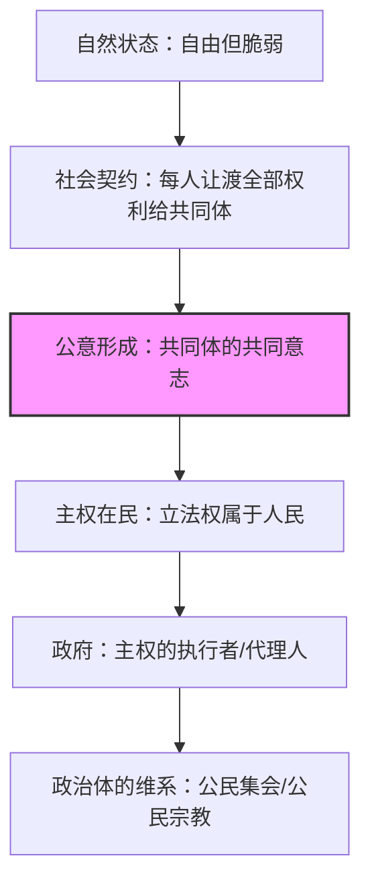

# 《社会契约论》深度读书笔记

> [!abstract] 全书速览
> 1762年，卢梭写下了一句后来震动整个欧洲的话："人生而自由，却无往不在枷锁之中。"这本篇幅不长却野心极大的著作，试图回答政治哲学中最根本的问题：人为什么要服从政治权威？什么样的政治权威才是正当的？卢梭的回答是：一切合法的政治权威都只能来源于人民之间的自愿契约。人民通过契约结合为一个共同体，每个人把自己的全部权利交给这个共同体，由此形成一个以"公意"为最高准则的政治体。主权属于人民，不可转让，不可分割，不可代表。政府不是主人，只是仆人——它执行公意，而非统治人民。这套理论在当时是对君权神授和贵族特权的正面挑战，它直接影响了法国大革命、美国独立宣言，乃至此后两百多年间关于民主、自由和平等的所有重大争论。然而，卢梭的思想也包含深刻的内在张力：他许诺自由，却提出了"强迫自由"的悖论；他捍卫人民主权，却对代议制民主深感不信任。这本书既是现代民主思想的源头之一，也是理解其困境的一把钥匙。

## 核心议题

卢梭在这本书里追问的核心问题是：==既然人天然是自由的，那么政治社会中的服从如何才能是正当的？换句话说，有没有一种政治秩序，能让人在服从它的同时依然保持自由？==

这个问题在18世纪的欧洲有着非同寻常的分量。当时的欧洲正处于旧制度（Ancien Regime）的晚期——君主以神的名义统治，贵族以血统的名义享有特权，教会以来世的名义要求服从。启蒙运动已经从根本上动摇了这些权威的合法性基础：如果理性是判断一切的标准，那么国王的权力凭什么来自上帝？贵族的特权凭什么来自祖先？在卢梭之前，霍布斯和洛克已经分别给出了各自的回答——霍布斯说人在自然状态下处于"一切人对一切人的战争"，因此需要一个绝对主权者来维持秩序；洛克说人在自然状态下拥有天赋权利（生命、自由、财产），人们通过契约建立政府来保护这些权利。卢梭觉得这两个回答都不够。霍布斯的回答用恐惧来为专制辩护，洛克的回答把政治秩序建立在私有财产的基础上。卢梭要找的是一种更深层的正当性——一种让服从本身成为自由之表达的政治安排。

让-雅克·卢梭（1712-1778）出生于日内瓦的一个钟表匠家庭，母亲在他出生时去世，父亲在他十岁时抛弃了他。他没有接受过系统的学院教育，一生颠沛流离，做过仆人、抄谱员、家庭教师。他与当时的法国知识界——百科全书派、伏尔泰、狄德罗——有过密切的交往，也有过激烈的决裂。他的个人生活充满争议：他把自己的五个孩子全部送进了孤儿院，这在当时和后世都招致了严厉的道德批评。但他的思想深刻地改变了人类对政治、教育和人性的理解。《社会契约论》出版后立即被日内瓦和巴黎当局焚毁，卢梭被迫流亡——然而三十年后，法国大革命的领导者们几乎把这本书当作圣经来读。

在政治思想的谱系中，卢梭的位置极为独特。他既不是纯粹的自由主义者（他对个人权利的保护远不如洛克那样强调），也不是保守主义者（他从根本上否定了传统权威的合法性），更不是后来意义上的社会主义者（尽管马克思对他有所借鉴）。==他是一个真正的原创思想家——他提出的"公意"概念至今仍是政治哲学中最具争议也最具生命力的概念之一。== 从法国大革命到美国宪法，从马克思到罗尔斯，从共和主义到参与式民主，《社会契约论》的影响无处不在。而它引发的争论——公意是否可能导致多数暴政？人民主权是否可以通过代表来行使？自由和平等之间是否存在根本冲突？——至今仍是政治理论的核心议题。

## 理论框架

卢梭的理论框架由四个层次构成，对应全书四卷的逻辑递进。

第一层是对自然状态和社会起源的分析。卢梭认为人在自然状态下是孤独、自足、善良的——这和霍布斯的判断截然相反。自然人没有道德概念，但也没有邪恶的欲望；他有自爱心（amour de soi），即维护自身生存的本能，也有怜悯心（pitie），即对同类痛苦的天然同情。==社会不是自然的产物，而是人为的建构。== 人之所以从自然状态走入社会状态，不是因为自然状态不好，而是因为外在环境的变化（人口增长、资源竞争）使得孤立生存不再可能。问题在于，进入社会之后，人失去了天然的自由，却往往没有获得任何正当的补偿——他只是变成了强者的奴隶。社会契约要解决的就是这个问题：如何让人在进入社会的同时保持自由？

第二层是社会契约的核心机制。卢梭提出的解决方案是：每个人把自己的一切权利无保留地转让给整个共同体。这听起来像是彻底的自我牺牲，但卢梭的逻辑是：既然每个人都把一切交给了所有人，那就等于没有人把自己交给了任何特定的人。你不是把自由交给了国王或贵族，而是交给了你自己也是其一部分的共同体。通过这个契约，所有个体结合为一个"公共人格"——卢梭称之为"共和国"或"政治体"。这个政治体的意志就是"公意"（volonte generale），它追求的是全体成员的共同利益。

第三层是公意与主权的理论。公意是卢梭整个政治理论的枢纽。==公意不是"众意"（volonte de tous）——众意是所有个人意志的简单加总，公意是扣除了个人意志中相互抵消的私利部分之后剩下的共同意志。== 打个比方：如果一百个人各自追求自己的私利，他们的诉求会相互矛盾、彼此抵消；但在所有这些私利之下，存在着一些共同的利益（安全、公共秩序、基本公平），公意指向的正是这些共同利益。主权是公意的行使，它属于人民全体，不可转让（因为意志不能被代表）、不可分割（因为主权一旦分割就不再是主权）。立法权必须由人民直接行使——法律是公意的表达，而公意只有在人民亲自参与的情况下才能真正形成。

第四层是政府理论和政治体的维系。卢梭严格区分了主权者（人民全体）和政府（执行公意的机构）。政府不是主权者，而是主权者的代理人——它不拥有任何自己的权力，它的一切权力都来自人民的委托。卢梭分析了三种基本的政府形式：民主制（全体人民直接治理）、贵族制（少数人治理）和君主制（一个人治理）。他认为纯粹的民主制对人类来说太完美了，难以实现；选举产生的贵族制在大多数情况下是最好的选择；君主制效率最高但最容易腐败。最后，卢梭讨论了维系政治体的各种机制——公民集会、投票制度、保民官制度，以及一个极具争议的概念：公民宗教。

> [!note] 全书的逻辑枢纽
> 理解卢梭的关键在于抓住"公意"这个概念。公意不是多数人的意见，不是投票的结果，甚至不是任何具体的决策——它是共同体追求共同善的意志。卢梭的全部政治理论都建立在这个概念上：社会契约创造了公意的可能性，主权是公意的行使，法律是公意的表达，政府是公意的执行者。==如果你觉得"公意"这个概念模糊甚至神秘，你是对的——这正是卢梭思想中最强大也最危险的部分。==

## 论证深度解读

### 一、从自然状态到社会契约：自由如何成为问题

卢梭全书的起点是一句宣言式的判断："人生而自由，却无往不在枷锁之中。"这句话不是在描述一个事实，而是在提出一个问题：如果人天然是自由的，那么现存的政治服从是怎么来的？它是正当的吗？

为了回答这个问题，卢梭首先排除了几种看似合理但实际上站不住脚的解释。第一种是家庭模型——有人说政治权威就像父亲对子女的权威，是自然的。卢梭说不对。父亲对幼年子女的权威确实是自然的，但它的正当性来源于子女无法自我保存的需要；一旦子女成年，这种权威就自动消失。把政治关系类比为亲子关系，实际上是在为暴政辩护——它暗示人民永远是"未成年"的。第二种是强力模型——有人说权力来自最强者的权利。卢梭的反驳极为精炼：强力不产生权利。一个强盗用枪指着你让你交出钱包，你服从了——这是被迫，不是义务。一旦你有能力反抗，你就没有理由不反抗。如果权力仅仅建立在强力之上，那么它就永远面临着被更大的强力推翻的命运。第三种是自愿为奴模型——格劳秀斯和霍布斯认为人可以自愿放弃自由，把自己交给一个主人以换取安全。卢梭说这是荒谬的："放弃自己的自由，就是放弃自己做人的资格。"一个人不能把自己卖为奴隶，因为这笔交易没有对价——你用自由换来了什么？如果说换来了生存保障，那么君主给人民带来的战争和苛税恰恰威胁着人民的生存。

> [!tip] 核心洞察
> 卢梭排除这些伪正当性的过程本身就有深刻的意义。==他告诉你，现存的政治秩序不是"自然"的，不是"不可避免"的，更不是"天经地义"的。== 它是人造的，因此它需要被审查——凭什么是这样？可以不是这样吗？这种"去自然化"的思维方式是启蒙精神的核心，也是一切政治批判的起点。

排除了这些伪正当性之后，卢梭提出了自己的方案：社会契约。契约的核心条款可以归结为一句话——"每个结合者及其自身的一切权利全部都转让给整个的集体。"这个表述乍看之下令人困惑甚至恐惧：把一切权利都交出去，这不是比霍布斯的方案还极端吗？卢梭的辩护逻辑是：第一，条件对所有人是一样的，因此没有人有理由要求特殊待遇；第二，每个人把自己交给所有人，就等于没有把自己交给任何人——你不是在面对一个高于你的主人，而是在融入一个你自己也是其一部分的共同体；第三，通过这个契约，你虽然失去了"天然的自由"（想做什么就做什么的自由），但你获得了"社会的自由"（受法律保护的自由）和"道德的自由"（服从自己为自己规定的法律）。==在卢梭看来，服从公意不是服从他人，而是服从自己——因为公意就是你作为共同体成员的真正意志。==

这里有一个在理论上精巧但在实践中危险的逻辑环节值得你特别警觉。卢梭区分了三种自由：自然自由是不受任何约束、想做什么就做什么的原始状态；社会自由是在法律框架内享有的、受到保护的行动空间；道德自由则是最高层次的自由——只有当你服从的是自己为自己制定的法律时，你才是真正自由的。这个三层递进的自由观非常动人，但它包含一个暗门——如果有人声称你反对公意只是因为你还停留在"自然自由"的层次上，还没有达到"道德自由"的境界，那么"强迫你自由"就变得顺理成章了。

> [!warning] 注意
> 这里隐藏着卢梭思想中最危险的逻辑。如果公意代表了每个人的"真正意志"，那么当一个人反对公意时，就可以说他不是在表达自己的真正意志，而是被私利蒙蔽了。由此推出一个令人不安的结论：可以"强迫他自由"——即强迫他服从公意，因为公意才是他"真正想要的"。这个逻辑在后来的历史中被反复援引——从法国大革命的恐怖统治到20世纪的极权主义，都有人以"人民的真正意志"之名行专制之实。

### 二、公意：卢梭最核心也最危险的概念

公意是理解整本《社会契约论》的钥匙，也是卢梭政治哲学中最精妙、最模糊、最具争议的概念。

卢梭对公意的定义是通过一系列否定来进行的。公意不等于"众意"——众意是所有人的个人意志的加总，公意是剔除了个人私利之后剩下的共同意志。如果一百个人各有各的私利诉求，把这些诉求简单加起来得到的是众意；但如果从每个人的诉求中去掉那些与他人对立的部分，剩下的那些所有人共享的诉求，就是公意。公意也不等于多数决——在某些情况下，多数人的意见可能只是被共同偏见驱动的"众意"，而非真正追求共同善的"公意"。公意更不等于任何个人或团体的意志——无论这个人多么英明，这个团体多么精英。

> [!note] "公意"与"众意"的区分
> 可以用一个思想实验来理解这个区分。假设一个城邦要决定是否修建一条道路。如果每个人只考虑"这条路经不经过我家门口"，把所有这些自利的考虑加总起来，得到的是众意。但如果每个人能够超越自己的私利，思考"这条路对整个城邦是否有益"，那么由此形成的共同判断就是公意。==卢梭的关键假设是：在每个人的意志中，确实存在着一个指向共同善的维度——公意不是外部强加的，而是从每个人的内心中提取出来的。==

卢梭认为公意具有几个重要特征。首先，公意永远是正确的——但这不意味着人民的审议永远是正确的。人民可能被欺骗、被误导、被党派操纵，从而做出不符合公意的决策。公意本身是对的，但人民并不总是能够认识到公意。这个区分至关重要：卢梭不是说多数人的决定永远正确，他是说存在一种超越个人私利的共同善——问题只在于人民能否准确地辨认出它。

其次，公意只关注共同利益，不关注个别利益。法律作为公意的表达，必须是普遍性的——它不能针对特定的个人或群体。一项只对某些人有利的决策不是法律，而是特权。这个"普遍性"的要求是卢梭思想中常被忽视的一个重要保障——它意味着公意不能被用来打击特定的个人或少数群体，因为真正的法律必须对所有人一视同仁。

第三，公意不能被代表。卢梭在这一点上态度非常强硬：主权者是人民全体，人民的意志不能被任何代表或代理人所取代。他特别批评了英国的代议制："英国人民自以为是自由的，他们是大错特错了。他们只有在选举国会议员的期间，才是自由的；议员一旦选出之后，他们就是奴隶，他们就等于零了。"

卢梭还引入了一个关键但常被忽视的条件：公意的形成需要特定的社会前提。他强调，如果公民内部形成了党派和小集团，那么每个小集团对其成员来说就形成了一种"局部公意"，而这种局部公意对于整个国家来说只是"个别意志"。小集团越多、越强大，真正的公意就越难以形成。卢梭由此得出一个令人惊讶的结论：为了让公意能够顺畅表达，国家中不应该有党派。如果不得不有党派，那就应该有尽量多的党派，让它们彼此制衡。这个判断对于理解现代政党政治的困境——利益集团对公共决策的绑架、党派对立导致的治理瘫痪——有着超越时代的洞察力。

> [!tip] 核心洞察
> ==公意概念的力量在于它指出了一个真实的问题：在任何政治共同体中，确实存在着超越个人私利的共同利益，而一个好的政治制度应该能够识别和追求这种共同利益。== 它的危险在于它假设这种共同利益可以被明确地识别出来，而且与之不一致的个人意志可以被"纠正"。历史一再证明，每当有人声称自己掌握了"人民的真正意志"或"历史的必然方向"时，暴政往往随之而来。

### 三、主权在民：不可转让、不可分割、不可代表

卢梭的主权理论是全书最具革命性的部分。在他之前，霍布斯把主权赋予了绝对君主，洛克把主权分散到了立法权、行政权和对外权之中。卢梭说：主权属于且只属于人民全体。

主权不可转让，因为意志不可转让。你可以把你的财产转让给别人，但你不能把你的意志转让给别人——因为一旦你的意志不再是你自己的，你就不再是你自己了。同理，人民可以委托政府来执行决策，但不能把决策权本身转让给政府。一旦人民放弃了自己的主权，他们就从公民变成了臣民，从自由人变成了奴隶。

主权不可分割，因为公意不可分割。卢梭批评了当时流行的"分权"理论——把主权分为立法权、行政权、司法权等等。他认为这种分割是对主权概念的误解：这些不同的"权力"实际上只是主权的不同运用方式，而不是主权本身的分割。就像一个人可以用眼睛看、用耳朵听、用手触摸，但你不能说这个人被"分割"成了眼睛、耳朵和手——它们都是同一个人的器官。卢梭承认在实际操作中需要不同的机构来执行不同的职能，但他坚持认为最终的主权——立法权——必须统一地掌握在人民手中。

> [!warning] 卢梭对代议制的批评
> 卢梭对代议制的攻击是他政治理论中最有争议的部分之一。他认为主权不能被代表，因为意志不能被代表——你可以委托别人替你做事，但你不能委托别人替你想。当你选出一个代表并授权他替你做决定时，你实际上放弃了自己的主权。==卢梭的这个判断触及了代议制民主的一个真实困境：你投票选出的代表，他的意志和你的意志之间到底是什么关系？== 如果他完全按照你的指示行事，他就不是代表而是传声筒；如果他按照自己的判断行事，那么在什么意义上他"代表"了你？这个问题在今天的民主理论中仍然没有一个令人满意的回答。

卢梭同时提出了一个关键的区分：主权者和政府。主权者是人民全体，它拥有立法权——即制定法律的权力。政府是主权者设立的机构，它拥有行政权——即执行法律的权力。政府不是一个独立的权力实体，而是主权者的"代理人"或"仆人"。主权者可以随时改变、限制或撤销政府的权力。这个区分在理论上非常清晰，但在实践中却充满困难——因为政府作为一个实际存在的机构，天然有扩张自身权力的倾向。卢梭对此有清醒的认识：他指出政府的"堕落"是政治体面临的最大威胁——政府会不断试图把自己从"主权者的代理人"变成"真正的主权者"，从"人民的仆人"变成"人民的主人"。

为了防止政府篡夺主权，卢梭提出了一个制度设计：定期的公民集会。在这些集会中，人民作为主权者需要回答两个问题——第一，主权者是否愿意保留现有的政府形式？第二，人民是否愿意让目前的执政者继续执政？这两个问题的设计非常巧妙：第一个问题针对制度本身，第二个问题针对执政的人。通过定期的、强制性的审查，人民可以持续地对政府保持控制。卢梭甚至认为，在公民集会召开期间，政府的一切权力应当自动中止——因为在主权者亲自出场的时刻，任何代理权都没有存在的必要。

### 四、立法者：超凡智者的角色与悖论

卢梭在论述公意和法律的关系时，引入了一个令人费解的角色——"立法者"（Legislateur）。这个人物几乎具有神话色彩，他为人民制定根本法律，但自己不参与统治。

卢梭为什么需要这样一个角色？原因在于他对人民能力的一个微妙判断：公意永远是正确的，但人民并不总是能够认识到什么对自己真正有益。用卢梭自己的话说，人民永远希望自己幸福，但人民并不永远能看清什么是幸福。公意的目标永远是好的，但指引公意的判断却不一定总是清明的。因此，需要一个拥有超凡智慧的立法者来帮助人民认识自己的真正利益。

卢梭对立法者的要求近乎苛刻：这个人必须能够洞察人类全部的情感但不受其中任何一种的影响，他必须了解人性但与人性无关，他的幸福不取决于他为之立法的人民。卢梭举了两个历史上的例子——斯巴达的莱库古和古以色列的摩西。莱库古在为斯巴达立法之前首先放弃了王位，以表明他不是在为自己制定规则。

> [!note] 立法者的悖论
> 这个角色包含一个深刻的悖论。立法者不是主权者——他没有制定法律的权力，他只能"提议"法律供人民表决。但一个足以为整个民族制定根本大法的"超人"，他的影响力真的能被限制在"提议"的范围内吗？更深层的悖论是：如果人民需要一个超凡的立法者来帮助他们认识自己的利益，那么"人民是自己命运的主人"这个前提还能成立吗？==立法者的存在暴露了卢梭理论中的一个根本困难——公意理论假设人民能够自主地做出指向共同善的判断，但立法者的引入又表明人民在没有外部帮助的情况下做不到这一点。==

### 五、政府形式：民主制、贵族制与君主制的比较

卢梭对政府形式的讨论远比人们通常以为的更加务实和审慎。他并不像革命宣传所暗示的那样简单地主张民主制——相反，他对纯粹的民主制持相当怀疑的态度。

卢梭对民主制的定义非常严格：民主制意味着全体人民不仅拥有立法权，还直接行使行政权。在这种制度下，人民既是主权者也是政府——他们既制定法律也执行法律。卢梭认为这种制度在理论上最完美，但在实践中几乎不可能实现。他给出了几个理由：第一，国家必须足够小，人民能够经常集会；第二，风俗必须足够淳朴，不会产生太多复杂的事务；第三，人民在地位和财富上必须高度平等。卢梭的判断是："如果有一种神明的人民，他们便可以用民主制来治理。但那样一种十全十美的政府是不适于人类的。"

贵族制分为三种：自然的贵族制（部落长老统治）、世袭的贵族制和选举的贵族制。卢梭认为选举的贵族制是最好的政府形式——不是因为"精英"天然比"群众"更高明，而是因为复杂的行政事务确实需要专门的才能和经验，而选举制度保证了这些管理者来自人民、对人民负责。关键在于：==贵族制只是政府的形式，不是主权的形式——立法权仍然属于人民全体，贵族制的政府只是在执行层面上由少数人来承担具体的管理工作。==

君主制的优势是决策效率——一个人做决定总比一群人做决定快。但卢梭对君主制的批评极为尖锐：君主制天然趋向专制，因为一个人的私利和公共利益之间的距离最大。民主制下，治理者和被治理者是同一批人，因此公共利益就是治理者自己的利益；君主制下，君主的个人利益和人民的利益经常是对立的——一个君主的利益在于人民软弱而他自己强大。卢梭还指出了政府的一个普遍规律：政府规模和政府效率之间存在反比关系——参与决策的人越多，效率越低；但参与决策的人越少，政府偏离公意的可能性就越大。

> [!note] 卢梭的政府理论与现实
> 卢梭的政府理论有一个常被忽视的洞察：==没有一种政府形式是普遍适用的。== 最好的政府形式取决于具体的条件——国家的大小、人口的密度、气候、经济状况、民族性格。小国适合民主制，中等国家适合贵族制，大国适合君主制。这种语境主义的立场比后来许多"一刀切"的政治方案要审慎得多。它提醒你，政治制度不是一道数学题——没有一个对所有国家所有时代都正确的"标准答案"。

### 六、公民宗教与投票制度：政治体的维系机制

卢梭在全书第四卷讨论了维系政治体运转的各种具体机制，其中最引人注目的是公民宗教和投票制度。

卢梭花了大量篇幅分析罗马共和国的政治制度，包括公民大会的组织方式、护民官的权力、独裁官制度和监察官制度。他对罗马制度的考察不是出于纯粹的历史兴趣，而是试图从中提取关于"大型共同体如何维持公民参与"的经验。罗马的公民大会分为百人团大会、部族大会和平民大会三种形式，每种形式代表着不同的利益权衡方式。卢梭对此的分析表明，他并非不关心制度的具体设计——恰恰相反，他认为好的制度设计是公意得以表达的重要条件。

关于投票制度，卢梭提出了一个值得深思的观点：公民在投票时，不是在表达自己的个人偏好，而是在判断某个提案是否符合公意。如果投票的结果和你的判断不一致，这并不意味着你的自由被侵犯了——它只意味着你对公意的判断是错误的。这个论述在逻辑上相当精巧：它把投票从一个"表达偏好"的行为转变成了一个"认知判断"的行为。但正是这种转变让卢梭得以论证"少数服从多数并不等于少数被压迫"——因为如果投票是一种认知行为，那么多数人判断正确的概率确实高于少数人。

卢梭对基督教的批评相当大胆。他区分了"人的宗教"和"公民的宗教"。纯粹的基督教——他称之为"人的宗教"——教导人蔑视尘世、追求来世，这使得信徒对政治冷漠，对侵略者逆来顺受。一群虔诚的基督徒组成的社会可能在道德上很纯洁，但在政治上会很脆弱——因为他们不在乎这个世界发生什么。而古代城邦的公民宗教——如罗马共和国的国教——把宗教热情和爱国主义结合在一起，能有效地激发公民为共和国奉献牺牲的精神。但它的缺点是建立在谎言和迷信之上，而且容易走向宗教排他和对外侵略。

卢梭的解决方案是提出一种新的公民宗教，其信条极其简洁：承认一个全能的、仁慈的神的存在；相信来世的存在；相信善有善报、恶有恶报；尊重社会契约和法律的神圣性；禁止不宽容。这些信条不是神学上的教义，而是社会性的情感——它们的功能不是揭示宗教真理，而是维系公民对共同体的忠诚。

> [!warning] 公民宗教的争议
> 公民宗教是《社会契约论》中最具争议的部分之一。卢梭说，那些不接受公民宗教信条的人可以被驱逐出国——不是因为他们"不虔诚"，而是因为他们"不合群"。更令人不安的是，他说如果一个人公开承认了这些信条但行为与之相悖，那么他应该被处死——因为"他犯了最大的罪：他在法律面前撒了谎"。==这段话暴露了卢梭思想中的一个深层矛盾：他一方面主张自由和宽容，另一方面又要求公民在信仰问题上服从共同体的要求。== 公民宗教的逻辑和"强迫自由"的逻辑是一致的——如果共同体的统一性是最高价值，那么一切威胁这种统一性的东西都可以被正当地压制。

### 七、社会契约的内在张力：自由与强制的悖论

读完全书，你会发现卢梭的论证中存在着一系列深刻的内在张力，这些张力不是论证的缺陷，而是他所面对的问题本身的复杂性的反映。

第一个张力是个人自由与公意之间的张力。卢梭承诺社会契约会让人"更加自由"，但他对公意的绝对优先地位的坚持，似乎为压制个人意志留下了空间。当你的个人判断和公意冲突时，卢梭告诉你：公意是对的，你错了——你以为你想要的，其实不是你"真正"想要的。这个逻辑在哲学上是自洽的（如果你接受"道德自由就是服从理性"这个前提），但在政治实践中却极其危险。谁有权认定哪个是你的"真正"意志、哪个是被私利蒙蔽的"虚假"意志？一旦有人或有机构获得了这种判定权，自由就名存实亡了。

第二个张力是直接民主与现实可行性之间的张力。卢梭的整个理论建立在人民直接参与立法的基础上，但他自己也承认这在大型国家中几乎不可能实现。他拒绝了代议制，却没有提供一个替代方案。这使得他的理论在面对现代民族国家时显得力不从心——你可以用它来批判代议制的不足，但你无法从中找到一个可行的替代模型。

第三个张力是平等理想与立法者角色之间的张力。卢梭强调所有公民的平等，但他同时引入了一个"立法者"（legislateur）的角色——一个超凡的智者，能够洞察人民的真正利益并为他们制定法律。卢梭明确指出立法者不是主权者的一部分，他只是"提议"法律而没有"制定"法律的权力。但一个足以为整个民族制定法律的"超人"，他的影响力真的能被限制在"提议"的范围内吗？==这个角色和公意理论的结合，为"英明领袖代表人民真正意志"的叙事提供了理论资源——而这恰恰是卢梭试图反对的专制逻辑。==

第四个张力是公意的普遍性与共同体的边界之间的张力。卢梭的公意预设了一个有明确边界的政治共同体——公意是"我们"的公意，而不是全人类的公意。但谁是"我们"？这个边界如何划定？卢梭没有回答这些问题。在他的理论框架中，不同共同体之间的关系近乎自然状态——没有超越民族国家的社会契约。这使得卢梭的理论在面对全球性问题（战争与和平、国际正义、全球治理）时几乎无能为力。

## 学术争鸣

《社会契约论》自出版以来，在思想史上引发了持续两百六十余年的激烈争论，几乎每一代政治哲学家都需要和卢梭对话。

在积极评价方面，康德深受卢梭影响，他的道德哲学中"自律"（autonomy）的概念——道德自由就是服从自己为自己制定的法则——与卢梭的"道德自由"一脉相承。罗尔斯在[[《正义论》]]中运用的"无知之幕"思想实验，也可以被视为卢梭"公意"概念的一个精致化版本：当人们在不知道自己社会地位的情况下选择社会规则时，他们的选择更可能指向共同善而非私利。共和主义传统的思想家——如汉娜·阿伦特、菲利普·佩蒂特——高度评价卢梭对"公民参与"和"公共自由"的强调，认为他指出了现代自由主义过于关注私人领域而忽视公共生活的问题。

批评则来自多个方向。自由主义阵营的批评最为持久和深入。本杰明·贡斯当在法国大革命之后明确区分了"古代人的自由"（参与公共事务的自由）和"现代人的自由"（免受政治权力干预的个人自由），认为卢梭混淆了这两者，试图用古代城邦的政治理想来规范现代社会，结果是以公共自由之名压制了个人自由。以赛亚·伯林更尖锐地把卢梭视为"积极自由"走向专制的典型案例：卢梭所谓的"强迫自由"正是"积极自由"逻辑的极端表现——当你告诉一个人"你的真正意志和你以为的意志不一样"时，你就打开了以自由之名行压迫之实的大门。密尔虽然没有直接系统地回应卢梭，但他在[[《论自由》]]中对"多数暴政"的警告可以被理解为对卢梭公意理论的间接批评：即使是全体人民的意志，也不应该侵犯个人的基本自由领域。

> [!note] 卢梭与极权主义的关系
> 关于卢梭是否为极权主义提供了思想资源，学术界有持续的争论。雅各布·塔尔蒙在《极权主义民主的起源》中把卢梭视为"极权主义民主"传统的鼻祖——卢梭对公意的绝对化、对个人意志的不信任、对"强迫自由"的辩护，都为后来以人民之名行专制之事的做法提供了理论依据。但另一些学者认为这种解读是不公平的：卢梭的"公意"包含了对法律普遍性的要求（法律不能针对特定个人），包含了对少数人权利的某种隐性保护，而且卢梭从未主张取消公民集会和自由讨论。==把卢梭的责任和援引卢梭的人的责任区分开来，是一个重要的思想史原则。== 法国大革命的恐怖统治不能简单地归咎于卢梭，正如原子弹不能归咎于爱因斯坦。

马克思对卢梭的态度是复杂的。他肯定卢梭对不平等的深刻批判，但认为卢梭的社会契约论停留在政治层面，没有触及经济关系这个根本问题。在马克思看来，不改变生产资料的私有制，任何政治上的"社会契约"都是虚幻的——因为经济上的不平等会不断侵蚀政治上的平等。后来的社群主义者——如迈克尔·桑德尔——则从另一个角度重新发现了卢梭的价值：他们认为自由主义过于强调个人权利而忽视了共同善，卢梭对"公意"和"共同体"的强调恰恰是矫正这种偏颇的思想资源。

## 方法论反思

卢梭的论证方法是一种独特的"哲学建构"——他不是在描述现实中的政治制度如何运作，而是在追问"如果从零开始设计一个正当的政治秩序，它应该是什么样的"。这是一种规范性的理论建构，而非经验性的制度分析。

这种方法的力量在于它的彻底性。通过回到"第一原则"——人的自由和平等是不可剥夺的——卢梭得以对现存的一切政治安排进行根本性的审查。他不是在说某个具体的政治制度需要改良，而是在追问政治权威本身的正当性条件。这种彻底性给了他的理论巨大的批判能量——它能让你看到，那些被当作"天经地义"的政治安排（如君权神授、贵族特权、乃至财产权的绝对性）实际上都是可以被质疑的人为建构。

局限同样明显。第一，卢梭的"自然状态"是一个理论假设，不是历史事实。他自己也承认这一点："我们不必把关于这个题目的研究当作历史真相，而只能看作假设的和有条件的推理。"但他经常在论证中滑向一种暗示——仿佛自然状态是一个真实存在过的历史阶段，而社会契约是一个真实发生过的历史事件。这种混淆削弱了他论证的严密性。第二，公意概念的可操作性问题。卢梭能够在理论上区分"公意"和"众意"，但他没有提供一个可靠的程序来在实践中识别公意。如果公意不等于投票的结果，那么谁来判断什么是公意？这个问题的悬而未决，使得"公意"在实践中很容易被篡夺——任何掌权者都可以声称自己代表了"人民的真正意志"。第三，卢梭对人性的假设过于乐观。他相信人在自然状态下是善良的，社会才使人堕落。但如果人确实有卢梭所假设的那种天然的善良和理性潜质，为什么社会——这个由善良的人组成的东西——会腐败？卢梭在《论人类不平等的起源》中对此有所回答，但那个回答本身也充满了未经检验的假设。第四，全书的论证风格兼具哲学的严谨和修辞的煽动力——卢梭是一个极其出色的写作者，他的断言式表述常常让人忽略了其中的逻辑跳跃。

> [!tip] 如何阅读《社会契约论》
> ==阅读这本书的最佳方式不是把它当作一份政治蓝图来评判其可行性，而是把它当作一组关于政治正当性的根本追问来思考。== 卢梭提出的问题——政治服从的正当性从何而来？自由和秩序能否兼容？共同体的意志和个人的意志如何调和？——至今仍然是政治思考的核心问题。他给出的答案也许有缺陷，但他提出问题的方式深刻地改变了人类思考政治的框架。

## 现实映射

卢梭的思想在当代世界有着出人意料的深刻回响。

在民主制度的合法性危机方面，当代民主国家普遍面临的一个问题是：投票率持续下降、政治冷漠蔓延、公民对政治制度的信任度不断走低。卢梭对代议制的批评在这个背景下获得了新的意义。他说代议制让人民只在投票的那一刻是自由的——这个判断对于那些感觉"选了谁都一样""我的投票没有意义"的当代公民来说，有着切身的共鸣。当然，卢梭没有提供一个替代代议制的方案，但他的批评至少指出了方向：==一个真正的民主政治需要的不仅仅是选举，还需要公民的持续参与。== 参与式预算、市民议会、协商民主等当代民主创新，在精神上都与卢梭的理想有内在的呼应。

在民粹主义与"人民意志"的话语方面，当代民粹主义运动频繁地诉诸"人民的意志"来为自己辩护，这和卢梭的"公意"概念有表面上的相似性但实质上的重大区别。卢梭的公意追求的是共同善，它要求公民超越私利进行审慎的思考；民粹主义所诉诸的"人民意志"往往只是多数人的偏见或愤怒的集合。卢梭恰恰警告过这种混淆——他说公意和众意是两回事，众意只是私利的加总。真正继承卢梭精神的不是那些以人民之名行专断之实的政治力量，而是那些致力于通过审慎对话来寻求共同善的政治实践。

在社交媒体时代的公共讨论方面，卢梭对公意形成条件的分析有着惊人的现实意义。他认为公意的形成需要公民之间的充分讨论，但他同时警告党派和小集团的危害——当公民按照小集团的利益而非公共利益来行动时，公意就会被扭曲。社交媒体上的信息茧房、回音室效应、算法推荐造成的群体极化，恰恰是卢梭所担忧的那种"小集团"效应的数字版本。在这些封闭的信息环境中，人们越来越难以超越自己的小集团利益来思考公共善——这正是卢梭认为公意无法形成的条件。

> [!tip] 卢梭留给你的核心问题
> 卢梭的终极遗产不是某个具体的制度方案，而是一组不可回避的问题：==你服从的政治权威是正当的吗？它的正当性来自哪里？如果来自"人民的同意"，那么这种同意是真实的还是虚构的？== 在你下一次投票时，在你下一次为某个政策争论时，在你下一次面对政治权威的要求时——这些问题都值得你停下来认真想想。

## 延伸阅读

如果《社会契约论》激发了你对政治哲学的兴趣，以下几本书可以进一步深入：

- [[《利维坦》]]（托马斯·霍布斯）：和卢梭形成最鲜明对比的社会契约论版本。霍布斯从"一切人对一切人的战争"出发，论证了绝对主权者的必要性。把霍布斯和卢梭并读，你能清楚地看到同一个理论框架如何因为不同的人性预设而走向截然相反的结论。

- [[《政府论》]]（约翰·洛克）：社会契约传统的另一个关键文本。洛克的方案更温和也更实际——有限政府、天赋权利、私有财产的保护。如果说卢梭关心的是"什么样的政治共同体是正当的"，洛克关心的是"政府的权力边界在哪里"。

- [[《论自由》]]（约翰·斯图亚特·密尔）：对卢梭的公意理论最有力的间接回应。密尔论证了个人自由不受多数意志侵犯的原则——即使全社会都反对你的意见，你仍然有权表达它。这直接挑战了卢梭"服从公意就是服从自己"的逻辑。

- [[《正义论》]]（约翰·罗尔斯）：20世纪最重要的政治哲学著作，可以被视为卢梭社会契约传统的当代复兴。罗尔斯的"无知之幕"和卢梭的"公意"解决的是同一个问题——如何让人超越私利来思考公正的社会规则。