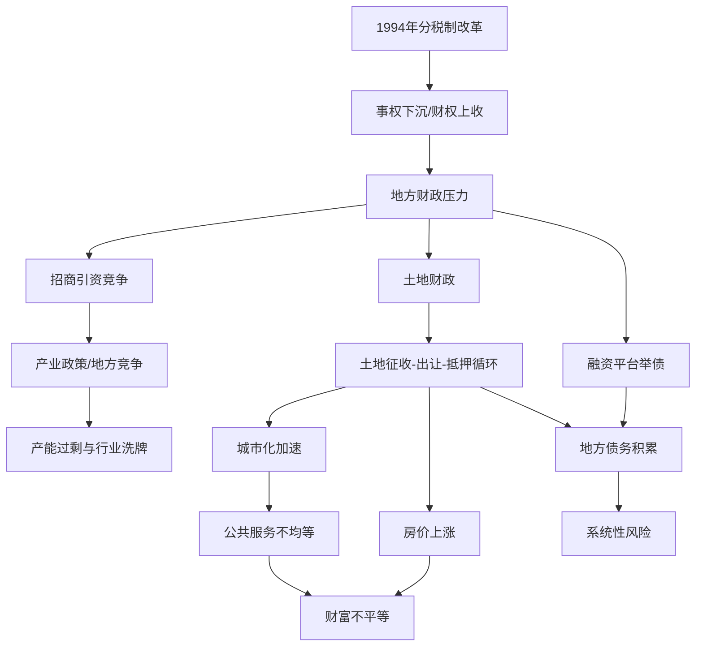
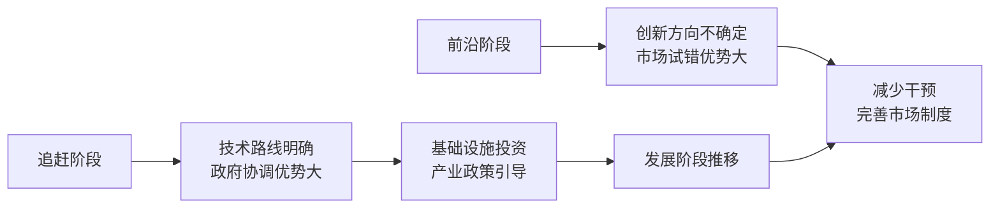

# 《置身事内》深度读书笔记

> [!abstract] 全书速览
> 这是一部从体制内部逻辑出发解释中国政府经济行为的政治经济学通识读物。兰小欢围绕一个核心矛盾——1994年分税制改革后事权与财权的严重错配——层层展开，解释了土地财政、地方债务、房价、产业政策和不平等等一系列当代中国最重要的经济议题是如何形成的。全书的方法论立场是"置身事内"：不从外部道德标准评判，而是进入决策者面对的真实约束条件中，理解每一个看似不合理的现象背后自洽的体制逻辑。读完这本书你会获得一套理解中国经济新闻的分析框架——不再满足于"又涨了""又出问题了"这样的表面判断，而是能追问背后的结构性力量。

## 核心议题

兰小欢要回应的根本问题是：==中国政府在经济发展中究竟扮演了什么角色？这个角色是如何形成的？它带来了什么成就，又积累了什么问题？==

这个问题之所以重要，是因为围绕中国经济存在两种常见的误读。一种是拿西方经济学教科书的标准来衡量，看到的全是"扭曲"和"低效"——政府干预太多、市场化不够、产权保护不足。另一种是不加反思地把经济增长归功于体制优越性，不愿深究增长的代价和可持续性。兰小欢要走的是第三条路：理解体制的内在逻辑，既看到它的合理性（在特定约束下的理性选择），也看到它的代价（这些选择积累的问题）。

书名"置身事内"是方法论宣言。你必须把自己放进决策者面对的约束条件中——财政压力、晋升激励、信息局限、历史路径——才能理解为什么政策是这个样子。这不是为现状辩护，而是有效批评的前提：只有理解了真实的约束，你才能提出真正可行的替代方案，而不是停留在"应该怎样"的空想中。

这本书的知识谱系横跨多个学科：钱颖一和许成钢关于"中国特色联邦主义"的研究、周黎安的"晋升锦标赛"模型、周飞舟对分税制和土地财政的财政社会学分析、张五常从产权角度对中国经济制度的解读。兰小欢的贡献在于把这些分散的洞察整合进了一个连贯的叙事框架，并用大量政策细节和案例使其具体可感。

## 理论框架

兰小欢的分析建立在三个相互嵌套的核心模型之上：

**第一层是"事权-财权错配"**——1994年分税制改革后，中央拿走了大部分税收收入，但把绝大部分公共服务支出责任留给了地方。地方政府必须自己找钱，这个结构性约束塑造了此后二十多年中国经济的基本面貌。

**第二层是"土地-财政-金融三角"**——地方政府垄断建设用地供给，通过低价征地、高价出让获得收入；同时以土地为抵押向银行融资建设基础设施；基础设施改善后周边土地升值，形成正反馈循环。这个三角关系是中国城市化的核心运作机制。

**第三层是"政府-市场动态互补"**——追赶阶段政府协调弥补市场失灵，接近前沿时需更多依赖市场试错。两者的最优边界随发展阶段动态调整。

> [!note] 框架的要点
> 这三层模型不是平行的，而是层层递进的：事权-财权错配催生了地方政府的自救策略，自救策略的核心是土地-财政-金融三角，对这个三角效果的评价需要放在政府-市场互补的框架下理解。把三者串联起来，你就获得了理解当代中国经济的一把总钥匙。

## 论证深度解读

### 一、事权与财权：一切问题的起点

1994年之前，中国实行财政"包干制"——地方政府和中央约定一个上缴数额，超出部分自留。这个制度极大激励了地方发展经济，但导致==中央财政收入占比从1984年的约40%降到1993年的约22%==。一个穷弱的中央政府无法有效实施宏观调控。

分税制改革彻底改变了格局：增值税中央拿75%，企业所得税中央拿60%，消费税全部归中央。中央财政收入占比迅速回升到55%左右。但地方的支出责任几乎没有调整——中国的行政体系是"层层发包"的，越到基层事务越多，财政越紧张。

> [!tip] 核心数据
> ==地方政府承担了全国约85%的财政支出，但只获得了约50-55%的财政收入。==这个巨大的缺口，催生了招商引资、土地财政和融资平台三大"自救"策略。

缺口名义上靠中央转移支付弥补，但转移支付本身问题很大：一般性转移支付不够多，专项转移支付占比过高且审批复杂，催生了"跑部钱进"的现象——地方官员去北京各部委争取项目资金。

> [!warning] 深层影响
> 这种错配使得地方政府不能只当"服务型政府"，而必须主动"经营"——像企业一样去创造收入。招商引资、经营城市、开发土地，这些看似"越位"的行为，在理解了财政约束后变得完全合理。地方政府不是不知道什么是好的公共管理，而是不先把钱赚到手，任何公共服务都无从谈起。

事权-财权错配还塑造了中央与地方的博弈关系。中央通过财权和人事任命权约束地方，地方通过信息优势和执行灵活性争取空间。这不是对抗，而是一种"讨价还价"的动态平衡。

### 二、土地财政：城市化的发动机与系统性风险的根源

"土地财政"不是一个简单概念，而是包含多个环节的复杂系统。

**征地环节。** 城市土地归国家，农村土地归集体，只有政府才能将农地转为建设用地——==地方政府垄断了建设用地的一级供给==。征地补偿长期按农业用途计算，而非按建设用地市场价值，一亩农田补偿可能只有几万元，同一亩地作为建设用地出让可能达到几百万甚至几千万。

**出让环节。** 通过"招拍挂"程序出让给开发商和企业。地方政府对工业用地和住宅用地的策略完全不同：==工业用地低价甚至亏本出让==（目的是吸引企业带来税收和就业），==住宅和商业用地尽量高价出让==（这是直接的财政收入）。这解释了为什么同一城市工业区地价可能只有住宅区的十分之一。

**抵押融资环节。** 地方政府设立城投公司，用注入的土地资产向银行和债券市场融资，资金投向基础设施建设。基础设施改善后周边土地升值，再以更高价格出让新土地——形成"征地-投资-升值-出让-再投资"的正反馈循环。

> [!example] 正反馈循环的威力与风险
> 这个循环在顺风期威力巨大——中国二十多年里建成了世界最大的高速公路网和高铁网，资金很大程度上来自这个循环。但正反馈循环的本质特征是：顺的时候很顺，反的时候很猛。一旦房地产下行：土地卖不出去 → 财政收入锐减 → 无法偿债 → 基建停滞 → 经济放缓 → 土地更卖不出去。这就是为什么房地产下行不只是一个"行业问题"，而是关乎整个经济增长模式的系统性风险。

土地财政对房价的影响机制是多层叠加的：

1. 土地供给垄断，政府有动力推高地价
2. 住房与公共服务（尤其学区）深度捆绑，"买房"变成"买教育权"
3. 金融体系偏爱房贷（有土地抵押品），提供充足信贷
4. 居民预期房价持续上涨，愿意加杠杆

> [!tip] 政策含义
> =="调控房价"如果只在需求端做文章（限购、限贷），效果注定有限==，因为推高房价的根本力量——土地垄断供给、财政对土地的依赖、住房与公共服务的捆绑——都没有被触动。真正的解决方案必须是结构性的。

### 三、地方债务：追赶型发展的信用透支

2015年之前，《预算法》不允许地方政府直接举债。地方政府通过设立城投公司绕开限制——这些公司法律上是企业，但实际控制人是政府，融资用于政府项目，偿债依赖财政收入和土地出让收入。这就是==隐性债务==——名义上企业债务，实际上政府债务，但不出现在政府的官方报表上。

2008年四万亿刺激计划是债务急剧膨胀的转折点。中央要求地方扩大投资稳增长，地方通过融资平台大举借债。2013年审计署数据显示地方政府直接偿还责任的债务约10.9万亿元，加上担保和救助责任接近18万亿元——实际数字可能远高于此。

债务快速增长的三个结构性驱动力：

> [!note] 晋升锦标赛
> 地方官员晋升与GDP增长高度相关。借债投资的成本（偿还）在后任显现，收益（GDP增长）是当期的。==这种时间上的不对称天然鼓励了借债投资行为。==

> [!note] 预算软约束
> 地方政府预期中央不会让其真正"破产"——这种"大而不能倒"的预期削弱了自我约束债务的动力。历史上中央确实多次出手化解地方债务困境，进一步强化了这种预期。

> [!note] 信息不对称
> 融资平台数量众多、形式多样，很多债务通过多层嵌套的金融产品隐藏。地方政府没有动力如实报告，中央的债务监管长期滞后于地方的举债创新。

风险评估方面，兰小欢给出了平衡的判断：

| 风险因素 | 缓释因素 |
|---------|---------|
| 债务增速远超GDP和财政收入增速 | 主要是内债，非外债 |
| 部分资金投向低效项目（"空城"） | 政府持有大量资产（土地、国企股权） |
| 隐性债务规模不透明 | 经济仍在增长，可逐步消化 |
| 债务与房地产高度关联 | 中央有财力和意愿必要时介入 |

> [!warning]
> 兰小欢的结论不是"债务没问题"，而是=="债务问题是可管理的，但管理的窗口在缩小"==。如果不通过结构性改革转变增长模式、强化债务纪律，债务雪球最终可能超出管理能力。

### 四、产业政策：以规模换成功率

中国大量运用产业政策引导经济发展。兰小欢通过三个案例展示了产业政策的复杂现实。

**光伏产业**：政府大力扶持 → 产能急速扩张 → 欧洲市场需求骤降后严重产能过剩（尚德破产、赛维巨亏）→ 惨烈市场洗牌 → 存活企业（如隆基绿能）通过技术创新占据全球主导地位。"先败后成"。

**新能源汽车**：补贴早期催生大量"骗补"企业 → 政策调整（提高门槛、引入退坡机制）→ 市场竞争加剧 → 真正有竞争力的企业（如比亚迪、宁德时代）脱颖而出 → 具备全球竞争力。

**芯片产业**：面对技术封锁投入巨额资金 → 技术复杂度远超光伏和电动车 → 大量资金涌入也带来骗补、烂尾、腐败 → 能否复制"先败后成"路径仍是未知数。

> [!tip] 产业政策有效的条件
> - 目标技术路线相对清晰（硅基光伏、电池路线）
> - 存在可模仿和追赶的技术前沿
> - 政策扶持与市场竞争并存——政府提供初始支持，市场竞争淘汰劣质企业
> - 政策能根据反馈不断调整，而非僵化执行

> [!warning] 系统性失败的风险来源
> - 地方竞争导致重复建设——一个"风口"可能有几十个城市同时上马
> - 补贴机制引发寻租——只要存在补贴就有人想办法套取
> - 前沿创新方向不确定——政府押注可能押错方向

==兰小欢的核心观点：中国的产业政策是一种"以规模换成功率"的策略==——投入大量资源，允许大量失败，期望从废墟中长出成功者。代价是巨大的资源浪费，但在大国经济体中，如果成功者的收益足够大，总体账可能算得过来。这种策略在追赶阶段有效性较高，在技术前沿领跑阶段有效性会大幅下降。

### 五、政府与市场：动态配比而非二元选择

兰小欢从四个维度论证政府与市场的互补关系：

1. **基础设施的网络效应**：基础设施的价值取决于网络连接程度，需要大规模协调投资，政府有天然优势
2. **追赶阶段的信息优势**：技术路线明确时政府可以集中资源加速追赶；接近前沿时市场试错更有效
3. **金融市场的不完善**：中国金融市场长期不够发达，国有银行和政策性金融是重要的资金配置渠道
4. **实用主义与路径依赖**：改革在既有制度基础上渐进推进，不能假设一步到位

中国模式的特征与局限：

| 特征 | 追赶阶段优势 | 前沿阶段局限 |
|------|------------|------------|
| 强政府直接参与经济 | 集中资源、加速建设 | 无法比市场更擅长发现创新方向 |
| 中央-地方分权竞争 | 带来活力和多样化探索 | 重复建设、资源浪费 |
| 渐进改革"摸着石头过河" | 避免休克疗法的冲击 | "硬骨头"改革被无限期推迟 |
| 实用主义不拘教条 | 政策灵活、适应性强 | 政策缺乏可预测性，影响长期投资 |

### 六、不平等的多维结构与再分配困境

中国的不平等是多重结构性不平等的叠加：

- **城乡差距**：城市居民收入长期约为农村居民的2.5-3倍，公共服务差距更大
- **地区差距**：东部沿海与中西部内陆在产业结构、就业机会和营商环境上的巨大差异
- **户籍锁定**：==户籍制度把前两层不平等"锁定"并"制度化"==——出生地和户口决定了能获得什么质量的公共服务，进而决定人生起点
- **财富不平等**：主要体现在房产，房价快速上涨期间有房者和无房者之间财富差距急剧拉大

再分配面临四个结构性障碍：

> [!warning] 为什么再分配那么难
> 1. **税制障碍**：以间接税为主（累退性质），个人所得税比重低且主要由工薪阶层承担，房产税多年未能全面推出
> 2. **转移支付障碍**：主要目标是"均衡地方财力"而非直接向穷人转移收入
> 3. **社保碎片化**：城镇职工、城乡居民、机关事业单位各有一套制度，跨地区转移接续困难
> 4. **政治经济学障碍**：任何有力度的再分配改革都会触动既得利益者，==受损者的抵抗往往比受益者的支持更强烈和有组织==

改革方向清晰——户籍改革实现公共服务均等化、财税改革增强直接税比重、社保全国统筹、发展农村缩小城乡差距——但每一条都是"硬骨头"。

## 学术争鸣

**张五常**从产权和交易费用角度理解中国经济，认为"县际竞争"是增长核心动力。兰小欢有共鸣（都强调地方竞争），但更关注竞争的"代价"——重复建设、债务积累和环境破坏。

**周黎安**的"晋升锦标赛"模型为兰小欢提供了重要的微观基础。兰小欢基本采纳这个框架，并将其与财政体制分析深度结合。

**周飞舟**在[[《以利为利》]]中从财政社会学角度分析分税制改革如何将地方政府从"经营企业"推向"经营土地"。兰小欢的分析受其明显影响，但覆盖面更广。

**陆铭**在[[《大国大城》]]中主张尊重人口向大城市集聚的经济规律，与兰小欢关于户籍和公共服务均等化的分析高度互补，但政策立场更激进。

**林毅夫**从"新结构经济学"角度为中国模式提供理论辩护——"有为政府"与"有效市场"互补。兰小欢的立场接近林毅夫但更清醒地看到政府干预的代价。

## 方法论反思

兰小欢贯穿全书的方法论有四个要点：

1. **"理解"先于"评价"**：判断政策好坏之前，先理解它在什么约束下做出。理解了约束条件，才能提出真正可行的替代方案
2. **看系统，而非看个案**：高房价不只是"炒房"，地方债务不只是"乱花钱"，都是多个结构性因素共同作用的结果
3. **历史路径决定当下选择**：今天的制度是一步步演化来的，改革必须在既有基础上进行，受路径依赖约束
4. **对教科书保持审慎**：标准经济学模型（完全竞争、理性决策、制度外生）在理解中国经济时严重不足

> [!warning]
> 兰小欢自觉选择了"理解"而非"批判"的立场，这是优势也是局限。他擅长解释"为什么是这样"，但对政府失灵的案例分析相对温和——投资失败的空城、征地拆迁中的冲突、债务黑洞中的腐败，在书中更多一笔带过。此外本书出版于2021年，此后中国经济经历了房地产深度调整和地方债务危机加剧，书中一些相对乐观的判断需要重新审视。

## 现实映射

兰小欢的分析框架暗含了几个重要判断，可以和后来的现实做对照：

**房地产**：他指出土地财政模式不可持续。2021年后恒大、碧桂园等开发商债务违约，土地出让收入大幅下降，大量城市房价持续下跌——验证了他的分析。

**地方债务**：他认为"可管理但窗口在缩小"。2022-2025年多个省份城投公司出现偿付困难，中央多次出手化解。尚未爆发系统性危机，但化解难度持续上升。

**产业政策**："先败后成"模式在光伏和新能源汽车得到进一步验证。芯片产业前景仍不明朗。

**不平等**：公共服务不均等问题在疫情期间充分暴露——医疗资源的城乡差距、线上教育的数字鸿沟、社保的碎片化，在极端情境下被放大。

==追赶型发展模式可能正在走向尽头==——后发优势空间缩小、人口开始负增长、债务空间收窄。未来增长需要新引擎，制度创新可能比技术创新更重要。

## 延伸阅读

- [[《以利为利》]]（周飞舟）：从财政社会学角度分析分税制改革的深远后果，是理解土地财政前史的必读之作
- [[《大国大城》]]（陆铭）：聚焦城市化和区域发展中的空间不平等，深化了兰小欢关于户籍改革和公共服务均等化的讨论
- [[《中国的经济制度》]]（张五常）：从产权角度理解中国经济，认为县际竞争是中国奇迹的核心动力，与兰小欢的财政视角形成互补
- [[《转型中的地方政府》]]（周黎安）：系统阐述"晋升锦标赛"模型，是理解地方官员激励结构的经典文献
- [[《国家为什么会失败》]]（阿西莫格鲁、罗宾逊）：从制度经济学角度论证包容性制度与汲取性制度对经济发展的决定性影响，提供理解中国模式的比较视角
