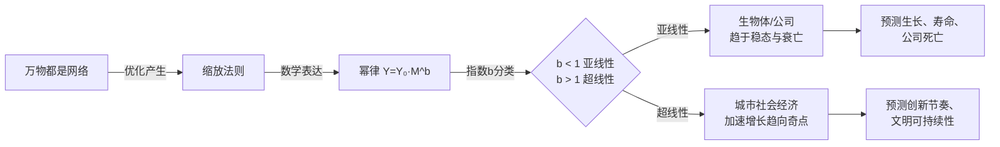
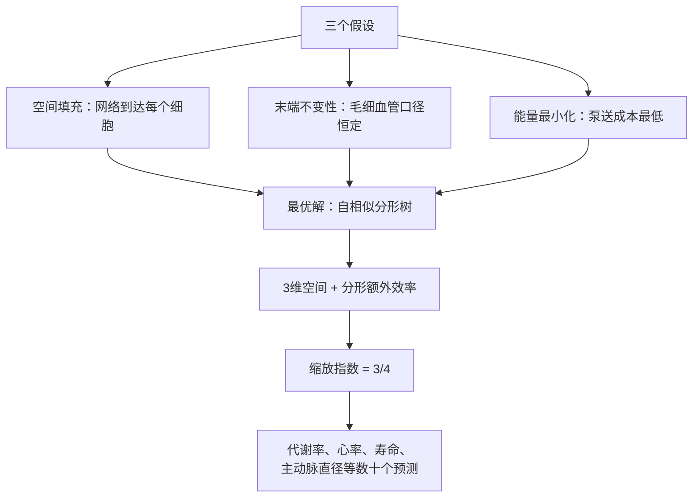

# 《规模》深度读书笔记

> [!abstract] 全书速览
> 一头大象的体重是一只老鼠的二十多万倍，但它的代谢率只是老鼠的七千多倍——大自然给了大个子一张"批量折扣券"。这张折扣券的数学表达是==幂律==，它的秘密藏在所有生命体内部那棵自相似的分形网络树里。理论物理学家杰弗里·韦斯特把这个发现从生物学搬到了城市和公司：城市越大，人均基础设施成本越低（亚线性缩放），但人均创新和犯罪都越高（超线性缩放）；公司越大，越像一台逐渐老化的生物体，最终走向死亡。全书的终极追问是：当超线性增长遇上有限的星球资源，人类文明如何才能不被自己的加速度甩下跑步机？韦斯特说，答案藏在缩放法则的数学里——理解它，你就掌握了预测复杂系统命运的钥匙。

---

## 这本书追问什么

为什么没有哥斯拉那样的巨型怪兽？为什么人类能活大约一百年而老鼠只活两三年？为什么城市越大、人均GDP越高，但犯罪率也越高？为什么几乎所有上市公司都会在几十年内消亡，而城市却似乎可以"永生"？

这些问题看上去分属生物学、城市学和经济学，但韦斯特认为它们的答案指向同一个深层结构。他是圣塔菲研究所的前所长，前半生做高能物理，后半生转向复杂系统科学。他的核心直觉是：==从细胞到鲸鱼、从村庄到超级都市、从初创公司到跨国巨头，所有复杂系统本质上都是"网络"==——能量分配网络、社会互动网络、信息传递网络。网络有共同的数学语言，这套语言能统一解释生命、城市和公司的生长、代谢与死亡。

他与生物学家詹姆斯·布朗和布莱恩·恩奎斯特合作，从三个简洁的物理假设出发，用数学推导出了生物体的3/4代谢缩放律——然后把这套方法论延伸到了城市和公司。他追问的核心问题是：**当系统的规模发生变化时，系统的各种属性会如何变化？这种变化是否遵循可预测的数学规律？**

这个问题之所以重要，是因为你正生活在人类历史上规模扩张最剧烈的时代。到2050年全球约75%的人口将住在城市里。理解"规模如何改变系统"，不是学术游戏，而是关乎城市化进程的方向、公司的生死、甚至文明的可持续性。

---

## 知识架构

> [!note] 全书逻辑主线
> 万物都是网络 → 网络的优化产生缩放法则 → 缩放法则以幂律呈现 → 幂律指数揭示系统的本质 → 据此预测生长、代谢、寿命、创新节奏和文明的可持续性。

全书可以拆解为四大思想板块，构成一个从基础理论到文明级预测的递进结构。

**第一板块：缩放思维的建立**（第1-2章）。韦斯特从一组令人着迷的问题开场，引入全书的数学语言——幂律公式 Y = Y₀·M^b。他让你看到，关键不在公式本身，而在那个指数 b：b < 1 是亚线性（规模越大越高效，节奏越慢），b > 1 是超线性（规模越大越活跃，节奏越快）。伽利略最早发现了简单的几何缩放，韦斯特把它升级为基于网络理论的普适框架。

**第二板块：生命的缩放法则**（第3-4章）。这是全书理论最坚实的部分。韦斯特团队提出的WBE模型，从三个假设（空间填充、末端不变性、能量最小化）出发，推导出代谢率与体重的3/4次幂关系、所有哺乳动物一生约15亿次心跳的守恒量、以及普适的S形生长曲线。这一板块的精髓是：==生命体内部的血管网络是一棵自相似的分形树，它在三维空间中实现了"准四维"的空间填充效率==。

**第三板块：城市的双重缩放**（第5-7章）。城市服从缩放法则，但方向与生物体不同。基础设施呈亚线性缩放（指数约0.85），社会经济产出呈超线性缩放（指数约1.15）。城市既是创新加速器又是问题放大器。超线性增长的数学后果是"有限时间奇点"。

**第四板块：公司与文明的命运**（第8-9章）。公司的缩放更接近生物体——亚线性意味着内在的死亡趋势。韦斯特在最后将视野拉到最大：人类文明必须以不断加速的频率产出范式级创新，否则超线性增长会撞上资源天花板。

---

## 核心发现深度解读

### 一、幂律：一把度量万物的尺子

你在城市里逛超市，买一袋米和买一卡车米，单价不同——买得越多越便宜。这种"批量折扣"在自然界也广泛存在，但自然界的折扣不是超市定价经理拍脑袋定的，而是遵循严格的数学规律。

韦斯特告诉你，这个规律的数学表达是幂律：Y = Y₀·M^b。Y是你关心的属性（代谢率、GDP、犯罪数），M是系统的规模（体重、人口），b是那个决定一切的指数。

伽利略最早碰到了缩放问题。他指出你不能把一根柱子简单等比放大，因为体积按立方增长而截面积只按平方增长——放大到一定程度柱子会被自重压垮。这就是"平方-立方定律"。但伽利略发现的是纯几何缩放。==生物体的缩放比几何缩放更"聪明"==——代谢率的缩放指数不是2/3（几何预期），而是约3/4。那个额外的效率增益从何而来？

幂律的本质含义是：当你把体重和代谢率都取对数，从老鼠到大象的所有数据点会落在同一条直线上，斜率就是 b。这意味着缩放规律是==普适的、连续的、可预测的==。

> [!tip] 核心分类
> 韦斯特给你的分类工具：b < 1 = 亚线性 = 规模经济 = 效率提升、节奏减缓、趋于稳态（生物体、公司）。b > 1 = 超线性 = 规模收益递增 = 加速增长、节奏加快、趋向奇点（城市的社会经济维度）。b = 1 = 线性 = 纯粹等比放大 = 在真实世界中几乎不存在。

> [!warning] 证据等级
> 幂律关系在大量物种和系统中已被验证，属于充分验证的经验规律。但具体的指数值（比如到底是0.75还是0.67）在学术界仍存在持续争论，需要根据具体系统和数据集谨慎对待。

---

### 二、WBE模型：3/4法则从何而来

1932年，生物学家克莱伯发现了一个惊人的规律：哺乳动物的基础代谢率与体重的3/4次幂成正比。一头5吨重的大象，代谢率不是一只20克老鼠的25万倍，而只是大约7500倍。==大自然给了大型动物慷慨的"能量折扣"==。

这个折扣是怎么来的？韦斯特与布朗、恩奎斯特在1997年提出了WBE模型（以三人姓氏首字母命名），给出了一个优雅的物理学解释。模型基于三个核心假设：

1. **空间填充**：资源分配网络（比如血管系统）必须到达每一个细胞，就像快递网络必须覆盖每个小区。
2. **末端不变性**：最末端的毛细血管直径在所有哺乳动物中几乎相同——无论你是老鼠还是大象，细胞接收营养的"水龙头口径"一样。
3. **能量最小化**：自然选择使整个网络的能量耗散尽可能低。

从这三个假设出发，数学推导自然给出3/4指数。核心物理直觉是：==血管网络是一棵自相似的分形树==，每一级分支都按相同的比例缩小。这种分形结构让系统在三维空间中实现了接近四维的空间填充效率。普通的三维填充给出2/3指数，分形的"额外维度"贡献了那1/12的效率增益。

> [!example] 帮助理解的类比
> 你在设计一个城市的供水系统。主管道分成中管道，中管道分成小管道，小管道最终连接到每户水龙头。你的目标是：水到达每一户、每户水龙头规格相同、总泵送成本最低。如果你用数学求解这个优化问题，最优方案是一棵自相似的分形树——每级按固定比例分裂。大自然的血管系统正是如此，只不过"设计师"是亿万年的自然选择。

> [!warning] 学术争议
> 3/4 vs 2/3 的争论并未终结。部分研究者用更大数据集重新检验，发现指数在0.67-0.75之间波动。WBE模型的核心洞见（网络结构决定缩放行为）获得普遍认可，但数学推导的具体细节仍在被修正和完善。韦斯特推导的是理想化的理论值，现实中的偏差来自物种差异、测量方法和个体变异。

---

### 三、15亿次心跳：生命的时间守恒

如果上一个发现告诉你"大小很重要"，这一个告诉你"快慢也很重要——而且大小决定了快慢"。

老鼠的心脏每分钟跳600次，大象每分钟跳30次。老鼠活两三年，大象活六七十年。看起来天差地别，但做一道简单的乘法：心率乘以寿命，你会发现所有哺乳动物一生的心跳总数都落在约==15亿次==这个数字附近。

数学上的解释很简洁：心率与体重的-1/4次幂成正比（M^(-1/4)），寿命与体重的+1/4次幂成正比（M^(1/4)），两者相乘，指数抵消，心跳总数是常数。

这意味着什么？==如果你用心跳而非年份来度量时间，所有哺乳动物活一样"长"==。老鼠并不比大象活得更短——它只是在一个"更快的时钟"里度过了同等数量的时间单位。时间的"速度"因规模而异。

韦斯特进一步用缩放理论推导出了普适的生长方程——解释为什么几乎所有生物体都走S形曲线：先快速生长，然后减速，最终停止。原因是随着体型增大，越来越多的代谢能量被用于维护已有组织（"维修费用"），能用于生长的能量越来越少，最终降到零。

衰老和死亡也有了物理学解释：维护工作不可能100%完美，未修复的损伤不断积累，最终超过系统的承受极限。体型越大，单位质量的代谢率越低（亚线性缩放），"磨损速度"越慢，所以寿命越长。

> [!note] 有趣的例外
> 人类是这条规律的异类。由于医疗进步和生活方式改变，现代人的寿命远超体型预测值，心跳总数已经大幅突破15亿次。鸟类和蝙蝠的寿命也系统性地高于同等体型的哺乳动物。裸鼹鼠体型和老鼠差不多，却能活30多年。这提示你：缩放法则描述的是"自然基线"，人为干预和特殊适应机制可以弯曲这条曲线——但无法彻底摆脱它。

---

### 四、城市的双重人格：创新加速器与问题放大器

生物体的故事讲完了。韦斯特把同一副"缩放眼镜"架到鼻梁上，开始看城市——结果看到了一幅完全不同的图景。

城市也服从缩放法则，但有一个惊人的分裂：它同时拥有两种截然不同的缩放行为。

城市的==基础设施==（道路总长度、管道里程、加油站数量）呈亚线性缩放，指数约0.85——跟生物体类似，体现规模经济。城市人口翻倍，需要的道路不会翻倍，因为密度增加让基础设施被更高效地共享。

但城市的==社会经济产出==（GDP、专利数量、工资水平、餐厅数量）呈超线性缩放，指数约1.15。人口翻倍，人均GDP不只是保持不变，而是增长约15%。更多人挤在一起，人均创造力反而更高。

问题来了：城市的==负面指标==（犯罪数量、传染病传播率、交通拥堵时长）缩放指数也是约1.15。好的和坏的以相同的数学规律被放大。

> [!tip] 核心洞察
> 城市的本质不是建筑和道路（那些是亚线性的），而是人与人之间的互动。互动产生创意、创新和财富，也产生冲突、犯罪和疾病。城市越大，潜在的互动组合越多。==你不能只要创新不要犯罪——它们来自同一个源头：高密度的人际互动==。

城市拥有两种叠加的网络：物理基础设施网络（树状、受空间约束、亚线性）和社会关系网络（网状、连接密度随人口超比例增长、超线性）。正是这种双重网络结构造就了城市的双重人格。

| 维度 | 生物体 | 城市 |
|------|--------|------|
| 缩放类型 | 亚线性（b ≈ 0.75） | 基础设施亚线性 + 社会经济超线性 |
| 核心网络 | 血管/呼吸系统（单一网络） | 道路网络 + 社会关系网络（双重网络） |
| 规模效应 | 规模经济 | 规模经济 + 规模收益递增 |
| 生长命运 | S形曲线，最终停止 | 理论上可无限增长（但有条件） |
| 节奏 | 规模越大，节奏越慢 | 规模越大，节奏越快 |
| 寿命 | 有限 | 极长（城市很少真正"死亡"） |

> [!warning] 理论成熟度
> 韦斯特坦诚承认，城市缩放的理论基础不如生物缩放成熟。生物缩放有明确的网络优化模型（WBE），城市缩放的"社会网络"数学模型仍在发展中。一个关键的未解问题是因果方向：到底是"大城市让人更有创造力"，还是"高收入的人和产业倾向于聚集在大城市"？缩放法则本身不能区分这两个方向。另外，城市边界的定义方式会显著影响缩放指数的计算结果。

---

### 五、加速跑步机：超线性增长的数学宿命

这是全书最令人不安的发现。

生物体的亚线性缩放带来的是稳定和可预测的终点——S形生长曲线最终趋于平台。但城市的超线性缩放带来的是一条完全不同的数学轨迹：增长速度本身在加速，曲线越来越陡，在有限时间内趋向无穷大。

这就是数学上的=="有限时间奇点"==。

具体含义是：如果人类社会保持现有的超线性增长模式，资源消耗将在一个可以计算出来的时间点达到不可持续的极限。

唯一避免崩溃的方法是不断进行"范式重置"——农业革命、工业革命、信息革命，每次重大创新相当于把增长曲线拉回起点。但问题在于：==每一次重置必须比上一次来得更快==。从农业革命到工业革命用了几千年，从工业革命到信息革命用了约200年，下一次革命必须在更短的时间内到来。

> [!example] 帮助理解的类比
> 你在跑步机上跑步，机器每隔一段时间自动加速。你必须跑得越来越快才能不被甩下去。更要命的是，加速的间隔也在缩短——第一次1小时后加速，第二次30分钟后，第三次15分钟后。数学上，在某个有限时间点，要求的速度会趋向无穷大。唯一的办法是跳上一台全新的跑步机——但新跑步机也会加速，而且起始速度更快。

韦斯特不是末日预言家。他的要点是：==只有理解了缩放法则，你才能设计出更可持续的系统==。比如，大城市的人均碳排放远低于小城市（亚线性的基础设施缩放），这意味着城市化本身反而可能是节约资源的路径——前提是你理解并利用这些规律。

> [!warning] 重要前提
> 这个模型建立在"缩放指数保持不变"的假设上。如果人类社会的缩放关系本身发生变化——比如通过技术变革使增长从物质密集型转向信息密集型——结论可能改变。韦斯特的预警是一个数学推演，不是预言。"有限时间奇点"是数学外推，真实系统在趋近奇点时通常会经历质变（相变），而非真的到达无穷大。

---

### 六、公司为什么终将死去

韦斯特把缩放法则的镜头对准公司时，看到了一个令人清醒的事实。

在美国，上市公司的半衰期约为10.5年——不管一家公司在何时上市，大约10.5年后有一半的概率已经消失。1950年《财富》500强中的公司，到2010年只剩下不到15%。

数据分析表明：==公司的缩放行为是亚线性的，更接近生物体而非城市==。这意味着公司有代谢减速、增长放缓、最终走向死亡的内在结构性趋势。

为什么？韦斯特的解释是：随着公司规模增大，官僚体系日益膨胀，层级管理和标准化流程逐渐压制了自发的创新活力。一家初创公司像一个小型派对——每个人认识每个人，创意自由碰撞。一家万人公司像一栋写字楼——你只认识本部门的人，跨部门沟通要走审批。公司在增长过程中从"城市模式"（超线性、创新涌现）逐渐蜕变为"生物体模式"（亚线性、效率导向、趋于僵化）。

==城市几乎不会死亡，因为它没有统一的"管理层"==——城市的创新来自无数居民自发的互动，不受统一指挥。公司有CEO、有战略、有流程——这些带来了效率，但也抑制了涌现。城市是开放系统（居民自由迁入迁出，失败的企业倒闭后新企业在原地生长），公司是封闭系统（明确的边界、统一的战略方向、中央资源分配）。

> [!warning] 数据局限
> 公司缩放的数据基础是三个领域中最薄弱的。公司的定义本身不够清晰（什么算收入？什么算"死亡"？），行业差异巨大。一些科技平台公司（如亚马逊、谷歌）通过内部市场化和平台化策略似乎在延缓亚线性化的过程——它们通过开放平台把外部创新者纳入自己的生态系统，实质上是把城市式的开放网络嫁接到公司框架上。韦斯特在这部分的结论应被视为启发性假说，而非确立的科学定律。

---

## 科学前沿

《规模》出版于2017年。此后，韦斯特所代表的复杂系统科学与统计物理学的跨领域研究持续推进。

**生物缩放方面**，3/4指数的争论仍在继续。一些大规模荟萃分析发现指数在不同分类群中波动于0.67到0.75之间，具体取决于物种范围和测量方法。WBE模型的核心框架（网络优化决定缩放行为）被广泛接受，但推导细节仍在被修正——例如植物的维管网络是否满足原始模型的三个假设就存在争议。微生物层面的探索也在展开，细菌群落显示出类似的缩放模式。

**城市科学方面**，超线性缩放的经验规律在更多国家和文化背景下得到验证。同时，批评声音也在增强。一些研究者指出，缩放关系的具体指数值对城市边界的定义非常敏感——"城市"的范围划多大会显著影响结果。城市大数据（手机定位、社交媒体互动）的爆发式增长，为更精细地验证和修正社会互动网络模型提供了前所未有的工具。贝当古等人进一步发展了城市缩放的理论模型，试图从社会网络的数学结构推导出超线性指数。

**可持续性方面**，"加速跑步机"的警告在气候危机和资源约束的背景下获得了更多共鸣。但也有学者提出，人工智能等技术可能从根本上改变缩放指数——如果创新可以部分脱离物质消耗（如数字经济的扩展），超线性增长的物质代价可能被重新定义。这是一个仍然开放的、极为关键的研究前沿。

---

## 认知升级清单

> [!tip] 关于"大"的认知
> 以前以为大象只是放大版的老鼠、纽约只是放大版的小镇。现在知道==缩放从来不是简单的等比放大==——每次规模变化都伴随系统性的、可预测的、有数学规律的质变。

> [!tip] 关于效率的认知
> 以前以为大就是低效、大就是笨重。现在知道在物质和能量层面，大往往意味着更高效——亚线性缩放带来的规模经济使纽约人的人均碳排放远低于休斯顿人。

> [!tip] 关于时间的认知
> 以前以为时间对所有生命的流逝速度相同。现在知道从"生物钟"的角度看，所有哺乳动物活一样"长"——约15亿次心跳。==时间的"速度"因规模而异==。

> [!tip] 关于创新的认知
> 以前以为创新是个体天才的产物。现在知道创新很大程度上是高密度人际互动的统计结果——大城市人均专利数更高不是偶然，是数学必然。

> [!tip] 关于城市阴暗面的认知
> 以前以为犯罪是管理失败的标志。现在知道犯罪率和创新率来自同一个数学源头——超线性的人际互动。你不能只要一个不要另一个。

> [!tip] 关于公司寿命的认知
> 以前以为大公司更稳定、更安全。现在知道所有公司都在走向死亡，半衰期约10年。大公司的困境不是管理层无能，而是规模本身带来的结构性宿命。

> [!tip] 关于可持续性的认知
> 以前以为只要够努力就能持续增长。现在知道超线性增长在数学上指向有限时间奇点——人类文明必须以不断加速的频率产出范式级创新，否则就会撞上资源天花板。

---

## 延伸阅读

- [[《链接》]]（巴拉巴西）：网络科学的最佳入门，帮你理解幂律和无标度网络的数学基础——这是韦斯特整个理论大厦的地基。

- [[《大自然的分形几何》]]（曼德博）：分形理论的奠基之作。WBE模型的"分形网络"概念直接来源于此。

- [[《反脆弱》]]（塔勒布）：同样关注系统如何应对规模变化和冲击，但从风险和黑天鹅的角度切入，与韦斯特形成有趣的对照。

- [[《城市的胜利》]]（格莱泽）：从城市经济学角度提供大量实证研究，与韦斯特的缩放理论互为印证和补充。

- [[《复杂》]]（梅拉妮·米歇尔）：圣塔菲研究所的复杂性科学综述，为韦斯特的工作提供了更广阔的学科背景。
