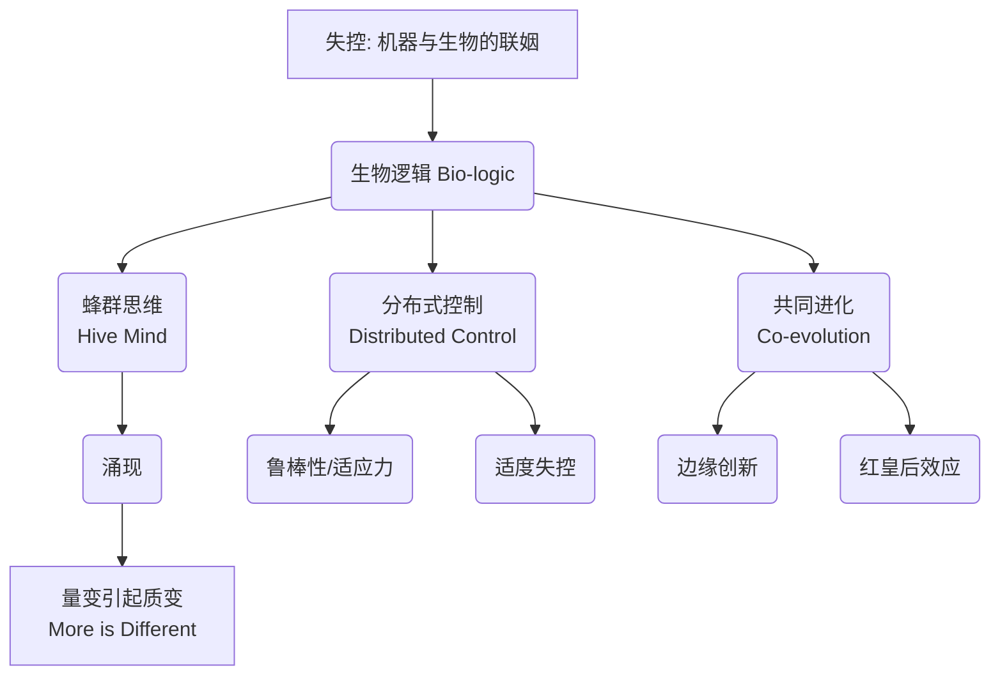

> [!abstract] 核心思想
> **“造化所生”（The Born）与“人造之物”（The Made）正在逐渐融合。**
> 未来，机器将变得越来越像生物（拥有自我进化、自我修复、不可预测的能力），而生物技术将变得越来越像工程（可编程、可设计）。在这种融合中，最强大的力量不是自上而下的控制，而是**自下而上的涌现（Emergence）**。要想获得极致的控制力，我们必须在一定程度上失去控制（Out of Control）。

---

## 📖 作品背景与概况

《[[失控]]》（Out of Control）是《连线》（Wired）杂志创始主编 **[[凯文·凯利]] (Kevin Kelly)** 于1994年出版的巨著。尽管成书于互联网早期，它却精准预言了云计算、物联网、虚拟现实、去中心化协作（如维基百科、比特币）等未来30年的技术趋势。

- **预言性**: 被誉为“互联网时代的圣经”。微信之父张小龙强烈推荐，称其为“上帝视角的书”。
- **核心隐喻**: 蜂群。蜜蜂个体是愚蠢的，但蜂群整体是智慧的。

---

## 🧠 核心概念图谱

---

## 🪜 深度拆解：从机器到生态系统

### 1. 蜂群思维 (The Hive Mind)
> [!quote] "群体不仅是由个体组成的集合，它是一个独立的有机体，拥有个体所不具备的特质。"

*   **现象**: 一只蜜蜂只有简单的神经反应，但成千上万只蜜蜂组成的蜂群却能进行复杂的决策（选巢、调节温度、防御）。
*   **原理**: **分布式系统**。没有中心指挥官（蜂王并不发号施令，只是生殖机器）。
*   **洞察**: 智慧不是集中在某个大脑中，而是从无数个体的连接中**涌现**出来的。
    *   *应用*: 互联网、神经网络、市场经济、维基百科。

### 2. 九律：上帝造物的法则 (The Nine Laws of God)
KK 总结了自然界创造复杂系统的九条规律，这同样适用于构建复杂的人造系统（如AI、互联网）：

1.  **分布式 (Distribute being)**: 变“一”为“多”。去中心化，让系统更强健。
2.  **自下而上 (Control from the bottom up)**: 简单的规则，复杂的行为。控制权在底层。
3.  **递增收益 (Cultivate increasing returns)**: 强者愈强（马太效应）。正反馈循环。
4.  **模块化生长 (Grow by chunking)**: 从简单系统组装成复杂系统，而非凭空设计复杂系统。
5.  **边界最大化 (Maximize the fringes)**: 创新往往发生在系统的边缘（异端、非主流），而非中心。
6.  **鼓励犯错 (Honor your errors)**: 错误是进化的前提。没有变异，就没有进化。
7.  **不求最优 (Pursue no optima)**: 只有“较优”，没有“最优”。多样性比单一的高效率更重要。
8.  **谋求持久不衡 (Seek persistent disequilibrium)**: 静态的平衡意味着死亡。生命在于持久的动态不平衡。
9.  **变自生变 (Change changes)**: 进化本身也在进化。规则本身也在改变。

### 3. 共同进化 (Co-evolution)
> [!info] 变色龙与镜子
> 如果让变色龙站在镜子前，它会变成什么颜色？它会陷入疯狂的震荡，因为它在试图适应“正在适应它的映像”。

*   **核心**: 所有的生物都在互为环境。蝴蝶进化出毒素，鸟类进化出识别毒素的能力。
*   **技术启示**: 互联网不仅是工具，它也在重塑人类的大脑和行为；人类反过来又重塑互联网。我们与技术是**共生**关系，而非主仆关系。

---

## 💡 深度解读：为什么要“失控”？

### 1. 钟表逻辑 vs. 蜂群逻辑
*   **钟表逻辑 (Clockwork Logic)**: 工业时代的思维。精确、可预测、线性、中心化控制。如果不给发条，钟就会停。一旦坏了一个齿轮，系统崩溃。
*   **蜂群逻辑 (Swarm Logic)**: 信息时代的思维。模糊、不可预测、非线性、去中心化。砍掉一部分蜂群，剩下的依然能存活。
*   **结论**: 想要构建像互联网或AI这样庞大而灵敏的系统，我们必须放弃“精确控制”的妄念，拥抱“蜂群逻辑”。

### 2. 只有失控，才能进化
*   **控制是进化的敌人**。完全被控制的系统（如流水线）只能重复既定的任务，无法产生新事物。
*   只有允许系统出现**偏差、错误、混乱**，系统才有可能跳出局部最优解，涌现出意想不到的智慧。
*   **代价**: 效率低、冗余、不可控。
*   **收益**: 适应力强、创新、无限的可能性。

### 3. 技术的生物化 (The Bio-logical Future)
> [!abstract] 未来的机器
> 未来的机器将不再是冷冰冰的金属，它们将拥有**生命**的特征：
> *   **自我复制**: 像计算机病毒。
> *   **自我管理**: 像自动驾驶网络。
> *   **自我修复**: 像能够愈合的材料。
> *   **适度进化**: 通过算法迭代自我升级。
>
> 最终，**“人造”与“天生”的界限将彻底消失**。

---

## 📎 延伸阅读与关联

- **关联书籍**:
    - [[必然]] (The Inevitable): KK 后续著作，进一步阐述了塑造未来的12个技术力量。
    - [[科技想要什么]] (What Technology Wants): 探讨技术的本质和意愿，视技术为一种生命体（Technium）。
    - [[复杂]] (Complexity): 关于复杂性科学的经典科普。
- **关联概念**:
    - [[涌现]] (Emergence)
    - [[去中心化]] (Decentralization)
    - [[自组织]] (Self-organization)
    - [[元宇宙]] (Metaverse) - 本书预言的终极形态之一。

---

> [!quote] 结语
> "最深刻的技术是那些看不见的技术。它们将自己编织进日常生活的细枝末节之中，直到成为生活的一部分。" —— 马克·魏塞尔 (Mark Weiser)
>
> 而《失控》告诉我们，最伟大的控制，是赋予事物自主权，让它们在失控中生长出超越设计者的智慧。
