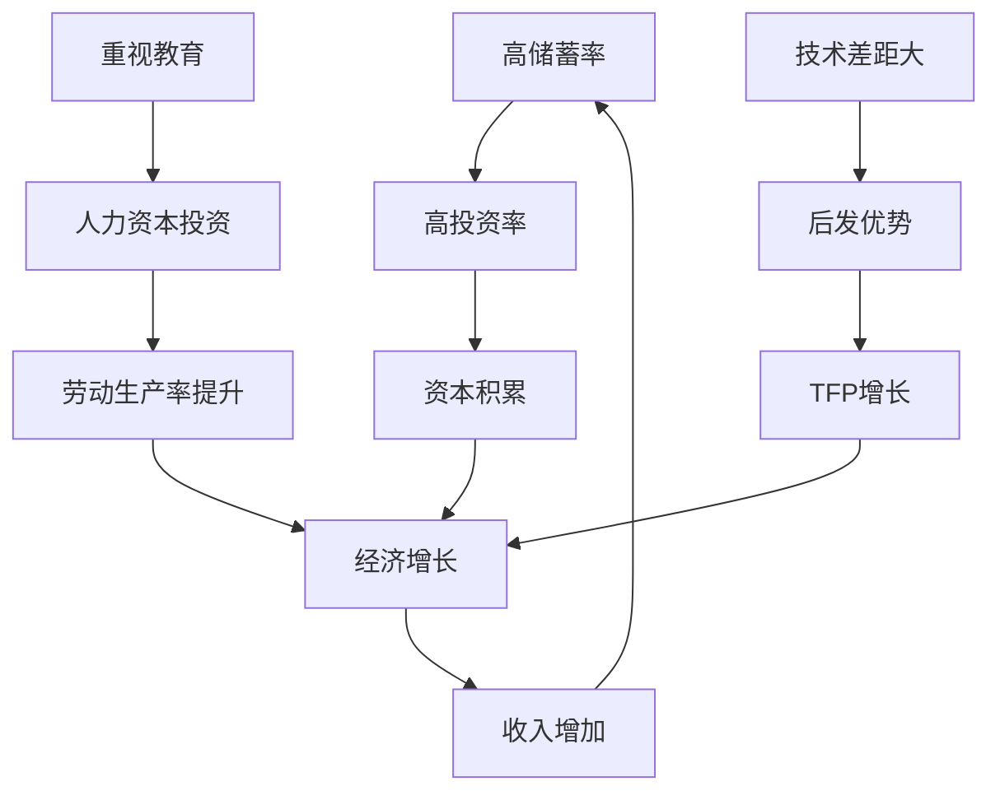

# 《中国式增长》深度读书笔记

> [!abstract] 全书速览
> 这本书用严谨的经济学逻辑，破除了关于中国经济增长的流行谬误——人口红利、廉价劳动力、出口导向等，揭示了真正的增长引擎：==超高储蓄率==驱动的资本积累、==人力资本==的快速积累、以及==后发优势==带来的技术追赶。朱天教授将这些经济因素追溯到更深层的东亚儒家文化特征，构建了一个"文化→行为→经济结果"的完整解释链条。这不仅是一本解释过去的书，更是一本帮助你理解中国经济未来走向的指南。

## 这本书要解决什么经济问题

1978年到2020年，中国GDP年均增长约9.5%。一个曾经人均收入比非洲还低的国家，用40年时间走完了西方200年的工业化历程。这在人类经济史上是前所未有的"异常现象"。

关于这个奇迹，流行的解释汗牛充栋：人口红利、廉价劳动力、出口导向、政府主导……这些说法听起来都很有道理，但朱天教授认为，它们要么逻辑不通，要么与数据矛盾。

这本书要回答的核心问题是：**中国经济高速增长的真正原因是什么？**

朱天是中欧国际工商学院经济学与金融学教授，密歇根大学经济学博士。他不是那种喜欢跟风的学者，而是习惯用数据和逻辑去检验流行观点。在经济学谱系中，这本书属于发展经济学与中国经济研究的交叉领域，但它既不是艰涩的学术论文，也不是宏大叙事的经济史，而是一本用通俗语言讲述增长逻辑的"解谜之作"。

> [!note] 写作立场
> 作者的核心主张是：解释经济增长必须回到经济学的基本原理——资本积累、人力资本、技术进步。那些绕过基本原理的"特殊解释"往往经不起推敲。

## 核心模型地图

本书的分析框架可以概括为"==增长三引擎模型=="。

**引擎一：资本积累**。经济增长的最直接来源是生产要素的增加——更多的工厂、道路、机器。资本积累需要资金，而中国的超高储蓄率（长期保持在40-50%）为高投资提供了充足的"弹药"。储蓄率是世界平均水平的两倍，这是中国区别于大多数发展中国家的关键特征。

**引擎二：人力资本**。劳动力的数量不等于劳动力的质量。中国对教育的近乎"疯狂"的重视，培养了大量高素质劳动者。高等教育毛入学率从1990年的3%飙升到2020年的超过50%。人力资本不仅直接提高生产率，还是吸收和应用新技术的基础。

**引擎三：技术追赶**。作为后发国家，中国可以通过学习和模仿发达国家的成熟技术来实现快速追赶。这种"后发优势"让中国不需要承担高昂的研发成本和失败风险，只需要学习和适应即可。全要素生产率（TFP）年均增长3-4%，远高于发达国家的1-2%。

这三个引擎相互强化：人力资本提高了资本的产出效率，技术进步提高了人力资本的生产力，资本积累为技术引进提供了资金。它们共同运转，驱动了中国经济40年的高速增长。

## 逐层深入

### 破除"人口红利"迷思

"人口红利"是解释中国增长最常见的说法之一。当一个国家的劳动年龄人口比例很高时，理论上经济增长会更容易——有更多人干活，需要养活的老人和孩子相对较少。

但这个说法有一个致命漏洞：如果人口红利是增长的关键，为什么非洲和南亚的许多国家拥有更年轻的人口结构，却未能实现经济起飞？

> [!warning] 关键洞察
> ==人口红利是增长的"许可证"，不是"发动机"。==有汽油不意味着汽车就会跑——你还需要发动机、轮子、方向盘。

问题的核心在于：**劳动力数量不等于人力资本**。100个文盲和100个工程师的经济价值天差地别。中国的优势不在于人多，而在于通过大规模教育投资，将人口数量转化为了人力资本质量。

抚养比（非劳动年龄人口/劳动年龄人口）是衡量人口红利的指标。但数据显示，非洲和南亚的抚养比比中国更低。如果低抚养比就能带来高增长，非洲应该是全球增长最快的地区——显然事实并非如此。

这提醒我们一个经济分析的基本原则：**不要把相关性误认为因果性**。两件事同时发生，不代表一件导致了另一件。

### 破除"廉价劳动力"迷思

另一个流行的解释是"廉价劳动力"。中国工人工资低，所以产品成本低，所以出口有竞争力，所以经济增长。

这个推理链条看似合理，但在经济学上站不住脚。

> [!tip] 核心公式
> ==单位劳动成本 = 工资 / 劳动生产率==

假设你要开一家工厂，有两个选择：
- A国：工人月薪1000元，每人每月生产100件产品，单位成本10元
- B国：工人月薪100元，每人每月生产5件产品，单位成本20元

B国工资低90%，但单位劳动成本反而高一倍！

1990年代，中国制造业工资约为美国的3%，但单位劳动成本约为美国的50%。差距没有看起来那么大，因为中国工人的生产效率也相当高。

**低工资是贫穷的结果，不是竞争力的来源。**如果低工资就能带来竞争力，全世界最有竞争力的应该是最穷的国家。但现实恰恰相反。

真正重要的是劳动生产率与工资的比值。中国工人不仅工资低，生产效率也高——这才是竞争优势的真正来源。而高生产效率来自于教育、培训、组织管理和技术水平，归根结底还是人力资本和技术进步。

### 高储蓄：增长的第一引擎

如果前面两个流行解释都不对，那真正的答案是什么？

朱天教授的第一个答案是：**超高的储蓄率**。

经济增长从何而来？最基本的来源是资本积累——建更多的工厂、修更多的道路、买更多的机器。但资本积累需要钱。钱从哪来？要么借外债，要么自己攒。中国选择的主要是后者。

| 国家/地区 | 储蓄率 |
|----------|--------|
| 中国 | 45-50% |
| 东亚其他经济体 | 30-40% |
| 美国 | 15-20% |
| 撒哈拉以南非洲 | 10-15% |

中国的储蓄率是世界平均水平的两倍，是美国的两到三倍。这不是一个小差距，而是一个量级的差距。

为什么中国人这么能存钱？原因可能是多方面的：文化传统中的节俭美德、社会保障体系不完善带来的预防性储蓄、高房价压力下的被动储蓄……但无论原因是什么，结果是明确的：

> [!example] 增长链条
> 高储蓄率 → 高投资率 → 资本积累 → 生产能力提升 → 经济增长 → 收入增加 → 高储蓄率（良性循环）

在索洛增长模型中，储蓄率决定了稳态资本存量和人均产出水平。简单说，一个社会越能存钱，长期能达到的发展水平就越高。

储蓄的本质是什么？是**延迟消费、投资未来**。它体现了一个社会的时间偏好——是更看重今天的享受，还是更看重明天的发展。从这个角度看，高储蓄率反映的是整个社会对未来的信心和投入。

### 人力资本：增长的第二引擎

如果储蓄是增长的"燃料"，那么人力资本就是"发动机"。

一台发动机越先进，同样的燃料能跑更远的路。同样，劳动者素质越高，同样的资本投入能产生更大的产出。

中国高等教育毛入学率从1990年的3%上升到2020年的超过50%。每年培养的理工科毕业生数量超过美国和欧洲之和。这是一个惊人的人力资本积累速度。

> [!tip] 教育传统
> 从古代的科举制度到今天的高考，中国文化始终认为==教育是改变命运的最重要途径==。这种文化特征转化为巨大的人力资本投资。

人力资本的回报率通常高于物质资本，尤其在知识经济时代。更重要的是，人力资本有**乘数效应**：
- 更好地吸收和应用新技术
- 更有效地管理和协调复杂组织
- 更快地学习和适应新环境

经济学研究表明，多受一年教育带来的收入增长（教育回报率）通常在8-12%左右。这意味着教育投资的回报远高于大多数金融投资。

有人说人力资本是"唯一不会折旧的资本"——这话有些夸张，但道理是对的：机器会老化报废，但知识和技能可以持续产生价值，甚至随着经验积累而增值。

### 技术追赶：增长的第三引擎

后发国家有一个独特的优势：可以站在巨人的肩膀上。

想象你是一个学生，前面有个学霸。你要赶上他有两种方式：一是自己摸索发明新的学习方法，二是直接学习他已经验证有效的方法。后者显然更快。

这就是**后发优势**的本质。中国在改革开放之初，技术水平远落后于发达国家。但这也意味着大量成熟的技术可以直接引进和学习——不需要自己花巨资研发，不需要承担失败风险，只需要学习和适应。

全要素生产率（TFP）衡量的是不能被资本和劳动增长解释的产出增长，通常被视为"技术进步"的代理指标。中国TFP年均增长约3-4%，远高于发达国家的1-2%。这个差距反映的正是追赶效应的力量。

> [!warning] 追赶的终点
> 后发优势是有期限的。==当你逐渐接近技术前沿，可学习的东西就越来越少，必须转向自主创新。==这是中国当前面临的转型挑战。

### 市场化改革：增长的制度基础

储蓄、人力资本、技术追赶——这三个引擎的运转需要一个制度前提：市场化改革。

计划经济的核心问题是**信息问题**。假设你要计划全国人民明天吃什么，你需要知道每个人的口味、每种食材的产量、每个餐馆的产能……这些信息是不可能完全掌握的。结果就是：短缺、浪费，或者两者同时发生。

市场机制通过价格来传递信息。东西短缺→价格上涨→生产商增加供给→短缺缓解。这个过程不需要中央计划者的参与，自发就能实现。

中国的改革开放，本质上就是逐步引入市场机制，让价格而非计划来配置资源。从1978年的家庭联产承包责任制，到1990年代的国企改革，到2001年加入WTO，每一步都是让市场发挥更大的作用。

民营经济对GDP的贡献从1978年的几乎为零上升到现在的60%以上。这个数据说明，真正推动中国经济增长的主力不是国有企业，而是在市场竞争中成长起来的民营企业。

| 中国（渐进式） | 苏联/俄罗斯（休克疗法） |
|----------------|------------------------|
| 双轨制过渡 | 一步到位私有化 |
| 先增量后存量 | 存量直接改革 |
| 摸着石头过河 | 顶层设计一步到位 |
| 经济持续增长 | 经济严重衰退 |

> [!note] 改革智慧
> ==改革不是设计出来的，而是试出来的。==实用主义是中国改革的特征。这种"摸着石头过河"的方式，避免了激进改革可能带来的社会动荡。

### 文化深层：东亚模式的共同密码

如果把中国的增长放在更大的图景中观察，你会发现一个有趣的模式：**几乎所有东亚经济体都经历过类似的高速增长期**。

- 日本：1950-1970年代
- 韩国：1960-1990年代
- 台湾：1960-1990年代
- 新加坡：1965年至今
- 中国大陆：1978年至今

这些经济体有什么共同点？除了地理位置相近，它们都深受儒家文化影响。儒家文化强调：教育、勤劳、储蓄、家庭责任、延迟满足。

| 文化特征 | 经济影响 |
|----------|----------|
| 重视教育 | 人力资本积累 |
| 勤劳节俭 | 高储蓄率、高劳动参与率 |
| 延迟满足 | 长期投资倾向 |
| 家庭责任 | 代际财富积累 |
| 尊重权威 | 社会稳定、政策执行力 |

东亚经济体的储蓄率普遍高于世界平均水平10-20个百分点。这不是巧合，而是文化塑造经济行为的结果。

> [!warning] 文化不是决定论
> 文化影响倾向，不决定结果。同样的儒家文化圈，也有发展不那么成功的地区。文化是概率论，不是决定论。

## 预测与现实

这本书出版于2019年前后，书中的许多判断可以和后续现实对照。

**被验证的判断**：
- 中国经济增速会逐渐放缓——事实确实如此，从10%降到6%左右
- 增长模式需要从投资驱动转向消费和创新驱动——这已成为政策共识
- 人口红利逐渐消退——生育率下降、老龄化加速

**需要持续观察的判断**：
- 中国能否成功跨越"中等收入陷阱"
- 自主创新能否接棒后发优势成为新的增长引擎
- 高储蓄率能否维持（随着社保完善和消费升级，储蓄率已开始下降）

**时代变化带来的调整**：
- 书中未充分预见的地缘政治因素——中美贸易摩擦对技术引进路径的影响
- "双循环"战略的提出——内需市场的重要性进一步上升

这些变化不是否定了书中的框架，而是说明经济分析需要持续更新。**三引擎模型**作为理解增长的基础框架依然有效，但每个引擎的具体运转方式正在发生变化。

## 不同学派怎么说

关于中国经济增长的解释，学术界存在不同的声音。

**与林毅夫的对话**：林毅夫强调政府在产业政策中的"因势利导"作用，认为有为政府是东亚模式的重要组成部分。朱天则更强调市场化改革的作用，认为民企贡献超过60%说明市场力量才是主导。两种观点可能都有道理——关键在于政府干预的类型和程度。

**与制度学派的对话**：阿西莫格鲁等人强调制度对经济发展的决定性作用（《国家为什么会失败》）。朱天不否认制度的重要性，但认为文化因素同样不可忽视——制度本身也是文化的产物。

**与"中国崩溃论"的对话**：过去几十年，预言中国经济崩溃的声音从未停止。朱天的框架解释了为什么这些预言一再落空——只要三个引擎还在运转，增长就有基础。但他也承认，增长放缓是必然的，问题不是"会不会放缓"，而是"能否有序转型"。

> [!note] 批判性阅读提醒
> 任何单一因素的解释都可能过于简化。经济增长是多因素共同作用的结果。==本书的框架是理解的起点，而非终点。==

## 对你意味着什么

### 对个人的启示

**重新认识储蓄**。高储蓄不仅是个人美德，也是家庭和国家发展的基础。当然，过度储蓄可能抑制消费，但在积累阶段，储蓄的价值不应被低估。

**持续投资人力资本**。教育和技能的回报率远高于大多数金融投资。在任何年龄段，学习新技能都是值得的投资。

**培养延迟满足能力**。即时满足的诱惑无处不在，但无论是个人成功还是国家发展，都需要延迟满足的能力——为未来投资，而非消费当下。

### 对投资者的启示

**理解增长放缓的必然性**。中国经济从10%降到5-6%不是"出了问题"，而是规律使然。追赶期的高速增长不可能永远持续。

**关注人力资本密集型行业**。教育、科技、医疗等需要高素质人力资本的领域，有长期的结构性机会。

**警惕简单化的叙事**。无论是"崩溃论"还是"永远增长论"，都是对复杂现实的过度简化。

### 对理解世界的帮助

这本书提供了一个分析经济增长的基本框架。当你看到某个国家声称要复制"中国模式"时，可以问几个问题：
- 它的储蓄率是多少？能支撑高投资吗？
- 它的教育水平如何？人力资本积累如何？
- 它和技术前沿的差距有多大？追赶空间还剩多少？
- 它的市场化程度如何？资源配置效率如何？

如果这些条件不具备，单纯的政策模仿很难奏效。

## 延伸阅读

- [[《中国经济增长的逻辑》]] - 林毅夫：同样解释中国增长，但更强调政府的作用和比较优势战略
- [[《国家为什么会失败》]] - 阿西莫格鲁、罗宾逊：制度决定论的代表作，可以和本书的文化视角形成对话
- [[《亚洲的戏剧》]] - 冈纳·缪尔达尔：发展经济学早期对亚洲的悲观预测，事后证明完全错误，是理解预测失败的反面教材
