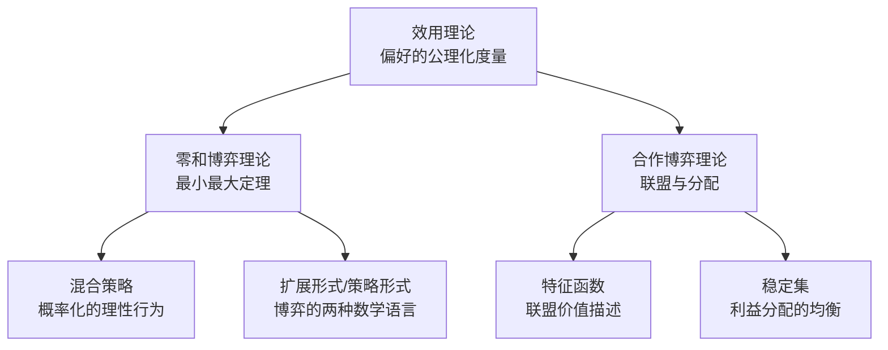

# 《博弈论》深度读书笔记

> [!abstract] 全书速览
> 这本书构建了一套关于"理性人如何在相互影响的决策中做出最优选择"的数学框架。冯·诺伊曼和摩根斯坦从零开始定义了"博弈"的数学语言，证明了零和博弈中必然存在最优策略，并将效用概念从模糊的哲学讨论推进为可度量的公理系统。它不仅是一本经济学著作，更是20世纪社会科学数学化的奠基之作，深刻改变了经济学、军事战略、政治学乃至生物学的思维方式。

## 这本书要解决什么经济问题

1944年，约翰·冯·诺伊曼和奥斯卡·摩根斯坦联合出版了《博弈论与经济行为》（Theory of Games and Economic Behavior），这本超过600页的巨著试图回答一个根本性的问题：==当经济决策的结果不仅取决于你自己的选择，还取决于其他人的选择时，"理性"到底意味着什么？==

> [!note] 学科背景
> 在此之前，经济学的主流分析框架是新古典经济学的完全竞争模型和垄断模型。在完全竞争中，每个人都是"价格接受者"，不需要考虑他人的策略；在垄断中，只有一个决策者。但现实世界的大量经济问题——寡头竞争、谈判、拍卖、联盟——都涉及少数几个决策者之间的互动博弈，而传统经济学对此束手无策。

要理解这个问题的分量，你得先看看1944年之前经济学面临的困境。自亚当·斯密以来，经济学发展出了两套核心分析框架：一是完全竞争模型，假设市场中有无数个微小的参与者，每个人都是"价格接受者"，你卖不卖无所谓，市场价格不会因你的决策而改变；二是垄断模型，市场里只有一个卖家，他面对的是一条需求曲线，本质上是一个单人优化问题。这两套框架在数学上都很成熟——前者用微积分求极值，后者用拉格朗日乘数法处理约束优化。

但问题在于，现实经济中最有意思、最关键的决策场景，恰恰落在这两个极端之间。寡头竞争——比如可口可乐和百事可乐、波音和空客之间的竞争——涉及的只是少数几个大玩家，每个人的决策都会显著影响其他人的结果。谈判——比如工会和资方的薪资谈判——结果取决于双方的策略选择和讨价还价能力。拍卖——比如政府拍卖无线电频谱——投标者必须猜测其他投标者的出价策略。对于这些"中间地带"的问题，传统经济学工具几乎完全失效。

古尔诺早在1838年就尝试分析双寡头竞争，伯特兰在1883年提出了价格竞争模型，但这些都是零星的、特定的模型，缺乏统一的理论框架。冯·诺伊曼的雄心远不止于解决某个具体的经济问题——他要建立一门全新的数学科学来处理整类"策略互动"问题。

冯·诺伊曼本人的背景决定了这个项目的独特性。他不是经济学家，而是20世纪最杰出的数学家之一，在集合论、量子力学数学基础、算子代数等领域都有奠基性贡献。他的核心主张是：经济学要成为真正的科学，就必须拥有像物理学那样严格的数学基础。当时的经济学虽然也使用数学，但大多是从物理学借来的工具——微积分、微分方程——这些工具是为描述单个主体的优化行为而设计的，根本不适合处理多个策略主体之间的互动。

摩根斯坦则从经济学家的角度补充了问题意识。他是维也纳大学出身的经济学家，深受奥地利学派传统影响，长期对经济学中"完美预见"假设的逻辑矛盾感到不安。他注意到，如果两个企业都能完美预见对方的行为，那就会陷入无限回归——你预见我的行为，我也预见你预见了我的行为，如此循环。这个逻辑困难需要一套全新的数学框架来解决。

两人在普林斯顿的合作产生了这部划时代的巨著。在经济学谱系中，这本书处于一个独特的位置——它既不属于亚当·斯密以来的古典传统，也不完全属于凯恩斯的宏观经济学路线，更不属于瓦尔拉斯一般均衡的传统。它开辟了一条全新的道路：用数学方法研究策略互动。这条道路后来由约翰·纳什、约翰·海萨尼、莱因哈德·泽尔腾等人发扬光大，成为现代经济学最重要的分析工具之一——如今的经济学博士项目中，博弈论是绝对的核心必修课。

## 核心模型地图

这本书的理论大厦建立在几个核心概念之上，它们彼此紧密关联，构成了一套完整的分析框架。理解这些概念之间的层级关系，是理解这本书最重要的一步。

> [!tip] 核心洞察
> ==效用理论==是整栋大厦的地基。冯·诺伊曼和摩根斯坦用一组严格的公理（完备性、传递性、连续性、独立性）来定义理性偏好，然后证明：满足这些公理的偏好一定可以用一个数值函数——效用函数——来表示。这意味着你可以给每个可能的结果赋予一个精确的数值，然后通过计算期望效用来做决策。没有这个基础，博弈论的收益矩阵就没有意义——你怎么比较不同策略组合下的好坏？

在效用理论的基础上，全书展开了两大核心模型。第一个是==零和博弈理论==，也就是"你的得就是我的失"的情形。冯·诺伊曼早在1928年就证明了著名的"最小最大定理"：在任何有限的两人零和博弈中，一定存在一个最优策略对，使得双方都不可能通过单方面改变策略来改善自己的处境。这是数学上最干净、最优美的结果，也是全书最坚实的理论成就。

第二个核心模型是==合作博弈理论==，处理的是参与者可以形成联盟、签订有约束力协议的情形。冯·诺伊曼和摩根斯坦引入了"特征函数"的概念来描述每个可能联盟的价值，然后研究稳定的利益分配方案。

连接这两大模型的桥梁是==博弈的表示方式==——扩展形式和策略形式。扩展形式用博弈树保留了时间结构和信息结构，策略形式用矩阵压缩了分析。冯·诺伊曼证明了两者的等价性，这意味着无论博弈的实际过程多么复杂，原则上都可以用矩阵工具来分析。

这三个部分——效用理论、零和博弈、合作博弈——构成了一个自下而上的理论体系。整个理论大厦的逻辑是严格递进的：没有效用度量就无法定义收益，没有收益定义就无法分析策略选择，没有策略分析就无法理解联盟与合作。

## 逐层深入

### 效用的精确化：从哲学概念到数学工具

经济学中的"效用"概念可以追溯到杰里米·边沁的功利主义哲学。边沁在18世纪末提出了"最大多数人的最大幸福"原则，隐含的假设是幸福可以被度量和加总。这个想法直觉上很吸引人，但经不起追问：你怎么衡量一个人从一块面包中获得的满足感？怎么比较不同人的满足感？

19世纪末，帕累托和希克斯等人发起了"序数效用革命"，否定了效用的可度量性。他们认为，经济学只需要"序数"信息——你偏好A胜过B，偏好B胜过C——而不需要"基数"信息——A比B好多少。这种序数效用观在无风险的消费者选择理论中运转良好，但一旦引入风险和不确定性——而现实中几乎所有重要的经济决策都涉及风险——序数效用就不够用了。

> [!example] 效用度量的关键技巧
> 冯·诺伊曼和摩根斯坦引入了"赌博"（彩票）的概念。假设你确定喜欢苹果胜过橙子，橙子胜过香蕉。那么问你：你是愿意确定地获得一个橙子，还是参加一个以50%概率获得苹果、50%概率获得香蕉的赌博？如果你选择橙子，说明对你来说，橙子和苹果之间的差距大于橙子和香蕉之间的差距。通过不断变换概率（60/40、70/30、80/20...），可以找到一个精确的概率值p，使得你对确定获得橙子和参加赌博无差异。这个概率p就编码了你对橙子的相对偏好强度。

他们提出了四条公理。**完备性公理**说你能对任意两个选项做出偏好判断。**传递性公理**说如果你偏好A胜过B，偏好B胜过C，那你一定偏好A胜过C。**连续性公理**说如果你偏好A胜过B胜过C，那一定存在某个A和C的概率组合让你恰好和B无差异。**独立性公理**说你对两个选项的偏好不应该因为掺入了第三个共同选项而改变。

他们证明了：只要你的偏好满足这四条公理，就一定存在一个效用函数u，使得你总是选择期望效用最高的选项。这个效用函数在线性变换下是唯一的——你可以改变原点和刻度（就像摄氏度和华氏度都能度量温度），但排序和比例关系不变。

这个结果的意义怎么强调都不过分。它把效用从一个不可度量的哲学概念变成了一个可以计算的数学工具。对博弈论而言这是至关重要的——因为要分析策略互动，你必须能够精确地描述每个玩家对不同结果的偏好强度，不仅仅是偏好排序。

> [!warning] 边界条件
> "独立性公理"后来遭遇了最严重的挑战。1953年，法国经济学家莫里斯·阿莱设计了著名的==阿莱悖论==。他让实验对象在两组选择中做决定。第一组：A是确定获得100万法郎，B是以10%概率获得500万、89%概率获得100万、1%概率什么也得不到。大多数人选A。第二组：C是以11%概率获得100万，D是以10%概率获得500万。大多数人选D。但同时选A和D恰恰违反了独立性公理。这揭示的是人们对"确定性"有特殊偏好——从确定变为99%概率，在心理上远比从11%变为10%更让人不安。这说明冯·诺伊曼-摩根斯坦的效用理论描述的是"理性人应该如何选择"的规范理论，而非"人们实际上如何选择"的描述理论。

### 零和博弈：最小最大定理的深意

零和博弈是最简单也最清晰的策略互动模型。想象两个人下棋、两支军队对抗、两家公司争夺一个固定大小的市场份额——一方所得恰好等于另一方所失。总收益之和始终为零。

为什么从零和博弈开始？因为它消除了一个巨大的复杂性：合作的可能性。在零和博弈中，你的利益和对手的利益完全对立，不存在"双赢"的可能。你只需要专注于一件事：在对手竭力伤害你的情况下，如何保护自己的利益。

冯·诺伊曼在1928年发表的论文中就证明了最小最大定理：在任何有限的两人零和博弈中，存在一个值V（博弈的"值"），玩家1可以保证自己的收益不低于V，玩家2也可以保证自己的损失不超过V。

你可以这样直觉地理解：假设你是玩家1，你假设对手极其聪明并且在竭力让你输。对于你的每个策略，找出对手能给你造成的最差结果，然后选择"最差结果最好"的策略——最大化最小收益。反过来，玩家2也在做同样的事。冯·诺伊曼证明的核心结果是：==在允许混合策略的情况下，这两个值一定相等==——博弈有一个确定的"值"。

> [!tip] 混合策略的洞察
> 最小最大定理的证明需要引入"混合策略"——以概率分布来随机选择行动。考虑石头剪刀布：如果你固定出石头，对手就出布；任何确定的选择都会被利用。但如果以各1/3的概率出三种选择，对手无论怎么出，你的期望收益都是零。==在策略互动中，让自己的行为不可预测可以是一种理性的优势。==就像扑克中的诈唬——最优策略是以某个精心计算的概率来诈唬，让对手无法从你的行为中获取信息。

冯·诺伊曼本人就是一个出色的扑克玩家。据他的同事回忆，他对扑克的兴趣不在于赌博本身，而在于理解"在信息不完全的情况下如何做出最优决策"。他关于博弈论的最初灵感正是来自扑克而非象棋——象棋虽然复杂，但本质上是完美信息博弈，不需要诈唬和混合策略。

最小最大定理给零和博弈提供了明确的"答案"，但适用范围有限——现实中纯粹的零和博弈并不多见。大多数经济互动都包含共赢或共输的可能性。不过，作为理论的起点，零和博弈的干净结果提供了宝贵的基准和方法论范式。

### 扩展形式与策略形式：博弈的两种语言

冯·诺伊曼和摩根斯坦为描述博弈开发了两套数学语言，每一套都有独特的优势和局限。

"扩展形式"用博弈树来描述博弈，保留了时间顺序和信息结构。以井字棋为例，第一步有9种可能，对方根据你的第一步有8种可能的回应，整个博弈过程就是一棵巨大的树。扩展形式通过"信息集"的概念精确描述了玩家在每一步知道什么、不知道什么。

"策略形式"则把博弈压缩为一个矩阵，更便于分析均衡。这里的"策略"不是单个行动，而是一个完整的行动计划——对每个可能的情况预先规定好怎么做。

他们证明了两者的等价性：任何扩展形式博弈都可以转化为策略形式来分析。但这种转化有代价——策略形式丢失了关于"可信承诺"和"子博弈完美性"的信息。举例：一个在位企业威胁"如果你进入市场，我就发动价格战"。在策略形式中这看似均衡，但在扩展形式的博弈树中，你会发现这个威胁不可信——如果进入者真的进入了，发动价格战对在位企业自身也有害。塞尔腾后来提出的"子博弈完美均衡"正是为了解决这个问题。

### 合作博弈与联盟

本书的后半部分转向合作博弈——参与者可以互相沟通、形成联盟、签订有约束力协议的情形。冯·诺伊曼和摩根斯坦引入了"特征函数"v(S)：对于每个可能的联盟S，v(S)表示这个联盟所能获得的最大总收益。核心问题是：如果大联盟形成了，收益应该如何分配？

这个问题之所以困难，是因为每个参与者都有"退出选项"——如果不满意当前分配，可以威胁退出组建小联盟。分配方案必须让每个可能的联盟都没有动机脱离大联盟。

> [!note] 稳定集的概念
> 他们提出的解概念是"稳定集"——一组利益分配方案的集合，满足两个条件：(1)内部稳定性——集合内的任何两个方案互不支配；(2)外部稳定性——集合外的任何方案都被集合内的某个方案支配。直觉上，稳定集描述了一种"社会规范"——如果大家都遵守规范，没有人有动力偏离；如果有人偏离了，总有一群人会联合起来反对。

但稳定集可能不唯一（对应不同的"社会规范"），甚至可能不存在（卢卡斯1969年构造了反例）。尽管如此，这个框架启发了后来的许多重要概念：劳埃德·沙普利1953年提出的"沙普利值"给出了每个参与者"边际贡献"的加权平均，"核心"概念描述了没有联盟有动机脱离大联盟的分配方案集合。

### 多人博弈中的联盟动力学

当参与者超过两人时，博弈变得质地截然不同。一个最经典的例子：三个参与者A、B、C投票分配100元，多数决原则。A和B结盟各分50元——但C可以拉拢B提议B拿60元、C拿40元。B背叛A后，A又可以去拉拢C......循环往复，没有稳定联盟。

> [!tip] 深刻洞见
> ==在多方博弈中，权力往往不在于你拥有什么，而在于你能与谁结盟。==一个单独来看很弱的参与者，如果处于关键的"平衡者"位置，可能拥有不成比例的议价能力。以色列政治中，极端正统派小党经常在联合政府中获得超额影响力，因为大党争相与之结盟。冷战期间的不结盟运动国家利用美苏争夺获得了超出国力的国际影响力。在商业世界中，拥有关键技术的小公司可能成为大企业争相合作的对象。

冯·诺伊曼和摩根斯坦还分析了"独裁者博弈"和"否决权博弈"等特殊情形，为后来的投票理论和权力指数（如沙普利-舒比克权力指数和班扎夫权力指数）奠定了理论基础。

### 信息的角色

在"完美信息"博弈中（如象棋），每个玩家在做决策时都知道之前发生的一切。在"不完美信息"博弈中（如扑克），玩家不知道某些过去的行动。冯·诺伊曼证明：在有限的完美信息博弈中，一定存在纯策略的最优解——理论上象棋有确定结果，只是博弈树太大（局面数超过10^43）无法穷举。不完美信息博弈则需要混合策略，因为信息缺失创造了欺骗和推断的空间。

他们还将"偶然事件"（掷骰子、发牌）形式化为"自然"玩家的行动，把随机性纳入了博弈论的统一框架。

注意"不完美信息"和"不完全信息"是不同的概念：前者是你不知道对手过去做了什么（扑克），后者是你不知道对手的"类型"是什么——比如你不知道谈判对手有多急于达成协议。海萨尼在1967-68年用贝叶斯方法解决了不完全信息博弈的建模问题，为此获得了1994年的诺贝尔经济学奖。

## 预测与现实

**军事战略领域**：博弈论在冷战期间成为美国兰德公司和国防部的核心分析工具。1950年代兰德公司汇聚了一批博弈论家——包括约翰·纳什本人。核威慑战略（MAD）本质上就是博弈论分析的结果：双方都有足够的二次打击能力，先发制人不是最优策略。不过越战的教训提醒你：博弈论分析的质量高度依赖于对参与者偏好的准确判断。

**拍卖机制设计**：1994年FCC的频谱拍卖采用了博弈论家米尔格罗姆和威尔逊设计的"同步多轮升价拍卖"机制，创造了超过700亿美元的收入。2020年诺贝尔经济学奖颁给了他们的拍卖理论贡献。

> [!warning] 效用理论的实证挑战
> 除了阿莱悖论，卡尼曼和特沃斯基的==前景理论==（1979年）提供了更全面的替代框架：==损失厌恶==（对损失比等量收益更敏感，约2倍）、==概率加权==（对小概率事件赋予过高权重）、==参照点依赖==（效用由相对变化而非绝对水平决定）。冯·诺伊曼-摩根斯坦效用理论是优秀的规范理论，但不是准确的描述理论。

**合作博弈领域**：稳定集虽然优美，但在应用中被沙普利值和核心概念取代。不过，联盟形成的分析在政治学中广泛应用。威廉·赖克1962年的《政治联盟理论》直接建立在冯·诺伊曼-摩根斯坦的框架之上。

总体而言，这本书的最大贡献不在于具体解概念有多完美，而在于创立了一整套研究策略互动的数学语言和分析框架。正如保罗·萨缪尔森所说，冯·诺伊曼和摩根斯坦的书"改变了经济理论的分析工具包"。

## 不同学派怎么说

**纳什的非合作博弈论路线**：约翰·纳什在1950年（22岁时）在博士论文中提出了"纳什均衡"，适用范围比最小最大定理更广——不限于零和博弈，也不需要假设参与者可以签订协议。纳什用不动点定理证明了均衡在所有有限博弈中都存在。据说冯·诺伊曼评价它"只是一个不动点定理的应用"，但历史证明纳什均衡具有无与伦比的普适性。参见 [[《策略思维》 - 阿维纳什·K·迪克西特&巴里·J·奈尔伯夫]]。

**行为经济学派**：赫伯特·西蒙的"有限理性"和实验博弈论的大量实验表明，人们的实际行为经常偏离理论预测。最后通牒博弈中，提议者平均给出30-40%，低于20%的提议经常被拒绝——"公平"在效用函数中占有重要地位，标准博弈论未能捕捉。参见 [[《思考，快与慢》 - 丹尼尔·卡尼曼]]。

**演化博弈论**：约翰·梅纳德·史密斯提出了"演化稳定策略"（ESS），在演化框架下，均衡不因参与者的"计算"而达到，而是通过自然选择被保留——好策略的个体繁殖更多，坏策略的逐渐被淘汰。鹰鸽博弈解释了为什么动物争夺资源时经常使用"仪式化对抗"而非真正搏斗——这是演化稳定的混合策略均衡。

**奥地利学派**：米塞斯和哈耶克从根本上质疑用数学模型分析人类行为的可能性，认为企业家的创造性行为无法在博弈论框架内捕捉——你怎么用博弈矩阵描述一个尚未被发明的产品？哈耶克进一步指出市场知识是分散的、默会的，不可能集中到博弈矩阵中。博弈论假设"游戏规则"已知，但真实市场中"游戏"本身在不断被重新定义。

## 对你意味着什么

你会学会"换位思考的严格化"——在做决策之前，先把自己放到对手的位置，想想对手面对你的选择时会怎么做。下次谈判、竞标或求职面试时，试着画出一个简单的博弈矩阵——你的选项列成行，对方的反应列成列，每格填入双方大致收益。你可能会发现，最直觉上"好"的选择并不是博弈均衡中的最优选择。

你会理解为什么"承诺"有时比"灵活性"更有价值。不可逆的承诺改变了对手的预期，从而改变了博弈的均衡。科尔特斯烧船、企业的大额固定投资、公开的战略声明，都是博弈论意义上的"承诺装置"。

你会理解"混合策略"思维的价值——面对聪明的对手时，让自己的行为不完全可预测可以改善你的博弈地位。

你会对"理性"有更深的理解——它不是"自私"或"冷酷"，只是偏好的一致性。一个利他主义者如果始终如一地按照利他偏好做决策，在冯·诺伊曼的框架中完全是"理性的"。关键不在于假设他人是自私的，而在于理解他人的偏好结构然后预测其行为。

## 延伸阅读

- [[《策略思维》 - 阿维纳什·K·迪克西特&巴里·J·奈尔伯夫]]：博弈论最好的通俗入门书，用日常案例讲解核心概念，完全不需要数学基础
- 《博弈论基础》（奥斯本和鲁宾斯坦）：经典研究生教材，系统介绍从纳什均衡到不完全信息博弈的完整理论
- [[《合作的进化》]]（阿克塞尔罗德）：专注于重复博弈中合作如何涌现，是对冯·诺伊曼合作博弈分析的实验性延伸
- 梅纳德·史密斯的《演化与博弈论》：展示了博弈论在生物学中的应用，解释动物行为和生态系统的演化动力学
