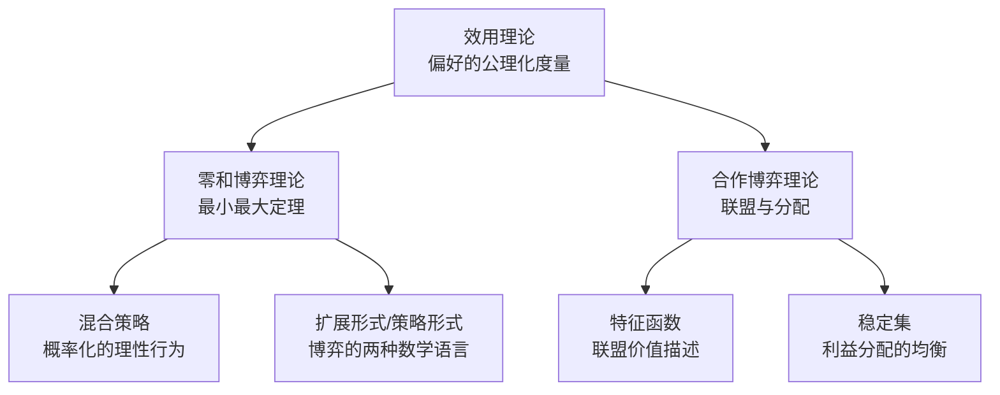

# 《博弈论》深度读书笔记

> [!abstract] 全书速览
> 这本书构建了一套关于"理性人如何在相互影响的决策中做出最优选择"的数学框架。冯·诺伊曼和摩根斯坦从零开始定义了"博弈"的数学语言，证明了零和博弈中必然存在最优策略，并将效用概念从模糊的哲学讨论推进为可度量的公理系统。它不仅是一本经济学著作，更是20世纪社会科学数学化的奠基之作，深刻改变了经济学、军事战略、政治学乃至生物学的思维方式。

## 这本书要解决什么经济问题

1944年，约翰·冯·诺伊曼和奥斯卡·摩根斯坦联合出版了《博弈论与经济行为》（Theory of Games and Economic Behavior），这本超过600页的巨著试图回答一个根本性的问题：==当经济决策的结果不仅取决于你自己的选择，还取决于其他人的选择时，"理性"到底意味着什么？==

> [!note] 学科背景
> 在此之前，经济学的主流分析框架是新古典经济学的完全竞争模型和垄断模型。在完全竞争中，每个人都是"价格接受者"，不需要考虑他人的策略；在垄断中，只有一个决策者。但现实世界的大量经济问题——寡头竞争、谈判、拍卖、联盟——都涉及少数几个决策者之间的互动博弈，而传统经济学对此束手无策。

冯·诺伊曼的雄心是建立一门全新的数学科学来处理这类"策略互动"问题。他的核心主张是：经济学要成为真正的科学，就必须拥有像物理学那样严格的数学基础。而博弈论就是为经济学提供这一数学基础的尝试。

在经济学谱系中，这本书处于一个独特的位置——它既不属于亚当·斯密以来的古典传统，也不完全属于凯恩斯的宏观经济学路线。它开辟了一条全新的道路：用数学方法研究策略互动。这条道路后来由约翰·纳什、约翰·海萨尼、莱因哈德·泽尔腾等人发扬光大，成为现代经济学最重要的分析工具之一。

## 核心模型地图

这本书的理论大厦建立在几个核心概念之上，它们彼此紧密关联，构成了一套完整的分析框架。

> [!tip] 核心洞察
> ==效用理论==是整栋大厦的地基。冯·诺伊曼和摩根斯坦用一组严格的公理（完备性、传递性、连续性、独立性）来定义理性偏好，然后证明：满足这些公理的偏好一定可以用一个数值函数——效用函数——来表示。这意味着你可以给每个可能的结果赋予一个精确的数值，然后通过计算期望效用来做决策。

在效用理论的基础上，全书展开了两大核心模型。第一个是==零和博弈理论==，也就是"你的得就是我的失"的情形。冯·诺伊曼早在1928年就证明了著名的"最小最大定理"：在任何有限的两人零和博弈中，一定存在一个最优策略对，使得双方都不可能通过单方面改变策略来改善自己的处境。

第二个核心模型是==合作博弈理论==，处理的是参与者可以形成联盟、签订有约束力协议的情形。冯·诺伊曼和摩根斯坦引入了"特征函数"的概念来描述每个可能联盟的价值，然后研究稳定的利益分配方案。

## 逐层深入

### 效用的精确化：从哲学概念到数学工具

经济学中的"效用"概念可以追溯到杰里米·边沁的功利主义哲学，但长期以来它一直是一个模糊的概念——你怎么衡量一个人从一块面包中获得的满足感？19世纪末的序数效用革命否定了效用的可度量性，认为我们只能说"A比B好"，不能说"A比B好多少"。

> [!example] 效用度量的关键技巧
> 冯·诺伊曼和摩根斯坦引入了"赌博"（彩票）的概念。假设你确定喜欢苹果胜过橙子，橙子胜过香蕉。那么问你：你是愿意确定地获得一个橙子，还是参加一个以50%概率获得苹果、50%概率获得香蕉的赌博？你的回答揭示了你对这些结果的相对偏好强度。

他们证明了：只要你的偏好满足几条合理的公理，就一定存在一个效用函数，使得你总是选择期望效用最高的选项。这个效用函数在线性变换下是唯一的。

> [!warning] 边界条件
> "独立性公理"——你对两个赌博的偏好不应该受到第三个无关选项的影响——后来被==阿莱悖论==所挑战。莫里斯·阿莱在1953年设计了一个巧妙的实验，表明人们在面对确定性和不确定性时的选择经常违反独立性公理。这说明冯·诺伊曼-摩根斯坦的效用理论描述的是"理性人应该如何选择"，而非"人们实际上如何选择"。

### 零和博弈：最小最大定理的深意

零和博弈是最简单也最清晰的策略互动模型。想象两个人下棋、两支军队对抗、两家公司争夺一个市场份额——一方所得恰好等于另一方所失。

冯·诺伊曼在1928年证明的最小最大定理说：在任何有限的两人零和博弈中，存在一个值V（博弈的"值"），玩家1可以保证自己的收益不低于V，玩家2也可以保证自己的损失不超过V。实现这一点的策略就是"最小最大策略"——最大化你在最坏情况下的收益。

> [!tip] 混合策略的洞察
> 最小最大定理的证明需要引入"混合策略"——以概率分布来随机选择行动。在石头剪刀布中以各1/3的概率出三种选择，就是一个最小最大策略。==在策略互动中，让自己的行为不可预测可以是一种理性的优势。==就像扑克中的诈唬——最优策略是以某个精心计算的概率来诈唬，让对手无法从你的行为中获取信息。

### 扩展形式与策略形式：博弈的两种语言

冯·诺伊曼和摩根斯坦为描述博弈开发了两套数学语言。"扩展形式"用博弈树来描述博弈，保留了时间顺序；"策略形式"把博弈压缩为矩阵，便于分析均衡。他们证明了两者的等价性：任何扩展形式博弈都可以转化为策略形式来分析。

不过，这种转化有代价——策略形式丢失了关于"可信承诺"和"子博弈完美性"的信息。这些后来被泽尔腾等人补充完善。

### 合作博弈与联盟

本书的后半部分转向合作博弈。冯·诺伊曼和摩根斯坦引入了"特征函数"v(S)来描述合作博弈：对于每个可能的联盟S，v(S)表示这个联盟所能获得的最大总收益。

> [!note] 稳定集的概念
> 他们提出的解概念是"稳定集"——一组利益分配方案的集合，其中没有任何方案会被集合内的另一个方案所"支配"，且集合外的任何方案都被集合内的某个方案支配。直觉上，稳定集描述了一种"社会规范"——在这种规范下，任何偏离都会被拉回来。

### 多人博弈中的联盟动力学

当参与者超过两人时，博弈变得质地截然不同。一个典型的例子：三个参与者需要投票决定如何分配100元，多数决原则。任何两个人形成联盟都可以独占100元，而第三个人什么也得不到。但无论哪两个人结盟，第三个人都可以通过给对方更好的条件来拆散联盟。

> [!tip] 深刻洞见
> ==在多方博弈中，权力往往不在于你拥有什么，而在于你能与谁结盟。==一个单独来看很弱的参与者，如果处于关键的"平衡者"位置，可能拥有不成比例的议价能力。

### 信息的角色

在"完美信息"博弈中（如象棋），每个玩家在做决策时都知道之前发生的一切。在"不完美信息"博弈中（如扑克），玩家不知道某些过去的行动。冯·诺伊曼证明：在有限的完美信息博弈中，一定存在纯策略的最优解；不完美信息博弈则需要混合策略。

## 预测与现实

**军事战略领域**：博弈论在冷战期间成为美国兰德公司和国防部的核心分析工具。核威慑战略（MAD）本质上就是一个博弈论分析的结果。

**拍卖机制设计**：1994年FCC的频谱拍卖采用了博弈论家设计的机制，创造了超过700亿美元的收入。2020年诺贝尔经济学奖颁给了米尔格罗姆和威尔逊的拍卖理论贡献。

> [!warning] 效用理论的实证挑战
> 卡尼曼和特沃斯基的==前景理论==（1979年）证明，人们实际的风险决策系统性地偏离期望效用理论：损失厌恶和概率加权是普遍现象。冯·诺伊曼-摩根斯坦效用理论是优秀的规范理论，但不是准确的描述理论。

**合作博弈领域**：稳定集虽然优美，但在应用中被后来的沙普利值和核心概念所取代。不过，联盟形成的分析在政治学中得到了广泛应用。

## 不同学派怎么说

**纳什的非合作博弈论路线**：约翰·纳什在1950年提出了"纳什均衡"，适用范围比最小最大定理更广——不限于零和博弈，也不需要假设参与者可以签订协议。纳什的路线后来成为博弈论的主流。参见 [[《策略思维》 - 阿维纳什·K·迪克西特&巴里·J·奈尔伯夫]]。

**行为经济学派**：赫伯特·西蒙的"有限理性"和实验博弈论的大量实验表明，人们在博弈中的实际行为经常偏离理论预测。参见 [[《思考，快与慢》 - 丹尼尔·卡尼曼]]。

**演化博弈论**：约翰·梅纳德·史密斯提出了"演化稳定策略"（ESS），在演化框架下，均衡不因参与者的"计算"而达到，而是通过自然选择被保留。

**奥地利学派**：米塞斯和哈耶克从根本上质疑用数学模型分析人类行为的可能性，认为企业家的创造性行为无法在博弈论框架内捕捉。

## 对你意味着什么

你会学会"换位思考的严格化"——在做决策之前，先把自己放到对手的位置，想想对手面对你的选择时会怎么做。下次谈判或竞标时，试着画出一个简单的博弈矩阵，你可能会发现完全不同的策略选择。

你会理解为什么"承诺"有时比"灵活性"更有价值。不可逆的承诺改变了对手的预期，从而改变了博弈的均衡。

你会对"理性"有更深的理解——它不是"自私"或"冷酷"，只是偏好的一致性。理解这一点，可以帮你更准确地预判他人的行为。

## 延伸阅读

- [[《策略思维》 - 阿维纳什·K·迪克西特&巴里·J·奈尔伯夫]]：博弈论最好的通俗入门书，用日常案例讲解核心概念，完全不需要数学基础
- 《博弈论基础》（奥斯本和鲁宾斯坦）：经典研究生教材，系统介绍从纳什均衡到不完全信息博弈的完整理论
- [[《合作的进化》]]（阿克塞尔罗德）：专注于重复博弈中合作如何涌现，是对冯·诺伊曼合作博弈分析的实验性延伸
